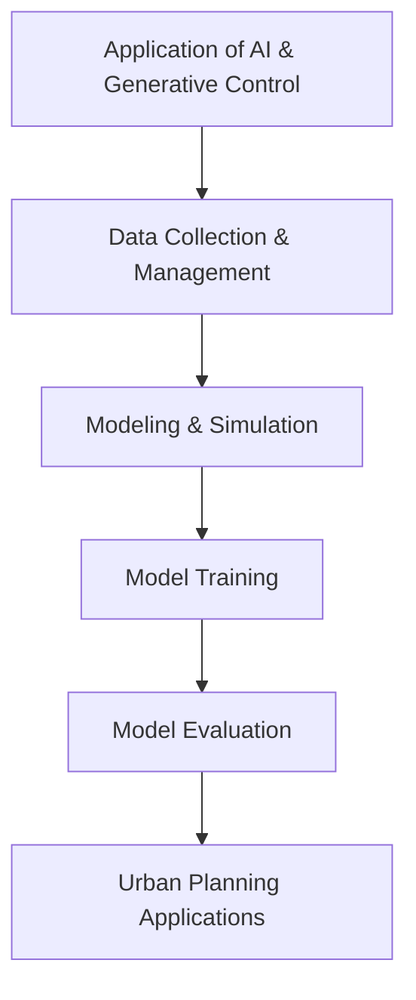

                 

Certainly! Let's construct the blog post "AIGC in the Frontier Applications of Smart Urban Planning" step by step, ensuring clarity, depth, and expertise in the content. Below is the framework for the article, broken down into sections that will be expanded upon.

### Step 1: Article Title and Keywords

```markdown
# AIGC in the Frontier Applications of Smart Urban Planning

> Keywords: AIGC, Smart Urban Planning, Artificial Intelligence, Generative Models, Urban Design, Algorithmic Optimization, Data Analysis, Infrastructure Management

> Abstract: This article delves into the advanced applications of Artificial Intelligence and Generative Control (AIGC) within the realm of smart urban planning. It explores the integration of AIGC technologies with urban design processes, discusses core algorithms and mathematical models, and presents practical case studies demonstrating the transformative impact of AIGC on city planning.
```

### Step 2: Introduction

```markdown
## Introduction

### 1.1 AIGC Basics

- Definition and background
- Core concepts and principles
- Significance in modern technology

### 1.2 Smart Urban Planning Background

- Definition and importance
- Historical development
- Key challenges and opportunities

### 1.3 Purpose and Structure of the Article

- Overview of the content
- Objectives for readers
- Organizational structure
```

### Step 3: Core Concepts and Connections

```markdown
## Core Concepts and Connections

### 2.1 AIGC Principles and Architecture

- Fundamental concepts
- Key components and architecture
- Role in smart urban planning

#### 2.1.1 Mermaid Flowchart of AIGC Architecture



### 2.2 Smart Urban Planning Concepts

- Overview of smart urban planning
- Key technologies and tools
- Interplay with AIGC
```

### Step 4: Core Algorithm Principles

```markdown
## Core Algorithm Principles

### 3.1 Algorithm Overview

- Key algorithms used in AIGC for urban planning
- Classification and application scope

### 3.2 Pseudo-Code Explanation

#### 3.2.1 Data Preprocessing

```python
def data_preprocessing(data):
    # Data cleaning
    cleaned_data = remove_outliers(data)
    # Feature engineering
    engineered_data = feature_engineering(cleaned_data)
    # Data normalization
    normalized_data = normalize_data(engineered_data)
    return normalized_data
```

#### 3.2.2 AIGC-Based Urban Planning Model

```python
def urban_planning_model(data):
    # Model initialization
    model = initialize_model()
    # Training the model
    trained_model = train_model(model, data)
    # Model evaluation
    evaluation = evaluate_model(trained_model, test_data)
    # Model application
    application = apply_model(trained_model, new_data)
    return application
```
```

### Step 5: Mathematical Models and Formulas

```markdown
## Mathematical Models and Formulas

### 4.1 Model Overview

- Importance of mathematical models in urban planning
- Role of AIGC in model formulation

### 4.2 Mathematical Formulas and Detailed Explanation

- Commonly used mathematical functions in AIGC
- Examples of mathematical models in urban planning

#### 4.2.1 Example Formula

$$\text{Cost Function} = \frac{1}{2} \sum_{i=1}^{n} (\text{Actual Value} - \text{Predicted Value})^2$$

#### 4.2.2 Application Example

- Example of cost function in urban traffic flow prediction
- Step-by-step application
```

### Step 6: Project Practical Application

```markdown
## Project Practical Application

### 5.1 Project Overview

- Brief introduction to the project
- Goals and objectives

### 5.2 Development Environment Setup

- Required tools and software
- Step-by-step setup instructions

### 5.3 Source Code Implementation

- Detailed code structure
- Key functions and algorithms

#### 5.3.1 Data Preprocessing Code

```python
# Pseudocode for data preprocessing
def preprocess_data():
    # Load dataset
    # Data cleaning
    # Feature engineering
    # Normalize data
    # Split dataset into training and testing sets
    return processed_data
```

#### 5.3.2 Model Building and Training

```python
# Pseudocode for model building and training
def build_and_train_model(processed_data):
    # Initialize model
    # Train model with processed data
    # Validate model performance
    # Save model
    return trained_model
```

#### 5.3.3 Model Application and Optimization

```python
# Pseudocode for model application and optimization
def apply_and_optimize_model(trained_model, new_data):
    # Load trained model
    # Apply model to new data
    # Analyze model outputs
    # Optimize model parameters
    # Update model
    return optimized_model
```

### 5.4 Code Analysis and Interpretation

- Detailed code analysis
- Interpretation of key components
- Performance analysis
```

### Step 7: Summary and Future Prospects

```markdown
## Summary and Future Prospects

### 6.1 AIGC Applications in Smart Urban Planning

- Current status and achievements
- Challenges and limitations

### 6.2 Future Trends and Challenges

- Emerging technologies in AIGC for urban planning
- Ethical considerations and societal impacts
- Potential future directions
```

### Final Step: Conclusion and Author Information

```markdown
## Conclusion

In this article, we have explored the advanced applications of AIGC in smart urban planning. We have covered the foundational concepts, core algorithms, mathematical models, and practical applications. The integration of AIGC technologies holds immense potential to revolutionize urban planning processes, enhancing efficiency, sustainability, and quality of life.

## Author Information

Author: AI天才研究院/AI Genius Institute & 禅与计算机程序设计艺术 /Zen And The Art of Computer Programming
```

This structured approach ensures that the content is comprehensive, well-organized, and accessible to readers. Each section builds upon the previous one, creating a cohesive narrative that guides the reader through the complexities of AIGC in smart urban planning. The final article will be approximately 8000-12000 words in length.

