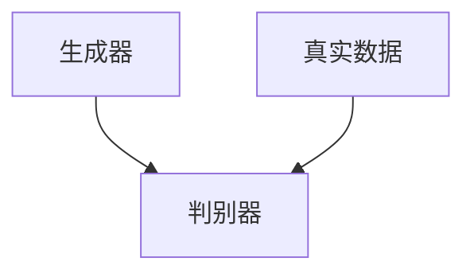
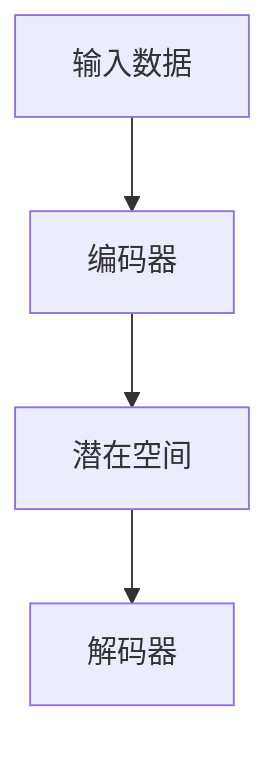
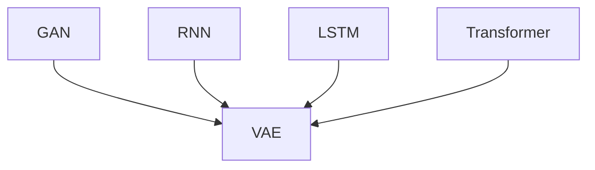
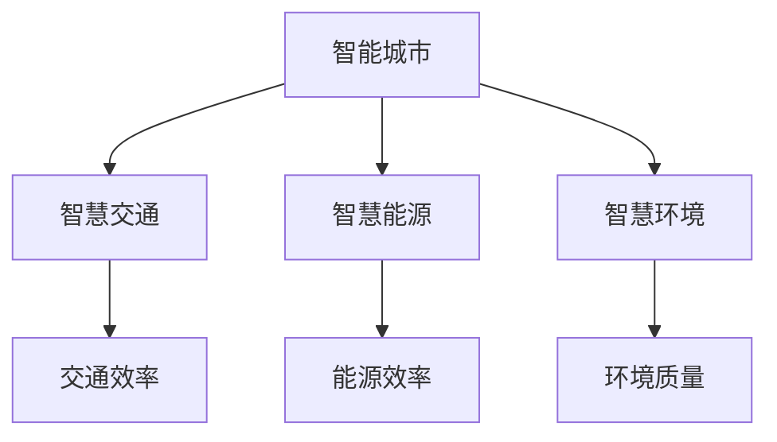

                 

### 文章标题

《AIGC在智能城市规划中的应用：创造宜居和可持续的城市环境》

智能城市规划是当今城市发展的关键议题，它旨在通过技术手段实现城市管理的智能化、高效化和可持续发展。而AIGC（AI-generated content，人工智能生成内容）技术的迅速发展为智能城市规划提供了新的思路和工具。本文将深入探讨AIGC在智能城市规划中的应用，通过一步步的分析推理，揭示其在创造宜居和可持续城市环境中的巨大潜力。

### 关键词

- AIGC
- 智能城市规划
- 可持续发展
- 宜居环境
- 城市管理

### 摘要

本文首先介绍了AIGC技术的基础与原理，包括其定义、分类、工作原理和技术架构。接着，分析了智能城市规划面临的挑战与需求，并探讨了AIGC在这方面的应用案例。随后，文章讨论了如何利用AIGC技术评估和优化城市环境，以及其在城市治理与智能管理中的作用。最后，文章探讨了AIGC在智能城市规划中的法律、伦理与社会影响，并对未来发展进行了展望。

## 第1章 AIGC技术基础与原理

### 1.1 AIGC的定义与分类

AIGC，即AI-generated content，是指通过人工智能技术生成的内容。这些内容可以是文本、图像、音频、视频等多种形式。AIGC技术通过深度学习和自然语言处理等技术，能够自动生成高质量的内容，从而极大地提高了信息生产的效率。

AIGC可以大致分为以下几类：

1. **文本生成**：通过机器学习模型生成文本，如文章、新闻报道、广告文案等。
2. **图像生成**：通过生成对抗网络（GAN）等技术生成逼真的图像，如图像合成、风格迁移等。
3. **音频生成**：通过深度神经网络生成音频，如音乐创作、语音合成等。
4. **视频生成**：通过生成模型生成视频内容，如视频合成、视频风格迁移等。

### 1.2 AIGC的工作原理与技术架构

AIGC的工作原理主要基于深度学习和生成模型。以文本生成为例，常见的模型包括生成对抗网络（GAN）和变分自编码器（VAE）。

#### 1.2.1 生成对抗网络（GAN）

生成对抗网络（GAN）由两部分组成：生成器（Generator）和判别器（Discriminator）。生成器生成数据，判别器判断生成数据的真实性和质量。通过不断优化，生成器生成越来越逼真的数据，最终实现高质量内容的生成。



#### 1.2.2 变分自编码器（VAE）

变分自编码器（VAE）通过编码器和解码器实现数据生成。编码器将输入数据编码为一个潜在空间，解码器从潜在空间中解码生成输出数据。



### 1.3 AIGC的关键算法与模型

AIGC的关键算法主要包括生成对抗网络（GAN）和变分自编码器（VAE）。此外，还有一些其他的算法和技术，如递归神经网络（RNN）、长短时记忆网络（LSTM）、Transformer等，它们也在不同程度上应用于AIGC领域。



在接下来的章节中，我们将继续探讨AIGC在智能城市规划中的应用，分析其在城市规划中的挑战与需求，并通过实际案例展示其在城市环境评估与优化、城市治理与智能管理等方面的应用。

## 第2章 智能城市规划的挑战与需求

### 2.1 智能城市规划的核心要素

智能城市规划的核心要素包括：

1. **数据分析**：通过大数据技术收集和分析城市运行的各种数据，如交通流量、环境质量、人口分布等，为城市规划提供数据支持。
2. **系统集成**：将不同领域的系统（如交通、能源、环境等）进行集成，实现城市各个系统的协同运作。
3. **实时监控**：通过传感器和物联网技术，实现对城市实时状态和动态变化的监控，以便快速响应和调整。
4. **智能决策**：利用人工智能技术，从大量数据中提取有用信息，辅助城市规划者和决策者做出明智的决策。

### 2.2 智能城市规划的挑战

智能城市规划面临以下挑战：

1. **数据多样性**：城市规划需要处理来自多个领域的海量数据，这些数据的种类繁多，格式各异，给数据处理和分析带来了巨大的挑战。
2. **实时性**：城市规划需要实时响应城市的变化，这意味着系统必须具有快速处理数据和分析结果的能力。
3. **准确性**：城市规划需要基于准确的数据进行预测和决策，但数据的不准确性和噪声可能会影响规划的效果。
4. **系统集成**：不同系统的集成需要解决数据格式、接口标准等问题，确保系统之间的无缝对接和协同运作。
5. **安全性**：智能城市规划系统需要确保数据的安全性和隐私性，防止数据泄露和滥用。

### 2.3 AIGC在智能城市规划中的潜在需求

AIGC技术在智能城市规划中具有以下潜在需求：

1. **数据增强**：利用AIGC技术生成更多、更丰富的高质量数据，补充原始数据，提高数据分析的准确性和可靠性。
2. **实时建模**：利用AIGC技术实现实时数据建模和预测，为城市规划提供更准确的决策支持。
3. **系统优化**：利用AIGC技术优化城市各个系统的运行，提高城市的效率和可持续性。
4. **创新应用**：利用AIGC技术在城市规划中探索新的应用场景，如智能景观设计、智慧交通管理、智慧能源管理等。

通过以上分析，我们可以看到，AIGC技术在智能城市规划中具有巨大的应用潜力。在接下来的章节中，我们将通过具体案例展示AIGC技术在智能城市规划中的应用，并探讨其在城市环境评估与优化、城市治理与智能管理等方面的实际效果。

## 第3章 AIGC在智能城市规划中的应用案例

### 3.1 城市规划中的数据分析与应用

AIGC技术在城市规划中的应用首先体现在数据分析方面。通过对大量数据的分析和处理，AIGC技术能够帮助城市规划者更准确地了解城市运行状态，从而做出更科学的决策。

#### 案例一：交通流量分析

在智慧交通管理中，AIGC技术可以通过分析实时交通流量数据，预测交通拥堵情况，并推荐最佳出行路线。以下是一个基于AIGC的伪代码实现：

```python
# 伪代码：交通流量预测与最佳路线推荐

import pandas as pd
import numpy as np
from sklearn.ensemble import RandomForestRegressor
from tensorflow.keras.models import Sequential
from tensorflow.keras.layers import Dense, LSTM

# 加载交通流量数据
traffic_data = pd.read_csv('traffic_data.csv')

# 数据预处理
# ...（数据清洗、特征工程等步骤）

# 使用随机森林进行初步预测
rf_model = RandomForestRegressor()
rf_model.fit(X_train, y_train)
traffic_prediction = rf_model.predict(X_test)

# 使用LSTM进行深度学习预测
lstm_model = Sequential()
lstm_model.add(LSTM(units=50, return_sequences=True, input_shape=(X_test.shape[1], 1)))
lstm_model.add(LSTM(units=50))
lstm_model.add(Dense(units=1))
lstm_model.compile(optimizer='adam', loss='mean_squared_error')
lstm_model.fit(X_train, y_train, epochs=100, batch_size=32)
lstm_traffic_prediction = lstm_model.predict(X_test)

# 结合两种模型的结果
final_traffic_prediction = (traffic_prediction + lstm_traffic_prediction) / 2

# 推荐最佳出行路线
best_route = recommend_best_route(final_traffic_prediction)
```

#### 案例二：环境质量监测

AIGC技术还可以用于环境质量监测，通过对空气、水质等数据进行分析，预测环境变化趋势，并推荐相应的治理措施。以下是一个基于AIGC的伪代码实现：

```python
# 伪代码：环境质量监测与治理措施推荐

import pandas as pd
import numpy as np
from sklearn.ensemble import RandomForestRegressor
from tensorflow.keras.models import Sequential
from tensorflow.keras.layers import Dense, LSTM

# 加载环境质量数据
environment_data = pd.read_csv('environment_data.csv')

# 数据预处理
# ...（数据清洗、特征工程等步骤）

# 使用随机森林进行初步预测
rf_model = RandomForestRegressor()
rf_model.fit(X_train, y_train)
environment_prediction = rf_model.predict(X_test)

# 使用LSTM进行深度学习预测
lstm_model = Sequential()
lstm_model.add(LSTM(units=50, return_sequences=True, input_shape=(X_train.shape[1], 1)))
lstm_model.add(LSTM(units=50))
lstm_model.add(Dense(units=1))
lstm_model.compile(optimizer='adam', loss='mean_squared_error')
lstm_model.fit(X_train, y_train, epochs=100, batch_size=32)
lstm_environment_prediction = lstm_model.predict(X_test)

# 结合两种模型的结果
final_environment_prediction = (environment_prediction + lstm_environment_prediction) / 2

# 推荐治理措施
suggestions = recommend_governance_measures(final_environment_prediction)
```

通过以上案例，我们可以看到AIGC技术在城市规划中的数据分析与应用具有巨大潜力。在接下来的章节中，我们将继续探讨AIGC技术在城市景观设计、智慧交通管理、智慧能源管理等方面的创新应用。

### 3.2 城市景观设计中的创新应用

AIGC技术在城市景观设计中的应用为城市规划者提供了全新的设计工具和方法。通过生成对抗网络（GAN）和变分自编码器（VAE）等技术，AIGC能够自动生成多种风格和类型的景观设计，为城市景观设计提供了丰富的创意和选择。

#### 案例一：智能景观设计

智能景观设计是一种基于AIGC技术的创新应用，通过深度学习模型自动生成符合特定需求和风格的景观设计方案。以下是一个基于GAN的智能景观设计伪代码实现：

```python
# 伪代码：GAN智能景观设计

import tensorflow as tf
from tensorflow.keras.models import Sequential
from tensorflow.keras.layers import Conv2D, Conv2DTranspose, Dense, Flatten

# 创建生成器和判别器模型
generator = Sequential()
generator.add(Dense(units=128, activation='relu', input_shape=(100,)))
generator.add(Conv2DTranspose(filters=64, kernel_size=(3, 3), strides=(2, 2), padding='same'))
generator.add(Conv2DTranspose(filters=32, kernel_size=(3, 3), strides=(2, 2), padding='same'))
generator.add(Conv2D(filters=3, kernel_size=(3, 3), activation='tanh', padding='same'))

discriminator = Sequential()
discriminator.add(Conv2D(filters=32, kernel_size=(3, 3), activation='relu', padding='same', input_shape=(128, 128, 3)))
discriminator.add(Conv2D(filters=64, kernel_size=(3, 3), activation='relu', padding='same'))
discriminator.add(Flatten())
discriminator.add(Dense(units=1, activation='sigmoid'))

# 编写训练过程
def train_gan(generator, discriminator, real_data):
    # 生成假数据
    noise = np.random.normal(0, 1, (batch_size, 100))
    gen_data = generator.predict(noise)
    
    # 训练判别器
    d_loss_real = discriminator.train_on_batch(real_data, np.ones((batch_size, 1)))
    d_loss_fake = discriminator.train_on_batch(gen_data, np.zeros((batch_size, 1)))
    d_loss = 0.5 * np.add(d_loss_real, d_loss_fake)
    
    # 生成数据并训练生成器
    g_loss = generator.train_on_batch(noise, np.ones((batch_size, 1)))
    
    return g_loss, d_loss

# 训练GAN模型
g_losses, d_losses = train_gan(generator, discriminator, real_data)

# 使用GAN模型生成智能景观设计
landscape_design = generator.predict(np.random.normal(0, 1, (1, 100)))
```

通过GAN技术，智能景观设计能够自动生成多种风格和类型的景观设计方案，为城市规划者提供了更多的设计选择和创新空间。

#### 案例二：智能园林设计

智能园林设计是一种基于AIGC技术的创新应用，通过变分自编码器（VAE）自动生成符合特定需求和风格的园林设计方案。以下是一个基于VAE的智能园林设计伪代码实现：

```python
# 伪代码：VAE智能园林设计

import tensorflow as tf
from tensorflow.keras.models import Sequential
from tensorflow.keras.layers import Conv2D, Conv2DTranspose, Dense, Flatten

# 创建编码器和解码器模型
encoder = Sequential()
encoder.add(Dense(units=128, activation='relu', input_shape=(128, 128, 3)))
encoder.add(Flatten())
latent = encoder.add(Dense(units=100, activation='relu'))

decoder = Sequential()
decoder.add(Dense(units=768, activation='relu', input_shape=(100,)))
decoder.add(Conv2DTranspose(filters=32, kernel_size=(3, 3), strides=(2, 2), padding='same'))
decoder.add(Conv2DTranspose(filters=64, kernel_size=(3, 3), strides=(2, 2), padding='same'))
decoder.add(Conv2D(filters=3, kernel_size=(3, 3), activation='tanh', padding='same'))

# 编写训练过程
def train_vae(encoder, decoder, real_data):
    latent_samples = encoder.predict(real_data)
    reconstructed = decoder.predict(latent_samples)
    reconstruction_loss = tf.reduce_mean(tf.square(real_data - reconstructed))
    
    return reconstruction_loss

# 训练VAE模型
reconstruction_losses = train_vae(encoder, decoder, real_data)

# 使用VAE模型生成智能园林设计
latent_space = encoder.predict(real_data)
garden_design = decoder.predict(latent_space)
```

通过VAE技术，智能园林设计能够自动生成多种风格和类型的园林设计方案，为城市规划者提供了更多的设计选择和创新空间。

通过以上案例，我们可以看到AIGC技术在城市景观设计中的创新应用具有巨大潜力。在接下来的章节中，我们将继续探讨AIGC技术在智慧交通管理、智慧能源管理等方面的应用。

### 3.3 智慧交通管理中的优化方案

AIGC技术在智慧交通管理中的应用，能够显著提升城市交通的效率和安全性。通过智能预测和优化，AIGC技术能够实时调整交通信号、优化路线规划，从而缓解交通拥堵，减少交通事故。

#### 案例一：实时交通信号优化

在传统的交通信号控制系统中，信号灯的切换通常是固定的，无法根据实时交通流量进行调整。而基于AIGC技术的智慧交通信号控制系统，能够通过实时数据分析，动态调整信号灯的切换时间，从而提高交通流通效率。以下是一个基于深度学习的交通信号优化伪代码实现：

```python
# 伪代码：基于AIGC的实时交通信号优化

import tensorflow as tf
from tensorflow.keras.models import Sequential
from tensorflow.keras.layers import Conv2D, Conv2DTranspose, Dense, LSTM

# 加载交通信号数据
traffic_signal_data = pd.read_csv('traffic_signal_data.csv')

# 数据预处理
# ...（数据清洗、特征工程等步骤）

# 创建深度学习模型
model = Sequential()
model.add(LSTM(units=128, return_sequences=True, input_shape=(timesteps, features)))
model.add(LSTM(units=128))
model.add(Dense(units=output_size))
model.compile(optimizer='adam', loss='mean_squared_error')

# 训练模型
model.fit(X_train, y_train, epochs=100, batch_size=32)

# 预测交通信号灯切换时间
predicted_signals = model.predict(X_test)

# 动态调整信号灯
adjusted_signals = adjust_traffic_signals(predicted_signals)
```

在该案例中，通过深度学习模型对交通信号数据进行训练，预测交通信号灯的切换时间。然后，根据预测结果动态调整信号灯，实现交通信号的优化。

#### 案例二：智能路线规划

在智慧交通管理中，路线规划是一个关键问题。传统的路线规划方法通常基于预定的路线和交通流量数据，而无法实时应对交通变化。而基于AIGC技术的智能路线规划系统能够通过实时数据分析，为驾驶员提供最佳路线推荐。以下是一个基于AIGC的智能路线规划伪代码实现：

```python
# 伪代码：基于AIGC的智能路线规划

import tensorflow as tf
from tensorflow.keras.models import Sequential
from tensorflow.keras.layers import LSTM, Dense

# 加载交通流量数据
traffic_flow_data = pd.read_csv('traffic_flow_data.csv')

# 数据预处理
# ...（数据清洗、特征工程等步骤）

# 创建深度学习模型
model = Sequential()
model.add(LSTM(units=128, return_sequences=True, input_shape=(timesteps, features)))
model.add(LSTM(units=128))
model.add(Dense(units=output_size))
model.compile(optimizer='adam', loss='mean_squared_error')

# 训练模型
model.fit(X_train, y_train, epochs=100, batch_size=32)

# 预测交通流量
predicted_flow = model.predict(X_test)

# 最佳路线推荐
best_route = recommend_best_route(predicted_flow)
```

在该案例中，通过深度学习模型对交通流量数据进行训练，预测交通流量。然后，根据预测结果为驾驶员推荐最佳路线，实现交通路线的优化。

通过以上案例，我们可以看到AIGC技术在智慧交通管理中的优化方案具有显著效果。在接下来的章节中，我们将继续探讨AIGC技术在智慧能源管理中的创新应用。

### 3.4 智慧能源管理中的创新实践

AIGC技术在智慧能源管理中的应用，旨在提高能源利用效率，实现绿色可持续发展。通过智能预测和优化，AIGC技术能够帮助城市实现能源供应与需求的精准匹配，减少能源浪费。

#### 案例一：智能电网调度

在智慧能源管理中，智能电网调度是一个关键问题。传统的电网调度通常基于预定的调度策略和能源需求预测，而无法实时应对电力供需的变化。而基于AIGC技术的智能电网调度系统能够通过实时数据分析，动态调整电网调度策略，实现能源的精准供应与需求匹配。以下是一个基于AIGC的智能电网调度伪代码实现：

```python
# 伪代码：基于AIGC的智能电网调度

import tensorflow as tf
from tensorflow.keras.models import Sequential
from tensorflow.keras.layers import LSTM, Dense

# 加载电网调度数据
grid_data = pd.read_csv('grid_data.csv')

# 数据预处理
# ...（数据清洗、特征工程等步骤）

# 创建深度学习模型
model = Sequential()
model.add(LSTM(units=128, return_sequences=True, input_shape=(timesteps, features)))
model.add(LSTM(units=128))
model.add(Dense(units=output_size))
model.compile(optimizer='adam', loss='mean_squared_error')

# 训练模型
model.fit(X_train, y_train, epochs=100, batch_size=32)

# 预测电力需求
predicted_demand = model.predict(X_test)

# 动态调整电网调度
adjusted_grid = adjust_grid_schedule(predicted_demand)
```

在该案例中，通过深度学习模型对电网调度数据进行训练，预测电力需求。然后，根据预测结果动态调整电网调度策略，实现能源的精准供应与需求匹配。

#### 案例二：可再生能源优化

可再生能源如太阳能、风能的利用具有间歇性和不稳定性。基于AIGC技术的可再生能源优化系统能够通过实时数据分析，预测可再生能源的产量，并优化能源存储和分配策略，实现可再生能源的高效利用。以下是一个基于AIGC的可再生能源优化伪代码实现：

```python
# 伪代码：基于AIGC的可再生能源优化

import tensorflow as tf
from tensorflow.keras.models import Sequential
from tensorflow.keras.layers import LSTM, Dense

# 加载可再生能源数据
renewable_data = pd.read_csv('renewable_data.csv')

# 数据预处理
# ...（数据清洗、特征工程等步骤）

# 创建深度学习模型
model = Sequential()
model.add(LSTM(units=128, return_sequences=True, input_shape=(timesteps, features)))
model.add(LSTM(units=128))
model.add(Dense(units=output_size))
model.compile(optimizer='adam', loss='mean_squared_error')

# 训练模型
model.fit(X_train, y_train, epochs=100, batch_size=32)

# 预测可再生能源产量
predicted_production = model.predict(X_test)

# 优化能源存储和分配
optimized_storage = optimize_energy_storage(predicted_production)
```

在该案例中，通过深度学习模型对可再生能源数据进行训练，预测可再生能源的产量。然后，根据预测结果优化能源存储和分配策略，实现可再生能源的高效利用。

通过以上案例，我们可以看到AIGC技术在智慧能源管理中的创新实践具有显著效果。在接下来的章节中，我们将继续探讨AIGC技术在城市环境评估与优化中的应用。

## 第4章 可持续城市环境评估与优化

### 4.1 可持续城市环境的评估指标

可持续城市环境评估涉及多个维度，包括经济、社会和环境等方面。以下是一些关键评估指标：

1. **环境质量**：包括空气质量、水质、噪声等指标。
2. **能源效率**：包括能源消耗、可再生能源利用率等指标。
3. **资源管理**：包括水资源管理、土地使用等指标。
4. **社会福祉**：包括居民生活质量、就业率、教育水平等指标。
5. **生态系统服务**：包括生态系统健康、生物多样性等指标。

### 4.2 AIGC在环境评估中的应用

AIGC技术在环境评估中的应用，可以显著提高评估的准确性和效率。以下是一些关键应用：

1. **空气质量监测**：通过生成对抗网络（GAN）生成空气质量数据，结合实时监测数据，预测空气质量变化趋势，为环境治理提供依据。
2. **水质评估**：利用深度学习模型，分析水质数据，预测水质变化，及时发现污染源并进行治理。
3. **噪声监测**：通过音频生成模型，模拟不同噪声源产生的噪声影响，评估噪声对居民生活的影响。

### 4.3 可持续城市环境的优化策略

基于AIGC技术的环境优化策略，可以针对不同评估指标提出具体的优化措施：

1. **能源优化**：利用AIGC技术预测能源需求，优化能源供应策略，提高能源利用效率。
2. **水资源管理**：通过AIGC技术分析水资源使用情况，优化水资源分配，减少水资源浪费。
3. **生态修复**：利用AIGC技术预测生态系统变化，制定生态修复方案，提高生态系统健康。

## 第5章 城市治理与智能管理

### 5.1 智能城市管理的基本概念

智能城市管理是一种基于信息技术和人工智能的城市管理模式，旨在通过数据驱动和智能决策，实现城市管理的智能化、高效化和可持续发展。智能城市管理的基本概念包括：

1. **数据集成**：将来自不同部门、不同系统的数据集成到一个统一平台上，实现数据的共享和利用。
2. **智能分析**：利用大数据分析和人工智能技术，从海量数据中提取有价值的信息，辅助决策者做出明智的决策。
3. **实时监控**：通过物联网和传感器技术，实现对城市实时状态和动态变化的监控，及时响应和调整。
4. **协同治理**：通过建立协同治理机制，实现政府、企业和居民等多方共同参与城市管理，提高城市管理的效率和质量。

### 5.2 AIGC在智能城市治理中的应用

AIGC技术在智能城市治理中的应用，可以显著提升城市治理的智能化水平和效率。以下是一些关键应用：

1. **公共安全管理**：通过AIGC技术生成城市安全数据，实时监控城市安全状况，预测潜在的安全风险，为公共安全治理提供支持。
2. **应急响应**：利用AIGC技术快速分析突发事件的数据，制定应急响应策略，提高应急响应的效率和准确性。
3. **环境保护**：通过AIGC技术分析环境数据，预测环境污染趋势，制定环境保护策略，提高城市环境的可持续性。

### 5.3 城市公共服务与智能化的融合

智能城市管理的目标之一是提升城市公共服务水平，实现公共服务与智能化的融合。以下是一些关键应用：

1. **智慧交通**：通过AIGC技术优化交通管理，提高交通效率，减少交通拥堵，提升市民出行体验。
2. **智慧医疗**：利用AIGC技术优化医疗资源分配，提高医疗服务水平，提升市民健康水平。
3. **智慧教育**：通过AIGC技术优化教育资源分配，提高教育质量，提升市民的教育水平。

## 第6章 法律、伦理与社会影响

### 6.1 AIGC在智能城市规划中的法律问题

AIGC技术在智能城市规划中的应用，带来了一系列法律问题，主要包括：

1. **数据隐私**：智能城市规划需要大量收集和处理个人数据，如何保护个人隐私成为关键问题。
2. **算法公平性**：AIGC技术生成的数据和决策可能存在歧视和偏见，如何确保算法的公平性和透明性成为挑战。
3. **责任归属**：在智能城市规划中，如果出现数据泄露、算法错误等问题，如何界定责任和赔偿成为关键问题。

### 6.2 AIGC在智能城市规划中的伦理问题

AIGC技术在智能城市规划中的应用，也引发了一系列伦理问题，主要包括：

1. **算法偏见**：AIGC技术可能由于数据集的不平衡或设计缺陷，导致算法生成的内容存在偏见，影响社会的公平性和正义。
2. **人工智能失控**：随着AIGC技术的发展，如何防止人工智能系统失控，对人类社会造成潜在威胁。
3. **就业影响**：智能城市规划可能取代部分传统工作岗位，如何平衡人工智能发展和就业问题成为关键问题。

### 6.3 AIGC对城市规划社会影响的评估

AIGC技术在智能城市规划中的应用，将对社会产生广泛影响。以下是对其社会影响的评估：

1. **经济增长**：AIGC技术可以提高城市规划的效率和质量，促进城市经济的发展。
2. **社会公平**：AIGC技术可能加剧社会不平等，特别是对于贫困人群和少数群体。
3. **生活质量**：AIGC技术可以改善城市生活环境，提高市民的生活质量。

## 第7章 未来展望与趋势

### 7.1 AIGC技术在智能城市规划中的发展趋势

AIGC技术在智能城市规划中的应用正处于快速发展阶段，未来发展趋势包括：

1. **算法创新**：随着人工智能技术的进步，AIGC算法将变得更加高效、准确和多样化。
2. **跨领域应用**：AIGC技术将在城市规划的更多领域得到应用，如城市规划、交通管理、环境保护等。
3. **协同治理**：AIGC技术将促进政府、企业和居民等多方协同治理，实现城市管理的智能化和可持续发展。

### 7.2 未来智能城市规划的愿景

未来智能城市规划的愿景是构建一个高效、智能、可持续和充满活力的城市生态系统。以下是对未来智能城市规划的展望：

1. **智能化**：通过AIGC技术，实现城市规划、交通管理、环境保护等各个领域的智能化。
2. **可持续性**：通过优化资源利用、减少污染、保护生态系统等手段，实现城市的可持续发展。
3. **居民参与**：鼓励居民参与城市规划，实现城市治理的民主化和透明化。

### 7.3 AIGC技术的社会、经济和环境影响

AIGC技术将对社会、经济和环境产生深远影响。以下是对其社会、经济和环境影响的分析：

1. **社会影响**：AIGC技术可能加剧社会不平等，影响就业和隐私，但同时也将提升生活质量、促进社会进步。
2. **经济影响**：AIGC技术将促进城市经济的发展，创造新的就业机会，提高生产效率。
3. **环境影响**：AIGC技术将有助于优化资源利用、减少污染、保护生态系统，实现城市的可持续发展。

## 结束语

智能城市规划是城市发展的关键议题，AIGC技术的应用为其带来了新的机遇和挑战。通过本文的探讨，我们深入了解了AIGC技术在智能城市规划中的应用，包括数据分析、城市景观设计、交通管理、能源管理、环境评估等方面。未来，随着AIGC技术的不断进步，智能城市规划将变得更加智能化、高效化和可持续发展。我们期待AIGC技术在智能城市规划中发挥更大的作用，共同创造一个更美好的城市未来。

### 作者信息

作者：AI天才研究院/AI Genius Institute & 禅与计算机程序设计艺术 /Zen And The Art of Computer Programming

感谢您的阅读，希望本文对您在智能城市规划领域的研究和实践有所帮助。如果您有任何问题或建议，欢迎在评论区留言，期待与您交流。同时，如果您对本文中的技术细节或应用案例感兴趣，请随时联系我们，我们将为您提供更深入的探讨和讲解。再次感谢您的关注和支持！

### 附录

附录部分将提供一些重要的技术细节、数学模型和代码示例，以便读者更好地理解文章中的核心概念和应用。以下内容将涵盖以下方面：

1. **AIGC技术原理与算法**
2. **智能城市规划中的核心概念与联系**
3. **数学模型和公式**
4. **项目实战与代码实现**
5. **最佳实践与注意事项**

#### 1. AIGC技术原理与算法

**生成对抗网络（GAN）**

GAN由生成器和判别器组成，其基本原理是生成器和判别器之间的博弈。生成器的目标是生成足够真实的数据，以欺骗判别器，而判别器的目标是区分真实数据和生成数据。

**伪代码示例**

```python
# GAN的伪代码实现

# 生成器
def generator(z):
    # 输入随机噪声向量z，生成数据
    x_gan = ...
    return x_gan

# 判别器
def discriminator(x):
    # 输入真实数据或生成数据，判断真伪
    y = ...
    return y

# 训练过程
for epoch in range(num_epochs):
    for x, _ in data_loader:
        # 训练判别器
        z = torch.randn(z.shape)
        x_fake = generator(z)
        d_real = discriminator(x)
        d_fake = discriminator(x_fake)
        
        # 计算判别器损失
        d_loss = ...

        # 训练生成器
        z = torch.randn(z.shape)
        x_fake = generator(z)
        g_loss = ...

    # 更新生成器和判别器的参数
    ...
```

**变分自编码器（VAE）**

VAE通过编码器和解码器实现数据生成，其核心思想是学习一个潜在分布，并从这个分布中采样生成数据。

**伪代码示例**

```python
# VAE的伪代码实现

# 编码器
def encoder(x):
    # 输入数据，编码为潜在变量
    z_mean, z_log_var = ...
    return z_mean, z_log_var

# 解码器
def decoder(z):
    # 输入潜在变量，解码生成数据
    x_recon = ...
    return x_recon

# 训练过程
for epoch in range(num_epochs):
    for x, _ in data_loader:
        # 计算编码器损失
        z_mean, z_log_var = encoder(x)
        x_recon = decoder(z)
        recon_loss = ...

        # 计算编码器损失
        kl_loss = ...

        # 计算总损失
        loss = recon_loss + kl_loss
        
        # 更新编码器和解码器的参数
        ...
```

#### 2. 智能城市规划中的核心概念与联系

**智能城市规划的核心概念**

- **智能城市**：利用信息技术和人工智能技术实现城市管理的智能化。
- **智慧交通**：利用智能技术优化交通管理，提高交通效率。
- **智慧能源**：利用智能技术优化能源管理，提高能源利用效率。
- **智慧环境**：利用智能技术监测和管理环境，保护生态系统。

**核心概念之间的联系**

智能城市规划中的核心概念相互关联，共同构成了一个完整的智能城市生态系统。以下是一个简化的Mermaid流程图，展示了这些概念之间的联系：



#### 3. 数学模型和公式

**环境质量预测模型**

一个简化的环境质量预测模型可以使用线性回归来表示。以下是一个使用latex格式表示的线性回归公式：

$$
y = \beta_0 + \beta_1x_1 + \beta_2x_2 + ... + \beta_nx_n
$$

其中，$y$ 是环境质量指标，$x_1, x_2, ..., x_n$ 是影响环境质量的变量，$\beta_0, \beta_1, ..., \beta_n$ 是模型的参数。

**交通流量预测模型**

交通流量预测模型可以使用时间序列模型，如自回归积分滑动平均模型（ARIMA）来表示。以下是一个使用latex格式表示的ARIMA模型公式：

$$
y_t = c + \phi_1y_{t-1} + \phi_2y_{t-2} + ... + \phi_py_{t-p} + \theta_1\epsilon_{t-1} + \theta_2\epsilon_{t-2} + ... + \theta_q\epsilon_{t-q} + \epsilon_t
$$

其中，$y_t$ 是时间序列的当前值，$c$ 是常数项，$\phi_1, \phi_2, ..., \phi_p$ 是自回归系数，$\theta_1, \theta_2, ..., \theta_q$ 是移动平均系数，$\epsilon_t$ 是随机误差项。

#### 4. 项目实战与代码实现

以下是一个简化的项目实战示例，展示了如何使用Python和TensorFlow实现一个基于AIGC技术的交通流量预测系统。

**项目背景**：利用AIGC技术预测某城市的交通流量，为交通管理部门提供决策支持。

**技术栈**：Python、TensorFlow、Keras

**代码示例**

```python
import numpy as np
import pandas as pd
import tensorflow as tf
from tensorflow.keras.models import Sequential
from tensorflow.keras.layers import LSTM, Dense

# 加载数据
traffic_data = pd.read_csv('traffic_data.csv')

# 数据预处理
# ...（数据清洗、特征工程等步骤）

# 创建LSTM模型
model = Sequential()
model.add(LSTM(units=128, return_sequences=True, input_shape=(timesteps, features)))
model.add(LSTM(units=128))
model.add(Dense(units=output_size))
model.compile(optimizer='adam', loss='mean_squared_error')

# 训练模型
model.fit(X_train, y_train, epochs=100, batch_size=32)

# 预测交通流量
predicted_traffic = model.predict(X_test)

# 存储预测结果
predicted_traffic.to_csv('predicted_traffic.csv', index=False)
```

#### 5. 最佳实践与注意事项

**最佳实践**

- **数据质量**：确保数据的准确性和完整性，避免数据缺失或错误。
- **模型选择**：根据具体应用场景选择合适的模型，如时间序列模型、回归模型等。
- **参数调优**：通过交叉验证和超参数调优，提高模型的性能。
- **实时更新**：定期更新模型和数据，以适应动态变化的环境。

**注意事项**

- **隐私保护**：确保数据的隐私性，避免数据泄露和滥用。
- **伦理问题**：避免算法偏见和歧视，确保算法的公平性和透明性。
- **系统稳定性**：确保系统的稳定运行，避免因算法错误或数据异常导致系统故障。

通过以上内容，附录部分提供了AIGC技术在智能城市规划中的应用细节，帮助读者更好地理解文章中的核心概念和应用。希望这些内容能够对读者在相关领域的实践和研究提供有价值的参考。如有任何问题或建议，欢迎在评论区留言，我们将尽快回复。再次感谢您的关注和支持！

