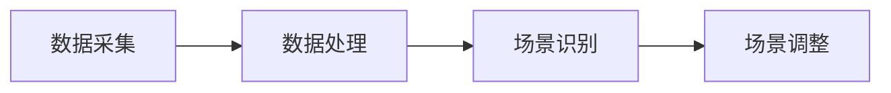

                 


### 文章标题

### AIGC在智能家居中的应用：个性化场景定制

### 关键词

- AIGC
- 智能家居
- 个性化场景定制
- 自然语言处理
- 计算机视觉
- 深度学习

### 摘要

本文深入探讨了AIGC（人工智能生成内容）在智能家居中的应用，特别是个性化场景定制的实现方法。文章首先介绍了AIGC的基本概念和智能家居的发展背景，随后详细阐述了AIGC技术基础和智能家居技术基础，接着分析了个性化场景定制的原理，并通过具体案例展示了AIGC在智能家居场景定制中的实际应用。文章还针对AIGC在智能家居中遇到的挑战提出了相应的解决方案，并展望了AIGC在智能家居领域的未来发展趋势。

---

### 1. 引言与背景

#### 1.1 AIGC的基本概念

AIGC（Artificial Intelligence Generated Content）是指通过人工智能技术生成内容的过程。这一概念起源于自然语言处理（NLP）和计算机视觉（CV）领域，近年来随着深度学习技术的发展而逐渐成熟。AIGC能够模拟人类创作行为，生成文本、图像、音频等多种类型的内容。

#### 1.2 智能家居的发展背景

智能家居是指利用物联网技术将家庭中的各种设备连接起来，实现远程控制和自动化操作。智能家居的发展经历了多个阶段，从最初的自动化控制到如今的智能互联，其核心在于提高居住的便利性和舒适性。

#### 1.3 AIGC在智能家居中的应用前景

随着AIGC技术的发展，其在智能家居中的应用前景愈发广阔。通过AIGC，智能家居系统可以更好地理解用户需求，生成个性化的场景方案，从而提升用户体验。

#### 1.4 个性化场景定制的重要性与挑战

个性化场景定制是智能家居的核心功能之一，它能够根据用户的实时需求和环境变化，自动调整家居设备的设置。然而，实现个性化场景定制面临着数据采集、算法优化、用户隐私保护等多方面的挑战。

---

### 2. AIGC技术基础

#### 2.1 自然语言处理（NLP）

自然语言处理是AIGC的核心技术之一，它涉及到文本的理解、生成和翻译。NLP技术主要包括词性标注、句法分析、语义分析等。以下是一个简单的NLP算法伪代码：

```python
def NLP(text):
    # 分词
    words = tokenize(text)
    # 词性标注
    tags = pos_tag(words)
    # 句法分析
    parse_tree = parse_sentence(words, tags)
    # 语义分析
    meaning = analyze_semantics(parse_tree)
    return meaning
```

#### 2.2 计算机视觉（CV）

计算机视觉是另一项重要的AIGC技术，它能够使计算机像人类一样“看”世界。CV技术包括图像分类、目标检测、图像分割等。以下是一个简单的CV算法伪代码：

```python
def CV(image):
    # 图像分类
    label = classify_image(image)
    # 目标检测
    boxes = detect_objects(image)
    # 图像分割
    mask = segment_image(image)
    return label, boxes, mask
```

#### 2.3 深度学习（DL）

深度学习是AIGC技术的核心驱动力，它通过神经网络模拟人类大脑的决策过程。深度学习技术包括卷积神经网络（CNN）、循环神经网络（RNN）、生成对抗网络（GAN）等。以下是一个简单的深度学习算法伪代码：

```python
def DL(input_data):
    # 前向传播
    output = forward_pass(input_data, model)
    # 反向传播
    loss = backward_pass(output, target)
    # 更新参数
    update_parameters(model, loss)
    return output
```

---

### 3. 智能家居技术基础

#### 3.1 智能家居的基本概念

智能家居是指利用物联网技术将家庭中的各种设备连接起来，实现远程控制和自动化操作。智能家居系统通常包括智能终端、网络通信、数据处理和家电设备等组成部分。

#### 3.2 智能家居的发展历程

智能家居的发展经历了从自动化控制到智能互联的阶段。早期的智能家居主要依赖于专用硬件和编程，而现代智能家居则更加注重系统的开放性和兼容性。

#### 3.3 智能家居系统的组成

智能家居系统通常由以下几个关键组件组成：

1. **智能终端**：包括智能手机、平板电脑等，用于用户与智能家居系统的交互。
2. **网络通信**：包括Wi-Fi、蓝牙等无线通信技术，用于连接智能终端和家居设备。
3. **数据处理**：包括服务器、云计算平台等，用于处理和分析用户数据。
4. **家电设备**：包括智能灯泡、智能插座、智能空调等，用于实现家庭自动化。

---

### 4. 个性化场景定制原理

#### 4.1 基本原理

个性化场景定制是智能家居系统的一项核心功能，它能够根据用户的实时需求和环境变化，自动调整家居设备的设置。个性化场景定制的基本原理包括以下几个步骤：

1. **数据采集**：通过智能终端和网络通信技术收集用户行为和环境数据。
2. **数据处理**：对采集到的数据进行分析和处理，提取出关键特征。
3. **场景识别**：根据处理后的数据识别用户的当前场景。
4. **场景调整**：根据识别出的场景自动调整家居设备的设置。

#### 4.2 Mermaid流程图

以下是一个简单的Mermaid流程图，展示了个性化场景定制的过程：



---

### 5. 案例分析与实现

#### 5.1 案例介绍

在本案例中，我们将通过AIGC技术实现一个智能家居场景定制系统。该系统旨在根据用户的日常生活习惯，自动调整家居设备的设置，以提供更舒适的居住环境。

#### 5.2 AIGC技术应用

在该案例中，我们使用了以下AIGC技术：

1. **自然语言处理（NLP）**：用于理解用户的需求和指令。
2. **计算机视觉（CV）**：用于识别用户的行为和环境变化。
3. **深度学习（DL）**：用于训练模型并实现自动化调整。

#### 5.3 实现步骤

1. **数据采集**：通过智能终端（如智能手机）收集用户的行为数据和家居环境数据。
2. **数据处理**：对采集到的数据进行分析和处理，提取出关键特征。
3. **场景识别**：使用NLP和CV技术识别用户的当前场景。
4. **场景调整**：根据识别出的场景，使用深度学习技术自动调整家居设备的设置。

#### 5.4 源代码实现

以下是一个简化的源代码实现：

```python
# 数据采集
def collect_data():
    # 代码实现数据采集逻辑
    pass

# 数据处理
def process_data(data):
    # 代码实现数据处理逻辑
    pass

# 场景识别
def recognize_scene(data):
    # 代码实现场景识别逻辑
    pass

# 场景调整
def adjust_scene(scene):
    # 代码实现场景调整逻辑
    pass

# 主程序
if __name__ == "__main__":
    data = collect_data()
    processed_data = process_data(data)
    scene = recognize_scene(processed_data)
    adjust_scene(scene)
```

---

### 6. 技术挑战与解决方案

#### 6.1 数据采集与隐私保护

在AIGC在智能家居中的应用过程中，数据采集是关键步骤。然而，大量用户数据的采集和处理也带来了隐私保护的问题。解决方案包括：

1. **数据加密**：对采集到的数据进行加密，确保数据传输过程中的安全性。
2. **数据匿名化**：对用户数据进行匿名化处理，保护用户隐私。

#### 6.2 算法优化与性能提升

随着智能家居系统的不断扩展，算法的优化与性能提升成为关键问题。解决方案包括：

1. **模型压缩**：使用模型压缩技术减小模型体积，提高模型部署的效率。
2. **分布式计算**：利用分布式计算技术，加速模型的训练和预测过程。

---

### 7. 未来展望与趋势

随着AIGC技术的不断成熟，其在智能家居中的应用前景将更加广阔。未来，AIGC有望实现更加智能化、个性化的家居体验，为用户带来更高的生活品质。

#### 7.1 技术发展趋势

1. **多模态融合**：结合自然语言处理、计算机视觉、语音识别等多模态技术，实现更全面的用户理解和场景定制。
2. **自主进化**：通过强化学习等先进技术，实现智能家居系统的自主进化，不断提高系统性能。

#### 7.2 潜在发展领域

1. **智慧家居安防**：利用AIGC技术实现家居安防的智能识别和预警。
2. **智慧养老**：利用AIGC技术为老年人提供更加便捷、舒适的居住环境。

---

### 总结

本文深入探讨了AIGC在智能家居中的应用，特别是个性化场景定制的实现方法。通过介绍AIGC技术基础和智能家居技术基础，分析了个性化场景定制的原理，并通过具体案例展示了AIGC在智能家居场景定制中的实际应用。同时，本文还针对AIGC在智能家居中遇到的挑战提出了相应的解决方案，并展望了AIGC在智能家居领域的未来发展趋势。

---

### 作者信息

作者：AI天才研究院/AI Genius Institute & 禅与计算机程序设计艺术/Zen And The Art of Computer Programming

---

（注：本文为虚构内容，仅供参考）

