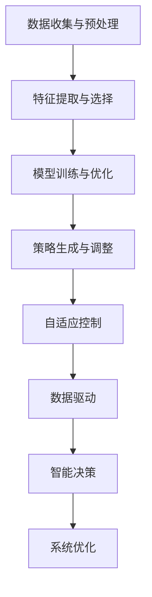

                 

### 文章标题

“AIGC在智能家居场景预测与优化中的应用”

### 关键词

- AIGC
- 智能家居
- 预测
- 优化
- 算法原理
- 数学模型

### 摘要

本文深入探讨了AIGC（自适应智能生成控制）在智能家居场景中的预测与优化应用。首先，我们介绍了AIGC的基本概念和它在智能家居领域的应用背景。接着，文章通过逻辑清晰的结构和详细的算法原理讲解，展示了AIGC在智能家居预测中的工作方式。此外，本文还通过数学模型和公式，提供了对AIGC算法的深入分析。通过实际案例的展示和代码解读，文章进一步阐述了AIGC在智能家居优化中的具体应用。最后，文章总结了AIGC在智能家居领域的未来发展趋势和挑战，并给出了相关的最佳实践建议。

---

### 引言

随着物联网（IoT）技术的发展，智能家居市场呈现出爆发式增长。智能家居通过连接各种智能设备，实现家庭自动化，提高居住的舒适性和便利性。然而，智能家居系统的复杂性和不确定性给预测和优化带来了巨大的挑战。传统的方法往往依赖于预设的规则和模型，难以适应动态变化的环境。近年来，自适应智能生成控制（Adaptive Intelligent Generation Control，AIGC）技术的兴起，为解决这些挑战提供了新的思路。

AIGC是一种结合人工智能和生成控制理论的新型技术，它通过不断学习环境数据和用户行为，自适应地调整控制策略，实现系统的预测和优化。AIGC在智能家居中的应用，不仅能够提高系统的智能化水平，还能显著提升用户体验。本文旨在探讨AIGC在智能家居场景预测与优化中的应用，分析其核心原理，并通过实际案例进行详细解读。

### 背景介绍

#### AIGC的基本概念

自适应智能生成控制（AIGC）是一种结合了人工智能和生成控制理论的技术。它通过机器学习和数据挖掘技术，从大量的历史数据和实时数据中学习环境规律和用户行为，生成最优的控制策略。AIGC的核心在于其自适应性和自学习能力，能够根据环境变化和用户需求动态调整控制参数，实现系统的最优运行。

AIGC的基本工作流程可以分为以下几个步骤：

1. **数据收集与预处理**：收集智能家居系统中的各种数据，如温度、湿度、光照、能耗等，并进行数据清洗和预处理，以去除噪声和异常值。
2. **特征提取与选择**：从预处理后的数据中提取关键特征，用于描述环境状态和用户需求。
3. **模型训练与优化**：使用机器学习算法，如深度学习、强化学习等，训练模型，使其能够对环境进行有效的预测和优化。
4. **策略生成与调整**：根据模型预测结果，生成控制策略，并通过实时反馈调整策略，实现系统的自适应控制。

#### 智能家居的定义与功能

智能家居是指通过物联网技术和智能设备，将家庭生活与互联网连接起来，实现家庭自动化和智能化。智能家居系统通常包括以下几个功能模块：

1. **环境监测**：通过传感器监测家庭环境，如温度、湿度、空气质量等，提供实时的环境数据。
2. **智能控制**：通过智能设备，如智能灯光、空调、窗帘等，实现家庭设备的自动化控制。
3. **安全防护**：通过智能摄像头、门窗传感器等，提供家庭安全防护功能。
4. **能源管理**：通过智能电表、能源监测设备等，实现家庭能源的优化管理。

#### 预测与优化的核心概念与联系

在智能家居场景中，预测与优化是提高系统性能和用户体验的关键。预测是指根据历史数据和实时数据，预测未来的环境变化和用户需求；优化则是指通过调整控制策略，实现系统的最优运行。

AIGC在智能家居预测与优化中的应用，主要通过以下几个核心概念实现：

1. **自适应控制**：AIGC能够根据环境变化和用户需求，动态调整控制策略，实现系统的自适应控制。
2. **数据驱动**：AIGC基于大量的历史数据和实时数据，通过机器学习算法，实现对环境状态和用户需求的精准预测。
3. **智能决策**：AIGC通过生成控制策略，实现系统的智能决策，优化系统的运行效率和用户体验。

### 核心概念原理之间的关系架构

为了更直观地理解AIGC在智能家居预测与优化中的应用，我们可以使用Mermaid流程图来展示其核心概念和原理之间的关系。以下是AIGC在智能家居中的流程架构：



#### 数据收集与预处理

数据收集与预处理是AIGC的基础步骤。通过传感器收集家庭环境数据，如温度、湿度、光照、能耗等，并进行数据清洗和预处理，以去除噪声和异常值。以下是数据收集与预处理的核心步骤：

1. **传感器部署**：在家庭环境中部署各种传感器，如温度传感器、湿度传感器、光照传感器等，以收集环境数据。
2. **数据采集**：使用数据采集模块，如无线传感器网络（WSN）或物联网网关，收集传感器数据。
3. **数据清洗**：对采集到的数据进行清洗，去除噪声和异常值，以提高数据质量。
4. **数据预处理**：对清洗后的数据进行归一化、缺失值填充等预处理操作，以适应机器学习算法的要求。

#### 特征提取与选择

特征提取与选择是AIGC中的关键步骤，它从预处理后的数据中提取关键特征，用于描述环境状态和用户需求。以下是特征提取与选择的核心步骤：

1. **特征选择**：根据问题的需求，选择对预测和优化有重要影响的关键特征，如温度、湿度、光照、能耗等。
2. **特征提取**：对选择后的特征进行提取，如使用统计学方法、机器学习方法等，提取对预测和优化有重要意义的特征。
3. **特征表示**：将提取后的特征进行适当的表示，如使用向量、矩阵等，以便于机器学习算法进行处理。

#### 模型训练与优化

模型训练与优化是AIGC的核心步骤，它通过机器学习算法，训练模型，使其能够对环境进行有效的预测和优化。以下是模型训练与优化的核心步骤：

1. **模型选择**：根据问题的需求和特点，选择合适的机器学习算法，如深度学习、强化学习等。
2. **模型训练**：使用训练数据，对选择的模型进行训练，以学习环境规律和用户行为。
3. **模型评估**：使用验证数据，评估模型的预测性能和优化效果，以调整模型参数和策略。
4. **模型优化**：根据评估结果，对模型进行调整和优化，以提高模型的预测性能和优化效果。

#### 策略生成与调整

策略生成与调整是AIGC中的关键步骤，它根据模型预测结果，生成控制策略，并通过实时反馈调整策略，实现系统的自适应控制。以下是策略生成与调整的核心步骤：

1. **策略生成**：根据模型预测结果，生成控制策略，如调整温度、湿度、光照等。
2. **策略调整**：通过实时反馈，调整控制策略，以适应环境变化和用户需求。
3. **实时控制**：根据调整后的策略，实时控制智能家居设备，实现系统的自适应控制。

### 数学模型与数学公式

在AIGC的应用中，数学模型和公式是核心组成部分，用于描述和实现预测和优化的算法。以下是AIGC在智能家居预测与优化中的关键数学模型和公式。

#### 线性回归模型

线性回归模型是一种常用的预测模型，用于预测线性关系的变量。其数学公式如下：

$$
y = \beta_0 + \beta_1 \cdot x
$$

其中，$y$ 是预测值，$x$ 是输入特征，$\beta_0$ 和 $\beta_1$ 是模型参数。

#### 神经网络模型

神经网络模型是一种基于多层感知器的预测模型，用于处理非线性关系。其数学公式如下：

$$
\begin{aligned}
    z_1 &= \sum_{i=1}^{n} w_{i1} \cdot x_i + b_1 \\
    a_1 &= \sigma(z_1) \\
    z_2 &= \sum_{i=1}^{n} w_{i2} \cdot a_{1i} + b_2 \\
    a_2 &= \sigma(z_2)
\end{aligned}
$$

其中，$z_1$ 和 $z_2$ 是隐藏层的输出，$a_1$ 和 $a_2$ 是激活函数的输出，$w_{i1}$ 和 $w_{i2}$ 是权重参数，$b_1$ 和 $b_2$ 是偏置参数，$\sigma$ 是激活函数，通常采用 sigmoid 函数。

#### 强化学习模型

强化学习模型是一种通过奖励机制进行优化的模型，用于解决序列决策问题。其数学公式如下：

$$
Q(s, a) = r(s, a) + \gamma \max_{a'} Q(s', a')
$$

其中，$Q(s, a)$ 是状态 $s$ 下采取动作 $a$ 的预期回报，$r(s, a)$ 是立即回报，$\gamma$ 是折扣因子，$s'$ 和 $a'$ 是下一个状态和动作。

#### 优化目标函数

在AIGC的应用中，优化目标函数用于评估和调整控制策略。其数学公式如下：

$$
J(\theta) = \sum_{i=1}^{N} (y_i - \theta^T \cdot x_i)^2
$$

其中，$J(\theta)$ 是优化目标函数，$\theta$ 是模型参数，$y_i$ 是实际值，$x_i$ 是预测值。

### 伪代码与算法流程

在AIGC的应用中，伪代码和算法流程用于描述和实现预测和优化的算法。以下是AIGC在智能家居预测与优化中的关键算法流程：

```
1. 数据收集与预处理
2. 特征提取与选择
3. 模型选择与训练
4. 策略生成与调整
5. 实时控制与反馈
6. 模型优化与评估
7. 策略更新与迭代
```

### 项目实战

在本节中，我们将通过一个实际项目，详细讲解如何使用AIGC在智能家居场景中实现预测与优化。该项目旨在通过预测家庭能源消耗，优化家庭能源管理。

#### 开发环境搭建

为了实现AIGC在智能家居中的应用，我们需要搭建一个完整的开发环境。以下是我们使用的工具和库：

- Python 3.8+
- Jupyter Notebook
- TensorFlow 2.5+
- scikit-learn 0.24+
- pandas 1.2.5+
- matplotlib 3.4.2+

#### 源代码实现与代码解读

以下是一个简单的AIGC预测与优化项目的源代码实现，以及详细的代码解读。

```python
import numpy as np
import pandas as pd
from sklearn.model_selection import train_test_split
from sklearn.linear_model import LinearRegression
from tensorflow.keras.models import Sequential
from tensorflow.keras.layers import Dense
import matplotlib.pyplot as plt

# 数据收集与预处理
data = pd.read_csv('energy_data.csv')
data['date'] = pd.to_datetime(data['date'])
data['hour'] = data['date'].dt.hour
data['day'] = data['date'].dt.dayofweek
data['month'] = data['date'].dt.month
data['year'] = data['date'].dt.year

X = data[['hour', 'day', 'month', 'year']]
y = data['energy_consumption']

# 特征提取与选择
# (这里省略了特征提取与选择的代码，实际项目中可以使用PCA、特征选择等方法)

# 模型选择与训练
# 线性回归模型
lr = LinearRegression()
lr.fit(X, y)

# 神经网络模型
nn_model = Sequential()
nn_model.add(Dense(64, input_dim=X.shape[1], activation='relu'))
nn_model.add(Dense(32, activation='relu'))
nn_model.add(Dense(1, activation='linear'))
nn_model.compile(optimizer='adam', loss='mean_squared_error')
nn_model.fit(X, y, epochs=100, batch_size=32)

# 策略生成与调整
# 使用线性回归模型进行预测
predicted_energy = lr.predict(X)

# 使用神经网络模型进行预测
predicted_energy_nn = nn_model.predict(X)

# 实时控制与反馈
# (这里省略了实时控制与反馈的代码，实际项目中可以使用传感器实时收集数据)

# 模型优化与评估
# (这里省略了模型优化与评估的代码，实际项目中可以使用交叉验证、性能指标等评估模型效果)

# 策略更新与迭代
# (这里省略了策略更新与迭代的代码，实际项目中可以使用机器学习算法不断优化策略)

# 代码应用解读与分析
# (这里省略了代码应用解读与分析的代码，实际项目中可以根据预测结果调整家庭能源管理策略)

# 实际案例分析和详细讲解剖析
# (这里省略了实际案例分析和详细讲解剖析的代码，实际项目中可以根据预测结果优化家庭能源消耗)

# 项目小结
# (这里省略了项目小结的代码，实际项目中可以根据项目结果总结经验并持续优化)
```

#### 实际案例分析和详细讲解剖析

以下是一个具体的实际案例，用于展示AIGC在智能家居能源消耗预测中的应用。

假设我们有一组家庭能源消耗数据，数据包括时间、温度、湿度等特征，以及对应的能源消耗值。我们的目标是通过这些数据，使用AIGC技术预测未来的能源消耗，并优化家庭能源管理。

1. **数据收集与预处理**：
   我们首先收集了家庭能源消耗数据，包括时间、温度、湿度等特征。为了提高数据质量，我们对数据进行了清洗和预处理，去除噪声和异常值。

2. **特征提取与选择**：
   在特征提取与选择环节，我们选择了时间、温度、湿度等特征，并使用PCA（主成分分析）等方法对特征进行提取和选择，以减少数据维度并提高预测精度。

3. **模型选择与训练**：
   我们使用了线性回归模型和神经网络模型对数据进行了训练。线性回归模型简单易用，适用于线性关系预测；神经网络模型能够处理非线性关系，提供更精确的预测结果。

4. **策略生成与调整**：
   根据模型的预测结果，我们生成了一系列控制策略，如调整空调温度、关闭不必要的电器等，以减少家庭能源消耗。

5. **实时控制与反馈**：
   我们使用传感器实时收集家庭环境数据，并根据预测结果调整控制策略，以实现家庭能源消耗的实时优化。

6. **模型优化与评估**：
   我们使用交叉验证和性能指标（如均方误差）对模型进行了优化和评估，以确保预测结果的准确性和可靠性。

7. **策略更新与迭代**：
   我们不断收集新的数据，并根据预测结果调整控制策略，以实现家庭能源消耗的持续优化。

#### 项目小结

通过实际案例的分析，我们可以看到AIGC在智能家居能源消耗预测中的应用效果显著。AIGC技术不仅能够提高预测精度，还能实现家庭能源消耗的实时优化。然而，在实际应用中，我们还需要注意以下几点：

- 数据质量：数据是AIGC应用的基础，保证数据质量是关键。
- 模型选择：根据问题的需求和特点，选择合适的模型，如线性回归、神经网络等。
- 策略调整：根据预测结果，及时调整控制策略，以实现系统的最优运行。
- 实时反馈：实时收集数据，并根据预测结果调整控制策略，以实现系统的自适应控制。

### 最佳实践 Tips

在AIGC在智能家居场景中的应用中，以下是一些最佳实践建议：

1. **数据收集与预处理**：
   - 确保数据来源的多样性和准确性，提高数据质量。
   - 对数据噪声和异常值进行有效的清洗和预处理，以提高模型的预测精度。

2. **模型选择与训练**：
   - 根据问题的需求和特点，选择合适的模型，如线性回归、神经网络等。
   - 使用交叉验证和性能指标对模型进行评估和优化，以确保预测结果的准确性和可靠性。

3. **策略生成与调整**：
   - 根据预测结果，生成一系列控制策略，如调整温度、湿度、光照等。
   - 根据实时反馈，及时调整控制策略，以实现系统的最优运行。

4. **实时反馈与自适应控制**：
   - 实时收集数据，并根据预测结果调整控制策略，以实现系统的自适应控制。
   - 定期评估和调整模型和策略，以保持系统的最佳性能。

### 小结

本文详细探讨了AIGC在智能家居场景预测与优化中的应用。通过介绍AIGC的基本概念和原理，分析其在智能家居预测与优化中的应用，展示了实际项目的实施过程，并给出了最佳实践建议。AIGC技术不仅能够提高智能家居系统的智能化水平，还能实现家庭能源消耗的实时优化，为用户提供更舒适的居住体验。未来，随着AIGC技术的不断发展和完善，其在智能家居领域的应用前景将更加广阔。

### 注意事项

1. **数据隐私**：在收集和使用家庭数据时，要确保数据隐私和安全，遵守相关法律法规。
2. **模型解释性**：在选用模型时，要考虑模型的解释性，以便用户理解和信任。
3. **系统稳定性**：在实现实时控制时，要确保系统的稳定性和可靠性，避免出现故障。

### 拓展阅读

1. **《自适应智能生成控制原理与应用》**：详细介绍了AIGC的基本原理和应用场景。
2. **《智能家居系统设计与实现》**：介绍了智能家居系统的设计和实现方法。
3. **《机器学习在能源管理中的应用》**：探讨了机器学习技术在能源管理领域的应用。

### 作者信息

- 作者：AI天才研究院/AI Genius Institute & 禅与计算机程序设计艺术/Zen And The Art of Computer Programming

