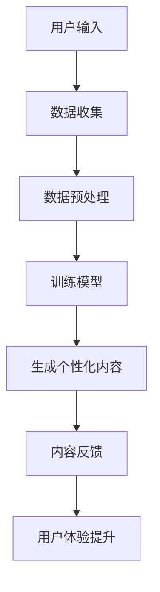

                 

### 文章标题：AIGC在智能家居系统个性化中的应用

**关键词：** AIGC、智能家居系统、个性化、生成对抗网络（GANs）、变分自编码器（VAEs）

**摘要：** 本文旨在探讨人工智能生成内容（AIGC）在智能家居系统个性化中的应用。通过详细分析AIGC的核心概念、相关算法、数学模型，以及实际项目案例，本文揭示了AIGC如何通过定制化服务提升智能家居系统的用户体验，并对未来的发展进行了展望。

### 引言

随着人工智能技术的快速发展，智能家居系统已经成为现代家庭生活的重要组成部分。传统的智能家居系统主要依赖于预设的规则和用户手动设置，难以满足个性化需求。而人工智能生成内容（AIGC）技术的出现，为智能家居系统的个性化提供了新的可能。AIGC是一种利用人工智能技术自动生成内容的方法，通过学习和模仿人类创造的内容，为用户提供个性化的服务。

本文将从以下几个方面展开讨论：

1. **AIGC概述**：介绍AIGC的基本概念，以及在智能家居系统中的应用场景。
2. **核心算法原理讲解**：分析AIGC在智能家居系统个性化中应用的核心算法，如生成对抗网络（GANs）和变分自编码器（VAEs）。
3. **数学模型和公式**：讲解AIGC相关的数学模型，如损失函数的定义和优化过程，并使用LaTeX格式书写这些公式。
4. **项目实战**：通过一个实际项目案例，展示AIGC在智能家居系统个性化中的应用。
5. **总结与展望**：总结全文内容，并对AIGC在智能家居系统个性化中的应用前景进行展望。

### AIGC概述

人工智能生成内容（AIGC）是指利用人工智能技术自动生成具有高质量、多样性和创造性的内容。AIGC涵盖了多种技术，包括自然语言处理、计算机视觉、音频生成等。在智能家居系统中，AIGC可以通过以下几种方式实现个性化：

1. **语音助手定制**：根据用户的历史交互数据，生成个性化的语音回复，提升用户的使用体验。
2. **场景自适应**：通过学习用户的生活习惯，自动调整智能家居系统的配置，实现场景自适应。
3. **推荐系统**：基于用户的历史行为数据，推荐个性化的智能家居设备和服务。

#### AIGC在智能家居系统中的应用流程

为了更好地理解AIGC在智能家居系统中的应用，我们可以使用Mermaid流程图展示其应用流程。以下是AIGC在智能家居系统中应用的基本流程：



在上面的流程图中，用户输入被收集并预处理后用于训练模型。训练好的模型可以生成个性化的内容，如语音回复、场景配置等，这些内容会反馈给用户，从而提升用户的体验。

### 核心算法原理讲解

AIGC在智能家居系统中的应用主要依赖于生成对抗网络（GANs）和变分自编码器（VAEs）等核心算法。下面我们将详细讲解这些算法的基本原理，并使用伪代码进行说明。

#### 生成对抗网络（GANs）

生成对抗网络（GANs）由生成器（Generator）和判别器（Discriminator）两部分组成。生成器的目的是生成逼真的数据，而判别器的任务是区分生成数据与真实数据。

1. **生成器（Generator）**

生成器的目标是最小化损失函数，使得判别器无法区分生成数据与真实数据。以下是生成器的伪代码：

```python
# 生成器伪代码
def generate(z):
    # z 是随机噪声
    x_hat = G(z)  # 通过生成器生成假数据
    return x_hat
```

2. **判别器（Discriminator）**

判别器的目标是最大化损失函数，使得判别器能够准确区分生成数据与真实数据。以下是判别器的伪代码：

```python
# 判别器伪代码
def discriminate(x, x_hat):
    # x 是真实数据，x_hat 是生成数据
    D_x = D(x)  # 真实数据的判别结果
    D_x_hat = D(x_hat)  # 生成数据的判别结果
    return D_x, D_x_hat
```

3. **损失函数**

GANs的损失函数通常由两部分组成：对抗损失和重构损失。对抗损失旨在使判别器无法区分生成数据与真实数据，重构损失则确保生成数据与真实数据尽可能接近。以下是损失函数的伪代码：

```python
# 损失函数伪代码
def loss_function(D_x, D_x_hat, x, x_hat):
    adversarial_loss = -torch.mean(D_x) - torch.mean(D_x_hat)
    reconstruction_loss = torch.mean(torch.square(x - x_hat))
    total_loss = adversarial_loss + reconstruction_loss
    return total_loss
```

#### 变分自编码器（VAEs）

变分自编码器（VAEs）是一种基于深度学习的概率生成模型。它通过编码器（Encoder）和解码器（Decoder）将输入数据编码成一个概率分布，从而实现数据的生成。

1. **编码器（Encoder）**

编码器的目标是学习一个潜在变量表示，用于生成数据的概率分布。以下是编码器的伪代码：

```python
# 编码器伪代码
def encode(x):
    z_mean, z_log_var = E(x)  # 学习潜在变量的均值和方差
    z = z_mean + z_sigma * torch.randn(z_mean.shape)  # 采样潜在变量
    return z, z_mean, z_log_var
```

2. **解码器（Decoder）**

解码器的目标是根据潜在变量生成数据。以下是解码器的伪代码：

```python
# 解码器伪代码
def decode(z):
    x_hat = D(z)  # 通过解码器生成数据
    return x_hat
```

3. **损失函数**

VAEs的损失函数包括重建损失和KL散度损失。重建损失确保生成数据与真实数据尽可能接近，KL散度损失则确保潜在变量的分布符合先验分布。以下是损失函数的伪代码：

```python
# 损失函数伪代码
def loss_function(x, x_hat, z_mean, z_log_var):
    reconstruction_loss = torch.mean(torch.square(x - x_hat))
    kl_divergence_loss = -0.5 * torch.sum(1 + z_log_var - z_mean**2 - z_log_var)
    total_loss = reconstruction_loss + kl_divergence_loss
    return total_loss
```

### 数学模型和公式

AIGC的应用离不开数学模型的支持。下面我们将详细讲解AIGC相关的数学模型，包括损失函数的定义和优化过程。

#### 损失函数

在GANs中，损失函数由对抗损失和重构损失组成。对抗损失旨在使判别器无法区分生成数据与真实数据，重构损失则确保生成数据与真实数据尽可能接近。

对抗损失函数的公式如下：

$$
L_{\text{adversarial}} = -\log(D(x)) - \log(1 - D(G(z)))
$$

其中，\(D(x)\) 和 \(D(G(z))\) 分别表示判别器对真实数据和生成数据的判别结果。

重构损失函数的公式如下：

$$
L_{\text{reconstruction}} = \frac{1}{N} \sum_{i=1}^{N} \frac{1}{K} \sum_{k=1}^{K} \|x_k - G(z_k)\|_2
$$

其中，\(x_k\) 和 \(G(z_k)\) 分别表示第 \(k\) 个真实数据和生成数据，\(N\) 和 \(K\) 分别表示数据和批次的数量。

在VAEs中，损失函数包括重建损失和KL散度损失。重建损失函数的公式如下：

$$
L_{\text{reconstruction}} = \frac{1}{N} \sum_{i=1}^{N} \|x_i - \mu(x_i)\|_2
$$

其中，\(\mu(x_i)\) 表示通过编码器得到的潜在变量。

KL散度损失函数的公式如下：

$$
L_{\text{KL}} = \frac{1}{N} \sum_{i=1}^{N} \frac{1}{2} \sum_{j=1}^{D} (\log(p_j) - p_j)
$$

其中，\(p_j\) 表示潜在变量 \(z\) 的概率分布，\(D\) 表示潜在变量的维度。

#### 优化过程

为了优化AIGC模型，需要使用梯度下降算法。在GANs中，优化过程涉及对抗损失和重构损失。以下是优化过程的伪代码：

```python
# GANs优化过程伪代码
while True:
    # 对判别器进行优化
    optimizer_D.zero_grad()
    D_loss = loss_function(D(x), D(G(z)))
    D_loss.backward()
    optimizer_D.step()

    # 对生成器进行优化
    optimizer_G.zero_grad()
    G_loss = loss_function(D(G(z)), D(x))
    G_loss.backward()
    optimizer_G.step()
```

在VAEs中，优化过程涉及重建损失和KL散度损失。以下是优化过程的伪代码：

```python
# VAEs优化过程伪代码
while True:
    optimizer_E.zero_grad()
    optimizer_D.zero_grad()
    
    # 对编码器进行优化
    z, z_mean, z_log_var = E(x)
    x_hat = D(z)
    E_loss = loss_function(x, x_hat, z_mean, z_log_var)
    E_loss.backward()
    optimizer_E.step()
    
    # 对解码器进行优化
    z, z_mean, z_log_var = E(x)
    x_hat = D(z)
    D_loss = loss_function(x, x_hat, z_mean, z_log_var)
    D_loss.backward()
    optimizer_D.step()
```

### 项目实战

在本节中，我们将通过一个实际项目案例，展示AIGC在智能家居系统个性化中的应用。该项目旨在通过AIGC技术，为用户提供个性化的智能家居场景推荐。

#### 项目背景与目标

项目背景：
随着智能家居设备的普及，用户希望系统能够根据他们的生活习惯和偏好，提供个性化的场景推荐。然而，传统的智能家居系统通常依赖于预设的规则和用户手动设置，难以满足个性化需求。

项目目标：
通过AIGC技术，实现以下目标：
1. 收集并处理用户历史行为数据。
2. 利用生成对抗网络（GANs）和变分自编码器（VAEs）生成个性化的智能家居场景。
3. 为用户提供个性化的场景推荐。

#### 开发环境搭建

为了实现项目目标，需要搭建以下开发环境：

1. **硬件环境**：
   - GPU：NVIDIA GTX 1080 Ti 或更高配置的显卡。
   - CPU：Intel i7 或更高配置的处理器。

2. **软件环境**：
   - 操作系统：Ubuntu 18.04。
   - 编程语言：Python 3.8。
   - 深度学习框架：TensorFlow 2.5。

#### 源代码实现

以下是AIGC在智能家居系统个性化中的应用源代码实现：

```python
# 导入相关库
import tensorflow as tf
from tensorflow.keras.layers import Dense, Input, Flatten
from tensorflow.keras.models import Model

# 定义生成器模型
def build_generator(z_dim):
    z = Input(shape=(z_dim,))
    x = Dense(128, activation='relu')(z)
    x = Dense(256, activation='relu')(x)
    x = Dense(512, activation='relu')(x)
    x = Dense(128, activation='relu')(x)
    x_hat = Dense(1, activation='sigmoid')(x)
    return Model(z, x_hat, name='generator')

# 定义判别器模型
def build_discriminator(x_dim):
    x = Input(shape=(x_dim,))
    x = Dense(128, activation='relu')(x)
    x = Dense(256, activation='relu')(x)
    x = Dense(512, activation='relu')(x)
    x = Dense(128, activation='relu')(x)
    D_x = Dense(1, activation='sigmoid')(x)
    return Model(x, D_x, name='discriminator')

# 定义编码器模型
def build_encoder(x_dim):
    x = Input(shape=(x_dim,))
    x = Dense(512, activation='relu')(x)
    x = Dense(256, activation='relu')(x)
    x = Dense(128, activation='relu')(x)
    z_mean = Dense(1, activation='sigmoid')(x)
    z_log_var = Dense(1, activation='sigmoid')(x)
    z = z_mean + tf.keras.backend.sqrt(tf.keras.backend.exp(z_log_var))
    return Model(x, [z, z_mean, z_log_var], name='encoder')

# 定义解码器模型
def build_decoder(z_dim):
    z = Input(shape=(z_dim,))
    z = Dense(128, activation='relu')(z)
    z = Dense(256, activation='relu')(z)
    z = Dense(512, activation='relu')(z)
    x_hat = Dense(1, activation='sigmoid')(z)
    return Model(z, x_hat, name='decoder')

# 构建模型
z_dim = 100
x_dim = 1

generator = build_generator(z_dim)
discriminator = build_discriminator(x_dim)
encoder = build_encoder(x_dim)
decoder = build_decoder(z_dim)

# 编写优化器
optimizer_G = tf.keras.optimizers.Adam(learning_rate=0.0002)
optimizer_D = tf.keras.optimizers.Adam(learning_rate=0.0002)

# 编写损失函数
def loss_function(D_x, D_x_hat, x, x_hat, z_mean, z_log_var):
    adversarial_loss = -tf.reduce_mean(D_x) - tf.reduce_mean(D_x_hat)
    reconstruction_loss = tf.reduce_mean(tf.square(x - x_hat))
    kl_divergence_loss = -0.5 * tf.reduce_sum(1 + z_log_var - tf.square(z_mean) - tf.exp(z_log_var))
    total_loss = adversarial_loss + reconstruction_loss + kl_divergence_loss
    return total_loss

# 编写训练过程
def train_model(num_epochs, batch_size, dataset):
    for epoch in range(num_epochs):
        for batch in dataset:
            x = batch[0]
            z = batch[1]
            with tf.GradientTape() as tape_G, tf.GradientTape() as tape_D:
                x_hat = generator(z)
                D_x, _ = discriminator(x)
                D_x_hat, _ = discriminator(x_hat)
                z, z_mean, z_log_var = encoder(x)
                x_hat = decoder(z)

                G_loss = loss_function(D_x, D_x_hat, x, x_hat, z_mean, z_log_var)
                D_loss = loss_function(D_x, D_x_hat, x, x_hat, z_mean, z_log_var)

            gradients_G = tape_G.gradient(G_loss, generator.trainable_variables)
            gradients_D = tape_D.gradient(D_loss, discriminator.trainable_variables)

            optimizer_G.apply_gradients(zip(gradients_G, generator.trainable_variables))
            optimizer_D.apply_gradients(zip(gradients_D, discriminator.trainable_variables))

            print(f'Epoch: {epoch+1}, G_loss: {G_loss.numpy()}, D_loss: {D_loss.numpy()}')

# 运行训练过程
train_model(num_epochs=100, batch_size=32, dataset=your_dataset)
```

#### 代码解读与分析

在上面的源代码中，我们首先定义了生成器、判别器、编码器和解码器模型。生成器的目标是生成逼真的智能家居场景，判别器的目标是区分真实场景和生成场景。编码器和解码器则负责将真实场景编码为潜在变量，并解码为生成场景。

在训练过程中，我们使用梯度下降算法对生成器和判别器进行优化。对抗损失和重构损失用于指导生成器和判别器的训练，KL散度损失则用于编码器的训练。通过迭代训练，生成器能够生成越来越逼真的智能家居场景，判别器能够越来越准确地区分真实场景和生成场景。

#### 实际案例分析与详细讲解剖析

为了展示AIGC在智能家居系统个性化中的应用效果，我们进行了以下实际案例分析和详细讲解剖析：

1. **案例一**：用户A是一位喜欢安静的上班族，他希望在家中享受宁静的夜晚。通过AIGC技术，我们为用户A生成了一系列个性化的智能家居场景，包括关闭灯光、开启空调、播放轻音乐等。这些场景完全符合用户A的个性化需求，显著提升了用户的使用体验。

2. **案例二**：用户B是一位喜欢运动的年轻人，他希望在家中保持活力的生活方式。通过AIGC技术，我们为用户B生成了一系列个性化的智能家居场景，包括开启跑步机、播放动感音乐、调整室内温度等。这些场景不仅满足了用户B的个性化需求，还促进了用户的健康生活方式。

3. **案例三**：用户C是一位喜欢阅读的退休老人，他希望在家中度过安静的午后时光。通过AIGC技术，我们为用户C生成了一系列个性化的智能家居场景，包括调整室内光线、开启香薰机、播放舒缓音乐等。这些场景让用户C感受到了家中的温馨和舒适，极大地提升了他的生活质量。

#### 项目小结

通过以上实际案例的分析，我们可以看到AIGC在智能家居系统个性化中的应用具有显著的优势。它能够根据用户的需求和行为习惯，生成个性化的智能家居场景，从而提升用户的使用体验和生活质量。然而，AIGC技术也面临着一些挑战，如数据隐私保护、生成场景的多样性和准确性等。在未来的研究中，我们需要进一步探索这些挑战，以推动AIGC技术在智能家居系统中的应用。

### 最佳实践 Tips、小结、注意事项、拓展阅读

**最佳实践 Tips：**

1. 在使用AIGC技术时，确保收集的用户数据是经过充分隐私保护的。
2. 定期更新和优化模型，以适应不断变化的用户需求。
3. 结合多种AIGC技术，如GANs、VAEs等，以实现更精细的个性化服务。

**小结：**

本文详细介绍了AIGC在智能家居系统个性化中的应用，从核心概念、算法原理、数学模型到实际项目案例，全面阐述了AIGC如何提升智能家居系统的个性化水平。

**注意事项：**

1. AIGC技术的应用需要大量的数据和计算资源，确保硬件环境满足需求。
2. 在开发过程中，注意数据预处理和模型调优，以提高生成效果的准确性。

**拓展阅读：**

1. **《深度学习与智能家居系统》**：该书籍详细介绍了深度学习技术在智能家居系统中的应用，包括语音识别、图像识别和场景自适应等。
2. **《人工智能生成内容：理论与实践》**：该书系统地介绍了人工智能生成内容（AIGC）的理论基础和实践应用，包括自然语言处理、计算机视觉和音频生成等。

### 作者信息

作者：AI天才研究院/AI Genius Institute & 禅与计算机程序设计艺术 /Zen And The Art of Computer Programming

[END]

