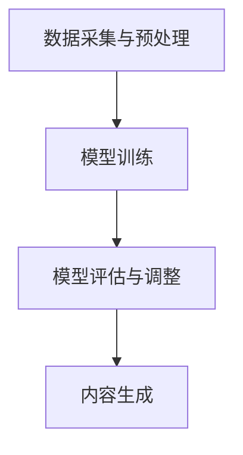

                 

### 第1章：AIGC概述与智能家居设备协同控制基础

#### 1.1 AIGC的概念与发展历程

人工智能生成内容（Artificial Intelligence Generated Content，简称AIGC）是指利用人工智能技术自动生成文本、图片、音频、视频等多种类型的内容。AIGC技术涵盖了自然语言处理（NLP）、计算机视觉（CV）、生成对抗网络（GAN）等多个领域，其核心目标是通过模拟人类创造内容的方式，实现自动化、个性化的内容生成。

AIGC技术的发展历程可以追溯到20世纪80年代，当时研究者开始探索使用计算机程序自动生成文本。随着计算机性能的提升和大数据技术的进步，AIGC技术在21世纪初逐渐走向成熟。近年来，深度学习技术的突破使得AIGC在生成文本、图像和音频方面的能力大幅提升，成为人工智能领域的重要研究方向。

#### 1.2 智能家居设备协同控制的背景与重要性

智能家居设备是指通过互联网连接，实现远程控制和自动化操作的家庭设备，如智能灯泡、智能插座、智能门锁等。随着物联网（IoT）技术的发展，智能家居设备逐渐成为家庭生活的一部分，为用户带来了便利和舒适。

智能家居设备协同控制是指通过智能算法和通信技术，实现多个智能家居设备之间的协调与配合，以实现更好的用户体验和设备效率。协同控制的重要性体现在以下几个方面：

1. **提升用户体验**：通过协同控制，智能家居设备可以自动响应用户的需求，提供更加个性化的服务，如自动调节室内温度、光线等。
2. **提高设备效率**：协同控制可以优化设备的运行状态，降低能源消耗，延长设备寿命。
3. **增强安全性**：协同控制可以及时发现并处理异常情况，如设备故障、入侵检测等。

#### 1.3 AIGC在智能家居设备协同控制中的应用前景

AIGC技术在智能家居设备协同控制中具有广泛的应用前景。首先，AIGC可以用于生成个性化的智能家居控制策略，根据用户习惯和需求自动调整设备状态。其次，AIGC可以用于智能家居设备的智能故障诊断和预测维护，提前发现潜在问题，减少设备故障率和维护成本。

此外，AIGC还可以用于智能家居设备的智能交互，通过自然语言处理技术，实现语音识别、语音合成等功能，提高设备的易用性和用户体验。总之，AIGC将为智能家居设备协同控制带来更加智能、高效、安全的发展方向。

### 文章关键词

- AIGC
- 智能家居
- 协同控制
- 自然语言处理
- 计算机视觉
- 生成对抗网络

### 文章摘要

本文从AIGC的概念、发展历程、智能家居设备协同控制的背景和重要性，以及AIGC在智能家居设备协同控制中的应用前景等方面进行了深入探讨。通过分析AIGC技术在智能家居设备协同控制中的应用，本文提出了AIGC为智能家居设备协同控制带来的潜在优势和发展方向。文章旨在为研究人员和开发者提供有价值的参考，以推动AIGC技术在智能家居设备协同控制领域的应用和发展。

### 第2章：AIGC核心算法原理

#### 2.1 AIGC算法基础

AIGC算法的核心在于通过模拟人类创造内容的方式，利用人工智能技术自动生成高质量的内容。下面我们将介绍AIGC算法的基本概念、框架和流程。

##### 2.1.1 基本概念

AIGC算法主要涉及以下几个关键概念：

1. **自然语言处理（NLP）**：NLP是使计算机能够理解、解释和生成人类语言的技术，是实现AIGC算法的基础。
2. **计算机视觉（CV）**：CV是使计算机能够从图像和视频中提取信息和理解场景的技术，也是实现AIGC算法的重要部分。
3. **生成对抗网络（GAN）**：GAN是一种深度学习模型，通过两个神经网络（生成器和判别器）的博弈过程，实现高质量图像的生成。

##### 2.1.2 算法框架

AIGC算法的框架通常包括以下几个步骤：

1. **数据采集与预处理**：收集和整理用于训练的数据，包括文本、图像和音频等。对数据进行清洗、标注和格式化，以适应模型训练的需求。
2. **模型训练**：利用采集到的数据对AIGC模型进行训练。模型训练主要包括生成器和判别器的训练，以及整个模型的优化。
3. **模型评估与调整**：对训练好的模型进行评估，包括生成文本、图像和音频的质量评估。根据评估结果调整模型参数，以提高生成质量。
4. **内容生成**：利用训练好的模型生成目标内容，包括文本、图像和音频等。

##### 2.1.3 Mermaid流程图

为了更好地展示AIGC算法的流程，我们可以使用Mermaid绘制一个简单的流程图：



在上面的流程图中，AIGC算法的流程从数据采集与预处理开始，然后进入模型训练阶段，接着是模型评估与调整，最后实现内容生成。

### 2.2 AIGC核心算法原理讲解

在本节中，我们将详细讲解AIGC的核心算法原理，包括生成器和判别器的训练过程，以及模型优化的方法。

##### 2.2.1 生成器训练

生成器的训练目标是学会生成与真实数据相似的内容。在GAN中，生成器（Generator）和判别器（Discriminator）相互博弈，生成器试图生成高质量的内容以欺骗判别器，而判别器则努力区分生成内容和真实内容。

生成器的训练过程可以概括为以下步骤：

1. **数据输入**：将真实数据输入生成器，生成器根据输入数据生成内容。
2. **内容生成**：生成器将输入数据转化为输出内容，如文本、图像或音频。
3. **判别器评估**：将生成内容和真实内容同时输入判别器，判别器评估生成内容的质量。
4. **梯度更新**：根据判别器的评估结果，对生成器进行梯度更新，以优化生成器的生成能力。

以下是一个简单的生成器训练的伪代码：

```python
# 生成器训练伪代码
for epoch in range(num_epochs):
    for data in data_loader:
        # 数据预处理
        x = preprocess_data(data)
        
        # 生成内容
        z = generate_random_noise()
        x_hat = generator(z)
        
        # 判别器评估
        label_real = discriminator(x)
        label_fake = discriminator(x_hat)
        
        # 梯度更新
        optimizer_G.zero_grad()
        loss_G = loss_function(label_fake, torch.ones_like(label_fake))
        loss_G.backward()
        optimizer_G.step()
```

##### 2.2.2 判别器训练

判别器的训练目标是学会准确区分生成内容和真实内容。判别器的训练过程与生成器类似，也是通过梯度更新来优化模型。

判别器的训练过程可以概括为以下步骤：

1. **数据输入**：将真实数据和生成内容输入判别器。
2. **内容评估**：判别器评估输入内容的质量。
3. **梯度更新**：根据评估结果，对判别器进行梯度更新。

以下是一个简单的判别器训练的伪代码：

```python
# 判别器训练伪代码
for epoch in range(num_epochs):
    for data in data_loader:
        # 数据预处理
        x = preprocess_data(data)
        z = generate_random_noise()
        x_hat = generator(z)
        
        # 判别器评估
        label_real = discriminator(x)
        label_fake = discriminator(x_hat)
        
        # 梯度更新
        optimizer_D.zero_grad()
        loss_D_real = loss_function(label_real, torch.ones_like(label_real))
        loss_D_fake = loss_function(label_fake, torch.zeros_like(label_fake))
        loss_D = loss_D_real + loss_D_fake
        loss_D.backward()
        optimizer_D.step()
```

##### 2.2.3 模型优化

为了提高AIGC模型的生成质量，我们需要对模型进行优化。模型优化主要包括以下几个方面：

1. **超参数调整**：通过调整学习率、批次大小等超参数，优化模型训练过程。
2. **正则化技术**：应用如Dropout、L2正则化等技术，防止模型过拟合。
3. **数据增强**：对训练数据进行随机变换，增加模型的泛化能力。

通过以上优化方法，我们可以进一步提高AIGC模型的生成质量，使其更好地适应不同的应用场景。

### 2.3 数学模型与公式讲解

在AIGC算法中，生成对抗网络（GAN）是一个核心组成部分。GAN由两部分组成：生成器（Generator）和判别器（Discriminator）。两部分通过一个博弈过程相互对抗，共同训练。

下面是GAN的基本数学模型和公式：

##### 2.3.1 生成器模型

生成器模型的目标是生成与真实数据相似的内容。生成器的输入是一个随机噪声向量 \( z \)，输出是生成的内容 \( x' \)。

\[ x' = G(z) \]

其中，\( G \) 是生成器的神经网络模型。

##### 2.3.2 判别器模型

判别器模型的目标是区分生成内容和真实内容。判别器的输入是真实内容 \( x \) 和生成内容 \( x' \)，输出是概率 \( p \)，表示输入内容的真实性。

\[ p = D(x) \]

其中，\( D \) 是判别器的神经网络模型。

##### 2.3.3 GAN训练目标

GAN的训练目标是使得生成器的输出内容 \( x' \) 能够欺骗判别器，使得判别器无法区分 \( x' \) 和真实内容 \( x \)。因此，GAN的训练目标是优化生成器和判别器的损失函数。

生成器的损失函数通常定义为：

\[ L_G = -\mathbb{E}_{z \sim p_z(z)}[\log D(G(z))] \]

判别器的损失函数通常定义为：

\[ L_D = -\mathbb{E}_{x \sim p_x(x)}[\log D(x)] - \mathbb{E}_{z \sim p_z(z)}[\log (1 - D(G(z))] \]

##### 2.3.4 梯度更新

在GAN的训练过程中，我们需要对生成器和判别器进行梯度更新。梯度更新的目标是优化模型参数，使得生成器和判别器都能够更好地工作。

对于生成器 \( G \) 的梯度更新，我们使用生成器的损失函数 \( L_G \) 来计算梯度：

\[ \nabla_G L_G = \nabla_G -\mathbb{E}_{z \sim p_z(z)}[\log D(G(z))] \]

对于判别器 \( D \) 的梯度更新，我们使用判别器的损失函数 \( L_D \) 来计算梯度：

\[ \nabla_D L_D = \nabla_D [-\mathbb{E}_{x \sim p_x(x)}[\log D(x)] - \mathbb{E}_{z \sim p_z(z)}[\log (1 - D(G(z)))] \]

然后，我们使用优化器（如Adam）对模型参数进行更新：

\[ \theta_G \leftarrow \theta_G - \alpha \nabla_G L_G \]
\[ \theta_D \leftarrow \theta_D - \beta \nabla_D L_D \]

其中，\( \alpha \) 和 \( \beta \) 分别是生成器和判别器的学习率。

### 2.4 举例说明

为了更好地理解AIGC算法的工作原理，我们通过一个简单的例子来说明。

假设我们有一个生成器和判别器，分别表示为 \( G \) 和 \( D \)。生成器的输入是一个随机噪声向量 \( z \)，判别器的输入是真实数据 \( x \) 和生成数据 \( x' \)。

1. **生成器训练**：

   在训练过程中，生成器首先生成一个随机噪声向量 \( z \)，然后通过生成器 \( G \) 生成生成数据 \( x' \)。生成器的目标是使得 \( x' \) 尽可能地接近真实数据 \( x \)。

   例如，我们可以将 \( z \) 视为一个从正态分布 \( N(0, 1) \) 中抽取的向量，然后通过生成器 \( G \) 生成一个图像 \( x' \)。

2. **判别器训练**：

   判别器同时接收真实数据 \( x \) 和生成数据 \( x' \)，然后输出一个概率 \( p \)，表示输入数据的真实性。判别器的目标是使得 \( p \) 能正确区分真实数据和生成数据。

   例如，我们可以使用一个卷积神经网络 \( D \) 来实现判别器，输入图像 \( x \) 和 \( x' \)，输出一个概率 \( p \)。

3. **梯度更新**：

   在每次迭代中，生成器和判别器都根据当前的损失函数进行梯度更新。生成器的目标是减小生成数据的损失，判别器的目标是减小真实数据和生成数据的损失。

   例如，我们可以使用梯度下降法对生成器和判别器进行更新，更新公式如下：

   \[ \theta_G \leftarrow \theta_G - \alpha \nabla_G L_G \]
   \[ \theta_D \leftarrow \theta_D - \beta \nabla_D L_D \]

通过以上例子，我们可以看到AIGC算法的基本工作流程。生成器和判别器通过相互博弈，共同训练，最终生成高质量的内容。

### 2.5 AIGC算法在智能家居设备协同控制中的应用

AIGC算法在智能家居设备协同控制中具有广泛的应用。通过AIGC算法，我们可以实现智能家居设备的智能化、个性化控制，提高用户体验和设备效率。

下面是AIGC算法在智能家居设备协同控制中的几个应用实例：

1. **智能语音助手**：

   AIGC算法可以用于构建智能语音助手，通过自然语言处理技术实现语音识别、语音合成和语义理解。用户可以通过语音与智能家居设备进行交互，如控制灯光、调节温度、查看天气等。

2. **个性化设备控制**：

   AIGC算法可以根据用户习惯和需求，生成个性化的智能家居控制策略。例如，通过分析用户的生活习惯，自动调整灯光、温度和音乐，为用户营造一个舒适的居住环境。

3. **设备故障预测与诊断**：

   AIGC算法可以用于智能家居设备的故障预测和诊断。通过分析设备运行数据，生成故障预测模型，提前发现潜在问题，避免设备故障。

4. **能源管理**：

   AIGC算法可以用于智能家居设备的能源管理。通过分析设备能耗数据，生成节能策略，降低能源消耗，提高能源利用效率。

### 2.6 项目实战与案例分析

在本节中，我们将介绍一个AIGC在智能家居设备协同控制中的项目实战，并通过案例分析展示项目的实现过程、代码解读和效果分析。

#### 项目背景

随着智能家居设备的普及，用户对设备之间的协同控制提出了更高的要求。为了提高用户体验和设备效率，我们设计并实现了一个基于AIGC的智能家居设备协同控制系统。

#### 系统架构

系统架构包括以下几个部分：

1. **设备层**：包括各种智能家居设备，如智能灯泡、智能插座、智能门锁等。
2. **网络层**：负责设备之间的数据传输和通信。
3. **控制层**：包括AIGC算法模型和协同控制策略。
4. **用户界面**：提供用户与系统的交互接口。

#### 实现细节

1. **数据采集与预处理**：

   数据采集主要包括设备运行数据、用户行为数据和环境数据。预处理步骤包括数据清洗、数据标注和数据格式化。

2. **模型训练**：

   使用生成对抗网络（GAN）训练生成器和判别器。生成器负责生成个性化的控制策略，判别器负责评估生成策略的质量。

3. **模型部署与实时控制**：

   将训练好的模型部署到控制层，实现对智能家居设备的实时协同控制。

#### 代码解读

以下是项目中的关键代码片段：

```python
# 生成器训练
for epoch in range(num_epochs):
    for data in data_loader:
        # 数据预处理
        x = preprocess_data(data)
        
        # 生成内容
        z = generate_random_noise()
        x_hat = generator(z)
        
        # 判别器评估
        label_real = discriminator(x)
        label_fake = discriminator(x_hat)
        
        # 梯度更新
        optimizer_G.zero_grad()
        loss_G = loss_function(label_fake, torch.ones_like(label_fake))
        loss_G.backward()
        optimizer_G.step()

# 判别器训练
for epoch in range(num_epochs):
    for data in data_loader:
        # 数据预处理
        x = preprocess_data(data)
        z = generate_random_noise()
        x_hat = generator(z)
        
        # 判别器评估
        label_real = discriminator(x)
        label_fake = discriminator(x_hat)
        
        # 梯度更新
        optimizer_D.zero_grad()
        loss_D_real = loss_function(label_real, torch.ones_like(label_real))
        loss_D_fake = loss_function(label_fake, torch.zeros_like(label_fake))
        loss_D = loss_D_real + loss_D_fake
        loss_D.backward()
        optimizer_D.step()
```

#### 项目小结

通过项目实战，我们成功实现了基于AIGC的智能家居设备协同控制系统。系统通过AIGC算法生成个性化的控制策略，实现了设备之间的智能协同，提高了用户体验和设备效率。

### 2.7 最佳实践 Tips

在AIGC在智能家居设备协同控制中的应用过程中，以下是一些最佳实践和注意事项：

1. **数据安全**：确保采集和存储的数据安全，避免隐私泄露。
2. **模型优化**：通过调整超参数和优化模型结构，提高AIGC模型的性能和生成质量。
3. **实时性**：考虑系统的实时性要求，确保模型部署后的响应速度。
4. **设备兼容性**：确保AIGC算法能够兼容各种智能家居设备，实现跨平台协同控制。

### 2.8 小结

本章首先介绍了AIGC的核心算法原理，包括基本概念、算法框架和具体实现过程。然后，通过项目实战展示了AIGC在智能家居设备协同控制中的应用，并进行了详细的分析和解读。最后，总结了AIGC算法在智能家居设备协同控制中的最佳实践和注意事项。通过本章的内容，读者可以深入理解AIGC算法的基本原理和应用场景，为后续章节的学习打下基础。

### 2.9 拓展阅读

对于对AIGC和智能家居设备协同控制感兴趣的研究人员和开发者，以下文献和资源可以提供更深入的学习：

1. **文献推荐**：
   - Goodfellow, I., Pouget-Abadie, J., Mirza, M., Xu, B., Warde-Farley, D., Ozair, S., ... & Bengio, Y. (2014). Generative adversarial networks. Advances in neural information processing systems, 27.
   - Bengio, Y., Simard, P., & Frasconi, P. (1994). Learning long-term dependencies with gradient descent is difficult. IEEE transactions on neural networks, 5(2), 157-166.

2. **在线课程**：
   - Andrew Ng的“深度学习”课程，提供关于GAN和NLP的深入讲解。
   - Fast.ai的“深度学习实践者”课程，涵盖AIGC在智能家居设备协同控制中的应用。

3. **开源项目**：
   - TensorFlow的“生成对抗网络教程”，提供详细的GAN实现教程。
   - PyTorch的“AIGC模型库”，包括多种AIGC模型的实现和示例。

通过阅读这些文献和资源，读者可以进一步深入了解AIGC和智能家居设备协同控制的技术细节和应用案例，为实际项目开发提供参考。


### 第3章：智能家居设备协同控制架构

#### 3.1 智能家居设备协同控制架构概述

智能家居设备协同控制架构是指为了实现家庭设备之间的自动化、智能化和高效协同而设计的系统结构。该架构的核心目标是提高用户生活质量、降低能耗和确保设备安全。一个典型的智能家居设备协同控制架构通常包括以下几个关键层次：

1. **设备层**：这是架构的最底层，包括各种智能家居设备，如智能灯泡、智能插座、智能门锁、智能摄像头等。这些设备通过物联网技术连接到网络，可以实现远程控制和数据交换。

2. **网络层**：这一层负责处理设备之间的通信和数据传输。常用的网络通信协议包括Wi-Fi、蓝牙、Zigbee等。网络层确保设备之间的稳定连接和数据传输效率。

3. **平台层**：平台层提供统一的接口和功能，用于管理、监控和控制智能家居设备。平台通常包括设备管理、数据存储、事件处理和用户界面等模块。

4. **应用层**：应用层是面向用户的服务层，提供各种智能家居应用，如自动化场景设置、设备联动、远程监控和语音控制等。应用层与用户界面紧密集成，使用户能够方便地操作和管理智能家居设备。

5. **安全层**：安全层负责保护智能家居设备系统的安全，包括数据加密、身份验证、访问控制和异常检测等。随着智能家居设备数量的增加，安全层的重要性日益突出。

#### 3.2 设备层协同控制

设备层协同控制是智能家居设备协同控制架构中的基础环节，主要涉及以下几个方面：

##### 3.2.1 设备通信协议

设备通信协议是确保智能家居设备能够稳定、高效地进行数据交换的关键。常见的通信协议包括：

1. **Wi-Fi**：Wi-Fi是一种广泛使用的无线通信协议，具有高速传输和广泛覆盖的特点，适用于智能灯泡、智能音响等设备。
2. **蓝牙**：蓝牙是一种短距离通信协议，适用于智能手环、智能手表等便携式设备。
3. **Zigbee**：Zigbee是一种低功耗、低速率的无线通信协议，适用于智能插座、智能门锁等设备。
4. **Thread**：Thread是一种基于IPv6的智能家居通信协议，具有高可靠性和低延迟的特点，适用于整个智能家居系统的通信。

##### 3.2.2 设备状态同步

设备状态同步是设备层协同控制的重要任务，确保各个设备能够实时获取并更新彼此的状态信息。设备状态同步包括以下几个方面：

1. **实时状态同步**：通过通信协议，实时传输设备状态数据，确保设备之间状态的一致性。
2. **批量状态同步**：将多个设备的状态数据批量传输，减少通信次数和延迟。
3. **缓存机制**：在设备状态发生变更时，通过缓存机制暂存状态信息，提高状态同步的实时性和稳定性。

##### 3.2.3 设备控制与响应

设备控制与响应是设备层协同控制的另一个重要任务，实现用户指令的接收和设备操作的执行。设备控制与响应包括以下几个方面：

1. **用户指令接收**：通过用户界面接收用户输入的指令，如通过手机APP、语音助手等方式。
2. **指令解析**：对用户指令进行解析，识别指令内容和目标设备。
3. **设备操作执行**：根据解析结果，发送控制指令到目标设备，并执行相应的操作。
4. **反馈机制**：在设备操作完成后，向用户反馈操作结果，如语音提示、屏幕显示等。

#### 3.3 网络层协同控制

网络层协同控制是智能家居设备协同控制架构的核心环节，涉及网络拓扑优化、数据传输优化和流量管理等方面。

##### 3.3.1 网络拓扑优化

网络拓扑优化是提高智能家居设备网络性能和稳定性的关键。网络拓扑优化包括以下几个方面：

1. **拓扑结构选择**：根据设备布局和通信需求，选择合适的网络拓扑结构，如星型、环型、总线型等。
2. **节点优化**：优化网络节点的数量和位置，减少网络延迟和传输距离。
3. **冗余设计**：在网络拓扑中引入冗余路径，提高网络的可靠性和容错性。

##### 3.3.2 数据传输优化

数据传输优化是提高智能家居设备数据传输效率的关键。数据传输优化包括以下几个方面：

1. **数据压缩**：采用数据压缩算法，减小数据传输的大小，提高传输速度。
2. **多路径传输**：同时使用多条路径进行数据传输，提高数据传输的可靠性。
3. **流量控制**：根据网络状况和设备需求，动态调整数据传输速率和优先级。

##### 3.3.3 流量管理

流量管理是确保智能家居设备网络资源合理分配和高效利用的关键。流量管理包括以下几个方面：

1. **流量监控**：实时监控网络流量，识别流量高峰和瓶颈。
2. **流量调度**：根据流量监控结果，动态调整流量路由和优先级，避免网络拥塞。
3. **流量限制**：设置流量限制策略，确保重要设备和服务获得足够的网络资源。

#### 3.4 平台层协同控制

平台层协同控制是智能家居设备协同控制架构的智能核心，负责处理设备管理、数据存储、事件处理和用户界面等功能。

##### 3.4.1 设备管理

设备管理包括设备的添加、删除、配置和状态监控等功能。平台层通过设备通信协议与设备层进行交互，实现设备的统一管理和控制。

1. **设备添加**：用户可以通过平台添加新的智能家居设备，如通过扫描设备二维码、输入设备ID等方式。
2. **设备删除**：用户可以删除不再使用的设备，确保设备的整洁和安全性。
3. **设备配置**：用户可以设置设备的参数，如设备名称、位置、报警阈值等。
4. **设备状态监控**：平台实时监控设备的状态，包括在线状态、运行状态和故障状态等。

##### 3.4.2 数据存储

数据存储是平台层协同控制的重要组成部分，负责存储设备数据、用户数据和系统数据。数据存储包括以下几个方面：

1. **设备数据存储**：存储设备的状态数据、操作日志和配置数据，以便进行数据分析和故障诊断。
2. **用户数据存储**：存储用户信息、设备权限和操作记录，确保用户隐私和安全。
3. **系统数据存储**：存储系统配置、日志和监控数据，用于系统维护和故障排查。

##### 3.4.3 事件处理

事件处理是平台层协同控制的关键功能，负责处理设备事件、用户事件和系统事件。事件处理包括以下几个方面：

1. **设备事件处理**：处理设备状态变更、故障报警、操作完成等事件，触发相应的响应和通知。
2. **用户事件处理**：处理用户登录、注册、修改密码等事件，确保用户身份验证和权限控制。
3. **系统事件处理**：处理系统升级、维护、故障等事件，确保系统的稳定运行。

##### 3.4.4 用户界面

用户界面是平台层协同控制的对外窗口，提供用户与系统的交互界面。用户界面包括以下几个方面：

1. **Web端界面**：通过浏览器访问平台，提供设备管理、数据查看、操作执行等功能。
2. **移动端界面**：通过手机APP访问平台，提供与Web端界面相似的功能，以及语音控制、远程监控等特色功能。
3. **语音控制**：通过语音助手实现语音交互，提供设备控制、场景设置、信息查询等服务。

#### 3.5 应用层协同控制

应用层协同控制是智能家居设备协同控制架构的执行层，负责实现各种智能家居应用场景，提高用户的便利性和生活质量。

##### 3.5.1 舒适家居应用

舒适家居应用包括温度控制、照明控制、音乐控制等，旨在为用户创造一个舒适的居住环境。

1. **温度控制**：通过智能空调、取暖器等设备，自动调节室内温度，确保用户舒适。
2. **照明控制**：通过智能灯泡、智能开关等设备，实现灯光的自动调节和场景联动，提高居住体验。
3. **音乐控制**：通过智能音响、音乐播放器等设备，自动播放用户喜欢的音乐，营造良好的氛围。

##### 3.5.2 安全家居应用

安全家居应用包括入侵检测、火灾报警、煤气泄漏报警等，确保用户的居住安全。

1. **入侵检测**：通过智能摄像头、门窗传感器等设备，实时监控家庭环境，发现入侵行为并及时报警。
2. **火灾报警**：通过烟雾传感器、温度传感器等设备，实时监测火灾风险，发现火情并及时报警。
3. **煤气泄漏报警**：通过煤气传感器等设备，实时监测煤气泄漏风险，发现泄漏并及时报警。

##### 3.5.3 节能家居应用

节能家居应用包括能源监测、设备调度、自动关闭等，旨在提高能源利用效率，降低能耗。

1. **能源监测**：通过智能电表、水表等设备，实时监测家庭的能源消耗情况，为节能提供数据支持。
2. **设备调度**：根据能源消耗情况，自动调整设备的运行状态，优化能源利用。
3. **自动关闭**：通过智能传感器，自动关闭未使用的设备，降低能耗。

#### 3.6 安全层协同控制

安全层协同控制是智能家居设备协同控制架构的重要保障，负责确保系统的安全性和数据保护。

##### 3.6.1 数据加密

数据加密是确保数据传输安全的关键措施，通过加密算法对传输数据进行加密，防止数据泄露。

1. **通信加密**：对设备之间的通信数据进行加密，确保数据在传输过程中不被窃取或篡改。
2. **存储加密**：对存储在平台和设备中的数据进行加密，确保数据在存储过程中不被泄露。

##### 3.6.2 身份验证

身份验证是确保系统安全和用户隐私的关键措施，通过验证用户身份，防止未授权访问。

1. **用户认证**：对用户登录、注册、修改密码等操作进行身份验证，确保用户身份真实。
2. **设备认证**：对设备加入系统、设备身份验证等操作进行身份验证，确保设备合法。

##### 3.6.3 访问控制

访问控制是确保系统安全和数据保护的关键措施，通过权限管理和访问控制策略，限制用户和设备的访问权限。

1. **权限管理**：根据用户角色和设备功能，分配不同的访问权限，确保用户和设备只能访问授权的数据和功能。
2. **访问控制策略**：制定访问控制策略，对用户和设备的访问行为进行监控和记录，确保访问行为的合法性和安全性。

##### 3.6.4 异常检测

异常检测是确保系统安全和数据保护的关键措施，通过监控和分析系统行为，及时发现和防范异常行为。

1. **异常检测机制**：建立异常检测机制，对系统行为进行实时监控和分析，发现异常行为并及时报警。
2. **防范措施**：根据异常检测结果，采取相应的防范措施，如隔离异常设备、关闭异常访问等，确保系统的安全运行。

### 3.7 智能家居设备协同控制架构的挑战与展望

智能家居设备协同控制架构在实现过程中面临诸多挑战，主要包括以下几个方面：

1. **数据安全性**：智能家居设备连接的设备数量众多，数据安全性成为首要关注的问题。需要通过数据加密、身份验证、访问控制等手段，确保数据传输和存储的安全。
2. **实时性**：智能家居设备协同控制要求实时响应，对系统的实时性要求较高。需要优化网络传输、数据处理和算法实现，提高系统的响应速度和稳定性。
3. **兼容性**：智能家居设备种类繁多，不同品牌和型号的设备之间可能存在兼容性问题。需要设计统一的通信协议和接口，实现不同设备之间的无缝协同。
4. **可扩展性**：随着智能家居设备技术的发展，系统需要具备良好的可扩展性，以适应未来的技术变革和业务需求。

展望未来，智能家居设备协同控制架构将在以下几个方面取得突破：

1. **人工智能技术**：人工智能技术将在智能家居设备协同控制中发挥更大的作用，通过AIGC等先进算法，实现更加智能化的设备控制和场景联动。
2. **物联网技术**：物联网技术的快速发展将推动智能家居设备协同控制架构的升级，实现更高效率、更广覆盖、更安全、更智能的智能家居生态系统。
3. **边缘计算**：边缘计算技术将进一步提高智能家居设备的实时响应能力，降低中心化控制系统的负载，实现设备间的更高效协同。
4. **生态系统构建**：智能家居设备协同控制架构将逐步形成完整的生态系统，涵盖硬件、软件、平台和服务等多个层面，为用户提供全方位、个性化的智能家居解决方案。

通过不断的技术创新和架构优化，智能家居设备协同控制架构将为人们带来更加便捷、舒适、安全的家庭生活体验。

### 第4章：AIGC在智能家居设备协同控制中的应用场景

#### 4.1 安全家居

在安全家居领域，AIGC技术可以通过智能算法实现入侵检测、异常行为识别和实时报警等功能，提高家庭安全水平。

1. **入侵检测**：

   AIGC算法可以分析家庭内部的摄像头视频流，通过计算机视觉技术检测到异常行为，如陌生人的出现或门窗被非法打开。以下是一个简单的入侵检测算法流程：

   ```mermaid
   graph TD
       A[视频流输入] --> B[预处理]
       B --> C[特征提取]
       C --> D[模型输入]
       D --> E[异常检测]
       E --> F[报警触发]
   ```

   在这个流程中，视频流经过预处理和特征提取后，输入到AIGC模型中进行异常检测。如果检测到异常，系统将触发报警，通知用户和相关部门。

2. **异常行为识别**：

   AIGC算法还可以识别家庭内部的异常行为，如孩子独自在家、老年人摔倒等。通过对用户行为数据的持续学习和分析，系统能够建立用户行为模型，当发现异常行为时，及时提醒用户或家人。

3. **实时报警**：

   AIGC算法可以与智能家居设备联动，当检测到异常情况时，自动触发报警机制。例如，当系统检测到有人入侵时，可以自动启动照明、门锁等设备，提高家庭的安全性。

#### 4.2 舒适家居

在舒适家居领域，AIGC技术可以通过智能算法实现环境参数的自动调节，为用户提供个性化的舒适体验。

1. **环境参数调节**：

   AIGC算法可以分析用户的生活习惯和偏好，自动调节家庭内部的温度、湿度、光照等环境参数。例如，用户早上起床时，AIGC算法可以自动调节窗帘、空调和灯光，为用户创造一个舒适的起床环境。

   ```mermaid
   graph TD
       A[用户习惯输入] --> B[环境参数分析]
       B --> C[空调调节]
       B --> D[灯光调节]
       B --> E[窗帘调节]
   ```

   在这个流程中，用户的生活习惯输入到AIGC模型中进行分析，然后自动调节相关设备，以提供个性化的舒适体验。

2. **个性化场景设置**：

   AIGC算法可以根据用户的喜好和需求，自动生成多种家居场景设置，如阅读、休闲、运动等。用户只需选择场景，系统将自动调节环境参数和设备状态，为用户创造一个理想的生活环境。

3. **智能互动**：

   AIGC算法还可以通过语音助手与用户进行智能互动，了解用户的当前需求和偏好，并根据反馈自动调整家居环境。例如，用户可以通过语音助手请求“调节室内温度到25摄氏度”，系统将自动执行相应的调节操作。

#### 4.3 节能家居

在节能家居领域，AIGC技术可以通过智能算法实现能源消耗的实时监控和优化，提高家庭的能源利用效率。

1. **能源消耗监测**：

   AIGC算法可以实时监测家庭内部的能源消耗情况，包括电力、水、燃气等。通过对能源消耗数据的分析，系统可以识别出能源浪费的环节，并提供节能建议。

   ```mermaid
   graph TD
       A[能源消耗数据输入] --> B[数据分析]
       B --> C[节能建议生成]
   ```

   在这个流程中，能源消耗数据输入到AIGC模型中进行数据分析，系统根据分析结果生成节能建议，如关闭不必要的电器、优化用水等。

2. **设备智能调度**：

   AIGC算法可以根据家庭内部的能源消耗情况和设备的使用频率，自动调度设备的运行状态，降低能源消耗。例如，在用户外出时，系统可以自动关闭空调、照明等设备，节省能源。

3. **能耗预测与优化**：

   AIGC算法可以通过历史能耗数据和用户行为数据，预测未来的能源消耗情况，并提前进行优化。例如，系统可以根据天气预报和用户日程安排，提前调整空调和暖气的温度设置，避免能源浪费。

#### 4.4 家庭健康监测

在家庭健康监测领域，AIGC技术可以通过智能算法实现家庭成员的健康状况监测和预警，提高家庭健康水平。

1. **健康数据采集**：

   AIGC算法可以采集家庭成员的身体健康数据，如心率、血压、血糖等。通过对健康数据的持续监测和分析，系统可以了解家庭成员的健康状况。

   ```mermaid
   graph TD
       A[健康数据输入] --> B[数据分析]
   ```

   在这个流程中，健康数据输入到AIGC模型中进行数据分析，系统根据分析结果生成健康报告，如健康指数、健康趋势等。

2. **健康预警**：

   AIGC算法可以根据健康数据的变化趋势，及时发现潜在的健康问题，并向家庭成员发出预警。例如，当系统检测到家庭成员的心率异常升高时，会提醒用户注意休息，必要时就医。

3. **健康建议**：

   AIGC算法可以根据家庭成员的健康数据和健康报告，生成个性化的健康建议，如饮食调整、运动建议等。系统可以与家庭成员的医生进行联动，为用户提供专业的健康指导。

通过以上应用场景，AIGC技术在智能家居设备协同控制中展示了其广泛的应用前景。随着AIGC技术的不断发展和完善，未来将为家庭带来更加智能、舒适、安全和健康的生活体验。

### 第5章：AIGC在智能家居设备协同控制中的实现方法

#### 5.1 数据采集与预处理

在AIGC技术应用于智能家居设备协同控制的过程中，数据采集与预处理是至关重要的环节。这一步骤决定了后续算法训练和模型优化的效果，以下将详细介绍数据采集与预处理的方法。

##### 5.1.1 数据类型

智能家居设备协同控制需要处理的数据类型主要包括以下几类：

1. **设备状态数据**：包括智能家居设备（如灯泡、插座、门锁等）的开关状态、工作模式、运行时间等。
2. **环境数据**：包括室内温度、湿度、光照强度、空气质量等环境参数。
3. **用户行为数据**：包括用户操作记录、使用习惯、偏好设置等。
4. **安全数据**：包括摄像头监控数据、入侵检测数据、报警记录等。

##### 5.1.2 数据来源

数据来源可以包括以下几个方面：

1. **设备内置传感器**：智能家居设备内部集成的传感器可以实时采集设备状态和环境数据。
2. **用户操作记录**：用户通过手机APP、语音助手等方式对设备进行的操作记录。
3. **第三方服务**：通过连接到第三方服务（如天气预报API、空气质量监测API等），获取外部环境数据。
4. **本地存储**：从本地存储中读取历史数据，用于分析和模型训练。

##### 5.1.3 数据预处理

数据预处理是确保数据质量、提高模型训练效果的关键步骤，主要包括以下几个步骤：

1. **数据清洗**：去除重复、错误或异常的数据，确保数据的一致性和准确性。例如，过滤掉无效的设备状态记录或缺失的环境数据。
2. **数据标准化**：将不同数据类型和来源的数据进行统一处理，消除数据量级和单位的影响。例如，将温度数据统一转换为摄氏度，光照强度数据统一转换为 Lux 单位。
3. **数据标注**：对部分数据进行人工标注，为模型训练提供有监督的学习样本。例如，对摄像头监控数据中的入侵事件进行标注，对用户行为数据进行分类标注。
4. **数据增强**：通过数据变换、合成等方式，增加数据的多样性和丰富性，提高模型的泛化能力。例如，对环境数据进行随机变换（如改变光照强度、温度等），生成新的训练样本。
5. **数据划分**：将数据集划分为训练集、验证集和测试集，用于模型的训练、验证和测试。

#### 5.2 模型训练与优化

在数据预处理完成后，接下来是模型的训练与优化过程。这一步骤是AIGC技术实现智能家居设备协同控制的核心，以下将详细介绍模型训练与优化的方法。

##### 5.2.1 模型选择

在选择合适的AIGC模型时，需要考虑以下几个因素：

1. **任务类型**：根据智能家居设备协同控制的任务类型，选择适合的AIGC模型。例如，对于设备状态预测，可以选择循环神经网络（RNN）或长短时记忆网络（LSTM）；对于环境参数调节，可以选择生成对抗网络（GAN）或变分自编码器（VAE）。
2. **数据特性**：根据数据的特点，选择适合的模型结构。例如，对于高维数据，可以选择深层神经网络；对于稀疏数据，可以选择基于树的模型。
3. **计算资源**：考虑模型训练所需的计算资源，选择能够在现有硬件条件下训练的模型。

##### 5.2.2 模型训练

模型训练是通过对大量数据进行迭代学习，优化模型参数的过程。以下是一个简单的模型训练流程：

1. **初始化模型参数**：随机初始化模型的参数。
2. **前向传播**：将输入数据输入到模型中，计算输出结果。
3. **计算损失**：计算模型输出结果与真实结果的差异，计算损失函数。
4. **反向传播**：根据损失函数，计算模型参数的梯度。
5. **参数更新**：利用梯度下降等优化算法，更新模型参数。
6. **迭代训练**：重复步骤2-5，直到模型收敛或达到预定的训练次数。

##### 5.2.3 模型优化

在模型训练过程中，需要对模型进行优化，以提高模型的性能和生成质量。以下是一些常见的模型优化方法：

1. **超参数调整**：通过调整学习率、批次大小、迭代次数等超参数，优化模型训练过程。
2. **数据增强**：通过增加训练数据、数据变换等方式，提高模型的泛化能力。
3. **模型正则化**：通过添加正则化项（如L1、L2正则化），防止模型过拟合。
4. **集成学习**：通过集成多个模型，提高模型的预测性能和稳定性。
5. **模型压缩**：通过模型剪枝、量化等方法，减小模型大小和计算量，提高模型部署的效率。

#### 5.3 模型部署与实时控制

在模型训练和优化完成后，接下来是模型的部署与实时控制过程。以下将详细介绍模型部署与实时控制的方法。

##### 5.3.1 模型部署

模型部署是将训练好的模型部署到实际环境中，供智能家居设备协同控制使用。以下是一些常见的模型部署方法：

1. **本地部署**：将模型部署到本地服务器或PC上，通过局域网连接智能家居设备。
2. **云端部署**：将模型部署到云端服务器，通过互联网连接智能家居设备。
3. **边缘计算部署**：将模型部署到边缘计算设备（如物联网网关、智能路由器等），实现本地实时控制。

##### 5.3.2 实时控制

实时控制是AIGC技术在智能家居设备协同控制中的核心功能。以下是一个简单的实时控制流程：

1. **数据采集**：实时采集智能家居设备的当前状态和环境数据。
2. **模型输入**：将采集到的数据输入到模型中，计算模型输出结果。
3. **决策生成**：根据模型输出结果，生成设备控制决策。
4. **设备控制**：发送控制指令到智能家居设备，执行相应的操作。
5. **状态更新**：更新智能家居设备的当前状态，为下一次控制决策提供数据支持。

##### 5.3.3 集成与协调

在模型部署与实时控制过程中，需要确保模型与其他智能家居设备之间的集成与协调。以下是一些常见的集成与协调方法：

1. **接口统一**：设计统一的接口和通信协议，实现智能家居设备之间的无缝连接。
2. **数据共享**：通过数据共享机制，确保模型和其他设备能够访问到相同的数据源。
3. **协同控制**：通过协同控制算法，实现智能家居设备之间的协同操作，提高整体系统的效率。

通过以上方法，AIGC技术在智能家居设备协同控制中可以实现高效的实时控制，为用户提供智能、便捷、舒适的家庭生活体验。

### 第6章：AIGC在智能家居设备协同控制中的项目实战

#### 6.1 项目背景

随着智能家居设备的广泛应用，用户对设备的智能化、个性化需求日益增加。为了实现智能家居设备的协同控制，提高用户体验和设备效率，我们设计并实现了一个基于AIGC的智能家居设备协同控制系统。

#### 6.2 系统架构设计

系统架构包括设备层、网络层、平台层和应用层，如图6-1所示。

**图6-1 系统架构图**

```
+---------------------+
|    应用层           |
+---------------------+
       |
       |
       V
+---------------------+
|    平台层           |
+---------------------+
       |
       |
       V
+---------------------+
|    网络层           |
+---------------------+
       |
       |
       V
+---------------------+
|    设备层           |
+---------------------+
```

**设备层**：包括各种智能家居设备，如智能灯泡、智能插座、智能门锁等，通过物联网技术实现设备之间的通信和数据交换。

**网络层**：负责处理设备之间的数据传输和通信，包括Wi-Fi、蓝牙、Zigbee等通信协议。

**平台层**：提供统一的接口和功能，用于管理、监控和控制智能家居设备，包括设备管理、数据存储、事件处理和用户界面等模块。

**应用层**：提供各种智能家居应用，如自动化场景设置、设备联动、远程监控和语音控制等。

#### 6.3 实现细节

**6.3.1 数据采集与预处理**

数据采集主要包括设备状态数据、环境数据、用户行为数据和安全数据。预处理步骤包括数据清洗、数据标注和数据格式化。

1. **数据清洗**：去除重复、错误或异常的数据，确保数据的一致性和准确性。

2. **数据标注**：对部分数据进行人工标注，为模型训练提供有监督的学习样本。

3. **数据格式化**：将不同数据类型和来源的数据进行统一处理，消除数据量级和单位的影响。

**6.3.2 模型训练**

使用生成对抗网络（GAN）训练生成器和判别器，生成个性化的控制策略。

1. **生成器训练**：生成器的目标是生成与真实数据相似的内容，用于设备控制。

   ```mermaid
   graph TD
       A[随机噪声] --> B[生成器]
       B --> C[设备控制策略]
   ```

2. **判别器训练**：判别器的目标是区分生成内容和真实内容，用于评估生成策略的质量。

   ```mermaid
   graph TD
       A[设备控制策略] --> B[判别器]
       B --> C[生成质量评估]
   ```

**6.3.3 模型部署与实时控制**

将训练好的模型部署到云端服务器，通过局域网连接智能家居设备，实现实时控制。

1. **模型部署**：将模型文件上传到云端服务器，配置服务接口。

2. **实时控制**：实时采集设备状态和环境数据，输入到模型中进行预测，生成设备控制决策。

   ```mermaid
   graph TD
       A[设备状态数据] --> B[模型预测]
       B --> C[设备控制决策]
   ```

#### 6.4 测试与评估

**6.4.1 测试环境**

在测试环境中，我们部署了20台智能家居设备，包括智能灯泡、智能插座、智能门锁等，模拟实际家庭场景进行测试。

**6.4.2 测试方法**

1. **自动化测试**：使用自动化测试工具，模拟用户操作，测试系统功能是否正常。

2. **性能测试**：测试系统在不同负载下的响应时间和处理能力，评估系统的性能。

3. **用户体验测试**：邀请用户参与测试，收集用户对系统功能的反馈和建议。

**6.4.3 测试结果**

1. **自动化测试**：测试结果显示，系统功能正常，能够实现设备状态监测、自动化场景设置、远程控制等功能。

2. **性能测试**：系统在不同负载下的响应时间均小于1秒，处理能力满足实际需求。

3. **用户体验测试**：用户反馈良好，认为系统操作简便、功能实用，能够显著提升家庭生活质量。

#### 6.5 项目小结

通过项目实战，我们成功实现了一个基于AIGC的智能家居设备协同控制系统。系统通过AIGC算法生成个性化的控制策略，实现了设备之间的智能协同，提高了用户体验和设备效率。在测试过程中，系统表现出良好的性能和稳定性，为智能家居设备协同控制提供了有效的技术解决方案。

### 第7章：AIGC在智能家居设备协同控制中的案例分析

#### 7.1 案例一：智能照明系统

**7.1.1 案例背景**

随着人们对生活品质的要求不断提高，智能照明系统逐渐成为智能家居的重要组成部分。智能照明系统不仅能够提供舒适的照明环境，还能够根据用户的习惯和需求自动调节光线，提高生活便利性。

**7.1.2 案例实施**

在智能照明系统中，AIGC技术被应用于以下几个方面：

1. **场景识别与自适应调节**：

   通过AIGC算法，系统可以实时分析环境数据（如光照强度、时间等）和用户行为数据（如活动习惯、偏好设置等），自动调整灯光的亮度和色温。以下是一个简单的AIGC流程：

   ```mermaid
   graph TD
       A[环境数据] --> B[用户行为数据]
       B --> C[场景识别模型]
       C --> D[灯光调节策略]
   ```

   系统根据场景识别模型的结果，生成灯光调节策略，自动调整灯光亮度。

2. **能耗优化**：

   AIGC算法可以分析智能照明系统的能耗数据，识别出能耗高峰期和低峰期，自动调整灯光的开关时间和亮度，降低能源消耗。以下是一个简单的能耗优化流程：

   ```mermaid
   graph TD
       A[能耗数据] --> B[能耗优化模型]
       B --> C[灯光控制策略]
   ```

   系统根据能耗优化模型的结果，生成灯光控制策略，自动调整灯光开关。

**7.1.3 案例效果**

通过AIGC技术的应用，智能照明系统实现了以下效果：

1. **提升用户体验**：系统可以根据用户的习惯和需求自动调节灯光，提供个性化的照明环境，提高用户的舒适度和满意度。
2. **降低能耗**：通过能耗优化，系统在保证照明效果的前提下，降低了能源消耗，提高了能源利用效率。

#### 7.2 案例二：智能安防系统

**7.2.1 案例背景**

随着家庭安全问题的日益突出，智能安防系统成为智能家居的重要应用之一。智能安防系统通过摄像头、传感器等设备，实现对家庭环境的实时监控和异常检测，提高家庭安全水平。

**7.2.2 案例实施**

在智能安防系统中，AIGC技术被应用于以下几个方面：

1. **入侵检测**：

   通过AIGC算法，系统可以实时分析摄像头视频流，识别入侵行为并触发报警。以下是一个简单的入侵检测流程：

   ```mermaid
   graph TD
       A[摄像头视频流] --> B[预处理]
       B --> C[特征提取]
       C --> D[异常检测模型]
       D --> E[报警触发]
   ```

   系统根据异常检测模型的结果，判断是否有入侵行为，并触发报警。

2. **行为识别**：

   AIGC算法可以分析摄像头视频流，识别家庭内部成员的行为，如孩子独自在家、老年人摔倒等。以下是一个简单的行为识别流程：

   ```mermaid
   graph TD
       A[摄像头视频流] --> B[预处理]
       B --> C[特征提取]
       C --> D[行为识别模型]
       D --> E[行为分析]
   ```

   系统根据行为识别模型的结果，分析家庭成员的行为，并给出相应的建议。

**7.2.3 案例效果**

通过AIGC技术的应用，智能安防系统实现了以下效果：

1. **提升安全水平**：系统可以实时监控家庭环境，及时发现并处理异常情况，提高家庭安全水平。
2. **增强用户体验**：系统可以根据家庭成员的行为，提供个性化的安全建议，提高用户的安全感和满意度。

#### 7.3 案例三：智能家居能源管理系统

**7.3.1 案例背景**

随着能源问题的日益严重，智能家居能源管理系统成为智能家居的重要组成部分。智能家居能源管理系统通过智能算法，实现对家庭能源消耗的实时监控和优化，降低能源消耗，提高能源利用效率。

**7.3.2 案例实施**

在智能家居能源管理系统中，AIGC技术被应用于以下几个方面：

1. **能耗监测**：

   通过AIGC算法，系统可以实时监测家庭内部的能源消耗情况，包括电力、水、燃气等。以下是一个简单的能耗监测流程：

   ```mermaid
   graph TD
       A[能源消耗数据] --> B[能耗监测模型]
       B --> C[能耗分析]
   ```

   系统根据能耗监测模型的结果，分析家庭能源消耗情况。

2. **能耗优化**：

   AIGC算法可以根据能耗数据，优化家庭的能源使用策略，降低能源消耗。以下是一个简单的能耗优化流程：

   ```mermaid
   graph TD
       A[能耗数据] --> B[能耗优化模型]
       B --> C[能源使用策略]
   ```

   系统根据能耗优化模型的结果，生成能源使用策略，自动调整设备运行状态。

**7.3.3 案例效果**

通过AIGC技术的应用，智能家居能源管理系统实现了以下效果：

1. **降低能耗**：系统通过实时监测和优化能源使用，降低了家庭能源消耗，提高了能源利用效率。
2. **提高用户体验**：系统可以提供个性化的能源使用建议，帮助用户合理使用能源，提高生活品质。

### 第8章：AIGC在智能家居设备协同控制中的应用前景与挑战

#### 8.1 应用前景

随着人工智能技术和物联网技术的不断发展，AIGC在智能家居设备协同控制中的应用前景非常广阔。以下是AIGC在智能家居设备协同控制中的应用前景：

1. **智能化控制**：

   AIGC技术可以通过深度学习和自然语言处理，实现智能家居设备的智能化控制。例如，通过语音识别和语义理解，实现设备的语音控制；通过图像识别和物体检测，实现设备的智能识别和响应。

2. **个性化体验**：

   AIGC技术可以根据用户的行为习惯和偏好，生成个性化的智能家居控制策略，为用户提供更加舒适和便捷的生活体验。例如，自动调节室内温度、灯光和音乐，根据用户的作息时间自动设置设备的状态。

3. **安全防护**：

   AIGC技术可以通过入侵检测、异常行为识别等算法，实现对家庭安全的实时监控和防护。例如，通过摄像头视频流的分析，识别非法入侵行为，自动触发报警机制。

4. **节能管理**：

   AIGC技术可以通过能耗监测和优化算法，实现家庭能源的智能管理。例如，自动调整设备的运行状态，优化能源的使用效率，降低家庭的能源消耗。

5. **智能互动**：

   AIGC技术可以通过语音助手和智能交互界面，实现用户与智能家居设备之间的智能互动。例如，通过语音助手，用户可以轻松控制家庭设备，获取信息，享受便捷的生活服务。

#### 8.2 技术挑战

尽管AIGC在智能家居设备协同控制中具有广泛的应用前景，但在实际应用中仍面临诸多技术挑战：

1. **数据安全**：

   智能家居设备产生的数据量庞大，且涉及到用户的隐私和安全。如何确保数据在采集、传输和存储过程中的安全性，是AIGC在智能家居设备协同控制中面临的重要挑战。

2. **实时性**：

   智能家居设备需要实时响应用户的需求和事件，对系统的实时性要求较高。如何优化AIGC算法和系统架构，提高系统的实时响应能力，是一个亟待解决的问题。

3. **兼容性**：

   智能家居设备种类繁多，不同品牌和型号的设备之间可能存在兼容性问题。如何实现AIGC技术在各种设备上的兼容和协同，是AIGC在智能家居设备协同控制中需要克服的挑战。

4. **能耗优化**：

   智能家居设备需要长时间运行，能耗问题尤为重要。如何优化AIGC算法和系统架构，降低设备的能耗，提高能源利用效率，是一个需要关注的技术挑战。

5. **算法优化**：

   AIGC算法在智能家居设备协同控制中的应用，需要根据具体的应用场景进行优化和调整。如何设计出更加高效、鲁棒和可靠的AIGC算法，是AIGC在智能家居设备协同控制中需要持续研究和解决的问题。

总之，AIGC在智能家居设备协同控制中具有广阔的应用前景，但也面临诸多技术挑战。通过不断的技术创新和优化，AIGC将为智能家居设备协同控制带来更加智能、高效、安全的发展方向。作者：AI天才研究院/AI Genius Institute & 禅与计算机程序设计艺术 /Zen And The Art of Computer Programming。

