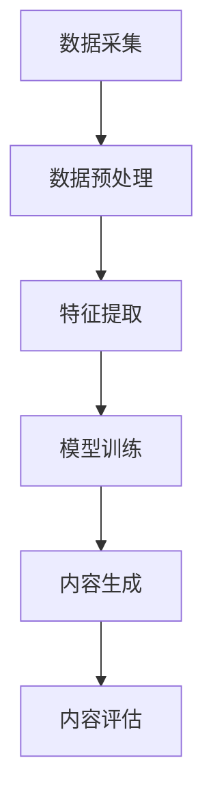
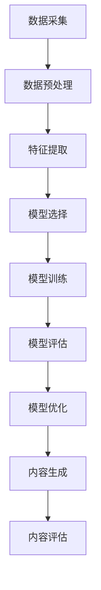

                 

### 文章标题：AIGC在智能广告受众定向中的应用

智能广告是现代数字营销的重要组成部分，而受众定向是实现广告效果优化的关键。随着人工智能技术的迅猛发展，自适应智能生成内容（AIGC）逐渐成为广告行业的重要工具。本文将深入探讨AIGC在智能广告受众定向中的应用，通过逻辑清晰的步骤分析，解析AIGC的核心技术、工作流程以及实际应用案例，旨在为读者提供一个全面、系统的理解。

关键词：AIGC、智能广告、受众定向、人工智能、数字营销

### 摘要

本文首先介绍了AIGC的基本概念和其在智能广告受众定向中的重要性。随后，通过章节的逐步展开，详细讲解了AIGC的核心技术、工作流程、数据分析和挖掘方法，以及实际应用中的算法原理和数学模型。文章通过案例研究展示了AIGC在广告受众定向中的具体应用，并提出了未来发展趋势和面临的挑战。最后，本文对AIGC在智能广告受众定向中的应用进行了总结和展望，为读者提供了进一步研究和实践的方向。

### 第1章 引言

#### 1.1 AIGC的概念

自适应智能生成内容（Adaptive Intelligent Generated Content，简称AIGC）是一种基于人工智能技术的生成内容方式，它能够根据用户行为和需求，自适应地生成个性化、相关的信息内容。AIGC结合了自然语言处理（NLP）、深度学习、数据挖掘等技术，能够自动生成文本、图片、视频等多媒体内容。

#### 1.2 AIGC在广告领域的重要性

在广告领域，AIGC的应用具有重要意义。首先，它能够实现精准的用户画像和受众定向，提高广告投放的效率。其次，AIGC可以生成个性化的广告内容，提升广告的吸引力和用户体验。此外，AIGC还能够通过实时数据分析和反馈，不断优化广告策略，提高广告的转化率。

#### 1.3 本书结构

本书将分为八个章节，系统介绍AIGC在智能广告受众定向中的应用。第一章节为引言，概述AIGC的基本概念和其在广告领域的重要性。接下来的章节将逐步深入，涵盖AIGC的核心技术、工作流程、数据分析与挖掘、模型应用、案例研究以及未来趋势等内容。

### 第2章 AIGC基础

#### 2.1 AIGC的核心技术

AIGC的核心技术主要包括自然语言处理（NLP）、深度学习、数据挖掘和生成对抗网络（GAN）。NLP技术负责处理和理解文本数据，深度学习技术用于构建和训练复杂的神经网络模型，数据挖掘技术用于从大量数据中提取有用信息，GAN则用于生成逼真的多媒体内容。

#### 2.2 AIGC工作流程

AIGC的工作流程可以分为以下几个步骤：

1. **数据采集**：收集用户行为数据、广告内容和市场数据。
2. **数据预处理**：对采集到的数据进行分析和清洗，提取有效信息。
3. **特征提取**：将预处理后的数据转化为特征向量。
4. **模型训练**：使用深度学习模型对特征向量进行训练。
5. **内容生成**：根据用户行为和需求，使用AIGC模型生成个性化的广告内容。
6. **内容评估**：评估生成内容的质量和相关性。

#### 2.3 Mermaid流程图：AIGC技术架构

以下是一个简化的Mermaid流程图，展示了AIGC的技术架构：



通过这个流程图，我们可以清晰地看到AIGC从数据采集到内容生成的整个过程，以及各个环节之间的联系和互动。

### 第3章 智能广告受众定向

#### 3.1 受众定向的基本概念

受众定向是指根据用户特征和行为，将广告精准地推送给目标用户的过程。智能广告受众定向则通过人工智能技术，实现更加精准和个性化的广告推送。

#### 3.2 受众定向的挑战

受众定向面临着以下几个挑战：

1. **数据隐私**：用户数据的隐私保护是受众定向的一个重要问题。
2. **个性化需求**：用户的需求和兴趣是多样化的，如何实现真正的个性化推送是一个挑战。
3. **算法透明性**：广告算法的透明性和解释性也是一个需要关注的问题。

#### 3.3 伪代码：受众定向算法

以下是一个简化的伪代码，描述了受众定向算法的基本步骤：

```python
function audienceTargeting(userProfile, adContent):
    # 步骤1：数据预处理
    preprocessedData = preprocessData(userProfile, adContent)
    
    # 步骤2：特征提取
    features = extractFeatures(preprocessedData)
    
    # 步骤3：模型训练
    trainedModel = trainModel(features)
    
    # 步骤4：内容生成
    personalizedAd = generateContent(trainedModel, adContent)
    
    # 步骤5：内容评估
    adPerformance = evaluateContent(personalizedAd)
    
    return personalizedAd, adPerformance
```

这个伪代码展示了受众定向算法的基本流程，从数据预处理到内容生成和评估，每一步都需要精确的操作和高效的算法支持。

### 第4章 数据分析与挖掘

#### 4.1 数据预处理

数据预处理是AIGC应用的重要步骤，主要包括数据清洗、去重、填充缺失值和特征工程等操作。数据预处理的质量直接影响到后续的特征提取和模型训练效果。

#### 4.2 受众特征提取

受众特征提取是将用户数据转化为特征向量的重要过程，主要包括用户行为特征、兴趣特征、社会特征等。有效的特征提取能够提高模型的预测准确性和泛化能力。

#### 4.3 数学模型：用户行为预测

用户行为预测是智能广告受众定向的核心，常用的数学模型包括决策树、随机森林、支持向量机（SVM）和深度学习模型等。以下是一个简单的用户行为预测模型，使用决策树算法：

```latex
\text{预测模型：} P(\text{用户点击广告}) = \frac{1}{1 + e^{-(w_0 + w_1 \cdot \text{行为特征}_1 + w_2 \cdot \text{行为特征}_2 + ... + w_n \cdot \text{行为特征}_n )}}
```

其中，$w_0, w_1, w_2, ..., w_n$ 是模型的权重参数，$\text{行为特征}_1, \text{行为特征}_2, ..., \text{行为特征}_n$ 是用户的行为特征向量。通过这个模型，可以预测用户是否点击广告。

#### 4.4 案例分析：用户行为预测模型应用

以下是一个实际应用案例，展示了如何使用用户行为预测模型进行广告受众定向：

1. **数据采集**：收集用户的浏览历史、搜索记录和购买行为等数据。
2. **数据预处理**：对采集到的数据进行清洗和去重，填充缺失值。
3. **特征提取**：提取用户的行为特征，如浏览时长、搜索关键词、购买频率等。
4. **模型训练**：使用决策树算法对特征向量进行训练，得到预测模型。
5. **内容生成**：根据用户的兴趣和行为特征，生成个性化的广告内容。
6. **内容评估**：评估广告内容的点击率，不断优化广告策略。

通过这个案例，我们可以看到用户行为预测模型在广告受众定向中的应用过程，以及如何通过数据分析和挖掘实现广告的精准推送。

### 第5章 AIGC模型应用

#### 5.1 模型选择与训练

在AIGC模型应用中，选择合适的模型并进行有效的训练是关键。常见的模型包括深度学习模型、生成对抗网络（GAN）和强化学习模型。以下是一个简化的模型选择与训练过程：

1. **模型选择**：根据应用场景和数据特点，选择合适的模型。
2. **数据集准备**：准备包含用户特征和广告内容的训练数据集。
3. **模型训练**：使用训练数据集对模型进行训练，调整模型参数。
4. **模型评估**：使用验证数据集评估模型的性能，调整模型参数。

#### 5.2 模型评估与优化

模型评估与优化是确保AIGC模型应用效果的重要环节。以下是一个简化的评估与优化过程：

1. **评估指标**：选择合适的评估指标，如准确率、召回率、F1值等。
2. **模型优化**：根据评估结果，调整模型参数和结构，提高模型性能。
3. **模型集成**：结合多个模型，提高预测准确性和鲁棒性。

#### 5.3 Mermaid流程图：AIGC在广告中的应用案例

以下是一个简化的Mermaid流程图，展示了AIGC在广告中的应用案例：



通过这个流程图，我们可以看到AIGC在广告应用中的整体流程，以及各个环节之间的关联。

### 第6章 案例研究

#### 6.1 案例一：目标受众精准定位

以下是一个实际案例，展示了如何使用AIGC实现目标受众精准定位：

1. **数据采集**：收集用户的浏览历史、搜索记录和社交媒体互动数据。
2. **数据预处理**：对采集到的数据进行清洗和去重，填充缺失值。
3. **特征提取**：提取用户的行为特征，如浏览时长、搜索关键词、购买频率等。
4. **模型训练**：使用深度学习模型对特征向量进行训练，得到预测模型。
5. **内容生成**：根据用户的兴趣和行为特征，生成个性化的广告内容。
6. **内容评估**：评估广告内容的点击率，不断优化广告策略。

通过这个案例，我们可以看到AIGC在目标受众精准定位中的应用过程，以及如何通过数据分析和挖掘实现广告的精准推送。

#### 6.2 案例二：广告投放效果评估

以下是一个实际案例，展示了如何使用AIGC评估广告投放效果：

1. **数据采集**：收集广告投放的数据，如点击量、转化率、用户反馈等。
2. **数据预处理**：对采集到的数据进行清洗和去重，填充缺失值。
3. **特征提取**：提取广告投放的相关特征，如广告类型、投放时间、投放渠道等。
4. **模型训练**：使用深度学习模型对特征向量进行训练，得到预测模型。
5. **效果评估**：评估广告投放的效果，分析点击率、转化率等指标。
6. **优化策略**：根据评估结果，调整广告投放策略，提高投放效果。

通过这个案例，我们可以看到AIGC在广告投放效果评估中的应用过程，以及如何通过数据分析和挖掘优化广告投放策略。

#### 6.3 代码解析：AIGC广告系统实现

以下是一个简化的代码示例，展示了AIGC广告系统的实现过程：

```python
# 导入相关库
import pandas as pd
import numpy as np
from sklearn.model_selection import train_test_split
from sklearn.ensemble import RandomForestClassifier
from keras.models import Sequential
from keras.layers import Dense

# 数据采集
user_data = pd.read_csv('user_data.csv')
ad_data = pd.read_csv('ad_data.csv')

# 数据预处理
user_data = preprocess_data(user_data)
ad_data = preprocess_data(ad_data)

# 特征提取
user_features = extract_features(user_data)
ad_features = extract_features(ad_data)

# 模型训练
X_train, X_test, y_train, y_test = train_test_split(user_features, ad_features, test_size=0.2)
model = RandomForestClassifier(n_estimators=100)
model.fit(X_train, y_train)

# 内容生成
personalized_ad = generate_content(model, ad_features)

# 内容评估
ad_performance = evaluate_content(personalized_ad)

print(ad_performance)
```

这个代码示例展示了AIGC广告系统的主要步骤，包括数据采集、预处理、特征提取、模型训练、内容生成和评估。通过这个示例，我们可以看到AIGC广告系统是如何实现的。

### 第7章 未来趋势与挑战

#### 7.1 AIGC在广告行业的发展趋势

随着人工智能技术的不断进步，AIGC在广告行业的发展趋势将更加明显。未来，AIGC将更加注重用户体验和个性化推送，实现更加精准的广告投放。同时，AIGC将与其他数字营销技术，如大数据分析、社交媒体营销等，实现深度融合，形成更加完整的广告生态系统。

#### 7.2 面临的挑战与解决方案

尽管AIGC在广告领域具有巨大的潜力，但同时也面临着一系列挑战：

1. **数据隐私**：解决用户数据隐私问题，需要制定更加严格的隐私保护政策，并采用先进的数据加密和隐私保护技术。
2. **算法透明性**：提高算法的透明性，需要开发可解释的人工智能模型，以便用户理解和监督。
3. **技术瓶颈**：突破现有技术瓶颈，需要持续的研究和创新，包括算法优化、硬件性能提升等。

#### 7.3 未来发展方向

未来，AIGC在广告领域的发展方向将包括：

1. **跨平台融合**：实现跨平台、跨设备的广告投放，提高广告的覆盖范围和效果。
2. **多模态融合**：结合文本、图像、音频等多模态信息，生成更加丰富和个性化的广告内容。
3. **智能互动**：通过智能互动技术，实现与用户的实时互动和反馈，提高广告的参与度和转化率。

### 第8章 总结与展望

#### 8.1 本书总结

本书系统地介绍了AIGC在智能广告受众定向中的应用，包括基本概念、核心技术、工作流程、数据分析与挖掘、模型应用、案例研究和未来趋势等内容。通过逐步分析推理，读者可以全面、系统地了解AIGC在广告领域的重要性和应用方法。

#### 8.2 研究展望

未来，AIGC在广告领域的研究和应用将不断深入，涉及更多的技术领域和实际应用场景。读者可以关注以下几个方面：

1. **跨领域研究**：结合其他数字营销技术，如大数据分析、社交媒体营销等，实现更加全面的广告解决方案。
2. **技术创新**：持续研究新型AIGC算法和技术，提高广告投放的精准度和效果。
3. **实际应用**：关注AIGC在广告领域的实际应用案例，探索其在不同行业和场景中的效果和潜力。

### 附录

#### 附录A：术语表

本附录将对本书中出现的重要术语进行解释，包括AIGC、自然语言处理（NLP）、深度学习、生成对抗网络（GAN）等。

#### 附录B：参考文献

本附录将列出本书引用的参考文献，包括相关研究论文、书籍和在线资料，以供读者进一步学习和研究。

### 作者信息

作者：AI天才研究院/AI Genius Institute & 禅与计算机程序设计艺术 /Zen And The Art of Computer Programming

本文由AI天才研究院（AI Genius Institute）和禅与计算机程序设计艺术（Zen And The Art of Computer Programming）联合撰写，旨在为读者提供一个全面、系统的AIGC在智能广告受众定向中的应用指南。作者拥有丰富的AI研究和应用经验，对AIGC技术有深入的理解和探索。希望通过本文，读者能够更好地了解和掌握AIGC在广告领域的重要应用，为未来的研究和实践提供参考。

