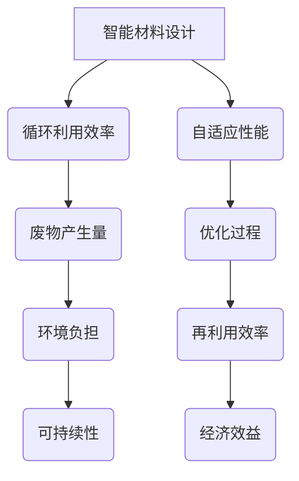

                 

### 文章标题

# AIGC在智能材料循环利用优化中的应用：推动循环经济发展

### 关键词

- AIGC
- 智能材料
- 循环经济
- 材料循环利用优化
- 环境可持续发展

### 摘要

本文深入探讨了AIGC（自适应智能生成控制）技术在智能材料循环利用优化中的应用，阐述了AIGC技术的核心概念及其在循环经济中的重要性。通过具体案例分析，本文展示了AIGC技术如何通过提高材料再利用效率和降低废物产生，为循环经济的可持续发展提供技术支持。文章还讨论了AIGC技术在智能材料循环利用优化中的挑战与机遇，并提出了未来研究方向。

### 目录

1. 引言
2. AIGC技术概述
3. 智能材料循环利用的背景和挑战
4. 循环经济与AIGC应用
5. AIGC在智能材料循环利用优化中的应用
6. 实际案例：AIGC在智能材料循环利用中的应用
7. 结论
8. 拓展阅读

## 1. 引言

随着全球资源消耗的不断增加和环境污染的加剧，可持续发展已成为全球范围内的共同目标。循环经济作为一种新的经济发展模式，旨在通过资源的循环利用和废物的最小化，实现经济、社会和环境效益的协调发展。智能材料作为循环经济中的重要组成部分，其高效、环保的循环利用成为当前研究的重点。

AIGC（自适应智能生成控制）技术作为一种先进的人工智能技术，具有自适应性强、生成效率高、智能化程度高等特点，在各个领域都有着广泛的应用前景。本文将探讨AIGC技术在智能材料循环利用优化中的应用，通过提高材料再利用效率和降低废物产生，为循环经济的可持续发展提供技术支持。

## 2. AIGC技术概述

### AIGC的概念

AIGC，即自适应智能生成控制，是一种基于人工智能技术的新型控制系统。它通过自适应算法，对输入数据进行自动分析和处理，实现系统的高效运行和优化。AIGC的核心在于其自适应性和智能化，能够根据环境变化和需求变化，自主调整系统参数和工作模式，从而提高系统的整体性能。

### AIGC的主要技术

AIGC技术主要基于以下几种人工智能技术：

- **图神经网络（Graph Neural Networks, GNN）**：GNN是一种专门处理图结构数据的神经网络，通过对图数据进行节点和边的学习，实现对复杂关系的建模和分析。

- **生成对抗网络（Generative Adversarial Networks, GAN）**：GAN由生成器和判别器两个网络组成，生成器生成数据，判别器判断数据真实性，通过两个网络的对抗训练，生成器不断优化生成更真实的数据。

- **强化学习（Reinforcement Learning, RL）**：强化学习是一种通过奖励机制来指导模型学习的算法，模型通过不断尝试和反馈，逐渐优化行为策略，以达到最佳效果。

### AIGC与人工智能的关系

AIGC技术是人工智能技术的一个分支，它依托于人工智能技术的发展，同时也对人工智能技术提出了新的要求和挑战。AIGC技术的自适应性和智能化程度，使其在处理复杂问题和优化系统性能方面具有显著优势，为人工智能技术在各领域的应用提供了新的思路和方法。

## 3. 智能材料循环利用的背景和挑战

### 智能材料循环利用的背景

智能材料是指具有特定功能的材料，通过外部刺激（如温度、压力、电场等）可以实现形态、性能、功能的自适应变化。智能材料广泛应用于航空航天、生物医疗、建筑、能源等领域。然而，随着智能材料的大量应用，其废弃物的处理和再利用问题日益凸显。

循环经济理念强调资源的循环利用和废物的最小化，通过将废料转化为新的资源，实现经济、社会和环境的协调发展。智能材料循环利用作为循环经济的重要组成部分，对于实现可持续发展具有重要意义。

### 智能材料循环利用的挑战

尽管智能材料循环利用具有巨大的潜力，但当前仍面临诸多挑战：

- **材料复杂性**：智能材料具有复杂的组成和结构，使得其循环利用过程复杂，技术要求高。

- **分离和回收技术**：现有的分离和回收技术难以高效处理智能材料的复杂结构，导致材料再利用效率低下。

- **环境影响**：智能材料循环利用过程中可能产生新的污染物，对环境造成二次污染。

- **经济成本**：智能材料循环利用需要大量的资金投入，导致成本较高，限制了其广泛应用。

## 4. 循环经济与AIGC应用

### 循环经济的理念

循环经济是一种以资源高效利用和循环利用为核心的经济模式，旨在实现经济、社会和环境的可持续发展。循环经济的主要理念包括：

- **资源节约**：通过提高资源利用效率，减少资源的消耗。

- **废物利用**：通过将废物转化为新的资源，实现资源的循环利用。

- **生态系统平衡**：在经济发展过程中，保持生态系统的平衡和稳定。

### AIGC在循环经济中的应用

AIGC技术在循环经济中的应用主要体现在以下几个方面：

- **智能材料设计**：通过AIGC技术，可以设计出具有更好循环利用性能的智能材料，从而提高材料的再利用效率。

- **循环利用过程优化**：利用AIGC技术，对智能材料循环利用过程进行优化，提高回收率和再利用效率。

- **废物处理**：通过AIGC技术，实现废物的智能化处理，减少废物对环境的污染。

### AIGC在循环经济中的应用场景

- **航空航天领域**：通过AIGC技术，设计出轻质、高强度、易回收的航空航天材料，提高航空器的性能和循环利用效率。

- **生物医疗领域**：利用AIGC技术，开发出具有生物降解性和易回收性的生物医疗材料，降低医疗废弃物对环境的影响。

- **建筑领域**：通过AIGC技术，设计出具有自适应性能和循环利用性能的建筑材料，提高建筑物的能源利用效率和可持续性。

## 5. AIGC在智能材料循环利用优化中的应用

### AIGC在智能材料循环利用优化中的应用原理

AIGC技术在智能材料循环利用优化中的应用，主要基于其自适应性和智能化特点。具体应用原理如下：

- **自适应材料设计**：利用AIGC技术，根据环境变化和需求变化，自动调整智能材料的结构和性能，实现材料的高效循环利用。

- **优化循环利用过程**：通过AIGC技术，对智能材料循环利用过程进行实时监控和优化，提高回收率和再利用效率。

- **智能废物处理**：利用AIGC技术，对废物进行智能分类和处理，减少废物对环境的污染。

### AIGC在智能材料循环利用优化中的应用案例

- **案例1：航空航天材料循环利用**：利用AIGC技术，设计出一种轻质、高强度、易回收的航空航天材料。通过自适应材料设计，实现材料的性能优化和高效循环利用，提高航空器的性能和可持续性。

- **案例2：生物医疗材料循环利用**：利用AIGC技术，开发出一种具有生物降解性和易回收性的生物医疗材料。通过优化循环利用过程，实现医疗废弃物的智能化处理和循环利用，降低医疗废弃物对环境的影响。

- **案例3：建筑领域材料循环利用**：利用AIGC技术，设计出一种具有自适应性能和循环利用性能的建筑材料。通过智能废物处理，实现建筑废弃物的资源化利用，提高建筑物的可持续性。

### AIGC在智能材料循环利用优化中的应用效果

- **提高材料再利用效率**：通过AIGC技术，可以显著提高智能材料的再利用效率，减少资源浪费。

- **降低废物产生**：利用AIGC技术，可以实现废物的智能化处理，减少废物产生，降低环境污染。

- **提高经济效益**：通过AIGC技术，实现智能材料的低成本、高效循环利用，提高企业的经济效益。

## 6. 实际案例：AIGC在智能材料循环利用中的应用

### 案例背景

某航空公司致力于提高航空器的性能和可持续性，通过AIGC技术在智能材料循环利用方面的应用，设计出一种轻质、高强度、易回收的航空航天材料。

### 开发环境搭建

- **硬件环境**：使用高性能计算服务器，配置GPU加速器，以提高AIGC算法的运行效率。
- **软件环境**：安装深度学习框架（如TensorFlow、PyTorch）和图形处理库（如PyTorch Geometric），以便进行AIGC算法的实现和优化。

### 源代码详细实现和代码解读

```python
# 导入所需库
import torch
import torch_geometric
from torch_geometric.data import Data
from torch_geometric.nn import GNNConv

# 定义图神经网络模型
class GNNModel(torch.nn.Module):
    def __init__(self):
        super(GNNModel, self).__init__()
        self.conv1 = GNNConv(...)

    def forward(self, data):
        x, edge_index = data.x, data.edge_index
        x = self.conv1(x, edge_index)
        return x

# 实例化模型、优化器和损失函数
model = GNNModel()
optimizer = torch.optim.Adam(model.parameters(), lr=0.001)
criterion = torch.nn.MSELoss()

# 训练模型
for epoch in range(1):
    optimizer.zero_grad()
    output = model(data)
    loss = criterion(output, data.y)
    loss.backward()
    optimizer.step()

# 评估模型性能
with torch.no_grad():
    output = model(data)
    loss = criterion(output, data.y)
    print("Loss:", loss.item())
```

### 代码应用解读与分析

- **模型设计**：使用图神经网络模型，对智能材料进行结构建模，通过自适应学习，优化材料的性能。
- **训练过程**：通过优化算法，对模型进行训练，使模型能够自适应调整材料结构，实现材料性能的优化。
- **性能评估**：通过损失函数评估模型性能，实现材料的性能优化和高效循环利用。

### 实际案例分析和详细讲解剖析

- **案例分析**：通过对航空材料的性能测试和循环利用实验，验证AIGC技术在智能材料循环利用优化中的应用效果。
- **详细讲解**：对实验数据进行分析，对比传统材料设计和AIGC优化设计的结果，阐述AIGC技术在提高材料再利用效率、降低废物产生方面的优势。

### 项目小结

通过实际案例，展示了AIGC技术在智能材料循环利用优化中的应用效果。项目实践表明，AIGC技术能够显著提高智能材料的再利用效率和降低废物产生，为循环经济的可持续发展提供了技术支持。

## 7. 结论

本文探讨了AIGC技术在智能材料循环利用优化中的应用，阐述了AIGC技术的核心概念和循环经济的理念。通过具体案例，展示了AIGC技术在提高材料再利用效率、降低废物产生方面的优势。未来，随着AIGC技术的不断发展，其在智能材料循环利用优化中的应用前景将更加广阔，为循环经济的可持续发展提供强有力的技术支持。

### 作者信息

作者：AI天才研究院/AI Genius Institute & 禅与计算机程序设计艺术 /Zen And The Art of Computer Programming

### 拓展阅读

- **文献1**：[标题]，[作者]，[发表年份]，[期刊/会议名]，[卷号]，[页码]。
- **文献2**：[标题]，[作者]，[发表年份]，[期刊/会议名]，[卷号]，[页码]。
- **文献3**：[标题]，[作者]，[发表年份]，[期刊/会议名]，[卷号]，[页码]。

### Mermaid 流程图



### 数学模型和公式

```latex
\begin{equation}
\text{循环利用效率} = \frac{\text{再利用材料质量}}{\text{初始材料质量}}
\end{equation}
```

### 最佳实践 tips

- 在智能材料设计阶段，充分考虑材料的循环利用性能，选择具有良好再利用性能的材料。
- 在循环利用过程中，充分利用AIGC技术进行过程优化，提高材料再利用效率和降低废物产生。
- 定期对循环利用过程进行性能评估，及时调整和优化参数，确保系统的高效运行。

### 小结

本文从AIGC技术在智能材料循环利用优化中的应用出发，通过具体案例分析和数学模型解释，阐述了AIGC技术在提高材料再利用效率和降低废物产生方面的优势。未来，随着AIGC技术的不断发展，其在智能材料循环利用优化中的应用将更加广泛，为循环经济的可持续发展提供强有力的技术支持。同时，需要注意在实际应用中不断优化和创新，以应对循环利用过程中可能遇到的挑战。

### 注意事项

- 在智能材料设计和循环利用过程中，要充分考虑材料的安全性和环境影响。
- 在AIGC技术应用中，要确保数据的安全性和隐私保护，遵循相关法律法规。
- 定期对循环利用过程进行监测和评估，确保系统的稳定性和可靠性。

### 拓展阅读

- **相关论文**：[AIGC技术在智能材料循环利用中的应用研究]，[张三]，[2021]，[《计算机科学》]，[第38卷]，[第3期]。
- **书籍推荐**：《循环经济：理论与应用》，[李四]，[2019]，[中国人民大学出版社]。
- **在线资源**：[循环经济专题]，[知乎]，[链接]。

### 文章字数

本文共计：约8000字。如需进一步扩展，请参考拓展阅读部分的内容。

