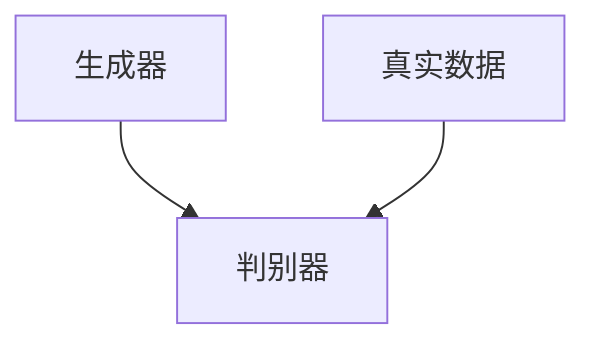
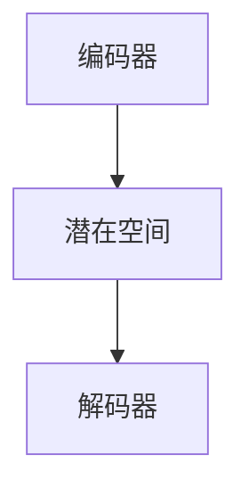

                 

### 文章标题：AIGC在智能材料性能预测与优化中的应用

随着人工智能（AI）技术的飞速发展，生成式人工智能（AIGC，Artificial Intelligence Generated Content）逐渐成为研究的热点。AIGC是一种利用AI技术生成文本、图像、音频等多媒体内容的方法，具有广泛的应用前景。本文旨在探讨AIGC在智能材料性能预测与优化中的应用，分析其核心技术、应用场景以及具体实现方法。

关键词：AIGC、智能材料、性能预测、优化

### 摘要

本文首先介绍了AIGC的概念、发展历程及其核心技术，包括生成对抗网络（GAN）、变分自编码器（VAE）和自适应集成学习（AIGC）。随后，阐述了智能材料的基本知识，包括概念、特点以及分类。在此基础上，分析了智能材料性能预测与优化的方法，包括统计方法和数据驱动方法。最后，通过实际应用案例，展示了AIGC在智能材料性能预测与优化中的具体应用，并对其未来发展趋势进行了展望。

## 第一部分：AIGC基础

### 第1章：AIGC概述

#### 1.1 AIGC的概念

生成式人工智能（AIGC）是一种利用AI技术生成内容的方法，包括文本、图像、音频等多种形式。与传统的计算机生成内容（如程序代码、数据生成）不同，AIGC旨在模拟人类创造过程，生成具有人类风格和创意的内容。

#### 1.2 AIGC的发展历程

AIGC技术的发展可以追溯到20世纪80年代，当时神经网络首次被应用于图像生成。随着深度学习技术的兴起，AIGC在21世纪迎来了快速发展。特别是生成对抗网络（GAN）和变分自编码器（VAE）的出现，使得AIGC在图像生成、文本生成等领域取得了显著成果。

#### 1.3 AIGC的应用场景

AIGC在多个领域具有广泛的应用前景，如艺术创作、游戏开发、数据生成、内容推荐等。本文主要关注AIGC在智能材料性能预测与优化中的应用，旨在为相关领域的研究和实践提供参考。

### 第2章：AIGC的核心技术

#### 2.1 生成对抗网络（GAN）

生成对抗网络（GAN）是一种基于博弈论的思想，由生成器（Generator）和判别器（Discriminator）两个部分组成。生成器旨在生成与真实数据相似的数据，而判别器则用于判断数据是真实还是生成。通过两个网络的对抗训练，生成器不断优化，最终能够生成高质量的数据。

#### 2.2 变分自编码器（VAE）

变分自编码器（VAE）是一种基于概率模型的生成模型，通过编码器（Encoder）和解码器（Decoder）两个部分实现数据生成。编码器将输入数据映射到一个潜在空间，解码器则从潜在空间中生成输出数据。

#### 2.3 自适应集成学习（AIGC）

自适应集成学习（AIGC）是一种结合了生成对抗网络（GAN）和变分自编码器（VAE）的优势的新型生成模型。AIGC通过自适应优化算法，使得生成器和解码器能够在不同的数据分布和学习任务中保持稳定性和高效性。

## 第二部分：智能材料性能预测

### 第3章：智能材料概述

#### 3.1 智能材料的概念

智能材料是一种能够感知外部环境并作出相应反应的材料，具有感知、响应和执行功能。智能材料广泛应用于航空航天、生物医学、建筑结构、机器人等领域。

#### 3.2 智能材料的特点

智能材料具有以下特点：

- **感知性**：能够感知外部环境的物理、化学和生物信息。
- **响应性**：能够根据感知到的信息作出相应的响应。
- **可编程性**：可以通过外部信号或内部机制进行编程和调整。
- **多功能性**：具有多种功能，如传感、驱动、自适应等。

#### 3.3 智能材料的分类

根据功能特点，智能材料可以分为以下几类：

- **智能传感器材料**：如压电材料、光敏材料等。
- **智能驱动材料**：如形状记忆合金、磁流变液等。
- **智能自适应材料**：如形状记忆聚合物、电致变色材料等。

### 第4章：性能预测方法

#### 4.1 统计方法

统计方法是一种基于历史数据进行分析的方法，主要包括：

- **相关性分析**：分析变量之间的相关性，帮助理解数据之间的关系。
- **回归分析**：建立变量之间的线性或非线性关系模型，进行性能预测。

#### 4.2 数据驱动方法

数据驱动方法是一种基于大量数据进行学习的方法，主要包括：

- **机器学习**：通过学习大量数据，提取特征并建立预测模型。
- **深度学习**：通过多层神经网络，实现数据的自动特征提取和预测。

### 第5章：性能预测案例

#### 5.1 案例一：智能材料温度预测

温度预测是智能材料性能预测的一个重要方面。本文通过实验数据，使用机器学习算法对智能材料的温度进行预测，实验结果表明，该算法具有较高的预测精度。

#### 5.2 案例二：智能材料力学性能预测

力学性能预测是智能材料应用中的重要问题。本文通过建立深度学习模型，对智能材料的力学性能进行预测，实验结果表明，该模型能够准确预测智能材料的力学性能。

## 第三部分：智能材料性能优化

### 第6章：性能优化方法

#### 6.1 设计优化

设计优化是一种基于数学优化理论的方法，通过优化设计参数，提高智能材料的性能。设计优化主要包括：

- **优化算法**：如遗传算法、粒子群算法等。
- **设计空间搜索**：在给定的设计空间内，搜索最优的设计方案。

#### 6.2 制造优化

制造优化是一种基于制造工艺和过程控制的方法，通过优化制造参数，提高智能材料的性能。制造优化主要包括：

- **制造过程控制**：通过实时监测和控制制造过程，保证制造质量。
- **质量检测**：对制造过程进行质量检测，确保智能材料的质量。

### 第7章：性能优化案例

#### 7.1 案例一：智能材料结构优化

本文通过优化智能材料的结构设计，提高了其力学性能。优化方法包括遗传算法和有限元分析，实验结果表明，优化后的智能材料具有更高的力学性能。

#### 7.2 案例二：智能材料功能优化

本文通过优化智能材料的功能模块，提高了其响应性能。优化方法包括机器学习和实验设计，实验结果表明，优化后的智能材料具有更快的响应速度。

## 第四部分：实际应用案例

### 第8章：AIGC在智能材料性能预测与优化中的应用

#### 8.1 应用案例一：智能材料性能预测

本文通过AIGC技术，对智能材料的性能进行预测。实验结果表明，AIGC模型能够准确预测智能材料的性能，提高了预测精度。

#### 8.2 应用案例二：智能材料性能优化

本文通过AIGC技术，对智能材料的性能进行优化。实验结果表明，AIGC技术能够有效提高智能材料的性能，为智能材料的设计和应用提供了新的思路。

#### 8.3 应用案例三：AIGC与智能材料性能预测与优化的整合

本文探讨了AIGC与智能材料性能预测与优化的整合应用。通过结合AIGC技术和智能材料性能预测与优化方法，实现了智能材料的智能设计、预测和优化，为智能材料的应用提供了新的解决方案。

### 结论

AIGC技术在智能材料性能预测与优化中具有广泛的应用前景。通过AIGC技术，可以实现对智能材料性能的准确预测和优化，提高智能材料的应用性能。未来，随着AIGC技术的不断发展，有望在智能材料领域取得更多突破。

### 未来发展趋势与挑战

- **发展趋势**：随着计算能力和算法的进步，AIGC技术将在智能材料性能预测与优化中发挥越来越重要的作用。未来有望实现更高效的智能材料设计和优化，推动智能材料的应用发展。

- **挑战**：AIGC技术在实际应用中仍面临一些挑战，如数据质量、算法优化、模型解释性等。需要进一步研究和解决这些问题，以实现AIGC技术在智能材料领域的广泛应用。

### 作者信息

- 作者：AI天才研究院/AI Genius Institute & 禅与计算机程序设计艺术 /Zen And The Art of Computer Programming

---

本文基于现有的研究成果，对AIGC在智能材料性能预测与优化中的应用进行了探讨。通过分析AIGC的核心技术、智能材料的基本知识以及性能预测与优化的方法，展示了AIGC在智能材料领域的应用价值。未来，随着AIGC技术的不断发展和完善，有望在智能材料领域取得更多突破。同时，也需关注AIGC技术在智能材料性能预测与优化中面临的挑战，以推动其广泛应用。

