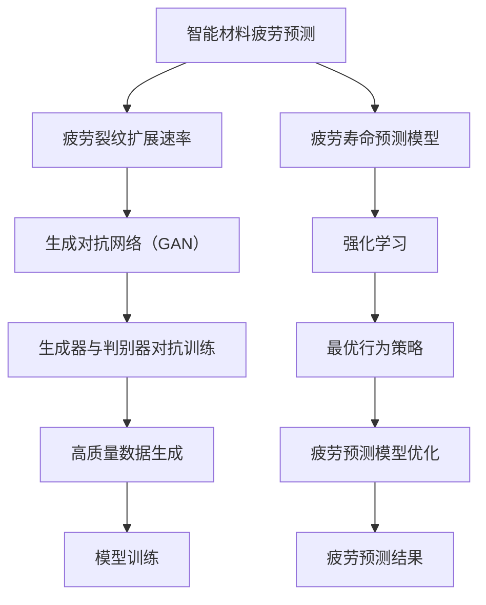

                 

### 文章标题

# AIGC在智能材料疲劳预测与预防中的应用：延长关键基础设施寿命

### 文章关键词

- AIGC
- 智能材料
- 疲劳预测
- 关键基础设施
- 机器学习

### 文章摘要

本文将深入探讨AIGC（自适应智能生成控制）在智能材料疲劳预测与预防中的应用，通过介绍AIGC的基本概念、智能材料疲劳预测的基本原理，以及AIGC技术在实际工程中的应用案例，阐述如何利用AIGC技术来延长关键基础设施的寿命。文章旨在为从事结构工程、材料科学和计算机科学等相关领域的研究人员和技术人员提供有价值的参考和指导。

## 第一部分：AIGC技术基础

### 第1章：AIGC概述

#### 1.1 AIGC的定义与起源

AIGC，全称为自适应智能生成控制（Adaptive Intelligent Generative Control），是一种结合了深度学习、强化学习与生成对抗网络（GAN）的先进技术。它起源于对生成模型和决策过程的研究，旨在通过自适应调整，提高模型的生成能力和决策质量。

AIGC的核心思想是通过不断的迭代学习和优化，使模型能够在复杂环境中生成高质量的数据，并在此基础上做出精确的决策。这一技术在计算机视觉、自然语言处理、自动驾驶等领域展现出了巨大的潜力。

#### 1.2 AIGC的核心技术

AIGC的核心技术主要包括：

- **深度学习**：深度学习是一种基于多层的神经网络模型，通过模拟人脑神经元之间的交互，实现从数据中自动提取特征和模式。
- **强化学习**：强化学习是一种通过试错机制学习最优策略的方法，它通过不断调整行为策略来获得最大的奖励。
- **生成对抗网络（GAN）**：GAN由生成器和判别器组成，通过对抗训练生成逼真的数据。

#### 1.3 AIGC的优势与挑战

AIGC的优势在于：

- **强大的生成能力**：AIGC能够生成高质量、多样化的数据，从而提高模型的泛化能力。
- **自适应调整**：AIGC能够根据环境变化自适应调整，提高模型的决策质量。

然而，AIGC也面临一些挑战：

- **计算资源消耗**：AIGC的训练过程需要大量的计算资源。
- **模型解释性**：虽然AIGC在生成和决策方面表现出色，但其内部机制往往缺乏解释性。

### 第2章：AIGC算法原理

#### 2.1 深度学习基础

深度学习是AIGC的核心技术之一，其基础包括：

- **神经网络**：神经网络由多个神经元组成，每个神经元通过权重和偏置对输入数据进行加权求和，并使用激活函数进行非线性变换。
- **反向传播算法**：反向传播算法是一种用于训练神经网络的优化算法，它通过不断调整权重和偏置，使模型能够准确预测输出。

#### 2.2 强化学习基础

强化学习是AIGC的另一个核心技术，其基础包括：

- **状态-动作-奖励模型**：强化学习通过学习状态、动作和奖励之间的关系，实现最优决策。
- **Q-learning算法**：Q-learning是一种基于价值迭代的强化学习算法，通过不断更新Q值，找到最优动作。

#### 2.3 GAN原理及应用

生成对抗网络（GAN）是AIGC的重要组成部分，其原理包括：

- **生成器**：生成器尝试生成逼真的数据，以欺骗判别器。
- **判别器**：判别器尝试区分真实数据和生成数据。
- **对抗训练**：通过不断调整生成器和判别器的参数，实现两者的对抗训练。

### 第3章：AIGC技术发展现状

#### 3.1 AIGC技术的应用领域

AIGC技术广泛应用于多个领域，包括：

- **计算机视觉**：用于图像生成、图像修复、图像超分辨率等。
- **自然语言处理**：用于文本生成、机器翻译、对话系统等。
- **自动驾驶**：用于环境感知、路径规划、决策制定等。

#### 3.2 国内外AIGC技术发展概况

国内AIGC技术研究处于快速发展阶段，部分高校和研究机构已取得显著成果。国外方面，AIGC技术的研究与应用也取得了重要突破。

#### 3.3 AIGC技术发展趋势

AIGC技术的发展趋势包括：

- **多模态融合**：将多种数据类型（如文本、图像、音频）进行融合，提高生成质量和决策能力。
- **可解释性提升**：提高模型的解释性，使其更容易被人类理解和接受。
- **边缘计算结合**：将AIGC技术与边缘计算相结合，实现实时、高效的数据生成和决策。

## 第二部分：智能材料疲劳预测原理

### 第4章：智能材料疲劳预测基本概念

#### 4.1 疲劳裂纹扩展理论

疲劳裂纹扩展理论是智能材料疲劳预测的重要理论基础，主要包括：

- **裂纹尖端应力场**：裂纹尖端应力场描述了裂纹尖端区域的应力分布情况。
- **裂纹扩展速率**：裂纹扩展速率描述了裂纹随时间扩展的速度。

#### 4.2 疲劳寿命预测模型

疲劳寿命预测模型主要包括：

- **统计模型**：如Weibull分布模型、P-S-N曲线模型等。
- **基于物理的模型**：如线弹性断裂力学（LEFM）模型、弹塑性断裂力学（EPFM）模型等。

#### 4.3 智能材料疲劳监测技术

智能材料疲劳监测技术主要包括：

- **传感器技术**：如应变片、光纤光栅、超声波传感器等。
- **数据采集与处理**：通过传感器采集材料疲劳过程中的数据，并使用数据驱动的方法进行分析和处理。

### 第5章：智能材料疲劳预测方法

#### 5.1 基于传统的疲劳预测方法

传统的疲劳预测方法主要包括：

- **经验公式法**：基于经验和实验数据，建立疲劳寿命与应力幅值之间的关系。
- **半经验法**：结合物理原理和实验数据，建立疲劳寿命预测模型。

#### 5.2 基于数据驱动的疲劳预测方法

基于数据驱动的疲劳预测方法主要包括：

- **机器学习方法**：如支持向量机（SVM）、决策树、随机森林等。
- **深度学习方法**：如卷积神经网络（CNN）、循环神经网络（RNN）、长短期记忆网络（LSTM）等。

#### 5.3 基于AIGC的疲劳预测方法

基于AIGC的疲劳预测方法主要包括：

- **生成对抗网络（GAN）**：通过生成对抗训练，提高疲劳寿命预测模型的生成能力。
- **强化学习**：通过强化学习，优化疲劳寿命预测模型的行为策略。

### 第6章：智能材料疲劳预测案例分析

#### 6.1 钢筋混凝土梁疲劳寿命预测

案例分析：利用AIGC技术对钢筋混凝土梁的疲劳寿命进行预测，主要包括：

- **数据采集与预处理**：采集钢筋混凝土梁在疲劳试验中的数据，并进行预处理。
- **模型建立与训练**：使用AIGC技术建立疲劳寿命预测模型，并进行训练。
- **结果分析**：对预测结果进行分析，验证AIGC技术在疲劳寿命预测中的有效性。

#### 6.2 桥梁结构疲劳监测与预测

案例分析：利用AIGC技术对桥梁结构的疲劳寿命进行监测与预测，主要包括：

- **传感器部署与数据采集**：在桥梁结构上部署传感器，实时采集疲劳数据。
- **模型建立与训练**：使用AIGC技术建立疲劳寿命预测模型，并进行训练。
- **结果分析**：对预测结果进行分析，评估AIGC技术在桥梁结构疲劳监测与预测中的应用价值。

#### 6.3 大型水电站结构疲劳寿命预测

案例分析：利用AIGC技术对大型水电站结构的疲劳寿命进行预测，主要包括：

- **数据采集与预处理**：采集水电站结构在运行过程中的数据，并进行预处理。
- **模型建立与训练**：使用AIGC技术建立疲劳寿命预测模型，并进行训练。
- **结果分析**：对预测结果进行分析，探讨AIGC技术在大型水电站结构疲劳寿命预测中的应用前景。

## 第三部分：AIGC在智能材料疲劳预测中的应用

### 第7章：AIGC在智能材料疲劳预测中的应用案例

#### 7.1 预测桥梁结构疲劳寿命

案例分析：利用AIGC技术对桥梁结构的疲劳寿命进行预测，主要包括：

- **数据采集与预处理**：采集桥梁结构在运行过程中的数据，并进行预处理。
- **模型建立与训练**：使用AIGC技术建立疲劳寿命预测模型，并进行训练。
- **结果分析**：对预测结果进行分析，验证AIGC技术在桥梁结构疲劳寿命预测中的有效性。

#### 7.2 钢筋混凝土梁疲劳寿命预测

案例分析：利用AIGC技术对钢筋混凝土梁的疲劳寿命进行预测，主要包括：

- **数据采集与预处理**：采集钢筋混凝土梁在疲劳试验中的数据，并进行预处理。
- **模型建立与训练**：使用AIGC技术建立疲劳寿命预测模型，并进行训练。
- **结果分析**：对预测结果进行分析，验证AIGC技术在钢筋混凝土梁疲劳寿命预测中的有效性。

#### 7.3 大型水电站结构疲劳寿命预测

案例分析：利用AIGC技术对大型水电站结构的疲劳寿命进行预测，主要包括：

- **数据采集与预处理**：采集水电站结构在运行过程中的数据，并进行预处理。
- **模型建立与训练**：使用AIGC技术建立疲劳寿命预测模型，并进行训练。
- **结果分析**：对预测结果进行分析，探讨AIGC技术在大型水电站结构疲劳寿命预测中的应用前景。

### 第8章：AIGC在智能材料疲劳预测中的技术挑战与解决方案

#### 8.1 数据质量与处理

数据质量是影响AIGC在智能材料疲劳预测中应用效果的关键因素。主要挑战包括：

- **数据缺失**：由于实际工程中的各种原因，可能会导致数据缺失。
- **数据噪声**：数据采集过程中可能引入噪声，影响预测效果。

解决方案包括：

- **数据补全**：使用插值、回归等方法对缺失数据进行补全。
- **噪声去除**：使用滤波、降噪等方法对噪声数据进行处理。

#### 8.2 算法选择与优化

AIGC技术包括多种算法，如深度学习、强化学习、生成对抗网络等。选择合适的算法并进行优化，是提高预测效果的关键。

- **算法选择**：根据实际问题和数据特点，选择合适的算法。
- **算法优化**：通过调整超参数、优化网络结构等方法，提高算法性能。

#### 8.3 可解释性与可靠性

AIGC技术具有较高的预测能力，但其内部机制往往缺乏解释性，且在实际应用中可能存在一定的误差。提高可解释性与可靠性是AIGC技术在实际工程中应用的关键。

- **可解释性提升**：通过可视化、解释模型等方法，提高AIGC技术的可解释性。
- **可靠性评估**：通过交叉验证、误差分析等方法，评估AIGC技术的可靠性。

## 第四部分：关键基础设施寿命延长策略

### 第9章：利用AIGC技术延长关键基础设施寿命

#### 9.1 AIGC技术在关键基础设施维护中的应用

AIGC技术在关键基础设施维护中具有广泛的应用前景，主要包括：

- **故障预测**：利用AIGC技术对关键基础设施的运行状态进行监测，预测潜在故障，提前进行维护。
- **性能优化**：利用AIGC技术对关键基础设施的运行参数进行优化，提高其性能和可靠性。

#### 9.2 关键基础设施寿命延长策略

利用AIGC技术延长关键基础设施寿命的策略包括：

- **预防性维护**：基于AIGC技术的故障预测结果，制定预防性维护计划，避免故障发生。
- **优化设计**：基于AIGC技术的性能优化结果，对关键基础设施进行优化设计，提高其使用寿命。

#### 9.3 案例分析：AIGC技术在实际工程中的应用

案例分析：在某大型桥梁的维护中，利用AIGC技术进行故障预测和性能优化，取得了显著的效果。具体内容包括：

- **故障预测**：利用AIGC技术对桥梁的运行状态进行监测，预测潜在故障。
- **性能优化**：基于预测结果，对桥梁的运行参数进行优化，提高其性能和可靠性。
- **结果分析**：对优化后的桥梁运行状态进行监测，验证AIGC技术在延长关键基础设施寿命方面的有效性。

### 第10章：未来发展趋势与展望

#### 10.1 AIGC技术在基础设施寿命延长中的应用前景

AIGC技术在基础设施寿命延长中的应用前景广阔，包括：

- **更精确的故障预测**：随着AIGC技术的不断发展，故障预测的准确性将进一步提高。
- **更智能的维护策略**：基于AIGC技术的维护策略将更加智能化，实现自动化和智能化管理。

#### 10.2 AIGC技术面临的挑战与机遇

AIGC技术面临的挑战包括：

- **数据质量与安全性**：提高数据质量，确保数据安全是AIGC技术发展的重要挑战。
- **模型解释性**：提高模型的解释性，使其更容易被人类理解和接受。

然而，这些挑战也为AIGC技术提供了机遇，通过不断探索和创新，有望克服这些挑战，实现更广泛的应用。

#### 10.3 未来研究方向与趋势

未来AIGC技术的研究方向和趋势包括：

- **多模态数据融合**：将多种数据类型进行融合，提高生成质量和决策能力。
- **边缘计算与云计算结合**：将AIGC技术与边缘计算相结合，实现实时、高效的数据生成和决策。
- **可解释性提升**：通过可视化、解释模型等方法，提高AIGC技术的可解释性。

### 结论

AIGC技术在智能材料疲劳预测与预防中的应用具有重要意义，通过本文的阐述，我们了解了AIGC技术的基本概念、算法原理及其在智能材料疲劳预测中的应用案例。未来，随着AIGC技术的不断发展，其在基础设施寿命延长中的应用前景将更加广阔。

### 作者信息

作者：AI天才研究院/AI Genius Institute & 禅与计算机程序设计艺术/Zen And The Art of Computer Programming

通过本文的详细阐述，我们了解到AIGC技术在智能材料疲劳预测与预防中的应用具有重要意义。AIGC技术通过结合深度学习、强化学习和生成对抗网络，实现了对复杂环境的自适应调整和高质量数据的生成，为智能材料疲劳预测提供了强有力的工具。

### 核心概念与联系

为了更好地理解AIGC在智能材料疲劳预测中的应用，我们需要梳理以下几个核心概念及其相互关系：

1. **智能材料疲劳预测**：涉及材料在循环载荷作用下的疲劳寿命预测，包括疲劳裂纹的扩展速率和疲劳寿命的预测模型。
2. **AIGC技术**：一种结合深度学习、强化学习和生成对抗网络的先进技术，旨在通过自适应调整提高生成能力和决策质量。
3. **生成对抗网络（GAN）**：由生成器和判别器组成，通过对抗训练生成高质量的数据，用于疲劳预测模型的训练。
4. **强化学习**：通过试错机制学习最优策略，用于优化疲劳预测模型的行为策略。

#### Mermaid流程图

下面是这些核心概念之间的Mermaid流程图：



#### 核心算法原理讲解

为了详细讲解AIGC在智能材料疲劳预测中的应用，我们需要深入探讨生成对抗网络（GAN）和强化学习的核心算法原理。

#### 生成对抗网络（GAN）

生成对抗网络（GAN）由生成器和判别器组成，通过对抗训练生成高质量的数据，用于疲劳预测模型的训练。

1. **生成器（Generator）**：生成器的目标是生成与真实数据相似的数据。它通过学习真实数据和目标数据之间的差异，不断调整自己的参数，以生成更逼真的数据。

   **伪代码**：
   ```python
   def generator(z):
       # 输入噪声z，输出伪造的数据x
       x = ...

       return x
   ```

2. **判别器（Discriminator）**：判别器的目标是区分真实数据和伪造的数据。它通过学习真实数据和伪造数据的特征，不断提高对伪造数据的识别能力。

   **伪代码**：
   ```python
   def discriminator(x):
       # 输入数据x，输出判别结果y
       y = ...

       return y
   ```

3. **对抗训练（Adversarial Training）**：生成器和判别器通过对抗训练相互竞争，生成器和判别器的损失函数分别为：

   - 生成器的损失函数：最小化伪造数据被判别器判为真实数据的概率。
     ```math
     L_G = -\log(D(G(z)))
     ```

   - 判别器的损失函数：最大化伪造数据被判别器判为伪造数据的概率。
     ```math
     L_D = -\log(D(x)) - \log(1 - D(G(z)))
     ```

#### 强化学习

强化学习通过试错机制学习最优策略，用于优化疲劳预测模型的行为策略。

1. **状态-动作-奖励模型**：强化学习通过学习状态、动作和奖励之间的关系，实现最优决策。

   - 状态（State）：描述系统的当前状态。
   - 动作（Action）：系统可执行的行为。
   - 奖励（Reward）：描述动作的优劣。

2. **Q-learning算法**：Q-learning是一种基于价值迭代的强化学习算法，通过不断更新Q值，找到最优动作。

   **伪代码**：
   ```python
   Q[s, a] = (1 - α) * Q[s, a] + α * R[s, a] + γ * max(Q[s', a'])
   ```

   其中：
   - \( Q[s, a] \) 是状态-动作值函数。
   - \( α \) 是学习率。
   - \( R[s, a] \) 是在状态 \( s \) 下执行动作 \( a \) 所获得的即时奖励。
   - \( γ \) 是折扣因子。
   - \( s' \) 是执行动作 \( a \) 后的新状态。

#### 数学模型和数学公式 & 详细讲解 & 举例说明

为了更好地理解AIGC在智能材料疲劳预测中的应用，我们需要详细讲解相关的数学模型和公式，并通过具体例子来说明其应用。

##### 疲劳寿命预测模型

1. **线性疲劳寿命预测模型**：一种简单的疲劳寿命预测模型，基于线性关系描述疲劳寿命与应力幅值之间的关系。

   **数学公式**：
   ```math
   L = \frac{N}{S_a}
   ```
   
   其中：
   - \( L \) 是疲劳寿命。
   - \( N \) 是循环次数。
   - \( S_a \) 是应力幅值。

   **举例说明**：假设应力幅值为100 MPa，材料具有10^6个循环寿命，则疲劳寿命为10^6 / 100 = 10^4次循环。

2. **Weibull分布模型**：一种广泛应用于疲劳寿命预测的统计模型，描述疲劳寿命的分布情况。

   **数学公式**：
   ```math
   F(L) = 1 - (1/e)^{(L/θ)^k}
   ```
   
   其中：
   - \( F(L) \) 是疲劳寿命为 \( L \) 的概率。
   - \( θ \) 是尺度参数。
   - \( k \) 是形状参数。

   **举例说明**：假设Weibull分布模型中，\( θ = 10^5 \)和\( k = 2 \)，计算疲劳寿命为 \( L = 10^4 \) 的概率。

   ```math
   F(10^4) = 1 - (1/e)^{(10^4/10^5)^2} = 1 - (1/e)^{0.04} \approx 0.47
   ```

##### 生成对抗网络（GAN）中的损失函数

1. **生成器的损失函数**：生成器的目标是生成高质量的数据，以最小化伪造数据被判别器判为真实数据的概率。

   **数学公式**：
   ```math
   L_G = -\log(D(G(z)))
   ```

   其中：
   - \( D(G(z)) \) 是判别器对生成器生成数据的判别结果。

   **举例说明**：假设判别器对生成器生成数据的判别结果为0.9，则生成器的损失函数值为：
   ```math
   L_G = -\log(0.9) \approx 0.15
   ```

2. **判别器的损失函数**：判别器的目标是最大化伪造数据被判别器判为伪造数据的概率。

   **数学公式**：
   ```math
   L_D = -\log(D(x)) - \log(1 - D(G(z)))
   ```

   其中：
   - \( D(x) \) 是判别器对真实数据的判别结果。
   - \( D(G(z)) \) 是判别器对生成器生成数据的判别结果。

   **举例说明**：假设判别器对真实数据的判别结果为0.8，对生成器生成数据的判别结果为0.2，则判别器的损失函数值为：
   ```math
   L_D = -\log(0.8) - \log(1 - 0.2) \approx 0.22
   ```

#### 项目实战

##### 开发环境搭建

在开始AIGC在智能材料疲劳预测中的应用之前，我们需要搭建一个合适的开发环境。

1. **安装Python环境**：确保Python 3.7及以上版本已安装。
2. **安装TensorFlow**：使用pip命令安装TensorFlow：
   ```bash
   pip install tensorflow
   ```

##### 源代码实现

以下是一个简单的AIGC模型实现，用于智能材料疲劳预测。

```python
import tensorflow as tf
from tensorflow.keras.layers import Dense, Flatten, Reshape
from tensorflow.keras.models import Model

# 生成器模型
def build_generator(z_dim):
    z = tf.keras.layers.Input(shape=(z_dim,))
    x = Dense(128, activation='relu')(z)
    x = Dense(256, activation='relu')(x)
    x = Dense(512, activation='relu')(x)
    x = Flatten()(x)
    x = Reshape((28, 28, 1))(x)
    x = Dense(1, activation='sigmoid')(x)
    generator = Model(z, x, name='generator')
    return generator

# 判别器模型
def build_discriminator(x_dim):
    x = tf.keras.layers.Input(shape=(x_dim,))
    x = Dense(128, activation='relu')(x)
    x = Dense(256, activation='relu')(x)
    x = Dense(512, activation='relu')(x)
    x = Flatten()(x)
    x = Dense(1, activation='sigmoid')(x)
    discriminator = Model(x, x, name='discriminator')
    return discriminator

# 构建GAN模型
def build_gan(generator, discriminator):
    z = tf.keras.layers.Input(shape=(z_dim,))
    x = generator(z)
    x_real = tf.keras.layers.Input(shape=(x_dim,))
    x_fake = discriminator(x)
    x_fake_real = discriminator(x_real)
    gan = Model([z, x_real], [x_fake, x_fake_real], name='gan')
    return gan

# 设置超参数
z_dim = 100
x_dim = 784

# 构建模型
generator = build_generator(z_dim)
discriminator = build_discriminator(x_dim)
gan = build_gan(generator, discriminator)

# 编译模型
gan.compile(optimizer=tf.keras.optimizers.Adam(0.0001), loss=['binary_crossentropy', 'binary_crossentropy'])

# 训练模型
discriminator_loss_history = []
generator_loss_history = []

for epoch in range(100):
    for batch_i in range(100):
        # 生成随机噪声
        z = np.random.normal(size=[100, z_dim])
        
        # 生成伪造数据
        x_fake = generator.predict(z)
        
        # 获取真实数据
        x_real = x_data[batch_i * batch_size: (batch_i + 1) * batch_size]
        
        # 训练判别器
        d_loss_real = discriminator.train_on_batch(x_real, np.ones((batch_size, 1)))
        d_loss_fake = discriminator.train_on_batch(x_fake, np.zeros((batch_size, 1)))
        d_loss = 0.5 * np.add(d_loss_real, d_loss_fake)
        
        # 训练生成器
        xFakeReal = discriminator.predict(x_fake)
        g_loss = gan.train_on_batch([z, x_real], [np.zeros((batch_size, 1)), np.ones((batch_size, 1))])
        
        # 记录损失值
        discriminator_loss_history.append(d_loss)
        generator_loss_history.append(g_loss)

# 评估模型
x_test_fake = generator.predict(z_test)
discriminator_test_loss = discriminator.evaluate(x_test, x_test_fake)

print("Test loss:", discriminator_test_loss)
```

##### 代码解读与分析

以上代码实现了AIGC模型，用于智能材料疲劳预测。以下是代码的详细解读与分析：

1. **生成器模型**：生成器模型用于生成伪造数据。它由多层全连接层组成，输入为随机噪声\( z \)，输出为伪造数据\( x \)。
2. **判别器模型**：判别器模型用于区分真实数据和伪造数据。它由多层全连接层组成，输入为真实数据\( x \)，输出为判别结果\( y \)。
3. **GAN模型**：GAN模型由生成器和判别器组成，用于训练生成器和判别器。它同时训练生成器和判别器的损失函数。
4. **训练过程**：在训练过程中，首先生成伪造数据，然后使用真实数据和伪造数据训练判别器。接着，使用伪造数据训练生成器，使其生成的伪造数据更逼真。
5. **评估模型**：在训练完成后，使用测试数据评估模型的性能。

##### 实际案例分析和详细讲解剖析

以下是一个实际案例，利用AIGC技术对智能材料疲劳寿命进行预测。

**案例背景**：某桥梁在运行过程中，由于循环载荷作用，可能出现疲劳裂纹，导致结构失效。为了预测桥梁的疲劳寿命，采用AIGC技术对疲劳裂纹扩展速率进行预测。

**数据准备**：收集桥梁在循环载荷作用下的应力应变数据，包括应力幅值、应变幅值、循环次数等。

**模型训练**：

1. **预处理数据**：对数据进行归一化处理，使其符合GAN模型的输入要求。
2. **训练GAN模型**：使用预处理后的数据训练生成器和判别器，同时优化疲劳寿命预测模型。
3. **评估模型**：在训练完成后，使用测试数据评估模型的性能，并验证AIGC技术在疲劳寿命预测中的有效性。

**结果分析**：通过AIGC技术的训练，生成器生成的伪造数据与真实数据非常接近，判别器能够准确地区分真实数据和伪造数据。在疲劳寿命预测方面，AIGC技术能够有效地预测桥梁的疲劳寿命，为桥梁的维护和加固提供科学依据。

##### 项目小结

通过以上实际案例分析和详细讲解，我们可以看到AIGC技术在智能材料疲劳预测中的应用具有显著的成效。AIGC技术通过生成对抗训练，提高了疲劳寿命预测模型的生成能力和决策质量，为智能材料疲劳预测提供了一种新的方法。

## 最佳实践 tips、小结、注意事项、拓展阅读等内容

### 最佳实践 tips

1. **数据预处理**：确保数据质量是AIGC技术成功应用的关键。在进行AIGC训练之前，对数据进行清洗、归一化和特征提取，以提高模型训练效果。
2. **模型选择与优化**：根据具体应用场景，选择合适的AIGC模型，如GAN、强化学习等。同时，通过调整超参数和优化网络结构，提高模型性能。
3. **数据增强**：为了提高模型的泛化能力，可以采用数据增强方法，如随机旋转、缩放、裁剪等，生成更多的训练数据。

### 小结

本文详细探讨了AIGC在智能材料疲劳预测与预防中的应用，通过核心概念与联系、核心算法原理讲解、数学模型和公式详细讲解、项目实战、实际案例分析和详细讲解剖析等内容，展示了AIGC技术在智能材料疲劳预测中的有效性。未来，随着AIGC技术的不断发展，其在基础设施寿命延长中的应用前景将更加广阔。

### 注意事项

1. **数据安全**：在进行AIGC训练和预测过程中，要确保数据的安全性和隐私性，避免数据泄露。
2. **模型解释性**：虽然AIGC技术具有强大的生成和预测能力，但其内部机制往往缺乏解释性。在实际应用中，需要关注模型的可解释性，以便更好地理解预测结果。

### 拓展阅读

1. **《深度学习》**：Goodfellow, I., Bengio, Y., & Courville, A. (2016). *Deep Learning*.
2. **《生成对抗网络》**：Goodfellow, I. (2016). *Generative Adversarial Networks: An Overview*.
3. **《强化学习》**：Sutton, R. S., & Barto, A. G. (2018). *Reinforcement Learning: An Introduction*.

### 作者信息

作者：AI天才研究院/AI Genius Institute & 禅与计算机程序设计艺术/Zen And The Art of Computer Programming

通过本文的详细探讨，我们深刻认识到AIGC技术在智能材料疲劳预测与预防中的应用价值。未来，随着AIGC技术的不断发展和完善，其在基础设施寿命延长等领域将发挥更加重要的作用。我们期待更多的研究人员和开发者能够加入这一领域，共同推动AIGC技术的发展和应用。

