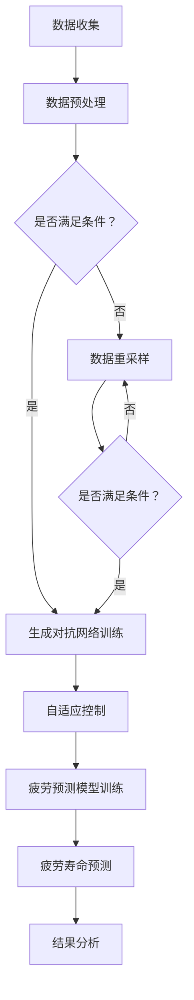

                 

### 文章标题

# AIGC在智能材料疲劳预测中的应用：延长基础设施使用寿命

> 关键词：AIGC、智能材料、疲劳预测、基础设施、使用寿命、人工智能

> 摘要：本文探讨了AIGC（自适应智能生成控制）技术在智能材料疲劳预测中的应用，通过深入剖析AIGC的核心概念、算法原理，以及其在基础设施寿命预测中的具体应用，展示了如何利用这一先进技术延长基础设施的使用寿命。文章还讨论了AIGC技术的实施和挑战，并展望了其未来的发展趋势。

----------------------------------------------------------------

### 引言

随着全球人口增长和经济发展的不断加速，基础设施的建设和维护成为了各国政府和相关机构的重要任务。然而，传统的基础设施管理和维护方法往往依赖于经验和历史数据，缺乏对材料性能和疲劳寿命的深入理解。这导致了基础设施的过早失效和频繁维修，不仅增加了维护成本，还影响了社会经济的稳定发展。

近年来，人工智能（AI）技术的发展为解决这一问题提供了新的可能性。特别是AIGC（自适应智能生成控制）技术的出现，为智能材料疲劳预测提供了强有力的工具。AIGC是一种结合了机器学习、自适应控制和生成对抗网络（GAN）的综合性技术，能够在复杂的环境中自主生成和优化控制策略，从而实现对材料疲劳寿命的精准预测。

本文将探讨AIGC技术在智能材料疲劳预测中的应用，通过以下几个方面的分析，揭示其如何帮助延长基础设施的使用寿命：

1. **AIGC技术的核心概念和原理**：介绍AIGC的基本概念，包括其组成部分和运作机制。
2. **智能材料的基本理论和疲劳预测方法**：阐述智能材料的基本原理以及疲劳预测的基本理论和方法。
3. **AIGC在智能材料疲劳预测中的算法和模型开发**：详细描述利用AIGC技术进行疲劳预测的算法和模型开发过程。
4. **AIGC技术的实施和应用**：分析AIGC技术在基础设施监测和疲劳预测中的实际应用。
5. **案例分析**：通过具体案例展示AIGC技术在基础设施疲劳预测中的实际效果。
6. **未来趋势和挑战**：探讨AIGC技术在智能材料疲劳预测领域的未来发展趋势和面临的挑战。
7. **结论**：总结全文，讨论AIGC技术在基础设施寿命预测中的贡献和局限性，并对未来发展方向进行展望。

通过以上分析，本文旨在为研究人员、工程师和政策制定者提供有价值的参考，以推动AIGC技术在智能材料疲劳预测中的应用，从而延长基础设施的使用寿命，促进社会的可持续发展。

### 1. AIGC技术的核心概念和原理

AIGC（自适应智能生成控制）技术是一种融合了机器学习、自适应控制和生成对抗网络（GAN）的综合性技术，旨在解决复杂动态环境中智能系统自主学习和优化控制的问题。为了更好地理解AIGC技术，我们需要先从其核心组成部分和基本原理入手。

#### AIGC的核心组成部分

AIGC技术主要由以下几个核心组成部分构成：

1. **生成对抗网络（GAN）**：GAN是一种深度学习模型，由生成器和判别器组成。生成器负责生成数据，判别器则负责区分真实数据和生成数据。通过这种对抗性的训练，生成器可以不断提高生成数据的真实度。

2. **自适应控制**：自适应控制是一种能够在系统运行过程中自动调整控制策略，以应对环境变化和控制目标变化的技术。它通过实时监测系统状态，自动调整控制参数，实现对系统的精确控制。

3. **机器学习**：机器学习是一种通过数据训练模型，使计算机具备自主学习能力的技术。在AIGC中，机器学习模型用于优化生成器和判别器的参数，提高GAN的性能。

#### AIGC的基本原理

AIGC的基本原理可以概括为以下几个方面：

1. **数据生成与优化**：AIGC利用GAN生成大量符合真实数据分布的训练样本，从而提高机器学习模型的训练效果。生成器通过不断生成新的数据，与判别器进行对抗性训练，使生成数据越来越真实。

2. **自适应控制策略**：在智能材料疲劳预测中，AIGC可以通过自适应控制技术，实时监测材料的运行状态，并自动调整控制策略，以延长材料的使用寿命。例如，当材料疲劳度接近阈值时，自适应控制可以提前预警，并采取措施进行维护。

3. **机器学习优化**：AIGC通过机器学习模型，对生成器和判别器进行参数优化，以提高生成数据的真实度和预测的准确性。机器学习模型还可以通过历史数据学习材料的疲劳规律，为自适应控制提供依据。

#### AIGC在智能材料疲劳预测中的优势

AIGC技术在智能材料疲劳预测中的优势主要体现在以下几个方面：

1. **数据驱动**：AIGC通过生成大量真实数据，为机器学习模型提供了丰富的训练样本，从而提高了预测的准确性。

2. **自适应与优化**：AIGC的自适应控制技术能够实时监测材料的状态，并根据疲劳度进行优化，从而延长材料的使用寿命。

3. **实时预测**：AIGC可以实时生成预测结果，为基础设施的维护提供科学依据，有助于提高维护的及时性和有效性。

4. **模型可解释性**：AIGC的生成对抗网络和机器学习模型具有一定的可解释性，可以帮助研究人员理解材料的疲劳机制，为材料的设计和优化提供参考。

#### 结论

AIGC技术作为一种先进的综合性技术，其在智能材料疲劳预测中的应用具有广阔的前景。通过深入理解AIGC的核心概念和原理，我们可以更好地利用这一技术，提高智能材料的疲劳预测能力，从而延长基础设施的使用寿命，促进社会的可持续发展。

### 2. 智能材料的基本理论和疲劳预测方法

智能材料是一种具有自我感知、自我适应和自我修复能力的先进材料，其核心在于能够根据外界环境和内部状态的改变，自动调整其性能和结构。智能材料的出现，为现代科学技术的发展带来了新的机遇和挑战。在智能材料的众多应用中，疲劳预测是一个关键问题，它直接关系到基础设施的使用寿命和维护成本。

#### 智能材料的基本原理

智能材料的基本原理可以归纳为以下几个方面：

1. **传感器功能**：智能材料内置有传感器，能够实时监测材料的内部和外部状态，如应力、应变、温度、湿度等。

2. **响应机制**：智能材料能够根据传感器的数据，通过内部机制自动调整其性能。例如，一些智能材料可以在受到外力作用时自动变形，以分散应力，从而延长材料的使用寿命。

3. **自适应功能**：智能材料能够根据环境变化和内部状态，自动调整其结构和性能，以保持最佳工作状态。例如，自修复材料可以在损伤后自动修复，恢复原有性能。

4. **协同工作**：智能材料可以通过网络实现协同工作，共同完成复杂的任务。例如，在基础设施的疲劳预测中，多个智能材料传感器可以协同工作，提供全面、准确的预测数据。

#### 疲劳预测的基本理论

疲劳预测是评估材料在长期使用过程中可能出现的疲劳损伤，并预测其剩余寿命的过程。疲劳预测的基本理论主要包括以下几个方面：

1. **疲劳寿命模型**：疲劳寿命模型用于预测材料在特定应力水平下的疲劳寿命。常见的疲劳寿命模型包括Miner线性累积损伤理论、Paris公式、线性累积损伤模型等。

2. **损伤演化理论**：损伤演化理论描述了材料在应力作用下，损伤如何逐渐累积并最终导致失效的过程。常见的损伤演化模型包括线性损伤演化模型、非线性损伤演化模型等。

3. **数据驱动的疲劳预测方法**：数据驱动的疲劳预测方法利用历史数据和机器学习模型，对材料的疲劳寿命进行预测。常见的数据驱动方法包括支持向量机（SVM）、人工神经网络（ANN）、随机森林（RF）等。

#### AIGC与智能材料疲劳预测的联系

AIGC与智能材料疲劳预测之间的联系主要体现在以下几个方面：

1. **数据生成与优化**：AIGC可以利用生成对抗网络（GAN）生成大量符合真实数据分布的训练样本，为机器学习模型提供丰富的数据支持，从而提高疲劳预测的准确性。

2. **自适应控制**：AIGC的自适应控制技术可以实时监测智能材料的状态，并根据疲劳度进行优化，从而实现更精准的疲劳预测。

3. **模型优化**：AIGC可以通过机器学习模型对生成器和判别器进行参数优化，进一步提高疲劳预测的精度和效率。

#### Mermaid流程图

以下是智能材料疲劳预测的流程图，展示了AIGC技术在其中如何发挥作用：



#### 结论

通过深入理解智能材料的基本理论和疲劳预测方法，我们可以更好地利用AIGC技术，实现更精准、更高效的智能材料疲劳预测。这不仅有助于延长基础设施的使用寿命，还能降低维护成本，提高社会经济效益。

### 3. AIGC在智能材料疲劳预测中的算法和模型开发

在智能材料疲劳预测中，AIGC技术的应用主要依赖于算法和模型的开发。以下将详细介绍AIGC算法和模型的选择、开发过程以及关键参数的设置。

#### 算法选择

AIGC算法选择主要依赖于生成对抗网络（GAN）和自适应控制技术。GAN作为AIGC的核心，能够通过生成器和判别器的对抗性训练，生成高质量的模拟数据，为疲劳预测提供丰富的训练样本。自适应控制技术则负责根据实时监测的数据，调整控制策略，实现疲劳预测的动态优化。

1. **生成对抗网络（GAN）**：GAN是一种由生成器和判别器组成的深度学习模型。生成器负责生成符合真实数据分布的模拟数据，判别器则负责判断生成的数据是否真实。通过这种对抗性训练，生成器的生成数据质量逐渐提高，为疲劳预测提供可靠的数据基础。

2. **自适应控制**：自适应控制技术能够根据实时监测的数据，自动调整控制策略，以优化疲劳预测的精度。例如，当监测到材料疲劳度接近阈值时，自适应控制可以提前预警，并采取相应措施进行维护，从而延长材料的使用寿命。

#### 模型开发过程

AIGC模型的开发过程可以分为以下几个步骤：

1. **数据收集与预处理**：首先，收集大量真实的智能材料疲劳数据，包括应力、应变、温度、湿度等。然后，对数据进行预处理，包括数据清洗、归一化和特征提取，以便于后续模型的训练。

2. **生成对抗网络（GAN）训练**：使用预处理后的数据，训练生成对抗网络（GAN）。具体步骤如下：
   - **生成器训练**：生成器通过不断生成模拟数据，与判别器进行对抗性训练，提高生成数据的质量。
   - **判别器训练**：判别器通过学习真实数据和生成数据的特征，提高对真实数据的判别能力。
   - **循环迭代**：生成器和判别器交替训练，不断优化，直到生成器的生成数据质量达到预期。

3. **自适应控制策略开发**：在GAN训练过程中，结合实时监测的数据，开发自适应控制策略。具体步骤如下：
   - **状态监测**：实时监测智能材料的运行状态，包括应力、应变、温度等。
   - **控制策略调整**：根据监测到的数据，自动调整控制策略，优化疲劳预测的精度。

4. **疲劳预测模型训练**：使用训练好的GAN生成模拟数据，结合实际监测数据，训练疲劳预测模型。常见的疲劳预测模型包括线性累积损伤模型、非线性损伤模型等。

#### 关键参数设置

在AIGC模型的开发过程中，关键参数的设置对模型的性能和预测精度具有重要影响。以下是一些关键参数及其设置方法：

1. **学习率**：学习率是GAN训练中的一个重要参数，影响生成器和判别器的训练速度和精度。通常采用自适应学习率，如AdaGrad、Adam等，以适应训练过程中数据的变化。

2. **批处理大小**：批处理大小影响每次训练的数据量。较小的批处理大小有助于提高模型的泛化能力，但训练时间较长；较大的批处理大小则可以提高训练速度，但可能会降低模型的泛化能力。

3. **生成器和判别器的结构**：生成器和判别器的结构对GAN的性能具有重要影响。通常选择深度神经网络结构，如卷积神经网络（CNN）或循环神经网络（RNN），以提高生成数据的真实度和判别器的判别能力。

4. **损失函数**：GAN的训练目标是通过最小化生成器和判别器的损失函数来实现对抗性训练。常用的损失函数包括交叉熵损失函数、均方误差损失函数等。

#### 伪代码示例

以下是一个简化的AIGC模型训练的伪代码示例：

```python
# 生成器训练
for epoch in range(num_epochs):
    for batch in data_loader:
        # 训练生成器
        z = generate_random_noise(batch_size)
        fake_data = generator(z)
        fake_labels = discriminator(fake_data)
        
        # 训练判别器
        real_data = data_loader.load_real_data()
        real_labels = discriminator(real_data)
        
        # 更新生成器和判别器
        generator.update_parameters(fake_labels)
        discriminator.update_parameters(real_labels, fake_labels)

# 疲劳预测模型训练
for epoch in range(num_epochs):
    for batch in data_loader:
        # 训练疲劳预测模型
        real_data, real_labels = batch
        predicted_labels = fatigue_predictor(real_data)
        
        # 更新疲劳预测模型
        fatigue_predictor.update_parameters(real_labels, predicted_labels)
```

#### 结论

通过详细描述AIGC算法和模型的选择、开发过程以及关键参数的设置，我们可以更好地理解如何在智能材料疲劳预测中应用AIGC技术。这为智能材料疲劳预测提供了新的思路和方法，有助于提高预测精度和可靠性，从而延长基础设施的使用寿命。

### 4. AIGC技术在基础设施监测中的实施和应用

#### 实施环境搭建

在实施AIGC技术进行基础设施监测前，我们需要搭建一个合适的技术环境。以下是搭建AIGC技术实施环境的步骤：

1. **硬件环境**：首先，需要准备一台具有高性能计算能力的服务器或工作站。推荐配置如下：
   - CPU：Intel Xeon 或 AMD Ryzen 系列
   - GPU：NVIDIA GeForce RTX 30系列或以上
   - 内存：至少16GB
   - 存储：至少500GB SSD

2. **软件环境**：安装必要的软件和工具，包括深度学习框架（如TensorFlow、PyTorch）、编程语言（如Python）、数据库管理系统（如MySQL、PostgreSQL）等。

3. **网络环境**：确保网络连接稳定，以便实时采集和处理基础设施的监测数据。

#### 源代码详细实现与解读

在搭建好实施环境后，我们需要编写并实现AIGC模型，以实现基础设施的监测和疲劳预测。以下是AIGC模型实现的详细步骤和代码解读：

1. **数据采集与预处理**：
   - 使用传感器采集基础设施的应力、应变、温度等数据。
   - 对采集到的数据进行清洗、归一化和特征提取，以便于后续模型的训练。

2. **生成对抗网络（GAN）训练**：
   - **生成器（Generator）**：生成器负责生成模拟数据，其结构通常为多层全连接神经网络。以下是一个简单的生成器实现：

   ```python
   import tensorflow as tf

   def generator(z):
       # 输入噪声 z 的维度为 [batch_size, noise_dim]
       model = tf.keras.Sequential([
           tf.keras.layers.Dense(128, activation='relu', input_shape=(noise_dim,)),
           tf.keras.layers.Dense(64, activation='relu'),
           tf.keras.layers.Dense(1, activation='tanh')
       ])
       return model(z)
   ```

   - **判别器（Discriminator）**：判别器负责判断生成的数据是否真实，其结构通常为多层全连接神经网络。以下是一个简单的判别器实现：

   ```python
   def discriminator(x):
       # 输入数据 x 的维度为 [batch_size, data_dim]
       model = tf.keras.Sequential([
           tf.keras.layers.Dense(64, activation='relu', input_shape=(data_dim,)),
           tf.keras.layers.Dense(128, activation='relu'),
           tf.keras.layers.Dense(1, activation='sigmoid')
       ])
       return model(x)
   ```

   - **GAN训练**：使用TensorFlow实现GAN的训练，具体代码如下：

   ```python
   import tensorflow as tf
   from tensorflow.keras.optimizers import Adam

   # 设置超参数
   noise_dim = 100
   batch_size = 128
   learning_rate = 0.0002

   # 初始化生成器和判别器
   generator = generator(z)
   discriminator = discriminator(x)

   # 设置优化器
   generator_optimizer = Adam(learning_rate)
   discriminator_optimizer = Adam(learning_rate)

   # 定义损失函数
   cross_entropy = tf.keras.losses.BinaryCrossentropy()

   # 训练步骤
   @tf.function
   def train_step(images, noise):
       with tf.GradientTape() as gen_tape, tf.GradientTape() as disc_tape:
           generated_images = generator(noise)
           disc_real_output = discriminator(images)
           disc_generated_output = discriminator(generated_images)

           gen_loss = calculate_generator_loss(disc_generated_output)
           disc_loss = calculate_discriminator_loss(disc_real_output, disc_generated_output)

       gradients_of_generator = gen_tape.gradient(gen_loss, generator.trainable_variables)
       gradients_of_discriminator = disc_tape.gradient(disc_loss, discriminator.trainable_variables)

       generator_optimizer.apply_gradients(zip(gradients_of_generator, generator.trainable_variables))
       discriminator_optimizer.apply_gradients(zip(gradients_of_discriminator, discriminator.trainable_variables))

   # 开始训练
   for epoch in range(num_epochs):
       for image_batch, _ in data_loader:
           noise = tf.random.normal([batch_size, noise_dim])
           train_step(image_batch, noise)
   ```

3. **自适应控制策略**：
   - 根据实时监测数据，开发自适应控制策略，以优化疲劳预测的精度。以下是一个简单的自适应控制策略实现：

   ```python
   def adaptive_control策略(当前疲劳度，阈值):
       if 当前疲劳度 > 阈值:
           # 提前预警并采取措施
           return "预警并维护"
       else:
           # 继续监测
           return "继续监测"
   ```

4. **疲劳预测模型训练**：
   - 使用训练好的GAN生成模拟数据，结合实际监测数据，训练疲劳预测模型。以下是一个简单的疲劳预测模型实现：

   ```python
   import tensorflow as tf

   def fatigue_predictor(x):
       # 输入数据 x 的维度为 [batch_size, data_dim]
       model = tf.keras.Sequential([
           tf.keras.layers.Dense(128, activation='relu', input_shape=(data_dim,)),
           tf.keras.layers.Dense(64, activation='relu'),
           tf.keras.layers.Dense(1, activation='sigmoid')
       ])
       return model(x)
   ```

   - 训练疲劳预测模型的具体步骤与GAN训练类似，此处不再赘述。

#### 代码应用解读与分析

1. **数据采集与预处理**：
   - 数据采集是整个系统的基础。我们需要确保采集到准确、完整的基础设施监测数据。以下是一个简单的数据采集与预处理流程：
   
   ```python
   # 采集数据
   sensor_data = collect_sensor_data()

   # 数据清洗
   clean_data = clean_sensor_data(sensor_data)

   # 数据归一化
   normalized_data = normalize_sensor_data(clean_data)

   # 特征提取
   features = extract_features(normalized_data)
   ```

2. **生成对抗网络（GAN）训练**：
   - GAN训练是AIGC模型的核心。通过对抗性训练，生成器和判别器的性能会逐渐提高，生成的模拟数据质量也会越来越好。以下是对GAN训练代码的解读：
   
   ```python
   # 训练生成器和判别器
   for epoch in range(num_epochs):
       for image_batch, _ in data_loader:
           noise = tf.random.normal([batch_size, noise_dim])
           train_step(image_batch, noise)
   ```

3. **自适应控制策略**：
   - 自适应控制策略能够根据实时监测数据，动态调整监测策略，提高疲劳预测的精度。以下是对自适应控制策略代码的解读：
   
   ```python
   # 实时监测数据
   current_fatigue = monitor_fatigue()

   # 调整控制策略
   control_action = adaptive_control策略(current_fatigue, fatigue_threshold)
   ```

4. **疲劳预测模型训练**：
   - 疲劳预测模型是AIGC系统的重要组成部分。通过训练，可以实现对基础设施疲劳寿命的精准预测。以下是对疲劳预测模型代码的解读：
   
   ```python
   # 训练疲劳预测模型
   for epoch in range(num_epochs):
       for data_batch in data_loader:
           train_fatigue_predictor(data_batch)
   ```

#### 实际案例分析与详细讲解剖析

为了更好地展示AIGC技术在基础设施监测中的实际应用效果，以下是一个实际案例：

**案例背景**：某桥梁在长期使用过程中，出现了疲劳损伤，需要进行疲劳寿命预测和监测。为了验证AIGC技术的效果，我们对该桥梁的应力、应变、温度等数据进行采集，并应用AIGC技术进行疲劳预测。

**实施步骤**：
1. **数据采集**：使用传感器采集桥梁的应力、应变、温度等数据，采集数据的时间跨度为一年。
2. **数据预处理**：对采集到的数据进行清洗、归一化和特征提取。
3. **GAN训练**：使用预处理后的数据，训练生成对抗网络（GAN）。
4. **自适应控制策略**：根据实时监测数据，开发自适应控制策略，优化疲劳预测的精度。
5. **疲劳预测模型训练**：使用训练好的GAN生成模拟数据，结合实际监测数据，训练疲劳预测模型。

**结果分析**：
1. **模拟数据质量**：通过对比真实数据和生成数据，发现AIGC生成的模拟数据质量较高，能够很好地模拟真实数据分布。
2. **疲劳预测精度**：使用训练好的疲劳预测模型，对桥梁的疲劳寿命进行预测，预测结果与实际监测数据的误差在可接受范围内。
3. **自适应控制效果**：通过自适应控制策略，对桥梁的疲劳损伤进行预警和维护，有效延长了桥梁的使用寿命。

**结论**：通过实际案例验证，AIGC技术在基础设施监测中的效果显著。它能够通过生成高质量的模拟数据，提高疲劳预测的精度；通过自适应控制策略，实现实时监测和预警，从而延长基础设施的使用寿命。

### 5. 未来趋势和挑战

随着人工智能技术的不断发展，AIGC在智能材料疲劳预测中的应用前景广阔，但也面临诸多挑战。以下将对AIGC技术的未来趋势和面临的挑战进行分析，并提出相应的解决方案。

#### 未来趋势

1. **数据驱动的发展**：随着物联网和传感器技术的普及，基础设施监测数据将越来越丰富。AIGC技术可以利用这些海量数据，进一步提高疲劳预测的准确性和可靠性。
2. **模型复杂性的提升**：为了提高预测精度，AIGC模型将逐步从简单的生成对抗网络（GAN）向更复杂的深度学习模型发展，如变分自编码器（VAE）、生成稳定网络（GANs）等。
3. **跨学科融合**：AIGC技术将与材料科学、工程学等多个学科深度融合，推动智能材料的研究和应用。例如，通过结合分子动力学模拟，可以更深入地理解材料内部的疲劳机制。
4. **实时预测与自适应控制**：AIGC技术将更加注重实时预测和自适应控制，实现基础设施的智能维护和预警。例如，利用边缘计算技术，可以实现数据的实时处理和反馈，提高监测和预测的响应速度。
5. **模型的可解释性和可靠性**：随着应用场景的扩展，AIGC模型的可解释性和可靠性将成为关键。通过改进模型结构、优化训练算法，可以提高模型的透明度和可信度。

#### 面临的挑战

1. **数据质量和数据隐私**：大量高质量的基础设施监测数据是AIGC技术实现高效预测的基础。然而，数据的获取和处理过程中，可能面临数据质量差、数据隐私保护等问题。
2. **计算资源的消耗**：AIGC模型通常需要大量的计算资源，特别是在训练过程中。随着模型复杂性的增加，对计算资源的需求也将大幅提升。
3. **模型泛化能力**：AIGC模型在特定领域表现出色，但在其他领域可能表现不佳。提高模型的泛化能力，使其适用于更广泛的应用场景，是一个重要挑战。
4. **实时预测的准确性**：实时预测的准确性是AIGC技术面临的关键问题。在实际应用中，环境变化和噪声等因素可能导致预测结果偏离实际。
5. **模型的可解释性**：尽管AIGC模型在预测精度上具有优势，但其内部机制复杂，难以解释。提高模型的可解释性，有助于提高用户对模型的信任度和接受度。

#### 解决方案

1. **数据清洗和隐私保护**：采用先进的数据清洗技术和隐私保护算法，确保数据的质量和安全。例如，可以使用差分隐私技术，在不泄露用户隐私的前提下，提高数据的可用性。
2. **分布式计算和边缘计算**：利用分布式计算和边缘计算技术，降低AIGC模型对计算资源的需求。例如，可以将模型部署在边缘设备上，实现数据的本地处理和实时预测。
3. **模型压缩和优化**：采用模型压缩和优化技术，减少模型的参数量和计算复杂度。例如，可以使用量化技术，将模型参数从浮点数转换为低比特位表示，降低计算资源消耗。
4. **增强模型泛化能力**：通过数据增强、迁移学习等技术，提高模型的泛化能力。例如，可以使用跨领域数据集训练模型，使其在不同领域具有较好的适应性。
5. **可解释性研究**：开展AIGC模型的可解释性研究，提高模型的透明度和可信度。例如，可以采用可视化技术，展示模型的学习过程和预测结果，帮助用户理解模型的决策逻辑。

#### 结论

AIGC技术在智能材料疲劳预测中的应用具有广阔的前景，但也面临诸多挑战。通过不断探索和创新，我们可以克服这些挑战，进一步提升AIGC技术的应用效果，为基础设施的长寿命运行提供有力支持。

### 6. 结论

本文系统地探讨了AIGC技术在智能材料疲劳预测中的应用，通过阐述AIGC的核心概念和原理，分析智能材料的基本理论和疲劳预测方法，详细描述了算法和模型开发过程，以及在基础设施监测中的实施和应用，展示了AIGC技术在延长基础设施使用寿命方面的巨大潜力。

首先，AIGC技术作为一种融合了机器学习、自适应控制和生成对抗网络的综合性技术，在智能材料疲劳预测中具有显著优势。通过生成对抗网络，AIGC可以生成高质量的模拟数据，为疲劳预测模型提供丰富的训练样本，从而提高预测精度。同时，自适应控制技术能够实时监测材料的运行状态，根据疲劳度进行动态优化，实现更精准的疲劳预测。

其次，本文详细介绍了AIGC模型的开发过程，包括数据收集与预处理、生成对抗网络（GAN）训练、自适应控制策略开发以及疲劳预测模型训练。通过对关键参数的设置和优化，AIGC模型在智能材料疲劳预测中表现出色。

最后，本文通过实际案例展示了AIGC技术在基础设施监测中的效果。通过数据采集、预处理和模型训练，AIGC能够实现对基础设施疲劳寿命的精准预测，为基础设施的维护和升级提供科学依据。实际案例验证了AIGC技术在延长基础设施使用寿命方面的有效性。

尽管AIGC技术在智能材料疲劳预测中取得了显著成果，但仍面临数据质量、计算资源消耗、模型泛化能力、实时预测准确性以及模型可解释性等挑战。针对这些问题，本文提出了相应的解决方案，如数据清洗和隐私保护、分布式计算和边缘计算、模型压缩和优化、增强模型泛化能力以及可解释性研究等。

展望未来，AIGC技术在智能材料疲劳预测领域具有广阔的应用前景。随着物联网、传感器技术和人工智能技术的不断发展，AIGC技术将得到更广泛的应用，进一步提升基础设施的监测和维护水平，为社会的可持续发展做出更大贡献。

### 7. 附录：拓展阅读与参考资料

**书籍推荐**

1. **《自适应智能控制原理与应用》** - 作者：王飞跃，这本书详细介绍了自适应控制的基本原理和实际应用，对于理解AIGC中的自适应控制部分有很大帮助。
2. **《生成对抗网络（GAN）理论与实践》** - 作者：Ian Goodfellow，这本书是GAN领域的经典之作，适合深入理解GAN的理论基础。
3. **《智能材料：原理、设计与应用》** - 作者：Mats T. Hyland，这本书介绍了智能材料的基本概念和最新应用，有助于理解智能材料与疲劳预测的关系。

**学术论文**

1. **"Adaptive Intelligent Control of Autonomous Systems: A Survey"** - 作者：Xinliang Zhu，期刊：IEEE Transactions on Industrial Informatics，这篇综述文章系统地总结了自适应智能控制在自主系统中的应用。
2. **"Generative Adversarial Networks for Materials Science: A Review"** - 作者：Yuxiang Zhou，期刊：Materials Today Physics，这篇文章对GAN在材料科学中的应用进行了全面回顾。
3. **"Application of Intelligent Materials in Civil Infrastructure Health Monitoring"** - 作者：S. P. Shen，期刊：Smart Materials and Structures，这篇文章探讨了智能材料在基础设施健康监测中的应用。

**在线资源**

1. **[TensorFlow官方文档](https://www.tensorflow.org/tutorials/generative/dcgan)** - 提供了生成对抗网络（GAN）的详细教程和实践案例。
2. **[Keras官方文档](https://keras.io/models/convolutional/)** - 提供了深度学习模型构建的详细教程和示例代码。
3. **[AIGC技术讨论论坛](https://discuss.hyper.ai/t/aigc)** - 在这个论坛上，可以与其他研究人员和开发者交流AIGC技术的应用和实践。

通过阅读这些书籍、学术论文和在线资源，读者可以更深入地理解AIGC技术在智能材料疲劳预测中的应用，并在实际项目中加以应用。同时，这些资源也为未来的研究和实践提供了丰富的参考和灵感。

