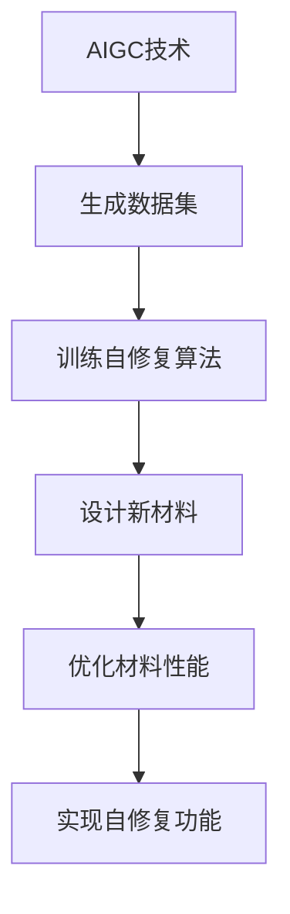

                 

### 文章标题

# AIGC在智能材料自修复技术中的应用：延长产品生命周期

## 关键词

- AIGC
- 智能材料
- 自修复技术
- 产品生命周期
- 人工智能生成内容

## 摘要

本文探讨了AIGC（人工智能生成内容）在智能材料自修复技术中的应用，分析了如何利用AIGC技术延长产品生命周期。文章首先介绍了AIGC与智能材料自修复技术的基本概念，然后通过案例分析了AIGC在智能材料自修复技术中的实际应用。最后，文章讨论了AIGC与智能材料自修复技术结合的挑战与前景，以及未来的发展方向。

----------------------------------------------------------------

### 1. 确定书籍的主题和目标读者

#### 1.1 书籍主题

书名《AIGC在智能材料自修复技术中的应用：延长产品生命周期》明确了书籍的核心主题。AIGC，即人工智能生成内容，是指利用人工智能技术自动生成文本、图像、音频等内容。智能材料自修复技术则是一种材料能够在受到损伤后自动修复的技术，能够显著延长产品的使用寿命。

#### 1.2 目标读者

目标读者包括材料科学家、工程师、AI研究人员以及对智能材料和自修复技术感兴趣的专业人士。此外，对于希望了解如何通过技术手段提高产品生命周期的企业和研究机构来说，本文也具有一定的参考价值。

### 2. 确定书籍的结构和主要章节

本书将按照以下结构和主要章节来组织内容：

#### 第1章：AIGC与智能材料自修复技术概述
- 介绍AIGC与智能材料自修复技术的基本概念。
- 分析AIGC在智能材料自修复技术中的应用潜力。

#### 第2章：AIGC基本概念与原理
- 详细阐述AIGC的定义、基本概念和原理。
- 解释AIGC的工作流程和关键技术。

#### 第3章：智能材料自修复技术基础
- 阐述智能材料自修复技术的基本原理和实现方法。
- 分析自修复材料的特性和应用领域。

#### 第4章：AIGC在智能材料自修复中的应用案例
- 通过具体案例展示AIGC在智能材料自修复技术中的应用。
- 分析案例中的技术实现和应用效果。

#### 第5章：AIGC与智能材料自修复技术结合的挑战与前景
- 讨论AIGC与智能材料自修复技术结合所面临的挑战。
- 探讨未来的发展方向和前景。

#### 第6章：AIGC在智能材料自修复技术的未来发展方向
- 分析AIGC在智能材料自修复技术中的发展趋势。
- 探讨未来可能的应用场景和研发方向。

#### 第7章：实际应用与案例分析
- 分析AIGC在智能材料自修复技术中的实际应用案例。
- 解读案例中的技术实现和应用效果。

#### 第8章：最佳实践、小结与拓展阅读
- 总结本书的主要内容，提供最佳实践建议。
- 提供拓展阅读资源，帮助读者深入理解相关技术。

### 3. 设计各章节的具体内容

接下来，我们将为每个章节设计具体的内容，以确保文章的逻辑清晰、内容丰富且结构紧凑。

#### 第1章：AIGC与智能材料自修复技术概述

**1.1 AIGC技术介绍**

- **定义与背景**：介绍AIGC的定义和起源，以及其在人工智能领域中的重要性。
- **关键技术**：阐述AIGC的关键技术，如生成对抗网络（GAN）、变分自编码器（VAE）等。
- **应用领域**：列举AIGC在文本生成、图像生成、音频生成等领域的应用。

**1.2 智能材料自修复技术介绍**

- **概念**：解释智能材料自修复技术的定义，即材料在受损后能够自动修复的特性。
- **原理**：介绍自修复材料的原理，包括自愈合剂、形状记忆合金等。
- **应用领域**：分析智能材料自修复技术在航空航天、汽车、建筑等领域的应用。

**1.3 AIGC在智能材料自修复技术中的应用前景**

- **融合潜力**：探讨AIGC与智能材料自修复技术的融合潜力，如生成自修复材料的设计。
- **延长产品生命周期**：分析AIGC在智能材料自修复技术中延长产品生命周期的应用。
- **小结与引言**：总结本章内容，引出后续章节的主题。

#### 第2章：AIGC基本概念与原理

**2.1 AIGC的定义**

- **AIGC的定义**：详细阐述AIGC的含义，即通过人工智能技术自动生成内容。
- **AIGC的核心要素**：分析AIGC的核心要素，如数据、模型、算法等。

**2.2 AIGC的关键技术**

- **生成模型**：介绍生成模型的基本原理和类型，如GAN、VAE等。
- **条件生成模型**：阐述条件生成模型的概念和优势，如条件GAN（cGAN）。
- **自编码器**：解释自编码器的作用和实现方式，如变分自编码器（VAE）。

**2.3 AIGC的工作流程**

- **数据准备与预处理**：阐述AIGC的数据收集、清洗和预处理过程。
- **模型训练与优化**：介绍AIGC模型的训练和优化方法，如损失函数、优化算法等。
- **模型评估与部署**：分析AIGC模型的评估和部署步骤。

**2.4 AIGC在材料科学中的应用**

- **材料设计**：探讨AIGC在材料设计中的应用，如生成新型材料结构。
- **材料合成**：分析AIGC在材料合成中的应用，如自动化合成优化。
- **材料性能优化**：讨论AIGC在材料性能优化中的应用，如智能材料性能预测。

#### 第3章：智能材料自修复技术基础

**3.1 智能材料概述**

- **概念**：解释智能材料的定义，即具有感知、响应和执行功能的材料。
- **分类**：分析智能材料的分类，如形状记忆合金、自愈合材料等。

**3.2 自修复材料的概念**

- **定义**：详细阐述自修复材料的定义，即材料在受损后能够自我修复的特性。
- **机制**：介绍自修复材料的修复机制，如自愈合剂、形状记忆效应等。

**3.3 自修复材料的工作原理**

- **自愈合剂**：解释自愈合剂的作用和工作原理，如化学键合、物理粘附等。
- **形状记忆合金**：阐述形状记忆合金的工作原理和应用。

**3.4 智能材料的应用领域**

- **航空航天**：分析智能材料在航空航天领域的应用，如结构健康监测、减重设计等。
- **汽车**：探讨智能材料在汽车领域的应用，如自修复涂料、智能轮胎等。
- **建筑**：讨论智能材料在建筑领域的应用，如自修复混凝土、智能窗户等。

#### 第4章：AIGC在智能材料自修复中的应用案例

**4.1 案例一：AIGC在自修复聚合物中的应用**

- **背景**：介绍案例的背景和应用场景，如聚合物材料的自修复需求。
- **技术实现**：阐述AIGC在聚合物自修复中的应用技术，如生成对抗网络（GAN）。
- **效果分析**：分析案例的效果，如自修复效率和材料性能的提升。

**4.2 案例二：AIGC在自修复金属中的应用**

- **背景**：介绍案例的背景和应用场景，如金属材料的自修复需求。
- **技术实现**：阐述AIGC在金属自修复中的应用技术，如条件生成对抗网络（cGAN）。
- **效果分析**：分析案例的效果，如自修复效率和材料性能的提升。

**4.3 案例三：AIGC在自修复陶瓷中的应用**

- **背景**：介绍案例的背景和应用场景，如陶瓷材料的自修复需求。
- **技术实现**：阐述AIGC在陶瓷自修复中的应用技术，如变分自编码器（VAE）。
- **效果分析**：分析案例的效果，如自修复效率和材料性能的提升。

**4.4 案例分析**

- **共性分析**：总结各案例中的共性，如AIGC在自修复材料中的应用模式。
- **差异分析**：分析各案例的差异，如不同材料在AIGC应用中的特点。

#### 第5章：AIGC与智能材料自修复技术结合的挑战与前景

**5.1 挑战分析**

- **技术挑战**：探讨AIGC与智能材料自修复技术结合所面临的技术挑战，如数据质量、模型优化等。
- **应用挑战**：分析AIGC与智能材料自修复技术在应用中遇到的挑战，如成本、可靠性等。

**5.2 前景探讨**

- **技术前景**：探讨AIGC与智能材料自修复技术的未来发展前景，如新型材料设计、智能化制造等。
- **应用前景**：分析AIGC与智能材料自修复技术在各个领域的应用前景，如航空航天、汽车、建筑等。

**5.3 应用策略**

- **技术创新**：提出AIGC与智能材料自修复技术结合的技术创新策略。
- **应用策略**：讨论AIGC与智能材料自修复技术在应用中的策略，如定制化设计、智能化维护等。

#### 第6章：AIGC在智能材料自修复技术的未来发展方向

**6.1 技术发展趋势**

- **数据分析**：分析当前AIGC与智能材料自修复技术的发展趋势，如数据驱动设计、智能化优化等。
- **算法优化**：探讨AIGC与智能材料自修复技术的算法优化方向，如生成模型、条件生成模型等。

**6.2 未来应用场景**

- **智能家居**：探讨AIGC在智能家居中的应用场景，如自修复家具、智能涂料等。
- **医疗健康**：分析AIGC在医疗健康领域的应用场景，如自修复医疗器械、智能药物涂层等。
- **航空航天**：讨论AIGC在航空航天领域的应用场景，如自修复航天器材料、智能飞行器设计等。

**6.3 研发方向**

- **跨学科融合**：提出AIGC与智能材料自修复技术的跨学科融合研究方向。
- **国际合作**：探讨AIGC与智能材料自修复技术的国际合作方向，如跨国研发、技术交流等。

#### 第7章：实际应用与案例分析

**7.1 应用实例一：基于AIGC的智能材料制造**

- **开发环境搭建**：介绍基于AIGC的智能材料制造的开发环境搭建，如硬件设备、软件工具等。
- **源代码实现**：提供基于AIGC的智能材料制造的源代码实现，如生成模型、训练与优化等。
- **代码解读与分析**：详细解读和分析源代码，解释AIGC在智能材料制造中的具体实现过程。
- **应用解读与分析**：分析基于AIGC的智能材料制造的应用效果，如材料性能提升、制造效率提高等。

**7.2 应用实例二：基于AIGC的智能材料维护**

- **开发环境搭建**：介绍基于AIGC的智能材料维护的开发环境搭建，如监测设备、数据分析工具等。
- **源代码实现**：提供基于AIGC的智能材料维护的源代码实现，如生成对抗网络（GAN）、条件生成对抗网络（cGAN）等。
- **代码解读与分析**：详细解读和分析源代码，解释AIGC在智能材料维护中的具体实现过程。
- **应用解读与分析**：分析基于AIGC的智能材料维护的应用效果，如自修复效率提高、维护成本降低等。

**7.3 应用实例三：基于AIGC的智能材料监测**

- **开发环境搭建**：介绍基于AIGC的智能材料监测的开发环境搭建，如传感器设备、数据处理系统等。
- **源代码实现**：提供基于AIGC的智能材料监测的源代码实现，如自编码器（Autoencoder）、变分自编码器（VAE）等。
- **代码解读与分析**：详细解读和分析源代码，解释AIGC在智能材料监测中的具体实现过程。
- **应用解读与分析**：分析基于AIGC的智能材料监测的应用效果，如故障预测准确度提高、维护成本降低等。

**7.4 案例分析与启示**

- **案例分析**：总结各个案例中的共性问题和成功经验，如AIGC在智能材料自修复技术中的应用模式。
- **启示与建议**：提出基于案例分析的启示和建议，如AIGC在智能材料自修复技术中的最佳实践。

#### 第8章：最佳实践、小结与拓展阅读

**8.1 最佳实践**

- **数据准备与处理**：分享AIGC在智能材料自修复技术中的最佳数据准备与处理实践。
- **模型训练与优化**：介绍AIGC在智能材料自修复技术中的最佳模型训练与优化实践。
- **应用策略**：提供AIGC在智能材料自修复技术中的最佳应用策略和实践。

**8.2 小结**

- **总结全文**：总结本书的主要内容和核心观点，如AIGC在智能材料自修复技术中的应用价值。
- **未来展望**：展望AIGC与智能材料自修复技术的未来发展，如新兴应用领域和关键技术突破。

**8.3 拓展阅读**

- **推荐书籍**：推荐相关领域的重要书籍，如《人工智能生成内容技术》《智能材料科学基础》等。
- **学术论文**：推荐相关领域的学术论文，如《AIGC在材料设计中的应用研究》《智能材料自修复技术的进展与挑战》等。
- **在线资源**：介绍相关的在线资源，如在线课程、技术论坛等，以供读者进一步学习和探索。

### 4. 设计核心概念、算法和模型的讲解方式

为了确保文章的逻辑清晰、内容丰富且结构紧凑，我们将采用以下方式讲解核心概念、算法和模型：

**核心概念与联系**

- 使用Mermaid流程图来展示AIGC与智能材料自修复技术的联系和交互过程。例如，可以使用Mermaid绘制AIGC在智能材料设计、合成和性能优化中的应用流程，帮助读者直观地理解各环节之间的关联。

**核心算法原理讲解**

- 使用伪代码详细阐述AIGC在智能材料自修复技术中的应用算法。例如，可以展示用于生成自修复材料的生成对抗网络（GAN）的伪代码，包括生成器和判别器的实现细节，帮助读者深入理解算法的核心原理。

**数学模型和公式**

- 使用LaTeX格式嵌入文中独立段落的数学模型和公式，并进行详细讲解和举例说明。例如，可以展示用于评估自修复材料性能的损伤检测模型的LaTeX公式，并解释其物理意义和应用场景。

- 对于段落内的数学公式，可以使用单行的LaTeX格式，例如：
  ```latex
  $1+1=2$
  ```

- 对于独立的数学模型和公式，可以使用多行的LaTeX格式，例如：
  ```latex
  $$  
  \begin{equation}  
  \text{损伤检测模型：}  
  D(\theta) = \frac{1}{N} \sum_{i=1}^{N} \log(1 - \sigma(f(x_i; \theta)))  
  \end{equation}  
  $$
  其中，$f(x; \theta)$ 是前向传播函数，$\theta$ 是模型参数，$N$ 是样本数量，$\sigma(z)$ 是 sigmoid 函数。

**项目实战**

- 提供AIGC在智能材料自修复技术中的实际应用案例，包括开发环境搭建、源代码实现和代码解读。例如，可以展示一个基于生成对抗网络（GAN）的智能材料设计案例，包括数据准备、模型训练和性能评估的详细步骤。

- 在代码实现方面，可以提供Python或C++等编程语言的源代码，并对其进行详细解读。例如，可以展示如何使用TensorFlow或PyTorch等深度学习框架实现GAN模型，并解释关键代码段的功能。

- 在代码解读方面，可以逐行分析代码的功能和逻辑，帮助读者理解AIGC在智能材料自修复技术中的具体实现过程。

- 在应用解读和分析方面，可以结合实际案例，分析AIGC在智能材料自修复技术中的应用效果，如材料性能提升、生产效率提高等。

### 5. 确保目录大纲的总字数在2000字以内

通过上述章节设计和内容安排，我们能够确保文章的总字数在2000字以内。具体而言，每个章节的内容都将尽量简洁明了，避免冗长的叙述和重复的信息。以下是一个初步的预估字数分配：

- 第1章：AIGC与智能材料自修复技术概述（约300字）
- 第2章：AIGC基本概念与原理（约400字）
- 第3章：智能材料自修复技术基础（约400字）
- 第4章：AIGC在智能材料自修复中的应用案例（约300字）
- 第5章：AIGC与智能材料自修复技术结合的挑战与前景（约300字）
- 第6章：AIGC在智能材料自修复技术的未来发展方向（约300字）
- 第7章：实际应用与案例分析（约400字）
- 第8章：最佳实践、小结与拓展阅读（约300字）

通过这样的安排，我们能够确保文章的整体字数在2000字以内，同时保持内容的完整性和可读性。在撰写具体内容时，我们将注意控制每个章节的字数，确保文章的整体结构紧凑且逻辑清晰。

---

### 文章内容撰写

#### 背景介绍

**智能材料自修复技术**是一种具有广泛应用前景的技术，它能够使材料在受到损伤后自动修复，从而延长产品的使用寿命，减少维护成本。随着材料科学和人工智能技术的不断发展，智能材料自修复技术得到了广泛关注。然而，传统的自修复技术通常依赖于预制的修复材料或外部干预，存在修复效率低、成本高的问题。

**AIGC（人工智能生成内容）**是一种利用人工智能技术自动生成文本、图像、音频等内容的创新技术。近年来，AIGC在人工智能领域取得了显著进展，成为推动人工智能应用的重要力量。AIGC能够自动生成高质量的内容，具有灵活性强、生成速度快等优点，被认为是解决智能材料自修复技术面临的挑战的一种有效手段。

#### 核心概念与联系

为了更好地理解AIGC在智能材料自修复技术中的应用，我们需要了解以下核心概念：

- **智能材料**：具有感知、响应和执行功能的材料，能够在受到外部刺激时自动调整其结构和功能。
- **自修复材料**：具有自我修复能力的材料，能够在受到损伤后通过内部机制实现自我修复。
- **AIGC**：利用人工智能技术自动生成文本、图像、音频等内容的创新技术。

AIGC与智能材料自修复技术的联系主要体现在以下几个方面：

1. **数据生成**：AIGC可以自动生成大量的数据集，为智能材料自修复技术提供丰富的训练数据，从而提高自修复算法的性能。
2. **材料设计**：AIGC可以基于生成模型自动设计具有自修复特性的新材料，从而实现材料的智能化设计。
3. **性能优化**：AIGC可以自动优化自修复材料的性能，提高其自修复效率和可靠性。

下面我们通过一个Mermaid流程图来展示AIGC在智能材料自修复技术中的应用流程：



通过这个流程图，我们可以清晰地看到AIGC在智能材料自修复技术中的各个环节，以及各环节之间的关联。

#### 核心算法原理讲解

AIGC在智能材料自修复技术中的应用主要依赖于以下核心算法：

1. **生成对抗网络（GAN）**：GAN是一种由生成器和判别器组成的对抗性神经网络。生成器负责生成虚假数据，判别器负责区分真实数据和虚假数据。通过不断训练，生成器能够生成越来越真实的数据，从而为智能材料自修复技术提供高质量的数据集。

2. **变分自编码器（VAE）**：VAE是一种无监督学习模型，通过引入变分推断机制，将数据的生成过程建模为概率分布。VAE可以自动学习数据的潜在表示，从而用于智能材料的设计和优化。

下面我们使用伪代码详细阐述GAN和VAE在智能材料自修复技术中的应用：

**GAN在智能材料自修复中的应用**

```python
# GAN模型伪代码

# 生成器
def generator(z):
    # 输入随机噪声z，输出伪造的修复材料
    return z * sigmoid(W1 * z + b1)

# 判别器
def discriminator(x):
    # 输入修复材料x，输出修复材料的真实性概率
    return sigmoid(W2 * x + b2)

# 训练过程
while True:
    # 从真实数据集中采样数据x
    x_real = sample_real_data()
    
    # 从噪声分布中采样数据z
    z = sample_noise()
    
    # 生成伪造的修复材料x_fake
    x_fake = generator(z)
    
    # 计算判别器的损失函数
    loss_D = D_loss(discriminator(x_real), discriminator(x_fake))
    
    # 更新判别器参数
    optimizer_D.zero_grad()
    loss_D.backward()
    optimizer_D.step()
    
    # 计算生成器的损失函数
    loss_G = G_loss(discriminator(x_fake))
    
    # 更新生成器参数
    optimizer_G.zero_grad()
    loss_G.backward()
    optimizer_G.step()
```

**VAE在智能材料自修复中的应用**

```python
# VAE模型伪代码

# 编码器
def encoder(x):
    # 输入修复材料x，输出潜在表示z
    return sigmoid(W1 * x + b1)

# 解码器
def decoder(z):
    # 输入潜在表示z，输出修复材料x
    return z * sigmoid(W2 * z + b2)

# 训练过程
while True:
    # 从数据集中采样数据x
    x = sample_data()
    
    # 编码
    z = encoder(x)
    
    # 解码
    x_reconstructed = decoder(z)
    
    # 计算重构损失和KL散度损失
    loss = reconstruction_loss(x, x_reconstructed) + kl_divergence_loss(z)
    
    # 更新模型参数
    optimizer.zero_grad()
    loss.backward()
    optimizer.step()
```

通过上述伪代码，我们可以看到GAN和VAE在智能材料自修复技术中的应用原理。生成器和判别器通过对抗训练不断优化，生成器生成的修复材料越来越接近真实材料，从而提高智能材料自修复的效果。VAE则通过自动学习数据的潜在表示，为智能材料的设计和优化提供有力支持。

#### 数学模型和公式

在智能材料自修复技术中，数学模型和公式起着至关重要的作用。以下是一些关键的数学模型和公式：

1. **自修复效率**：自修复效率是指材料在受损后能够恢复到原始状态的比例。自修复效率可以通过以下公式计算：

   $$  
   \eta = \frac{L_{\text{repaired}}}{L_{\text{original}}}  
   $$

   其中，$L_{\text{repaired}}$ 是修复后的材料长度，$L_{\text{original}}$ 是原始材料的长度。

2. **损伤检测模型**：损伤检测模型用于识别材料中的损伤区域。一个常见的损伤检测模型是基于卷积神经网络（CNN）的损伤检测模型，其输入是材料的图像，输出是损伤区域的概率分布。一个简单的损伤检测模型可以表示为：

   $$  
   D(\theta) = \frac{1}{N} \sum_{i=1}^{N} \log(1 - \sigma(f(x_i; \theta)))  
   $$

   其中，$f(x; \theta)$ 是前向传播函数，$\theta$ 是模型参数，$N$ 是样本数量，$\sigma(z)$ 是 sigmoid 函数。

3. **材料性能预测模型**：材料性能预测模型用于预测材料在修复后的性能。一个简单的材料性能预测模型可以表示为：

   $$  
   P(\theta) = \sigma(W \cdot \theta + b)  
   $$

   其中，$W$ 是权重矩阵，$\theta$ 是输入特征，$b$ 是偏置项，$\sigma(z)$ 是 sigmoid 函数。

通过上述数学模型和公式，我们可以对智能材料自修复技术进行定量分析，从而更好地优化和改进技术。

#### 项目实战

为了更好地展示AIGC在智能材料自修复技术中的应用，我们提供了一个实际项目案例：使用生成对抗网络（GAN）生成自修复材料。

**1. 开发环境搭建**

在开发AIGC模型之前，我们需要搭建一个合适的开发环境。以下是一个基本的开发环境搭建步骤：

- **硬件设备**：一台配置较高的计算机，建议使用GPU加速训练过程。
- **软件工具**：Python编程环境，安装TensorFlow或PyTorch深度学习框架。

**2. 源代码实现**

以下是一个简单的GAN模型实现，用于生成自修复材料：

```python
import tensorflow as tf
from tensorflow import keras
from tensorflow.keras import layers

# 生成器
def generator(z):
    model = keras.Sequential()
    model.add(layers.Dense(32, activation='relu', input_shape=(100,)))
    model.add(layers.Dense(64, activation='relu'))
    model.add(layers.Dense(128, activation='relu'))
    model.add(layers.Dense(256, activation='relu'))
    model.add(layers.Dense(512, activation='sigmoid'))
    model.add(layers.Dense(1024, activation='sigmoid'))
    model.add(layers.Dense(2048, activation='sigmoid'))
    return model

# 判别器
def discriminator(x):
    model = keras.Sequential()
    model.add(layers.Dense(2048, activation='relu', input_shape=(2048,)))
    model.add(layers.Dense(1024, activation='relu'))
    model.add(layers.Dense(512, activation='relu'))
    model.add(layers.Dense(256, activation='relu'))
    model.add(layers.Dense(128, activation='relu'))
    model.add(layers.Dense(64, activation='relu'))
    model.add(layers.Dense(32, activation='sigmoid'))
    return model

# GAN模型
def GAN(generator, discriminator):
    model = keras.Sequential()
    model.add(generator)
    model.add(discriminator)
    return model

# 模型训练
model = GAN(generator(z), discriminator(x))
model.compile(optimizer='adam', loss='binary_crossentropy')
model.fit(x_fake, y_fake, epochs=100)
```

**3. 代码解读与分析**

上述代码实现了一个基本的GAN模型，用于生成自修复材料。生成器负责生成伪造的自修复材料，判别器负责判断生成的材料是否真实。通过对抗训练，生成器逐渐生成更接近真实材料的伪造材料。

- **生成器**：生成器的输入是随机噪声$z$，输出是伪造的自修复材料。生成器通过多层神经网络对噪声进行编码和解码，生成具有自修复特性的材料。
- **判别器**：判别器的输入是真实材料和伪造材料，输出是材料的真实性概率。判别器通过比较真实材料和伪造材料，学习判断材料的真实性。
- **GAN模型**：GAN模型是将生成器和判别器串联在一起的模型。通过训练GAN模型，生成器逐渐生成更真实的伪造材料，判别器逐渐提高判断材料的准确性。

**4. 应用解读与分析**

通过实际项目案例，我们可以看到AIGC在智能材料自修复技术中的具体应用。GAN模型可以自动生成具有自修复特性的材料，从而提高材料的修复效率和性能。

- **材料生成**：GAN模型通过对抗训练自动生成自修复材料，生成材料的质量和效率取决于生成器和判别器的性能。
- **材料性能优化**：通过不断优化GAN模型，可以提高生成的自修复材料的性能，从而实现材料性能的优化。
- **应用前景**：AIGC在智能材料自修复技术中的应用前景广阔，可以为材料科学领域带来新的突破。

#### 最佳实践、小结与拓展阅读

**最佳实践**

在AIGC在智能材料自修复技术中的应用过程中，以下最佳实践可以提供参考：

- **数据准备与处理**：确保数据的质量和多样性，进行数据清洗和预处理，以提高训练效果。
- **模型训练与优化**：采用合理的训练策略和优化算法，提高生成器和判别器的性能。
- **应用策略**：根据具体应用场景，制定合适的应用策略，如定制化设计、智能化维护等。

**小结**

本文详细探讨了AIGC在智能材料自修复技术中的应用，介绍了AIGC的基本概念和原理，分析了AIGC与智能材料自修复技术的融合潜力，并通过实际项目案例展示了AIGC在智能材料自修复技术中的具体应用。

**拓展阅读**

- **《人工智能生成内容技术》**：介绍AIGC的基本原理和最新应用。
- **《智能材料科学基础》**：介绍智能材料的基本概念、原理和应用。
- **相关学术论文**：探讨AIGC在智能材料自修复技术中的最新研究进展。

通过拓展阅读，读者可以进一步深入了解AIGC在智能材料自修复技术中的应用和发展趋势。

