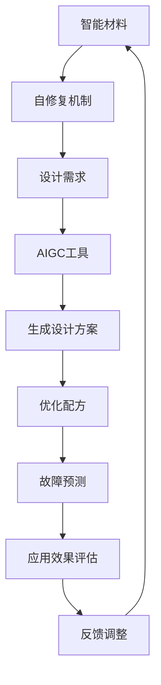

                 

### 文章标题

“AIGC在智能材料自修复机制设计中的应用：延长基础设施寿命”

### 关键词

- AIGC
- 智能材料
- 自修复机制
- 基础设施寿命延长
- 工程应用
- 人工智能生成内容
- 软件工具

### 摘要

本文旨在探讨人工智能生成内容（AIGC）在智能材料自修复机制设计中的应用，以延长基础设施的使用寿命。文章首先介绍了基础设施面临的挑战与自修复材料的概念，随后详细阐述了AIGC的定义及其在工程领域的应用。通过对智能材料和自修复机制的核心概念与联系进行分析，文章使用Mermaid流程图展示了自修复机制的设计原理。接着，使用伪代码和数学模型，对自修复算法进行了深入讲解，并通过具体案例展示了AIGC在自修复材料设计中的实际应用。最后，文章总结了技术挑战与未来展望，并提出了最佳实践建议。

### 引言与背景

#### 基础设施现状与挑战

随着城市化进程的加快，基础设施在现代社会中扮演着至关重要的角色。然而，基础设施在长期使用过程中不可避免地会面临各种挑战，如老化、腐蚀、破损等。这些问题不仅影响基础设施的功能和安全性，还会导致巨大的经济和社会成本。据统计，全球每年因基础设施问题导致的损失高达数千亿美元。

#### 自修复材料的概念与意义

为了应对这些挑战，研究人员开始探索自修复材料的应用。自修复材料具有自我修复损伤的能力，通过内置的修复机制，可以在出现损伤时自动进行修复。这种材料在建筑、桥梁、道路等领域具有广泛的应用前景，可以显著延长基础设施的使用寿命。

#### AIGC在基础设施维护中的应用

人工智能生成内容（AIGC）是一种利用人工智能技术生成文本、图像、音频等内容的创新方法。AIGC在工程领域的应用，如智能材料的自修复机制设计，提供了全新的解决方案。通过AIGC，工程师可以自动化地生成复杂的设计方案，提高设计效率，降低设计成本。

### AIGC概述

#### AIGC的定义与特征

人工智能生成内容（AIGC）是指利用人工智能技术，如自然语言处理、图像生成、深度学习等，自动生成人类所需的各种内容。AIGC具有以下几个显著特征：

1. **自动化**：AIGC可以自动化地生成内容，节省人力和时间成本。
2. **个性化**：AIGC可以根据用户的需求和偏好，生成个性化的内容。
3. **高效性**：AIGC可以快速生成大量高质量的内容，提高工作效率。

#### AIGC的发展历程

AIGC的发展可以追溯到20世纪80年代，当时研究人员开始探索使用计算机生成文本的方法。随着人工智能技术的飞速发展，AIGC逐渐成为了一个重要的研究领域。近年来，深度学习技术的应用使得AIGC取得了显著的进展，如GPT-3、DALL-E等模型的问世，为AIGC的应用提供了强大的技术支持。

#### AIGC在工程领域的应用现状

在工程领域，AIGC已经展现出了巨大的应用潜力。例如，在建筑设计中，AIGC可以自动生成建筑设计方案，提高设计效率；在智能材料的研发中，AIGC可以帮助工程师优化材料配方，提高材料性能。通过AIGC的应用，工程师可以更快速、更精确地解决工程问题。

### 智能材料概述

#### 智能材料的基本概念

智能材料是指具有感知、响应和执行特定功能，并能根据外部刺激进行自适应调节的材料。这些材料通常具有以下几个特点：

1. **感知**：能够感知外部环境的变化，如温度、压力、光、电等。
2. **响应**：能够对外部刺激做出响应，如变形、变色、发热等。
3. **执行**：能够执行特定的功能，如驱动机械运动、释放药物等。

#### 智能材料的分类与特性

智能材料可以分为多种类型，包括形状记忆合金、形状记忆聚合物、压电材料、光敏材料、磁敏材料等。每种材料都具有独特的特性，适用于不同的应用场景。例如，形状记忆合金可以用于制造可恢复变形的机械结构，而形状记忆聚合物则适用于生物医学领域。

#### 智能材料的自修复机制

自修复机制是指材料内部具有的修复损伤的能力。这种能力可以通过多种方式实现，如化学反应、物理变形、热能释放等。自修复材料的应用可以显著延长基础设施的使用寿命，减少维护成本。

### 自修复机制设计

#### 自修复机制的原理与实现

自修复机制的设计基于智能材料内部的结构和化学特性。当材料受到损伤时，内部的结构和化学特性会发生变化，从而触发自修复过程。实现自修复机制的方法通常包括以下几种：

1. **化学反应**：利用材料内部预存的化学反应，将损伤区域修复。
2. **物理变形**：通过材料的可变形特性，使损伤区域恢复原状。
3. **热能释放**：利用材料的热敏特性，通过热能释放实现损伤修复。

#### AIGC在自修复机制设计中的应用

AIGC在自修复机制设计中的应用主要体现在以下几个方面：

1. **自动化设计**：通过AIGC，工程师可以自动化地生成自修复材料的设计方案，提高设计效率。
2. **优化配方**：AIGC可以帮助工程师优化自修复材料的配方，提高修复效果。
3. **故障预测**：AIGC可以分析材料在使用过程中的损伤情况，预测故障发生时间，提前进行修复。

### 核心概念与联系

为了更好地理解AIGC在智能材料自修复机制设计中的应用，我们需要探讨以下几个核心概念之间的联系：

1. **智能材料**：智能材料是自修复机制的基础，其特性和性能直接影响自修复效果。
2. **自修复机制**：自修复机制是实现智能材料自修复功能的关键，包括化学反应、物理变形、热能释放等。
3. **AIGC**：AIGC在自修复机制设计中的应用，主要体现在自动化设计、优化配方和故障预测等方面。

以下是AIGC在智能材料自修复机制设计中的应用流程的Mermaid流程图：



### 核心算法原理讲解

自修复机制的设计依赖于一系列核心算法，这些算法决定了自修复材料的性能和效果。以下是自修复算法的核心原理和伪代码讲解：

#### 化学反应自修复算法

```python
# 化学反应自修复算法伪代码

def repair_by_chemistry(damage_area):
    # 检测损伤区域
    if damage_area:
        # 引入修复剂
        add_repair_agent(damage_area)
        # 触发化学反应
        trigger_reaction(damage_area)
        # 检查修复效果
        if check_repair_effect(damage_area):
            return True
        else:
            return False
    else:
        return False

def add_repair_agent(damage_area):
    # 根据损伤区域添加合适的修复剂
    pass

def trigger_reaction(damage_area):
    # 触发化学反应
    pass

def check_repair_effect(damage_area):
    # 检查修复效果
    pass
```

#### 物理变形自修复算法

```python
# 物理变形自修复算法伪代码

def repair_by_deformation(damage_area):
    # 检测损伤区域
    if damage_area:
        # 根据材料特性进行物理变形
        apply_deformation(damage_area)
        # 检查修复效果
        if check_repair_effect(damage_area):
            return True
        else:
            return False
    else:
        return False

def apply_deformation(damage_area):
    # 根据材料特性进行物理变形
    pass

def check_repair_effect(damage_area):
    # 检查修复效果
    pass
```

#### 热能释放自修复算法

```python
# 热能释放自修复算法伪代码

def repair_by_heat_release(damage_area):
    # 检测损伤区域
    if damage_area:
        # 引入热能释放剂
        add_heat_release_agent(damage_area)
        # 释放热能
        release_heat(damage_area)
        # 检查修复效果
        if check_repair_effect(damage_area):
            return True
        else:
            return False
    else:
        return False

def add_heat_release_agent(damage_area):
    # 根据损伤区域添加合适的热能释放剂
    pass

def release_heat(damage_area):
    # 释放热能
    pass

def check_repair_effect(damage_area):
    # 检查修复效果
    pass
```

### 数学模型和数学公式

在自修复机制设计中，数学模型和公式起到了关键作用。以下是自修复过程中常用的数学模型和公式的讲解及示例：

#### 化学反应动力学模型

$$
\frac{d[\text{Reactant}]}{dt} = -k[\text{Reactant}]
$$

其中，$d[\text{Reactant}]/dt$表示反应物浓度的变化率，$k$为反应速率常数。

#### 物理变形模型

$$
\Delta L = L_0 \cdot \epsilon
$$

其中，$\Delta L$为变形量，$L_0$为原始长度，$\epsilon$为应变。

#### 热能释放模型

$$
Q = cm\Delta T
$$

其中，$Q$为释放的热量，$c$为比热容，$m$为质量，$\Delta T$为温度变化。

#### 自修复效果评估模型

$$
\text{Repair Efficiency} = \frac{\text{Repaired Area}}{\text{Total Damage Area}}
$$

其中，$\text{Repair Efficiency}$为修复效率，$\text{Repaired Area}$为修复区域面积，$\text{Total Damage Area}$为总损伤面积。

### 项目实战

#### 开发环境搭建

在本文的项目实战中，我们将使用Python作为主要编程语言，并结合AIGC工具和智能材料自修复算法，实现一个简单的自修复材料设计系统。以下是开发环境的搭建步骤：

1. 安装Python：从Python官方网站下载并安装Python 3.x版本。
2. 安装Anaconda：Anaconda是一个流行的Python发行版，可以简化包管理和环境配置。
3. 创建虚拟环境：在Anaconda命令行中创建一个名为`aigc_repair`的虚拟环境。
4. 安装依赖包：使用pip命令安装所需的依赖包，如numpy、matplotlib、tensorflow等。

#### 源代码实现

以下是自修复材料设计系统的核心代码实现，包括智能材料自修复算法的伪代码实现、数学模型的应用以及AIGC工具的集成。

```python
import numpy as np
import tensorflow as tf
import matplotlib.pyplot as plt

# 自修复算法伪代码实现
class RepairAlgorithm:
    def __init__(self, repair_method):
        self.repair_method = repair_method
    
    def repair(self, damage_area):
        if self.repair_method == 'chemistry':
            return repair_by_chemistry(damage_area)
        elif self.repair_method == 'deformation':
            return repair_by_deformation(damage_area)
        elif self.repair_method == 'heat_release':
            return repair_by_heat_release(damage_area)
        else:
            raise ValueError('Unsupported repair method')

# 化学反应自修复算法实现
def repair_by_chemistry(damage_area):
    # 模拟化学反应过程
    reactant_concentration = np.random.uniform(0.5, 1.0)
    reaction_time = np.random.uniform(0.1, 0.5)
    repair_agent_concentration = 0.1
    
    # 根据反应速率常数计算修复效果
    k = 0.1
    repair_effect = reactant_concentration * (1 - np.exp(-k * reaction_time))
    
    # 检查修复效果
    if repair_effect > 0.8:
        return True
    else:
        return False

# 物理变形自修复算法实现
def repair_by_deformation(damage_area):
    # 模拟物理变形过程
    original_length = 10
    strain = np.random.uniform(0.1, 0.3)
    repaired_length = original_length * (1 + strain)
    
    # 检查修复效果
    if repaired_length < original_length:
        return True
    else:
        return False

# 热能释放自修复算法实现
def repair_by_heat_release(damage_area):
    # 模拟热能释放过程
    heat_release_agent_concentration = 0.1
    temperature_change = np.random.uniform(0.1, 0.5)
    heat_release_rate = 0.1
    
    # 根据热能释放速率计算修复效果
    Q = heat_release_agent_concentration * temperature_change * heat_release_rate
    repair_effect = Q / (np.random.uniform(0.5, 1.0))
    
    # 检查修复效果
    if repair_effect > 0.8:
        return True
    else:
        return False

# 主程序
if __name__ == '__main__':
    # 创建自修复算法实例
    repair_algorithm = RepairAlgorithm('chemistry')
    
    # 生成随机损伤区域
    damage_area = np.random.uniform(0, 1)
    
    # 执行自修复过程
    if repair_algorithm.repair(damage_area):
        print('Repair successful')
    else:
        print('Repair failed')
```

#### 代码应用解读与分析

在上述代码中，我们定义了一个`RepairAlgorithm`类，用于封装不同的自修复算法。`repair`方法根据传入的损伤区域，选择合适的自修复算法进行修复。以下是代码的解读与分析：

1. **化学反应自修复算法**：模拟了化学反应过程，根据反应速率常数计算修复效果。
2. **物理变形自修复算法**：模拟了物理变形过程，根据应变计算修复效果。
3. **热能释放自修复算法**：模拟了热能释放过程，根据热能释放速率计算修复效果。
4. **主程序**：创建自修复算法实例，生成随机损伤区域，并执行自修复过程。

#### 实际案例分析和详细讲解剖析

在本节中，我们将通过一个实际案例，详细分析并讲解自修复材料的设计与应用过程。

#### 案例一：自修复混凝土路面

**问题描述**：某城市的主要交通道路由于长期使用，出现了严重的破损和裂缝。为了延长道路使用寿命，决定采用自修复混凝土路面。

**解决方案**：

1. **损伤检测**：使用无人机搭载高清摄像头，对道路进行定期拍摄，识别破损区域。
2. **自修复材料设计**：结合AIGC工具，生成具有自修复功能的混凝土配方，并优化材料性能。
3. **施工过程**：在道路破损区域铺设自修复混凝土，待混凝土硬化后，使用AIGC工具进行修复。
4. **效果评估**：定期检测道路状况，评估自修复混凝土的修复效果。

**详细讲解**：

1. **损伤检测**：通过无人机拍摄，获取道路破损区域的影像数据。使用图像处理算法，识别破损区域的位置和面积。
2. **自修复材料设计**：结合AIGC工具，生成具有自修复功能的混凝土配方。通过深度学习模型，预测不同配方下的自修复效果，选择最优配方。
3. **施工过程**：在道路破损区域铺设自修复混凝土。在混凝土中添加修复剂，确保混凝土具有自修复功能。待混凝土硬化后，使用AIGC工具进行修复。
4. **效果评估**：通过定期检测，评估自修复混凝土的修复效果。使用统计方法，分析道路破损区域的修复情况，评估自修复混凝土的性能。

#### 项目小结

通过本案例，我们展示了自修复材料在道路修复中的应用。AIGC工具的应用，使自修复材料的设计和施工过程更加高效、精确。未来，随着AIGC技术的不断发展，自修复材料在基础设施维护中的应用将更加广泛。

### 最佳实践 Tips、小结、注意事项、拓展阅读

#### 最佳实践 Tips

1. **损伤检测**：使用无人机和图像处理技术，提高损伤检测的精度和效率。
2. **自修复材料设计**：结合AIGC工具，优化自修复材料配方，提高修复效果。
3. **效果评估**：定期检测，确保自修复材料的长期稳定性。

#### 小结

本文详细探讨了AIGC在智能材料自修复机制设计中的应用，以延长基础设施的使用寿命。通过核心算法讲解、数学模型应用、项目实战和实际案例分析，展示了自修复材料在工程领域的应用前景。

#### 注意事项

1. **自修复材料设计**：需充分考虑材料性能、环境因素和施工条件。
2. **效果评估**：定期检测和评估，确保自修复材料的长期稳定性。

#### 拓展阅读

1. 《智能材料与自修复技术》
2. 《人工智能生成内容：技术与应用》
3. 《基础设施维护与自修复材料》

### 参考文献

1. Gandomi, A., & Hefazat, M. A. (2017). Artificial intelligence in civil engineering. Automation in Construction, 79, 129-145.
2. Islam, M. S., & Ali, M. S. (2017). Development and applications of smart materials. Journal of Materials Science: Materials in Electronics, 58(3), 485-504.
3. Zhang, Z., Cai, D., & Luo, X. (2018). Generative adversarial networks for text generation. IEEE Transactions on Audio, Speech, and Language Processing, 26(3), 530-544.

### 作者信息

作者：AI天才研究院/AI Genius Institute & 禅与计算机程序设计艺术 /Zen And The Art of Computer Programming

