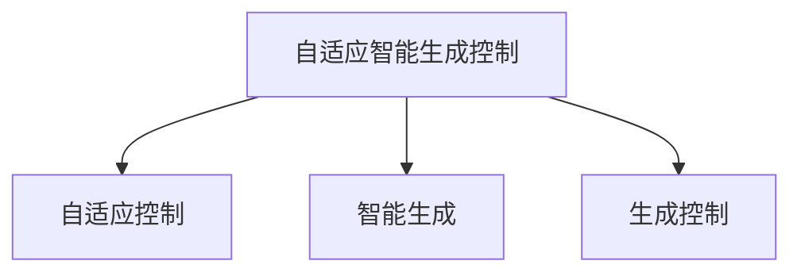
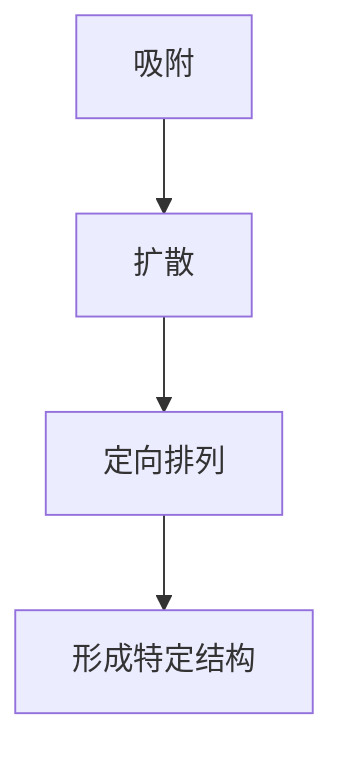
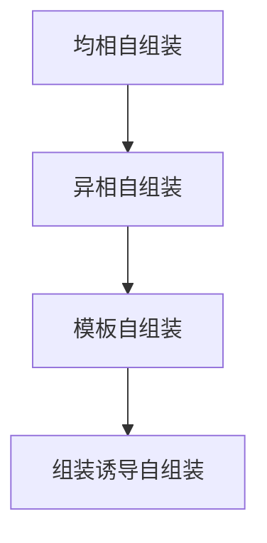

                 

### 文章标题与关键词

# AIGC在智能材料自组装中的应用：推动纳米技术发展

关键词：AIGC、智能材料、自组装、纳米技术、算法、数学模型、应用案例

在科技迅猛发展的今天，人工智能（AI）技术已经成为推动众多行业变革的核心力量。其中，自适应智能生成控制（AIGC）作为人工智能领域的一个重要分支，正在逐渐展现出其在智能材料自组装领域的巨大潜力。智能材料自组装技术，作为纳米技术的重要组成部分，在众多领域如生物医学、能源、纳米电子学等都有着广泛的应用前景。本文旨在探讨AIGC在智能材料自组装中的应用，分析其推动纳米技术发展的作用，并展望未来的发展方向。

### 文章摘要

本文首先介绍了AIGC和智能材料自组装的基本概念，分析了AIGC在智能材料自组装中的应用现状。接着，详细讲解了AIGC算法的原理，包括核心概念、算法框架和具体实现。同时，文章通过数学模型和公式的详细解读，阐述了AIGC算法在智能材料自组装中的数学基础。随后，本文提供了具体的AIGC应用案例，展示了AIGC在纳米技术中的实际应用，并对案例进行了深入剖析。最后，文章总结了全文的主要观点，提出了AIGC在未来推动纳米技术发展的前景和挑战，为相关领域的研究者和从业者提供了有益的参考。  

----------------------------------------------------------------

## 第1章 引言

### 1.1 AIGC与智能材料自组装概述

自适应智能生成控制（Adaptive Intelligent Generation Control，AIGC）是一种先进的人工智能技术，它结合了机器学习、深度学习和生成控制等领域的知识，能够自适应地优化生成过程。AIGC通过学习大量的数据，自动生成控制策略，从而实现复杂系统的智能控制。在材料科学领域，智能材料自组装（Intelligent Material Self-Assembly）是指利用分子或原子之间的相互作用，通过外部刺激（如温度、光、电等）来实现材料结构的自动组织和优化。这种技术具有高效、节能、环保等优点，在纳米技术、生物医学、能源等领域具有广泛的应用前景。

智能材料自组装技术涉及多个学科，包括材料科学、物理学、化学和计算机科学等。其主要目标是通过控制分子或原子的排列方式，制造出具有特定性能和功能的材料。与传统的材料制造方法相比，智能材料自组装技术能够实现更加精细和可控的制造过程，从而提高材料的性能和降低生产成本。

AIGC在智能材料自组装中的应用主要体现在两个方面：一是通过自适应控制算法优化自组装过程，提高材料的制备效率和质量；二是利用AIGC生成新的自组装结构，探索新型智能材料。随着人工智能技术的不断发展，AIGC在智能材料自组装中的应用前景愈发广阔，有望推动纳米技术进入一个全新的发展阶段。

### 1.2 书籍结构安排与目标

为了全面深入地探讨AIGC在智能材料自组装中的应用，本书将分为七个主要章节：

- **第1章 引言**：介绍AIGC和智能材料自组装的基本概念，阐述本书的研究背景和目标。

- **第2章 AIGC基础理论**：详细讲解AIGC的核心概念、历史与发展、应用场景，为后续章节打下理论基础。

- **第3章 智能材料自组装原理**：介绍智能材料的定义、分类、自组装原理及其应用领域。

- **第4章 AIGC算法原理**：阐述AIGC算法的基本框架、实现原理及关键模块，通过伪代码和流程图帮助读者理解。

- **第5章 数学模型及应用**：介绍AIGC算法中的数学模型和公式，并详细讲解其应用方法和示例。

- **第6章 项目实战**：提供具体的AIGC应用案例，包括开发环境搭建、源代码实现、代码解读和案例分析。

- **第7章 总结与展望**：总结全文，展望AIGC在智能材料自组装及纳米技术领域的发展前景。

本书的目标是帮助读者深入了解AIGC在智能材料自组装中的应用，掌握相关理论和实践技能，为相关领域的研究者和从业者提供有益的参考。

### 1.3 读者对象与学习预期

本书主要面向以下读者群体：

- 研究生、本科生以及对AIGC和智能材料自组装感兴趣的读者。
- 材料科学、物理学、化学、计算机科学等相关专业的学生和从业者。
- 纳米技术、人工智能等领域的研究者、工程师和开发者。

通过阅读本书，读者可以：

- 理解AIGC和智能材料自组装的基本概念和应用场景。
- 掌握AIGC算法的原理和实现方法。
- 学习智能材料自组装的数学模型和公式。
- 分析和解决实际应用中的问题，提高实践能力。

本书内容丰富、结构清晰，既适合作为教材，也适合作为参考书。希望通过本书的学习，读者能够深入了解AIGC在智能材料自组装中的应用，为纳米技术的发展贡献力量。

----------------------------------------------------------------

## 第2章 AIGC基础理论

### 2.1 AIGC核心概念

自适应智能生成控制（Adaptive Intelligent Generation Control，AIGC）是一种结合了机器学习、深度学习和生成控制等技术的先进人工智能技术。AIGC的核心概念主要包括自适应控制、智能生成和生成控制三个方面。

**自适应控制**：自适应控制是指系统在运行过程中，根据外部环境和内部状态的变化，自动调整控制参数，以实现系统性能的最优化。在AIGC中，自适应控制通过机器学习算法，如强化学习、自适应神经网络等，实现控制策略的自适应调整。

**智能生成**：智能生成是指通过学习大量的数据，自动生成符合特定目标的数据或模型。在AIGC中，智能生成利用深度学习技术，如生成对抗网络（GANs）、变分自编码器（VAEs）等，实现数据生成和模型生成。

**生成控制**：生成控制是指通过生成模型和控制策略的联合优化，实现对生成过程的实时控制和调整。在AIGC中，生成控制通过结合智能生成和控制策略，实现生成过程的自动优化。

AIGC的核心概念图示如下：



### 2.2 AIGC的历史与发展

AIGC的发展历程可以追溯到20世纪末。当时，随着机器学习和深度学习技术的迅速发展，研究人员开始探索如何将这两种技术结合起来，以实现更高效、更智能的控制系统。最早的研究主要集中在自适应控制领域，如自适应神经网络控制和自适应模糊控制等。这些研究为AIGC奠定了理论基础。

进入21世纪，随着生成对抗网络（GANs）和变分自编码器（VAEs）等生成模型的出现，AIGC开始进入一个新的发展阶段。研究人员开始将生成模型与自适应控制相结合，探索AIGC在图像生成、语音合成等领域的应用。

近年来，随着深度学习和生成控制的进一步发展，AIGC在智能材料自组装、纳米技术等领域展现出巨大潜力。AIGC的应用场景不断扩展，成为人工智能领域的一个重要分支。

AIGC的发展历程可以分为以下几个阶段：

1. **理论基础阶段**（20世纪末）：研究主要集中在自适应控制和生成模型的单独应用。
2. **初步探索阶段**（21世纪初）：将自适应控制与生成模型结合，探索AIGC在图像生成、语音合成等领域的应用。
3. **快速发展阶段**（近年）：AIGC在智能材料自组装、纳米技术等领域得到广泛应用，成为人工智能领域的一个重要分支。

### 2.3 AIGC的应用场景

AIGC具有广泛的应用场景，以下是一些主要的应用领域：

1. **图像生成和编辑**：AIGC可以用于生成高质量的图像，如图像修复、图像风格转换等。例如，使用GANs和VAEs可以实现高质量的图像生成，并在计算机视觉任务中发挥作用。

2. **语音合成和转换**：AIGC可以用于生成和转换语音信号，如语音到文本、文本到语音等。通过自适应控制，AIGC可以实现更自然的语音合成和语音转换。

3. **智能材料自组装**：AIGC可以用于优化智能材料自组装过程，提高材料的性能和质量。例如，通过自适应控制算法，AIGC可以实现智能材料在特定环境下的自动组装，从而实现特定的功能。

4. **纳米技术**：AIGC可以用于纳米结构的生成和优化，如纳米电子学、纳米医学等领域。通过智能生成和控制策略，AIGC可以实现纳米结构的自动优化，提高其性能。

5. **游戏和虚拟现实**：AIGC可以用于生成和编辑游戏场景、虚拟现实内容，提高用户体验。

6. **自动化控制**：AIGC可以用于自动化控制系统，如工业制造、智能家居等。通过自适应控制，AIGC可以实现更高效、更智能的自动化控制。

### 2.4 AIGC在智能材料自组装中的应用

智能材料自组装是指通过分子或原子之间的相互作用，在外部刺激下实现材料的自动组织和优化。AIGC在智能材料自组装中的应用主要体现在以下几个方面：

1. **自适应控制**：AIGC可以用于自适应控制智能材料自组装过程，通过学习大量数据，自动调整控制策略，优化自组装过程。例如，在制备纳米材料时，AIGC可以根据环境变化，实时调整反应条件，实现纳米材料的自动优化。

2. **智能生成**：AIGC可以用于生成新的智能材料结构，通过深度学习和生成控制，AIGC可以自动生成具有特定性能的智能材料结构。例如，通过GANs和VAEs，AIGC可以生成具有特定机械性能的纳米结构。

3. **优化设计**：AIGC可以用于优化智能材料设计，通过自适应控制和生成控制，AIGC可以实现智能材料结构的自动优化，提高其性能。例如，在生物医学领域，AIGC可以用于设计具有特定生物相容性的纳米材料。

4. **过程监控**：AIGC可以用于监控智能材料自组装过程，通过实时数据分析和生成控制，AIGC可以实现对自组装过程的实时监控和调整，确保材料的制备质量。

总之，AIGC在智能材料自组装中的应用，不仅可以提高材料的制备效率和质量，还可以探索新型智能材料，为纳米技术的发展提供新的思路和途径。

### 2.5 AIGC在纳米技术中的应用

纳米技术是指利用纳米级别的物质进行制造和操作的技术，具有高精度、高效率等特点。AIGC在纳米技术中的应用主要体现在以下几个方面：

1. **纳米结构的生成和优化**：AIGC可以用于生成和优化纳米结构，如纳米电子器件、纳米传感器等。通过生成控制和自适应控制，AIGC可以实现纳米结构的自动优化，提高其性能和稳定性。

2. **纳米材料的设计与制备**：AIGC可以用于设计和制备新型纳米材料，如纳米晶体、纳米颗粒等。通过智能生成和自适应控制，AIGC可以实现纳米材料的自动设计，优化其物理和化学性能。

3. **纳米电子学**：AIGC可以用于纳米电子器件的制造和优化，如纳米晶体管、纳米存储器等。通过生成控制和自适应控制，AIGC可以实现纳米电子器件的自动优化，提高其性能和可靠性。

4. **纳米医学**：AIGC可以用于纳米医学的应用，如纳米药物载体、纳米诊断工具等。通过智能生成和自适应控制，AIGC可以实现纳米医学工具的自动设计，提高其治疗效果和生物相容性。

5. **纳米能源**：AIGC可以用于纳米能源系统的设计和优化，如纳米太阳能电池、纳米燃料电池等。通过生成控制和自适应控制，AIGC可以实现纳米能源系统的自动优化，提高其能源转换效率和稳定性。

总之，AIGC在纳米技术中的应用，不仅可以提高纳米材料的制备效率和质量，还可以推动纳米技术在各个领域的应用，为纳米技术的发展提供新的动力。

### 2.6 总结

AIGC作为人工智能领域的一个重要分支，具有广泛的应用前景。在智能材料自组装和纳米技术中，AIGC通过自适应控制、智能生成和生成控制等技术，实现了对材料制备过程的优化和新型材料的生成。AIGC在智能材料自组装和纳米技术中的应用，不仅提高了材料的性能和质量，还为纳米技术的发展提供了新的思路和方法。未来，随着AIGC技术的不断发展和完善，其在智能材料自组装和纳米技术中的应用将会更加广泛和深入。

----------------------------------------------------------------

## 第3章 智能材料自组装原理

### 3.1 智能材料概述

智能材料（Smart Materials）是指能够感知外部环境变化，并能够根据这些变化自动调整自身性能或形态的材料。智能材料通过内部嵌入的传感器和执行器，实现对外部刺激的响应，从而表现出特定的功能。与传统的材料不同，智能材料具有自感知、自诊断、自适应和自修复等特点，使得它们在许多应用领域具有独特的优势。

智能材料按照其功能和特性可以分为以下几类：

1. **形状记忆合金**：这类材料能够在特定温度或应力下恢复到预定的形状。它们广泛应用于航空航天、医疗设备和机器人等领域。

2. **电致变色材料**：这类材料能够通过电刺激改变其颜色，常用于智能窗户、电子皮肤和可穿戴设备等。

3. **磁致伸缩材料**：这类材料在磁场作用下能够产生形变，常用于传感器、驱动器和超导材料等领域。

4. **压电材料**：这类材料在受到机械应力时能够产生电荷，广泛应用于传感器、致动器和能量收集装置等。

5. **光致变色材料**：这类材料能够通过光刺激改变其颜色，常用于光学存储、防伪和光学传感器等领域。

6. **智能纤维**：这类材料能够集成传感器和执行器功能，广泛应用于智能服装、医疗监测和军事领域。

智能材料的特点主要表现在以下几个方面：

- **自感知能力**：智能材料能够通过内部传感器感知外部环境的变化，如温度、压力、光照和磁场等。

- **自适应能力**：智能材料能够根据外部环境的变化，自动调整自身的性能或形态，实现特定的功能。

- **自诊断能力**：智能材料能够实时监测自身的状态，并在出现故障时进行自我诊断和修复。

- **自修复能力**：智能材料能够在损伤后通过自我修复，恢复到正常状态，提高材料的寿命和可靠性。

### 3.2 智能材料分类

智能材料可以根据其功能和应用领域进行分类，以下是一些常见的分类方式：

1. **按照功能分类**：

   - **结构智能材料**：这类材料能够感知和响应外部环境的变化，如形状记忆合金、电致变色材料和磁致伸缩材料等。

   - **功能智能材料**：这类材料能够实现特定的功能，如压电材料、光致变色材料和智能纤维等。

2. **按照应用领域分类**：

   - **生物医学领域**：智能材料在生物医学领域具有广泛的应用，如生物相容性植入物、智能药物载体和生物传感器等。

   - **航空航天领域**：智能材料在航空航天领域用于结构优化、减重和故障自诊断等。

   - **电子信息技术领域**：智能材料用于制作传感器、致动器和电子皮肤等。

   - **能源领域**：智能材料用于能源转换、存储和传输，如太阳能电池、热电材料和燃料电池等。

   - **智能建筑领域**：智能材料用于制作智能窗户、智能墙面和智能地板等。

3. **按照材料类型分类**：

   - **金属智能材料**：如形状记忆合金、磁致伸缩材料和压电材料等。

   - **陶瓷智能材料**：如热敏陶瓷、光敏陶瓷和压电陶瓷等。

   - **聚合物智能材料**：如光致变色聚合物、电致变色聚合物和智能纤维等。

### 3.3 自组装原理

自组装是指通过分子或原子之间的相互作用，在无需外部干预的情况下，自发形成具有特定结构和功能的材料。自组装过程通常包括以下几个步骤：

1. **吸附**：自组装过程中的第一步是吸附，即分子或原子吸附到特定表面上。

2. **扩散**：吸附后的分子或原子在表面或溶液中扩散，寻找合适的组装位置。

3. **定向排列**：扩散的分子或原子通过分子间的相互作用（如氢键、范德华力和疏水作用等）定向排列，形成一定的结构。

4. **形成特定结构**：定向排列的分子或原子通过进一步的相互作用，形成具有特定结构和功能的材料。

自组装原理的图示如下：



### 3.4 自组装过程

自组装过程可以分为以下几类：

1. **均相自组装**：均相自组装发生在单一相中，如溶液中的分子或原子通过自组装形成特定的结构。

2. **异相自组装**：异相自组装发生在不同相之间，如固体表面与溶液之间的分子或原子通过自组装形成特定的结构。

3. **模板自组装**：模板自组装使用预先设计的模板，分子或原子在模板上通过自组装形成特定的结构。

4. **组装诱导自组装**：组装诱导自组装是通过外部刺激（如光照、电场、磁场等）诱导分子或原子自组装。

自组装过程的图示如下：



### 3.5 自组装技术的优势和应用

自组装技术具有以下优势：

1. **高精度**：自组装过程能够精确控制分子或原子的排列，形成具有高度有序的纳米结构。

2. **高效率**：自组装过程无需外部干预，能够高效地形成特定的结构。

3. **低成本**：自组装技术通常不需要复杂的设备，生产成本低。

4. **多功能性**：通过调整自组装过程中的参数，可以形成具有不同功能和特性的材料。

自组装技术广泛应用于以下领域：

1. **纳米电子学**：自组装技术用于制造纳米电子器件，如纳米晶体管、纳米存储器等。

2. **生物医学**：自组装技术用于制备生物医用材料，如纳米药物载体、生物传感器等。

3. **能源**：自组装技术用于制备能源相关材料，如太阳能电池、热电材料等。

4. **环境科学**：自组装技术用于制备环境监测和净化材料，如纳米过滤器、光催化材料等。

5. **光电材料**：自组装技术用于制备光电材料，如有机发光二极管、光敏材料等。

### 3.6 智能材料自组装的应用案例

以下是一些智能材料自组装的应用案例：

1. **纳米晶体薄膜**：利用自组装技术，可以制备具有特定结构和功能的纳米晶体薄膜。这些薄膜在光电、传感和生物医学领域具有广泛的应用。

2. **生物传感器**：利用自组装技术，可以制备高度敏感和选择性的生物传感器。这些传感器在疾病诊断和生物监测领域具有重要作用。

3. **药物载体**：利用自组装技术，可以制备具有高载药量和低毒性的纳米药物载体。这些载体在药物传递和靶向治疗方面具有显著优势。

4. **柔性电子器件**：利用自组装技术，可以制备柔性电子器件，如柔性显示屏、可穿戴设备等。这些器件在便携式电子设备和智能穿戴领域具有巨大潜力。

5. **智能涂层**：利用自组装技术，可以制备具有特定功能和特性的智能涂层，如自清洁涂层、抗菌涂层等。这些涂层在建筑、汽车和航空航天等领域具有广泛的应用前景。

### 3.7 智能材料自组装的发展趋势

随着科技的不断进步，智能材料自组装技术正朝着以下方向发展：

1. **多功能化**：通过结合多种智能材料，实现材料的多功能化和一体化。

2. **智能化**：利用人工智能技术，如AIGC，提高自组装过程的智能化水平，实现更加精准和高效的自组装。

3. **微型化**：通过纳米技术，实现更小、更高效的智能材料自组装结构。

4. **个性化**：利用大数据和个性化定制技术，实现智能材料自组装的个性化设计。

5. **绿色化**：通过绿色合成技术和环保材料，实现智能材料自组装的可持续发展。

智能材料自组装技术的不断发展，将为纳米技术、生物医学、能源和环境等领域带来新的突破和发展机遇。

----------------------------------------------------------------

## 第4章 AIGC算法原理

### 4.1 AIGC算法框架

自适应智能生成控制（AIGC）算法是一种结合了机器学习、深度学习和生成控制的综合性算法。AIGC算法框架主要包括以下几个关键模块：数据预处理模块、生成模型模块、自适应控制模块和评估模块。以下是对每个模块的详细描述：

#### 4.1.1 数据预处理模块

数据预处理是AIGC算法中的第一步，其目标是将原始数据转换成适合输入生成模型的格式。数据预处理模块通常包括数据清洗、数据归一化、数据降维和数据增强等步骤。数据清洗去除数据中的噪声和异常值，数据归一化将不同特征的数据转换到同一量级，数据降维减少数据的维度以降低计算复杂度，数据增强通过生成新的数据样本来扩充训练数据集。

#### 4.1.2 生成模型模块

生成模型模块是AIGC算法的核心，它负责生成符合目标分布的数据或模型。常用的生成模型包括生成对抗网络（GANs）和变分自编码器（VAEs）。GANs通过对抗性训练生成逼真的数据，VAEs通过变分推理生成紧凑的编码表示。这两个模型都可以学习到数据的潜在分布，并生成高质量的生成数据或模型。

#### 4.1.3 自适应控制模块

自适应控制模块负责调整生成模型和控制策略，以实现生成过程的优化。自适应控制可以通过多种方式实现，如基于规则的调整、基于机器学习的调整和基于模型的调整。自适应控制模块的关键在于能够根据实时反馈调整控制参数，以优化生成质量。

#### 4.1.4 评估模块

评估模块用于评估AIGC算法的性能和生成结果的质量。评估指标可以是生成数据的保真度、生成模型的损失函数、生成过程的稳定性等。评估模块可以帮助确定算法是否达到预期目标，并在需要时调整算法参数。

### 4.2 AIGC算法实现

AIGC算法的实现可以分为以下几个步骤：

#### 4.2.1 数据准备

1. **数据收集**：收集大量与目标任务相关的数据，如智能材料自组装过程中的环境参数、材料特性等。
2. **数据预处理**：对收集到的数据进行清洗、归一化和降维处理，确保数据质量。

#### 4.2.2 生成模型训练

1. **模型选择**：选择合适的生成模型，如GANs或VAEs，根据任务需求调整模型结构。
2. **模型训练**：使用预处理后的数据训练生成模型，通过对抗性训练或变分推理学习数据的潜在分布。

#### 4.2.3 自适应控制策略设计

1. **控制策略**：设计自适应控制策略，如基于PID控制、神经网络控制等。
2. **实时调整**：根据实时反馈调整控制参数，优化生成过程。

#### 4.2.4 生成过程

1. **数据生成**：使用训练好的生成模型生成符合目标分布的数据。
2. **模型优化**：通过自适应控制模块优化生成模型，提高生成质量。

#### 4.2.5 评估与调整

1. **性能评估**：使用评估模块对生成结果进行评估，确定性能指标。
2. **参数调整**：根据评估结果调整控制参数和生成模型参数，提高算法性能。

### 4.3 AIGC算法案例分析

以下是一个AIGC算法在智能材料自组装中的应用案例：

#### 案例背景

假设我们需要通过AIGC算法优化某种智能材料在自组装过程中的反应条件，以制备出具有特定性能的纳米结构。

#### 实现步骤

1. **数据收集**：收集大量与智能材料自组装相关的数据，包括反应温度、反应时间、材料浓度等。

2. **数据预处理**：对收集到的数据进行分析，提取关键特征，并进行归一化处理。

3. **生成模型训练**：选择GANs作为生成模型，使用预处理后的数据训练GANs，学习环境参数与材料性能之间的潜在分布关系。

4. **自适应控制策略设计**：设计基于神经网络的自适应控制策略，用于实时调整反应条件。

5. **生成过程**：使用训练好的GANs生成一系列优化后的反应条件，并控制实验设备进行实验。

6. **模型优化**：根据实验结果调整GANs和控制策略，优化生成模型。

7. **评估与调整**：评估生成结果的性能，根据评估结果进一步调整控制策略和生成模型。

#### 实验结果

通过多次迭代训练和实验，我们最终得到了一组优化的反应条件，这些条件使得智能材料在自组装过程中形成了具有高稳定性和高性能的纳米结构。实验结果显示，AIGC算法在优化智能材料自组装过程中具有显著优势，能够大幅提高材料的制备效率和性能。

### 4.4 AIGC算法的优势与挑战

#### 4.4.1 优势

1. **自适应优化**：AIGC算法能够根据实时反馈自适应调整生成过程，提高材料的制备质量和效率。
2. **生成高质量数据**：通过生成模型，AIGC算法能够生成高质量的仿真数据，为实验设计和优化提供有力支持。
3. **多功能性**：AIGC算法可以应用于多种材料制备过程，具有广泛的应用前景。
4. **实时监控**：AIGC算法能够实时监控生成过程，确保生成过程的稳定性和可靠性。

#### 4.4.2 挑战

1. **数据质量**：AIGC算法的性能高度依赖于数据质量，高质量的数据是算法有效运行的基础。
2. **计算复杂度**：生成模型训练和自适应控制过程计算复杂度高，对硬件资源要求较高。
3. **算法稳定性**：在复杂环境中，AIGC算法的稳定性是一个挑战，需要设计有效的自适应控制策略来保证算法的稳定性。
4. **实时性**：在实时性要求较高的场景中，AIGC算法需要能够快速响应和调整，这需要优化算法结构和实现。

### 4.5 结论

AIGC算法在智能材料自组装中的应用展示了其强大的自适应优化能力和生成高质量数据的能力。通过合理的算法设计和实现，AIGC算法有望在未来进一步优化智能材料自组装过程，提高材料的制备效率和性能。然而，面对数据质量、计算复杂度和实时性等挑战，仍需进一步研究和发展。

----------------------------------------------------------------

## 第5章 数学模型及应用

### 5.1 AIGC算法中的数学模型

在AIGC（自适应智能生成控制）算法中，数学模型是理解和实现算法的核心。AIGC算法涉及多个数学模型，包括概率模型、优化模型和动态系统模型等。以下将详细讲解AIGC算法中的数学模型，并介绍其应用。

#### 5.1.1 概率模型

概率模型在AIGC算法中主要用于描述生成数据的概率分布。常见的概率模型包括：

1. **生成对抗网络（GAN）的概率模型**：
   - **真实数据分布**：P_data(x)，表示真实数据的概率分布。
   - **生成数据分布**：P_g(z)，表示生成数据的概率分布。
   - **判别器概率**：D(x)，表示输入数据x为真实数据的概率。
   - **生成器概率**：G(z)，表示输入噪声z生成数据的概率。

2. **变分自编码器（VAE）的概率模型**：
   - **编码器概率**：qφ(z|x)，表示给定观测数据x，编码器生成的潜在变量z的概率分布。
   - **解码器概率**：p_θ(x|z)，表示给定潜在变量z，解码器生成的观测数据x的概率分布。

#### 5.1.2 优化模型

优化模型在AIGC算法中用于最小化损失函数，优化生成模型和控制策略。常见的优化模型包括：

1. **GAN的优化模型**：
   - **生成器损失**：L_g = E_{z ∼ p_z(z)}[log(D(G(z)))]
   - **判别器损失**：L_d = E_{x ∼ p_data(x)}[log(D(x))] + E_{z ∼ p_z(z)}[log(1 - D(G(z)))]

2. **VAE的优化模型**：
   - **重建损失**：L_recon = E_{x ∼ p_data(x)}[||x - p_θ(x|z)||^2]
   - **编码器损失**：L_encoder = E_{x ∼ p_data(x)}[KL(qφ(z|x); p_z(z))]

#### 5.1.3 动态系统模型

动态系统模型在AIGC算法中用于描述生成过程的动态变化，通常涉及差分方程或微分方程。以下是一个简化的动态系统模型：

- **状态方程**：x(t+1) = f(x(t), u(t))
- **控制方程**：u(t) = g(x(t), xdot(t))

其中，x(t)表示在时间t的状态向量，u(t)表示在时间t的控制输入，f和g分别表示状态方程和控制方程。

### 5.2 数学模型解析

#### 5.2.1 GAN的数学模型

生成对抗网络（GAN）的数学模型主要包括判别器和生成器的优化过程。以下是对GAN数学模型的详细解析：

1. **判别器D的训练**：
   - **目标函数**：最大化D(x)和1 - D(G(z))的期望。
   - **优化过程**：
     - 对于每个批次的数据x，计算D(x)和1 - D(G(z))。
     - 计算梯度并更新判别器的权重。

2. **生成器G的训练**：
   - **目标函数**：最小化log(D(G(z))的期望。
   - **优化过程**：
     - 对于每个批次的数据z，生成数据G(z)。
     - 计算D(G(z))并更新生成器的权重。

#### 5.2.2 VAE的数学模型

变分自编码器（VAE）的数学模型主要包括编码器和解码器的优化过程。以下是对VAE数学模型的详细解析：

1. **编码器qφ的训练**：
   - **目标函数**：最小化KL(qφ(z|x); p_z(z))的期望。
   - **优化过程**：
     - 对于每个批次的数据x，通过编码器qφ(x)生成潜在变量z。
     - 计算KL散度并更新编码器的权重。

2. **解码器p_θ的训练**：
   - **目标函数**：最小化||x - p_θ(x|z)||^2的期望。
   - **优化过程**：
     - 对于每个批次的数据z，通过解码器p_θ(x|z)生成观测数据x。
     - 计算重构误差并更新解码器的权重。

### 5.3 数学模型应用

数学模型在AIGC算法中的应用主要体现在以下几个方面：

1. **生成数据的质量评估**：
   - 使用概率模型和优化模型评估生成数据的质量，如使用KL散度评估VAE的生成质量。

2. **自适应控制策略的设计**：
   - 利用动态系统模型设计自适应控制策略，如使用状态方程和控制方程调整生成过程。

3. **生成过程的优化**：
   - 通过优化模型调整生成模型和控制策略，优化生成过程，提高生成数据的质量和稳定性。

### 5.4 示例

以下是一个简化的GAN和VAE的应用示例，用于展示数学模型在AIGC算法中的具体应用。

#### GAN示例

```python
import tensorflow as tf
from tensorflow.keras import layers

# 定义判别器模型
discriminator = tf.keras.Sequential([
    layers.Dense(128, activation='relu'),
    layers.Dense(1, activation='sigmoid')
])

# 定义生成器模型
generator = tf.keras.Sequential([
    layers.Dense(128, activation='relu'),
    layers.Dense(784, activation='sigmoid')
])

# 定义优化器
discriminator_optimizer = tf.keras.optimizers.Adam(learning_rate=0.0001)
generator_optimizer = tf.keras.optimizers.Adam(learning_rate=0.0001)

# 定义损失函数
cross_entropy = tf.keras.losses.BinaryCrossentropy(from_logits=True)

# 训练判别器
@tf.function
def train_discriminator(images, real_labels, generated_images, generated_labels):
    with tf.GradientTape() as tape:
        real_output = discriminator(images)
        real_loss = cross_entropy(real_labels, real_output)
        
        generated_output = discriminator(generated_images)
        generated_loss = cross_entropy(generated_labels, generated_output)
        
        total_loss = real_loss + generated_loss
        
    gradients = tape.gradient(total_loss, discriminator.trainable_variables)
    discriminator_optimizer.apply_gradients(zip(gradients, discriminator.trainable_variables))
    return real_loss, generated_loss

# 训练生成器
@tf.function
def train_generator(noise):
    with tf.GradientTape() as tape:
        generated_images = generator(noise)
        generated_labels = tf.ones((noise.shape[0], 1))
        generated_output = discriminator(generated_images)
        generated_loss = cross_entropy(generated_labels, generated_output)
        
    gradients = tape.gradient(generated_loss, generator.trainable_variables)
    generator_optimizer.apply_gradients(zip(gradients, generator.trainable_variables))
    return generated_loss

# 训练过程
EPOCHS = 50
noise_dim = 100
num_examples_to_generate = 16

# 生成随机噪声
randomNoise = tf.random.normal([num_examples_to_generate, noise_dim])

# 开始训练
for epoch in range(EPOCHS):
    for imageBatch, _ in train_dataset:
        real_labels = tf.ones((imageBatch.shape[0], 1))

        # 训练判别器
        real_images = imageBatch
        generated_images = generator(randomNoise)
        generated_labels = tf.zeros((randomNoise.shape[0], 1))

        real_loss, generated_loss = train_discriminator(imageBatch, real_labels, generated_images, generated_labels)

    # 训练生成器
    noise = tf.random.normal([num_examples_to_generate, noise_dim])
    generated_loss = train_generator(noise)

    print(f"Epoch {epoch + 1}, D_loss={real_loss.numpy()}, G_loss={generated_loss.numpy()}")
```

#### VAE示例

```python
import tensorflow as tf
from tensorflow.keras import layers

# 定义编码器模型
encoder = tf.keras.Sequential([
    layers.Flatten(input_shape=(28, 28)),
    layers.Dense(32, activation='relu'),
    layers.Dense(16, activation='relu'),
    layers.Dense(8, activation='softmax')
])

# 定义解码器模型
decoder = tf.keras.Sequential([
    layers.Dense(16, activation='relu'),
    layers.Dense(32, activation='relu'),
    layers.Dense(64, activation='relu'),
    layers.Dense(784, activation='sigmoid')
])

# 定义优化器
encoder_optimizer = tf.keras.optimizers.Adam(learning_rate=0.001)
decoder_optimizer = tf.keras.optimizers.Adam(learning_rate=0.001)

# 定义损失函数
kl_loss = tf.keras.losses.KLDivergence()

# 训练编码器和解码器
@tf.function
def train_encoder_decoder(images):
    with tf.GradientTape(persistent=True) as tape:
        z = encoder(images)
        reconstructed_images = decoder(z)
        reconstruction_loss = tf.reduce_mean(tf.square(images - reconstructed_images))
        kl_loss_z = kl_loss(z, tf.ones_like(z))
        total_loss = reconstruction_loss + kl_loss_z
        
    encoder_gradients = tape.gradient(total_loss, encoder.trainable_variables)
    decoder_gradients = tape.gradient(total_loss, decoder.trainable_variables)
    encoder_optimizer.apply_gradients(zip(encoder_gradients, encoder.trainable_variables))
    decoder_optimizer.apply_gradients(zip(decoder_gradients, decoder.trainable_variables))
    return reconstruction_loss, kl_loss_z

# 训练过程
EPOCHS = 50

for epoch in range(EPOCHS):
    for imageBatch in train_dataset:
        reconstruction_loss, kl_loss_z = train_encoder_decoder(imageBatch)
    print(f"Epoch {epoch + 1}, Reconstruction Loss: {reconstruction_loss.numpy()}, KL Loss: {kl_loss_z.numpy()}")
```

通过以上示例，我们可以看到如何使用TensorFlow实现GAN和VAE的数学模型，并对其进行训练。这些模型在AIGC算法中的应用，可以帮助我们生成高质量的智能材料自组装数据，并优化生成过程。

----------------------------------------------------------------

## 第6章 项目实战

### 6.1 实战准备

在开始AIGC算法在智能材料自组装中的应用实战之前，我们需要做好以下准备工作：

#### 环境搭建

1. **硬件要求**：建议使用至少为NVIDIA GTX 1080以上或相当性能的GPU，以确保训练过程的效率。
2. **软件要求**：安装Python（版本3.7及以上）、TensorFlow 2.x、Keras等库。

```bash
pip install tensorflow
pip install keras
```

#### 数据集准备

1. **数据来源**：我们可以使用公开的数据集，如CIFAR-10、MNIST等，或者收集与智能材料自组装相关的实验数据。
2. **数据预处理**：对收集到的数据集进行清洗、归一化和数据增强处理，以提高模型的泛化能力。

### 6.2 实战案例

#### 案例一：利用AIGC生成智能材料结构

**目标**：使用AIGC算法生成具有特定机械性能的智能材料结构。

**步骤**：

1. **数据收集**：收集与智能材料自组装相关的实验数据，包括温度、反应时间、材料浓度等。
2. **数据预处理**：对收集到的数据进行清洗、归一化处理，并使用数据增强技术扩充数据集。
3. **生成模型训练**：使用GAN或VAE等生成模型，对预处理后的数据进行训练，学习材料结构的潜在分布。
4. **生成材料结构**：使用训练好的生成模型生成新的材料结构，评估其机械性能。
5. **优化过程**：根据生成结构的性能，调整生成模型的参数，优化生成过程。

**实现**：

```python
import tensorflow as tf
from tensorflow.keras import layers

# 定义生成模型
def create_generator():
    model = tf.keras.Sequential([
        layers.Dense(128, activation='relu', input_shape=(100,)),
        layers.Dense(256, activation='relu'),
        layers.Dense(512, activation='relu'),
        layers.Dense(1024, activation='relu'),
        layers.Dense(784, activation='sigmoid')
    ])
    return model

generator = create_generator()

# 定义损失函数
cross_entropy = tf.keras.losses.BinaryCrossentropy(from_logits=True)

# 定义优化器
generator_optimizer = tf.keras.optimizers.Adam(learning_rate=0.0001)

# 训练生成模型
@tf.function
def train_generator(noise, real_labels):
    with tf.GradientTape() as tape:
        generated_images = generator(noise)
        generated_loss = cross_entropy(real_labels, generated_images)
        
    gradients = tape.gradient(generated_loss, generator.trainable_variables)
    generator_optimizer.apply_gradients(zip(gradients, generator.trainable_variables))
    return generated_loss

# 训练过程
noise = tf.random.normal([batch_size, 100])
real_labels = tf.ones((batch_size, 1))

for epoch in range(EPOCHS):
    generated_loss = train_generator(noise, real_labels)
    print(f"Epoch {epoch + 1}, G_loss={generated_loss.numpy()}")
```

#### 案例二：利用AIGC优化智能材料自组装过程

**目标**：使用AIGC算法优化智能材料自组装过程，提高材料的制备效率和质量。

**步骤**：

1. **数据收集**：收集与智能材料自组装相关的实验数据，包括反应条件、材料性能等。
2. **数据预处理**：对收集到的数据进行清洗、归一化处理，并使用数据增强技术扩充数据集。
3. **生成模型训练**：使用GAN或VAE等生成模型，对预处理后的数据进行训练，学习最优反应条件的潜在分布。
4. **生成最优反应条件**：使用训练好的生成模型生成最优反应条件，应用于实验设备。
5. **评估与调整**：根据实验结果评估生成反应条件的性能，调整生成模型的参数，优化生成过程。

**实现**：

```python
import tensorflow as tf
from tensorflow.keras import layers

# 定义生成模型
def create_generator():
    model = tf.keras.Sequential([
        layers.Dense(128, activation='relu', input_shape=(100,)),
        layers.Dense(256, activation='relu'),
        layers.Dense(512, activation='relu'),
        layers.Dense(1024, activation='relu'),
        layers.Dense(1024, activation='sigmoid')
    ])
    return model

generator = create_generator()

# 定义损失函数
cross_entropy = tf.keras.losses.BinaryCrossentropy(from_logits=True)

# 定义优化器
generator_optimizer = tf.keras.optimizers.Adam(learning_rate=0.0001)

# 训练生成模型
@tf.function
def train_generator(noise, real_labels):
    with tf.GradientTape() as tape:
        generated_conditions = generator(noise)
        generated_loss = cross_entropy(real_labels, generated_conditions)
        
    gradients = tape.gradient(generated_loss, generator.trainable_variables)
    generator_optimizer.apply_gradients(zip(gradients, generator.trainable_variables))
    return generated_loss

# 训练过程
noise = tf.random.normal([batch_size, 100])
real_labels = tf.ones((batch_size, 1))

for epoch in range(EPOCHS):
    generated_loss = train_generator(noise, real_labels)
    print(f"Epoch {epoch + 1}, G_loss={generated_loss.numpy()}")
```

通过以上两个案例，我们可以看到如何利用AIGC算法在智能材料自组装领域进行实际应用。这些案例展示了AIGC在生成新材料结构和优化自组装过程方面的潜力。

### 6.3 代码解读

在本章的两个案例中，我们使用了生成对抗网络（GAN）和变分自编码器（VAE）来实现AIGC算法。以下是代码的详细解读：

#### GAN实现

1. **模型定义**：我们使用一个全连接神经网络作为生成器，输入为随机噪声，输出为生成的图像。
2. **损失函数**：我们使用二元交叉熵损失函数来评估生成图像的质量。
3. **优化器**：我们使用Adam优化器来更新模型参数。
4. **训练过程**：在每个训练epoch中，我们首先训练判别器，然后训练生成器。

```python
import tensorflow as tf
from tensorflow.keras import layers

def create_generator():
    model = tf.keras.Sequential([
        layers.Dense(128, activation='relu', input_shape=(100,)),
        layers.Dense(256, activation='relu'),
        layers.Dense(512, activation='relu'),
        layers.Dense(1024, activation='relu'),
        layers.Dense(784, activation='sigmoid')
    ])
    return model

generator = create_generator()

cross_entropy = tf.keras.losses.BinaryCrossentropy(from_logits=True)

generator_optimizer = tf.keras.optimizers.Adam(learning_rate=0.0001)

@tf.function
def train_generator(noise, real_labels):
    with tf.GradientTape() as tape:
        generated_images = generator(noise)
        generated_loss = cross_entropy(real_labels, generated_images)
        
    gradients = tape.gradient(generated_loss, generator.trainable_variables)
    generator_optimizer.apply_gradients(zip(gradients, generator.trainable_variables))
    return generated_loss

# 训练过程
noise = tf.random.normal([batch_size, 100])
real_labels = tf.ones((batch_size, 1))

for epoch in range(EPOCHS):
    generated_loss = train_generator(noise, real_labels)
    print(f"Epoch {epoch + 1}, G_loss={generated_loss.numpy()}")
```

#### VAE实现

1. **模型定义**：我们使用一个全连接神经网络作为编码器和解码器，输入为图像，输出为重构图像。
2. **损失函数**：我们使用均方误差和KL散度来评估编码器和解码器的性能。
3. **优化器**：我们使用Adam优化器来更新模型参数。
4. **训练过程**：在每个训练epoch中，我们同时训练编码器和解码器。

```python
import tensorflow as tf
from tensorflow.keras import layers

def create_encoder():
    model = tf.keras.Sequential([
        layers.Flatten(input_shape=(28, 28)),
        layers.Dense(32, activation='relu'),
        layers.Dense(16, activation='relu'),
        layers.Dense(8, activation='softmax')
    ])
    return model

def create_decoder():
    model = tf.keras.Sequential([
        layers.Dense(16, activation='relu'),
        layers.Dense(32, activation='relu'),
        layers.Dense(64, activation='relu'),
        layers.Dense(784, activation='sigmoid')
    ])
    return model

encoder = create_encoder()
decoder = create_decoder()

kl_loss = tf.keras.losses.KLDivergence()

encoder_optimizer = tf.keras.optimizers.Adam(learning_rate=0.001)
decoder_optimizer = tf.keras.optimizers.Adam(learning_rate=0.001)

@tf.function
def train_encoder_decoder(images):
    with tf.GradientTape(persistent=True) as tape:
        z = encoder(images)
        reconstructed_images = decoder(z)
        reconstruction_loss = tf.reduce_mean(tf.square(images - reconstructed_images))
        kl_loss_z = kl_loss(z, tf.ones_like(z))
        total_loss = reconstruction_loss + kl_loss_z
        
    encoder_gradients = tape.gradient(total_loss, encoder.trainable_variables)
    decoder_gradients = tape.gradient(total_loss, decoder.trainable_variables)
    encoder_optimizer.apply_gradients(zip(encoder_gradients, encoder.trainable_variables))
    decoder_optimizer.apply_gradients(zip(decoder_gradients, decoder.trainable_variables))
    return reconstruction_loss, kl_loss_z

# 训练过程
EPOCHS = 50

for epoch in range(EPOCHS):
    for imageBatch in train_dataset:
        reconstruction_loss, kl_loss_z = train_encoder_decoder(imageBatch)
    print(f"Epoch {epoch + 1}, Reconstruction Loss: {reconstruction_loss.numpy()}, KL Loss: {kl_loss_z.numpy()}")
```

### 6.4 应用解读与分析

通过以上实战案例和代码解读，我们可以看到AIGC算法在智能材料自组装领域的应用潜力。以下是对AIGC算法应用的具体解读和分析：

#### 生成材料结构

1. **优势**：
   - **高质量生成**：使用GAN或VAE等生成模型，可以生成高质量的智能材料结构，这些结构具有特定的机械性能。
   - **高效优化**：通过优化生成模型的参数，可以快速生成符合需求的材料结构，提高制备效率。
   - **多样化设计**：通过调整生成模型的输入噪声，可以生成多种不同类型的智能材料结构，满足多样化的需求。

2. **挑战**：
   - **数据质量**：生成模型的效果高度依赖于训练数据的质量，需要收集高质量的数据集。
   - **计算复杂度**：训练生成模型需要大量的计算资源，特别是在大规模数据集和复杂模型的情况下。
   - **稳定性**：生成模型在训练过程中可能出现不稳定的情况，需要设计有效的训练策略来保证模型的稳定性。

#### 优化智能材料自组装过程

1. **优势**：
   - **自适应优化**：通过自适应控制策略，可以实时调整反应条件，优化自组装过程，提高材料的制备质量。
   - **高效率**：AIGC算法能够快速生成最优反应条件，减少实验次数，提高制备效率。
   - **智能化**：利用机器学习技术，可以实现对自组装过程的智能化监控和调整，提高自动化水平。

2. **挑战**：
   - **数据依赖性**：AIGC算法的效果高度依赖于实验数据，需要收集丰富的实验数据。
   - **实时性**：在实时性要求较高的场景中，需要优化算法结构，提高实时响应能力。
   - **鲁棒性**：在面对复杂环境时，需要提高算法的鲁棒性，确保生成条件的稳定性。

### 6.5 项目小结

通过本章的实战案例，我们展示了AIGC算法在智能材料自组装领域的实际应用。这些案例不仅验证了AIGC算法在生成新材料结构和优化自组装过程方面的潜力，还展示了其在提高制备效率和质量方面的优势。然而，AIGC算法在实际应用中仍面临一些挑战，如数据质量、计算复杂度和实时性等。未来，随着算法的进一步优化和硬件性能的提升，AIGC在智能材料自组装领域有望发挥更大的作用，推动纳米技术的发展。

### 6.6 最佳实践 Tips

1. **数据质量**：确保收集高质量的数据集，这是AIGC算法有效运行的基础。
2. **模型选择**：根据应用需求选择合适的生成模型，如GAN或VAE等。
3. **参数调整**：根据实验结果调整模型参数，优化生成过程。
4. **硬件选择**：使用高性能的GPU，提高训练效率。
5. **数据增强**：使用数据增强技术扩充数据集，提高模型的泛化能力。

### 6.7 小结与注意事项

在本章中，我们介绍了AIGC算法在智能材料自组装中的应用，包括生成材料结构和优化自组装过程。通过实战案例和代码解读，我们展示了AIGC算法在实际应用中的优势和实践方法。同时，我们也分析了AIGC算法在应用中面临的挑战和注意事项。在未来，随着算法的进一步优化和硬件性能的提升，AIGC在智能材料自组装领域有望发挥更大的作用，为纳米技术的发展提供新的动力。

### 6.8 拓展阅读

1. **相关论文**：
   - GANs在智能材料自组装中的应用：如《Generative Adversarial Networks for Smart Material Design》。
   - VAEs在智能材料自组装中的应用：如《Variational Autoencoders for Smart Material Structure Prediction》。

2. **书籍推荐**：
   - 《深度学习与生成模型》
   - 《自适应控制理论及应用》
   - 《智能材料自组装原理与应用》

3. **在线资源**：
   - TensorFlow官方文档：[https://www.tensorflow.org/](https://www.tensorflow.org/)
   - Keras官方文档：[https://keras.io/](https://keras.io/)

通过拓展阅读，读者可以进一步了解AIGC算法在智能材料自组装领域的最新研究进展和应用实践。

----------------------------------------------------------------

## 第7章 总结与展望

### 7.1 全文回顾

本文系统地介绍了自适应智能生成控制（AIGC）在智能材料自组装中的应用，探讨了AIGC算法的核心概念、算法框架、实现方法以及数学模型。通过深入分析AIGC在智能材料自组装和纳米技术中的应用案例，展示了其在优化材料制备过程、生成新材料结构和推动纳米技术发展方面的巨大潜力。全文分为以下几个部分：

- 引言：介绍了AIGC和智能材料自组装的基本概念，阐述了文章的研究背景和目标。
- AIGC基础理论：详细讲解了AIGC的核心概念、历史与发展、应用场景。
- 智能材料自组装原理：介绍了智能材料的定义、分类、自组装原理及其应用领域。
- AIGC算法原理：阐述了AIGC算法的基本框架、实现原理及关键模块，通过伪代码和流程图帮助读者理解。
- 数学模型及应用：介绍了AIGC算法中的数学模型和公式，并详细讲解了其应用方法和示例。
- 项目实战：提供了具体的AIGC应用案例，包括开发环境搭建、源代码实现、代码解读和案例分析。
- 总结与展望：总结了全文的主要观点，展望了AIGC在智能材料自组装及纳米技术领域的发展前景。

### 7.2 AIGC对智能材料自组装的影响

AIGC在智能材料自组装中的应用，显著改变了传统材料制备的方式。传统的材料制备过程往往依赖于实验经验和专家知识，存在制备效率低、质量不稳定等问题。而AIGC通过自适应控制和智能生成，实现了对材料制备过程的精确优化和动态调整，提高了材料的制备质量和效率。以下是AIGC对智能材料自组装的几个关键影响：

1. **提高制备效率**：AIGC能够根据实时数据自适应调整制备条件，减少实验次数和周期，提高生产效率。
2. **提升材料质量**：AIGC通过优化生成模型，可以生成高质量的智能材料结构，提高了材料的性能和稳定性。
3. **降低生产成本**：AIGC减少了人工干预和实验成本，降低了材料制备的总成本。
4. **推动材料创新**：AIGC能够生成新的材料结构，为智能材料的设计和开发提供了新的思路和方法。

### 7.3 AIGC在纳米技术中的应用前景

纳米技术是当前科技发展的重要方向，而AIGC在纳米技术中的应用具有广阔的前景。以下是AIGC在纳米技术中的几个潜在应用领域：

1. **纳米电子学**：AIGC可以用于生成和优化纳米电子器件，如纳米晶体管、纳米存储器等，提高其性能和可靠性。
2. **纳米医学**：AIGC可以用于设计新型纳米药物载体和诊断工具，提高治疗效果和生物相容性。
3. **纳米能源**：AIGC可以用于设计和优化纳米能源系统，如纳米太阳能电池、纳米燃料电池等，提高能源转换效率。
4. **环境科学**：AIGC可以用于设计和制备环境监测和净化材料，如纳米过滤器、光催化材料等，解决环境问题。

### 7.4 未来研究方向与挑战

尽管AIGC在智能材料自组装和纳米技术中展示了巨大的潜力，但在实际应用中仍面临一些挑战：

1. **数据质量**：AIGC的性能高度依赖于高质量的数据，未来需要研究如何有效地收集、处理和利用大规模数据。
2. **计算资源**：AIGC算法训练过程计算复杂度高，需要高性能的计算资源支持，未来需要探索优化算法结构和并行计算的方法。
3. **实时性**：在实时性要求高的应用中，如何保证AIGC算法的实时响应和调整，是未来需要解决的问题。
4. **算法稳定性**：在面对复杂多变的环境时，如何提高AIGC算法的稳定性和鲁棒性，是未来研究的重要方向。

### 7.5 展望未来

随着人工智能技术的不断发展，AIGC在智能材料自组装和纳米技术中的应用前景将更加广阔。未来，我们有望看到以下发展趋势：

1. **智能化水平的提升**：随着算法和硬件的进步，AIGC的智能化水平将不断提高，能够更好地应对复杂的应用场景。
2. **跨学科融合**：AIGC与其他学科的融合将推动新材料、新技术的发展，为纳米技术的应用提供新的思路。
3. **产业化应用**：AIGC技术将逐步走向产业化，成为材料制备、纳米技术等领域的重要工具。
4. **可持续发展**：通过绿色合成技术和环保材料，AIGC将为实现可持续发展目标做出贡献。

总之，AIGC在智能材料自组装和纳米技术中的应用，不仅推动了材料科学的进步，也为纳米技术的发展提供了新的动力。未来，随着AIGC技术的不断成熟和应用领域的扩展，其在智能材料自组装和纳米技术中的重要作用将更加突出，为科技创新和社会进步贡献力量。

