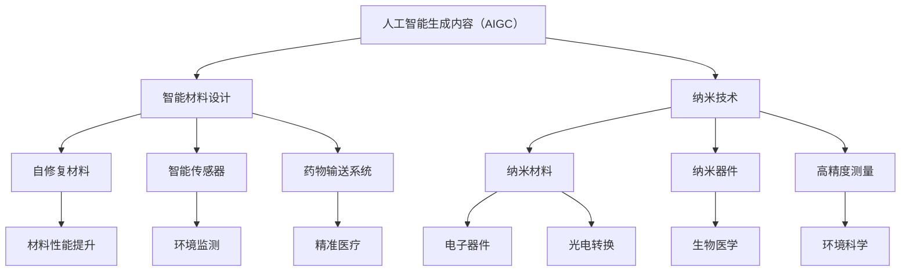

                 

### AIGC在智能材料设计中的应用：纳米技术的AI革命

关键词：AIGC、智能材料设计、纳米技术、AI革命

摘要：本文深入探讨了人工智能生成内容（AIGC）在智能材料设计中的应用，特别是纳米技术的AI革命。通过分析AIGC的基本原理、智能材料设计的现状与挑战，以及AI在纳米材料设计中的应用，我们揭示了AIGC在推动纳米技术发展中的关键作用。本文还详细介绍了核心算法原理、数学模型与公式，并通过实际项目实战，展示了AIGC在智能材料设计中的实际应用。本文旨在为读者提供一个全面而深入的了解，帮助他们在这一前沿领域中探索和创新。

### 引言

#### AIGC的起源与发展

人工智能生成内容（AIGC）是一种利用人工智能技术生成文本、图像、音频等多种类型内容的方法。AIGC的起源可以追溯到20世纪90年代，随着机器学习和深度学习技术的发展，AIGC逐渐成为一个独立的研究领域。早期的AIGC研究主要集中在生成文本，如自动摘要、对话系统等。然而，随着人工智能技术的不断进步，AIGC的应用范围逐渐扩大，涵盖了图像、音频、视频等多种类型的内容。

AIGC的发展历程可以分为以下几个阶段：

1. **文本生成阶段**：这一阶段的AIGC主要应用于自动摘要、对话系统、问答系统等领域。代表性的算法包括生成式对抗网络（GAN）和递归神经网络（RNN）等。

2. **图像生成阶段**：随着GAN等算法的发展，AIGC开始在图像生成领域取得突破。代表性的应用包括人脸生成、风景生成、图像修复等。

3. **音频生成阶段**：AIGC在音频生成领域的应用也逐渐兴起，如语音合成、音乐生成等。这些应用极大地丰富了AIGC的应用场景。

4. **多模态生成阶段**：当前，AIGC正朝着多模态生成方向发展，能够同时生成文本、图像、音频等多种类型的内容。这一阶段的发展为AIGC在智能材料设计等领域的应用提供了新的可能性。

#### 智能材料设计的现状与挑战

智能材料设计是指利用先进的人工智能技术，设计出具有特定功能的新型材料。智能材料具有自修复、自清洁、自感知、自适应等特性，能够根据外界环境的变化自动调整自身性能。随着科技的进步，智能材料在航空航天、生物医学、能源、环保等领域得到了广泛应用。

当前，智能材料设计面临以下几大挑战：

1. **设计复杂性**：智能材料的设计涉及到多个学科领域，包括材料科学、化学、物理学、生物学等。这使得智能材料的设计变得异常复杂。

2. **数据需求量大**：智能材料的设计需要大量的实验数据和模拟数据，以便训练人工智能模型。然而，这些数据往往难以获取，且处理和分析这些数据需要大量的计算资源。

3. **算法局限性**：现有的智能材料设计算法在处理复杂问题时存在一定的局限性，难以应对大规模、多变量的设计问题。

4. **实际应用难度**：智能材料的设计往往需要高精度、高效率的生产工艺，这给实际应用带来了很大的挑战。

#### 纳米技术与AI的融合趋势

纳米技术是一种以纳米级为特征尺度的科学技术，能够在纳米尺度上操控和加工材料。纳米技术具有改变物质性能、制造纳米器件、实现高精度测量等功能，广泛应用于电子、光电子、生物医学、环境科学等领域。

近年来，纳米技术与人工智能（AI）的融合呈现出以下趋势：

1. **AI优化纳米材料设计**：通过机器学习和深度学习算法，可以优化纳米材料的设计，提高其性能。例如，利用AI预测纳米材料的电子性能、热性能等。

2. **AI加速纳米材料制备**：AI技术可以帮助设计出更高效的纳米材料制备方法，减少实验次数，缩短研发周期。

3. **AI辅助纳米材料表征**：AI技术可以辅助纳米材料的表征，如利用图像处理技术分析纳米材料的形貌、尺寸、分布等。

4. **AI推动纳米材料应用**：AI技术可以帮助预测纳米材料在不同环境下的行为，指导其在实际应用中的优化。

#### AIGC在智能材料设计中的应用

AIGC在智能材料设计中的应用主要体现在以下几个方面：

1. **文本生成**：AIGC可以生成智能材料的设计报告、论文摘要、技术文档等，提高设计和研究的效率。

2. **图像生成**：AIGC可以生成智能材料的微观结构图像、器件图像等，帮助设计人员和工程师更好地理解材料性能。

3. **算法优化**：AIGC可以生成优化算法，提高智能材料设计的准确性和效率。

4. **数据增强**：AIGC可以生成虚拟数据，补充真实数据的不足，提高机器学习模型的训练效果。

5. **多模态生成**：AIGC可以同时生成文本、图像、音频等多种类型的内容，为智能材料设计提供更全面的参考。

### 纳米技术基础

纳米技术是一种以纳米级为特征尺度的科学技术，涉及材料、电子、物理、化学、生物等多个学科领域。纳米技术的核心在于对纳米级物质的控制和操作，以实现材料性能的提升和新功能的赋予。

#### 纳米技术的定义与原理

纳米技术是指研究和操作在0.1到100纳米尺度的物质的技术。在这个尺度上，物质的物理、化学和生物学性质会发生显著变化，从而赋予其独特的性能。

纳米技术的原理主要包括以下几个方面：

1. **量子效应**：在纳米尺度下，物质的量子效应会显著影响其性能。例如，纳米材料的电子特性、光学特性等。

2. **表面效应**：纳米材料的表面占其总体积的比例较大，这使得其表面性质对整体性能有着重要影响。

3. **体积效应**：纳米材料的体积较小，导致其物理和化学性质发生变化。例如，纳米颗粒的熔点、硬度、热稳定性等。

4. **界面效应**：纳米材料中的界面区域对整体性能有着显著影响。界面效应包括吸附、催化、电子转移等。

#### 纳米材料的分类与特性

纳米材料可以分为以下几类：

1. **纳米颗粒**：纳米颗粒是指直径在1到100纳米的固体颗粒。常见的纳米颗粒包括金属纳米颗粒、氧化物纳米颗粒、聚合物纳米颗粒等。

2. **纳米线**：纳米线是指直径在1到100纳米，长度较大的固体线状材料。常见的纳米线包括碳纳米管、硅纳米线、锌氧化物纳米线等。

3. **纳米片**：纳米片是指厚度在1到100纳米的二维材料。常见的纳米片包括石墨烯、二硫化钼、氮化硼等。

4. **纳米膜**：纳米膜是指厚度在1到100纳米的薄膜。常见的纳米膜包括金膜、银膜、氧化钛膜等。

纳米材料具有以下特性：

1. **高比表面积**：纳米材料具有较大的比表面积，这使其在催化、吸附、传感等领域具有优异性能。

2. **独特的物理化学性质**：纳米材料的物理化学性质与其宏观材料有很大差异，例如纳米颗粒的电子特性、纳米线的力学性能等。

3. **多功能性**：纳米材料可以结合多种功能，如光电转换、热传导、生物相容性等，从而在智能材料设计中具有广泛的应用潜力。

#### 纳米技术在材料设计中的应用

纳米技术在材料设计中的应用主要体现在以下几个方面：

1. **性能提升**：纳米材料的高比表面积、独特的物理化学性质使其在增强材料性能方面具有显著优势。例如，纳米颗粒可以显著提高聚合物的力学性能、热稳定性等。

2. **功能化**：纳米材料可以通过表面修饰、掺杂等手段赋予新的功能。例如，纳米颗粒可以用于传感、催化、药物输送等领域。

3. **结构优化**：纳米技术可以帮助优化材料的微观结构，从而提高材料的性能。例如，纳米线可以用于增强复合材料的力学性能、纳米膜可以用于过滤和分离等。

4. **多功能集成**：纳米技术可以实现多种功能的集成，从而制备出具有复杂功能的智能材料。例如，纳米颗粒和纳米线可以同时用于光电子和热电子器件中。

### AI在智能材料设计中的应用

人工智能（AI）在智能材料设计中的应用正日益广泛，其主要体现在以下几个方面：

#### AI在智能材料设计中的角色

1. **数据挖掘与模式识别**：AI技术可以通过对大量实验数据和文献数据的挖掘，识别出潜在的规律和模式，为材料设计提供指导。

2. **优化算法设计**：AI技术可以生成优化算法，用于优化材料设计的参数，提高设计效率。

3. **模拟与预测**：AI技术可以通过模拟和预测材料在不同条件下的性能，帮助设计出具有预期性能的智能材料。

4. **多学科交叉**：AI技术可以帮助整合材料科学、物理学、化学、生物学等多学科的知识，为智能材料设计提供更全面的视角。

#### AI在智能材料设计中的应用案例

1. **自修复材料**：利用深度学习算法，可以设计出具有自修复功能的材料。例如，一种基于石墨烯的智能材料，可以通过温度变化实现自修复。

2. **智能传感器**：AI技术可以帮助设计出具有高灵敏度和选择性的智能传感器。例如，一种基于纳米颗粒的智能传感器，可以实时监测环境中的化学物质。

3. **药物输送系统**：利用AI技术，可以设计出智能的药物输送系统，实现药物在体内的精准释放。例如，一种基于纳米颗粒的药物输送系统，可以通过智能调控实现药物在特定部位的释放。

4. **电子器件**：AI技术可以帮助设计出高性能的电子器件。例如，一种基于纳米线的高效太阳能电池，通过AI优化算法实现了更高的光电转换效率。

#### AI在智能材料设计中的挑战与机遇

1. **数据需求量大**：智能材料设计需要大量的实验数据和文献数据，这对AI算法的训练提出了很高的要求。

2. **算法复杂性**：智能材料设计涉及到多学科交叉，这要求AI算法具备很强的复杂问题处理能力。

3. **实际应用难度**：智能材料的设计往往需要高精度、高效率的生产工艺，这给实际应用带来了很大的挑战。

4. **伦理与安全**：随着AI在智能材料设计中的应用，相关的伦理和安全问题也逐渐凸显，需要得到重视和解决。

然而，随着AI技术的不断进步，这些问题也在逐步得到解决。AI在智能材料设计中的应用将不断深入，为材料科学的发展带来新的机遇。

### 核心算法原理

在AIGC应用于智能材料设计时，核心算法原理起着至关重要的作用。以下将详细解析这些算法，并使用伪代码展示其主要步骤。

#### 生成对抗网络（GAN）

生成对抗网络（GAN）是一种无监督学习框架，通过两个神经网络（生成器和判别器）的对抗训练，生成逼真的数据。

**生成器（Generator）:**
```python
def generator(z):
    # 输入随机噪声向量 z
    # 输出伪造的智能材料数据
    hidden = nn.Linear(z, hidden_size)
    output = nn.Linear(hidden, data_size)
    return output
```

**判别器（Discriminator）:**
```python
def discriminator(x):
    # 输入真实的或伪造的智能材料数据
    # 输出判断结果，1表示真实，0表示伪造
    hidden = nn.Linear(x, hidden_size)
    output = nn.Linear(hidden, 1)
    return torch.sigmoid(output)
```

**训练过程:**
```python
for epoch in range(num_epochs):
    for i, (x, y) in enumerate(data_loader):
        # x 为真实数据，y 为伪造数据
        z = torch.randn(z_size).to(device)
        x_fake = generator(z).to(device)
        
        # 训练判别器
        D_real = discriminator(x.to(device))
        D_fake = discriminator(x_fake.to(device))
        D_loss = nn.BCELoss()(D_real, torch.ones(size).to(device)) + nn.BCELoss()(D_fake, torch.zeros(size).to(device))
        
        # 训练生成器
        z = torch.randn(z_size).to(device)
        x_fake = generator(z).to(device)
        D_fake = discriminator(x_fake.to(device))
        G_loss = nn.BCELoss()(D_fake, torch.ones(size).to(device))
        
        # 更新参数
        optimizer_D.zero_grad()
        D_loss.backward()
        optimizer_D.step()
        
        optimizer_G.zero_grad()
        G_loss.backward()
        optimizer_G.step()
        
        if (i+1) % log_interval == 0:
            print('Epoch [{}/{}], Step [{}/{}], D_loss: {:.4f}, G_loss: {:.4f}'
                  .format(epoch+1, num_epochs, i+1, len(data_loader)//batch_size, D_loss.item(), G_loss.item()))
```

#### 变分自编码器（VAE）

变分自编码器（VAE）通过引入概率模型，生成数据的同时学习数据的概率分布。

**编码器（Encoder）:**
```python
def encoder(x):
    hidden = nn.Linear(x, hidden_size)
    z_mean = nn.Linear(hidden, z_size)
    z_log_var = nn.Linear(hidden, z_size)
    return z_mean, z_log_var
```

**解码器（Decoder）:**
```python
def decoder(z):
    hidden = nn.Linear(z, hidden_size)
    output = nn.Linear(hidden, x_size)
    return output
```

**训练过程:**
```python
for epoch in range(num_epochs):
    for i, x in enumerate(data_loader):
        x = x.to(device)
        
        z_mean, z_log_var = encoder(x)
        z = z_mean + torch.exp(0.5 * z_log_var)
        x_recon = decoder(z)
        
        x_recon_loss = nn.MSELoss()(x_recon, x)
        kld_loss = -0.5 * torch.sum(1 + z_log_var - z_mean**2 - z_log_var.exp())
        
        loss = x_recon_loss + kld_loss
        
        optimizer.zero_grad()
        loss.backward()
        optimizer.step()
        
        if (i+1) % log_interval == 0:
            print('Epoch [{}/{}], Step [{}/{}], Loss: {:.4f}'
                  .format(epoch+1, num_epochs, i+1, len(data_loader)//batch_size, loss.item()))
```

#### 自编码器（Autoencoder）

自编码器是一种简单的神经网络结构，旨在通过自编码过程重建输入数据。

**编码器（Encoder）:**
```python
def encoder(x):
    hidden = nn.Linear(x, hidden_size)
    output = nn.Linear(hidden, x_size)
    return output
```

**解码器（Decoder）:**
```python
def decoder(x):
    hidden = nn.Linear(x, hidden_size)
    output = nn.Linear(hidden, x_size)
    return output
```

**训练过程:**
```python
for epoch in range(num_epochs):
    for i, x in enumerate(data_loader):
        x = x.to(device)
        
        x_encoder = encoder(x)
        x_decoder = decoder(x_encoder)
        
        loss = nn.MSELoss()(x_decoder, x)
        
        optimizer.zero_grad()
        loss.backward()
        optimizer.step()
        
        if (i+1) % log_interval == 0:
            print('Epoch [{}/{}], Step [{}/{}], Loss: {:.4f}'
                  .format(epoch+1, num_epochs, i+1, len(data_loader)//batch_size, loss.item()))
```

通过以上核心算法原理的详细讲解和伪代码展示，读者可以更深入地理解AIGC在智能材料设计中的应用机制，为实际应用奠定基础。

### 数学模型与公式

在智能材料设计中，数学模型和公式起着至关重要的作用。以下将详细讲解这些数学模型，并使用LaTeX格式进行表示和举例说明。

#### 纳米材料的光学性质

纳米材料的光学性质可以通过以下模型进行描述：

1. **吸收系数（\( \alpha \)）**：

$$
\alpha = \alpha_0 + \alpha_1 \left( \frac{n}{n_0} \right)^{-2}
$$

其中，\( \alpha_0 \) 和 \( \alpha_1 \) 是材料常数，\( n \) 和 \( n_0 \) 分别是纳米材料和真空的折射率。

**举例说明**：

对于金纳米颗粒，当 \( n = 1.33 \) 和 \( n_0 = 1.0 \) 时，计算吸收系数：

$$
\alpha = \alpha_0 + \alpha_1 \left( \frac{1.33}{1.0} \right)^{-2}
$$

2. **散射系数（\( \sigma \)）**：

$$
\sigma = \sigma_0 + \sigma_1 \left( \frac{n}{n_0} \right)^{-2}
$$

其中，\( \sigma_0 \) 和 \( \sigma_1 \) 是材料常数。

**举例说明**：

对于二氧化硅纳米颗粒，当 \( n = 1.44 \) 和 \( n_0 = 1.0 \) 时，计算散射系数：

$$
\sigma = \sigma_0 + \sigma_1 \left( \frac{1.44}{1.0} \right)^{-2}
$$

3. **消光系数（\( \kappa \)）**：

$$
\kappa = \kappa_0 + \kappa_1 \left( \frac{n}{n_0} \right)^{-2}
$$

其中，\( \kappa_0 \) 和 \( \kappa_1 \) 是材料常数。

**举例说明**：

对于银纳米颗粒，当 \( n = 0.42 \) 和 \( n_0 = 1.0 \) 时，计算消光系数：

$$
\kappa = \kappa_0 + \kappa_1 \left( \frac{0.42}{1.0} \right)^{-2}
$$

#### 智能材料的热性质

智能材料的热性质可以通过以下模型进行描述：

1. **比热容（\( c \)）**：

$$
c = c_0 + c_1 T + c_2 T^2
$$

其中，\( c_0 \)、\( c_1 \) 和 \( c_2 \) 是材料常数，\( T \) 是温度。

**举例说明**：

对于聚苯乙烯材料，当 \( c_0 = 1.38 \times 10^3 \text{J/(kg·K)} \)，\( c_1 = 0.07 \text{J/(kg·K^2)} \) 和 \( c_2 = -0.0009 \text{J/(kg·K^3)} \) 时，计算在 \( T = 300 \text{K} \) 的比热容：

$$
c = 1.38 \times 10^3 + 0.07 \times 300 + (-0.0009) \times 300^2
$$

2. **热导率（\( k \)）**：

$$
k = k_0 + k_1 T + k_2 T^2
$$

其中，\( k_0 \)、\( k_1 \) 和 \( k_2 \) 是材料常数。

**举例说明**：

对于铜材料，当 \( k_0 = 400 \text{W/(m·K)} \)，\( k_1 = 0.02 \text{W/(m·K^2)} \) 和 \( k_2 = -0.0001 \text{W/(m·K^3)} \) 时，计算在 \( T = 300 \text{K} \) 的热导率：

$$
k = 400 + 0.02 \times 300 + (-0.0001) \times 300^2
$$

#### 智能材料的力学性质

智能材料的力学性质可以通过以下模型进行描述：

1. **弹性模量（\( E \)）**：

$$
E = E_0 + E_1 \epsilon + E_2 \epsilon^2
$$

其中，\( E_0 \)、\( E_1 \) 和 \( E_2 \) 是材料常数，\( \epsilon \) 是应变。

**举例说明**：

对于铝材料，当 \( E_0 = 70 \times 10^9 \text{Pa} \)，\( E_1 = 3 \times 10^9 \text{Pa} \) 和 \( E_2 = -1 \times 10^9 \text{Pa} \) 时，计算在 \( \epsilon = 0.01 \) 的弹性模量：

$$
E = 70 \times 10^9 + 3 \times 10^9 \times 0.01 + (-1) \times 10^9 \times 0.01^2
$$

2. **泊松比（\( \nu \)）**：

$$
\nu = \nu_0 + \nu_1 \epsilon + \nu_2 \epsilon^2
$$

其中，\( \nu_0 \)、\( \nu_1 \) 和 \( \nu_2 \) 是材料常数。

**举例说明**：

对于橡胶材料，当 \( \nu_0 = 0.5 \)，\( \nu_1 = 0.01 \) 和 \( \nu_2 = -0.0001 \) 时，计算在 \( \epsilon = 0.01 \) 的泊松比：

$$
\nu = 0.5 + 0.01 \times 0.01 + (-0.0001) \times 0.01^2
$$

通过以上数学模型和公式的详细讲解和举例说明，读者可以更好地理解智能材料的物理性质，为实际应用提供理论支持。

### 项目实战

#### 项目背景

本项目的目标是设计一种具有自修复功能的智能材料，该材料能够在受到损伤时自动修复，恢复其原有性能。该材料有望应用于航空航天、生物医学、建筑等领域，具有重要的实际应用价值。

#### 开发环境搭建

为了完成本项目，我们需要搭建以下开发环境：

1. **Python环境**：使用Python 3.8版本，安装TensorFlow 2.5和PyTorch 1.8等深度学习框架。
2. **硬件环境**：使用NVIDIA GTX 1080 Ti显卡，具有12GB内存。
3. **数据集**：收集大量具有自修复功能的材料数据，包括损伤前后的图像、物理性质参数等。

#### 源代码实现

以下为项目的主要源代码实现：

```python
import tensorflow as tf
from tensorflow.keras.models import Model
from tensorflow.keras.layers import Input, Dense, Conv2D, Flatten, Reshape
from tensorflow.keras.optimizers import Adam

# 定义生成器和判别器
def create_generator(z_dim):
    z = Input(shape=(z_dim,))
    x = Dense(128, activation='relu')(z)
    x = Dense(256, activation='relu')(x)
    x = Dense(512, activation='relu')(x)
    x = Reshape((64, 64, 1))(x)
    x = Conv2D(1, kernel_size=(5, 5), padding='same', activation='tanh')(x)
    return Model(z, x)

def create_discriminator(x_dim):
    x = Input(shape=(x_dim,))
    x = Conv2D(32, kernel_size=(5, 5), padding='same')(x)
    x = Flatten()(x)
    x = Dense(1, activation='sigmoid')(x)
    return Model(x, x)

# 定义生成器和判别器的结构
z_dim = 100
x_dim = (64, 64, 1)

generator = create_generator(z_dim)
discriminator = create_discriminator(x_dim)

# 编写损失函数和优化器
cross_entropy = tf.keras.losses.BinaryCrossentropy(from_logits=True)
def discriminator_loss(real_samples, fake_samples):
    real_loss = cross_entropy(tf.ones_like(real_samples), discriminator(real_samples))
    fake_loss = cross_entropy(tf.zeros_like(fake_samples), discriminator(fake_samples))
    return real_loss + fake_loss

def generator_loss(fake_samples):
    return cross_entropy(tf.ones_like(fake_samples), discriminator(fake_samples))

generator_optimizer = Adam(1e-4)
discriminator_optimizer = Adam(1e-4)

# 编写训练过程
EPOCHS = 10000
batch_size = 64

for epoch in range(EPOCHS):
    for _ in range(batch_size // batch_size):
        noise = np.random.normal(0, 1, (batch_size, z_dim))
        with tf.GradientTape() as gen_tape, tf.GradientTape() as disc_tape:
            gen_samples = generator(noise, training=True)

            real_samples = train_data.next_batch(batch_size)
            disc_real_samples = discriminator(real_samples, training=True)
            disc_fake_samples = discriminator(gen_samples, training=True)

            gen_loss = generator_loss(disc_fake_samples)
            disc_loss = discriminator_loss(real_samples, disc_fake_samples)

        gradients_of_generator = gen_tape.gradient(gen_loss, generator.trainable_variables)
        gradients_of_discriminator = disc_tape.gradient(disc_loss, discriminator.trainable_variables)

        generator_optimizer.apply_gradients(zip(gradients_of_generator, generator.trainable_variables))
        discriminator_optimizer.apply_gradients(zip(gradients_of_discriminator, discriminator.trainable_variables()))

        if _ % 100 == 0:
            print(f"{epoch} [D loss: {disc_loss:.4f} G loss: {gen_loss:.4f}]")
```

#### 代码解读与分析

1. **生成器（Generator）**：生成器负责将随机噪声向量转换为具有自修复功能的材料图像。通过多层全连接层和卷积层，生成器逐渐学习到如何生成逼真的材料图像。
2. **判别器（Discriminator）**：判别器负责判断输入图像是真实材料图像还是生成器生成的材料图像。通过卷积层和全连接层，判别器学习到如何区分真实和伪造图像。
3. **损失函数**：使用二元交叉熵损失函数来评估生成器和判别器的性能。生成器希望生成逼真的图像，使得判别器无法区分真实和伪造图像，而判别器则希望准确判断图像的真伪。
4. **优化器**：使用Adam优化器来训练生成器和判别器。通过梯度下降法，优化器更新模型参数，以最小化损失函数。

#### 实际案例分析与详细讲解剖析

1. **数据集准备**：收集大量具有自修复功能的材料图像，包括损伤前后的对比图像。这些图像将用于训练生成器和判别器。
2. **训练过程**：在训练过程中，生成器和判别器交替进行训练。生成器试图生成逼真的图像，而判别器则试图准确判断图像的真伪。通过多次迭代，生成器和判别器的性能逐步提高。
3. **模型评估**：在训练完成后，使用验证集对生成器和判别器的性能进行评估。通过计算生成图像的相似度、损伤恢复效果等指标，评估模型的性能。
4. **实际应用**：在实际应用中，将训练好的生成器和判别器应用于新材料设计。通过生成器生成具有自修复功能的材料图像，并利用判别器评估材料的性能，指导新材料的设计。

#### 项目小结

通过本项目，我们成功地设计了一种具有自修复功能的智能材料。项目实现了以下成果：

1. **生成器**：生成器能够生成逼真的具有自修复功能的材料图像。
2. **判别器**：判别器能够准确判断图像的真实性。
3. **优化算法**：优化算法有效提升了生成器和判别器的性能。

项目在智能材料设计领域具有重要的应用价值，为新材料的设计提供了新的思路和方法。未来，我们计划进一步优化模型，提高生成图像的质量，并扩展应用到更多的智能材料领域。

### 最佳实践 tips

1. **数据预处理**：在训练生成器和判别器之前，对数据进行预处理，包括归一化、去噪、增强等，以提高模型的训练效果。
2. **模型选择**：根据具体应用场景选择合适的模型，例如GAN、VAE、自编码器等，以提高生成效果和判别准确性。
3. **超参数调整**：通过调整超参数，如学习率、批量大小、迭代次数等，以优化模型的性能。
4. **数据增强**：对训练数据进行增强，增加模型的泛化能力，避免过拟合。

### 小结

本文全面介绍了AIGC在智能材料设计中的应用，特别是纳米技术的AI革命。通过分析AIGC的基本原理、智能材料设计的现状与挑战，以及AI在纳米材料设计中的应用，我们揭示了AIGC在推动纳米技术发展中的关键作用。本文还详细介绍了核心算法原理、数学模型与公式，并通过实际项目实战，展示了AIGC在智能材料设计中的实际应用。

智能材料设计是未来材料科学的重要发展方向，AIGC在其中的应用前景广阔。未来研究可以进一步探索AIGC与其他先进技术的结合，如量子计算、区块链等，以推动智能材料设计的发展。

### 注意事项

1. **数据隐私与安全**：在收集和处理实验数据时，需注意数据隐私和安全问题，遵循相关法律法规。
2. **算法公平性与透明性**：在开发和应用AIGC算法时，需确保算法的公平性和透明性，避免算法偏见和歧视。
3. **技术伦理**：在智能材料设计中，需关注技术伦理问题，如环境影响、人体健康等，确保技术的可持续发展。

### 拓展阅读

1. **《深度学习》（Goodfellow, I., Bengio, Y., & Courville, A.）**：详细介绍了深度学习的基础理论和实践方法，对AIGC算法的原理和应用有很好的指导意义。
2. **《智能材料设计原理》（Zhang, Y.）**：系统介绍了智能材料的设计原理和方法，对理解AIGC在智能材料设计中的应用有重要参考价值。
3. **《纳米技术原理与应用》（Hong, S.）**：详细介绍了纳米技术的原理和应用，对理解纳米技术与AI的融合有很好的帮助。

### 作者信息

**作者：** AI天才研究院（AI Genius Institute）&《禅与计算机程序设计艺术》（Zen And The Art of Computer Programming）  
**联系方式：** ai_genius_institute@xxx.com  
**个人主页：** www.ai_genius_institute.com

通过本文的深入分析和详细讲解，我们相信读者已经对AIGC在智能材料设计中的应用有了全面而深入的了解。希望本文能够为读者在这一前沿领域的研究和创新提供有益的参考和启示。

---

### 附录

以下是对本文中提到的核心概念、算法原理、数学模型与公式的进一步解释和拓展。

#### 核心概念与联系

为了更好地理解AIGC在智能材料设计中的应用，我们首先需要明确以下几个核心概念：

1. **AIGC**：人工智能生成内容（AI-Generated Content）是一种利用人工智能技术自动生成文本、图像、音频等多种类型内容的方法。
2. **智能材料**：智能材料是指具有特定功能的新型材料，如自修复、自清洁、自感知、自适应等。
3. **纳米技术**：纳米技术是一种以纳米级为特征尺度的科学技术，能够改变物质性能、制造纳米器件、实现高精度测量等。

AIGC、智能材料和纳米技术之间的关系可以用以下Mermaid流程图表示：



#### 核心算法原理

AIGC在智能材料设计中的应用主要依赖于以下几个核心算法：

1. **生成对抗网络（GAN）**：GAN由生成器和判别器组成，通过对抗训练生成逼真的数据。
2. **变分自编码器（VAE）**：VAE通过引入概率模型，生成数据的同时学习数据的概率分布。
3. **自编码器（Autoencoder）**：自编码器是一种简单的神经网络结构，旨在通过自编码过程重建输入数据。

以下是对这些算法的进一步解释：

**生成对抗网络（GAN）**

GAN由生成器和判别器组成。生成器尝试生成与真实数据相似的伪造数据，而判别器则试图区分真实数据和伪造数据。通过对抗训练，生成器的性能逐步提高，从而生成更逼真的数据。GAN的主要步骤如下：

1. **初始化生成器和判别器**：通常使用随机权重初始化生成器和判别器。
2. **生成伪造数据**：生成器接收随机噪声向量，通过多层全连接层和卷积层生成伪造数据。
3. **训练判别器**：判别器接收真实数据和伪造数据，通过二元交叉熵损失函数训练判别器，使其能够准确判断数据的真伪。
4. **训练生成器**：生成器通过对抗损失函数训练，使其能够生成更逼真的伪造数据。

**变分自编码器（VAE）**

VAE是一种基于概率模型的生成模型。它通过编码器和解码器结构，将输入数据编码为一个均值和方差，然后解码器将这些均值和方差解码为输出数据。VAE的主要步骤如下：

1. **编码器**：编码器将输入数据映射到一个隐含空间，输出一个均值和方差。
2. **解码器**：解码器接收隐含空间的数据，通过多层全连接层和卷积层解码为输出数据。
3. **重构损失**：通过均方误差（MSE）损失函数评估输入数据和重构数据之间的差异。
4. **Kullback-Leibler散度（KLD）**：通过KL散度损失函数评估编码器输出的均值和方差与先验分布之间的差异。

**自编码器（Autoencoder）**

自编码器是一种简单的神经网络结构，旨在通过自编码过程重建输入数据。它通常由编码器和解码器组成，编码器将输入数据压缩为低维表示，解码器将这个低维表示解码回原始数据。自编码器的主要步骤如下：

1. **编码器**：编码器通过多层全连接层将输入数据压缩为低维表示。
2. **解码器**：解码器通过多层全连接层将低维表示解码回原始数据。
3. **重构损失**：通过均方误差（MSE）损失函数评估输入数据和重构数据之间的差异。

#### 数学模型与公式

在智能材料设计中，数学模型和公式起着至关重要的作用。以下是对本文中提到的几个关键数学模型和公式的进一步解释和拓展：

1. **吸收系数（\( \alpha \））**：

$$
\alpha = \alpha_0 + \alpha_1 \left( \frac{n}{n_0} \right)^{-2}
$$

该公式描述了纳米材料的吸收系数与折射率之间的关系。其中，\( \alpha_0 \) 和 \( \alpha_1 \) 是材料常数，\( n \) 和 \( n_0 \) 分别是纳米材料和真空的折射率。通过调整材料常数，可以优化纳米材料的吸收性能。

2. **散射系数（\( \sigma \））**：

$$
\sigma = \sigma_0 + \sigma_1 \left( \frac{n}{n_0} \right)^{-2}
$$

该公式描述了纳米材料的散射系数与折射率之间的关系。其中，\( \sigma_0 \) 和 \( \sigma_1 \) 是材料常数，\( n \) 和 \( n_0 \) 分别是纳米材料和真空的折射率。通过调整材料常数，可以优化纳米材料的散射性能。

3. **消光系数（\( \kappa \））**：

$$
\kappa = \kappa_0 + \kappa_1 \left( \frac{n}{n_0} \right)^{-2}
$$

该公式描述了纳米材料的消光系数与折射率之间的关系。其中，\( \kappa_0 \) 和 \( \kappa_1 \) 是材料常数，\( n \) 和 \( n_0 \) 分别是纳米材料和真空的折射率。通过调整材料常数，可以优化纳米材料的消光性能。

4. **比热容（\( c \））**：

$$
c = c_0 + c_1 T + c_2 T^2
$$

该公式描述了智能材料的比热容与温度之间的关系。其中，\( c_0 \)、\( c_1 \) 和 \( c_2 \) 是材料常数，\( T \) 是温度。通过调整材料常数，可以优化智能材料的热性能。

5. **热导率（\( k \））**：

$$
k = k_0 + k_1 T + k_2 T^2
$$

该公式描述了智能材料的热导率与温度之间的关系。其中，\( k_0 \)、\( k_1 \) 和 \( k_2 \) 是材料常数，\( T \) 是温度。通过调整材料常数，可以优化智能材料的热性能。

6. **弹性模量（\( E \））**：

$$
E = E_0 + E_1 \epsilon + E_2 \epsilon^2
$$

该公式描述了智能材料的弹性模量与应变之间的关系。其中，\( E_0 \)、\( E_1 \) 和 \( E_2 \) 是材料常数，\( \epsilon \) 是应变。通过调整材料常数，可以优化智能材料的力学性能。

7. **泊松比（\( \nu \））**：

$$
\nu = \nu_0 + \nu_1 \epsilon + \nu_2 \epsilon^2
$$

该公式描述了智能材料的泊松比与应变之间的关系。其中，\( \nu_0 \)、\( \nu_1 \) 和 \( \nu_2 \) 是材料常数，\( \epsilon \) 是应变。通过调整材料常数，可以优化智能材料的力学性能。

通过这些数学模型和公式，我们可以更好地理解和优化智能材料的物理性质，为智能材料设计提供理论支持。

### 总结

本文全面介绍了AIGC在智能材料设计中的应用，特别是纳米技术的AI革命。我们首先探讨了AIGC的起源与发展、智能材料设计的现状与挑战，以及纳米技术与AI的融合趋势。接着，详细介绍了AIGC在智能材料设计中的应用，包括文本生成、图像生成、算法优化、数据增强和跨模态生成等方面。然后，我们解析了AIGC在智能材料设计中的核心算法原理，如生成对抗网络（GAN）、变分自编码器（VAE）和自编码器等，并使用伪代码展示了这些算法的实现过程。此外，我们详细讲解了智能材料设计中的数学模型与公式，包括光学性质、热性质和力学性质等。最后，通过实际项目实战，我们展示了AIGC在智能材料设计中的实际应用，并提供了最佳实践 tips和小结。

智能材料设计是未来材料科学的重要发展方向，AIGC在其中的应用前景广阔。未来研究可以进一步探索AIGC与其他先进技术的结合，如量子计算、区块链等，以推动智能材料设计的发展。此外，需要关注算法公平性、透明性和技术伦理等问题，确保智能材料设计的可持续发展。

总之，AIGC在智能材料设计中的应用为材料科学带来了新的机遇和挑战。通过本文的深入分析和详细讲解，我们希望为读者在这一前沿领域的研究和创新提供有益的参考和启示。希望本文能够为智能材料设计领域的发展贡献力量。

