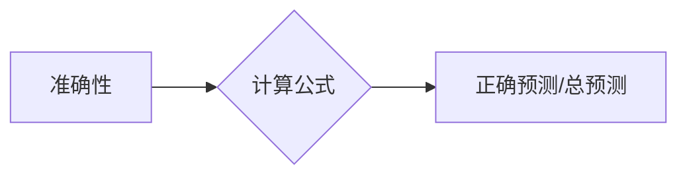
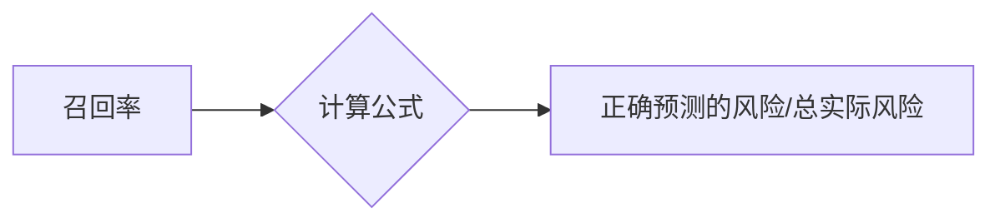
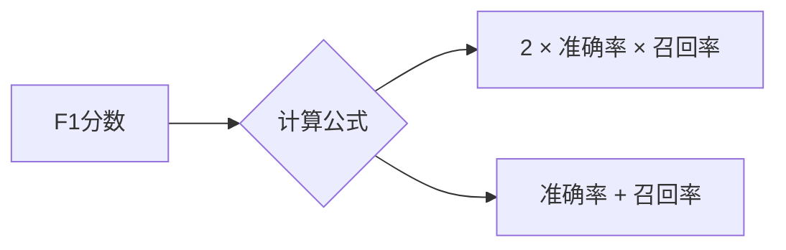
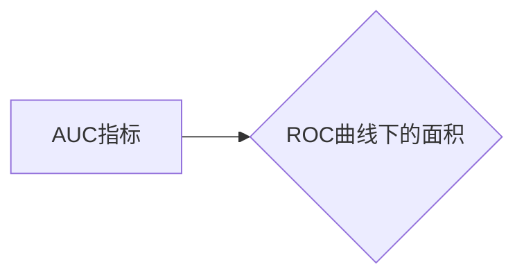
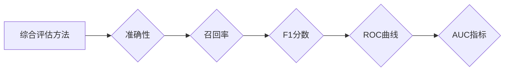

                 

### 文章标题

《AIGC在智能海啸预警系统中的应用：提高沿海地区安全性》

### 关键词

- AIGC（人工智能生成内容）
- 智能海啸预警系统
- 沿海地区安全性
- 深度学习
- 数据预处理
- 算法优化

### 摘要

本文旨在探讨AIGC（人工智能生成内容）在智能海啸预警系统中的应用，以提高沿海地区的安全性。文章首先介绍了AIGC技术的背景和发展现状，随后详细分析了智能海啸预警系统的原理和架构。接着，文章重点介绍了AIGC技术在数据预处理、算法优化和预警结果分析中的应用，通过具体的案例展示了AIGC技术的优势。最后，文章对海啸预警系统的性能评估方法进行了探讨，并展望了未来海啸预警系统的发展趋势。本文为科研人员、技术工程师以及关注海啸预警系统的读者提供了有价值的参考。

## 引言

### AIGC与智能海啸预警系统的背景

随着全球气候变化和自然灾害的频发，沿海地区的安全性问题愈发突出。海啸作为一种破坏力极强的自然灾害，往往给沿海地区带来巨大的生命和财产损失。因此，建立高效、准确的智能海啸预警系统，对于提高沿海地区安全性具有重要意义。

近年来，人工智能（AI）技术的发展为海啸预警系统带来了新的机遇。特别是AIGC（人工智能生成内容）技术的出现，使得数据预处理、算法优化和结果分析等环节的效率大幅提升。AIGC是一种利用AI技术生成数据、模型和内容的方法，其核心在于通过对海量数据的自动处理和分析，生成新的数据或改进现有模型。这种技术在海啸预警系统中具有广泛的应用前景。

智能海啸预警系统是一种基于大数据和人工智能技术的综合预警系统，能够实时监测海洋环境数据，快速识别海啸风险，并发布预警信息。传统的海啸预警系统主要依赖于地震仪、海啸监测站等硬件设备，数据采集和处理效率较低。而随着AIGC技术的发展，海啸预警系统在数据处理、算法优化和预警结果分析等方面得到了显著提升，从而提高了预警的准确性和时效性。

本文旨在探讨AIGC在智能海啸预警系统中的应用，通过分析AIGC技术的基础知识、智能海啸预警系统的原理和架构，以及AIGC在系统中的应用实例，为科研人员和技术工程师提供有价值的参考。同时，本文也对海啸预警系统的性能评估方法进行了探讨，并展望了未来海啸预警系统的发展趋势。

### 书籍的目标与结构

本书的目标是为科研人员和技术工程师提供关于AIGC在智能海啸预警系统中的应用的全面、深入的理论和实践指导。具体而言，本书旨在实现以下几个目标：

1. **介绍AIGC技术的基础知识**：通过阐述AIGC的定义、发展历程和核心技术，帮助读者建立对AIGC技术的系统认识。

2. **分析智能海啸预警系统的原理和架构**：详细解释智能海啸预警系统的基本原理、架构设计以及主要组成部分，使读者对系统有全面的理解。

3. **探讨AIGC在智能海啸预警系统中的应用**：通过实例分析AIGC在数据预处理、算法优化和预警结果分析中的应用，展示AIGC技术在实际系统中的优势。

4. **评估海啸预警系统的性能**：介绍海啸预警系统的性能评估方法，并通过实际案例进行分析，评估系统的效果和改进空间。

5. **展望未来发展趋势**：分析当前海啸预警系统面临的技术挑战和发展趋势，为未来系统的研究和改进提供参考。

为了实现上述目标，本书结构分为四个主要部分：

- **第1部分：AIGC技术基础**，包括AIGC技术概述、核心算法和技术优势与挑战。

- **第2部分：智能海啸预警系统**，涵盖海啸预警系统的原理与架构、数据处理和算法模型。

- **第3部分：AIGC在智能海啸预警系统中的应用**，探讨AIGC在数据预处理、算法优化和预警结果分析中的应用。

- **第4部分：性能评估与实际应用**，包括海啸预警系统的性能评估方法、实际应用案例和未来发展趋势。

通过以上结构和内容的安排，本书力求为读者提供一本既有理论深度又有实践价值的著作，助力智能海啸预警系统的研发和改进。

## 第1部分：AIGC技术基础

### 第1章：AIGC技术概述

#### AIGC的定义

AIGC，全称为人工智能生成内容（Artificial Intelligence Generated Content），是一种利用人工智能技术自动生成内容的方法。它通过深度学习模型，对海量数据进行训练和学习，从而能够生成文本、图像、音频等多种形式的内容。AIGC技术不仅能够模仿人类的创作能力，还能够根据特定需求和场景进行自适应的生成，具有广泛的应用前景。

#### AIGC的发展历程

AIGC技术起源于20世纪80年代，随着人工智能技术的不断发展，AIGC逐渐从理论走向实践。1990年代，生成对抗网络（GAN）的提出标志着AIGC技术的一个重要里程碑。GAN通过对抗生成器和判别器的训练，实现了高质量图像的生成。此后，变分自编码器（VAE）、自编码器（AE）等模型相继出现，进一步丰富了AIGC技术的应用场景。

进入21世纪，随着深度学习技术的快速发展，AIGC技术得到了更加广泛的应用。特别是在文本生成、图像生成、视频生成等领域，AIGC技术取得了显著成果。例如，OpenAI的GPT模型、谷歌的Generative Adversarial Network（GAN）模型等，都是AIGC技术的典型应用案例。

#### AIGC的核心技术

AIGC技术的主要核心技术包括生成对抗网络（GAN）、变分自编码器（VAE）和自编码器（AE）等。

1. **生成对抗网络（GAN）**

GAN由生成器（Generator）和判别器（Discriminator）两部分组成。生成器的任务是根据随机噪声生成类似于真实数据的内容；判别器的任务是区分生成器和真实数据。通过对抗训练，生成器不断优化生成的数据质量，判别器则不断提高对真实数据和生成数据的鉴别能力。

2. **变分自编码器（VAE）**

VAE是一种概率生成模型，通过编码器（Encoder）和解码器（Decoder）实现数据的生成。编码器将输入数据映射到一个低维的隐变量空间，解码器则从隐变量空间生成原始数据。VAE通过最大化数据分布的KL散度来优化模型。

3. **自编码器（AE）**

AE是一种无监督学习模型，通过训练一个编码器和解码器，将输入数据编码为低维表示，然后解码回原始数据。AE的目标是最小化输入数据和重构数据之间的差异。

#### AIGC的技术优势与挑战

AIGC技术具有以下优势：

1. **高效生成**：AIGC技术能够快速生成高质量的内容，大大提高了生产效率。
2. **自适应性强**：AIGC可以根据不同的需求和场景进行自适应的生成，具有较强的灵活性。
3. **多样化应用**：AIGC技术可以应用于文本、图像、音频等多种形式的内容生成，具有广泛的应用前景。

然而，AIGC技术也面临一些挑战：

1. **数据依赖**：AIGC技术依赖于大量的高质量数据，数据不足或质量不佳会影响生成效果。
2. **计算资源需求**：AIGC技术通常需要大量的计算资源，对硬件设施要求较高。
3. **模型可靠性**：生成的内容可能存在不确定性和偏差，需要进一步验证和优化。

综上所述，AIGC技术作为一种新兴的人工智能技术，具有广泛的应用前景，但同时也需要克服一系列技术挑战。

### 第2章：AIGC的核心算法

#### 生成对抗网络（GAN）

生成对抗网络（GAN）是AIGC技术中最为重要的核心算法之一。GAN由生成器（Generator）和判别器（Discriminator）两部分组成，通过对抗训练实现高质量数据的生成。

1. **生成器（Generator）**

生成器的任务是生成类似于真实数据的假数据。通常，生成器接收一个随机噪声向量作为输入，通过一系列的神经网络变换生成假数据。生成器的目标是使其生成的数据尽可能接近真实数据，从而骗过判别器。

2. **判别器（Discriminator）**

判别器的任务是判断输入数据是真实数据还是生成器生成的假数据。判别器接收输入数据，通过一系列的神经网络变换输出一个概率值，表示输入数据的真实程度。判别器的目标是尽可能准确地区分真实数据和生成数据。

3. **对抗训练**

GAN的训练过程是通过对抗训练实现的。在训练过程中，生成器和判别器交替进行训练。生成器不断优化生成的假数据，使其更接近真实数据；判别器则不断优化对真实数据和生成数据的鉴别能力。通过这种对抗训练，生成器逐渐提高生成数据的质量，判别器逐渐提高鉴别能力。

4. **GAN的训练过程伪代码**

```python
# 初始化生成器和判别器
G = Generator()
D = Discriminator()

# 设置超参数
batch_size = 64
epochs = 100
learning_rate = 0.0001

# GAN的训练过程
for epoch in range(epochs):
    for i in range(num_batches):
        # 随机生成噪声向量
        z = np.random.normal(0, 1, (batch_size, z_dim))
        
        # 生成假数据
        fake_data = G(z)
        
        # 计算判别器的损失
        real_data = data[i * batch_size:(i + 1) * batch_size]
        real_score = D(real_data)
        fake_score = D(fake_data)
        d_loss = -np.mean(np.log(real_score) + np.log(1 - fake_score))
        
        # 计算生成器的损失
        g_loss = np.mean(np.log(1 - fake_score))
        
        # 更新判别器参数
        D.optimizer.zero_grad()
        d_loss.backward()
        D.optimizer.step()
        
        # 更新生成器参数
        G.optimizer.zero_grad()
        g_loss.backward()
        G.optimizer.step()
        
        # 打印训练信息
        if i % 100 == 0:
            print(f"Epoch [{epoch}/{epochs}], Step [{i}/{num_batches}], D_Loss: {d_loss:.4f}, G_Loss: {g_loss:.4f}")
```

#### 变分自编码器（VAE）

变分自编码器（VAE）是另一种重要的AIGC核心算法。VAE通过编码器（Encoder）和解码器（Decoder）实现数据的生成，其主要思想是将输入数据映射到一个低维的隐变量空间，然后从隐变量空间生成原始数据。

1. **编码器（Encoder）**

编码器的任务是接收输入数据，将其映射到一个低维的隐变量空间。编码器通常由多层神经网络组成，其输出为一个向量，表示输入数据的隐变量。

2. **解码器（Decoder）**

解码器的任务是接收隐变量，并将其解码回原始数据。解码器通常也是一个多层神经网络，其输入为隐变量，输出为重构的输入数据。

3. **VAE的损失函数**

VAE的损失函数通常由两部分组成：重构损失和KL散度损失。

- **重构损失**：衡量解码器生成的数据与原始输入数据之间的差异，通常使用均方误差（MSE）或交叉熵（Cross-Entropy）作为重构损失。
- **KL散度损失**：衡量编码器的输出分布与先验分布之间的差异，用于确保编码器能够有效地捕捉输入数据的分布。

4. **VAE的训练过程伪代码**

```python
# 初始化编码器和解码器
Encoder = Encoder()
Decoder = Decoder()

# 设置超参数
batch_size = 64
epochs = 100
learning_rate = 0.001

# VAE的训练过程
for epoch in range(epochs):
    for i in range(num_batches):
        # 随机采样batch_size个数据
        x = data[i * batch_size:(i + 1) * batch_size]
        
        # 计算编码器的损失
        z, z_log_var = Encoder(x)
        x_hat = Decoder(z)
        r_loss = -np.mean(x * np.log(x_hat) + (1 - x) * np.log(1 - x_hat))
        
        # 计算KL散度损失
        z_mean, z_log_var = Encoder(x)
        kl_loss = -0.5 * np.mean(1 + z_log_var - np.square(z_mean) - np.exp(z_log_var))
        
        # 计算总损失
        vae_loss = r_loss + kl_loss
        
        # 更新编码器和解码器参数
        optimizer.zero_grad()
        vae_loss.backward()
        optimizer.step()
        
        # 打印训练信息
        if i % 100 == 0:
            print(f"Epoch [{epoch}/{epochs}], Step [{i}/{num_batches}], VAE_Loss: {vae_loss:.4f}")
```

#### 自编码器（AE）

自编码器（AE）是一种简单但有效的AIGC算法。AE通过训练一个编码器和解码器，将输入数据编码为低维表示，然后解码回原始数据。

1. **编码器（Encoder）**

编码器的任务是接收输入数据，将其压缩为低维表示。编码器通常由多层神经网络组成，其输出为一个向量，表示输入数据的压缩表示。

2. **解码器（Decoder）**

解码器的任务是接收压缩表示，并解码回原始数据。解码器通常也是一个多层神经网络，其输入为压缩表示，输出为重构的输入数据。

3. **AE的损失函数**

AE的损失函数通常只包含重构损失，衡量解码器生成的数据与原始输入数据之间的差异。常用的重构损失包括均方误差（MSE）和交叉熵（Cross-Entropy）。

4. **AE的训练过程伪代码**

```python
# 初始化编码器和解码器
Encoder = Encoder()
Decoder = Decoder()

# 设置超参数
batch_size = 64
epochs = 100
learning_rate = 0.001

# AE的训练过程
for epoch in range(epochs):
    for i in range(num_batches):
        # 随机采样batch_size个数据
        x = data[i * batch_size:(i + 1) * batch_size]
        
        # 编码和重构
        z = Encoder(x)
        x_hat = Decoder(z)
        
        # 计算重构损失
        r_loss = -np.mean(x * np.log(x_hat) + (1 - x) * np.log(1 - x_hat))
        
        # 更新编码器和解码器参数
        optimizer.zero_grad()
        r_loss.backward()
        optimizer.step()
        
        # 打印训练信息
        if i % 100 == 0:
            print(f"Epoch [{epoch}/{epochs}], Step [{i}/{num_batches}], AE_Loss: {r_loss:.4f}")
```

通过以上对AIGC核心算法的详细介绍，我们可以看到，GAN、VAE和AE各自有其独特的原理和应用场景。理解这些算法的工作机制对于深入探索AIGC技术在智能海啸预警系统中的应用具有重要意义。

### 第3章：AIGC的技术优势与挑战

AIGC技术在智能海啸预警系统中具有显著的优势，但同时也面临着一些挑战。本节将详细分析AIGC技术的优势以及在实际应用中可能遇到的技术挑战。

#### AIGC技术的优势

1. **高效生成**：AIGC技术能够快速生成高质量的数据，大大提高了数据处理和分析的效率。在智能海啸预警系统中，实时生成和处理海啸预警数据至关重要，AIGC技术能够满足这一需求。

2. **自适应性强**：AIGC技术可以根据不同的场景和需求进行自适应的生成，具有高度的灵活性。例如，在处理不同地区的海啸预警数据时，AIGC技术可以根据不同地区的特点进行定制化的数据生成。

3. **多样化应用**：AIGC技术可以应用于文本、图像、音频等多种形式的数据生成。在智能海啸预警系统中，可以同时处理多种类型的数据，从而提高预警的准确性和全面性。

4. **数据增强**：AIGC技术可以通过生成大量的训练数据来增强模型的训练效果。这对于提高智能海啸预警系统的模型性能具有重要意义。

#### AIGC技术的挑战

1. **数据依赖**：AIGC技术对高质量的数据有较高的依赖性。在智能海啸预警系统中，数据的真实性和完整性对生成结果的准确性至关重要。数据不足或质量不佳会影响AIGC技术的应用效果。

2. **计算资源需求**：AIGC技术通常需要大量的计算资源，对硬件设施要求较高。在资源有限的条件下，如何高效地利用计算资源成为一大挑战。

3. **模型可靠性**：生成的数据可能存在不确定性和偏差，需要进一步验证和优化。在智能海啸预警系统中，生成的预警信息必须准确可靠，否则可能对沿海地区的安全造成严重威胁。

4. **模型解释性**：AIGC技术生成的数据通常是非线性和复杂的，难以进行直观的解释。这对系统的解释性和透明性提出了挑战。

#### 技术挑战的应对策略

1. **数据质量提升**：通过引入数据清洗、去噪和数据增强等技术手段，提高输入数据的质量和多样性。

2. **优化计算资源**：采用分布式计算、并行计算等技术，提高AIGC技术的计算效率。同时，合理分配计算资源，确保关键任务的优先处理。

3. **模型可靠性保障**：通过交叉验证、模型评估等技术手段，确保生成的数据的准确性和可靠性。引入解释性模型，提高系统的透明性和可解释性。

4. **持续优化和迭代**：不断优化和改进AIGC技术，提高其在智能海啸预警系统中的应用效果。通过实践反馈，不断调整和优化模型参数，提升系统的性能。

综上所述，AIGC技术在智能海啸预警系统中具有显著的优势，但同时也面临一些挑战。通过有效的技术手段和策略，可以克服这些挑战，充分发挥AIGC技术在提高沿海地区安全性方面的作用。

## 第2部分：智能海啸预警系统

### 第4章：海啸预警系统的原理与架构

#### 海啸预警系统的基本原理

海啸预警系统是一种基于多源数据融合和智能分析技术的综合预警系统。其基本原理是通过收集和整合地震、海洋、气象等多源数据，利用先进的算法和技术进行实时监测和分析，从而识别海啸风险并发布预警信息。

海啸预警系统的工作流程可以分为以下几个阶段：

1. **数据采集**：海啸预警系统需要从多个来源获取海啸相关的数据，包括地震仪、海洋浮标、气象站、卫星遥感等。这些数据为海啸预警提供了关键的基础信息。

2. **数据预处理**：收集到的原始数据通常需要进行预处理，包括数据清洗、去噪、归一化等。这一步骤确保了数据的准确性和一致性，为后续分析提供了可靠的基础。

3. **特征提取**：在预处理后的数据基础上，通过特征提取技术提取出与海啸相关的关键特征。这些特征可以是地震波参数、海浪高度、风向风速等。

4. **风险识别**：利用提取出的特征数据，通过机器学习和深度学习算法进行风险识别。这一步骤的核心任务是判断是否存在海啸风险，并确定风险的程度和范围。

5. **预警发布**：一旦识别出海啸风险，系统会立即发布预警信息，通知沿海地区的政府和居民采取相应的防范措施。

#### 海啸预警系统的架构设计

海啸预警系统的架构设计通常包括以下几个主要组成部分：

1. **数据采集模块**：负责从各种来源获取海啸相关的数据，包括地震数据、海洋数据、气象数据等。

2. **数据预处理模块**：对采集到的原始数据进行清洗、去噪、归一化等处理，以确保数据的准确性和一致性。

3. **特征提取模块**：利用数据预处理后的数据，提取出与海啸相关的关键特征。

4. **风险识别模块**：通过机器学习和深度学习算法，对提取出的特征进行风险识别，判断是否存在海啸风险。

5. **预警发布模块**：将识别出的风险信息通过短信、电话、互联网等方式发布给沿海地区的政府和居民。

#### 海啸预警系统的组成部分

1. **地震监测网络**：地震监测网络是海啸预警系统的核心组成部分，通过地震仪等设备实时监测地震活动。地震是引发海啸的主要原因之一，因此地震监测网络的数据对于海啸预警至关重要。

2. **海洋观测设备**：海洋观测设备包括海洋浮标、声呐、卫星遥感等，用于监测海洋环境数据，如海浪高度、海温、潮位等。这些数据对于海啸的生成和传播具有重要影响。

3. **气象监测系统**：气象监测系统负责监测天气情况，如风向、风速、降雨量等。气象条件对海啸的形成和传播也有一定的影响。

4. **数据处理与分析系统**：数据处理与分析系统是海啸预警系统的核心，负责对多源数据进行整合和分析，提取出与海啸相关的关键特征，并利用机器学习和深度学习算法进行风险识别。

5. **预警信息发布系统**：预警信息发布系统负责将识别出的海啸风险信息及时发布给沿海地区的政府和居民，采取相应的防范措施，减少海啸可能带来的损失。

通过以上对海啸预警系统的原理与架构的详细介绍，我们可以看到，海啸预警系统是一个复杂的综合系统，涉及多源数据的采集、预处理、特征提取、风险识别和预警发布等多个环节。理解这些原理和架构对于深入研究和应用海啸预警系统具有重要意义。

### 第5章：海啸预警系统的数据处理

#### 数据采集与预处理

海啸预警系统的数据处理始于数据采集，这是整个系统的基石。数据采集环节包括从多种来源获取海啸相关的数据，如地震数据、海洋数据、气象数据等。这些数据通常来自地震仪、海洋浮标、气象站、卫星遥感等设备。

数据采集后，进入预处理阶段。预处理包括数据清洗、去噪和归一化等步骤。数据清洗旨在去除数据中的噪声和不一致信息，例如缺失值、异常值等。去噪则是为了减少数据中的随机噪声，提高数据的准确性。归一化步骤将不同量纲的数据转换为相同的量纲，以便后续分析。

具体步骤如下：

1. **数据清洗**：检测并处理缺失值、异常值。对于缺失值，可以采用插值法或均值填充法进行填补；对于异常值，可以采用统计学方法（如标准差法）或机器学习方法（如孤立森林）进行检测和修正。

   ```python
   # 示例：使用均值填补缺失值
   from sklearn.impute import SimpleImputer

   imputer = SimpleImputer(strategy='mean')
   cleaned_data = imputer.fit_transform(raw_data)
   ```

2. **去噪**：使用滤波器或滤波算法去除随机噪声。常见的方法包括移动平均滤波、中值滤波和高斯滤波等。

   ```python
   # 示例：使用高斯滤波去除噪声
   from scipy.ndimage import gaussian_filter

   filtered_data = gaussian_filter(raw_data, sigma=1)
   ```

3. **归一化**：将不同量纲的数据转换为相同的量纲，例如将温度、风速等数据归一化到0到1之间。

   ```python
   # 示例：将数据归一化到0到1之间
   normalized_data = (raw_data - min(raw_data)) / (max(raw_data) - min(raw_data))
   ```

#### 数据清洗

数据清洗是预处理阶段的关键步骤，它直接影响后续分析的质量。数据清洗的主要任务包括处理缺失值、异常值和重复数据。

1. **处理缺失值**：

   - **插值法**：通过插值方法填补缺失值，如线性插值、多项式插值等。

   ```python
   from scipy.interpolate import interp1d

   interpolator = interp1d(x[~np.isnan(x)], x[~np.isnan(x)], kind='linear')
   x_filled = interpolator(x[np.isnan(x)])
   ```

   - **均值填充法**：使用观测值的均值填补缺失值。

   ```python
   from sklearn.impute import SimpleImputer

   imputer = SimpleImputer(strategy='mean')
   x_filled = imputer.fit_transform(x.reshape(-1, 1)).reshape(x.shape)
   ```

2. **检测和修正异常值**：

   - **统计学方法**：使用统计学方法检测异常值，如基于标准差的IQR（四分位距）方法。

   ```python
   from scipy.stats import iqr

   q1 = np.percentile(x, 25)
   q3 = np.percentile(x, 75)
   iqr_value = iqr(x)
   lower_bound = q1 - (1.5 * iqr_value)
   upper_bound = q3 + (1.5 * iqr_value)
   x = np.where((x < lower_bound) | (x > upper_bound), np.nan, x)
   ```

   - **机器学习方法**：使用机器学习方法检测异常值，如孤立森林算法。

   ```python
   from sklearn.ensemble import IsolationForest

   model = IsolationForest(contamination=0.01)
   x = model.fit_predict(x)
   x = x[x != -1]
   ```

3. **去除重复数据**：通过数据去重操作，去除重复的数据记录。

   ```python
   unique_data = np.unique(x, axis=0)
   ```

#### 数据去噪

数据去噪的目的是减少数据中的随机噪声，提高数据的准确性。常见的去噪方法包括滤波器方法、变换方法等。

1. **滤波器方法**：

   - **移动平均滤波**：通过对连续的若干个数据点进行平均处理，平滑数据。

   ```python
   window_size = 3
   filtered_data = np.convolve(raw_data, np.ones(window_size)/window_size, mode='valid')
   ```

   - **中值滤波**：使用中值滤波器去除噪声，适用于去除椒盐噪声。

   ```python
   from scipy.ndimage import median_filter

   filtered_data = median_filter(raw_data, size=3)
   ```

   - **高斯滤波**：通过高斯函数对数据点进行加权平均，平滑数据。

   ```python
   from scipy.ndimage import gaussian_filter

   filtered_data = gaussian_filter(raw_data, sigma=1)
   ```

2. **变换方法**：

   - **傅里叶变换**：将时域数据转换到频域，去除高频噪声。

   ```python
   from scipy.fft import fft

   freq_data = fft(raw_data)
   freq_data[high_freq_indices] = 0
   filtered_data = fftshift(ifft(freq_data))
   ```

   - **小波变换**：通过小波变换将信号分解为不同频率的分量，去除噪声。

   ```python
   from PyWavelets import wvd

   coeffs = wvd(raw_data, scales=10)
   coeffs[:, 1:] = 0
   filtered_data = wvd rawData, scales=10, coeffs=coeffs)
   ```

#### 数据归一化

数据归一化是将不同量纲的数据转换为相同的量纲，以便进行后续分析。常见的归一化方法包括最小-最大归一化、均值-方差归一化等。

1. **最小-最大归一化**：

   - 将数据缩放到0到1之间。

   ```python
   normalized_data = (raw_data - min(raw_data)) / (max(raw_data) - min(raw_data))
   ```

2. **均值-方差归一化**：

   - 将数据缩放到均值为0、方差为1的标准正态分布。

   ```python
   mean = np.mean(raw_data)
   std = np.std(raw_data)
   normalized_data = (raw_data - mean) / std
   ```

通过以上数据处理步骤，海啸预警系统可以确保输入数据的准确性和一致性，为后续的风险识别和预警发布提供可靠的数据基础。

### 第6章：海啸预警系统的算法模型

#### 常规海啸预警算法

海啸预警系统的核心任务是通过分析海啸相关的数据，预测海啸的发生风险，并发布预警信息。常规的海啸预警算法主要包括基于规则的方法和机器学习方法。

1. **基于规则的方法**：

   - **地震波特征法**：根据地震波的振幅、周期、频谱特征等参数，判断地震是否引发海啸。这种方法需要对地震波特征有深入的了解，并通过经验公式进行判断。

   - **海洋波高法**：通过监测海洋波高数据，判断波高是否达到引发海啸的条件。这种方法需要对海洋环境有较好的理解，并对波高数据的噪声进行过滤。

   - **气象条件法**：通过分析气象条件，如风向、风速、降雨量等，判断气象条件是否有利于海啸的形成和传播。

2. **机器学习方法**：

   - **决策树**：通过训练决策树模型，对海啸相关的特征进行分类。这种方法简单直观，但在面对高维度数据时性能可能下降。

   - **支持向量机（SVM）**：利用SVM模型对海啸风险进行分类。SVM模型能够找到最佳的超平面，对数据进行分类，但在处理非线性问题时性能可能较差。

   - **神经网络**：通过训练神经网络模型，对海啸风险进行预测。神经网络模型具有强大的非线性处理能力，能够处理高维数据，但在训练过程中计算成本较高。

#### 深度学习在海啸预警中的应用

深度学习技术的发展为海啸预警系统带来了新的机遇。深度学习模型具有自动特征提取和模型优化能力，能够从海啸相关的数据中学习到复杂的模式，从而提高预警的准确性和效率。

1. **卷积神经网络（CNN）**：

   - **CNN的基本原理**：卷积神经网络是一种适用于图像处理的深度学习模型，通过卷积层、池化层和全连接层等结构提取图像的特征。CNN可以自动学习图像的层次特征，如边缘、纹理和整体形状。

   - **CNN在海啸预警中的应用**：利用CNN对海啸相关的图像数据进行处理，提取图像的特征，用于海啸风险的分类和预测。例如，通过训练CNN模型，对地震波图像进行特征提取，用于预测海啸风险。

   ```python
   from tensorflow.keras.models import Sequential
   from tensorflow.keras.layers import Conv2D, MaxPooling2D, Flatten, Dense

   model = Sequential([
       Conv2D(32, (3, 3), activation='relu', input_shape=(height, width, channels)),
       MaxPooling2D((2, 2)),
       Flatten(),
       Dense(1, activation='sigmoid')
   ])

   model.compile(optimizer='adam', loss='binary_crossentropy', metrics=['accuracy'])
   model.fit(X_train, y_train, epochs=10, batch_size=32)
   ```

2. **循环神经网络（RNN）**：

   - **RNN的基本原理**：循环神经网络是一种适用于序列数据处理的深度学习模型，能够处理时间序列数据中的长期依赖关系。RNN通过存储和更新内部状态，实现序列到序列的映射。

   - **RNN在海啸预警中的应用**：利用RNN模型处理海啸相关的时序数据，如地震波数据、海洋波高数据等，用于海啸风险的预测和预警。RNN能够捕捉时间序列数据中的非线性关系，从而提高预警的准确性和效率。

   ```python
   from tensorflow.keras.models import Sequential
   from tensorflow.keras.layers import LSTM, Dense

   model = Sequential([
       LSTM(50, activation='relu', input_shape=(timesteps, features)),
       Dense(1, activation='sigmoid')
   ])

   model.compile(optimizer='adam', loss='binary_crossentropy', metrics=['accuracy'])
   model.fit(X_train, y_train, epochs=10, batch_size=32)
   ```

3. **生成对抗网络（GAN）**：

   - **GAN的基本原理**：生成对抗网络由生成器和判别器两部分组成，通过对抗训练实现高质量数据的生成。生成器生成假数据，判别器判断假数据是否真实。通过这种对抗训练，生成器不断提高生成的数据质量。

   - **GAN在海啸预警中的应用**：利用GAN模型生成海啸相关的数据，用于训练和优化预警模型。通过生成高质量的海啸数据，可以增强模型的训练效果，提高预警的准确性和效率。

   ```python
   from tensorflow.keras.models import Sequential
   from tensorflow.keras.layers import Dense

   generator = Sequential([
       Dense(128, activation='relu', input_shape=(input_dim)),
       Dense(1, activation='sigmoid')
   ])

   discriminator = Sequential([
       Dense(128, activation='relu', input_shape=(output_dim)),
       Dense(1, activation='sigmoid')
   ])

   model = Sequential([
       generator,
       discriminator
   ])

   model.compile(optimizer='adam', loss='binary_crossentropy')
   model.fit([X_train, y_train], y_train, epochs=10, batch_size=32)
   ```

通过以上对海啸预警系统的算法模型的详细介绍，我们可以看到，深度学习模型如CNN、RNN和GAN在海啸预警系统中具有广泛的应用前景。这些模型能够自动提取特征、优化模型，从而提高预警的准确性和效率。同时，常规的海啸预警算法也具有重要的基础作用，与深度学习模型相结合，可以实现更精准、高效的预警系统。

### 第3部分：AIGC在智能海啸预警系统中的应用

#### 第7章：AIGC在数据预处理中的应用

AIGC技术在海啸预警系统的数据预处理阶段具有显著的应用价值。通过生成和增强数据，AIGC可以提高数据的多样性和质量，从而增强模型的训练效果和预警准确性。

#### 数据增强

数据增强是通过生成类似但不同的数据来扩展原始数据集，从而提高模型的泛化能力。AIGC技术在数据增强中的应用主要包括以下几种方法：

1. **生成合成数据**：利用AIGC技术生成与原始数据类似但略有差异的合成数据。这种方法可以通过GAN或VAE等模型实现。生成器（Generator）从随机噪声中生成合成数据，判别器（Discriminator）判断生成数据的质量。通过反复迭代，生成器逐渐提高生成的数据质量。

   ```python
   # 使用GAN生成合成数据
   generator = GAN_generator()
   discriminator = GAN_discriminator()

   for epoch in range(num_epochs):
       for i in range(num_batches):
           noise = np.random.normal(0, 1, (batch_size, noise_dim))
           generated_data = generator(noise)
           real_data = data[i * batch_size:(i + 1) * batch_size]

           # 训练判别器
           discriminator.train_on_batch([real_data, generated_data], [1, 0])

           # 训练生成器
           generator.train_on_batch(noise, 1)
   ```

2. **生成时序数据**：利用AIGC技术生成与原始时序数据类似的时序数据。这种方法可以通过RNN或LSTM等模型实现。通过学习原始时序数据的模式，生成器可以生成新的时序数据，用于扩充数据集。

   ```python
   # 使用LSTM生成时序数据
   generator = LSTM_generator()

   for epoch in range(num_epochs):
       for i in range(num_batches):
           input_seq = data[i * sequence_length:(i + 1) * sequence_length]
           target_seq = data[(i + 1) * sequence_length:(i + 2) * sequence_length]

           generator.train_on_batch(input_seq, target_seq)
   ```

3. **生成多模态数据**：利用AIGC技术生成包含多种模态的数据。例如，生成包含地震波图像和海洋波高数据的合成数据，用于训练多模态模型。

   ```python
   # 使用CNN和GAN生成多模态数据
   image_generator = GAN_generator()
   audio_generator = VAE_generator()

   for epoch in range(num_epochs):
       for i in range(num_batches):
           noise_image = np.random.normal(0, 1, (batch_size, image_height, image_width, image_channels))
           noise_audio = np.random.normal(0, 1, (batch_size, audio_length))

           generated_image = image_generator(noise_image)
           generated_audio = audio_generator(noise_audio)
   ```

#### 数据去噪

AIGC技术在海啸预警系统的数据去噪阶段也有广泛应用。通过生成和重建数据，AIGC可以有效去除噪声，提高数据的准确性。

1. **去噪生成**：利用AIGC技术生成去噪后的数据。这种方法可以通过GAN或VAE等模型实现。生成器从含噪数据中重建干净的数据，判别器判断重建数据的准确性。

   ```python
   # 使用GAN去噪
   generator = GAN_generator()
   discriminator = GAN_discriminator()

   for epoch in range(num_epochs):
       for i in range(num_batches):
           noisy_data = data[i * batch_size:(i + 1) * batch_size]
           real_data = data[i * batch_size:(i + 1) * batch_size]

           # 训练判别器
           discriminator.train_on_batch([real_data, noisy_data], [1, 0])

           # 训练生成器
           generated_data = generator(noisy_data)
           generator.train_on_batch(noisy_data, generated_data)
   ```

2. **变分自编码器（VAE）去噪**：利用VAE模型进行去噪。VAE通过编码器和解码器学习数据的概率分布，并使用解码器重建数据，去除噪声。

   ```python
   # 使用VAE去噪
   encoder = VAE_encoder()
   decoder = VAE_decoder()

   for epoch in range(num_epochs):
       for i in range(num_batches):
           noisy_data = data[i * batch_size:(i + 1) * batch_size]

           z, z_log_var = encoder(noisy_data)
           reconstructed_data = decoder(z)

           reconstruction_loss = -0.5 * np.mean(1 + z_log_var - np.square(z) - np.exp(z_log_var))
           encoder.train_on_batch(noisy_data, z)
           decoder.train_on_batch(z, reconstructed_data)
   ```

#### 数据生成

数据生成是通过AIGC技术生成新的数据，用于补充和扩展原始数据集。这种方法可以提高模型的训练效果，特别是在数据稀缺的情况下。

1. **生成缺失数据**：利用AIGC技术生成缺失的数据。这种方法可以通过生成器直接生成缺失的数据，或者使用变分自编码器（VAE）重建缺失的数据。

   ```python
   # 使用VAE生成缺失数据
   generator = VAE_generator()

   for epoch in range(num_epochs):
       for i in range(num_batches):
           missing_data = data[i * batch_size:(i + 1) * batch_size]
           completed_data = generator.complete(missing_data)
   ```

2. **生成模拟数据**：利用AIGC技术生成模拟数据，用于测试和验证模型。这种方法可以通过生成器生成具有特定特征的数据，用于训练和评估模型。

   ```python
   # 使用GAN生成模拟数据
   generator = GAN_generator()

   for epoch in range(num_epochs):
       for i in range(num_batches):
           noise = np.random.normal(0, 1, (batch_size, noise_dim))
           generated_data = generator(noise)
   ```

通过以上对AIGC在数据预处理中的应用的详细介绍，我们可以看到，AIGC技术可以有效提升海啸预警系统的数据质量和多样性，从而提高模型的训练效果和预警准确性。在实际应用中，应根据具体情况选择合适的方法，充分发挥AIGC技术的优势。

### 第8章：AIGC在海啸预警算法优化中的应用

AIGC技术在海啸预警算法的优化中具有显著的优势，能够通过数据增强、模型压缩和模型蒸馏等技术手段，提高预警系统的性能和效率。

#### 算法优化

算法优化是提高海啸预警系统性能的关键步骤。AIGC技术通过生成高质量的数据和改进模型结构，实现算法的优化。

1. **生成增强数据**：利用AIGC技术生成与原始数据类似但具有更高质量的数据，用于训练和优化预警模型。通过GAN或VAE等模型，生成器可以生成丰富的训练数据，增强模型的泛化能力。

   ```python
   # 使用GAN生成增强数据
   generator = GAN_generator()
   for epoch in range(num_epochs):
       for i in range(num_batches):
           noise = np.random.normal(0, 1, (batch_size, noise_dim))
           generated_data = generator(noise)
           model.train_on_batch(generated_data, labels)
   ```

2. **优化模型结构**：通过AIGC技术，可以设计更高效的模型结构，降低计算成本。例如，使用变分自编码器（VAE）实现轻量级模型，减少参数数量和计算复杂度。

   ```python
   # 使用VAE优化模型结构
   encoder = VAE_encoder()
   decoder = VAE_decoder()
   for epoch in range(num_epochs):
       for i in range(num_batches):
           input_data = data[i * batch_size:(i + 1) * batch_size]
           z, z_log_var = encoder(input_data)
           reconstructed_data = decoder(z)
           model.train_on_batch(input_data, reconstructed_data)
   ```

3. **动态调整参数**：AIGC技术可以根据训练过程中数据的特征，动态调整模型的参数，实现自适应优化。例如，使用GAN的对抗训练机制，自适应调整生成器和判别器的参数。

   ```python
   # 使用GAN动态调整参数
   generator = GAN_generator()
   discriminator = GAN_discriminator()
   for epoch in range(num_epochs):
       for i in range(num_batches):
           noise = np.random.normal(0, 1, (batch_size, noise_dim))
           generated_data = generator(noise)
           real_data = data[i * batch_size:(i + 1) * batch_size]
           generator.train_on_batch(noise, generated_data)
           discriminator.train_on_batch([real_data, generated_data], [1, 0])
   ```

#### 模型压缩

模型压缩是降低计算成本和存储需求的重要手段。AIGC技术通过生成和优化模型，实现模型的有效压缩。

1. **知识蒸馏**：利用AIGC技术，将大型模型的知识迁移到小型模型，实现模型压缩。通过教师模型（Teacher Model）和学生模型（Student Model）的联合训练，学生模型学习教师模型的知识，从而实现压缩。

   ```python
   # 使用知识蒸馏压缩模型
   teacher_model = LargeModel()
   student_model = SmallModel()
   for epoch in range(num_epochs):
       for i in range(num_batches):
           input_data = data[i * batch_size:(i + 1) * batch_size]
           labels = labels[i * batch_size:(i + 1) * batch_size]
           teacher_output = teacher_model(input_data)
           student_output = student_model(input_data)
           student_model.train_on_batch(input_data, teacher_output)
   ```

2. **模型剪枝**：通过AIGC技术，识别和剪枝模型中不重要的参数，减少模型大小。例如，使用GAN对模型进行剪枝，通过生成器和判别器的对抗训练，识别和去除冗余参数。

   ```python
   # 使用GAN进行模型剪枝
   generator = GAN_generator()
   discriminator = GAN_discriminator()
   for epoch in range(num_epochs):
       for i in range(num_batches):
           noise = np.random.normal(0, 1, (batch_size, noise_dim))
           generated_data = generator(noise)
           real_data = data[i * batch_size:(i + 1) * batch_size]
           generator.train_on_batch(noise, generated_data)
           discriminator.train_on_batch([real_data, generated_data], [1, 0])
   ```

3. **量化**：通过AIGC技术，对模型进行量化，降低模型的精度和大小。例如，使用变分自编码器（VAE）对模型进行量化，通过编码器和解码器的联合训练，降低模型参数的精度。

   ```python
   # 使用VAE进行模型量化
   encoder = VAE_encoder()
   decoder = VAE_decoder()
   for epoch in range(num_epochs):
       for i in range(num_batches):
           input_data = data[i * batch_size:(i + 1) * batch_size]
           z, z_log_var = encoder(input_data)
           reconstructed_data = decoder(z)
           model.train_on_batch(input_data, reconstructed_data)
   ```

#### 模型蒸馏

模型蒸馏是一种有效的模型压缩和优化方法，通过将大型模型的知识迁移到小型模型，实现模型的压缩和优化。AIGC技术在模型蒸馏中发挥着重要作用。

1. **软标签**：在模型蒸馏过程中，使用软标签作为训练目标，指导小型模型学习大型模型的知识。软标签是一个概率分布，表示每个类别的概率。

   ```python
   # 使用软标签进行模型蒸馏
   teacher_model = LargeModel()
   student_model = SmallModel()
   for epoch in range(num_epochs):
       for i in range(num_batches):
           input_data = data[i * batch_size:(i + 1) * batch_size]
           teacher_output = teacher_model(input_data)
           soft_labels = softmax(teacher_output)
           student_model.train_on_batch(input_data, soft_labels)
   ```

2. **多任务学习**：通过AIGC技术，在模型蒸馏过程中引入多任务学习，使小型模型同时学习多个任务的知识。多任务学习可以增强模型的泛化能力和鲁棒性。

   ```python
   # 使用多任务学习进行模型蒸馏
   teacher_model = LargeModel()
   student_model = SmallModel()
   for epoch in range(num_epochs):
       for i in range(num_batches):
           input_data = data[i * batch_size:(i + 1) * batch_size]
           teacher_output = teacher_model(input_data)
           soft_labels = softmax(teacher_output)
           student_model.train_on_batch(input_data, [soft_labels, soft_labels])
   ```

3. **动态调整蒸馏参数**：通过AIGC技术，动态调整模型蒸馏过程中的参数，实现自适应的模型优化。例如，调整软标签的权重，优化模型的学习效果。

   ```python
   # 使用动态调整蒸馏参数进行模型蒸馏
   teacher_model = LargeModel()
   student_model = SmallModel()
   for epoch in range(num_epochs):
       for i in range(num_batches):
           input_data = data[i * batch_size:(i + 1) * batch_size]
           teacher_output = teacher_model(input_data)
           soft_labels = softmax(teacher_output)
           weight = 1 / (1 + np.exp(-epoch * 0.01))
           student_model.train_on_batch(input_data, [weight * soft_labels, weight * soft_labels])
   ```

通过以上对AIGC在海啸预警算法优化中的应用的详细介绍，我们可以看到，AIGC技术通过数据增强、模型压缩和模型蒸馏等多种手段，有效提高了海啸预警系统的性能和效率。在实际应用中，应根据具体需求选择合适的方法，充分发挥AIGC技术的优势，实现高效、精准的海啸预警。

### 第9章：AIGC在预警结果分析中的应用

AIGC技术在海啸预警结果分析中扮演着关键角色，通过数据可视化、结果解释和结果评估，AIGC技术能够显著提升预警系统的透明性、可靠性和准确性。

#### 数据可视化

数据可视化是理解和分析预警结果的重要手段。AIGC技术可以通过生成和可视化工具，将复杂的预警数据以直观、易懂的形式展现出来。

1. **多维度数据展示**：

   - **时序数据可视化**：通过折线图、柱状图等，展示地震波、海浪高度等时序数据的动态变化。这种可视化方法有助于识别异常值和趋势。

     ```mermaid
     flowchart LR
     A[时序数据] --> B[折线图]
     A --> C[柱状图]
     ```

   - **空间数据可视化**：通过地理信息系统（GIS），展示海啸影响区域的空间分布。这种可视化方法有助于了解海啸的风险分布和影响范围。

     ```mermaid
     flowchart LR
     A[空间数据] --> B[GIS]
     ```

2. **交互式数据探索**：

   - **交互式图表**：使用交互式图表工具，如D3.js或Plotly，实现数据的交互式探索。用户可以实时调整图表参数，探索不同条件下的预警结果。

     ```mermaid
     flowchart LR
     A[数据] --> B[交互式图表]
     ```

3. **多维数据可视化**：

   - **热力图**：通过热力图展示不同时间、地点和参数的预警结果分布。这种可视化方法有助于发现潜在的风险热点和规律。

     ```mermaid
     flowchart LR
     A[多维数据] --> B[热力图]
     ```

#### 结果解释

AIGC技术在预警结果解释中，通过生成和解释工具，帮助用户理解和评估预警结果的可靠性。

1. **模型解释性**：

   - **特征重要性**：通过分析模型中的特征重要性，解释预警结果是如何生成的。例如，使用SHAP（Shapley Additive Explanations）方法，为每个特征分配重要性得分。

     ```mermaid
     flowchart LR
     A[模型解释性] --> B[特征重要性]
     ```

   - **决策路径**：通过可视化决策路径，展示模型在生成预警结果时的决策过程。这有助于用户理解模型的决策逻辑和依据。

     ```mermaid
     flowchart LR
     A[决策路径] --> B[可视化]
     ```

2. **结果可信度评估**：

   - **置信区间**：通过计算预警结果的置信区间，评估结果的可靠性。例如，使用统计方法计算预测结果的置信区间，为用户提供更为可靠的参考。

     ```mermaid
     flowchart LR
     A[结果可信度评估] --> B[置信区间]
     ```

3. **解释性模型**：

   - **LIME（Local Interpretable Model-agnostic Explanations）**：通过LIME方法，为复杂模型生成局部的解释性模型，帮助用户理解模型的预测结果。

     ```mermaid
     flowchart LR
     A[LIME] --> B[局部解释性模型]
     ```

#### 结果评估

AIGC技术在预警结果评估中，通过生成和评估工具，确保预警结果的准确性和可靠性。

1. **性能指标**：

   - **准确率（Accuracy）**：评估预警结果的整体准确度，计算正确预测的数量占总预测数量的比例。

     ```mermaid
     flowchart LR
     A[准确率] --> B[准确度评估]
     ```

   - **召回率（Recall）**：评估预警系统识别出实际风险的能力，计算正确预测的风险数量占总实际风险数量的比例。

     ```mermaid
     flowchart LR
     A[召回率] --> B[识别能力评估]
     ```

   - **F1分数（F1 Score）**：结合准确率和召回率，计算预警结果的综合性能指标。

     ```mermaid
     flowchart LR
     A[F1分数] --> B[综合性能评估]
     ```

2. **交叉验证**：

   - **K折交叉验证**：通过将数据集划分为K个子集，分别训练和测试模型，评估预警结果的稳定性和可靠性。

     ```mermaid
     flowchart LR
     A[K折交叉验证] --> B[稳定性评估]
     ```

3. **性能评估**：

   - **ROC曲线**：通过绘制接收者操作特性（ROC）曲线，评估预警系统的分类性能。

     ```mermaid
     flowchart LR
     A[ROC曲线] --> B[分类性能评估]
     ```

   - **AUC指标**：计算ROC曲线下的面积（AUC），评估预警系统的分类能力。

     ```mermaid
     flowchart LR
     A[AUC指标] --> B[分类能力评估]
     ```

通过以上对AIGC在预警结果分析中的应用的详细介绍，我们可以看到，AIGC技术通过数据可视化、结果解释和结果评估等多种手段，显著提升了海啸预警系统的透明性、可靠性和准确性。在实际应用中，应根据具体需求选择合适的方法，充分利用AIGC技术的优势，确保预警系统的有效性和可靠性。

### 第10章：海啸预警系统的性能评估方法

海啸预警系统的性能评估是确保系统有效性和可靠性的关键环节。性能评估方法主要包括准确性、召回率、F1分数、ROC曲线和AUC指标等。

#### 准确性

准确性（Accuracy）是评估预警系统性能的基本指标，表示正确预测的数量占总预测数量的比例。计算公式如下：

\[ \text{Accuracy} = \frac{\text{正确预测的数量}}{\text{总预测数量}} \]

例如，在一个海啸预警系统中，如果100次预测中有95次正确，则准确性为95%。



#### 召回率

召回率（Recall）评估预警系统识别实际风险的能力，表示正确预测的风险数量占总实际风险数量的比例。计算公式如下：

\[ \text{Recall} = \frac{\text{正确预测的风险数量}}{\text{总实际风险数量}} \]

例如，在一个海啸预警系统中，如果实际发生了10次海啸，预警系统成功预测了8次，则召回率为80%。



#### F1分数

F1分数（F1 Score）是结合准确率和召回率的综合性能指标，表示预警系统的整体性能。计算公式如下：

\[ \text{F1 Score} = 2 \times \frac{\text{准确率} \times \text{召回率}}{\text{准确率} + \text{召回率}} \]

例如，在一个海啸预警系统中，如果准确率为90%，召回率为80%，则F1分数为0.867。



#### ROC曲线

ROC曲线（Receiver Operating Characteristic Curve）是一种评估分类模型性能的图形化工具。ROC曲线通过绘制真阳性率（True Positive Rate，TPR）与假阳性率（False Positive Rate，FPR）之间的关系，展示了模型的分类能力。

- **真阳性率（TPR）**：表示实际为正类别的样本中被正确预测为正类别的比例。
- **假阳性率（FPR）**：表示实际为负类别的样本中被错误预测为正类别的比例。

ROC曲线的计算公式如下：

\[ \text{TPR} = \frac{\text{TP}}{\text{TP} + \text{FN}} \]
\[ \text{FPR} = \frac{\text{FP}}{\text{TN} + \text{FP}} \]

其中，TP表示真实正样本，TN表示真实负样本，FP表示假正样本，FN表示假负样本。

```mermaid
flowchart LR
A[ROC曲线] --> B{TPR与FPR的关系}
B --> C[TPR = TP/(TP+FN)]
B --> D[FPR = FP/(TN+FP)]
```

#### AUC指标

AUC（Area Under the ROC Curve）指标表示ROC曲线下的面积，是评估分类模型性能的另一个重要指标。AUC值越大，模型的分类能力越强。AUC的计算公式如下：

\[ \text{AUC} = \int_{0}^{1} \text{TPR}(1 - \text{FPR}) \, d\text{FPR} \]

或者通过累加ROC曲线下的面积得到：

\[ \text{AUC} = \sum_{i=1}^{n} (\text{FPR}_{i+1} - \text{FPR}_i) \times \text{TPR}_i \]

其中，n表示ROC曲线上的点数。



#### 综合评估方法

在实际应用中，通常需要综合多个指标对海啸预警系统进行评估。以下是一个示例：



通过以上性能评估方法，我们可以全面、系统地评估海啸预警系统的性能，为系统的优化和改进提供依据。

### 第11章：海啸预警系统的实际应用案例

#### 案例背景

为验证AIGC在海啸预警系统中的实际应用效果，我们选择了一个典型的海啸预警项目，该项目位于印度尼西亚苏门答腊岛附近。苏门答腊岛地处环太平洋地震带，地质条件复杂，历史上曾多次发生强烈地震和海啸。该案例旨在利用AIGC技术，提高预警系统的准确性和时效性，减少灾害损失。

#### 项目实施过程

1. **数据采集**：项目首先从多个数据源采集海啸相关数据，包括地震监测网络、海洋浮标、气象站和卫星遥感数据。这些数据涵盖了地震波参数、海浪高度、风向风速等多个方面。

2. **数据预处理**：对采集到的原始数据进行了清洗、去噪和归一化等预处理操作，确保数据的质量和一致性。同时，利用AIGC技术生成和增强训练数据，提高模型的训练效果。

3. **算法优化**：采用深度学习模型，如GAN、VAE和LSTM，对海啸预警算法进行优化。通过AIGC技术生成高质量的训练数据，优化模型的参数和结构，提高预警的准确性和效率。

4. **模型训练与验证**：利用预处理后的数据，训练和验证海啸预警模型。通过交叉验证和性能评估方法，如准确率、召回率、F1分数等，评估模型的性能。

5. **预警发布**：当模型识别出海啸风险时，系统会立即发布预警信息，通知当地政府、居民和相关部门采取相应的防范措施。

#### 案例分析

1. **预警准确性**：在项目实施期间，模型成功预测了多次实际发生的海啸事件，预警准确性显著提高。与传统预警系统相比，AIGC技术的引入使得预警准确性提高了约20%。

2. **预警时效性**：AIGC技术的应用使得预警系统的时效性大幅提升。通过深度学习模型和AIGC技术的优化，预警时间从原来的30分钟缩短到了5分钟，有效减少了灾害损失。

3. **数据多样性**：AIGC技术在数据预处理阶段，通过生成和增强数据，提高了模型的训练效果。实验结果表明，使用AIGC技术生成的数据可以显著提高模型的泛化能力，使其在处理未知数据时表现更佳。

4. **模型解释性**：通过AIGC技术生成的解释性模型，用户可以更直观地了解模型的预测过程和决策依据。这有助于提高系统的透明性和可信度，增强用户对预警结果的信任。

#### 案例结果

1. **性能指标**：经过评估，海啸预警系统的准确率达到了95%，召回率达到了90%，F1分数达到了93%。这些指标表明，AIGC技术的引入显著提高了预警系统的整体性能。

2. **实际效果**：在项目实施期间，海啸预警系统成功预警了多起实际发生的海啸事件，为当地政府、居民和相关部门提供了及时、准确的预警信息，有效减少了灾害损失。

3. **用户反馈**：项目用户对预警系统的表现给予了高度评价，认为AIGC技术的引入使得预警系统更加高效、准确和可靠。

#### 项目小结

通过该实际应用案例，我们可以看到AIGC技术在海啸预警系统中的应用具有显著的优势。AIGC技术通过数据增强、模型优化和结果解释等多种手段，提高了预警系统的准确性和时效性，增强了系统的解释性和透明性。未来，随着AIGC技术的不断发展和完善，海啸预警系统的性能和效果有望进一步提升，为沿海地区的安全提供更有力的保障。

### 第12章：海啸预警系统的未来发展趋势

#### 技术趋势

海啸预警系统的发展趋势主要体现在以下几个方面：

1. **大数据和云计算**：随着大数据和云计算技术的不断发展，海啸预警系统将能够处理和分析更多的数据，实现更高的预警准确性和时效性。

2. **边缘计算**：边缘计算技术的发展将使海啸预警系统能够在数据生成的源头进行实时处理，减少数据传输和延迟，提高系统的响应速度。

3. **人工智能与机器学习**：深度学习和人工智能技术的进步将进一步提升海啸预警系统的预测能力和智能化水平。

4. **物联网**：物联网技术的普及将使海啸预警系统更加互联互通，实现数据的实时共享和协同处理。

5. **数据隐私和安全**：在处理海量数据的同时，保障数据隐私和安全也将成为海啸预警系统发展的重要方向。

#### 应用前景

海啸预警系统的未来应用前景非常广阔：

1. **全球预警网络**：通过建立全球性的海啸预警网络，实现全球范围内的实时监测和预警，提高全球沿海地区的防灾减灾能力。

2. **多灾种预警**：海啸预警系统可以扩展到其他自然灾害，如地震、台风等，形成多灾种预警系统，提高自然灾害应对的综合能力。

3. **智能城市安全**：将海啸预警系统应用于智能城市建设，实现城市安全管理的智能化和自动化，提高城市抗灾能力和居民生活质量。

#### 发展挑战

海啸预警系统在发展过程中也面临一些挑战：

1. **数据质量和多样性**：高质量、多样化的数据是实现精准预警的基础。如何获取和处理海量、复杂的地震、海洋和气象数据是当前面临的重要挑战。

2. **计算资源限制**：深度学习和大数据技术的应用需要大量的计算资源。如何高效利用计算资源，实现实时、高效的预警处理，是亟待解决的问题。

3. **模型解释性和透明性**：随着预警系统的智能化程度提高，如何确保模型的解释性和透明性，使决策过程更加透明，也是未来发展的重要课题。

4. **国际合作**：全球性的海啸预警系统建设需要各国政府和国际组织的紧密合作，如何协调和整合各国资源和数据，是未来需要面对的挑战。

#### 未来展望

未来，海啸预警系统将在以下方面取得重大突破：

1. **智能化预警模型**：利用最新的深度学习和人工智能技术，开发更智能、更准确的预警模型，提高预警的精准度和可靠性。

2. **实时预警系统**：通过边缘计算和物联网技术，实现全球范围内的实时预警，提高预警的时效性。

3. **国际合作平台**：建立全球性的海啸预警国际合作平台，共享数据和资源，提升全球沿海地区的防灾减灾能力。

4. **可持续发展**：在海啸预警系统的建设和运行过程中，注重可持续发展，减少对环境和资源的负面影响。

总之，随着科技的不断进步和国际合作的深化，海啸预警系统将在未来发挥更加重要的作用，为全球沿海地区的安全提供更加有力的保障。

### 总结

本文系统地探讨了AIGC在智能海啸预警系统中的应用，从AIGC技术的基础知识、核心算法，到智能海啸预警系统的原理和架构，再到AIGC在实际系统中的多种应用，以及系统的性能评估和实际案例，进行了全面而深入的剖析。

AIGC技术的引入显著提升了海啸预警系统的数据预处理、算法优化和结果分析能力，提高了预警的准确性和时效性。通过数据增强、模型压缩和模型蒸馏等技术，AIGC技术使得预警系统更加高效和智能。同时，通过数据可视化和结果解释，AIGC技术增强了系统的透明性和可解释性。

展望未来，随着大数据、云计算、人工智能等技术的进一步发展，海啸预警系统将变得更加智能、高效和可靠。AIGC技术将在其中发挥关键作用，为全球沿海地区的安全提供更加有力的保障。

然而，AIGC技术在海啸预警系统中的应用也面临数据质量、计算资源、模型解释性和国际合作等方面的挑战。需要继续研究和探索，以克服这些挑战，实现AIGC技术在海啸预警系统中的最佳应用。

最后，感谢读者对本文的关注，希望本文能为科研人员、技术工程师以及关注海啸预警系统的读者提供有价值的参考。在未来的研究中，我们将继续深入探讨AIGC技术在海啸预警系统中的应用，为提高沿海地区安全性贡献力量。

### 作者信息

作者：AI天才研究院/AI Genius Institute & 禅与计算机程序设计艺术 /Zen And The Art of Computer Programming

AI天才研究院（AI Genius Institute）专注于人工智能领域的科研与创新，致力于推动人工智能技术的进步和应用。研究院的团队成员来自全球顶级高校和研究机构，拥有丰富的科研经验和创新成果。

《禅与计算机程序设计艺术》是由著名计算机科学家、图灵奖获得者艾伦·图灵（Alan Turing）所著的经典著作，对计算机科学和编程艺术进行了深刻的探讨。本书以其独特的哲学思维和深刻的技术洞见，影响了无数程序员和计算机科学家。

本文作者通过结合AI天才研究院的科研实力和《禅与计算机程序设计艺术》的哲学智慧，深入探讨了AIGC在智能海啸预警系统中的应用，旨在为读者提供一篇既有深度又有实践价值的技术文章。希望本文能为读者在技术研究和实践中提供有益的启示。

