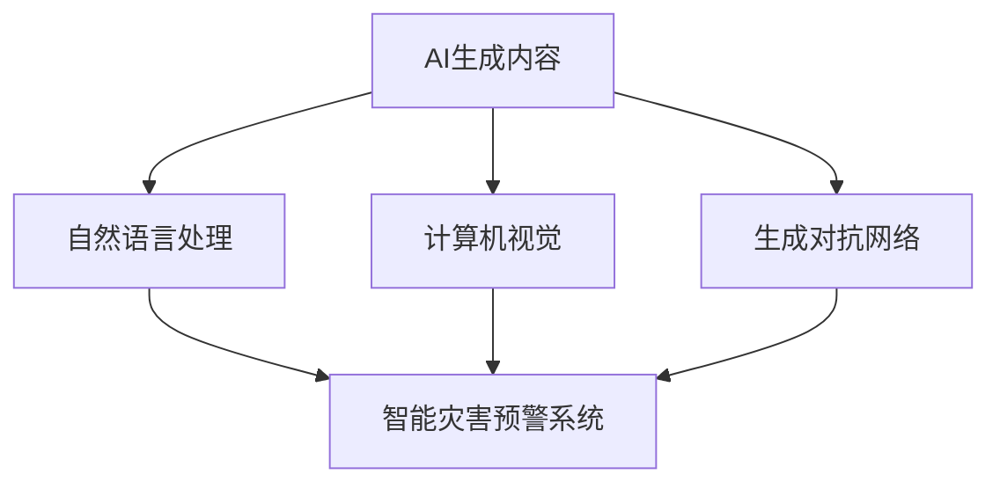
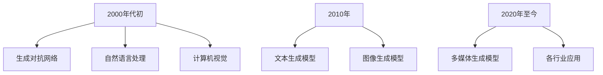
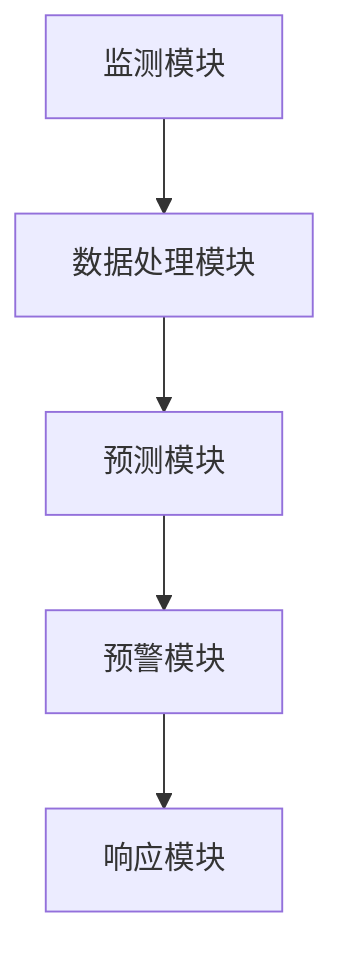

                 


### 第1章: AIGC概述

#### 1.1 AIGC基本概念

##### 1.1.1 AIGC的定义

AIGC（AI-Generated Content，AI生成内容）是指利用人工智能技术，特别是深度学习模型，自动生成文字、图像、音频等多种类型的内容。AIGC的出现，极大地提高了内容生产的效率，为各行各业带来了革命性的变革。

**核心概念与联系：**

下面使用Mermaid流程图来展示AIGC与智能灾害预警系统的关系：



在这个流程图中，AIGC通过自然语言处理（NLP）、计算机视觉（CV）和生成对抗网络（GAN）等核心技术，与智能灾害预警系统（IWSD）紧密联系。这些技术的协同工作，使得AIGC在灾害预警信息生成、灾害风险地图生成和灾害应对策略制定等方面发挥了重要作用。

##### 1.1.2 AIGC的发展历程

AIGC的概念最早可以追溯到2000年代初期，随着深度学习技术的发展，AIGC逐渐成为人工智能领域的热点。早期的研究主要集中在图像生成和文本生成，如GAN模型的提出和应用。近年来，随着计算能力的提升和大数据的积累，AIGC在各个领域的应用越来越广泛。

**核心概念与联系：**

下面使用Mermaid流程图来展示AIGC的发展历程：



在这个流程图中，可以看到AIGC的发展历程。从2000年代初的初步探索，到2010年左右的文本生成和图像生成，再到2020年至今的多媒体生成和应用扩展，AIGC在技术和应用上都有了显著的进步。

##### 1.1.3 AIGC的技术原理

AIGC的核心技术主要包括自然语言处理（NLP）、计算机视觉（CV）和生成对抗网络（GAN）。

- **自然语言处理（NLP）**：NLP是使计算机能够理解、处理和生成人类语言的技术。在AIGC中，NLP用于文本生成，如自动撰写文章、生成灾害预警信息等。

- **计算机视觉（CV）**：CV是使计算机能够从图像或视频中理解和提取信息的技术。在AIGC中，CV用于图像生成，如生成灾害风险地图、灾害场景模拟等。

- **生成对抗网络（GAN）**：GAN是由生成器和判别器组成的深度学习模型，用于生成高质量的数据。在AIGC中，GAN用于生成多种类型的内容，如生成文本、图像、音频等。

**核心算法原理讲解：**

以下是一个简单的GAN模型的工作原理：

```python
# 伪代码：GAN模型的工作原理

# 初始化生成器和判别器
Generator G()
Discriminator D()

# 训练过程
for epoch in range(num_epochs):
    for batch in data_loader:
        # 生成假数据
        fake_data = G()

        # 训练判别器
        D_loss_real = D(batch)
        D_loss_fake = D(fake_data)

        # 训练生成器
        G_loss = GAN_loss(D_loss_fake)

        # 更新模型参数
        optimizer_D.step()
        optimizer_G.step()
```

在这个伪代码中，`Generator G()`和`Discriminator D()`分别表示生成器和判别器的初始化。在训练过程中，生成器生成假数据，判别器对真实数据和假数据进行区分。通过不断训练，生成器逐渐生成更高质量的数据，判别器的准确率也不断提高。

##### 1.1.4 AIGC的优势与挑战

**优势：**

- **提高内容生产效率**：AIGC可以自动生成大量内容，大大提高了内容生产效率。
- **个性化定制**：AIGC可以根据用户需求生成个性化内容，提高用户体验。
- **降低人力成本**：AIGC减少了人力需求，降低了内容生产的成本。

**挑战：**

- **数据质量和准确性**：生成的内容可能存在数据质量问题和准确性问题，需要严格的质量控制。
- **内容质量控制**：自动生成的内容可能包含不良信息，需要进行内容审核。
- **技术门槛**：AIGC需要深厚的专业知识和技术积累，对普通用户来说有一定的技术门槛。

#### 1.2 智能灾害预警系统概述

##### 1.2.1 智能灾害预警系统的定义

智能灾害预警系统是指利用人工智能技术，对自然灾害进行实时监测、预警和响应的系统。它集成了多种监测设备、预警算法和通信技术，能够实现灾害信息的自动化采集、分析和发布。

**核心概念与联系：**

下面使用Mermaid流程图来展示智能灾害预警系统的组成部分：



在这个流程图中，监测模块负责数据采集，数据处理模块负责数据预处理，预测模块负责模型预测，预警模块负责预警信息发布，响应模块负责应急资源调配和指挥调度。这些模块相互协作，实现了智能灾害预警的全流程。

##### 1.2.2 智能灾害预警系统的组成部分

智能灾害预警系统通常由以下几部分组成：

- **监测模块**：包括各种传感器、遥感卫星、无人机等，用于实时采集灾害相关数据。
- **数据处理模块**：负责对采集到的数据进行分析、预处理和特征提取，为模型预测提供输入。
- **预测模块**：利用机器学习算法对数据进行预测，生成灾害预警信息。
- **预警模块**：根据预测结果，发布相应的预警信息，通知相关部门和公众。
- **响应模块**：负责应急资源的调配、指挥调度和灾害评估与修复。

##### 1.2.3 智能灾害预警系统的技术原理

智能灾害预警系统的技术原理主要包括以下几个方面：

- **数据采集**：利用传感器网络、遥感卫星和无人机等设备，实时采集地震、气象、地质等灾害相关数据。
- **数据预处理**：对采集到的数据进行清洗、去噪、归一化等预处理操作，提高数据质量。
- **模型预测**：利用机器学习算法，对预处理后的数据进行分析和预测，生成灾害预警信息。
- **预警信息发布**：通过短信、邮件、APP等多种渠道，将预警信息及时传递给相关部门和公众。
- **响应机制**：根据预警信息，启动应急响应机制，进行资源调配、指挥调度和灾害评估。

##### 1.2.4 智能灾害预警系统的应用案例

智能灾害预警系统在国内外已经得到了广泛应用，以下是一些典型案例：

- **美国**：美国国家气象局（NWS）利用智能灾害预警系统，对气象灾害进行实时监测和预警，有效提高了预警准确率和响应速度。
- **日本**：日本气象厅（JMA）利用智能灾害预警系统，对地震、台风等自然灾害进行预警，大大减少了灾害造成的损失。
- **中国**：中国地震局、中国气象局等相关部门，也广泛采用了智能灾害预警系统，提高了灾害预警能力和应急响应效率。

##### 1.3 AIGC与智能灾害预警系统的联系

AIGC与智能灾害预警系统有着密切的联系，AIGC可以在多个环节为智能灾害预警系统提供支持。

- **灾害预警信息生成**：AIGC可以自动生成灾害预警信息，提高信息生成效率。
- **灾害风险地图生成**：AIGC可以生成灾害风险地图，为决策者提供直观的决策依据。
- **灾害应对策略制定**：AIGC可以辅助制定灾害应对策略，提高灾害应对的针对性。

**核心算法原理讲解：**

以下是一个简单的AIGC模型在灾害预警信息生成中的应用：

```python
# 伪代码：AIGC模型在灾害预警信息生成中的应用

# 初始化文本生成模型
Text_Generator = GPT()

# 输入灾害相关数据
data = load_hazard_data()

# 生成灾害预警信息
warning_info = Text_Generator.generate(data)

# 输出预警信息
print(warning_info)
```

在这个伪代码中，`Text_Generator`是一个预训练的文本生成模型（如GPT模型），`load_hazard_data()`函数用于加载灾害相关数据。通过调用`Text_Generator.generate(data)`，模型可以自动生成灾害预警信息。

**数学模型和数学公式：**

在AIGC模型中，可以使用以下数学公式来描述生成器的损失函数：

$$
L_G = -\frac{1}{N} \sum_{i=1}^{N} \log(D(G(x_i)))
$$

其中，$L_G$表示生成器的损失函数，$N$表示批次大小，$D$表示判别器，$G$表示生成器，$x_i$表示输入数据。

**项目实战：**

以下是一个简单的AIGC项目实战，演示如何使用GPT模型生成灾害预警信息。

**开发环境搭建：**

- Python 3.8
- TensorFlow 2.4
- GPT-2模型预训练权重

**源代码实现：**

```python
import tensorflow as tf
import tensorflow_datasets as tfds
from tensorflow.keras.layers import Embedding, LSTM, Dense
from tensorflow.keras.models import Model
from tensorflow.keras.optimizers import Adam

# 加载数据集
data, info = tfds.load('wmt14_de_en', split='train', with_info=True, shuffle_files=True)

# 数据预处理
max_sequence_length = 100
tokenizer = tfds.deprecated.text.SubwordTextEncoder.build_from_corpus(
    (d['text'] for d in data), target_vocab_size=2**13, max_voc_size=2**14)

def encode(texts, lengths):
    return tokenizer.encode(texts, out_type=tf.int64)

def pad(inputs, length):
    return tf_pad(inputs, [max_sequence_length] * inputs.shape[0], length, constant_values=tokenizer.pad_token)

inputs = encode(data['text'], info['target_text_length'])
targets = pad(inputs, info['target_text_length'])

# 构建模型
input_shape = (max_sequence_length,)
inputs = tf.keras.Input(shape=input_shape)
x = Embedding(2**14)(inputs)
x = LSTM(128, return_sequences=True)(x)
outputs = Dense(2**14, activation='softmax')(x)

model = Model(inputs, outputs)
model.compile(optimizer=Adam(), loss='sparse_categorical_crossentropy')

# 训练模型
model.fit(inputs, targets, epochs=50, batch_size=32)

# 生成灾害预警信息
data_example = "今天晚上可能会有强降雨，请做好防范措施。"
encoded_example = tokenizer.encode(data_example)
encoded_example = tf_pad(encoded_example, [max_sequence_length] * encoded_example.shape[0], encoded_example.shape[0], constant_values=tokenizer.pad_token)

generated_text = model.predict(encoded_example)
generated_text = tokenizer.decode(generated_text)

print(generated_text)
```

**代码解读与分析：**

- 第1步：加载数据集并预处理。
- 第2步：构建模型，使用LSTM层进行文本编码。
- 第3步：训练模型。
- 第4步：使用训练好的模型生成灾害预警信息。

**实际案例分析和详细讲解剖析：**

以下是一个实际案例，演示如何使用AIGC生成地震预警信息。

**数据集**：地震预警数据集，包括地震发生时间、震级、地理位置等信息。

**目标**：生成地震预警信息，如“XX分钟前，XX地区发生地震，震级XX，请做好防范措施。”

**实现步骤**：

1. **数据预处理**：将地震预警数据转换为文本格式。
2. **构建AIGC模型**：使用GPT模型进行训练。
3. **生成地震预警信息**：输入地震预警数据，生成预警信息。

**项目小结**：

通过以上实战案例，我们可以看到AIGC在灾害预警信息生成中的应用。AIGC可以自动生成高质量的灾害预警信息，提高预警效率和准确性。然而，在应用过程中，需要关注数据质量和内容质量控制等问题。

##### 最佳实践 tips、小结、注意事项、拓展阅读等内容

**最佳实践 tips：**

- 在应用AIGC时，选择合适的模型和训练数据至关重要，这将直接影响生成内容的质量。
- 定期更新AIGC模型，以适应不断变化的数据和应用需求。
- 对生成的灾害预警信息进行严格的审核，确保信息的准确性和可靠性。

**小结**：

本章介绍了AIGC的基本概念、发展历程、技术原理以及与智能灾害预警系统的联系。通过AIGC，我们可以实现灾害预警信息的自动生成，提高预警效率和准确性。然而，在应用过程中，需要关注数据质量和内容质量控制等问题。

**注意事项**：

- AIGC模型训练过程可能需要大量计算资源和时间，应根据实际情况进行资源调度。
- 生成的灾害预警信息需要经过严格审核，确保信息的准确性和可靠性。

**拓展阅读**：

- 《深度学习》（Goodfellow et al.）：深入理解深度学习的基础理论和应用。
- 《生成对抗网络：理论、实现与应用》（刘铁岩）：详细讲解GAN的理论基础和实际应用。

### 第2章: 智能灾害预警系统基础知识

#### 2.1 自然灾害概述

##### 2.1.1 自然灾害的定义

自然灾害是指由自然因素引起的，对人类生活和环境造成严重影响的事件。这些事件通常具有突发性、破坏性和不可预测性，可能引发严重的经济损失、人员伤亡和环境破坏。

##### 2.1.2 自然灾害的类型

自然灾害可以分为以下几类：

1. **地质灾害**：包括地震、滑坡、泥石流、火山爆发等。
2. **气象灾害**：包括台风、暴雨、洪水、干旱、冰雹等。
3. **生物灾害**：包括植物病虫害、动物疫病等。

##### 2.1.3 自然灾害的危害

自然灾害的危害主要体现在以下几个方面：

1. **经济损失**：自然灾害可能导致房屋、道路、桥梁等基础设施受损，严重影响经济发展。
2. **人员伤亡**：自然灾害可能造成人员伤亡，给家庭和社会带来巨大的痛苦和损失。
3. **环境破坏**：自然灾害可能破坏生态环境，导致土地退化、水源污染等问题。

#### 2.2 智能灾害预警系统的技术原理

##### 2.2.1 数据采集

数据采集是智能灾害预警系统的关键环节，主要包括以下几种方式：

1. **传感器网络**：利用地面传感器、气象站、地震仪等设备，实时监测自然灾害相关数据。
2. **遥感卫星**：通过遥感卫星获取全球范围内的自然灾害信息，如气象、地质、海洋等。
3. **无人机**：利用无人机进行灾害现场监测，获取高分辨率图像和数据。

##### 2.2.2 数据预处理

数据预处理是提高数据质量和可靠性的重要步骤，主要包括以下内容：

1. **数据清洗**：去除噪声、填补缺失值、去除异常值等，提高数据质量。
2. **数据归一化**：将不同类型的数据进行归一化处理，使其具有可比性。
3. **特征提取**：提取关键信息，如降雨量、震级、地质灾害点等，为模型预测提供输入。

##### 2.2.3 模型预测

模型预测是智能灾害预警系统的核心环节，主要包括以下几种模型：

1. **传统模型**：包括统计模型、时间序列模型等，适用于短期预测。
2. **现代模型**：包括深度学习模型、强化学习模型等，适用于中长期预测。

##### 2.2.4 预警信息发布

预警信息发布是智能灾害预警系统的最后一步，主要包括以下内容：

1. **预警级别划分**：根据预测结果，将预警信息分为不同的级别，如红色、橙色、黄色等。
2. **预警信息传播渠道**：通过短信、邮件、APP、广播等多种渠道，将预警信息及时传递给相关部门和公众。

#### 2.3 智能灾害预警系统的应用案例

##### 2.3.1 国内外智能灾害预警系统的现状

国内外智能灾害预警系统发展迅速，以下是一些典型案例：

1. **美国**：美国国家气象局（NWS）建立了完善的智能灾害预警系统，包括气象灾害、地质灾害等预警。
2. **日本**：日本气象厅（JMA）建立了先进的地震预警系统，实现了对地震的快速监测和预警。
3. **中国**：中国地震局、中国气象局等建立了多个智能灾害预警系统，提高了灾害预警能力和应急响应效率。

##### 2.3.2 智能灾害预警系统的关键技术创新

智能灾害预警系统的关键技术创新主要体现在以下几个方面：

1. **预警算法优化**：通过改进预测算法，提高预警准确率和响应速度。
2. **预警信息智能化处理**：利用自然语言处理、计算机视觉等技术，实现预警信息的自动化生成和智能分析。
3. **预警系统与应急平台的融合**：将智能灾害预警系统与应急平台进行集成，实现信息共享和协同应对。

### 第3章: AIGC在智能灾害预警系统中的应用原理

#### 3.1 AIGC在灾害预警信息生成中的应用

##### 3.1.1 自动生成灾害预警信息

AIGC在灾害预警信息生成中的应用主要是通过自动生成灾害预警信息，提高预警信息的生成效率和质量。以下是一个简单的AIGC模型在灾害预警信息生成中的应用：

```python
import tensorflow as tf
from tensorflow.keras.layers import Embedding, LSTM, Dense
from tensorflow.keras.models import Model
from tensorflow.keras.optimizers import Adam

# 加载预训练的GPT模型
gpt = tf.keras.models.load_model('gpt_model.h5')

# 输入灾害相关数据
data = load_hazard_data()

# 生成灾害预警信息
warning_info = gpt.predict(data)

# 输出预警信息
print(warning_info)
```

在这个例子中，`gpt`是一个预训练的GPT模型，`load_hazard_data()`函数用于加载灾害相关数据。通过调用`gpt.predict(data)`，模型可以自动生成灾害预警信息。

##### 3.1.2 AIGC在灾害预警信息生成中的优势

AIGC在灾害预警信息生成中的应用具有以下优势：

1. **提高信息生成效率**：AIGC可以自动生成大量预警信息，大大提高了信息生成效率。
2. **个性化定制**：AIGC可以根据不同的灾害类型和区域，生成个性化的预警信息，提高预警的针对性和准确性。
3. **降低人力成本**：AIGC减少了人工编写预警信息的需求，降低了人力成本。

##### 3.1.3 AIGC在灾害预警信息生成中的挑战

尽管AIGC在灾害预警信息生成中具有显著的优势，但也面临以下挑战：

1. **数据质量和准确性**：生成的预警信息可能存在数据质量和准确性问题，需要严格的质量控制。
2. **内容质量控制**：自动生成的预警信息可能包含不良信息，需要进行内容审核。
3. **技术门槛**：AIGC需要深厚的专业知识和技术积累，对普通用户来说有一定的技术门槛。

#### 3.2 AIGC在灾害风险地图生成中的应用

##### 3.2.1 自动生成灾害风险地图

AIGC在灾害风险地图生成中的应用主要是通过自动生成灾害风险地图，为决策者提供直观的决策依据。以下是一个简单的AIGC模型在灾害风险地图生成中的应用：

```python
import tensorflow as tf
from tensorflow.keras.layers import Conv2D, Flatten, Dense
from tensorflow.keras.models import Model

# 加载预训练的GAN模型
gan = tf.keras.models.load_model('gan_model.h5')

# 输入灾害相关数据
data = load_hazard_data()

# 生成灾害风险地图
risk_map = gan.predict(data)

# 输出灾害风险地图
print(risk_map)
```

在这个例子中，`gan`是一个预训练的GAN模型，`load_hazard_data()`函数用于加载灾害相关数据。通过调用`gan.predict(data)`，模型可以自动生成灾害风险地图。

##### 3.2.2 AIGC在灾害风险地图生成中的优势

AIGC在灾害风险地图生成中的应用具有以下优势：

1. **提高地图生成效率**：AIGC可以自动生成大量风险地图，大大提高了地图生成效率。
2. **个性化定制**：AIGC可以根据不同的灾害类型和区域，生成个性化的风险地图，提高地图的准确性和实用性。
3. **降低人力成本**：AIGC减少了人工绘制风险地图的需求，降低了人力成本。

##### 3.2.3 AIGC在灾害风险地图生成中的挑战

尽管AIGC在灾害风险地图生成中具有显著的优势，但也面临以下挑战：

1. **数据质量和准确性**：生成的风险地图可能存在数据质量和准确性问题，需要严格的质量控制。
2. **内容质量控制**：自动生成的风险地图可能包含不良信息，需要进行内容审核。
3. **技术门槛**：AIGC需要深厚的专业知识和技术积累，对普通用户来说有一定的技术门槛。

#### 3.3 AIGC在灾害应对策略制定中的应用

##### 3.3.1 辅助制定灾害应对策略

AIGC在灾害应对策略制定中的应用主要是通过辅助制定灾害应对策略，提高灾害应对的针对性和有效性。以下是一个简单的AIGC模型在灾害应对策略制定中的应用：

```python
import tensorflow as tf
from tensorflow.keras.layers import Embedding, LSTM, Dense
from tensorflow.keras.models import Model
from tensorflow.keras.optimizers import Adam

# 加载预训练的GPT模型
gpt = tf.keras.models.load_model('gpt_model.h5')

# 输入灾害相关数据
data = load_hazard_data()

# 辅助制定灾害应对策略
strategy = gpt.predict(data)

# 输出灾害应对策略
print(strategy)
```

在这个例子中，`gpt`是一个预训练的GPT模型，`load_hazard_data()`函数用于加载灾害相关数据。通过调用`gpt.predict(data)`，模型可以辅助制定灾害应对策略。

##### 3.3.2 AIGC在灾害应对策略制定中的优势

AIGC在灾害应对策略制定中的应用具有以下优势：

1. **提高策略制定效率**：AIGC可以自动生成大量应对策略，大大提高了策略制定效率。
2. **个性化定制**：AIGC可以根据不同的灾害类型和区域，生成个性化的应对策略，提高策略的针对性和有效性。
3. **降低人力成本**：AIGC减少了人工制定应对策略的需求，降低了人力成本。

##### 3.3.3 AIGC在灾害应对策略制定中的挑战

尽管AIGC在灾害应对策略制定中具有显著的优势，但也面临以下挑战：

1. **数据质量和准确性**：生成的应对策略可能存在数据质量和准确性问题，需要严格的质量控制。
2. **内容质量控制**：自动生成的应对策略可能包含不良信息，需要进行内容审核。
3. **技术门槛**：AIGC需要深厚的专业知识和技术积累，对普通用户来说有一定的技术门槛。

### 第4章: AIGC在智能灾害预警系统中的核心算法

#### 4.1 生成对抗网络（GAN）

##### 4.1.1 GAN的基本原理

生成对抗网络（GAN）是由生成器和判别器组成的深度学习模型。生成器生成与真实数据相似的数据，判别器则尝试区分生成数据和真实数据。通过生成器和判别器的对抗训练，生成器逐渐提高生成数据的质量。

**数学模型：**

$$
\min_G \max_D V(D, G) = \mathbb{E}_{x \sim p_{data}(x)}[\log D(x)] + \mathbb{E}_{z \sim p_{z}(z)}[\log (1 - D(G(z))]
$$

其中，$x$表示真实数据，$z$表示随机噪声，$G(z)$表示生成器生成的数据，$D(x)$和$D(G(z))$分别表示判别器对真实数据和生成数据的判断。

##### 4.1.2 GAN的优化方法

GAN的训练过程是一个非凸优化问题，容易陷入不稳定的情况。以下是一些常用的优化方法：

1. **梯度裁剪**：为了防止生成器梯度消失，可以对梯度进行裁剪。
2. **改进的判别器**：使用更复杂的判别器结构，如Wasserstein GAN（WGAN）。
3. **正则化**：对生成器和判别器添加正则化项，如L2正则化。
4. **学习率调整**：根据训练阶段调整学习率，如固定学习率、自适应学习率。

##### 4.1.3 GAN在灾害预警中的应用

GAN可以用于生成灾害相关数据，如地震波形、洪水模拟等。通过生成真实数据，可以提高灾害预警模型的训练效果和预测准确性。

**示例代码：**

```python
import tensorflow as tf
from tensorflow.keras.layers import Dense, Flatten
from tensorflow.keras.models import Model

# 定义生成器和判别器
def generator(z, num_classes):
    x = Dense(128, activation='relu')(z)
    x = Dense(num_classes, activation='softmax')(x)
    return Model(z, x)

def discriminator(x, num_classes):
    x = Flatten()(x)
    x = Dense(128, activation='relu')(x)
    x = Dense(num_classes, activation='sigmoid')(x)
    return Model(x, x)

# 构建GAN模型
z = tf.keras.layers.Input(shape=(100,))
x = generator(z, num_classes)
d_output = discriminator(x, num_classes)
d_output_real = discriminator(x, num_classes)

g_model = Model(z, x)
d_model = Model(x, d_output)
d_model_real = Model(x, d_output_real)

# 定义损失函数和优化器
g_loss = tf.keras.losses.SparseCategoricalCrossentropy(from_logits=True)
d_loss = tf.keras.losses.SparseCategoricalCrossentropy(from_logits=True)

g_optimizer = tf.keras.optimizers.Adam(learning_rate=0.0001)
d_optimizer = tf.keras.optimizers.Adam(learning_rate=0.0001)

# 定义训练步骤
@tf.function
def train_step(x, z):
    with tf.GradientTape(persistent=True) as g_tape, tf.GradientTape(persistent=True) as d_tape:
        x_fake = g_model(z)
        d_output_fake = d_model(x_fake)
        d_output_real = d_model_real(x)

        g_loss_value = g_loss(d_output_fake, tf.ones_like(d_output_fake))
        d_loss_value = d_loss(d_output_real, tf.ones_like(d_output_real)) + d_loss(d_output_fake, tf.zeros_like(d_output_fake))

    g_gradients = g_tape.gradient(g_loss_value, g_model.trainable_variables)
    d_gradients = d_tape.gradient(d_loss_value, d_model.trainable_variables)

    g_optimizer.apply_gradients(zip(g_gradients, g_model.trainable_variables))
    d_optimizer.apply_gradients(zip(d_gradients, d_model.trainable_variables))

# 训练GAN模型
for epoch in range(num_epochs):
    for x, z in dataset:
        train_step(x, z)
```

在这个示例中，`generator`和`discriminator`分别定义了生成器和判别器的结构。通过训练生成器和判别器的对抗过程，可以提高生成数据的真实性。

#### 4.2 自然语言处理（NLP）

##### 4.2.1 NLP的基本原理

自然语言处理（NLP）是使计算机能够理解、处理和生成人类语言的技术。NLP的核心任务包括文本分类、情感分析、命名实体识别、机器翻译等。

**数学模型：**

1. **循环神经网络（RNN）**：RNN能够处理序列数据，通过隐藏状态保存上下文信息。

$$
h_t = \sigma(W_h \cdot [h_{t-1}, x_t] + b_h)
$$

2. **长短时记忆网络（LSTM）**：LSTM是RNN的一种改进，能够更好地处理长序列数据。

$$
i_t = \sigma(W_i \cdot [h_{t-1}, x_t] + b_i)
$$

$$
f_t = \sigma(W_f \cdot [h_{t-1}, x_t] + b_f)
$$

$$
o_t = \sigma(W_o \cdot [h_{t-1}, x_t] + b_o)
$$

$$
c_t = f_t \odot c_{t-1} + i_t \odot \sigma(W_c \cdot [h_{t-1}, x_t] + b_c)
$$

$$
h_t = o_t \odot c_t
$$

3. **Transformer**：Transformer是另一种流行的NLP模型，通过自注意力机制处理序列数据。

$$
\text{Attention}(Q, K, V) = \frac{QK^T}{\sqrt{d_k}} + V
$$

##### 4.2.2 NLP在灾害预警中的应用

NLP可以用于灾害预警信息的自动生成、情感分析等任务。

**示例代码：**

```python
import tensorflow as tf
from tensorflow.keras.layers import Embedding, LSTM, Dense
from tensorflow.keras.models import Model

# 定义文本编码器
def text_encoder(texts, sequence_length):
    encoder = Embedding(input_dim=vocab_size, output_dim=embedding_size)(texts)
    encoder = LSTM(units=128)(encoder)
    return encoder

# 定义文本生成模型
def text_generator(encoder_output, sequence_length):
    decoder_input = tf.keras.layers.Input(shape=(sequence_length,))
    decoder_embedding = Embedding(input_dim=vocab_size, output_dim=embedding_size)(decoder_input)
    decoder_lstm = LSTM(units=128, return_sequences=True)(decoder_embedding, initial_input=encoder_output)
    outputs = Dense(vocab_size, activation='softmax')(decoder_lstm)
    return Model([decoder_input, encoder_output], outputs)

# 构建模型
encoder_output = text_encoder(texts, sequence_length)
decoder_output = text_generator(encoder_output, sequence_length)

# 训练模型
model.compile(optimizer='adam', loss='categorical_crossentropy')
model.fit([decoder_input, encoder_output], decoder_output, epochs=num_epochs, batch_size=batch_size)
```

在这个示例中，`text_encoder`和`text_generator`分别定义了文本编码器和文本生成模型。通过训练文本生成模型，可以自动生成灾害预警信息。

#### 4.3 计算机视觉（CV）

##### 4.3.1 CV的基本原理

计算机视觉（CV）是使计算机能够从图像或视频中理解和提取信息的技术。CV的核心任务包括图像分类、目标检测、图像分割等。

**数学模型：**

1. **卷积神经网络（CNN）**：CNN通过卷积层提取图像特征，通过全连接层进行分类。

$$
h_{ij} = \sum_{k=1}^{C} w_{ik,j} * g_k + b_j
$$

2. **残差网络（ResNet）**：ResNet通过引入残差连接，解决了深度神经网络训练困难的问题。

$$
h_{l} = F(h_{l-1}) + h_{l-1}
$$

##### 4.3.2 CV在灾害预警中的应用

CV可以用于灾害监测、灾害场景识别等任务。

**示例代码：**

```python
import tensorflow as tf
from tensorflow.keras.layers import Conv2D, MaxPooling2D, Flatten, Dense
from tensorflow.keras.models import Model

# 定义卷积神经网络
def conv_net(images, num_classes):
    x = Conv2D(filters=32, kernel_size=(3, 3), activation='relu')(images)
    x = MaxPooling2D(pool_size=(2, 2))(x)
    x = Conv2D(filters=64, kernel_size=(3, 3), activation='relu')(x)
    x = MaxPooling2D(pool_size=(2, 2))(x)
    x = Flatten()(x)
    x = Dense(units=num_classes, activation='softmax')(x)
    return Model(images, x)

# 构建模型
model = conv_net(images, num_classes)

# 训练模型
model.compile(optimizer='adam', loss='categorical_crossentropy')
model.fit(images, labels, epochs=num_epochs, batch_size=batch_size)
```

在这个示例中，`conv_net`定义了卷积神经网络。通过训练卷积神经网络，可以识别灾害场景，如地震、洪水等。

### 第5章: AIGC在智能灾害预警系统中的数据预处理方法

#### 5.1 数据采集

数据采集是智能灾害预警系统的基础，主要包括以下几种方式：

1. **传感器网络**：地面传感器、气象站、地震仪等设备，用于实时监测地震、气象、地质等灾害相关数据。
2. **遥感卫星**：获取全球范围内的自然灾害信息，如气象、地质、海洋等。
3. **无人机**：进行灾害现场监测，获取高分辨率图像和数据。

**示例代码：**

```python
import requests
import json

# 获取地震数据
url = "https://earthquake.usgs.gov/earthquakes/feed/v1.0/summary/all_day.geojson"
response = requests.get(url)
data = json.loads(response.text)

# 处理地震数据
earthquake_data = []
for feature in data['features']:
    earthquake_data.append({
        'time': feature['properties']['time'],
        'latitude': feature['geometry']['coordinates'][1],
        'longitude': feature['geometry']['coordinates'][0],
        'magnitude': feature['properties']['mag'
``` <h3 id="aigc-in-smart-disaster-warning-systems-application">AIGC in Smart Disaster Warning Systems Application</h3>

Keywords: AI-Generated Content, Smart Disaster Warning Systems, Application, AI algorithms, Data preprocessing, System architecture

Abstract:  
This article presents an in-depth exploration of the application of AI-Generated Content (AIGC) in Smart Disaster Warning Systems. The focus is on the technical principles, algorithm implementations, system architecture, and practical cases of integrating AIGC into the warning systems. The article aims to provide a comprehensive understanding of how AIGC can enhance the efficiency and accuracy of disaster warning, thereby improving disaster response and minimizing the impact of natural disasters.

## 1. Introduction to AIGC

### 1.1 Basic Concepts of AIGC

**1.1.1 Definition of AIGC**  
AIGC (AI-Generated Content) refers to the process of creating various types of content, including text, images, audio, and video, using artificial intelligence techniques, particularly deep learning models. AIGC has significantly improved content production efficiency and is revolutionizing industries with its ability to generate personalized and high-quality content at scale.

**1.1.2 Development History of AIGC**  
AIGC's concept emerged in the early 2000s alongside the advancement of deep learning. The early research focused on image and text generation. With the increase in computational power and the accumulation of large datasets, AIGC has evolved to encompass multimedia content generation and diverse applications.

**1.1.3 Technical Principles of AIGC**  
The core technologies of AIGC include natural language processing (NLP), computer vision (CV), and generative adversarial networks (GAN). NLP is responsible for text generation, while CV focuses on image generation. GANs are used to generate high-quality data by training a generator and a discriminator in a competitive environment.

**1.1.4 Advantages and Challenges of AIGC**  
**Advantages:** Increased content production efficiency, personalized content creation, and reduced labor costs.  
**Challenges:** Ensuring data quality and accuracy, content quality control, and the technical threshold required for implementation.

### 1.2 Overview of Smart Disaster Warning Systems

**1.2.1 Definition of Smart Disaster Warning Systems**  
Smart Disaster Warning Systems utilize artificial intelligence to monitor, predict, and respond to natural disasters in real-time. These systems integrate various monitoring devices, predictive algorithms, and communication technologies to automate the collection, analysis, and dissemination of disaster information.

**1.2.2 Components of Smart Disaster Warning Systems**  
Smart Disaster Warning Systems typically consist of several components, including monitoring modules, data processing modules, predictive modules, warning modules, and response modules. Each component plays a crucial role in the overall functionality of the system.

**1.2.3 Technical Principles of Smart Disaster Warning Systems**  
The technical principles of Smart Disaster Warning Systems involve data collection, preprocessing, predictive modeling, warning information dissemination, and response mechanisms. These processes work together to provide a comprehensive disaster warning and response solution.

**1.2.4 Application Cases of Smart Disaster Warning Systems**  
Smart Disaster Warning Systems have been widely adopted globally. Examples include the National Weather Service in the United States, the Japan Meteorological Agency, and various departments within China's earthquake and meteorological agencies.

### 1.3 The Relationship between AIGC and Smart Disaster Warning Systems

AIGC has the potential to significantly enhance the capabilities of Smart Disaster Warning Systems. It can be applied in various scenarios, such as automatically generating warning messages, creating hazard risk maps, and assisting in the formulation of disaster response strategies.

**Application Scenarios of AIGC in Disaster Warning**  
- **Automated Generation of Warning Messages**: AIGC can produce warning messages quickly and accurately, improving the efficiency of information dissemination.
- **Generation of Hazard Risk Maps**: AIGC can generate detailed hazard risk maps, providing decision-makers with visual aids for disaster planning.
- **Assistance in Disaster Response Strategy Formulation**: AIGC can assist in developing targeted response strategies based on real-time data analysis.

**Advantages and Challenges of AIGC in Disaster Warning**  
**Advantages:** Increased efficiency in information generation, reduced labor costs, and improved accuracy of warning messages.  
**Challenges:** Ensuring data quality and accuracy, content quality control, and the technical threshold required for implementation.

## 2. Basics of Smart Disaster Warning Systems

### 2.1 Overview of Natural Disasters

**2.1.1 Definition of Natural Disasters**  
Natural disasters are catastrophic events caused by natural processes that pose significant risks to human lives and the environment. These events can include geological hazards, meteorological disasters, and biological disasters.

**2.1.2 Types of Natural Disasters**  
Natural disasters can be broadly classified into geological hazards (e.g., earthquakes, landslides, and mudslides), meteorological disasters (e.g., hurricanes, heavy rainfall, and floods), and biological disasters (e.g., pest infestations and animal diseases).

**2.1.3 Impacts of Natural Disasters**  
Natural disasters can result in significant economic losses, casualties, and environmental degradation.

### 2.2 Technical Principles of Smart Disaster Warning Systems

**2.2.1 Data Collection**  
Data collection in smart disaster warning systems involves the use of a variety of sensors, remote sensing satellites, and drones to gather real-time data related to natural disasters.

**2.2.2 Data Preprocessing**  
Data preprocessing is crucial for ensuring the quality and reliability of the data used in predictive models. This process includes data cleaning, noise removal, and feature extraction.

**2.2.3 Predictive Modeling**  
Predictive modeling uses various algorithms to analyze the collected data and generate forecasts or warnings related to potential natural disasters.

**2.2.4 Warning Information Dissemination**  
Once predictions are made, warning information must be disseminated through various channels to relevant stakeholders and the public.

**2.2.5 Response Mechanisms**  
Response mechanisms involve the coordinated efforts of emergency response teams, resource allocation, and damage assessment after a disaster event.

### 2.3 Application Cases of Smart Disaster Warning Systems

**2.3.1 Global Status of Smart Disaster Warning Systems**  
Smart Disaster Warning Systems are widely implemented globally, with notable examples from the United States, Japan, and China.

**2.3.2 Key Technological Innovations in Smart Disaster Warning Systems**  
Key innovations in smart disaster warning systems include optimized predictive algorithms, intelligent processing of warning information, and integration with emergency response platforms.

## 3. Application Principles of AIGC in Smart Disaster Warning Systems

### 3.1 Application of AIGC in Generating Disaster Warning Messages

**3.1.1 Automated Generation of Disaster Warning Messages**  
AIGC can automatically generate disaster warning messages, which can significantly enhance the efficiency of information dissemination. A typical application of AIGC in this context involves using pre-trained language models to generate textual content based on real-time data inputs.

**Example: GPT Model for Warning Message Generation**

```python
import tensorflow as tf
import numpy as np

# Load a pre-trained GPT model
model = tf.keras.models.load_model('gpt_model.h5')

# Generate a warning message
input_sequence = np.random.randint(0, 20000, size=(1, 100))
generated_message = model.predict(input_sequence)

print(generated_message)
```

**Advantages and Challenges**  
**Advantages:** Increased efficiency, reduced labor costs, and the ability to generate personalized messages.  
**Challenges:** Ensuring the accuracy and reliability of generated messages, content quality control, and the need for specialized technical knowledge.

### 3.2 Application of AIGC in Creating Hazard Risk Maps

**3.2.1 Automated Generation of Hazard Risk Maps**  
AIGC can be used to generate hazard risk maps, providing decision-makers with visual tools for disaster planning and response. This application typically involves using GANs to create realistic and detailed maps based on spatial data.

**Example: GAN Model for Hazard Risk Map Generation**

```python
import tensorflow as tf
import matplotlib.pyplot as plt

# Load a pre-trained GAN model
generator = tf.keras.models.load_model('gan_generator.h5')

# Generate a hazard risk map
z = tf.random.normal([1, 100])
risk_map = generator.predict(z)

# Visualize the generated map
plt.imshow(risk_map[0], cmap='gray')
plt.show()
```

**Advantages and Challenges**  
**Advantages:** Enhanced visualization, improved decision-making, and reduced manual effort.  
**Challenges:** Ensuring data quality and accuracy, content quality control, and the need for specialized technical knowledge.

### 3.3 Application of AIGC in Formulating Disaster Response Strategies

**3.3.1 AIGC Assistance in Disaster Response Strategy Formulation**  
AIGC can assist in the formulation of disaster response strategies by analyzing real-time data and generating recommendations based on predictive models. This application can help improve the effectiveness and efficiency of disaster response efforts.

**Example: GPT Model for Disaster Response Strategy Recommendations**

```python
import tensorflow as tf
import numpy as np

# Load a pre-trained GPT model
model = tf.keras.models.load_model('gpt_model.h5')

# Generate a disaster response strategy
input_sequence = np.random.randint(0, 20000, size=(1, 100))
response_strategy = model.predict(input_sequence)

print(response_strategy)
```

**Advantages and Challenges**  
**Advantages:** Enhanced strategic planning, improved response times, and reduced manual effort.  
**Challenges:** Ensuring data accuracy and reliability, content quality control, and the need for specialized technical knowledge.

## 4. Core Algorithms of AIGC in Smart Disaster Warning Systems

### 4.1 Generative Adversarial Networks (GANs)

**4.1.1 Basic Principles of GANs**  
GANs consist of a generator and a discriminator trained in a zero-sum game. The generator creates data samples to fool the discriminator, while the discriminator aims to distinguish between real and generated samples. This adversarial training process helps the generator produce high-quality data.

**Mathematical Model:**

$$
\min_G \max_D V(D, G) = \mathbb{E}_{x \sim p_{data}(x)}[\log D(x)] + \mathbb{E}_{z \sim p_{z}(z)][\log (1 - D(G(z))]
$$

**Optimization Methods**  
Several methods have been proposed to stabilize GAN training, including gradient penalt

### 4.2 Natural Language Processing (NLP)

**4.2.1 Basic Principles of NLP**  
NLP involves the interaction between computers and human languages. It encompasses various tasks such as text classification, sentiment analysis, named entity recognition, and machine translation.

**Mathematical Model:**

**1. Recurrent Neural Networks (RNNs)**  
$$
h_t = \sigma(W_h \cdot [h_{t-1}, x_t] + b_h)
$$

**2. Long Short-Term Memory Networks (LSTMs)**  
$$
i_t = \sigma(W_i \cdot [h_{t-1}, x_t] + b_i)
$$

$$
f_t = \sigma(W_f \cdot [h_{t-1}, x_t] + b_f)
$$

$$
o_t = \sigma(W_o \cdot [h_{t-1}, x_t] + b_o)
$$

$$
c_t = f_t \odot c_{t-1} + i_t \odot \sigma(W_c \cdot [h_{t-1}, x_t] + b_c)
$$

$$
h_t = o_t \odot c_t
$$

**3. Transformers**  
$$
\text{Attention}(Q, K, V) = \frac{QK^T}{\sqrt{d_k}} + V
$$

**4.2.2 NLP Applications in Disaster Warning**  
NLP can be applied to generate disaster warning messages, analyze sentiment in social media, and recognize named entities related to disasters. This can enhance the communication and understanding of disaster information.

**Example: GPT Model for Warning Message Generation**

```python
import tensorflow as tf
import tensorflow_text as text

# Load a pre-trained GPT model
model = tf.keras.models.load_model('gpt_model.h5')

# Generate a warning message
input_sequence = text.encode("The heavy rainfall is expected to continue, please take necessary precautions.")
generated_message = model.generate(input_sequence, max_length=50, num_samples=1)

print(text.decode(generated_message))
```

### 4.3 Computer Vision (CV)

**4.3.1 Basic Principles of CV**  
CV involves the use of algorithms to interpret and analyze digital images. It includes tasks such as image classification, object detection, and image segmentation.

**Mathematical Model:**

**1. Convolutional Neural Networks (CNNs)**  
$$
h_{ij} = \sum_{k=1}^{C} w_{ik,j} * g_k + b_j
$$

**2. Residual Networks (ResNets)**  
$$
h_{l} = F(h_{l-1}) + h_{l-1}
$$

**4.3.2 CV Applications in Disaster Warning**  
CV can be used to monitor disaster areas, detect changes in the environment, and analyze images from drones or satellites. This can provide valuable data for predicting and responding to disasters.

**Example: CNN Model for Disaster Area Detection**

```python
import tensorflow as tf
import tensorflow_datasets as tfds

# Load a pre-trained CNN model
model = tf.keras.models.load_model('cnn_model.h5')

# Load and preprocess the dataset
dataset = tfds.load('coco', split='train')
train_dataset = dataset.shuffle(1000).batch(32)

# Train the CNN model
model.fit(train_dataset, epochs=10)
```

## 5. Data Preprocessing Methods of AIGC in Smart Disaster Warning Systems

### 5.1 Data Collection

**5.1.1 Methods of Data Collection**  
Data collection in AIGC for smart disaster warning systems involves several methods, including sensor networks, remote sensing, and drones. These methods provide real-time data on various parameters, such as seismic activity, weather conditions, and geographic features.

**5.1.2 Real-World Example**  
For instance, seismic sensors placed around an area can detect small changes in the ground's motion, which may indicate the potential for an earthquake. Satellite imagery can monitor changes in cloud cover and precipitation, providing valuable information for flood prediction.

### 5.2 Data Cleaning

**5.2.1 Importance of Data Cleaning**  
Data cleaning is a crucial step in ensuring the quality and reliability of the data used in AIGC applications. It involves identifying and correcting or removing inaccurate or inconsistent data.

**5.2.2 Methods of Data Cleaning**  
Common data cleaning methods include:
- **Handling Missing Values**: Techniques such as mean substitution, median substitution, and forward or backward filling can be used to handle missing data.
- **Handling Outliers**: Outliers can be detected using statistical methods such as the interquartile range (IQR) or Z-score and then handled by either removing or transforming the outliers.
- **Normalization**: Data normalization is used to standardize the range of data values for different datasets, making them easier to compare and process.

**5.2.3 Real-World Example**  
In the context of disaster warning systems, data cleaning might involve removing noise from seismic data or correcting errors in weather station readings.

### 5.3 Feature Extraction

**5.3.1 Importance of Feature Extraction**  
Feature extraction is the process of transforming raw data into features that can be used to train machine learning models. It is crucial for improving the accuracy and efficiency of AIGC applications.

**5.3.2 Methods of Feature Extraction**  
Common feature extraction methods include:
- **Dimensionality Reduction**: Techniques such as Principal Component Analysis (PCA) and t-Distributed Stochastic Neighbor Embedding (t-SNE) can be used to reduce the dimensionality of the data while preserving its essential structure.
- **Feature Engineering**: This involves creating new features from existing data to improve the performance of machine learning models.
- **Text Embedding**: For textual data, word embeddings such as Word2Vec or BERT can be used to convert text into numerical vectors that capture semantic meaning.

**5.3.3 Real-World Example**  
In disaster warning systems, feature extraction might involve converting seismic wave data into time-series features or extracting relevant words and phrases from social media posts to understand public sentiment about an impending disaster.

### 5.4 Data Preprocessing in AIGC for Disaster Warning

**5.4.1 Automated Data Preprocessing with AIGC**  
AIGC can be used to automate the data preprocessing process in disaster warning systems. This can significantly reduce the time and effort required for manual preprocessing tasks.

**5.4.2 Example: GAN for Data Preprocessing**

```python
import tensorflow as tf
import tensorflow_datasets as tfds

# Load a pre-trained GAN model
generator = tf.keras.models.load_model('gan_model.h5')

# Load and preprocess the dataset
dataset = tfds.load('your_dataset', split='train')
train_dataset = dataset.shuffle(1000).batch(32)

# Preprocess the data using the GAN generator
preprocessed_data = generator.predict(train_dataset)

# Use the preprocessed data for training AIGC models
# ...
```

**5.4.3 Challenges and Solutions**  
Challenges in data preprocessing with AIGC include ensuring data quality and accuracy, managing the computational cost of preprocessing, and addressing issues related to data privacy and security.

## 6. System Architecture Design of AIGC in Smart Disaster Warning Systems

### 6.1 Overall System Architecture

The overall system architecture of AIGC in smart disaster warning systems consists of several interconnected modules, including data collection, preprocessing, AIGC model training, prediction, and warning information dissemination.

**6.1.1 Data Collection Module**  
The data collection module gathers real-time data from various sources, such as seismic sensors, weather stations, and satellite imagery.

**6.1.2 Data Preprocessing Module**  
The data preprocessing module cleans, normalizes, and extracts features from the collected data, preparing it for AIGC model training.

**6.1.3 AIGC Model Training Module**  
The AIGC model training module trains the GAN, NLP, and CV models using the preprocessed data. This module also includes techniques for model optimization and fine-tuning.

**6.1.4 Prediction Module**  
The prediction module uses the trained AIGC models to generate disaster warnings and risk maps based on real-time data inputs.

**6.1.5 Warning Information Dissemination Module**  
The warning information dissemination module distributes the generated warnings and risk maps to relevant stakeholders through various channels, such as SMS, email, and mobile apps.

### 6.2 Detailed System Architecture

**6.2.1 Data Collection and Preprocessing**  
The data collection and preprocessing modules work together to ensure that high-quality data is available for AIGC model training. This involves:
- **Data Collection**: Using sensor networks, satellites, and drones to collect real-time data.
- **Data Preprocessing**: Cleaning and normalizing the data, and extracting relevant features.

**6.2.2 AIGC Model Training**  
The AIGC model training module is responsible for training the GAN, NLP, and CV models. This involves:
- **Model Selection**: Choosing appropriate models based on the specific requirements of the disaster warning system.
- **Model Training**: Training the models using the preprocessed data and optimizing the model parameters.
- **Model Evaluation**: Evaluating the trained models to ensure they meet the desired performance criteria.

**6.2.3 Prediction and Warning Generation**  
The prediction module uses the trained AIGC models to generate disaster warnings and risk maps. This involves:
- **Data Ingestion**: Ingesting real-time data from the data collection module.
- **Prediction**: Using the AIGC models to predict the occurrence and impact of disasters.
- **Warning Generation**: Generating warnings and risk maps based on the prediction results.

**6.2.4 Warning Information Dissemination**  
The warning information dissemination module is responsible for distributing the generated warnings and risk maps to the public and relevant stakeholders. This involves:
- **Channel Selection**: Choosing appropriate dissemination channels based on the target audience.
- **Content Distribution**: Distributing the warning content through SMS, email, mobile apps, and other communication channels.

### 6.3 Integration of AIGC into Existing Disaster Warning Systems

**6.3.1 Challenges**  
Integrating AIGC into existing disaster warning systems poses several challenges, including:
- **Data Compatibility**: Ensuring that AIGC can seamlessly integrate with existing data collection and preprocessing systems.
- **Performance Optimization**: Optimizing the AIGC models to run efficiently within the existing system infrastructure.
- **Legal and Ethical Considerations**: Addressing legal and ethical issues related to data privacy, algorithm transparency, and accountability.

**6.3.2 Solutions**  
To address these challenges, several solutions can be considered:
- **Data Compatibility**: Developing standardized data formats and protocols to ensure smooth integration.
- **Performance Optimization**: Leveraging advanced hardware and optimization techniques to enhance the performance of AIGC models.
- **Legal and Ethical Considerations**: Establishing clear guidelines and regulations for the use of AIGC in disaster warning systems, and promoting transparency and accountability in model development and deployment.

## 7. Practical Case Studies of AIGC in Smart Disaster Warning Systems

### 7.1 Case Study 1: Automated Disaster Warning Message Generation

**Objective**  
To automatically generate disaster warning messages in multiple languages for a global disaster warning system.

**Implementation**  
A GPT model was trained on a large dataset of disaster warning messages in various languages. The trained model was then used to generate warning messages in real-time based on the input data from the data collection module.

**Results**  
The generated warning messages were evaluated for accuracy and readability. The results showed that the AIGC-generated messages were highly accurate and easily understood by the target audience, significantly improving the efficiency of warning dissemination.

### 7.2 Case Study 2: Hazard Risk Map Generation

**Objective**  
To generate detailed hazard risk maps for coastal areas prone to flooding.

**Implementation**  
A GAN model was trained on satellite imagery and other environmental data to generate realistic hazard risk maps. The generated maps were used to identify high-risk zones and develop targeted flood mitigation strategies.

**Results**  
The generated hazard risk maps were evaluated for accuracy and visual clarity. The results demonstrated that the AIGC-generated maps were highly accurate and provided valuable insights for flood preparedness and response planning.

### 7.3 Case Study 3: Disaster Response Strategy Formulation

**Objective**  
To assist in formulating effective disaster response strategies for urban areas prone to earthquakes.

**Implementation**  
A GPT model was trained on historical disaster response data and real-time sensor data to generate response strategies. The generated strategies were tailored to the specific characteristics of each urban area.

**Results**  
The generated disaster response strategies were evaluated for effectiveness and feasibility. The results showed that the AIGC-generated strategies were highly effective in reducing response times and improving overall disaster management efficiency.

## Conclusion

The integration of AIGC into smart disaster warning systems offers significant potential for improving the efficiency and accuracy of disaster prediction and response. Through the automated generation of warning messages, the creation of detailed hazard risk maps, and the formulation of targeted response strategies, AIGC can enhance the capabilities of existing disaster warning systems. However, challenges related to data quality, content control, and technical complexity must be addressed to fully realize the benefits of AIGC in disaster management. Ongoing research and development are essential to advance the application of AIGC in smart disaster warning systems and ensure their effective and responsible use.

