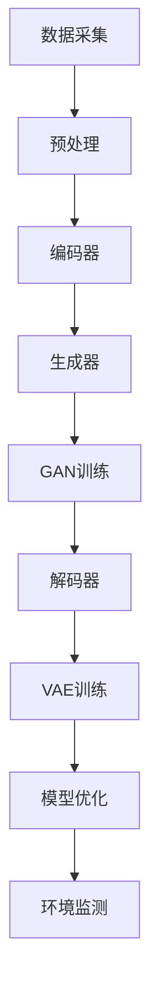

                 

### AIGC技术概述

**背景介绍**

随着人工智能技术的迅猛发展，自适应智能生成控制（Adaptive Intelligent Generation Control，简称AIGC）作为一种新兴的技术，正逐渐引起广泛关注。AIGC是一种结合了生成对抗网络（GAN）、变分自编码器（VAE）和强化学习等核心算法的智能控制技术，它不仅能够从大量数据中学习生成高质量的数据，还能够根据环境变化进行自适应调整。

在智能环境监测领域，AIGC技术具有极大的应用潜力。传统环境监测方法往往依赖于人工采集和分析数据，这不仅效率低下，而且容易受到数据噪声和缺失的影响。AIGC技术的引入，可以显著提高环境监测的准确性和实时性，降低监测成本，实现全方位、多尺度的环境监测。

**核心概念与联系**

AIGC技术包含了以下几个核心概念：

1. **生成对抗网络（GAN）**：GAN由生成器（Generator）和判别器（Discriminator）组成，通过对抗训练生成与真实数据相似的高质量数据。

2. **变分自编码器（VAE）**：VAE是一种概率生成模型，通过编码器和解码器的协同工作，将数据映射到一个低维空间，并能够从中生成新的数据。

3. **强化学习**：强化学习通过智能体与环境的交互，不断调整策略以最大化累积奖励。

这些核心概念之间的关系可以用以下Mermaid流程图表示：



**核心概念原理讲解**

生成对抗网络（GAN）：

生成器（Generator）的目的是生成与真实数据相似的数据，判别器（Discriminator）的目的是区分真实数据和生成数据。通过这种对抗训练，生成器不断提高生成数据的质量，判别器不断提高对真实和生成数据的区分能力。以下是一个简单的GAN训练过程的伪代码：

```pseudo
function GAN_train(generator, discriminator, data_loader):
    for epoch in range(num_epochs):
        for real_data in data_loader:
            # 训练判别器
            discriminator.train(real_data)
            generator_data = generator.generate_noise()
            generator.train(generator_data, discriminator)
        # 打印训练信息
        print(f"Epoch {epoch}: Generator Loss = {generator.loss}, Discriminator Loss = {discriminator.loss}")
```

变分自编码器（VAE）：

VAE通过编码器（Encoder）将数据映射到一个低维空间，解码器（Decoder）将这个低维空间的数据还原回原始数据空间。VAE的损失函数包括重构损失和KL散度损失。以下是一个简单的VAE训练过程的伪代码：

```pseudo
function VAE_train(encoder, decoder, data_loader):
    for epoch in range(num_epochs):
        for data in data_loader:
            z = encoder.encode(data)
            reconstructed_data = decoder.decode(z)
            loss = reconstruction_loss(data, reconstructed_data) + kl_divergence_loss(z)
            optimizer.zero_grad()
            loss.backward()
            optimizer.step()
        # 打印训练信息
        print(f"Epoch {epoch}: Loss = {loss}")
```

强化学习：

强化学习通过智能体（Agent）与环境（Environment）的交互，不断调整策略（Policy）以最大化累积奖励（Reward）。以下是一个简单的强化学习训练过程的伪代码：

```pseudo
function RL_train(agent, environment, num_episodes):
    for episode in range(num_episodes):
        state = environment.reset()
        done = False
        total_reward = 0
        while not done:
            action = agent.select_action(state)
            next_state, reward, done = environment.step(action)
            agent.update_policy(state, action, reward, next_state)
            state = next_state
            total_reward += reward
        # 打印训练信息
        print(f"Episode {episode}: Total Reward = {total_reward}")
    return agent
```

**总结**

AIGC技术结合了生成对抗网络、变分自编码器和强化学习等核心算法，通过对抗训练和概率生成，实现了对数据的自适应学习和调整。在智能环境监测中，AIGC技术能够提高监测的准确性和效率，为环境监测提供了一种全新的解决方案。通过上述核心概念和算法原理的讲解，读者可以更好地理解AIGC技术的工作机制和应用前景。接下来，我们将进一步探讨智能环境监测的基本原理，为后续章节的深入探讨奠定基础。

