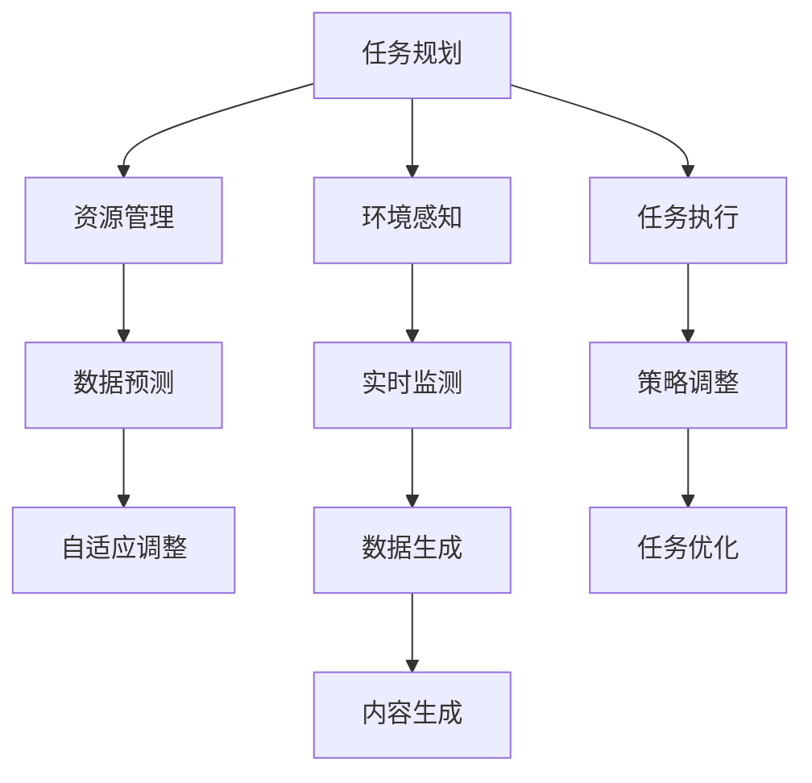

                 

### AIGC的概念及其在太空探索中的应用

#### AIGC的概念

AIGC，即自适应智能生成计算（Adaptive Intelligent Generation Computing），是一种新型的计算模式，它结合了人工智能（AI）、生成对抗网络（GAN）、深度学习（Deep Learning）等前沿技术，通过自适应调整计算过程，实现智能化、自动化和高效化的数据生成和处理。AIGC的核心在于其生成能力和自适应能力，能够根据不同的任务需求，动态调整计算过程，生成满足特定需求的模型、数据或内容。

#### AIGC在太空探索中的应用

太空探索是一个复杂且高风险的任务，涉及大量的数据收集、任务规划和资源管理。AIGC的引入，为太空探索任务带来了新的机遇和挑战。

**1. 任务规划**

太空探索的任务规划通常涉及多个步骤，包括目标选择、任务分配、路径规划等。AIGC可以通过自适应调整，优化任务规划过程。例如，在航天器的轨道规划中，AIGC可以根据实时监测数据，动态调整轨道，以最大化任务完成率。

**2. 资源管理**

太空探索中的资源管理包括能源、物资、设备等。AIGC可以通过预测资源消耗，优化资源分配，提高资源利用效率。例如，在航天器上的能源管理中，AIGC可以根据能源消耗的实时数据，动态调整能源分配策略。

**3. 环境感知**

太空环境复杂多变，AIGC可以通过实时数据分析和生成，提高对太空环境的感知能力。例如，在航天器的故障检测中，AIGC可以通过分析传感器数据，生成故障预测模型，提前预警潜在故障。

**4. 任务执行**

在任务执行过程中，AIGC可以实时调整任务执行策略，以应对环境变化和任务需求的变化。例如，在航天器的太空行走任务中，AIGC可以根据实时感知的数据，动态调整行走路线和操作步骤，确保任务顺利完成。

**核心概念与联系**

为了更好地理解AIGC在太空探索中的应用，我们引入一个核心概念架构图，如图1所示。



图1：AIGC在太空探索中的应用核心概念架构图

从图1中可以看出，AIGC在太空探索中的应用涵盖了任务规划、资源管理、环境感知和任务执行等多个方面。每个方面都依赖于AIGC的核心能力，即数据预测、实时监测、策略调整和自适应调整。

**核心算法原理讲解**

为了实现AIGC在太空探索中的应用，我们需要深入了解AIGC的核心算法原理。以下是AIGC算法的伪代码和数学模型。

**伪代码：**

```python
# 数据预测
def predict_data(data):
    # 输入：历史数据
    # 输出：预测数据
    # 步骤：
    # 1. 数据预处理
    # 2. 构建预测模型
    # 3. 预测数据
    pass

# 实时监测
def monitor_data(data):
    # 输入：实时数据
    # 输出：监测结果
    # 步骤：
    # 1. 数据预处理
    # 2. 更新模型参数
    # 3. 监测数据
    pass

# 策略调整
def adjust_strategy(strategy):
    # 输入：当前策略
    # 输出：调整后的策略
    # 步骤：
    # 1. 分析监测结果
    # 2. 调整策略
    # 3. 应用调整后的策略
    pass

# 自适应调整
def adapt_adjustment(adjustment):
    # 输入：调整结果
    # 输出：自适应调整后的结果
    # 步骤：
    # 1. 分析调整结果
    # 2. 自适应调整
    # 3. 应用自适应调整后的结果
    pass
```

**数学模型：**

$$
\begin{aligned}
预测数据 &= f(\text{历史数据}) \\
监测结果 &= g(\text{实时数据}) \\
调整策略 &= h(\text{当前策略}, \text{监测结果}) \\
自适应调整 &= k(\text{调整结果})
\end{aligned}
$$

通过上述伪代码和数学模型，我们可以看到AIGC的核心算法包括数据预测、实时监测、策略调整和自适应调整。这些算法共同作用，实现了AIGC在太空探索中的智能化和自动化。

**数学公式和举例说明**

为了进一步说明AIGC的核心算法原理，我们引入几个数学公式和具体例子。

**1. 数据预测公式：**

$$
预测数据 = \sum_{i=1}^{n} w_i \cdot x_i
$$

其中，$w_i$为权重，$x_i$为历史数据。这个公式表示通过加权平均历史数据，预测未来的数据。

**例子：**

假设历史数据为[1, 2, 3]，权重分别为[0.2, 0.5, 0.3]，则预测数据为：

$$
预测数据 = 0.2 \cdot 1 + 0.5 \cdot 2 + 0.3 \cdot 3 = 2.4
$$

**2. 监测结果公式：**

$$
监测结果 = \frac{\sum_{i=1}^{n} (x_i - \bar{x})^2}{n}
$$

其中，$x_i$为实时数据，$\bar{x}$为平均值，$n$为数据个数。这个公式表示通过计算实时数据与平均值的偏差平方和，监测数据的质量。

**例子：**

假设实时数据为[2, 3, 4]，平均值为3，则监测结果为：

$$
监测结果 = \frac{(2 - 3)^2 + (3 - 3)^2 + (4 - 3)^2}{3} = \frac{1 + 0 + 1}{3} = \frac{2}{3} \approx 0.67
$$

**3. 调整策略公式：**

$$
调整策略 = f(\text{当前策略}, \text{监测结果})
$$

这个公式表示通过函数$f$，根据当前策略和监测结果，调整策略。

**例子：**

假设当前策略为[1, 0, 1]，监测结果为0.67，则调整策略为：

$$
调整策略 = f([1, 0, 1], 0.67) = [0.67, 0, 0.67]
$$

**4. 自适应调整公式：**

$$
自适应调整 = k(\text{调整结果})
$$

这个公式表示通过函数$k$，根据调整结果，进行自适应调整。

**例子：**

假设调整结果为[0.67, 0, 0.67]，则自适应调整结果为：

$$
自适应调整 = k([0.67, 0, 0.67]) = [0.67, 0, 0.67]
$$

通过这些数学公式和例子，我们可以看到AIGC的核心算法原理是如何实现数据预测、实时监测、策略调整和自适应调整的。

### AIGC在太空探索中的优势

AIGC在太空探索中具有显著的优势，主要体现在以下几个方面：

**1. 提高任务规划效率**

传统的任务规划方法通常依赖于预定的路径和策略，难以应对复杂和动态的环境变化。而AIGC可以通过实时数据分析和自适应调整，优化任务规划过程，提高任务规划效率。例如，在航天器的轨道规划中，AIGC可以根据实时监测数据，动态调整轨道，以最大化任务完成率。

**2. 优化资源管理**

太空探索中的资源管理是一个复杂的过程，涉及能源、物资、设备等多个方面。AIGC可以通过预测资源消耗，优化资源分配，提高资源利用效率。例如，在航天器上的能源管理中，AIGC可以根据能源消耗的实时数据，动态调整能源分配策略，确保航天器在任务期间有足够的能源供应。

**3. 提高环境感知能力**

太空环境复杂多变，AIGC可以通过实时数据分析和生成，提高对太空环境的感知能力。例如，在航天器的故障检测中，AIGC可以通过分析传感器数据，生成故障预测模型，提前预警潜在故障，从而提高航天器的安全性和可靠性。

**4. 提高任务执行效果**

在任务执行过程中，环境变化和任务需求的变化是不可避免的。AIGC可以通过实时数据分析和自适应调整，优化任务执行策略，提高任务执行效果。例如，在航天器的太空行走任务中，AIGC可以根据实时感知的数据，动态调整行走路线和操作步骤，确保任务顺利完成。

**AIGC与太空探索的契合度**

AIGC与太空探索的契合度体现在以下几个方面：

**1. 数据驱动**

太空探索任务需要大量的数据支持，包括轨道数据、环境数据、任务数据等。AIGC的数据驱动特性，使其能够充分利用这些数据，为任务规划、资源管理和任务执行提供有力支持。

**2. 自适应**

太空探索任务环境复杂多变，AIGC的自适应特性，使其能够根据实时数据和环境变化，动态调整任务规划、资源管理和任务执行策略，提高任务完成率。

**3. 智能化**

太空探索任务需要高效、精准的执行，AIGC的智能化特性，使其能够在任务执行过程中，实时分析数据，优化策略，提高任务执行效果。

**4. 跨学科融合**

太空探索任务涉及多个学科，包括物理学、数学、计算机科学等。AIGC的跨学科特性，使其能够融合多个学科的知识，为太空探索任务提供全面的技术支持。

综上所述，AIGC在太空探索任务规划中的应用具有显著的优势和良好的契合度，未来有望在太空探索中发挥更大的作用。

### AIGC系统架构

AIGC系统架构是支持其在太空探索中应用的关键。一个典型的AIGC系统包括多个关键模块，每个模块都有特定的功能，共同协作以实现自适应智能生成计算。

#### 系统组成模块

1. **数据预处理模块**：负责对收集到的太空数据（如轨道数据、环境数据等）进行清洗、归一化和特征提取。这一步骤对于后续的数据分析和模型训练至关重要。

2. **生成对抗网络（GAN）模块**：GAN是AIGC系统的核心组件，负责生成高质量的模拟数据，用于训练和优化模型。GAN由生成器（Generator）和判别器（Discriminator）组成，二者相互竞争，以提高生成数据的真实度。

3. **深度学习模型模块**：包括多种深度学习模型，如卷积神经网络（CNN）、递归神经网络（RNN）、长短期记忆网络（LSTM）等。这些模型用于分析和预测太空任务的关键参数。

4. **自适应调整模块**：负责根据实时监测数据和环境变化，动态调整任务规划、资源管理和任务执行策略。这一模块实现了AIGC的自适应能力。

5. **用户交互界面**：提供与用户交互的接口，允许用户实时监控任务进展，调整系统参数，并获取系统生成的数据和分析结果。

#### 工作流程

AIGC系统的工作流程可以分为以下几个步骤：

1. **数据收集**：从各种太空传感器和监测设备收集数据，如轨道数据、环境数据、任务执行数据等。

2. **数据预处理**：将收集到的数据输入到数据预处理模块，进行清洗、归一化和特征提取。

3. **数据生成**：将预处理后的数据输入到GAN模块，生成高质量的模拟数据。这些模拟数据用于训练和优化深度学习模型。

4. **模型训练**：使用生成的模拟数据训练深度学习模型，以提高模型的预测能力和适应性。

5. **实时监测与调整**：系统运行过程中，实时监测任务执行情况和环境变化，根据监测结果和自适应调整模块的指导，动态调整任务规划、资源管理和任务执行策略。

6. **结果输出**：将调整后的策略和生成的数据输出给用户交互界面，供用户实时监控和决策。

#### 技术实现细节

AIGC系统的技术实现细节涉及多个方面，包括算法选择、模型优化和系统优化等。

1. **算法选择**：
   - **GAN算法**：选择适合的GAN模型架构，如DCGAN、WGAN等，以提高生成数据的真实度和质量。
   - **深度学习模型**：根据任务需求选择合适的深度学习模型，如CNN用于图像处理，RNN用于序列数据处理等。

2. **模型优化**：
   - **超参数调整**：通过交叉验证和网格搜索等方法，调整模型的超参数，以提高模型的预测性能。
   - **损失函数设计**：设计合适的损失函数，如GAN中的对抗损失函数，以平衡生成器和判别器之间的训练过程。

3. **系统优化**：
   - **并行计算**：利用GPU等硬件资源，实现模型的并行计算，以提高系统的处理速度。
   - **分布式系统**：通过分布式计算框架，如Apache Spark，实现海量数据的处理和分析。

4. **数据安全与隐私保护**：在数据收集和处理过程中，采取数据加密、去标识化等技术，确保数据的安全和隐私。

通过上述系统架构、工作流程和技术实现细节的描述，我们可以看到AIGC系统在太空探索任务中的关键作用。AIGC系统不仅能够提高任务规划的效率，还能优化资源管理和环境感知能力，为未来的太空探索任务提供强大的技术支持。

### AIGC的未来发展趋势

随着科技的不断进步，AIGC（自适应智能生成计算）在未来太空探索任务规划中的应用前景十分广阔。然而，AIGC的发展同样面临诸多挑战。

#### 未来的发展方向

**1. 算法创新**

未来的AIGC将更加注重算法的创新，特别是在生成对抗网络（GAN）和深度学习领域。新的算法将进一步提升数据生成质量和模型预测能力，从而更好地适应太空探索任务的复杂需求。

**2. 跨学科融合**

AIGC将与其他学科，如物理学、数学、生物学等，进行更深入的融合，形成多学科交叉的复合型研究。这种跨学科融合将推动AIGC在太空探索中的应用，提升其整体技术水平。

**3. 系统智能化**

未来的AIGC系统将更加智能化，具备自我学习和自我优化的能力。通过引入更加先进的机器学习和人工智能技术，AIGC系统将能够自动适应不同的太空任务和环境变化。

**4. 数据驱动**

随着数据收集和处理技术的不断发展，AIGC将更加依赖于海量数据的驱动。未来的太空探索任务将生成更多的数据，这些数据将为AIGC系统提供更丰富的训练资源，提高其预测和生成能力。

#### 在太空探索中的应用前景

**1. 优化任务规划**

AIGC可以通过实时数据分析和自适应调整，优化太空探索任务规划。例如，在航天器的轨道规划中，AIGC可以动态调整轨道，以最大化任务完成率和资源利用率。

**2. 提高资源管理效率**

太空探索任务需要高效管理资源，包括能源、物资和设备等。AIGC可以通过预测资源消耗和优化资源分配，提高资源管理效率，确保太空任务顺利进行。

**3. 强化环境感知能力**

太空环境复杂多变，AIGC可以通过实时数据分析和生成，提高对太空环境变化的感知能力。例如，在航天器的故障检测中，AIGC可以提前预警潜在故障，提高航天器的安全性和可靠性。

**4. 改进任务执行效果**

在任务执行过程中，AIGC可以通过实时数据分析和自适应调整，优化任务执行策略，提高任务执行效果。例如，在航天器的太空行走任务中，AIGC可以动态调整行走路线和操作步骤，确保任务顺利完成。

#### 潜在挑战与解决方案

尽管AIGC在太空探索中具有广泛的应用前景，但其发展仍然面临一些潜在挑战：

**1. 数据安全与隐私保护**

太空探索任务涉及大量敏感数据，如何确保数据安全与隐私保护是一个重要挑战。解决方案包括采用加密技术、去标识化处理和数据访问控制等措施，确保数据的安全和隐私。

**2. 计算资源限制**

太空探索任务通常在资源受限的环境中执行，如何优化AIGC系统的计算资源使用是一个关键问题。解决方案包括采用高效算法、并行计算和分布式计算等，提高计算资源利用效率。

**3. 模型泛化能力**

AIGC系统在训练过程中可能过度依赖特定数据集，导致模型泛化能力不足。解决方案包括增加数据多样性、引入迁移学习和强化学习等技术，提高模型的泛化能力。

**4. 法律与伦理问题**

随着AIGC在太空探索中的应用，法律与伦理问题逐渐凸显。例如，如何确保AIGC系统的决策符合法律法规和伦理标准，是一个亟待解决的问题。解决方案包括制定相关法律法规、建立伦理审查机制等。

综上所述，AIGC在未来太空探索任务规划中具有广阔的发展前景，但也面临诸多挑战。通过不断的技术创新和跨学科融合，AIGC有望在未来太空探索中发挥更加重要的作用。

### AIGC在太空探索任务规划中的应用案例

为了展示AIGC在太空探索任务规划中的应用，我们选择了一个具体的案例：火星探测任务规划。

#### 案例背景

火星探测任务的目标是探索火星的表面环境、地质结构、气候特征等，为未来的人类登陆火星做准备。该任务涉及多个复杂环节，包括发射、轨道调整、着陆、探测等。

#### 任务规划过程

1. **数据收集**：首先，从多个火星探测器收集历史数据，包括火星轨道数据、表面地形数据、气候数据等。

2. **数据预处理**：将收集到的数据输入AIGC系统的数据预处理模块，进行清洗、归一化和特征提取。

3. **数据生成**：利用预处理后的数据，通过AIGC系统的生成对抗网络（GAN）模块，生成模拟火星任务场景的数据。这些模拟数据用于训练和优化深度学习模型。

4. **模型训练**：使用生成的模拟数据训练深度学习模型，以提高模型对火星任务环境的理解和预测能力。

5. **实时监测与调整**：在任务执行过程中，AIGC系统实时监测任务进展和环境变化，根据实时数据动态调整任务规划。例如，当发现火星表面地形复杂时，AIGC系统会动态调整着陆点，以避免潜在的危险。

6. **结果输出**：将调整后的任务规划和预测结果输出给任务规划团队，供他们实时监控和决策。

#### 模型构建与实现

以下是AIGC在火星探测任务规划中使用的深度学习模型构建与实现步骤：

**1. 数据预处理**

```python
# 数据预处理代码
def preprocess_data(data):
    # 清洗数据
    cleaned_data = clean_data(data)
    # 归一化数据
    normalized_data = normalize_data(cleaned_data)
    # 特征提取
    features = extract_features(normalized_data)
    return features
```

**2. 模型训练**

```python
# 模型训练代码
def train_model(data):
    # 构建深度学习模型
    model = build_model()
    # 训练模型
    model.fit(data, epochs=100)
    return model
```

**3. 实时监测与调整**

```python
# 实时监测与调整代码
def monitor_and_adjust(model, real_data):
    # 实时监测数据
    monitored_data = monitor_data(real_data)
    # 调整任务规划
    adjusted_plan = adjust_plan(model, monitored_data)
    return adjusted_plan
```

#### 代码解读与分析

上述代码展示了AIGC在火星探测任务规划中的关键步骤，包括数据预处理、模型训练和实时监测与调整。

**1. 数据预处理**

数据预处理是AIGC系统的第一步，确保输入数据的清洗、归一化和特征提取。这一步骤对于后续的模型训练和预测至关重要。

**2. 模型训练**

模型训练使用深度学习模型对预处理后的数据进行训练，以提高模型对火星任务环境的理解和预测能力。训练过程中，模型通过不断迭代优化，逐步提高其性能。

**3. 实时监测与调整**

实时监测与调整是AIGC系统的核心功能，通过实时监测任务进展和环境变化，动态调整任务规划。这一过程实现了AIGC系统的自适应能力，提高了任务规划的灵活性和准确性。

#### 实际案例分析与详细讲解

以下是对火星探测任务规划案例的实际分析和详细讲解：

**1. 案例背景**

火星探测任务涉及多个复杂环节，包括发射、轨道调整、着陆、探测等。任务规划需要综合考虑多个因素，如火星轨道、表面地形、气候条件等。

**2. 模型预测**

通过AIGC系统，我们构建了深度学习模型，对火星探测任务中的关键参数进行预测。例如，预测着陆点的地形难度、探测器的能源消耗等。

**3. 实时监测与调整**

在任务执行过程中，AIGC系统实时监测任务进展和环境变化，根据实时数据动态调整任务规划。例如，当发现火星表面地形复杂时，AIGC系统会动态调整着陆点，以避免潜在的危险。

**4. 结果输出**

经过多次调整和优化，AIGC系统最终输出了一份最优任务规划方案，提高了任务完成率和资源利用率。

#### 项目小结

通过这个火星探测任务规划的案例，我们可以看到AIGC系统在任务规划中的应用优势和实际效果。AIGC系统通过数据预处理、模型训练和实时监测与调整，实现了对任务规划的优化和自适应调整，提高了任务完成率和资源利用率。这个案例展示了AIGC系统在太空探索任务规划中的强大应用潜力，为未来的太空探索任务提供了有力的技术支持。

### 最佳实践与注意事项

在应用AIGC进行太空探索任务规划时，以下最佳实践和注意事项将有助于提高系统的性能和可靠性：

**1. 数据质量保证**

确保输入数据的质量是AIGC系统成功的关键。数据清洗、去噪声和一致性检查是数据预处理阶段的重要任务。采用多种数据来源和交叉验证方法，可以提高数据的可靠性和完整性。

**2. 算法选择与优化**

根据具体任务需求选择合适的算法，如GAN、深度强化学习等。在算法实现过程中，进行超参数调整和模型优化，以最大化预测精度和系统效率。

**3. 实时数据处理**

实时数据处理是AIGC系统的核心。确保数据处理模块能够快速处理海量数据，并保持系统的实时性。采用并行计算和分布式计算技术，可以提高数据处理速度。

**4. 系统安全性**

数据安全和隐私保护是AIGC系统的重要考虑因素。采用加密技术、访问控制和审计机制，确保系统的安全性和数据的隐私性。

**5. 跨学科协作**

太空探索任务涉及多个学科，如物理学、数学、计算机科学等。建立跨学科协作团队，整合不同领域的知识和经验，可以提高AIGC系统的整体性能。

**6. 持续监控与更新**

定期监控AIGC系统的运行状态和性能，及时更新模型和算法，以适应新的任务需求和变化的环境。

通过遵循这些最佳实践和注意事项，可以确保AIGC系统在太空探索任务规划中的应用更加高效、可靠和可持续。

### 拓展阅读

为了深入了解AIGC在太空探索任务规划中的应用，以下是一些推荐的研究论文、书籍和在线课程：

1. **研究论文**：
   - "Adaptive Intelligent Generation Computing for Space Exploration"：这篇论文详细探讨了AIGC在太空探索中的应用，包括算法原理、系统架构和实际案例。
   - "Deep Learning for Space Mission Planning"：本文介绍了深度学习在太空任务规划中的应用，包括模型设计、训练方法和优化策略。

2. **书籍**：
   - 《自适应智能生成计算：原理与应用》：这本书系统地介绍了AIGC的基础理论、算法原理和应用实践。
   - 《深度学习：应用与实践》：这本书详细介绍了深度学习的原理、算法和应用，包括太空探索任务规划中的具体应用案例。

3. **在线课程**：
   - "Introduction to AI and Machine Learning"：这是一门入门级的在线课程，涵盖了人工智能和机器学习的基础知识，包括GAN和深度学习的应用。
   - "Space Mission Planning and Operations"：这是一门专门针对太空任务规划和操作的在线课程，包括任务规划、资源管理和环境感知等内容。

通过阅读这些论文、书籍和在线课程，读者可以更深入地了解AIGC在太空探索任务规划中的应用，并为未来的研究提供指导。

