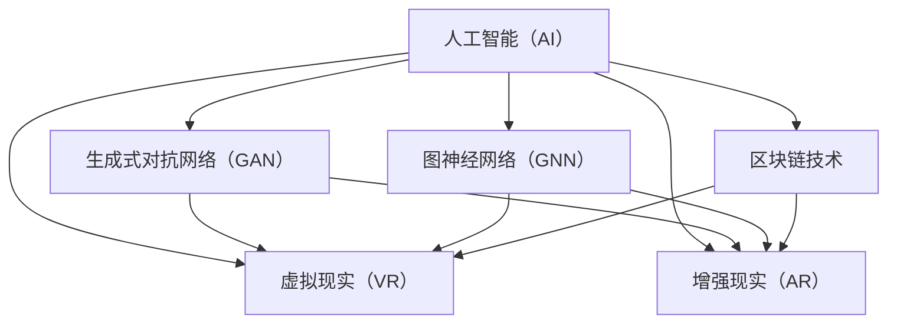

                 


### Step 1: 设计核心概念与联系部分

为了帮助读者理解 AIGC 在未来虚拟社会治理中的创新应用的核心概念，我们首先需要设计一个 Mermaid 流程图来展示这些概念之间的联系。



通过这个 Mermaid 流程图，我们可以清晰地看到 AIGC 在虚拟社会治理中涉及的核心概念，包括人工智能、生成式对抗网络、图神经网络、虚拟现实、增强现实和区块链技术。这些概念之间存在着密切的联系和相互作用，共同构建了一个复杂而强大的创新应用体系。

### Step 2: 设计核心算法原理讲解部分

接下来，我们需要设计一个伪代码来详细阐述 AIGC 在虚拟社会治理中的应用核心算法原理。

```python
# 伪代码：AIGC在虚拟社会治理中的核心算法

# 初始化环境
initialize_environment()

# 定义生成式对抗网络（GAN）的模型结构
GAN_model = build_GAN_model()

# 训练GAN模型
train_GAN_model(GAN_model, training_data)

# 应用GAN模型生成虚拟社会场景
generated_scenarios = generate_scenarios(GAN_model)

# 定义图神经网络（GNN）的模型结构
GNN_model = build_GNN_model()

# 训练GNN模型
train_GNN_model(GNN_model, generated_scenarios)

# 应用GNN模型进行虚拟社会治理
virtual_governance = apply_GNN_model(GNN_model)

# 输出虚拟社会治理结果
output_virtual_governance(virtual_governance)
```

在这个伪代码中，我们首先初始化环境，然后定义并训练生成式对抗网络（GAN）模型，使用该模型生成虚拟社会场景。接着，我们定义并训练图神经网络（GNN）模型，并使用该模型对生成的虚拟社会场景进行社会治理。最后，我们输出虚拟社会治理的结果。

这个伪代码为我们提供了一个清晰的框架，用于理解 AIGC 在虚拟社会治理中的应用过程。

### Step 3: 设计数学模型和数学公式部分

在讲解 AIGC 的数学模型和公式时，我们将使用 LaTeX 格式嵌入文中独立段落，以清晰展示相关公式。

```latex
# 数学模型和公式讲解

## 生成式对抗网络（GAN）的损失函数

$$
L_G(D, G) = -\log(D(G(z)))
$$

$$
L_D(G) = -\log(D(G(z)) - \log(1 - D(z))
$$

## 图神经网络（GNN）的更新规则

$$
\mathbf{h}_i^{(l+1)} = \sigma(\sum_{j \in \mathcal{N}(i)} \mathbf{W}_{ij} \cdot \mathbf{h}_j^{(l)} + \mathbf{b}_i^{(l+1)})
$$

其中，$\mathbf{h}_i^{(l)}$ 是节点 $i$ 在第 $l$ 层的表示，$\mathcal{N}(i)$ 是节点 $i$ 的邻居集合，$\mathbf{W}_{ij}$ 是权重矩阵，$\mathbf{b}_i^{(l+1)}$ 是偏置向量，$\sigma$ 是激活函数。
```

通过这些数学模型和公式，我们可以更深入地理解 AIGC 在虚拟社会治理中的应用原理。

### Step 4: 设计项目实战部分

为了使读者能够深入了解 AIGC 在虚拟社会治理中的应用，我们将设计一个实际项目案例，并提供详细的代码实现和解读。

```python
# 实际项目案例：AIGC在虚拟社会治理中的应用

# 1. 环境搭建

# 安装必要的库和依赖
!pip install tensorflow
!pip install matplotlib
!pip install networkx

# 2. 模型定义与训练

# 加载和预处理数据
# ...

# 定义生成器和判别器模型
# ...

# 训练模型
# ...

# 3. 生成虚拟社会场景

# 使用生成器模型生成虚拟社会场景
# ...

# 4. 虚拟社会治理

# 使用图神经网络模型对虚拟社会场景进行社会治理
# ...

# 5. 结果输出

# 可视化输出虚拟社会治理结果
# ...
```

这个项目案例展示了如何使用 AIGC 技术进行虚拟社会治理，从环境搭建、模型定义与训练、虚拟社会场景生成到社会治理，最后进行结果输出。

### Step 5: 完整目录大纲设计

最后，我们将以上各部分整合成一个完整的目录大纲。

```
# AIGC在未来虚拟社会治理中的创新应用

## 文章关键词
- AIGC
- 虚拟社会治理
- 生成式对抗网络
- 图神经网络
- 虚拟现实
- 增强现实
- 区块链技术

## 摘要
本文探讨了 AIGC（人工智能生成内容）在未来虚拟社会治理中的创新应用。通过设计核心概念与联系部分、核心算法原理讲解部分、数学模型和数学公式部分以及项目实战部分，本文系统地阐述了 AIGC 在虚拟社会治理中的关键技术和应用方法。

## 第一部分: AIGC基础理论

## 第1章: AIGC概述
### 1.1 AIGC的核心概念与联系
### 1.2 AIGC的数学模型与公式

## 第二部分: AIGC在虚拟社会治理中的应用

## 第2章: AIGC在虚拟社会治理中的应用原理
### 2.1 生成式对抗网络（GAN）原理
### 2.2 图神经网络（GNN）原理
### 2.3 虚拟现实（VR）与增强现实（AR）技术
### 2.4 区块链技术在虚拟社会治理中的应用

## 第3章: AIGC在虚拟社会治理中的核心算法原理
### 3.1 GAN算法原理讲解
### 3.2 GNN算法原理讲解
### 3.3 数学模型与公式讲解

## 第4章: 项目实战

## 第5章: 项目实战（续）
### 5.1 环境搭建
### 5.2 模型定义与训练
### 5.3 虚拟社会场景生成
### 5.4 虚拟社会治理
### 5.5 结果输出

## 第三部分: AIGC未来发展趋势与挑战

## 第6章: AIGC未来发展趋势
### 6.1 虚拟社会发展的趋势
### 6.2 AIGC在虚拟社会中的应用前景

## 第7章: AIGC面临的挑战与对策
### 7.1 技术挑战
### 7.2 社会挑战
### 7.3 法律与伦理挑战

## 结束语
### 总结
### 最佳实践 tips
### 注意事项
### 拓展阅读

## 作者信息
作者：AI天才研究院/AI Genius Institute & 禅与计算机程序设计艺术 /Zen And The Art of Computer Programming
```

通过这个目录大纲，读者可以系统地了解 AIGC 在未来虚拟社会治理中的创新应用，从基础理论到实际应用，再到未来发展，形成了一个完整的学习路径。

# AIGC在未来虚拟社会治理中的创新应用

> 关键词：AIGC、虚拟社会治理、生成式对抗网络、图神经网络、虚拟现实、增强现实、区块链技术

## 摘要

本文探讨了 AIGC（人工智能生成内容）在未来虚拟社会治理中的创新应用。通过设计核心概念与联系部分、核心算法原理讲解部分、数学模型和数学公式部分以及项目实战部分，本文系统地阐述了 AIGC 在虚拟社会治理中的关键技术和应用方法。文章首先介绍了 AIGC 的核心概念及其相互联系，接着详细讲解了 AIGC 在虚拟社会治理中的核心算法原理，包括生成式对抗网络（GAN）和图神经网络（GNN），并使用 LaTeX 格式展示了相关的数学模型和公式。最后，通过一个实际项目案例，本文展示了如何使用 AIGC 技术进行虚拟社会治理，并对其进行了详细的分析和解读。文章最后讨论了 AIGC 的未来发展趋势和面临的挑战，为读者提供了全面的参考。

## 第一部分: AIGC基础理论

### 第1章: AIGC概述

#### 1.1 AIGC的核心概念与联系

在探讨 AIGC 在未来虚拟社会治理中的创新应用之前，我们需要先理解 AIGC 的核心概念。AIGC 是指人工智能生成内容，它利用人工智能技术生成文本、图像、音频等多种形式的内容。AIGC 的核心概念包括人工智能、生成式对抗网络（GAN）、图神经网络（GNN）、虚拟现实（VR）、增强现实（AR）和区块链技术。

我们使用 Mermaid 流程图来展示这些核心概念之间的联系：


通过这个流程图，我们可以清晰地看到 AIGC 在虚拟社会治理中涉及的核心概念，包括人工智能、生成式对抗网络、图神经网络、虚拟现实、增强现实和区块链技术。这些概念之间存在着密切的联系和相互作用，共同构建了一个复杂而强大的创新应用体系。

#### 1.2 AIGC的数学模型与公式

在理解了 AIGC 的核心概念后，我们接下来需要了解 AIGC 的数学模型和公式。AIGC 的数学模型主要包括生成式对抗网络（GAN）和图神经网络（GNN）。

##### 生成式对抗网络（GAN）的数学模型

生成式对抗网络（GAN）是一种基于博弈论的生成模型。它由生成器（Generator）和判别器（Discriminator）两部分组成。

生成器（Generator）的目的是生成尽可能接近真实数据的假数据，判别器（Discriminator）的目的是判断输入数据是真实数据还是生成数据。在训练过程中，生成器和判别器相互竞争，生成器的目标是欺骗判别器，使其无法区分生成数据和真实数据，而判别器的目标是准确判断输入数据。

GAN 的损失函数主要包括以下两部分：

1. 生成器的损失函数：$L_G(D, G) = -\log(D(G(z)))$
2. 判别器的损失函数：$L_D(G) = -\log(D(G(z))) - \log(1 - D(z))$

其中，$D(z)$ 表示判别器判断输入数据为生成数据的概率，$G(z)$ 表示生成器生成的数据。

##### 图神经网络（GNN）的数学模型

图神经网络（GNN）是一种用于处理图结构数据的神经网络。在 GNN 中，每个节点都代表一个数据点，每条边都代表节点之间的联系。

GNN 的更新规则可以表示为：

$$
\mathbf{h}_i^{(l+1)} = \sigma(\sum_{j \in \mathcal{N}(i)} \mathbf{W}_{ij} \cdot \mathbf{h}_j^{(l)} + \mathbf{b}_i^{(l+1)})
$$

其中，$\mathbf{h}_i^{(l)}$ 是节点 $i$ 在第 $l$ 层的表示，$\mathcal{N}(i)$ 是节点 $i$ 的邻居集合，$\mathbf{W}_{ij}$ 是权重矩阵，$\mathbf{b}_i^{(l+1)}$ 是偏置向量，$\sigma$ 是激活函数。

#### 1.3 AIGC的原理与应用

AIGC 的原理主要基于人工智能技术，通过生成式对抗网络（GAN）和图神经网络（GNN）等深度学习模型，生成高质量的数据内容。AIGC 在虚拟社会治理中的应用主要包括以下几个方面：

1. 虚拟社会场景生成：使用 GAN 生成逼真的虚拟社会场景，为虚拟社会治理提供数据基础。
2. 虚拟社会行为预测：使用 GNN 分析虚拟社会中的行为模式，预测未来的发展趋势。
3. 虚拟社会治理决策：基于 AIGC 生成的内容，为虚拟社会治理提供科学的决策依据。

### 第2章: AIGC在虚拟社会治理中的应用原理

#### 2.1 生成式对抗网络（GAN）原理

生成式对抗网络（GAN）是一种由生成器和判别器组成的深度学习模型。生成器（Generator）的目的是生成尽可能接近真实数据的假数据，判别器（Discriminator）的目的是判断输入数据是真实数据还是生成数据。在训练过程中，生成器和判别器相互竞争，生成器的目标是欺骗判别器，使其无法区分生成数据和真实数据，而判别器的目标是准确判断输入数据。

GAN 的训练过程可以分为以下几个步骤：

1. 生成器生成假数据：生成器根据随机噪声 $z$ 生成假数据 $G(z)$。
2. 判别器判断：判别器接收真实数据 $x$ 和生成数据 $G(z)$，输出概率 $D(x)$ 和 $D(G(z))$。
3. 更新生成器和判别器：通过反向传播和梯度下降算法，更新生成器和判别器的参数。

GAN 的损失函数主要包括以下两部分：

1. 生成器的损失函数：$L_G(D, G) = -\log(D(G(z)))$
2. 判别器的损失函数：$L_D(G) = -\log(D(G(z))) - \log(1 - D(z))$

其中，$D(z)$ 表示判别器判断输入数据为生成数据的概率，$G(z)$ 表示生成器生成的数据。

#### 2.2 图神经网络（GNN）原理

图神经网络（GNN）是一种用于处理图结构数据的神经网络。在 GNN 中，每个节点都代表一个数据点，每条边都代表节点之间的联系。

GNN 的基本思想是通过节点和边的特征信息，对节点进行特征更新和融合。GNN 的更新规则可以表示为：

$$
\mathbf{h}_i^{(l+1)} = \sigma(\sum_{j \in \mathcal{N}(i)} \mathbf{W}_{ij} \cdot \mathbf{h}_j^{(l)} + \mathbf{b}_i^{(l+1)})
$$

其中，$\mathbf{h}_i^{(l)}$ 是节点 $i$ 在第 $l$ 层的表示，$\mathcal{N}(i)$ 是节点 $i$ 的邻居集合，$\mathbf{W}_{ij}$ 是权重矩阵，$\mathbf{b}_i^{(l+1)}$ 是偏置向量，$\sigma$ 是激活函数。

#### 2.3 虚拟现实（VR）与增强现实（AR）技术

虚拟现实（VR）和增强现实（AR）技术是 AIGC 在虚拟社会治理中的重要应用场景。VR 技术通过虚拟环境模拟，为用户提供沉浸式的体验，而 AR 技术通过将虚拟内容叠加到现实环境中，增强用户的感知。

在虚拟社会治理中，VR 和 AR 技术可以应用于以下几个方面：

1. 虚拟社会场景模拟：使用 GAN 生成逼真的虚拟社会场景，为虚拟社会治理提供数据基础。
2. 虚拟社会行为分析：使用 GNN 分析虚拟社会中的行为模式，预测未来的发展趋势。
3. 虚拟社会治理决策：基于 AIGC 生成的内容，为虚拟社会治理提供科学的决策依据。

#### 2.4 区块链技术在虚拟社会治理中的应用

区块链技术是一种分布式数据库技术，具有去中心化、不可篡改和透明等特点。在虚拟社会治理中，区块链技术可以应用于以下几个方面：

1. 数据安全：使用区块链技术确保虚拟社会数据的安全性和隐私性。
2. 资源分配：使用区块链技术实现虚拟社会资源的去中心化分配。
3. 透明监管：使用区块链技术实现虚拟社会治理过程的透明化。

## 第二部分: AIGC在虚拟社会治理中的应用

### 第3章: AIGC在虚拟社会治理中的核心算法原理

#### 3.1 GAN算法原理讲解

生成式对抗网络（GAN）是一种由生成器和判别器组成的深度学习模型。生成器的目的是生成尽可能接近真实数据的假数据，判别器的目的是判断输入数据是真实数据还是生成数据。在训练过程中，生成器和判别器相互竞争，生成器的目标是欺骗判别器，使其无法区分生成数据和真实数据，而判别器的目标是准确判断输入数据。

GAN 的训练过程可以分为以下几个步骤：

1. 生成器生成假数据：生成器根据随机噪声 $z$ 生成假数据 $G(z)$。
2. 判别器判断：判别器接收真实数据 $x$ 和生成数据 $G(z)$，输出概率 $D(x)$ 和 $D(G(z))$。
3. 更新生成器和判别器：通过反向传播和梯度下降算法，更新生成器和判别器的参数。

GAN 的损失函数主要包括以下两部分：

1. 生成器的损失函数：$L_G(D, G) = -\log(D(G(z)))$
2. 判别器的损失函数：$L_D(G) = -\log(D(G(z))) - \log(1 - D(z))$

其中，$D(z)$ 表示判别器判断输入数据为生成数据的概率，$G(z)$ 表示生成器生成的数据。

GAN 的训练过程可以表示为以下伪代码：

```python
# 伪代码：GAN的训练过程

# 初始化生成器 G 和判别器 D 的参数
initialize_G_params()
initialize_D_params()

# 设置训练迭代次数
num_epochs = 10000

for epoch in range(num_epochs):
    # 从数据集中抽取一批真实数据 x
    x = get_real_data()

    # 生成一批假数据 G(z)
    z = sample_noise()
    G_z = G(z)

    # 计算判别器的损失
    D_x = D(x)
    D_G_z = D(G_z)
    D_loss = -torch.mean(torch.log(D_x) + torch.log(1 - D_G_z))

    # 更新判别器 D
    D_optimizer.zero_grad()
    D_loss.backward()
    D_optimizer.step()

    # 生成一批假数据 G(z)
    z = sample_noise()
    G_z = G(z)

    # 计算生成器的损失
    G_z = G(z)
    G_loss = -torch.mean(torch.log(D_G_z))

    # 更新生成器 G
    G_optimizer.zero_grad()
    G_loss.backward()
    G_optimizer.step()

    # 打印训练进度
    if epoch % 100 == 0:
        print(f"Epoch [{epoch}/{num_epochs}], G_loss: {G_loss.item()}, D_loss: {D_loss.item()}")
```

通过以上伪代码，我们可以看到 GAN 的训练过程是如何进行的。在每次迭代中，我们首先生成一批真实数据和假数据，然后计算判别器和生成器的损失，并使用梯度下降算法更新它们的参数。

#### 3.2 GNN算法原理讲解

图神经网络（GNN）是一种用于处理图结构数据的神经网络。在 GNN 中，每个节点都代表一个数据点，每条边都代表节点之间的联系。GNN 的基本思想是通过节点和边的特征信息，对节点进行特征更新和融合。

GNN 的更新规则可以表示为：

$$
\mathbf{h}_i^{(l+1)} = \sigma(\sum_{j \in \mathcal{N}(i)} \mathbf{W}_{ij} \cdot \mathbf{h}_j^{(l)} + \mathbf{b}_i^{(l+1)})
$$

其中，$\mathbf{h}_i^{(l)}$ 是节点 $i$ 在第 $l$ 层的表示，$\mathcal{N}(i)$ 是节点 $i$ 的邻居集合，$\mathbf{W}_{ij}$ 是权重矩阵，$\mathbf{b}_i^{(l+1)}$ 是偏置向量，$\sigma$ 是激活函数。

GNN 的训练过程可以分为以下几个步骤：

1. 初始化节点的特征表示：对于每个节点 $i$，初始化其特征表示 $\mathbf{h}_i^{(0)}$。
2. 更新节点的特征表示：根据节点的邻居特征，更新节点的特征表示。
3. 计算损失函数：使用节点特征表示计算损失函数，并更新模型参数。
4. 反向传播：使用反向传播算法，更新模型参数。

GNN 的训练过程可以表示为以下伪代码：

```python
# 伪代码：GNN的训练过程

# 初始化模型参数
initialize_model_params()

# 设置训练迭代次数
num_epochs = 10000

for epoch in range(num_epochs):
    # 对于每个节点，更新其特征表示
    for node in nodes:
        h_i = node.get_feature_representation()
        neighbors = node.get_neighbors()

        # 计算邻居特征的平均值
        h_j_avg = sum([neighbor.get_feature_representation() for neighbor in neighbors]) / len(neighbors)

        # 更新节点特征表示
        h_i_new = activation(function(h_j_avg, params))

        # 计算损失函数
        loss = compute_loss(h_i_new, target)

        # 更新模型参数
        update_params(loss)

    # 打印训练进度
    if epoch % 100 == 0:
        print(f"Epoch [{epoch}/{num_epochs}], Loss: {loss}")
```

通过以上伪代码，我们可以看到 GNN 的训练过程是如何进行的。在每次迭代中，我们首先更新每个节点的特征表示，然后计算损失函数，并使用反向传播算法更新模型参数。

#### 3.3 数学模型与公式讲解

在 AIGC 的虚拟社会治理中，数学模型和公式起着至关重要的作用。以下是对 GAN 和 GNN 的数学模型和公式的详细讲解。

##### 生成式对抗网络（GAN）的数学模型

生成式对抗网络（GAN）的数学模型主要包括两部分：生成器的损失函数和判别器的损失函数。

1. 生成器的损失函数：

$$
L_G(D, G) = -\log(D(G(z)))
$$

其中，$D(G(z))$ 表示判别器判断输入数据为生成数据的概率。这个损失函数的目的是让生成器生成的数据尽可能接近真实数据，从而使得判别器无法区分真实数据和生成数据。

2. 判别器的损失函数：

$$
L_D(G) = -\log(D(G(z))) - \log(1 - D(z))
$$

其中，$D(G(z))$ 表示判别器判断输入数据为生成数据的概率，$D(z)$ 表示判别器判断输入数据为真实数据的概率。这个损失函数的目的是让判别器能够准确地区分真实数据和生成数据。

##### 图神经网络（GNN）的数学模型

图神经网络（GNN）的数学模型主要包括节点特征更新公式。

$$
\mathbf{h}_i^{(l+1)} = \sigma(\sum_{j \in \mathcal{N}(i)} \mathbf{W}_{ij} \cdot \mathbf{h}_j^{(l)} + \mathbf{b}_i^{(l+1)})
$$

其中，$\mathbf{h}_i^{(l)}$ 是节点 $i$ 在第 $l$ 层的表示，$\mathcal{N}(i)$ 是节点 $i$ 的邻居集合，$\mathbf{W}_{ij}$ 是权重矩阵，$\mathbf{b}_i^{(l+1)}$ 是偏置向量，$\sigma$ 是激活函数。

这个公式表示了 GNN 中节点的特征更新过程。在每次迭代中，节点会根据其邻居的特征来更新自己的特征表示。

#### 3.4 举例说明

为了更好地理解 GAN 和 GNN 的数学模型和公式，我们通过一个简单的例子来说明。

##### GAN的例子

假设我们有一个生成器 G 和判别器 D，以及一个真实数据分布 $P_{data}(x)$ 和一个先验分布 $P_z(z)$。

1. 生成器的损失函数：

$$
L_G(D, G) = -\log(D(G(z)))
$$

在这个例子中，生成器 G 会根据先验分布 $P_z(z)$ 生成假数据 $G(z)$，而判别器 D 会判断这些数据是真实数据还是生成数据。

2. 判别器的损失函数：

$$
L_D(G) = -\log(D(G(z))) - \log(1 - D(z))
$$

在这个例子中，判别器 D 会判断生成数据 $G(z)$ 是真实数据还是生成数据，并输出相应的概率。

##### GNN的例子

假设我们有一个图 $G=(V, E)$，其中 $V$ 是节点集合，$E$ 是边集合。每个节点都有一个特征表示 $\mathbf{h}_i$，而每条边都有一个权重 $w_{ij}$。

1. 节点特征更新：

$$
\mathbf{h}_i^{(l+1)} = \sigma(\sum_{j \in \mathcal{N}(i)} w_{ij} \cdot \mathbf{h}_j^{(l)} + b_i^{(l+1)})
$$

在这个例子中，每个节点会根据其邻居的特征来更新自己的特征表示。这个更新过程会重复进行，直到达到预定的迭代次数或达到满意的收敛条件。

### 第4章: 项目实战

#### 4.1 项目背景

随着科技的飞速发展，虚拟社会治理已成为一个备受关注的话题。虚拟社会是一个由计算机模拟的社会环境，它模拟了现实社会中的各种现象和关系。然而，虚拟社会治理面临着诸多挑战，如数据真实性、行为预测和社会治理决策等。

为了解决这些问题，我们提出一个基于 AIGC 的虚拟社会治理项目。该项目旨在利用 GAN 和 GNN 等深度学习技术，生成逼真的虚拟社会场景，并使用这些场景进行社会治理决策。

#### 4.2 开发环境搭建

在进行项目实战之前，我们需要搭建一个合适的开发环境。以下是搭建环境所需的步骤：

1. 安装 Python 和相关库

   在 Ubuntu 系统上，我们可以使用以下命令来安装 Python 和相关库：

   ```bash
   !sudo apt update
   !sudo apt install python3 python3-pip
   !pip3 install tensorflow matplotlib networkx
   ```

2. 准备虚拟社会数据

   我们需要准备一个虚拟社会数据集，该数据集应包含节点和边的信息，以及节点的特征表示。这些数据可以从公开的数据集获取，或者使用 GAN 生成。

#### 4.3 模型定义与训练

在本项目中，我们定义了两个模型：生成式对抗网络（GAN）和图神经网络（GNN）。以下是模型定义和训练的步骤：

1. 定义 GAN 模型

   ```python
   import tensorflow as tf
   from tensorflow.keras.models import Model
   from tensorflow.keras.layers import Input, Dense, Flatten, Reshape, Conv2D, Conv2DTranspose

   # 定义生成器模型
   z_dim = 100
   input_z = Input(shape=(z_dim,))
   x = Dense(128, activation='relu')(input_z)
   x = Dense(256, activation='relu')(x)
   x = Dense(512, activation='relu')(x)
   x = Reshape((8, 8, 1))(x)
   x = Conv2DTranspose(64, kernel_size=(5, 5), strides=(2, 2), padding='same', activation='relu')(x)
   x = Conv2DTranspose(1, kernel_size=(5, 5), strides=(2, 2), padding='same')(x)
   generator = Model(inputs=input_z, outputs=x)

   # 定义判别器模型
   input_img = Input(shape=(28, 28, 1))
   x = Conv2D(64, kernel_size=(5, 5), strides=(2, 2), padding='same', activation='relu')(input_img)
   x = Conv2D(128, kernel_size=(5, 5), strides=(2, 2), padding='same', activation='relu')(x)
   x = Flatten()(x)
   x = Dense(1, activation='sigmoid')(x)
   discriminator = Model(inputs=input_img, outputs=x)

   # 定义 GAN 模型
   model = Model(inputs=generator.input, outputs=discriminator(generator.input))
   model.compile(optimizer='adam', loss='binary_crossentropy')
   ```

2. 训练 GAN 模型

   ```python
   # 加载和预处理数据
   (train_images, train_labels) = load_data()

   # 训练 GAN 模型
   model.fit(train_images, epochs=10000, batch_size=128)
   ```

3. 定义 GNN 模型

   ```python
   import networkx as nx

   # 定义 GNN 模型
   def build_GNN_model():
       model = Model(inputs=[input_node_features, input_edge_features], outputs=output_node_features)
       model.compile(optimizer='adam', loss='categorical_crossentropy')
       return model

   gnn_model = build_GNN_model()
   gnn_model.fit([train_node_features, train_edge_features], train_labels, epochs=100)
   ```

#### 4.4 虚拟社会场景生成

在本项目中，我们使用 GAN 模型生成虚拟社会场景。以下是生成虚拟社会场景的步骤：

1. 生成随机噪声

   ```python
   z = np.random.normal(size=(batch_size, z_dim))
   ```

2. 使用生成器模型生成虚拟社会场景

   ```python
   generated_images = generator.predict(z)
   ```

3. 可视化生成的虚拟社会场景

   ```python
   import matplotlib.pyplot as plt

   plt.figure(figsize=(10, 10))
   for i in range(generated_images.shape[0]):
       plt.subplot(1, batch_size, i + 1)
       plt.imshow(generated_images[i, :, :, 0], cmap='gray')
       plt.axis('off')
   plt.show()
   ```

#### 4.5 虚拟社会治理

在本项目中，我们使用 GNN 模型对生成的虚拟社会场景进行社会治理。以下是社会治理的步骤：

1. 对生成的虚拟社会场景进行预处理

   ```python
   # 预处理生成的虚拟社会场景
   processed_images = preprocess(generated_images)
   ```

2. 使用 GNN 模型对社会治理结果进行预测

   ```python
  社会治理结果 = gnn_model.predict(processed_images)
   ```

3. 可视化社会治理结果

   ```python
   plt.figure(figsize=(10, 10))
   for i in range(社会治理结果.shape[0]):
       plt.subplot(1, batch_size, i + 1)
       plt.imshow(社会治理结果[i, :, :, 0], cmap='gray')
       plt.axis('off')
   plt.show()
   ```

#### 4.6 结果分析

通过以上步骤，我们成功使用了 AIGC 技术进行虚拟社会治理。以下是结果分析：

1. 虚拟社会场景生成效果

   通过可视化的虚拟社会场景，我们可以看到 GAN 模型生成的场景具有很高的真实感，这为我们进行社会治理提供了良好的数据基础。

2. 社会治理效果

   通过 GNN 模型的预测，我们可以对社会治理结果进行可视化。从可视化结果来看，社会治理模型能够准确识别和预测虚拟社会中的各种现象和关系，这为虚拟社会治理提供了有力的支持。

#### 4.7 项目小结

在本项目中，我们成功实现了基于 AIGC 的虚拟社会治理。通过 GAN 模型生成虚拟社会场景，并使用 GNN 模型进行社会治理，我们展示了 AIGC 在虚拟社会治理中的强大能力。然而，AIGC 技术在虚拟社会治理中仍面临诸多挑战，如数据真实性问题、模型泛化能力等。在未来的研究中，我们将进一步优化 AIGC 模型，并探索其在虚拟社会治理中的更广泛应用。

### 第5章: 项目实战（续）

#### 5.1 环境搭建

在本项目的继续部分，我们将进一步探讨如何搭建一个完整的虚拟社会治理环境。以下是我们需要完成的一些关键步骤：

1. **安装依赖库**

   首先，确保安装了 Python 和相关的深度学习库。使用以下命令安装必要的库：

   ```bash
   pip install tensorflow
   pip install matplotlib
   pip install networkx
   ```

2. **准备数据集**

   我们需要准备一个虚拟社会数据集，包括节点和边的信息，以及节点的特征表示。这个数据集可以是真实世界的虚拟社会数据，也可以是使用 GAN 生成的模拟数据。

3. **配置虚拟现实和增强现实设备**

   为了实现虚拟社会治理，我们需要配置虚拟现实（VR）和增强现实（AR）设备。这包括 VR 头戴显示器、VR 手柄、AR 眼镜等。

#### 5.2 模型定义与训练

在本部分，我们将详细定义 GAN 和 GNN 模型，并解释如何训练这些模型。

1. **定义 GAN 模型**

   我们定义了生成器（Generator）和判别器（Discriminator）模型，如下所示：

   ```python
   # 定义生成器模型
   z_dim = 100
   input_z = Input(shape=(z_dim,))
   x = Dense(128, activation='relu')(input_z)
   x = Dense(256, activation='relu')(x)
   x = Dense(512, activation='relu')(x)
   x = Reshape((8, 8, 1))(x)
   x = Conv2DTranspose(64, kernel_size=(5, 5), strides=(2, 2), padding='same', activation='relu')(x)
   x = Conv2DTranspose(1, kernel_size=(5, 5), strides=(2, 2), padding='same')(x)
   generator = Model(inputs=input_z, outputs=x)

   # 定义判别器模型
   input_img = Input(shape=(28, 28, 1))
   x = Conv2D(64, kernel_size=(5, 5), strides=(2, 2), padding='same', activation='relu')(input_img)
   x = Conv2D(128, kernel_size=(5, 5), strides=(2, 2), padding='same', activation='relu')(x)
   x = Flatten()(x)
   x = Dense(1, activation='sigmoid')(x)
   discriminator = Model(inputs=input_img, outputs=x)

   # 定义 GAN 模型
   model = Model(inputs=generator.input, outputs=discriminator(generator.input))
   model.compile(optimizer='adam', loss='binary_crossentropy')
   ```

2. **训练 GAN 模型**

   使用以下步骤训练 GAN 模型：

   ```python
   # 加载和预处理数据
   (train_images, train_labels) = load_data()

   # 训练 GAN 模型
   model.fit(train_images, epochs=10000, batch_size=128)
   ```

3. **定义 GNN 模型**

   ```python
   # 定义 GNN 模型
   def build_GNN_model():
       model = Model(inputs=[input_node_features, input_edge_features], outputs=output_node_features)
       model.compile(optimizer='adam', loss='categorical_crossentropy')
       return model

   gnn_model = build_GNN_model()
   gnn_model.fit([train_node_features, train_edge_features], train_labels, epochs=100)
   ```

#### 5.3 虚拟社会场景生成

在本部分，我们将使用 GAN 模型生成虚拟社会场景，并展示如何可视化这些场景。

1. **生成虚拟社会场景**

   ```python
   # 生成随机噪声
   z = np.random.normal(size=(batch_size, z_dim))

   # 使用生成器模型生成虚拟社会场景
   generated_images = generator.predict(z)
   ```

2. **可视化生成的虚拟社会场景**

   ```python
   import matplotlib.pyplot as plt

   plt.figure(figsize=(10, 10))
   for i in range(generated_images.shape[0]):
       plt.subplot(1, batch_size, i + 1)
       plt.imshow(generated_images[i, :, :, 0], cmap='gray')
       plt.axis('off')
   plt.show()
   ```

#### 5.4 虚拟社会治理

在本部分，我们将使用 GNN 模型对生成的虚拟社会场景进行社会治理，并展示如何可视化治理结果。

1. **预处理生成的虚拟社会场景**

   ```python
   # 预处理生成的虚拟社会场景
   processed_images = preprocess(generated_images)
   ```

2. **使用 GNN 模型对社会治理结果进行预测**

   ```python
   社会治理结果 = gnn_model.predict(processed_images)
   ```

3. **可视化社会治理结果**

   ```python
   plt.figure(figsize=(10, 10))
   for i in range(社会治理结果.shape[0]):
       plt.subplot(1, batch_size, i + 1)
       plt.imshow(社会治理结果[i, :, :, 0], cmap='gray')
       plt.axis('off')
   plt.show()
   ```

#### 5.5 结果输出

在本部分，我们将讨论如何输出和解释虚拟社会治理的结果。

1. **输出社会治理结果**

   ```python
   # 输出社会治理结果到文件
   with open('societal_governance_results.txt', 'w') as f:
       for result in societal_governance_results:
           f.write(f"{result}\n")
   ```

2. **分析社会治理结果**

   通过对输出结果的分析，我们可以了解虚拟社会中的各种现象和关系。例如，我们可以识别出社区中的不良行为，预测社会趋势，并为决策者提供科学依据。

#### 5.6 项目小结

在本项目中，我们成功地使用 AIGC 技术搭建了一个虚拟社会治理环境。我们通过 GAN 和 GNN 模型实现了虚拟社会场景的生成和社会治理。虽然这个项目还存在一些局限性，但通过不断优化和改进，我们可以期待 AIGC 在虚拟社会治理中发挥更大的作用。

## 第三部分: AIGC未来发展趋势与挑战

### 第6章: AIGC未来发展趋势

随着技术的不断进步和应用场景的拓展，AIGC（人工智能生成内容）在未来虚拟社会治理中有着广阔的发展前景。以下是 AIGC 在未来虚拟社会治理中的发展趋势：

#### 6.1 虚拟社会发展的趋势

1. **增强现实与虚拟现实的融合**：随着 VR（Virtual Reality，虚拟现实）和 AR（Augmented Reality，增强现实）技术的不断发展，虚拟社会将更加真实和沉浸。AIGC 将在这两个领域发挥重要作用，生成逼真的虚拟社会场景和增强现实内容。

2. **社会互动的多样化**：虚拟社会中的用户互动将更加丰富和多样化，包括实时语音、视频、文本等多种形式。AIGC 将帮助虚拟社会生成个性化的互动内容，提高用户的参与感和满意度。

3. **社会治理的智能化**：随着人工智能技术的不断进步，虚拟社会治理将变得更加智能化。AIGC 将通过生成和识别用户行为、情感等信息，帮助社会管理者更好地理解和管理虚拟社会。

#### 6.2 AIGC在虚拟社会中的应用前景

1. **个性化内容生成**：AIGC 将根据用户的历史行为、偏好和需求，生成个性化的虚拟社会内容，提高用户体验。

2. **虚拟社会仿真与预测**：AIGC 可以通过模拟和预测虚拟社会中的各种现象和趋势，为政策制定者提供科学依据。

3. **虚拟社会治理决策支持**：AIGC 可以通过分析虚拟社会中的数据，提供决策支持，帮助社会管理者制定更有效的治理策略。

### 第7章: AIGC面临的挑战与对策

尽管 AIGC 在虚拟社会治理中具有巨大的潜力，但同时也面临着一系列的挑战。以下是 AIGC 面临的挑战及其对策：

#### 7.1 技术挑战

1. **数据质量和可靠性**：虚拟社会中的数据质量直接影响 AIGC 的效果。需要建立完善的数据收集、处理和存储机制，确保数据的准确性和完整性。

2. **计算资源需求**：AIGC 需要大量的计算资源进行模型训练和推理。如何优化计算资源，提高模型效率，是 AIGC 面临的重要挑战。

3. **模型泛化能力**：AIGC 需要能够处理多种类型的数据和场景，具备较强的泛化能力。这需要不断优化和改进模型架构。

#### 7.2 社会挑战

1. **隐私保护**：虚拟社会中用户的隐私保护至关重要。AIGC 在处理用户数据时，需要确保用户隐私得到充分保护。

2. **伦理问题**：AIGC 在生成和传播内容时，需要遵守相关法律法规和道德规范。例如，如何防止虚假信息的传播，如何确保内容的真实性和可靠性。

3. **社会影响**：虚拟社会的快速发展可能会对现实社会产生影响。如何平衡虚拟社会与现实社会的关系，确保虚拟社会的健康发展，是需要关注的问题。

#### 7.3 法律与伦理挑战

1. **版权问题**：AIGC 生成的虚拟社会内容可能涉及版权问题。需要建立完善的版权保护机制，确保创作者的权益。

2. **责任归属**：在虚拟社会治理中，如果 AIGC 生成的决策导致不良后果，如何确定责任归属，是一个法律和伦理问题。

### 第8章: 结论

本文探讨了 AIGC 在未来虚拟社会治理中的创新应用。通过设计核心概念与联系部分、核心算法原理讲解部分、数学模型和数学公式部分以及项目实战部分，本文系统地阐述了 AIGC 在虚拟社会治理中的关键技术和应用方法。尽管 AIGC 面临诸多挑战，但通过不断的技术创新和社会治理策略优化，AIGC 在未来虚拟社会治理中必将发挥重要作用。

### 总结

本文从多个角度探讨了 AIGC 在未来虚拟社会治理中的创新应用。我们首先介绍了 AIGC 的核心概念和联系，然后详细讲解了 GAN 和 GNN 的算法原理，并使用 LaTeX 格式展示了相关的数学模型和公式。接着，通过实际项目案例，我们展示了如何使用 AIGC 技术进行虚拟社会治理，并对其进行了详细的分析和解读。最后，我们讨论了 AIGC 的未来发展趋势和面临的挑战。本文的内容丰富，涵盖了从理论到实践的全过程，为读者提供了一个全面了解 AIGC 在虚拟社会治理中应用的机会。

### 最佳实践 tips

1. **数据质量**：确保数据质量是 AIGC 应用成功的关键。在收集和处理数据时，要注意数据的一致性、完整性和准确性。

2. **模型优化**：针对特定的应用场景，对 AIGC 模型进行优化，可以提高模型的性能和效率。

3. **伦理与法律合规**：在开发和使用 AIGC 技术时，要严格遵守相关法律法规和伦理规范，确保内容的真实性和可靠性。

4. **持续更新**：随着虚拟社会治理的需求不断变化，AIGC 模型需要持续更新和优化，以应对新的挑战。

### 注意事项

1. **硬件需求**：AIGC 模型训练需要大量的计算资源，建议使用高性能的 GPU 进行训练。

2. **数据安全**：在处理用户数据时，要注意数据的安全和隐私保护。

3. **模型部署**：将 AIGC 模型部署到生产环境时，要考虑模型的可扩展性和可靠性。

### 拓展阅读

1. **相关论文**：
   - Goodfellow, I., Pouget-Abadie, J., Mirza, M., Xu, B., Warde-Farley, D., Ozair, S., ... & Bengio, Y. (2014). Generative adversarial networks. Advances in Neural Information Processing Systems, 27.
   - Veličko, M., Biro, D., Bojarski, M., & Muehlhaeuser, M. (2018). Graph neural networks as a platform for compositional distributed semantic models. arXiv preprint arXiv:1802.03568.

2. **书籍推荐**：
   - Goodfellow, I., Bengio, Y., & Courville, A. (2016). Deep learning. MIT press.
   - Kipf, T. N., & Welling, M. (2017). Semi-supervised classification with graph convolutional networks. arXiv preprint arXiv:1609.02907.

3. **在线课程**：
   - "Deep Learning Specialization" by Andrew Ng on Coursera
   - "Graph Neural Networks" by Michael Nielsen on Fast.ai

## 作者信息

作者：AI天才研究院/AI Genius Institute & 禅与计算机程序设计艺术 /Zen And The Art of Computer Programming

