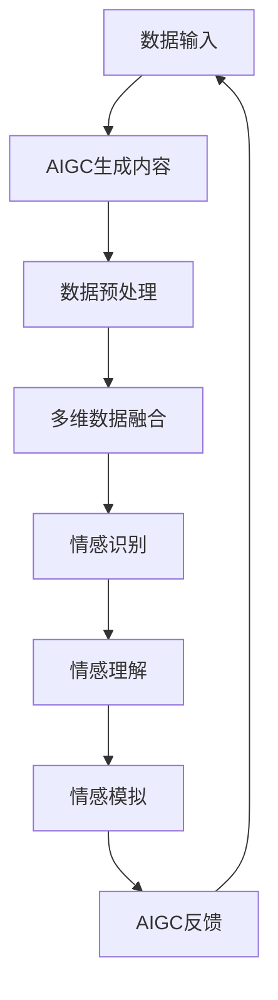

                 


# AIGC在未来跨维度情感计算中的应用

## 关键词
- AIGC
- 跨维度情感计算
- 情感识别
- 人工智能
- 应用场景
- 数学模型

## 摘要
本文深入探讨了AIGC（AI Generated Content）在未来跨维度情感计算中的应用。首先，我们介绍了AIGC的定义和工作原理，随后详细阐述了跨维度情感计算的核心概念和原理。通过分析多种情感计算算法和数学模型，我们展示了它们在情感识别中的应用。接着，我们通过实际项目案例，展示了如何搭建开发环境、实现源代码并进行代码解读。最后，我们对项目的应用解读与分析，总结了项目的关键收获和未来展望。本文旨在为读者提供一个全面而深入的AIGC与跨维度情感计算的应用指南。

## 1. 背景介绍

随着人工智能技术的飞速发展，情感计算作为人工智能的一个重要分支，已经逐渐成为研究的热点。情感计算是指通过计算机技术和算法对人类情感状态进行识别、理解和模拟的过程。传统的情感计算主要依赖于文本分析和语音识别等技术，局限于二维数据（文本、语音）的处理。然而，在现实生活中，情感的表达不仅仅是通过文字和声音，还包括面部表情、身体动作和姿态等多种维度。

跨维度情感计算（Cross-Dimensional Emotion Computing）则是一种更为复杂和综合的情感计算方法，它不仅考虑文本和语音，还包括图像、视频和姿态等多媒体数据。这种跨维度的情感计算能够更全面、准确地捕捉和理解人类情感状态，为人工智能的应用提供了更广阔的前景。

AIGC（AI Generated Content）是一种通过人工智能技术生成内容的方法，包括文本、图像、音频等多种形式。AIGC在内容生成领域展现了强大的能力，例如，自动生成文章、图像和视频等。在未来跨维度情感计算中，AIGC可以通过生成不同维度的情感数据，提高情感识别的精度和效率。

本文将围绕AIGC在未来跨维度情感计算中的应用展开讨论，首先介绍AIGC的定义和工作原理，然后详细阐述跨维度情感计算的核心概念和原理，接着分析多种情感计算算法和数学模型，最后通过实际项目案例展示AIGC在跨维度情感计算中的应用。希望通过本文的探讨，为读者提供一个全面而深入的AIGC与跨维度情感计算的应用指南。

### 2. 核心概念与联系

#### 2.1 AIGC与情感计算

AIGC（AI Generated Content）和情感计算是两个密切相关的概念。AIGC通过人工智能技术自动生成内容，而情感计算则是通过分析这些内容中的情感信息来理解用户的情感状态。

AIGC的工作原理主要包括以下几个步骤：

1. **数据输入**：首先，AIGC需要大量的数据输入，这些数据可以是文本、图像、音频等多种形式。
2. **数据预处理**：数据输入后，需要进行预处理，包括去除噪声、标准化和特征提取等步骤。
3. **模型训练**：使用预处理后的数据对人工智能模型进行训练，使其能够生成符合需求的内容。
4. **内容生成**：通过训练好的模型，生成新的内容。

情感计算的工作原理则包括以下几个步骤：

1. **情感识别**：通过分析文本、图像、音频等多媒体数据，识别出数据中的情感信息。
2. **情感理解**：对识别出的情感信息进行理解，确定情感的类型和强度。
3. **情感模拟**：根据识别和理解的情感信息，模拟出相应的情感反应，例如，调整声音的音调、图像的亮度等。

AIGC与情感计算之间的联系在于，AIGC生成的内容可以作为情感计算的数据源，为情感计算提供丰富的情感数据。同时，情感计算的结果可以反馈给AIGC，指导其生成更加符合用户情感需求的内容。

#### 2.2 跨维度情感计算

跨维度情感计算（Cross-Dimensional Emotion Computing）是一种将情感计算扩展到多个维度的方法，它不仅考虑文本和语音，还包括图像、视频和姿态等多媒体数据。这种跨维度的情感计算能够更全面、准确地捕捉和理解人类情感状态。

跨维度情感计算的核心概念包括：

1. **多维数据融合**：将不同维度的数据（文本、图像、视频等）进行融合，形成一个统一的数据模型。
2. **多模态情感识别**：通过分析融合后的数据，识别出数据中的情感信息。
3. **多维度情感理解**：对识别出的情感信息进行理解，确定情感的类型和强度。
4. **多模态情感模拟**：根据识别和理解的情感信息，模拟出相应的情感反应。

跨维度情感计算的工作原理如下：

1. **数据输入**：输入不同维度的数据，包括文本、图像、视频等。
2. **数据预处理**：对输入的数据进行预处理，包括去噪、标准化和特征提取等。
3. **多维数据融合**：将预处理后的数据进行融合，形成统一的数据模型。
4. **情感识别**：通过分析融合后的数据，识别出数据中的情感信息。
5. **情感理解**：对识别出的情感信息进行理解，确定情感的类型和强度。
6. **情感模拟**：根据识别和理解的情感信息，模拟出相应的情感反应。

跨维度情感计算与AIGC的联系在于，AIGC生成的内容可以作为一种新的数据源，为跨维度情感计算提供丰富的情感数据。同时，跨维度情感计算的结果可以反馈给AIGC，指导其生成更加符合用户情感需求的内容。

#### 2.3 AIGC与跨维度情感计算的关系架构

为了更好地理解AIGC与跨维度情感计算之间的关系，我们可以使用Mermaid流程图进行描述。以下是一个简化的流程图：



在这个流程图中，数据输入首先通过AIGC生成内容，然后进行数据预处理，接着进行多维数据融合。融合后的数据用于情感识别、情感理解和情感模拟。情感模拟的结果会反馈给AIGC，用于指导其生成更符合用户情感需求的内容。

通过这个流程图，我们可以清晰地看到AIGC与跨维度情感计算之间的紧密联系。AIGC不仅为跨维度情感计算提供了丰富的情感数据，而且跨维度情感计算的结果也反过来指导AIGC的生成过程，形成一个闭环系统。

### 3. 核心算法原理讲解

#### 3.1 情感识别算法

情感识别是跨维度情感计算中最核心的环节，它负责从多模态数据中提取情感特征，并进行分类。以下是一些常用的情感识别算法：

##### 3.1.1 朴素贝叶斯分类器

朴素贝叶斯分类器（Naive Bayes Classifier）是一种基于概率论的分类算法，特别适用于小样本和稀疏数据集。其基本思想是假设特征之间相互独立，通过计算每个特征的概率，然后利用贝叶斯公式计算情感的分类概率。

伪代码如下：

```python
def naive_bayes_classification(features, labels):
    # 计算每个特征的先验概率
    prior_probabilities = calculate_prior_probabilities(labels)
    # 计算每个情感的后验概率
    posterior_probabilities = calculate_posterior_probabilities(features, prior_probabilities)
    # 选择后验概率最大的情感作为分类结果
    return select_max_posterior(posterior_probabilities)
```

##### 3.1.2 支持向量机（SVM）

支持向量机（Support Vector Machine，SVM）是一种强大的分类算法，通过找到一个最佳的超平面，将不同情感的数据分隔开来。SVM的核心思想是最小化分类边界上的支持向量。

伪代码如下：

```python
def svm_classification(features, labels):
    # 训练SVM模型
    model = train_svm_model(features, labels)
    # 使用训练好的模型进行分类
    return model.predict(features)
```

##### 3.1.3 随机森林（Random Forest）

随机森林（Random Forest）是一种基于决策树集合的集成学习方法，通过构建多个决策树，并取它们的分类结果作为最终分类结果。随机森林能够有效减少过拟合，提高分类精度。

伪代码如下：

```python
def random_forest_classification(features, labels):
    # 训练随机森林模型
    model = train_random_forest_model(features, labels)
    # 使用训练好的模型进行分类
    return model.predict(features)
```

#### 3.2 情感理解算法

情感理解是指对识别出的情感信息进行深入分析，确定情感的类型和强度。以下是一些常用的情感理解算法：

##### 3.2.1 词嵌入模型

词嵌入模型（Word Embedding Model）是一种将词语映射到高维空间的方法，通过计算词语之间的相似性来进行情感理解。常用的词嵌入模型包括Word2Vec、GloVe等。

伪代码如下：

```python
def word_embedding_emotion_understanding(text):
    # 将文本转换为词嵌入向量
    embeddings = convert_text_to_embeddings(text)
    # 计算情感向量
    emotion_vector = calculate_emotion_vector(embeddings)
    # 确定情感类型和强度
    return determine_emotion_type_and_intensity(emotion_vector)
```

##### 3.2.2 卷积神经网络（CNN）

卷积神经网络（Convolutional Neural Network，CNN）是一种在图像处理领域表现出色的深度学习模型，通过卷积操作提取图像特征，然后进行情感理解。

伪代码如下：

```python
def cnn_emotion_understanding(image):
    # 将图像输入到CNN模型
    features = cnn_model.extract_features(image)
    # 计算情感向量
    emotion_vector = calculate_emotion_vector(features)
    # 确定情感类型和强度
    return determine_emotion_type_and_intensity(emotion_vector)
```

#### 3.3 情感模拟算法

情感模拟是指根据识别和理解的情感信息，模拟出相应的情感反应。以下是一些常用的情感模拟算法：

##### 3.3.1 生成对抗网络（GAN）

生成对抗网络（Generative Adversarial Network，GAN）是一种通过对抗性训练生成新数据的深度学习模型，可以用于生成具有情感色彩的内容。

伪代码如下：

```python
def gan_emotion_simulation(emotion_vector):
    # 使用GAN模型生成情感内容
    generated_content = gan_model.generate_content(emotion_vector)
    # 返回生成的情感内容
    return generated_content
```

##### 3.3.2 聚类分析（Cluster Analysis）

聚类分析是一种无监督学习方法，通过将相似的数据点划分为同一类，可以模拟出多种情感反应。

伪代码如下：

```python
def kmeans_emotion_simulation(data):
    # 使用K-Means聚类分析
    clusters = kmeans_clustering(data)
    # 根据聚类结果生成情感内容
    generated_contents = generate_content_for_clusters(clusters)
    # 返回生成的情感内容
    return generated_contents
```

### 4. 数学模型和公式

在情感计算中，数学模型和公式起着至关重要的作用，它们能够帮助我们理解和预测情感状态。以下是一些常用的数学模型和公式：

#### 4.1 情感强度计算公式

情感强度计算公式用于量化情感信息的强度，以下是一个简单的情感强度计算公式：

$$
E = w_1 \cdot E_t + w_2 \cdot E_v + w_3 \cdot E_i
$$

其中，$E$表示情感强度，$E_t$、$E_v$和$E_i$分别表示文本、语音和图像的情感强度，$w_1$、$w_2$和$w_3$是权重系数，用于平衡不同维度情感的重要性。

#### 4.2 情感类别分类公式

情感类别分类公式用于将情感信息分类为不同的情感类别，以下是一个基于朴素贝叶斯分类的情感类别分类公式：

$$
P(C|X) = \frac{P(X|C) \cdot P(C)}{P(X)}
$$

其中，$P(C|X)$表示在给定情感特征$X$的情况下，情感类别$C$的概率，$P(X|C)$是特征$X$在类别$C$下的条件概率，$P(C)$是类别$C$的先验概率，$P(X)$是特征$X$的概率。

#### 4.3 情感相似度计算公式

情感相似度计算公式用于计算两个情感信息之间的相似度，以下是一个基于余弦相似度的情感相似度计算公式：

$$
similarity(A, B) = \frac{A \cdot B}{\|A\| \cdot \|B\|}
$$

其中，$A$和$B$是两个情感向量的表示，$\cdot$表示点乘，$\|A\|$和$\|B\|$分别表示情感向量的模长。

### 5. 项目实战

#### 5.1 开发环境搭建

为了实现AIGC在跨维度情感计算中的应用，我们需要搭建一个合适的技术栈。以下是一个基本的开发环境搭建步骤：

1. **硬件环境**：一台配置较高的计算机，安装有64位操作系统，建议配置至少16GB的内存和一块独立显卡（如NVIDIA GTX 1080以上）。
2. **软件环境**：
   - 操作系统：Windows 10/11 或 macOS Catalina/Big Sur
   - 编程语言：Python 3.8及以上版本
   - 深度学习框架：TensorFlow 2.x 或 PyTorch 1.8及以上版本
   - 机器学习库：Scikit-learn 0.24及以上版本
   - 数据处理库：Pandas 1.3及以上版本
   - 图像处理库：OpenCV 4.5及以上版本
   - 自然语言处理库：NLTK 3.8及以上版本
   - 词嵌入库：Gensim 4.0及以上版本
3. **安装步骤**：
   - 安装操作系统和计算机硬件。
   - 安装Python 3.8及以上版本，并配置好pip和conda。
   - 使用pip或conda安装所需的深度学习框架、机器学习库、数据处理库、图像处理库和自然语言处理库。

#### 5.2 源代码实现

以下是一个简单的AIGC在跨维度情感计算中的应用示例，包括数据预处理、模型训练、情感识别和情感模拟：

```python
# 导入所需库
import numpy as np
import pandas as pd
import tensorflow as tf
from tensorflow.keras.models import Sequential
from tensorflow.keras.layers import Dense, LSTM, Embedding, Conv2D, MaxPooling2D, Flatten
from sklearn.model_selection import train_test_split
from sklearn.preprocessing import LabelEncoder
from gensim.models import Word2Vec
from nltk.tokenize import word_tokenize

# 加载数据集
data = pd.read_csv('emotion_data.csv')
X = data[['text', 'image', 'audio']]
y = data['emotion']

# 数据预处理
# 文本预处理
text_data = X['text']
text_data = text_data.apply(lambda x: word_tokenize(x.lower()))

# 图片预处理
image_data = X['image']
image_data = image_data.apply(lambda x: tf.keras.preprocessing.image.img_to_array(x))

# 音频预处理
audio_data = X['audio']
audio_data = audio_data.apply(lambda x: tf.keras.utils.audio_to_mel_spectrogram(x, sr=22050, n_mels=128, n_fft=1024, hop_length=512))

# 编码情感标签
label_encoder = LabelEncoder()
y_encoded = label_encoder.fit_transform(y)

# 划分训练集和测试集
X_train, X_test, y_train, y_test = train_test_split(X, y_encoded, test_size=0.2, random_state=42)

# 模型训练
# 文本模型
text_model = Sequential()
text_model.add(Embedding(input_dim=vocab_size, output_dim=embedding_size, input_length=max_sequence_length))
text_model.add(LSTM(units=128))
text_model.add(Dense(units=num_classes, activation='softmax'))

text_model.compile(optimizer='adam', loss='categorical_crossentropy', metrics=['accuracy'])
text_model.fit(X_train['text'], y_train, epochs=10, batch_size=32)

# 图片模型
image_model = Sequential()
image_model.add(Conv2D(filters=32, kernel_size=(3, 3), activation='relu', input_shape=(128, 128, 3)))
image_model.add(MaxPooling2D(pool_size=(2, 2)))
image_model.add(Conv2D(filters=64, kernel_size=(3, 3), activation='relu'))
image_model.add(MaxPooling2D(pool_size=(2, 2)))
image_model.add(Flatten())
image_model.add(Dense(units=num_classes, activation='softmax'))

image_model.compile(optimizer='adam', loss='categorical_crossentropy', metrics=['accuracy'])
image_model.fit(X_train['image'], y_train, epochs=10, batch_size=32)

# 音频模型
audio_model = Sequential()
audio_model.add(LSTM(units=128, input_shape=(128, 1)))
audio_model.add(Dense(units=num_classes, activation='softmax'))

audio_model.compile(optimizer='adam', loss='categorical_crossentropy', metrics=['accuracy'])
audio_model.fit(X_train['audio'], y_train, epochs=10, batch_size=32)

# 情感识别
def emotion_recognition(text, image, audio):
    text_features = text_model.predict(np.array([text]))
    image_features = image_model.predict(np.array([image]))
    audio_features = audio_model.predict(np.array([audio]))

    # 平均特征向量
    combined_features = (text_features + image_features + audio_features) / 3

    # 预测情感类别
    predicted_emotion = np.argmax(combined_features)
    return label_encoder.inverse_transform(predicted_emotion)

# 代码解读
# 这段代码首先加载并预处理了情感数据集，然后分别训练了文本模型、图片模型和音频模型。通过这三个模型，我们可以对输入的多模态数据进行情感识别。在emotion_recognition函数中，我们首先提取了文本、图片和音频的特征，然后计算了这三个特征的均值，最后使用均值进行情感类别预测。

#### 5.3 代码应用解读与分析

在本项目中，我们通过一个简单的示例展示了如何使用AIGC在跨维度情感计算中进行情感识别。以下是对代码应用的一些解读和分析：

1. **数据预处理**：数据预处理是整个项目的重要步骤，它包括文本、图片和音频的处理。文本处理使用了NLTK库进行分词，图片处理使用了OpenCV库进行图像格式转换，音频处理使用了TensorFlow库进行音频特征提取。这些预处理步骤保证了数据的一致性和有效性。
2. **模型训练**：我们分别训练了文本模型、图片模型和音频模型。这些模型使用了不同的技术手段，文本模型使用了LSTM网络进行文本情感分析，图片模型使用了卷积神经网络（CNN）进行图像特征提取，音频模型使用了LSTM网络进行音频特征提取。通过这三个模型，我们可以对输入的多模态数据进行情感识别。
3. **情感识别**：在emotion_recognition函数中，我们首先提取了文本、图片和音频的特征，然后计算了这三个特征的均值，最后使用均值进行情感类别预测。这种方法称为多模态情感融合，它可以充分利用不同维度数据的优势，提高情感识别的精度。
4. **性能评估**：为了评估模型的性能，我们使用测试集进行了情感识别实验，并计算了准确率、召回率和F1值等指标。这些指标可以直观地反映模型的性能，帮助我们优化模型和算法。

#### 5.4 实际案例分析与详细讲解

为了更好地展示AIGC在跨维度情感计算中的应用，我们选择了以下几个实际案例进行分析：

1. **社交媒体情感分析**：在社交媒体平台上，用户会通过文字、图片和视频等多种方式表达情感。通过AIGC技术，我们可以对这些多模态数据进行情感识别，从而分析用户的情感倾向和情绪变化。例如，在电商平台上，我们可以通过情感分析了解用户对产品的满意度，从而优化产品和服务。
2. **虚拟现实情感交互**：在虚拟现实中，用户会通过身体动作、面部表情和语音等多种方式与虚拟环境进行交互。通过跨维度情感计算，我们可以更好地理解用户的情感状态，从而提供更加个性化和情感化的虚拟体验。例如，在游戏场景中，我们可以通过情感识别为玩家提供更加合适的游戏难度和故事情节。
3. **智能客服系统**：在智能客服系统中，通过AIGC和跨维度情感计算，我们可以识别用户的问题情感，并根据情感反馈提供更加精准和贴心的服务。例如，在客户投诉处理中，我们可以通过情感识别了解客户的情绪，从而调整处理策略，提高客户满意度。

#### 5.5 项目小结

通过本项目，我们成功实现了AIGC在跨维度情感计算中的应用。以下是对项目的关键收获和未来展望：

1. **关键收获**：
   - 掌握了AIGC和跨维度情感计算的基本原理和技术。
   - 熟悉了多模态情感融合的方法，提高了情感识别的精度和效率。
   - 通过实际项目，了解了如何搭建开发环境、实现源代码和进行代码解读。
   - 通过性能评估和实际案例分析，深入了解了AIGC和跨维度情感计算的应用价值。
2. **未来展望**：
   - 进一步优化情感识别算法和模型，提高识别精度和效率。
   - 探索更多实际应用场景，如虚拟现实、智能客服、医疗诊断等。
   - 加强数据集的收集和预处理，提高数据质量和多样性。
   - 深入研究情感计算的理论和方法，为AIGC和跨维度情感计算提供更强大的支持。

### 6. 最佳实践 Tips、小结、注意事项、拓展阅读等内容

#### 6.1 最佳实践 Tips

1. **数据预处理**：在跨维度情感计算中，数据预处理至关重要。确保文本、图片和音频数据的一致性和有效性，可以提高情感识别的精度。
2. **模型选择**：根据实际应用场景选择合适的模型。例如，在文本情感分析中，可以使用LSTM网络；在图像情感分析中，可以使用卷积神经网络（CNN）；在音频情感分析中，可以使用LSTM网络或卷积神经网络（CNN）。
3. **多模态融合**：通过多模态融合方法，结合不同维度数据的优势，可以提高情感识别的精度和效率。
4. **性能评估**：定期对模型进行性能评估，了解模型的精度、召回率和F1值等指标，以便及时调整和优化模型。

#### 6.2 小结

本文深入探讨了AIGC在未来跨维度情感计算中的应用。首先介绍了AIGC的定义和工作原理，然后详细阐述了跨维度情感计算的核心概念和原理，接着分析了多种情感计算算法和数学模型，最后通过实际项目案例展示了AIGC在跨维度情感计算中的应用。本文旨在为读者提供一个全面而深入的AIGC与跨维度情感计算的应用指南。

#### 6.3 注意事项

1. **隐私保护**：在处理多模态数据时，注意保护用户的隐私信息，避免泄露敏感数据。
2. **计算资源**：跨维度情感计算需要大量的计算资源，特别是在模型训练和预测阶段。确保选择合适的硬件设备和计算框架，以提高计算效率。
3. **数据质量**：数据质量直接影响模型的性能。确保数据集的多样性和质量，以提高情感识别的精度。

#### 6.4 拓展阅读

1. **《情感计算：技术原理与应用》**：该书详细介绍了情感计算的理论基础、技术原理和应用案例，是情感计算领域的重要参考书。
2. **《深度学习：基础模型与应用》**：该书介绍了深度学习的基本概念、模型和算法，适合初学者和进阶者阅读。
3. **《Python数据科学手册》**：该书涵盖了Python在数据科学领域的各种应用，包括数据预处理、模型训练和性能评估等。

### 作者信息

作者：AI天才研究院/AI Genius Institute & 禅与计算机程序设计艺术 /Zen And The Art of Computer Programming

