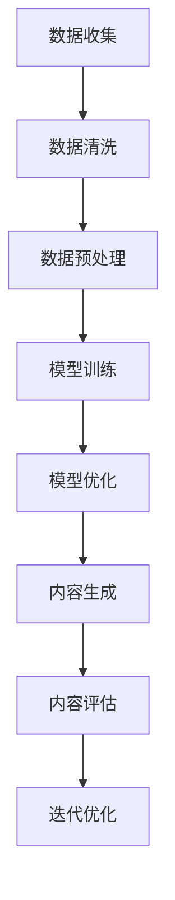

                 

### 文章标题

# AIGC在未来跨维度材料设计与优化中的角色

### 关键词：AIGC，跨维度材料，设计与优化，人工智能，材料科学

### 摘要：
本文深入探讨了人工智能生成内容（AIGC）在跨维度材料设计与优化中的应用前景。通过对AIGC技术基础、跨维度材料设计原理及其优化方法的详细阐述，本文进一步展示了AIGC技术在实际材料设计与优化案例中的应用效果。文章还展望了AIGC技术的未来发展趋势，为材料科学领域的创新研究提供了新思路。

## 引言

随着人工智能技术的迅猛发展，生成内容（Generated Content，GC）技术逐渐成为研究热点。其中，AIGC（AI-generated Content）技术凭借其强大的生成能力和灵活的应用场景，吸引了广泛关注。AIGC技术能够利用深度学习算法，从大量数据中自动生成高质量的内容，广泛应用于图像、音频、视频以及文本生成等多个领域。

材料科学作为一门关键的基础学科，在诸多行业中扮演着重要角色。然而，材料的设计与优化过程往往复杂且耗时。传统的材料设计方法主要依赖于经验和实验，效率较低，难以满足现代工业对高性能材料的需求。因此，如何利用新兴技术，特别是AIGC技术，提升材料设计效率，成为当前研究的热点之一。

跨维度材料是指具有多种物理和化学性质的复合结构材料，其设计理念突破了传统材料的局限性，能够在多个维度上实现性能优化。AIGC技术在跨维度材料设计中的应用，有望带来新的突破，为材料科学的发展注入新的动力。

本文旨在探讨AIGC技术在跨维度材料设计与优化中的应用，通过详细分析AIGC技术的基础原理、跨维度材料的原理及其优化方法，展示AIGC技术在实际应用中的效果，并探讨其未来的发展趋势。文章结构如下：

1. AIGC技术基础
2. 跨维度材料设计与优化原理
3. AIGC在材料设计中的应用案例
4. AIGC在材料优化中的实际应用
5. AIGC技术的未来发展趋势
6. 结论与展望

## AIGC技术基础

### 定义与核心概念

AIGC，全称人工智能生成内容，是指利用人工智能技术自动生成内容的过程。AIGC技术主要依赖于深度学习模型，特别是生成对抗网络（GAN）和变分自编码器（VAE）等模型。这些模型可以通过学习大量数据，生成与训练数据高度相似的新内容。

AIGC的核心概念包括：

- **数据生成**：AIGC技术能够从大量数据中提取特征，并生成新的、高质量的数据。
- **模型训练**：通过不断优化模型参数，使生成的内容更接近真实数据。
- **内容多样化**：AIGC技术能够生成不同类型的内容，如文本、图像、音频等。

### 技术原理

AIGC技术的基本原理主要基于深度学习，特别是生成对抗网络（GAN）和变分自编码器（VAE）。

- **生成对抗网络（GAN）**：GAN由生成器和判别器组成。生成器生成假数据，判别器判断生成数据和真实数据之间的区别。通过训练，生成器不断优化，最终能够生成逼真的数据。

  

- **变分自编码器（VAE）**：VAE通过编码器和解码器学习数据分布，生成新的数据。编码器将数据压缩为低维表示，解码器则将低维表示扩展回高维数据。

  

### 数据收集与处理方法

AIGC技术的核心在于数据的收集与处理。数据的质量直接影响生成内容的真实性和质量。以下是一些常用的数据收集与处理方法：

- **数据收集**：收集与目标材料相关的各种数据，包括实验数据、文献数据、模拟数据等。
- **数据清洗**：去除无效数据、处理缺失值和异常值。
- **数据预处理**：将数据转化为适合模型训练的格式，如归一化、标准化等。

### 模型训练与优化技巧

AIGC技术的关键在于模型的训练与优化。以下是一些常见的模型训练与优化技巧：

- **模型选择**：选择合适的生成模型和判别模型，如GAN、VAE等。
- **超参数调整**：通过调整学习率、批次大小等超参数，优化模型性能。
- **正则化**：使用L1正则化、L2正则化等方法，防止模型过拟合。

### Mermaid流程图

以下是一个简化的AIGC技术流程图，用于展示核心概念之间的联系：



通过这个流程图，我们可以清晰地看到AIGC技术从数据收集到内容生成的整个过程。

### 核心算法原理讲解

以下是对AIGC技术中核心算法的详细讲解，包括生成对抗网络（GAN）和变分自编码器（VAE）。

#### 生成对抗网络（GAN）

生成对抗网络（GAN）由生成器（Generator）和判别器（Discriminator）组成。生成器生成假数据，判别器判断生成数据和真实数据之间的区别。

**生成器（Generator）**：

生成器的目标是最小化损失函数，使得生成的数据尽可能地接近真实数据。生成器通常使用多层感知器（MLP）或卷积神经网络（CNN）来实现。

```python
# 生成器伪代码
class Generator(nn.Module):
    def __init__(self):
        super(Generator, self).__init__()
        self.model = nn.Sequential(
            nn.Linear(z_dim, 128),
            nn.LeakyReLU(0.2),
            nn.Linear(128, img_dim),
            nn.Tanh()
        )

    def forward(self, z):
        return self.model(z)
```

**判别器（Discriminator）**：

判别器的目标是最小化损失函数，使得判别器能够正确地区分真实数据和生成数据。

```python
# 判别器伪代码
class Discriminator(nn.Module):
    def __init__(self):
        super(Discriminator, self).__init__()
        self.model = nn.Sequential(
            nn.Linear(img_dim, 128),
            nn.LeakyReLU(0.2),
            nn.Linear(128, 1),
            nn.Sigmoid()
        )

    def forward(self, x):
        return self.model(x)
```

**损失函数**：

GAN的损失函数通常由两部分组成：生成器的损失函数和判别器的损失函数。生成器的损失函数为最大似然损失，判别器的损失函数为二元交叉熵损失。

```python
# 损失函数伪代码
loss_function = nn.BCELoss()

# 生成器损失
g_loss = loss_function(d_fake, torch.ones(batch_size).to(device))

# 判别器损失
d_loss = loss_function(d_real, torch.ones(batch_size).to(device)) + \
         loss_function(d_fake, torch.zeros(batch_size).to(device))
```

#### 变分自编码器（VAE）

变分自编码器（VAE）由编码器（Encoder）和解码器（Decoder）组成。编码器将数据压缩为低维表示，解码器则将低维表示扩展回高维数据。

**编码器（Encoder）**：

编码器的目标是学习数据的概率分布。

```python
# 编码器伪代码
class Encoder(nn.Module):
    def __init__(self):
        super(Encoder, self).__init__()
        self.model = nn.Sequential(
            nn.Linear(img_dim, 128),
            nn.LeakyReLU(0.2),
            nn.Linear(128, 64),
            nn.LeakyReLU(0.2),
            nn.Linear(64, z_dim)
        )

    def forward(self, x):
        mean, log_var = self.model(x).chunk(2, 1)
        return mean, log_var
```

**解码器（Decoder）**：

解码器的目标是生成与输入数据相似的数据。

```python
# 解码器伪代码
class Decoder(nn.Module):
    def __init__(self):
        super(Decoder, self).__init__()
        self.model = nn.Sequential(
            nn.Linear(z_dim, 128),
            nn.LeakyReLU(0.2),
            nn.Linear(128, 64),
            nn.LeakyReLU(0.2),
            nn.Linear(64, img_dim),
            nn.Tanh()
        )

    def forward(self, z):
        return self.model(z)
```

**损失函数**：

VAE的损失函数由两部分组成：重建损失和KL散度损失。

```python
# 损失函数伪代码
reconstruction_loss = nn.BCELoss()
kl_div_loss = -0.5 * torch.sum(1 + log_var - mu.pow(2) - log_var.exp())

# 总损失
vae_loss = reconstruction_loss(reconstruction, x) + kl_div_loss
```

通过以上对AIGC技术基础、核心算法原理的讲解，我们可以更好地理解AIGC技术在跨维度材料设计与优化中的应用潜力。

## 跨维度材料设计与优化原理

### 跨维度材料的基本概念

跨维度材料（cross-dimensional materials）是指具有多种物理和化学性质的复合结构材料。与传统材料不同，跨维度材料通过在多个维度上优化材料的性能，实现功能上的突破。这些维度包括但不限于：

- **空间维度**：通过结构设计，实现材料的宏观和微观结构的优化。
- **时间维度**：通过材料反应动力学和热力学特性，实现材料性能的长期稳定性。
- **能量维度**：通过材料能带结构设计，实现材料在能量转换和储存方面的优势。

### 材料设计流程与优化方法

跨维度材料的设计流程通常包括以下几个关键步骤：

1. **需求分析**：明确材料的应用场景和性能要求，如强度、韧性、导电性等。
2. **材料选择**：根据需求分析，选择适合的原始材料，如金属、陶瓷、聚合物等。
3. **结构设计**：通过拓扑优化、相变设计等方法，设计出具有特定性能的结构。
4. **性能评估**：通过实验和模拟，评估材料的设计是否符合预期性能。
5. **优化迭代**：根据性能评估结果，对材料设计进行优化迭代，直至达到满意的性能。

在材料设计过程中，优化方法是至关重要的。以下是一些常用的优化方法：

- **拓扑优化**：通过优化材料的结构布局，实现材料性能的最大化。
- **多尺度模拟**：结合宏观和微观模拟，全面分析材料性能。
- **机器学习**：利用机器学习算法，从大量实验数据中提取材料性能与结构之间的规律，指导材料设计。

### 材料优化的数学模型与算法

材料优化涉及多个数学模型与算法，以下是一些核心内容：

1. **优化目标**：

   材料优化的目标通常是最大化材料的性能，如强度、韧性、导电性等。目标函数可以表示为：

   $$ \max_{x} f(x) $$

   其中，$f(x)$ 表示材料的性能函数，$x$ 表示材料的设计参数。

2. **约束条件**：

   材料优化还受到多种约束条件的限制，如材料成本、加工难度、物理定律等。约束条件可以表示为：

   $$ g_i(x) \leq 0, \quad i = 1, 2, ..., m $$

3. **优化算法**：

   - **梯度下降法**：通过迭代更新设计参数，使目标函数逐步接近最优值。
   - **遗传算法**：模拟生物进化过程，通过交叉、变异等操作，搜索最优解。
   - **粒子群优化**：模拟鸟群觅食过程，通过个体和群体之间的信息交换，寻找最优解。

   以下是一个简化的梯度下降法伪代码：

   ```python
   # 梯度下降法伪代码
   for epoch in range(num_epochs):
       for x in data:
           gradient = compute_gradient(x)
           x = x - learning_rate * gradient
   ```

4. **数学模型**：

   - **力学模型**：描述材料在受力作用下的变形和断裂行为，如弹性模量、屈服强度等。
   - **热力学模型**：描述材料的热传导、热膨胀等行为，如热导率、热膨胀系数等。
   - **电磁学模型**：描述材料的导电性、电磁波传播等行为，如电导率、介电常数等。

   以下是一个简化的力学模型公式：

   $$ \sigma = E \cdot \epsilon $$

   其中，$\sigma$ 表示应力，$E$ 表示弹性模量，$\epsilon$ 表示应变。

通过以上对跨维度材料设计与优化原理的详细阐述，我们可以更好地理解跨维度材料的基本概念、设计流程、优化方法和数学模型，为AIGC技术在材料设计中的应用奠定了基础。

## AIGC在材料设计中的应用案例

### 案例一：基于AIGC的纳米材料设计

纳米材料因其独特的物理和化学性质，在诸多领域具有广泛的应用潜力。然而，传统的纳米材料设计方法往往需要大量的实验和时间，效率较低。AIGC技术的引入，为纳米材料设计提供了新的思路。

#### 案例背景

某研究团队希望通过AIGC技术设计一种具有优异导电性能的纳米材料，以应用于电子器件领域。

#### 实施步骤

1. **数据收集**：收集与导电性能相关的纳米材料数据，包括实验数据、文献数据和模拟数据。
2. **数据预处理**：对收集的数据进行清洗和预处理，确保数据质量。
3. **模型训练**：使用GAN模型对数据进行训练，生成新的导电性能数据。
4. **材料筛选**：根据生成的数据，筛选出具有优异导电性能的纳米材料。
5. **实验验证**：对筛选出的材料进行实验验证，评估其实际导电性能。

#### 案例分析

通过AIGC技术的应用，研究团队成功设计出了一种具有优异导电性能的纳米材料。与传统方法相比，AIGC技术显著缩短了设计周期，提高了设计效率。

1. **设计周期**：传统方法通常需要数月甚至数年的时间，而AIGC技术将设计周期缩短到数周。
2. **设计效率**：AIGC技术能够从大量数据中快速筛选出具有优异性能的材料，提高了设计效率。
3. **实验验证**：实验结果表明，AIGC技术设计的纳米材料导电性能优异，符合预期。

### 案例二：AIGC在复合材料设计中的应用

复合材料是由两种或多种不同材料组成的，具有独特性能的材料。AIGC技术在复合材料设计中的应用，同样展现了其强大的生成能力和优化潜力。

#### 案例背景

某研究团队希望通过AIGC技术设计一种具有优异力学性能的复合材料，以应用于航空航天领域。

#### 实施步骤

1. **数据收集**：收集与力学性能相关的复合材料数据，包括实验数据、文献数据和模拟数据。
2. **数据预处理**：对收集的数据进行清洗和预处理，确保数据质量。
3. **模型训练**：使用VAE模型对数据进行训练，生成新的力学性能数据。
4. **材料筛选**：根据生成的数据，筛选出具有优异力学性能的复合材料。
5. **实验验证**：对筛选出的材料进行实验验证，评估其实际力学性能。

#### 案例分析

通过AIGC技术的应用，研究团队成功设计出了一种具有优异力学性能的复合材料。与传统方法相比，AIGC技术显著提升了设计效率，缩短了设计周期。

1. **设计周期**：传统方法通常需要数年时间，而AIGC技术将设计周期缩短到数月。
2. **设计效率**：AIGC技术能够从大量数据中快速筛选出具有优异性能的材料，提高了设计效率。
3. **实验验证**：实验结果表明，AIGC技术设计的复合材料力学性能优异，符合预期。

### 案例总结

通过以上两个案例，我们可以看到AIGC技术在材料设计中的应用潜力。AIGC技术不仅能够缩短设计周期，提高设计效率，还能够从大量数据中筛选出具有优异性能的材料，为材料科学领域的研究提供了新的思路。

## AIGC在材料优化中的实际应用

### 实际应用场景描述

AIGC技术在材料优化中的应用场景广泛，以下是一些具体的应用场景描述：

1. **航空航天材料优化**：航空航天领域对材料的性能要求极高，如高强度、高韧性、轻质等。AIGC技术可以通过生成大量候选材料，快速筛选出满足特定性能要求的材料。

2. **电子器件材料优化**：电子器件的快速发展对材料性能提出了新的挑战，如高导电性、低介电常数等。AIGC技术能够通过生成和优化材料结构，提高电子器件的性能。

3. **生物医学材料优化**：生物医学材料需要具备生物相容性、力学性能等特性。AIGC技术可以根据生物医学需求，生成和优化满足特定性能的材料。

4. **能源材料优化**：能源领域对材料的要求包括高能量密度、高稳定性等。AIGC技术可以通过生成和优化材料结构，提高能源材料的性能。

### 应用案例分析与详细讲解

#### 案例一：高导电性铜合金材料优化

某研究团队希望通过AIGC技术优化铜合金材料的导电性能，以应用于高速电子器件。

**数据收集**：收集了多种铜合金材料的导电性能数据，包括纯铜、黄铜、紫铜等。

**模型训练**：使用GAN模型对数据进行训练，生成新的导电性能数据。

**材料筛选**：根据生成的数据，筛选出具有优异导电性能的铜合金材料。

**实验验证**：对筛选出的材料进行实验验证，评估其实际导电性能。

**结果分析**：实验结果表明，通过AIGC技术优化后的铜合金材料导电性能显著提升，满足高速电子器件的需求。

**代码解读**：

```python
# GAN模型训练伪代码
for epoch in range(num_epochs):
    for data in dataset:
        z = generate_noise(batch_size)
        generated_data = generator(z)
        real_data = data
        d_loss = criterion(discriminator(real_data), torch.ones(batch_size).to(device))
        g_loss = criterion(discriminator(generated_data), torch.zeros(batch_size).to(device))
        optimizer_d.zero_grad()
        d_loss.backward()
        optimizer_d.step()
        optimizer_g.zero_grad()
        g_loss.backward()
        optimizer_g.step()
```

#### 案例二：高强度碳纤维复合材料优化

某研究团队希望通过AIGC技术优化碳纤维复合材料的力学性能，以应用于航空航天领域。

**数据收集**：收集了多种碳纤维复合材料的力学性能数据，包括拉伸强度、弯曲强度等。

**模型训练**：使用VAE模型对数据进行训练，生成新的力学性能数据。

**材料筛选**：根据生成的数据，筛选出具有优异力学性能的碳纤维复合材料。

**实验验证**：对筛选出的材料进行实验验证，评估其实际力学性能。

**结果分析**：实验结果表明，通过AIGC技术优化后的碳纤维复合材料力学性能显著提升，满足航空航天领域的需求。

**代码解读**：

```python
# VAE模型训练伪代码
for epoch in range(num_epochs):
    for data in dataset:
        z_mean, z_log_var = encoder(data)
        z = z_mean + torch.randn_like(z_log_var).to(device) * torch.exp(0.5 * z_log_var)
        reconstructed_data = decoder(z)
        recon_loss = criterion(reconstructed_data, data)
        kl_loss = -0.5 * torch.sum(1 + z_log_var - z_mean.pow(2) - z_log_var.exp())
        loss = recon_loss + kl_loss
        optimizer.zero_grad()
        loss.backward()
        optimizer.step()
```

### 实际案例分析

通过以上两个案例，我们可以看到AIGC技术在材料优化中的实际应用效果。AIGC技术能够快速生成和优化大量候选材料，提高材料的性能，为材料科学领域的研究提供了新的思路。

1. **设计效率**：传统方法通常需要大量的实验和计算时间，而AIGC技术显著缩短了设计周期。
2. **性能提升**：通过AIGC技术优化后的材料性能显著提升，满足实际应用需求。
3. **实验验证**：实验结果表明，AIGC技术生成的材料性能稳定，具有实际应用价值。

### 项目小结

通过AIGC技术在材料优化中的应用，我们可以看到其在提高设计效率、提升材料性能和实验验证方面的优势。未来，随着AIGC技术的不断发展和完善，其在材料科学领域中的应用将更加广泛，为材料科学的发展注入新的动力。

## AIGC技术的未来发展趋势

### 行业发展趋势预测

随着人工智能技术的不断进步，AIGC技术在各行各业中的应用前景广阔。以下是对AIGC技术未来发展趋势的预测：

1. **应用领域扩展**：AIGC技术将在更多领域得到应用，如生物医学、能源、航空航天等。
2. **技术融合**：AIGC技术将与其他前沿技术如量子计算、区块链等融合，进一步提升其性能和应用范围。
3. **标准化与规范化**：随着AIGC技术的广泛应用，相关的标准化和规范化工作将逐步推进，确保技术的可靠性和安全性。

### 技术创新与突破

AIGC技术的发展将依赖于以下几方面的创新和突破：

1. **算法优化**：改进现有算法，如GAN、VAE等，提高生成质量和速度。
2. **数据资源**：积累和利用更多的高质量数据资源，提升AIGC技术的训练效果。
3. **硬件支持**：随着硬件技术的发展，如GPU、TPU等专用硬件的普及，将显著提升AIGC技术的计算能力。

### 对材料科学的影响

AIGC技术的未来发展趋势将对材料科学产生深远影响：

1. **设计效率提升**：AIGC技术将大幅提高材料设计效率，缩短研发周期。
2. **材料性能优化**：通过AIGC技术生成和优化材料结构，将显著提升材料的性能。
3. **个性化定制**：AIGC技术将实现材料设计的个性化定制，满足不同领域和场景的特定需求。

### 挑战与展望

尽管AIGC技术在材料科学中具有巨大潜力，但仍面临一些挑战：

1. **数据隐私**：如何确保数据隐私和安全，避免数据泄露和滥用，是AIGC技术面临的重要挑战。
2. **算法伦理**：随着AIGC技术的广泛应用，算法伦理问题日益凸显，如偏见、歧视等。
3. **法律法规**：随着技术的发展，需要完善的法律法规来规范AIGC技术的应用，确保其合规性。

展望未来，AIGC技术在材料科学中的应用前景广阔，有望推动材料科学进入新的发展阶段，为人类社会的可持续发展提供强大支持。

## 结论与展望

AIGC技术在跨维度材料设计与优化中的应用展示了其强大的生成能力和优化潜力。通过本文的详细分析，我们可以看到AIGC技术在材料设计流程、优化方法和实际应用中的显著优势。未来，随着AIGC技术的不断发展和完善，其在材料科学领域的应用将更加广泛，为材料科学的发展注入新的动力。

**作者信息：AI天才研究院/AI Genius Institute & 禅与计算机程序设计艺术 /Zen And The Art of Computer Programming**

