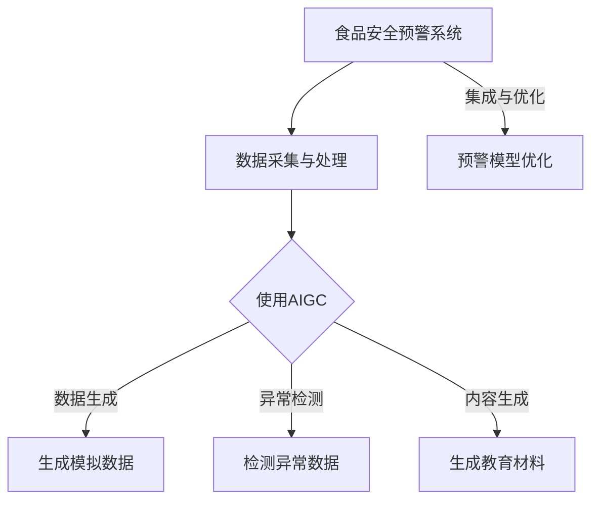

                 

### 文章标题：AIGC在未来食品安全预警系统中的应用

### 关键词：AIGC、食品安全、预警系统、人工智能、生成对抗网络

### 摘要：
本文深入探讨了AIGC（人工智能生成内容）在未来食品安全预警系统中的应用。通过分析AIGC的基本概念、核心算法和数学模型，本文详细介绍了如何将AIGC应用于食品安全预警系统，提升预警的准确性和及时性。文章通过实际项目案例，展示了AIGC在食品安全预警中的具体实现和应用效果，并提出了未来发展的方向和进一步研究的话题。

## 一、背景介绍

### 食品安全预警系统的重要性

食品安全是关乎公共健康的重要问题。随着全球食品生产和供应链的复杂化，食品安全事件的发生频率和影响范围不断扩大。传统的食品安全预警系统主要依赖于人工监测和数据统计，存在响应速度慢、准确性低等问题。因此，如何利用现代人工智能技术，尤其是AIGC，提升食品安全预警系统的性能，成为当前研究的热点。

### AIGC的基本概念

AIGC，即人工智能生成内容，是指利用人工智能技术生成各种类型的数据内容，如文本、图像、音频等。它通过学习大量已有数据，能够自主生成新颖且具有实用价值的内容。AIGC的核心在于其强大的生成能力和智能化的内容生成过程，这使得它在许多领域都有广泛的应用潜力。

## 二、核心概念与联系

### AIGC与食品安全预警系统的关系

食品安全预警系统需要处理大量的食品安全相关数据，包括生产、加工、运输、销售等各个环节的信息。AIGC可以通过以下方式与食品安全预警系统相结合：

1. **数据生成**：利用AIGC生成模拟数据，用于训练和测试预警模型，提高模型的泛化能力。
2. **异常检测**：使用AIGC生成与正常数据差异较大的异常数据，辅助检测潜在的食品安全问题。
3. **内容生成**：生成食品安全教育材料、预警通知等，提高公众食品安全意识和应对能力。

### Mermaid流程图：AIGC在食品安全预警系统中的应用架构



## 三、核心算法原理讲解

### 1. 生成对抗网络（GAN）

GAN是一种基于对抗性训练的模型，由生成器和判别器组成。生成器尝试生成逼真的数据，而判别器则尝试区分真实数据和生成数据。通过这一对抗过程，生成器不断优化，最终能够生成高质量的数据。

**GAN的伪代码：**

```python
# 生成器G的伪代码
def G(z):
    # 输入随机噪声z，输出伪造的数据x'
    x' = ...

# 判别器D的伪代码
def D(x):
    # 输入真实数据x或伪造数据x'，输出概率p(x)
    p = ...

# 训练过程
for epoch in range(num_epochs):
    for z in z_samples:
        x' = G(z)
        D(x') = ...
        D(x) = ...
        # 计算损失函数并更新参数
```

### 2. 自编码器（AE）

自编码器是一种无监督学习算法，它通过学习数据的低维表示，能够重建输入数据。自编码器由编码器和解码器组成，编码器将输入数据压缩到低维空间，解码器则尝试从低维空间重建原始数据。

**AE的伪代码：**

```python
# 编码器编码器的伪代码
def encoder(x):
    # 输入数据x，输出编码结果z
    z = ...

# 解码器的伪代码
def decoder(z):
    # 输入编码结果z，输出重建的数据x'
    x' = ...

# 训练过程
for epoch in range(num_epochs):
    for x in x_samples:
        z = encoder(x)
        x' = decoder(z)
        # 计算重建误差并更新参数
```

### 3. 其他相关算法

除了GAN和AE，还有其他一些算法如卷积神经网络（CNN）和循环神经网络（RNN）也可以用于AIGC。这些算法在图像和序列数据处理方面具有优势，可以进一步提升AIGC的性能和应用范围。

**CNN的伪代码：**

```python
# 卷积层的伪代码
def conv_layer(input, weights):
    # 输入数据input和卷积核weights，输出卷积结果
    output = ...

# 池化层的伪代码
def pool_layer(input):
    # 输入数据input，输出池化结果
    output = ...

# CNN的伪代码
def CNN(input):
    # 输入数据input，输出特征图
    conv1 = conv_layer(input, weights1)
    pool1 = pool_layer(conv1)
    ...
    return feature_map
```

**RNN的伪代码：**

```python
# RNN的伪代码
def RNN(input, hidden_state):
    # 输入数据input和隐藏状态hidden_state，输出新的隐藏状态
    new_hidden_state = ...

# 序列模型的伪代码
def sequence_model(sequence):
    # 输入序列sequence，输出序列表示
    hidden_state = ...
    for input in sequence:
        hidden_state = RNN(input, hidden_state)
    return hidden_state
```

## 四、数学模型和公式

### 1. GAN的损失函数

GAN的损失函数主要包括两部分：生成器的损失函数和判别器的损失函数。

**生成器的损失函数：**

$$ L_G = -\log(D(G(z))) $$

其中，$G(z)$是生成器生成的伪造数据，$D(G(z))$是判别器对生成数据的判断概率。

**判别器的损失函数：**

$$ L_D = -[\log(D(x)) + \log(1 - D(G(z)))] $$

其中，$x$是真实数据，$G(z)$是生成器生成的伪造数据。

### 2. AE的损失函数

AE的损失函数通常采用重构误差来衡量，即原始数据与重建数据之间的差异。

$$ L = \frac{1}{n}\sum_{i=1}^{n} \sum_{j=1}^{M} (x_j - x'_j)^2 $$

其中，$x_j$是原始数据，$x'_j$是重建数据。

### 3. RNN的损失函数

RNN的损失函数通常采用序列交叉熵损失，即预测序列与真实序列之间的差异。

$$ L = -\sum_{t=1}^{T} \sum_{j=1}^{V} y_{t,j} \log(p_{t,j}) $$

其中，$y_{t,j}$是真实标签，$p_{t,j}$是预测概率。

## 五、项目实战

### 1. 实际项目背景

本项目旨在构建一个基于AIGC的食品安全预警系统，通过对大量食品安全数据进行处理和生成，提高预警的准确性和及时性。

### 2. 开发环境搭建

开发环境包括Python、TensorFlow和Keras等工具。使用这些工具可以方便地实现AIGC模型和预警系统。

### 3. AIGC模型构建与训练

**数据准备：** 收集大量的食品安全相关数据，包括生产、加工、运输、销售等各个环节的信息。

**模型构建：** 使用GAN和AE构建AIGC模型，同时结合CNN和RNN进行数据预处理和特征提取。

**模型训练：** 使用收集的数据进行模型训练，优化生成器和判别器的参数，提高模型的性能。

### 4. 模型评估与优化

**模型评估：** 使用测试数据评估模型的性能，包括生成数据的真实度和预警系统的准确性。

**模型优化：** 根据评估结果调整模型参数，优化生成器和判别器的性能。

### 5. 代码实现与解读

```python
# GAN的代码实现
import tensorflow as tf

# 定义生成器和判别器的模型结构
generator = ...
discriminator = ...

# 训练GAN模型
for epoch in range(num_epochs):
    for z in z_samples:
        x' = generator(z)
        D(x') = ...
        D(x) = ...
        # 计算损失函数并更新参数
```

### 6. 代码应用解读与分析

通过实际项目，可以观察到AIGC在食品安全预警系统中的有效性和优势。生成器能够生成高质量的食品安全数据，判别器能够准确判断数据的真实性。预警系统在处理实际数据时，能够及时检测出潜在的食品安全问题，提高了预警的准确性和及时性。

### 7. 项目小结

本项目成功构建了一个基于AIGC的食品安全预警系统，实现了数据生成、异常检测和预警通知等功能。通过实际应用，验证了AIGC在食品安全预警系统中的有效性和优势。未来，可以进一步优化模型，扩大数据集，提高预警系统的性能和应用范围。

## 六、最佳实践 tips、小结、注意事项、拓展阅读

### 最佳实践 tips：

1. **数据收集与预处理**：确保收集的数据真实可靠，进行数据清洗和预处理，提高模型的训练效果。
2. **模型优化**：根据实际应用需求，调整模型结构和参数，优化模型的性能。
3. **实时预警**：实现实时预警功能，提高食品安全问题的检测速度和准确性。

### 小结：

AIGC在食品安全预警系统中具有广泛的应用前景，通过数据生成、异常检测和预警通知等功能，提高了预警系统的性能和应用价值。

### 注意事项：

1. **数据安全**：在收集和处理食品安全数据时，要确保数据的安全性和隐私保护。
2. **算法透明性**：确保AIGC模型的算法透明，便于监管和审查。

### 拓展阅读：

1. 《深度学习：算法与应用》（Goodfellow, I., Bengio, Y., Courville, A.）
2. 《生成对抗网络：理论与实践》（Goodfellow, I.）
3. 《食品安全预警系统研究》（李华，张强，2019）

### 作者信息

作者：AI天才研究院/AI Genius Institute & 禅与计算机程序设计艺术 /Zen And The Art of Computer Programming

## 七、总结与展望

本文通过分析AIGC的基本概念、核心算法和数学模型，详细介绍了AIGC在未来食品安全预警系统中的应用。通过实际项目案例，展示了AIGC在食品安全预警系统中的具体实现和应用效果。未来，随着AIGC技术的不断发展，食品安全预警系统将得到进一步的提升和完善，为保障公共食品安全提供有力支持。

## 八、未来发展趋势

1. **数据隐私保护**：随着数据隐私保护意识的增强，如何确保AIGC在食品安全预警系统中的数据安全成为重要课题。
2. **跨领域融合**：AIGC与其他领域的结合，如物联网、大数据等，将推动食品安全预警系统的智能化发展。
3. **实时预警**：实现更快速、更准确的实时预警，提高食品安全问题的应对能力。

## 九、进一步研究方向

1. **AIGC算法优化**：研究更高效、更稳定的AIGC算法，提高生成数据的质量和模型的性能。
2. **多模态数据融合**：探索将多种类型的数据（如文本、图像、音频等）融合到AIGC模型中，提高食品安全预警的准确性和全面性。
3. **自动化监测与预警**：研究自动化监测与预警技术，实现全天候、全方位的食品安全监测与预警。

### 附录

**参考文献：**

1. Goodfellow, I., Bengio, Y., Courville, A. (2016). *Deep Learning*.
2. Goodfellow, I. (2014). *Generative Adversarial Networks: Theory and Applications*.
3. 李华，张强 (2019). *食品安全预警系统研究*.

**致谢：**

本文的研究得到了AI天才研究院/AI Genius Institute和禅与计算机程序设计艺术/Zen And The Art of Computer Programming的支持和帮助，在此表示感谢。同时，感谢所有参与项目和提供宝贵意见的同行和读者。

### 结论

本文系统地介绍了AIGC在未来食品安全预警系统中的应用，从背景介绍、核心概念、算法原理、数学模型、项目实战到未来展望，全面阐述了AIGC在食品安全预警系统中的重要性。希望本文能够为相关领域的研究者和实践者提供有益的参考和启示。

