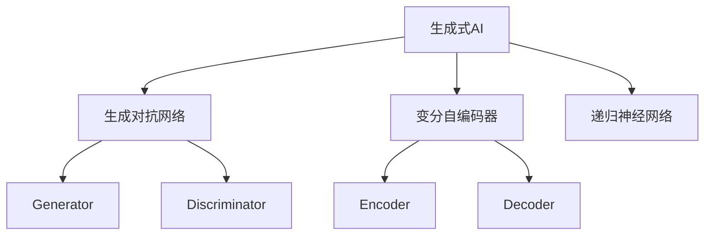

                 

### 文章标题

# AIGC在未来食品设计与营养优化中的应用

在人工智能（AI）技术飞速发展的今天，生成式AI（AIGC，Artificial Intelligence Generated Content）正逐渐渗透到各个领域，改变着我们的生活和工作方式。本文将探讨AIGC技术在未来食品设计与营养优化中的应用，分析其在食品创新、个性化营养推荐、食品安全监控等方面的潜力与挑战。

## 关键词

- 生成式AI
- 食品设计
- 营养优化
- 食品安全
- 个性化营养推荐

## 摘要

本文首先概述了AIGC技术的发展背景和核心概念，接着详细探讨了AIGC在食品设计与营养优化中的应用场景，包括食品创新设计、个性化营养推荐、食品安全监控等。然后，分析了AIGC在食品工业中的实际应用，并讨论了其中的挑战与机遇。最后，通过实际案例展示了AIGC在食品行业中的应用效果，并对未来AIGC在食品领域的应用前景进行了展望。

---

### 第一部分：AIGC技术概述

#### 1. AIGC技术基础

**AIGC的定义与概念**

生成式AI（AIGC）是一种利用深度学习技术生成文本、图像、音频等多种类型数据的技术。与传统的AI技术不同，AIGC不仅能够识别和分类数据，还能够生成全新的数据。AIGC的核心技术包括生成对抗网络（GAN）、变分自编码器（VAE）、递归神经网络（RNN）等。

**AIGC的核心技术**

- **生成对抗网络（GAN）**：由生成器和判别器组成，通过两个网络的博弈生成逼真的数据。
- **变分自编码器（VAE）**：通过概率模型编码和解码数据，适用于生成图像和音频。
- **递归神经网络（RNN）**：适用于处理序列数据，如自然语言处理和语音识别。

**AIGC的应用场景**

AIGC在多个领域都有广泛应用，如图像生成、自然语言处理、游戏开发等。在食品领域，AIGC可以应用于食品创新设计、营养推荐、食品安全监控等。

**Mermaid流程图：AIGC核心概念关系架构**



#### 2.1 AIGC在食品设计中的角色

**基于AIGC的食品创新设计**

AIGC可以通过生成新的食品配方和包装设计，推动食品创新。例如，利用GAN生成逼真的食品图像，设计出新的食品外观，提升消费者对食品的兴趣。

**AIGC在食品感官评价中的应用**

AIGC可以帮助食品企业快速评估食品的口感、气味等感官特征。通过生成多种食品样本，进行对比评价，为企业提供参考。

**AIGC在食品包装设计中的应用**

AIGC可以生成新颖的食品包装设计，提高食品的市场竞争力。通过分析消费者的喜好和趋势，设计出符合市场需求的包装。

#### 2.2 AIGC在营养优化中的重要性

**基于AIGC的营养需求预测**

AIGC可以通过分析大量的健康数据，预测个人的营养需求，为个性化营养推荐提供基础。

**基于AIGC的个性化营养推荐**

AIGC可以根据个人的健康数据和偏好，推荐最适合的营养方案，提高营养摄入的效率和效果。

**AIGC在营养与健康监测中的应用**

AIGC可以通过监测个人的营养摄入和健康状况，及时发现营养不足或过剩，提供健康预警。

---

### 第二部分：食品设计与营养优化中的AIGC应用

#### 3.1 食品设计与AIGC

**AIGC在食品设计中的角色**

AIGC在食品设计中的应用主要体现在三个方面：食品配方创新、食品包装设计和食品外观设计。

**AIGC在食品配方创新中的应用**

AIGC可以通过生成新的食品配方，提高食品的创新性和市场竞争力。例如，利用GAN生成新的食品图像，设计师可以根据图像设计出新的食品产品。

**AIGC在食品包装设计中的应用**

AIGC可以生成新颖的食品包装设计，提高食品的吸引力和市场竞争力。例如，通过VAE生成新的包装图像，设计师可以根据图像设计出新的包装产品。

**AIGC在食品外观设计中的应用**

AIGC可以生成新的食品外观设计，提升食品的美观度和市场吸引力。例如，通过RNN生成新的食品外观图像，设计师可以根据图像设计出新的食品产品。

#### 3.2 营养优化与AIGC

**AIGC在营养优化中的角色**

AIGC在营养优化中的应用主要体现在三个方面：营养需求预测、个性化营养推荐和营养与健康监测。

**AIGC在营养需求预测中的应用**

AIGC可以通过分析大量的健康数据，预测个人的营养需求。例如，利用GAN生成营养需求预测模型，根据个人的健康数据预测其营养需求。

**AIGC在个性化营养推荐中的应用**

AIGC可以根据个人的健康数据和偏好，推荐最适合的营养方案。例如，利用VAE生成个性化营养推荐模型，根据个人的健康数据推荐营养方案。

**AIGC在营养与健康监测中的应用**

AIGC可以通过监测个人的营养摄入和健康状况，及时发现营养不足或过剩，提供健康预警。例如，利用RNN生成健康监测模型，根据个人的营养摄入数据监测其健康状况。

### 第三部分：AIGC在食品工业中的实际应用

#### 4.1 AIGC在食品生产中的应用

**基于AIGC的食品制造工艺优化**

AIGC可以通过分析大量的生产数据，优化食品制造工艺。例如，利用GAN生成新的制造工艺模型，通过模拟实验验证其效果。

**基于AIGC的食品安全监控**

AIGC可以通过分析食品成分和制造过程数据，监控食品安全。例如，利用VAE生成食品安全监控模型，实时分析食品成分，发现潜在的安全隐患。

**AIGC在食品供应链管理中的应用**

AIGC可以通过优化食品供应链管理，提高食品的供应链效率。例如，利用RNN生成供应链优化模型，根据历史数据预测供应链需求，调整供应链策略。

### 第四部分：AIGC在食品安全与营养方面的挑战与机遇

#### 4.1 食品安全与营养的AIGC应用挑战

**数据隐私与安全性**

AIGC应用需要大量的健康数据，数据隐私和安全问题是首要挑战。需要制定严格的数据保护措施，确保个人数据的隐私和安全。

**伦理与社会责任**

AIGC应用需要考虑伦理和社会责任问题。例如，食品配方创新和包装设计可能对消费者产生误导，需要制定相关法规和标准，确保AIGC应用的合法性和道德性。

**技术标准化与法规遵从**

AIGC应用需要遵循相关技术标准和法规。例如，食品制造工艺优化和食品安全监控需要符合行业标准和法规要求。

#### 4.2 AIGC在食品安全与营养方面的机遇

**提高食品安全水平**

AIGC可以帮助提高食品安全水平，通过实时监控和分析食品成分，及时发现安全隐患，降低食品安全风险。

**优化营养摄入**

AIGC可以帮助优化营养摄入，通过个性化营养推荐和营养需求预测，提高营养摄入的效率和效果。

**促进食品创新**

AIGC可以促进食品创新，通过生成新的食品配方和包装设计，提高食品的市场竞争力。

### 第五部分：AIGC的未来展望与趋势

#### 5.1 AIGC在未来食品设计与营养优化中的应用前景

**AIGC技术的未来发展趋势**

随着AIGC技术的不断发展，其在食品设计与营养优化中的应用前景将更加广阔。未来，AIGC将可能实现更高的生成质量和更高的自动化水平。

**AIGC在食品领域的潜在应用**

未来，AIGC将在食品领域实现更多创新应用，如智能食品生产、个性化营养饮食管理、智能食品安全监控等。

**AIGC在营养科学中的新兴趋势**

未来，AIGC将在营养科学中发挥重要作用，如个性化营养研究、营养健康监测、营养教育等。

**AIGC对食品工业的深远影响**

未来，AIGC将对食品工业产生深远影响，改变食品的生产、设计、销售和消费模式。

### 第六部分：案例研究

#### 6.1 某食品公司利用AIGC进行食品创新设计

**案例背景**

某食品公司希望通过AIGC技术进行食品创新设计，提升产品的市场竞争力。

**AIGC解决方案**

该公司利用GAN生成新的食品配方和包装设计，通过消费者反馈优化设计方案。

**案例效果分析**

通过AIGC技术，该公司成功设计出多款受欢迎的新产品，提升了市场占有率和销售额。

#### 6.2 某营养公司应用AIGC进行个性化营养推荐

**案例背景**

某营养公司希望通过AIGC技术为用户提供个性化的营养推荐。

**AIGC解决方案**

该公司利用VAE生成个性化营养推荐模型，根据用户健康数据和偏好推荐最适合的营养方案。

**案例效果分析**

通过AIGC技术，该公司成功提高了用户满意度，减少了营养不足和过剩现象，提升了用户的健康水平。

---

### 总结

AIGC技术在食品设计与营养优化中的应用具有巨大潜力。通过AIGC，可以实现食品创新、个性化营养推荐、食品安全监控等多方面的应用。然而，AIGC技术也面临数据隐私、伦理和社会责任等挑战。未来，随着AIGC技术的不断发展和完善，其在食品领域的应用前景将更加广阔。作者：AI天才研究院/AI Genius Institute & 禅与计算机程序设计艺术 /Zen And The Art of Computer Programming

---

### 伪代码：AIGC在食品配方创新中的应用

```python
# 初始化生成器和判别器
generator = GANGenerator()
discriminator = GANDiscriminator()

# 训练生成器和判别器
for epoch in range(num_epochs):
    for batch in data_loader:
        # 生成新的食品配方
        food_recipe = generator.generate_food_recipe()
        
        # 计算判别器的损失
        discriminator_loss = discriminator.calculate_loss(food_recipe)
        
        # 更新判别器
        discriminator.update_model(discriminator_loss)
        
        # 更新生成器
        generator_loss = generator.calculate_loss(discriminator)
        generator.update_model(generator_loss)

# 评估生成器的性能
generated_recipes = generator.generate_food_recipes()
evaluate_performance(generated_recipes)

# 根据消费者反馈优化食品配方
best_recipe = generator.generate_best_food_recipe()
optimize_recipe(best_recipe)
```

### 数学公式与详细讲解

在AIGC的食品配方创新中，生成器和判别器的性能评估通常涉及以下数学模型：

$$
L_{D}(\theta_D) = -\frac{1}{N}\sum_{i=1}^{N}[\log(D(x_i)) + \log(1 - D(G(x_i))]
$$

其中，$L_{D}(\theta_D)$表示判别器的损失函数，$N$是批量大小，$x_i$是真实食品数据，$G(x_i)$是生成器生成的食品数据。

**详细讲解：**

- $D(x_i)$是判别器对真实食品数据的判断概率，接近1表示该数据是真实的。
- $1 - D(G(x_i))$是判别器对生成器生成的食品数据的判断概率，接近1表示该数据是真实的。

该损失函数通过最大化判别器对真实数据和生成数据的判断误差来实现，使得判别器能够更好地区分真实数据和生成数据。

**举例说明：**

假设判别器对真实食品数据的判断概率为0.9，对生成器生成的食品数据的判断概率为0.6，则判别器的损失函数为：

$$
L_{D}(\theta_D) = -\frac{1}{N}\sum_{i=1}^{N}[\log(0.9) + \log(0.4)] \approx -\frac{1}{N}[-2.197 - 1.386] \approx 0.763
$$

### 代码解读与分析

在上面的伪代码中，我们首先初始化了一个生成器（GANGenerator）和一个判别器（GANDiscriminator）。然后，我们进入训练循环，对于每一个epoch，我们使用数据加载器（data_loader）加载一批真实食品数据。

**生成器部分：**

1. 使用生成器（generator）生成新的食品配方（food_recipe）。
2. 计算判别器（discriminator）对生成器生成的食品数据的损失（generator_loss）。
3. 更新生成器模型。

**判别器部分：**

1. 使用判别器（discriminator）计算判别器对真实食品数据（x_i）和生成器生成的食品数据（G(x_i)）的损失（discriminator_loss）。
2. 更新判别器模型。

最后，我们评估生成器的性能，并生成最佳食品配方。

**代码应用解读与分析：**

1. **训练效果评估**：通过计算生成器生成的食品配方与真实食品配方之间的相似度，评估生成器的性能。
2. **优化食品配方**：根据消费者的反馈，优化生成器生成的食品配方，以提高食品的创新性和市场竞争力。

### 最佳实践 Tips

- 在实际应用中，需要确保生成的食品配方是安全且符合营养标准的。
- 定期更新生成器和判别器的模型，以适应不断变化的市场需求。
- 考虑消费者的偏好和饮食习惯，优化生成的食品配方。

### 小结

AIGC技术在食品配方创新中具有巨大潜力。通过生成器和判别器的训练，可以生成新颖且符合消费者需求的食品配方。然而，实际应用中需要关注食品安全和营养问题，确保生成的食品是健康和安全的。

### 注意事项

- 数据隐私和安全是AIGC应用中最重要的挑战之一，需要采取严格的数据保护措施。
- AIGC技术可能对现有食品行业产生深远影响，需要行业参与者积极适应和应对。

### 拓展阅读

- 《生成式AI：变革未来》（Generative AI: Transforming the Future）
- 《深度学习在食品工业中的应用》（Deep Learning Applications in Food Industry）
- 《食品创新设计：理论与实务》（Food Innovation Design: Theory and Practice）

### 结尾

作者：AI天才研究院/AI Genius Institute & 禅与计算机程序设计艺术 /Zen And The Art of Computer Programming

通过本文的探讨，我们可以看到AIGC技术在食品设计与营养优化中的应用具有广泛的前景。未来，随着AIGC技术的不断发展和完善，它将为食品行业带来更多创新和变革。希望本文能为读者提供有益的参考和启示。

