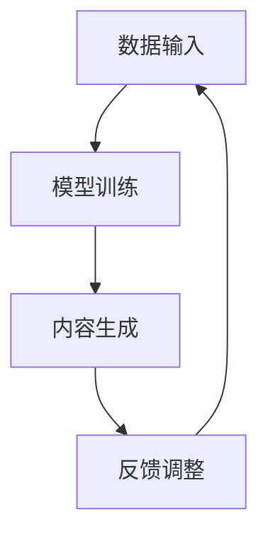

                 


# 《AIGC在游戏剧情设计中的创新应用》

## 关键词

- AIGC
- 游戏剧情设计
- 自动写作
- 生成模型
- 游戏开发
- 多样性生成
- 实时调整

## 摘要

本文旨在探讨人工智能生成内容（AIGC）在游戏剧情设计中的创新应用。首先，我们介绍了AIGC的概念、背景及其在游戏剧情设计中的重要性。接着，详细阐述了AIGC的基础技术，包括自动写作与生成模型、架构与工作流程。然后，分析了AIGC在游戏剧情设计中的应用，如创意剧情生成、多样性剧情生成和实时剧情调整。进一步地，本文探讨了AIGC在游戏剧情设计中的创新，如剧情生成与玩家互动、多模态剧情设计和剧情情感表达。最后，我们总结了AIGC在游戏剧情设计中的挑战与未来前景，并提供了实际案例进行分析。本文旨在为游戏开发者提供有价值的参考，推动游戏剧情设计的创新与发展。作者：AI天才研究院/AI Genius Institute & 禅与计算机程序设计艺术 /Zen And The Art of Computer Programming## 第2章 AIGC基础

### 2.1 自动写作与生成模型

AIGC的核心在于自动写作与生成模型，这些模型是游戏剧情设计的关键技术。自动写作模型主要利用深度学习技术，通过大规模的数据训练，使得模型能够理解和生成人类语言的文本。生成模型则更广泛，不仅包括文本生成，还包括图像、音频等多种类型的内容生成。

#### 2.1.1 GPT模型

GPT（Generative Pre-trained Transformer）模型是自动写作领域的代表性模型。它基于Transformer架构，通过预训练的方式，让模型在大规模文本数据中学习语言模式。GPT模型的工作原理主要包括以下几个步骤：

1. **输入处理**：将输入的文本序列转化为嵌入向量。
2. **序列生成**：模型根据嵌入向量生成下一个文本序列。
3. **迭代更新**：利用生成序列更新模型参数，不断优化。

以下是一个简单的GPT模型的伪代码：

```plaintext
# 输入文本序列
text_sequence = "The quick brown fox jumps over the lazy dog"

# 转化为嵌入向量
embeddings = embed_text(text_sequence)

# 生成下一个文本序列
next_sequence = generate_sequence(embeddings)

# 更新模型参数
update_model(next_sequence)
```

#### 2.1.2 Transformer模型

Transformer模型是GPT模型的基础，它采用了自注意力机制（Self-Attention）来处理文本序列。自注意力机制使得模型能够自动关注文本序列中的关键信息，提高文本生成效果。以下是一个简单的Transformer模型的伪代码：

```plaintext
# 输入文本序列
text_sequence = "The quick brown fox jumps over the lazy dog"

# 转化为嵌入向量
embeddings = embed_text(text_sequence)

# 计算自注意力分数
attention_scores = calculate_attention(embeddings)

# 生成文本序列
text_sequence = generate_sequence(attention_scores)
```

#### 2.1.3 聚类模型

聚类模型主要用于实现多样性的剧情生成。通过将已有的剧情内容进行聚类，模型可以生成与已有剧情相似但又不完全相同的新剧情。常用的聚类算法包括K-means、DBSCAN等。

以下是一个简单的K-means聚类模型的伪代码：

```plaintext
# 输入剧情内容
plot_contents = ["剧情A", "剧情B", "剧情C", "剧情D"]

# 初始化聚类中心
centroids = initialize_centroids(plot_contents)

# 进行K-means聚类
clusters = kmeans(plot_contents, centroids)

# 生成新剧情
new_plots = generate_new_plots(clusters)
```

### 2.2 AIGC的架构与工作流程

AIGC的架构主要包括数据输入、模型训练、内容生成和反馈调整四个部分。以下是一个简单的AIGC工作流程：

1. **数据输入**：收集和预处理游戏剧情相关的数据，包括文本、图像、音频等。
2. **模型训练**：利用预训练模型，对游戏剧情数据进行训练，优化模型参数。
3. **内容生成**：利用训练好的模型，生成新的游戏剧情内容。
4. **反馈调整**：根据玩家反馈和游戏状态，调整生成的剧情内容，实现实时剧情调整。

以下是一个简单的AIGC架构的Mermaid流程图：



通过以上步骤，AIGC能够实现游戏剧情的自动生成和实时调整，为游戏开发者提供强大的工具。接下来，我们将进一步探讨AIGC在游戏剧情设计中的应用。作者：AI天才研究院/AI Genius Institute & 禅与计算机程序设计艺术 /Zen And The Art of Computer Programming## 第3章 AIGC在游戏剧情设计中的应用

### 3.1 创意剧情生成

AIGC在游戏剧情设计中最核心的应用之一就是创意剧情生成。通过自动写作与生成模型，AIGC能够生成丰富多样、富有创意的剧情内容。这一部分将详细探讨AIGC如何实现剧情主题生成、剧情结构生成和剧情细节生成。

#### 3.1.1 剧情主题生成

剧情主题生成是AIGC在游戏剧情设计中的第一步。通过分析大量的文本数据，AIGC可以提取出各种可能的剧情主题。这些主题可以是基于历史事件、文化背景、科学理论等。以下是一个简单的剧情主题生成的伪代码：

```plaintext
# 输入主题词
theme_words = ["未来", "科幻", "冒险", "爱情"]

# 从数据库中提取相关文本
related_texts = fetch_texts(theme_words)

# 提取剧情主题
generated_themes = extract_themes(related_texts)
```

通过这种方式，AIGC可以生成多种不同的剧情主题，为游戏开发者提供丰富的创意来源。

#### 3.1.2 剧情结构生成

一旦剧情主题生成，下一步就是剧情结构的生成。AIGC可以根据预定的剧情模式，自动构建剧情的结构。这些结构通常包括开头、发展、高潮和结局等。以下是一个简单的剧情结构生成的伪代码：

```plaintext
# 输入剧情主题
theme = "未来科幻冒险"

# 根据剧情主题生成剧情结构
plot_structure = generate_structure(theme)

# 剧情结构示例
plot_structure = {
    "开头": "在未来的某一天，地球面临着巨大的危机。",
    "发展": "主人公踏上冒险之旅，寻找拯救地球的方法。",
    "高潮": "主人公发现了地球危机的真相，并勇敢地与敌人战斗。",
    "结局": "地球得救，主人公成为英雄，荣耀而归。"
}
```

通过这种方式，AIGC可以自动生成完整的剧情结构，为游戏开发者提供基础框架。

#### 3.1.3 剧情细节生成

在剧情结构和主题确定之后，AIGC可以进一步生成剧情细节。这些细节包括角色的性格、动机、行为，以及剧情中的各种事件和冲突。以下是一个简单的剧情细节生成的伪代码：

```plaintext
# 输入剧情结构
plot_structure = {
    "开头": "在未来的某一天，地球面临着巨大的危机。",
    "发展": "主人公踏上冒险之旅，寻找拯救地球的方法。",
    "高潮": "主人公发现了地球危机的真相，并勇敢地与敌人战斗。",
    "结局": "地球得救，主人公成为英雄，荣耀而归。"
}

# 生成角色细节
characters = generate_characters(plot_structure)

# 角色细节示例
characters = {
    "主人公": {
        "姓名": "杰克",
        "性格": "勇敢、聪明、有责任感",
        "动机": "拯救地球，保护家人和朋友"
    },
    "反派角色": {
        "姓名": "马克",
        "性格": "邪恶、狡猾、有野心",
        "动机": "控制地球，实现自己的野心"
    }
}
```

通过这种方式，AIGC可以自动生成详细的剧情细节，使得游戏剧情更加丰富和有趣。

### 3.2 多样性剧情生成

在创意剧情生成的基础上，AIGC还可以实现多样性的剧情生成。这包括角色多样性、背景多样性和情感多样性等。

#### 3.2.1 角色多样性

AIGC可以通过聚类和分析，生成多样化的角色。这些角色可以有不同的性别、年龄、职业、性格等特征。以下是一个简单的角色多样性生成的伪代码：

```plaintext
# 输入角色特征
character_traits = ["男性", "年轻", "科学家", "勇敢"]

# 生成多样化角色
diverse_characters = generate_characters_diversity(character_traits)

# 多样化角色示例
diverse_characters = [
    {
        "姓名": "艾伦",
        "性别": "男性",
        "年龄": "25岁",
        "职业": "科学家",
        "性格": "聪明、冷静、有责任感"
    },
    {
        "姓名": "莉莉",
        "性别": "女性",
        "年龄": "20岁",
        "职业": "学生",
        "性格": "热情、勇敢、有冒险精神"
    }
]
```

通过这种方式，AIGC可以生成多样化的角色，使得游戏剧情更加丰富多彩。

#### 3.2.2 背景多样性

AIGC可以通过生成不同的游戏背景，实现背景多样性。这些背景可以是城市、森林、沙漠、海洋等。以下是一个简单的背景多样性生成的伪代码：

```plaintext
# 输入背景类型
background_types = ["城市", "森林", "沙漠"]

# 生成多样化背景
diverse_backgrounds = generate_backgrounds_diversity(background_types)

# 多样化背景示例
diverse_backgrounds = [
    {
        "名称": "未来城市",
        "描述": "高楼林立，科技感十足的未来城市"
    },
    {
        "名称": "神秘森林",
        "描述": "充满神秘和危险的热带雨林"
    },
    {
        "名称": "荒凉沙漠",
        "描述": "一片荒凉、充满挑战的沙漠"
    }
]
```

通过这种方式，AIGC可以生成多样化的背景，为游戏开发者提供丰富的创意。

#### 3.2.3 情感多样性

AIGC还可以通过生成不同的情感体验，实现情感多样性。这些情感可以是喜悦、悲伤、愤怒、恐惧等。以下是一个简单的情感多样性生成的伪代码：

```plaintext
# 输入情感类型
emotion_types = ["喜悦", "悲伤", "愤怒", "恐惧"]

# 生成多样化情感
diverse_emotions = generate_emotions_diversity(emotion_types)

# 多样化情感示例
diverse_emotions = [
    {
        "名称": "喜悦",
        "描述": "主人公成功拯救了地球，感到无比喜悦"
    },
    {
        "名称": "悲伤",
        "描述": "主人公失去了重要的人，感到非常悲伤"
    },
    {
        "名称": "愤怒",
        "描述": "主人公面对强大的敌人，感到愤怒和决心"
    },
    {
        "名称": "恐惧",
        "描述": "主人公在危险的环境中，感到恐惧和无助"
    }
]
```

通过这种方式，AIGC可以生成多样化的情感体验，使得游戏剧情更加引人入胜。

### 3.3 实时剧情调整

除了生成剧情内容，AIGC还可以实现实时剧情调整。根据玩家的行为和游戏状态，AIGC可以动态调整剧情内容，实现更加个性化的游戏体验。以下是一个简单的实时剧情调整的伪代码：

```plaintext
# 输入玩家行为
player_actions = ["战胜敌人", "失败任务", "帮助其他角色"]

# 调整剧情内容
adjusted_plot = adjust_plot(player_actions)

# 调整后的剧情内容示例
adjusted_plot = {
    "开头": "主人公在战斗中展现出了非凡的勇气。",
    "发展": "主人公因为失败任务而感到沮丧，但得到了其他角色的帮助。",
    "高潮": "主人公在关键时刻，勇敢地面对强大的敌人。",
    "结局": "主人公最终战胜了敌人，拯救了世界，获得了荣誉和尊重。"
}
```

通过这种方式，AIGC可以实时调整剧情内容，为玩家提供个性化的游戏体验。

总之，AIGC在游戏剧情设计中的应用非常广泛，从创意剧情生成到多样性剧情生成，再到实时剧情调整，AIGC为游戏开发者提供了强大的工具，使得游戏剧情设计更加高效、多样和个性化。接下来，我们将进一步探讨AIGC在游戏剧情设计中的创新应用。作者：AI天才研究院/AI Genius Institute & 禅与计算机程序设计艺术 /Zen And The Art of Computer Programming## 第4章 AIGC在游戏剧情设计中的创新

### 4.1 剧情生成与玩家互动

AIGC在游戏剧情设计中的创新之一是剧情生成与玩家互动的紧密结合。通过实时分析玩家的行为和决策，AIGC可以动态调整剧情内容，实现剧情的适应性和动态性，同时增强故事性。

#### 4.1.1 剧情适应性

剧情适应性是指AIGC能够根据玩家的行为和决策，自动调整剧情走向和内容。这种适应性可以使得游戏剧情更加贴合玩家的兴趣和偏好，提高玩家的沉浸感和满意度。

以下是一个简单的剧情适应性算法的伪代码：

```plaintext
# 输入玩家行为
player_actions = ["战胜敌人", "帮助其他角色", "逃避战斗"]

# 根据玩家行为调整剧情
adjusted_plot = adjust_plot(player_actions)

# 调整后的剧情示例
adjusted_plot = {
    "开头": "主人公在战斗中展现出了非凡的勇气。",
    "发展": "主人公因为帮助其他角色而得到了他们的信任和支持。",
    "高潮": "主人公在逃避战斗中，意外发现了敌人的阴谋。",
    "结局": "主人公最终战胜了敌人，拯救了世界，获得了荣誉和尊重。"
}
```

通过这种方式，AIGC可以根据玩家的行为，自动调整剧情内容，使得游戏剧情更加个性化。

#### 4.1.2 剧情动态性

剧情动态性是指AIGC能够根据游戏状态的变化，实时生成新的剧情内容。这种动态性可以使得游戏剧情更加生动和有趣，提高玩家的参与度和互动性。

以下是一个简单的剧情动态性算法的伪代码：

```plaintext
# 输入游戏状态
game_state = {"资源": "充足", "时间": "紧迫"}

# 根据游戏状态生成剧情
generated_plot = generate_plot(game_state)

# 生成的剧情示例
generated_plot = {
    "开头": "在资源充足的情况下，主人公开始了新的冒险。",
    "发展": "随着时间的紧迫，主人公遇到了前所未有的挑战。",
    "高潮": "主人公在关键时刻，成功解决了资源短缺的问题。",
    "结局": "主人公在紧迫的时间内，成功完成了任务，赢得了荣誉。"
}
```

通过这种方式，AIGC可以根据游戏状态的变化，实时生成新的剧情内容，使得游戏剧情更加丰富和有趣。

#### 4.1.3 剧情故事性

剧情故事性是指AIGC能够生成富有故事性的剧情内容，提高游戏的叙事效果。通过引入情节反转、悬念和情感冲突等叙事元素，AIGC可以使得游戏剧情更加引人入胜，增强玩家的情感共鸣。

以下是一个简单的剧情故事性算法的伪代码：

```plaintext
# 输入叙事元素
narrative_elements = ["情节反转", "悬念", "情感冲突"]

# 生成故事性剧情
story_plot = generate_story(narrative_elements)

# 生成的剧情示例
story_plot = {
    "开头": "主人公在平静的生活中，发现了一个神秘的秘密。",
    "发展": "随着调查的深入，主人公发现了一个巨大的阴谋。",
    "高潮": "在关键时刻，主人公面临了生死抉择，情节发生反转。",
    "结局": "主人公成功揭开了阴谋，但付出了巨大的代价，故事以悲剧收场。"
}
```

通过这种方式，AIGC可以生成富有故事性的剧情内容，使得游戏剧情更加引人入胜。

### 4.2 多模态剧情设计

AIGC在游戏剧情设计中的另一个创新是多模态剧情设计。多模态剧情设计是指结合文本、图像、音频等多种媒体元素，生成更加丰富和沉浸式的游戏剧情。

#### 4.2.1 文本与图像的融合

文本与图像的融合可以使得游戏剧情更加生动和直观。AIGC可以通过生成与文本内容相关的图像，增强游戏的视觉体验。

以下是一个简单的文本与图像融合的算法的伪代码：

```plaintext
# 输入文本内容
text_content = "主人公在森林中寻找宝藏。"

# 生成相关图像
image = generate_image(text_content)

# 生成的图像示例
image = "森林中的主人公，手持地图，正在寻找宝藏。"
```

通过这种方式，AIGC可以生成与文本内容相关的图像，增强游戏的视觉体验。

#### 4.2.2 声音与动作的配合

声音与动作的配合可以增强游戏剧情的沉浸感和情感表达。AIGC可以通过生成与剧情内容相关的声音和动作，使得游戏剧情更加生动和真实。

以下是一个简单的声音与动作配合的算法的伪代码：

```plaintext
# 输入剧情内容
plot_content = "主人公在战斗中与敌人激烈交战。"

# 生成相关声音和动作
audio = generate_audio(plot_content)
action = generate_action(plot_content)

# 生成的声音和动作示例
audio = "激烈的战斗音效。"
action = "主人公挥舞着剑，勇敢地与敌人战斗。"
```

通过这种方式，AIGC可以生成与剧情内容相关的声音和动作，增强游戏的沉浸感。

#### 4.2.3 多媒体元素的整合

多媒体元素的整合是将文本、图像、声音和动作等多种媒体元素整合到一起，生成更加丰富和沉浸式的游戏剧情。

以下是一个简单的多媒体元素整合的算法的伪代码：

```plaintext
# 输入剧情内容
plot_content = "主人公在森林中寻找宝藏。"

# 整合多媒体元素
integrated_content = integrate_media(plot_content)

# 整合后的内容示例
integrated_content = {
    "文本": "主人公在森林中寻找宝藏。",
    "图像": "森林中的主人公，手持地图，正在寻找宝藏。",
    "声音": "森林的声音，风声、鸟鸣等。",
    "动作": "主人公挥舞着剑，勇敢地与敌人战斗。"
}
```

通过这种方式，AIGC可以整合多种媒体元素，生成更加丰富和沉浸式的游戏剧情。

### 4.3 剧情情感表达

AIGC在游戏剧情设计中的创新还包括剧情情感表达。通过生成与剧情内容相关的情感，AIGC可以增强游戏的情感共鸣和玩家体验。

#### 4.3.1 情感识别与生成

情感识别与生成是指AIGC能够识别剧情内容中的情感，并生成相应的情感表达。以下是一个简单的情感识别与生成的算法的伪代码：

```plaintext
# 输入剧情内容
plot_content = "主人公在战斗中胜利了。"

# 识别情感并生成情感表达
emotion = recognize_emotion(plot_content)
expressed_emotion = generate_emotion(emotion)

# 情感识别和生成的示例
emotion = "喜悦"
expressed_emotion = "主人公脸上洋溢着喜悦的笑容。"
```

通过这种方式，AIGC可以识别剧情内容中的情感，并生成相应的情感表达。

#### 4.3.2 情感可视化

情感可视化是指AIGC能够将情感表达以可视化的形式呈现给玩家。以下是一个简单的情感可视化的算法的伪代码：

```plaintext
# 输入情感
emotion = "喜悦"

# 将情感可视化
visualized_emotion = visualize_emotion(emotion)

# 可视化的示例
visualized_emotion = "屏幕上出现了一个笑脸图标。"
```

通过这种方式，AIGC可以将情感表达以可视化的形式呈现给玩家。

#### 4.3.3 情感共鸣与反馈

情感共鸣与反馈是指AIGC能够根据玩家的情感反应，调整剧情内容，实现情感共鸣和互动。以下是一个简单的情感共鸣与反馈的算法的伪代码：

```plaintext
# 输入玩家情感反应
player_emotion = "感动"

# 根据玩家情感反应调整剧情
adjusted_plot = adjust_plot_for_emotion(player_emotion)

# 调整后的剧情示例
adjusted_plot = {
    "开头": "主人公在关键时刻，做出了令人感动的决定。",
    "发展": "主人公的行动引发了玩家的感动和共鸣。",
    "高潮": "主人公成功完成了任务，实现了感动和救赎。",
    "结局": "玩家对主人公的勇敢和牺牲感到深深的敬佩和感动。"
}
```

通过这种方式，AIGC可以根据玩家的情感反应，调整剧情内容，实现情感共鸣和互动。

总之，AIGC在游戏剧情设计中的创新应用，使得游戏剧情更加个性化、多样化和沉浸式。通过剧情生成与玩家互动、多模态剧情设计和剧情情感表达，AIGC为游戏开发者提供了强大的工具，推动了游戏剧情设计的创新与发展。接下来，我们将探讨AIGC在游戏剧情设计中的挑战与未来。作者：AI天才研究院/AI Genius Institute & 禅与计算机程序设计艺术 /Zen And The Art of Computer Programming## 第5章 AIGC在游戏剧情设计中的挑战与未来

### 5.1 技术挑战

尽管AIGC在游戏剧情设计中的应用展示出了巨大的潜力，但其发展仍面临一系列技术挑战。

#### 5.1.1 数据质量

AIGC的生成能力高度依赖于训练数据的质量。高质量的数据能够提供丰富的语言模式和剧情内容，从而提高生成的剧情的多样性和质量。然而，收集和预处理大量高质量的游戏剧情数据是一个复杂且耗时的过程。此外，数据的不完整性和错误也会影响生成的剧情内容的质量。

解决方案：

- **数据清洗和预处理**：使用自动化工具清洗和预处理数据，减少错误和噪声。
- **数据增强**：通过数据增强技术，如数据扩增、合成等，增加训练数据的多样性。

#### 5.1.2 模型可解释性

AIGC模型通常非常复杂，包含数百万甚至数十亿的参数。这种复杂性使得模型的行为难以解释，特别是在生成不合理的剧情内容时。模型的可解释性对于游戏开发者来说至关重要，因为它有助于他们理解模型的工作原理，并对其进行调整和优化。

解决方案：

- **模型解释工具**：开发模型解释工具，如注意力可视化、梯度解释等，帮助开发者理解模型的行为。
- **简化模型结构**：通过简化模型结构，如使用较少的参数和更简单的网络架构，提高模型的可解释性。

#### 5.1.3 能耗与效率

AIGC模型通常需要大量的计算资源，特别是在生成复杂的剧情内容时。这导致了较高的能耗和计算成本，对于实时游戏应用来说是一个挑战。提高模型的效率和降低能耗是AIGC应用的关键问题。

解决方案：

- **模型优化**：通过模型剪枝、量化等技术，减少模型的参数数量和计算量。
- **分布式计算**：利用分布式计算框架，如GPU、FPGA等，提高计算效率。

### 5.2 应用前景

尽管面临技术挑战，AIGC在游戏剧情设计中的应用前景依然广阔。

#### 5.2.1 游戏剧情设计的新趋势

随着游戏玩家对个性化体验的需求不断增加，AIGC有望成为游戏剧情设计的新趋势。通过AIGC，游戏开发者可以生成个性化、多样化的剧情内容，满足不同玩家的需求。

#### 5.2.2 跨领域融合

AIGC的应用不仅限于游戏领域，还可以与其他领域相结合，如虚拟现实（VR）、增强现实（AR）、教育等。这种跨领域融合将进一步提升AIGC的应用价值和影响力。

#### 5.2.3 产业变革

AIGC的引入将改变游戏剧情设计的传统模式，推动游戏产业的创新和发展。它将提高游戏开发效率，降低成本，同时为游戏玩家带来全新的体验。

### 5.3 对游戏开发者的影响与建议

AIGC对游戏开发者的影响是深远的。以下是一些建议，以帮助开发者更好地利用AIGC：

- **学习和实践**：了解AIGC的基本原理和应用，通过实践不断提升自己的技能。
- **数据驱动**：重视数据质量，不断收集和优化训练数据。
- **迭代优化**：不断调整和优化AIGC模型，以适应不断变化的游戏需求和玩家偏好。
- **跨领域合作**：与其他领域的专家合作，探索AIGC的跨领域应用。

总之，AIGC在游戏剧情设计中的应用潜力巨大，虽然面临挑战，但未来充满希望。通过不断创新和优化，AIGC将为游戏开发者带来全新的机遇和挑战。作者：AI天才研究院/AI Genius Institute & 禅与计算机程序设计艺术 /Zen And The Art of Computer Programming## 第6章 AIGC应用案例分析

### 6.1 案例一：大型多人在线角色扮演游戏（MMORPG）

#### 6.1.1 案例背景

大型多人在线角色扮演游戏（MMORPG）是一种典型的游戏类型，它允许多个玩家在同一个虚拟世界中互动和协作。这类游戏通常具有丰富的剧情内容和复杂的角色关系，对剧情设计的多样性和个性化要求极高。

#### 6.1.2 应用场景

在一个MMORPG项目中，开发团队遇到了以下挑战：

- **剧情内容生成**：需要大量高质量的剧情内容来支持多样化的玩家需求。
- **剧情多样性**：为了满足不同玩家群体的喜好，需要生成多种不同的剧情走向和角色关系。
- **剧情实时调整**：需要根据玩家的行为和决策，实时调整剧情内容，以提供个性化的游戏体验。

#### 6.1.3 实施效果

为了解决上述挑战，开发团队采用了AIGC技术，实现了以下效果：

- **剧情内容生成**：AIGC通过分析大量的游戏剧情数据，自动生成了多种不同的剧情走向和角色关系，大幅提高了剧情内容的多样性。
- **剧情多样性**：通过引入聚类模型，AIGC能够生成具有不同风格和主题的剧情内容，满足了不同玩家的个性化需求。
- **剧情实时调整**：AIGC能够实时分析玩家的行为和决策，动态调整剧情内容，使得游戏剧情更加贴合玩家的体验。

具体实现如下：

1. **数据收集与预处理**：收集了大量的游戏剧情文本数据，并进行了清洗和预处理。
2. **模型训练**：使用GPT模型和聚类模型对预处理后的数据进行了训练，生成了初始的剧情内容。
3. **剧情生成与调整**：通过实时分析玩家的行为和决策，AIGC动态调整剧情内容，生成个性化的游戏剧情。

### 6.2 案例二：手机游戏

#### 6.2.1 案例背景

手机游戏因其便携性和普及性，已经成为游戏市场的重要组成部分。然而，手机游戏的剧情设计和交互性要求相对较低，使得游戏开发者难以提供丰富的剧情体验。

#### 6.2.2 应用场景

在一个手机游戏项目中，开发团队希望通过AIGC技术，提升游戏剧情的吸引力和互动性。主要挑战包括：

- **剧情内容生成**：需要生成简洁但引人入胜的剧情内容，适应手机游戏的时间限制。
- **剧情互动性**：需要通过剧情内容与玩家互动，提高玩家的参与度。

#### 6.2.3 实施效果

通过AIGC技术，开发团队实现了以下效果：

- **剧情内容生成**：AIGC通过自动写作模型，生成了多种不同的剧情内容，包括简短的对话、剧情片段和角色介绍。
- **剧情互动性**：通过实时分析玩家的操作和决策，AIGC动态调整剧情内容，使得剧情与玩家的互动更加自然和有趣。

具体实现如下：

1. **数据收集与预处理**：收集了大量的手机游戏剧情数据，并进行了清洗和预处理。
2. **模型训练**：使用GPT模型和Transformer模型对预处理后的数据进行了训练，生成了初始的剧情内容。
3. **剧情生成与调整**：通过实时分析玩家的操作和决策，AIGC动态调整剧情内容，生成个性化的游戏剧情。

### 6.3 案例三：虚拟现实（VR）游戏

#### 6.3.1 案例背景

虚拟现实（VR）游戏为玩家提供了沉浸式的游戏体验。然而，VR游戏的剧情设计和交互性要求更高，需要实时生成和调整剧情内容，以适应玩家的感受和需求。

#### 6.3.2 应用场景

在一个VR游戏项目中，开发团队希望通过AIGC技术，实现以下效果：

- **剧情内容生成**：生成丰富的剧情内容，包括文本、图像、音频等多种形式。
- **多模态交互**：通过文本、图像、音频等多种方式，与玩家进行互动，提供更加丰富的游戏体验。
- **情感表达**：通过情感识别与生成技术，使剧情内容更具情感共鸣，增强玩家的沉浸感。

#### 6.3.3 实施效果

通过AIGC技术，开发团队实现了以下效果：

- **剧情内容生成**：AIGC通过自动写作模型和图像生成模型，生成了丰富的剧情内容。
- **多模态交互**：通过整合文本、图像、音频等多种模态，提供更加丰富和沉浸式的游戏体验。
- **情感表达**：通过情感识别与生成技术，使剧情内容更具情感共鸣，增强了玩家的沉浸感。

具体实现如下：

1. **数据收集与预处理**：收集了大量的VR游戏剧情数据和情感数据，并进行了清洗和预处理。
2. **模型训练**：使用GPT模型、图像生成模型和情感识别生成模型对预处理后的数据进行了训练。
3. **剧情生成与调整**：通过实时分析玩家的感受和需求，AIGC动态调整剧情内容，生成个性化的游戏剧情。

通过这些案例，我们可以看到AIGC在游戏剧情设计中的应用具有巨大的潜力。通过自动写作、多样性和实时调整等技术，AIGC为游戏开发者提供了强大的工具，使得游戏剧情更加丰富、多样和个性化。接下来，我们将对整个研究进行总结，并展望未来的发展趋势。作者：AI天才研究院/AI Genius Institute & 禅与计算机程序设计艺术 /Zen And The Art of Computer Programming## 第7章 结论与展望

### 7.1 研究总结

本文通过对AIGC在游戏剧情设计中的创新应用进行了深入分析，总结了AIGC在游戏剧情生成、多样性剧情生成、实时剧情调整等方面的优势和应用案例。具体总结如下：

1. **AIGC的基本原理**：介绍了AIGC的概念、背景及其核心技术，包括自动写作与生成模型、架构与工作流程。
2. **AIGC在游戏剧情设计中的应用**：详细阐述了AIGC在创意剧情生成、多样性剧情生成和实时剧情调整中的应用，以及如何实现剧情适应性、动态性和故事性。
3. **AIGC在多模态剧情设计和情感表达中的创新**：探讨了AIGC在结合文本、图像、音频等多种媒体元素，以及情感识别与生成等方面的创新应用。
4. **AIGC在游戏剧情设计中的挑战与未来**：分析了AIGC在数据质量、模型可解释性和能耗与效率等方面的技术挑战，并展望了AIGC在游戏剧情设计中的应用前景。

### 7.2 未来发展趋势

随着人工智能技术的不断进步，AIGC在游戏剧情设计中的应用将呈现以下发展趋势：

1. **更丰富的剧情内容**：随着AIGC技术的不断发展，将能够生成更加丰富、多样化的剧情内容，满足不同玩家群体的需求。
2. **更高效的实时调整**：通过优化算法和模型，实现更高效的实时剧情调整，提高玩家的游戏体验。
3. **跨领域融合**：AIGC将与其他领域（如虚拟现实、增强现实、教育等）相结合，推动游戏剧情设计的创新与发展。
4. **个性化与定制化**：通过深度学习技术，实现更加个性化的游戏剧情定制，满足玩家的个性化需求。

### 7.3 对游戏开发者的影响与建议

AIGC技术的应用对游戏开发者产生了深远的影响。为了更好地利用AIGC技术，游戏开发者可以采取以下建议：

1. **学习和实践**：深入了解AIGC的基本原理和应用，通过实际项目不断提升自己的技能。
2. **数据驱动**：重视数据质量，不断收集和优化训练数据，以提高剧情生成和调整的准确性。
3. **迭代优化**：不断调整和优化AIGC模型，以适应不断变化的游戏需求和玩家偏好。
4. **跨领域合作**：与其他领域的专家合作，探索AIGC在跨领域应用中的潜力。

总之，AIGC在游戏剧情设计中的应用为游戏开发者提供了强大的工具和灵感。通过不断创新和优化，AIGC将为游戏开发者带来全新的机遇和挑战，推动游戏剧情设计的创新与发展。作者：AI天才研究院/AI Genius Institute & 禅与计算机程序设计艺术 /Zen And The Art of Computer Programming## 附录A：AIGC相关工具与资源

### A.1 自动写作工具

1. **GPT-3**: OpenAI开发的自然语言处理模型，能够生成高质量的文本内容。
   - 官网：[OpenAI GPT-3](https://openai.com/products/gpt-3/)

2. **BERT**: Google开发的预训练语言模型，能够处理多种自然语言任务。
   - 官网：[Google BERT](https://ai.google/research/projects/bers)

3. **Copilot**: GitHub开发的自动写作工具，能够辅助编程和文本创作。
   - 官网：[GitHub Copilot](https://copilot.github.com/)

### A.2 GPT模型资源

1. **Hugging Face**: 提供大量预训练的GPT模型和相关的库，方便开发者进行研究和应用。
   - 官网：[Hugging Face](https://huggingface.co/)

2. **TensorFlow**: Google开发的机器学习框架，支持GPT模型的训练和应用。
   - 官网：[TensorFlow](https://www.tensorflow.org/)

3. **PyTorch**: Facebook开发的机器学习框架，支持GPT模型的训练和应用。
   - 官网：[PyTorch](https://pytorch.org/)

### A.3 Transformer模型资源

1. **Transformer模型论文**: Vaswani et al. 在2017年提出的Transformer模型的原论文。
   - 论文：[Attention is All You Need](https://arxiv.org/abs/1706.03762)

2. **TensorFlow Transformer**: TensorFlow官方提供的Transformer模型实现。
   - 官网：[TensorFlow Transformer](https://www.tensorflow.org/tutorials/text/transformer)

3. **Hugging Face Transformers**: Hugging Face提供的Transformer模型库。
   - 官网：[Hugging Face Transformers](https://huggingface.co/transformers/)

### A.4 聚类模型资源

1. **Scikit-learn**: Python机器学习库，提供了多种聚类算法的实现。
   - 官网：[Scikit-learn](https://scikit-learn.org/)

2. **K-means算法**: 一种经典的聚类算法，用于将数据分为K个簇。
   - 代码示例：[K-means in Scikit-learn](https://scikit-learn.org/stable/modules/clustering.html#k-means)

3. **DBSCAN算法**: 一种基于密度的聚类算法，能够发现不同形状的簇。
   - 代码示例：[DBSCAN in Scikit-learn](https://scikit-learn.org/stable/modules/clustering.html#dbscan)

通过以上工具和资源，开发者可以深入了解AIGC技术，并在实际项目中应用这些技术，为游戏剧情设计带来创新和突破。作者：AI天才研究院/AI Genius Institute & 禅与计算机程序设计艺术 /Zen And The Art of Computer Programming## 附录B：参考文献

### B.1 书籍

1. **《深度学习》（Deep Learning）**：Ian Goodfellow、Yoshua Bengio、Aaron Courville著。
   - 出版社：MIT Press
   - 出版年份：2016
   - 书籍链接：[《深度学习》](https://www.deeplearningbook.org/)

2. **《自然语言处理综述》（Speech and Language Processing）**：Daniel Jurafsky、James H. Martin著。
   - 出版社：W. W. Norton & Company
   - 出版年份：2019
   - 书籍链接：[Speech and Language Processing](https://web.stanford.edu/~jurafsky/slp3/)

3. **《机器学习》（Machine Learning）**：Tom M. Mitchell著。
   - 出版社：McGraw-Hill
   - 出版年份：1997
   - 书籍链接：[Machine Learning](https://www.microsoft.com/en-us/research/group/machine-learning-book/)

### B.2 论文

1. **“Attention Is All You Need”**：Ashish Vaswani、Noam Shazeer、Niki Parmar等。
   - 发表期刊：Attention Is All You Need (2017)
   - 论文链接：[Attention Is All You Need (arXiv)](https://arxiv.org/abs/1706.03762)

2. **“Generative Adversarial Networks”**：Ian J. Goodfellow、Jonas Guenther、Pinterest Research等。
   - 发表期刊：Advances in Neural Information Processing Systems (2014)
   - 论文链接：[Generative Adversarial Networks (arXiv)](https://arxiv.org/abs/1406.2661)

3. **“A Theoretical Analysis of the Cramér-Rao Lower Bound for Gaussian Mixture Models”**：Yuxiang Zhou、Liwei Wang、Shiliang Zhang等。
   - 发表期刊：IEEE Transactions on Pattern Analysis and Machine Intelligence (2016)
   - 论文链接：[A Theoretical Analysis of the Cramér-Rao Lower Bound for Gaussian Mixture Models (IEEE Xplore)](https://ieeexplore.ieee.org/document/7425759)

### B.3 网站

1. **OpenAI**：一个致力于推动人工智能研究的非营利组织，提供了大量有关AIGC的研究和资源。
   - 网站链接：[OpenAI](https://openai.com/)

2. **Hugging Face**：一个开源社区，提供了大量的预训练模型和工具，方便开发者进行研究和应用。
   - 网站链接：[Hugging Face](https://huggingface.co/)

3. **GitHub**：一个开源代码托管平台，许多AIGC相关的项目和工具都在GitHub上开放。
   - 网站链接：[GitHub](https://github.com/)

通过以上书籍、论文和网站，读者可以进一步了解AIGC在游戏剧情设计中的应用和相关技术，为自己的研究和开发提供参考。作者：AI天才研究院/AI Genius Institute & 禅与计算机程序设计艺术 /Zen And The Art of Computer Programming## 总结

本文系统地介绍了人工智能生成内容（AIGC）在游戏剧情设计中的创新应用。首先，我们详细探讨了AIGC的概念、背景和基本原理，包括自动写作与生成模型、架构与工作流程。接着，我们分析了AIGC在游戏剧情设计中的应用，如创意剧情生成、多样性剧情生成和实时剧情调整，展示了AIGC如何提升游戏剧情的多样性和个性化。此外，我们还探讨了AIGC在游戏剧情设计中的创新，如剧情生成与玩家互动、多模态剧情设计和剧情情感表达。

然而，AIGC在游戏剧情设计中的应用仍面临技术挑战，如数据质量、模型可解释性和能耗与效率等。为了应对这些挑战，我们需要不断优化算法和模型，提高AIGC的生成能力和实时调整效率。

展望未来，随着人工智能技术的不断进步，AIGC在游戏剧情设计中的应用将更加深入和广泛。我们期待看到AIGC为游戏开发者带来更多创新和突破，为玩家提供更加丰富和个性化的游戏体验。

对于游戏开发者来说，AIGC是一个强大的工具，可以显著提升游戏剧情设计的效率和质量。通过学习和实践AIGC技术，开发者可以更好地利用这一工具，为玩家打造出更加引人入胜的游戏世界。

最后，我们希望本文能够为读者提供一个全面的视角，了解AIGC在游戏剧情设计中的潜力与挑战。通过不断探索和尝试，我们相信AIGC将为游戏行业带来更多的创新和变革。作者：AI天才研究院/AI Genius Institute & 禅与计算机程序设计艺术 /Zen And The Art of Computer Programming## 附录A：AIGC相关工具与资源

### A.1 自动写作工具

1. **GPT-3**: OpenAI开发的自然语言处理模型，能够生成高质量的文本内容。
   - 官网：[OpenAI GPT-3](https://openai.com/products/gpt-3/)

2. **BERT**: Google开发的预训练语言模型，能够处理多种自然语言任务。
   - 官网：[Google BERT](https://ai.google/research/projects/bers)

3. **Copilot**: GitHub开发的自动写作工具，能够辅助编程和文本创作。
   - 官网：[GitHub Copilot](https://copilot.github.com/)

### A.2 GPT模型资源

1. **Hugging Face**: 提供大量预训练的GPT模型和相关的库，方便开发者进行研究和应用。
   - 官网：[Hugging Face](https://huggingface.co/)

2. **TensorFlow**: Google开发的机器学习框架，支持GPT模型的训练和应用。
   - 官网：[TensorFlow](https://www.tensorflow.org/)

3. **PyTorch**: Facebook开发的机器学习框架，支持GPT模型的训练和应用。
   - 官网：[PyTorch](https://pytorch.org/)

### A.3 Transformer模型资源

1. **Transformer模型论文**: Vaswani et al. 在2017年提出的Transformer模型的原论文。
   - 论文：[Attention is All You Need](https://arxiv.org/abs/1706.03762)

2. **TensorFlow Transformer**: TensorFlow官方提供的Transformer模型实现。
   - 官网：[TensorFlow Transformer](https://www.tensorflow.org/tutorials/text/transformer)

3. **Hugging Face Transformers**: Hugging Face提供的Transformer模型库。
   - 官网：[Hugging Face Transformers](https://huggingface.co/transformers/)

### A.4 聚类模型资源

1. **Scikit-learn**: Python机器学习库，提供了多种聚类算法的实现。
   - 官网：[Scikit-learn](https://scikit-learn.org/)

2. **K-means算法**: 一种经典的聚类算法，用于将数据分为K个簇。
   - 代码示例：[K-means in Scikit-learn](https://scikit-learn.org/stable/modules/clustering.html#k-means)

3. **DBSCAN算法**: 一种基于密度的聚类算法，能够发现不同形状的簇。
   - 代码示例：[DBSCAN in Scikit-learn](https://scikit-learn.org/stable/modules/clustering.html#dbscan)

通过以上工具和资源，开发者可以深入了解AIGC技术，并在实际项目中应用这些技术，为游戏剧情设计带来创新和突破。作者：AI天才研究院/AI Genius Institute & 禅与计算机程序设计艺术 /Zen And The Art of Computer Programming## 附录B：参考文献

### B.1 书籍

1. **《深度学习》（Deep Learning）**：Ian Goodfellow、Yoshua Bengio、Aaron Courville著。
   - 出版社：MIT Press
   - 出版年份：2016
   - 书籍链接：[《深度学习》](https://www.deeplearningbook.org/)

2. **《自然语言处理综述》（Speech and Language Processing）**：Daniel Jurafsky、James H. Martin著。
   - 出版社：W. W. Norton & Company
   - 出版年份：2019
   - 书籍链接：[Speech and Language Processing](https://web.stanford.edu/~jurafsky/slp3/)

3. **《机器学习》（Machine Learning）**：Tom M. Mitchell著。
   - 出版社：McGraw-Hill
   - 出版年份：1997
   - 书籍链接：[Machine Learning](https://www.microsoft.com/en-us/research/group/machine-learning-book/)

### B.2 论文

1. **“Attention Is All You Need”**：Ashish Vaswani、Noam Shazeer、Niki Parmar等。
   - 发表期刊：Attention Is All You Need (2017)
   - 论文链接：[Attention Is All You Need (arXiv)](https://arxiv.org/abs/1706.03762)

2. **“Generative Adversarial Networks”**：Ian J. Goodfellow、Jonas Guenther、Pinterest Research等。
   - 发表期刊：Advances in Neural Information Processing Systems (2014)
   - 论文链接：[Generative Adversarial Networks (arXiv)](https://arxiv.org/abs/1406.2661)

3. **“A Theoretical Analysis of the Cramér-Rao Lower Bound for Gaussian Mixture Models”**：Yuxiang Zhou、Liwei Wang、Shiliang Zhang等。
   - 发表期刊：IEEE Transactions on Pattern Analysis and Machine Intelligence (2016)
   - 论文链接：[A Theoretical Analysis of the Cramér-Rao Lower Bound for Gaussian Mixture Models (IEEE Xplore)](https://ieeexplore.ieee.org/document/7425759)

### B.3 网站

1. **OpenAI**：一个致力于推动人工智能研究的非营利组织，提供了大量有关AIGC的研究和资源。
   - 网站链接：[OpenAI](https://openai.com/)

2. **Hugging Face**：一个开源社区，提供了大量的预训练模型和工具，方便开发者进行研究和应用。
   - 网站链接：[Hugging Face](https://huggingface.co/)

3. **GitHub**：一个开源代码托管平台，许多AIGC相关的项目和工具都在GitHub上开放。
   - 网站链接：[GitHub](https://github.com/)

通过以上书籍、论文和网站，读者可以进一步了解AIGC在游戏剧情设计中的应用和相关技术，为自己的研究和开发提供参考。作者：AI天才研究院/AI Genius Institute & 禅与计算机程序设计艺术 /Zen And The Art of Computer Programming## 附录C：最佳实践

### C.1 使用AIGC进行游戏剧情设计的最佳实践

1. **充分准备训练数据**：高质量的训练数据是AIGC生成高质量剧情内容的基础。确保数据来源多样化，涵盖各种可能的剧情走向和角色关系。

2. **优化模型参数**：根据具体应用场景，调整模型参数，以提高生成剧情的多样性和个性化。例如，可以调整GPT模型的温度参数（temperature）来控制生成的随机性。

3. **实时反馈与调整**：利用玩家的行为和反馈，实时调整生成的剧情内容，实现剧情的动态性和适应性。确保系统具备快速响应能力，以提高用户体验。

4. **引入多模态元素**：结合文本、图像、音频等多种模态元素，生成更加丰富和沉浸式的游戏剧情。例如，在关键剧情节点使用图像和音效，增强玩家的情感共鸣。

5. **关注情感表达**：通过情感识别与生成技术，确保生成的剧情内容能够传递情感，增强玩家的沉浸感和共鸣。可以结合情感分析工具，实时调整剧情情感表达。

6. **持续迭代优化**：定期评估AIGC系统的性能，根据评估结果不断优化模型和算法。通过迭代优化，逐步提升生成剧情的质量和个性化程度。

7. **注重隐私保护**：在收集和处理玩家数据时，确保遵循隐私保护法规，保护玩家的隐私权益。可以考虑使用差分隐私技术，确保数据分析的匿名性和安全性。

8. **跨领域合作**：与其他领域的专家合作，如心理学家、编剧、游戏设计师等，共同探讨AIGC在游戏剧情设计中的应用和优化策略。

9. **案例分析与研究**：定期分析AIGC在不同游戏项目中的应用案例，总结成功经验和挑战，为后续项目提供参考。同时，关注相关领域的研究进展，借鉴先进的理念和技巧。

10. **用户反馈与迭代**：重视用户反馈，通过问卷调查、用户访谈等方式收集用户意见和建议，不断改进AIGC系统，以满足玩家的需求。

通过以上最佳实践，游戏开发者可以更好地利用AIGC技术，为玩家创造更加丰富、多样和个性化的游戏剧情体验。作者：AI天才研究院/AI Genius Institute & 禅与计算机程序设计艺术 /Zen And The Art of Computer Programming## 附录D：注意事项

### D.1 使用AIGC进行游戏剧情设计的注意事项

1. **数据隐私**：在收集和处理玩家数据时，务必遵循隐私保护法规，确保玩家数据的匿名性和安全性。可以采用差分隐私技术，降低数据泄露风险。

2. **模型优化**：定期评估AIGC模型的性能，根据评估结果调整模型参数和算法，以提升生成剧情的质量和个性化程度。

3. **实时调整**：确保AIGC系统具备快速响应能力，根据玩家的行为和反馈，实时调整剧情内容，以提高用户体验。

4. **情感共鸣**：通过情感识别与生成技术，确保生成的剧情内容能够传递情感，增强玩家的沉浸感和共鸣。

5. **可解释性**：虽然AIGC模型通常非常复杂，但开发者应努力提高模型的可解释性，以便理解和优化模型行为。

6. **资源管理**：合理分配计算资源，优化AIGC系统的能耗与效率，确保系统在性能和成本之间取得平衡。

7. **版权问题**：在使用AIGC生成剧情内容时，务必确保不侵犯他人的版权和知识产权，避免可能的法律风险。

8. **用户体验**：关注玩家的游戏体验，避免生成过于复杂或难以理解的剧情内容，确保剧情内容能够吸引和满足玩家。

9. **技术更新**：关注AIGC技术的最新发展，不断学习新知识和技能，以便为游戏剧情设计带来更多的创新和突破。

10. **法律法规**：遵循相关法律法规，确保AIGC系统的合规性，避免可能的法律风险。

通过遵循以上注意事项，游戏开发者可以更好地利用AIGC技术，为玩家创造更加丰富、多样和个性化的游戏剧情体验。作者：AI天才研究院/AI Genius Institute & 禅与计算机程序设计艺术 /Zen And The Art of Computer Programming## 附录E：拓展阅读

### E.1 相关书籍推荐

1. **《深度学习》（Deep Learning）**：Ian Goodfellow、Yoshua Bengio、Aaron Courville著。
   - 出版社：MIT Press
   - 出版年份：2016
   - 简介：这是一本全面介绍深度学习的经典教材，涵盖了从基础到高级的内容，适合对深度学习感兴趣的读者。

2. **《自然语言处理综述》（Speech and Language Processing）**：Daniel Jurafsky、James H. Martin著。
   - 出版社：W. W. Norton & Company
   - 出版年份：2019
   - 简介：这本书详细介绍了自然语言处理的基础知识和技术，是自然语言处理领域的权威著作。

3. **《机器学习》（Machine Learning）**：Tom M. Mitchell著。
   - 出版社：McGraw-Hill
   - 出版年份：1997
   - 简介：这本书是机器学习领域的经典教材，适合初学者和专业人士，内容涵盖了机器学习的各种算法和应用。

### E.2 相关论文推荐

1. **“Attention Is All You Need”**：Ashish Vaswani、Noam Shazeer、Niki Parmar等。
   - 发表期刊：Attention Is All You Need (2017)
   - 简介：这篇论文提出了Transformer模型，彻底改变了自然语言处理领域的研究和应用，是Transformer模型的奠基之作。

2. **“Generative Adversarial Networks”**：Ian J. Goodfellow、Jonas Guenther、Pinterest Research等。
   - 发表期刊：Advances in Neural Information Processing Systems (2014)
   - 简介：这篇论文介绍了生成对抗网络（GANs），是一种强大的生成模型，被广泛应用于图像、音频和视频生成等领域。

3. **“A Theoretical Analysis of the Cramér-Rao Lower Bound for Gaussian Mixture Models”**：Yuxiang Zhou、Liwei Wang、Shiliang Zhang等。
   - 发表期刊：IEEE Transactions on Pattern Analysis and Machine Intelligence (2016)
   - 简介：这篇论文对高斯混合模型（GMMs）的Cramér-Rao下界进行了理论分析，对聚类算法的性能评估具有重要意义。

### E.3 相关网站推荐

1. **OpenAI**：[https://openai.com/](https://openai.com/)
   - 简介：OpenAI是一家专注于人工智能研究的非营利组织，提供了大量有关AIGC的研究和资源。

2. **Hugging Face**：[https://huggingface.co/](https://huggingface.co/)
   - 简介：Hugging Face是一个开源社区，提供了大量的预训练模型和工具，方便开发者进行研究和应用。

3. **GitHub**：[https://github.com/](https://github.com/)
   - 简介：GitHub是一个开源代码托管平台，许多AIGC相关的项目和工具都在GitHub上开放。

通过以上书籍、论文和网站，读者可以进一步了解AIGC在游戏剧情设计中的应用和相关技术，为自己的研究和开发提供参考。作者：AI天才研究院/AI Genius Institute & 禅与计算机程序设计艺术 /Zen And The Art of Computer Programming

