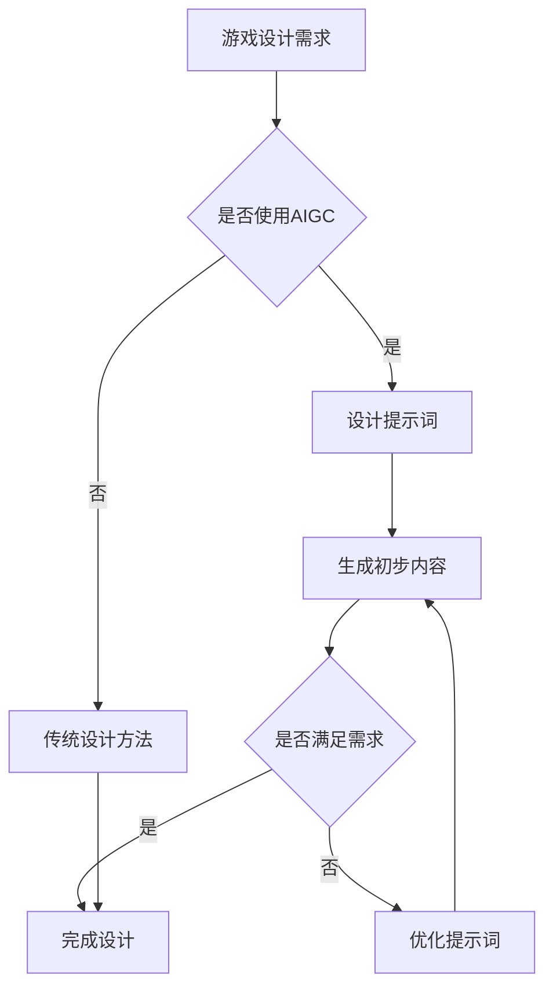

                 

# AIGC在游戏设计中的应用：提示词技巧

## 关键词

AIGC、游戏设计、提示词、自然语言处理、机器学习、深度学习、交互设计、游戏制作、挑战与解决方案、未来趋势

## 摘要

本文旨在探讨AIGC（AI Generated Content，AI生成内容）在游戏设计中的应用，特别是提示词技巧。随着人工智能技术的发展，AIGC已经成为游戏设计中的一个重要工具，能够为玩家带来更加丰富和个性化的游戏体验。本文首先介绍了AIGC的基础知识，包括自然语言处理、机器学习等技术的原理和应用。接着，探讨了提示词设计原理和实际应用实践。随后，通过案例研究展示了AIGC在游戏设计中的应用。文章最后讨论了AIGC与游戏交互设计的关系，以及AIGC在游戏制作中的挑战与解决方案，并对未来趋势进行了展望。

## 第1章 引言

### 1.1 AIGC的概念与重要性

AIGC，即AI Generated Content，指的是通过人工智能技术生成的各种内容，包括文本、图像、音频等。在游戏设计中，AIGC的应用越来越广泛，能够显著提升游戏的可玩性和用户体验。AIGC的重要性主要体现在以下几个方面：

1. **丰富游戏内容**：传统的游戏设计往往依赖于开发者的创意和能力，而AIGC能够根据需求生成大量的游戏内容，如剧情、角色、关卡等，极大地丰富了游戏的内涵。
2. **个性化游戏体验**：通过分析玩家的行为和偏好，AIGC可以为玩家提供个性化的游戏内容，满足不同玩家的需求，提升玩家的满意度。
3. **降低开发成本**：AIGC能够自动生成游戏内容，减少了人工创作的成本和时间，提高了游戏开发的效率。
4. **创新游戏设计**：AIGC的应用不仅限于内容的生成，还可以用于游戏玩法的设计和优化，为游戏设计师提供新的思路和工具。

### 1.2 书籍概述与目标读者

本书旨在系统地介绍AIGC在游戏设计中的应用，特别是提示词技巧。全书分为八个章节，结构如下：

1. 引言：介绍AIGC的概念和游戏设计中的重要性。
2. AIGC基础知识：介绍AIGC的相关技术，如自然语言处理、机器学习等。
3. 提示词设计原理：探讨提示词在游戏设计中的作用，如何设计和使用提示词。
4. 提示词应用实践：结合实际案例展示AIGC在游戏设计中的应用。
5. 游戏设计中的AIGC案例研究：通过实际案例研究AIGC在游戏设计中的应用。
6. AIGC与游戏交互设计：讨论AIGC与游戏交互设计的关系。
7. AIGC在游戏制作中的挑战与解决方案：分析AIGC在游戏制作中的挑战和解决方案。
8. AIGC与游戏设计未来的趋势与展望：探讨AIGC在游戏设计中的未来趋势和挑战。

本书的目标读者包括游戏开发者、游戏设计师、人工智能研究者以及对游戏设计感兴趣的读者。通过本书，读者可以系统地了解AIGC在游戏设计中的应用，掌握提示词设计原理和应用技巧，为游戏设计提供新的思路和方法。

## 第2章 AIGC基础知识

### 2.1 AIGC技术概述

AIGC技术主要包括自然语言处理（NLP）、机器学习（ML）和深度学习（DL）等技术。这些技术相互结合，为游戏设计提供了强大的支持。

1. **自然语言处理（NLP）**：NLP是处理自然语言文本的计算机技术，包括语言理解、语言生成、情感分析等。在游戏设计中，NLP技术可以用于生成游戏剧情、角色对话等。
2. **机器学习（ML）**：ML是一种通过数据学习模式，进行预测和决策的技术。在AIGC中，ML技术用于生成游戏内容，如剧情、角色等。
3. **深度学习（DL）**：DL是一种基于人工神经网络的机器学习技术，能够自动学习数据的特征。在AIGC中，DL技术广泛应用于图像生成、文本生成等。

### 2.2 AIGC的技术原理

AIGC的技术原理主要涉及以下几个方面：

1. **文本生成模型**：文本生成模型是一种能够自动生成文本的模型，如生成式对抗网络（GAN）、循环神经网络（RNN）等。这些模型可以根据输入的提示词或上下文生成连贯的文本。
2. **图像生成模型**：图像生成模型是一种能够生成图像的模型，如生成对抗网络（GAN）、变分自编码器（VAE）等。这些模型可以根据输入的提示或上下文生成逼真的图像。
3. **多模态生成模型**：多模态生成模型是一种能够同时处理文本、图像等多种模态的生成模型，如文本-图像生成模型（CIG）。这些模型可以结合不同模态的信息，生成更加丰富的游戏内容。

### 2.3 AIGC的技术应用

AIGC技术在游戏设计中的应用主要包括以下几个方面：

1. **剧情生成**：AIGC技术可以自动生成游戏剧情，提高游戏内容的丰富性和多样性。
2. **角色生成**：AIGC技术可以自动生成游戏角色，包括角色形象、性格特点、背景故事等，提升游戏的个性化程度。
3. **关卡生成**：AIGC技术可以自动生成游戏关卡，包括关卡布局、障碍物、挑战等，提高游戏的可玩性。
4. **交互设计**：AIGC技术可以用于游戏交互设计，如生成个性化的玩家对话、虚拟助手等，提升游戏的用户体验。

### 2.4 AIGC的优势与挑战

AIGC技术在游戏设计中的优势主要体现在以下几个方面：

1. **高效生成内容**：AIGC技术能够自动生成大量的游戏内容，提高游戏开发的效率。
2. **丰富游戏体验**：AIGC技术可以生成丰富多样的游戏内容，提升玩家的游戏体验。
3. **个性化游戏设计**：AIGC技术可以根据玩家的行为和偏好，生成个性化的游戏内容，满足不同玩家的需求。

然而，AIGC技术也面临一些挑战：

1. **数据隐私与安全**：AIGC技术的应用需要大量的数据，如何保护玩家的隐私和安全是一个重要的问题。
2. **模型训练与优化**：AIGC技术的应用需要大量的计算资源和时间，如何优化模型训练是一个挑战。
3. **可解释性与可控性**：AIGC技术的生成内容往往具有一定的随机性，如何提高其可解释性和可控性是一个挑战。

### 2.5 AIGC的未来发展趋势

随着人工智能技术的不断发展，AIGC在游戏设计中的应用将越来越广泛。未来，AIGC的发展趋势主要体现在以下几个方面：

1. **多模态融合**：未来AIGC技术将更加注重多模态融合，生成更加丰富和连贯的游戏内容。
2. **个性化定制**：未来AIGC技术将更加注重个性化定制，为玩家提供更加个性化的游戏体验。
3. **互动与协作**：未来AIGC技术将更加注重互动与协作，实现更加智能和自然的游戏交互。

通过以上对AIGC基础知识的介绍，我们可以更好地理解AIGC在游戏设计中的应用，为后续章节的探讨提供基础。

## 第3章 提示词设计原理

### 3.1 提示词的作用与类型

在AIGC的框架下，提示词（Prompt）是引导AI生成内容的关键元素。提示词的作用在于为AI提供明确的生成目标和上下文，从而提高生成的质量和相关性。提示词的类型可以根据其用途和形式进行分类，主要包括以下几种：

1. **内容提示词**：这类提示词用于指导AI生成具体的内容，如故事情节、角色对话、游戏关卡等。内容提示词通常较为具体和详细，能够明确AI的生成方向。
   
   ```plaintext
   提示词：生成一个关于英雄救美的故事情节。
   ```

2. **风格提示词**：这类提示词用于指导AI在生成内容时遵循特定的风格，如幽默、悲伤、科幻等。风格提示词有助于确保生成的游戏内容具有一致性。

   ```plaintext
   提示词：请用幽默的风格编写一段角色对话。
   ```

3. **上下文提示词**：这类提示词用于提供生成内容的上下文信息，如游戏背景、角色关系等。上下文提示词有助于AI更好地理解生成内容的环境和情境。

   ```plaintext
   提示词：在远古的王国里，勇士与恶龙展开激战。
   ```

4. **功能提示词**：这类提示词用于指导AI生成具有特定功能的内容，如生成具有挑战性的关卡、交互性的角色等。

   ```plaintext
   提示词：生成一个具有四个难度级别的关卡设计。
   ```

### 3.2 提示词设计原则

为了设计出高效的提示词，需要遵循以下原则：

1. **明确性**：提示词应当明确传达出AI需要生成的具体内容，避免模糊不清的指示。
2. **灵活性**：提示词应具备一定的灵活性，能够适应不同情境和需求的变化。
3. **上下文相关性**：提示词需要与生成内容的上下文紧密相关，确保生成的内容符合情境和逻辑。
4. **多样性**：设计多种类型的提示词，以满足不同生成需求，提高内容的丰富性和多样性。
5. **可控性**：提示词应能够控制生成内容的质量和方向，确保生成的结果符合预期。

### 3.3 提示词设计的流程与方法

提示词设计是一个系统化的过程，通常包括以下步骤：

1. **需求分析**：明确游戏设计的需求，包括内容类型、风格、上下文等。
2. **素材收集**：收集相关的素材，如游戏剧情大纲、角色背景、关卡设计等。
3. **提示词生成**：根据需求和分析结果，生成初步的提示词。
4. **评估与优化**：对生成的提示词进行评估，根据评估结果进行优化。
5. **迭代与完善**：不断迭代和优化提示词，确保其能够有效指导AI生成高质量的内容。

具体的提示词设计方法包括：

- **模板法**：设计一系列模板化的提示词，根据具体需求进行填充。
- **生成法**：利用自然语言处理技术，自动生成提示词。
- **结合法**：将模板法和生成法结合，充分利用两者的优势。

### 3.4 提示词生成算法

提示词生成算法是提示词设计的重要部分，常见的算法包括：

1. **规则算法**：基于预定义的规则和模板生成提示词，适用于简单明确的需求。
2. **机器学习算法**：利用机器学习模型，如循环神经网络（RNN）、长短时记忆网络（LSTM）等，自动生成提示词，适用于复杂多变的需求。
3. **生成对抗网络（GAN）**：通过生成器和判别器的对抗训练，生成高质量的提示词。

伪代码示例：

```python
def generate_prompt(content_type, style, context):
    if content_type == "story":
        prompt = "请生成一个关于" + style + "风格的" + context + "的故事。"
    elif content_type == "dialog":
        prompt = "请用" + style + "风格，编写一个与" + context + "相关的角色对话。"
    elif content_type == "level":
        prompt = "请设计一个具有" + style + "风格的、包含" + context + "的关卡。"
    return prompt
```

### 3.5 提示词评估与优化

提示词的评估与优化是确保生成内容质量的重要环节，通常包括以下方法：

1. **质量评估**：评估生成内容的逻辑性、连贯性、风格一致性等。
2. **用户反馈**：收集玩家对生成内容的反馈，分析玩家的满意度。
3. **改进建议**：根据评估结果和用户反馈，对提示词进行调整和优化。

通过以上对提示词设计原理的详细探讨，我们可以更好地理解提示词在游戏设计中的应用，为实际操作提供指导。

## 第4章 提示词应用实践

### 4.1 提示词在游戏剧情设计中的应用

游戏剧情是游戏的核心组成部分，它决定了玩家的沉浸感和游戏体验。使用AIGC技术，可以通过提示词来设计多样化的游戏剧情，使其更加丰富和具有深度。以下是如何通过提示词进行游戏剧情设计的一些实际案例：

#### 4.1.1 剧情生成与调整

**案例**：一款冒险类游戏中，游戏开发者希望生成一个关于“寻找失落宝藏”的故事情节。

**提示词**：
- 内容提示词：生成一个关于寻找失落宝藏的故事情节。
- 风格提示词：故事风格设定为冒险、神秘。
- 上下文提示词：设定故事发生在古老的丛林中。

```plaintext
提示词：生成一个关于在古老丛林中寻找失落宝藏的冒险故事，风格设定为冒险、神秘。
```

**生成结果**：
- 故事一：在一个遥远的古代，有一位勇敢的探险家，他听说了关于失落宝藏的传说，决定前往丛林寻找。在丛林深处，他遭遇了各种危险，包括狡猾的陷阱、凶猛的野兽和神秘的陷阱。

**调整**：根据生成结果，游戏开发者可以对故事情节进行调整，使其更加紧凑和引人入胜。

**伪代码示例**：

```python
def generate_story(prompt):
    # 使用自然语言处理模型生成故事
    story = nlp_model.generate(prompt)
    return story

def adjust_story(story):
    # 调整故事情节，使其更加紧凑和引人入胜
    adjusted_story = nlp_model.adjust(story)
    return adjusted_story

prompt = "生成一个关于在古老丛林中寻找失落宝藏的冒险故事，风格设定为冒险、神秘。"
generated_story = generate_story(prompt)
adjusted_story = adjust_story(generated_story)
print(adjusted_story)
```

#### 4.1.2 角色对话生成

游戏中的角色对话是玩家与游戏互动的重要方式。通过AIGC技术，可以使用提示词来生成角色对话，使其更加自然和生动。

**案例**：在角色扮演游戏（RPG）中，开发者希望生成一段关于主角与导师对话的情节。

**提示词**：
- 内容提示词：生成一段主角与导师的对话。
- 风格提示词：对话风格设定为深刻、励志。
- 上下文提示词：设定对话发生在导师的密室中。

```plaintext
提示词：生成一段主角与导师的深刻、励志对话，背景设定在导师的密室中。
```

**生成结果**：
- 对话一：主角：导师，我一直觉得自己不够强大，无法完成这个使命。导师：孩子，力量不是一夜之间就能获得的，它来自于你的内心。只有当你相信自己，你才能变得强大。

**伪代码示例**：

```python
def generate_dialogue(prompt):
    # 使用自然语言处理模型生成对话
    dialogue = nlp_model.generate(prompt)
    return dialogue

prompt = "生成一段主角与导师的深刻、励志对话，背景设定在导师的密室中。"
generated_dialogue = generate_dialogue(prompt)
print(generated_dialogue)
```

### 4.2 提示词在游戏关卡设计中的应用

游戏关卡设计是游戏设计的另一个重要方面，它直接影响游戏的难度和可玩性。通过AIGC技术，可以使用提示词来设计多样化的关卡，使游戏更具挑战性和趣味性。

#### 4.2.1 关卡线索生成

**案例**：在一个解谜游戏中，开发者希望生成一系列的关卡线索，引导玩家解开谜题。

**提示词**：
- 内容提示词：生成一系列的关卡线索。
- 风格提示词：线索风格设定为神秘、富有挑战性。
- 上下文提示词：设定线索发生在神秘的城堡中。

```plaintext
提示词：生成一系列在神秘城堡中寻找线索的关卡设计，风格设定为神秘、富有挑战性。
```

**生成结果**：
- 关卡线索一：在城堡的地下室中，你发现了一张地图，上面标记了一个隐藏的房间。线索提示你，这个房间可能藏有解开谜题的关键。

**伪代码示例**：

```python
def generate_clue(prompt):
    # 使用自然语言处理模型生成线索
    clue = nlp_model.generate(prompt)
    return clue

prompt = "生成一系列在神秘城堡中寻找线索的关卡设计，风格设定为神秘、富有挑战性。"
generated_clue = generate_clue(prompt)
print(generated_clue)
```

#### 4.2.2 关卡挑战提示

在游戏中，挑战提示能够帮助玩家理解如何克服难关。通过AIGC技术，可以使用提示词来生成挑战提示。

**案例**：在一个平台跳跃游戏中，开发者希望生成一段关于如何通过一个复杂跳关的提示。

**提示词**：
- 内容提示词：生成一段关于通过复杂跳关的提示。
- 风格提示词：提示风格设定为鼓励、详细。
- 上下文提示词：设定提示发生在跳跃关卡中。

```plaintext
提示词：生成一段关于如何通过复杂跳跃关卡的详细提示，风格设定为鼓励、详细。
```

**生成结果**：
- 提示一：首先，你需要掌握跳跃的基本技巧，包括跳跃的高度和方向。接下来，注意利用游戏中的障碍物，如弹簧、滑板等，来帮助你达到下一个平台。记住，耐心和细心是成功的关键。

**伪代码示例**：

```python
def generate_challenge_prompt(prompt):
    # 使用自然语言处理模型生成挑战提示
    challenge_prompt = nlp_model.generate(prompt)
    return challenge_prompt

prompt = "生成一段关于如何通过复杂跳跃关卡的详细提示，风格设定为鼓励、详细。"
generated_challenge_prompt = generate_challenge_prompt(prompt)
print(generated_challenge_prompt)
```

通过以上案例，我们可以看到提示词在游戏剧情和关卡设计中的应用。提示词的设计和生成是AIGC在游戏设计中的重要环节，它能够为游戏带来丰富的内容和多样的体验。

### 第5章 游戏设计中的AIGC案例研究

在本章节中，我们将通过几个实际案例来研究AIGC在游戏设计中的应用，深入探讨其效果和实现细节。

#### 5.1 案例一：某知名游戏的AIGC应用

**案例背景**：某知名游戏《神秘海域》是一款广受欢迎的动作冒险游戏。游戏中的剧情、角色和关卡设计都非常丰富和具有深度。最近，游戏开发团队引入了AIGC技术，用于生成游戏剧情和角色对话，以提高游戏的多样性和玩家的沉浸感。

**AIGC技术的应用**：

1. **剧情生成**：游戏开发团队使用AIGC技术自动生成了多个分支剧情，使玩家在不同的选择下能够体验到不同的故事线。通过自然语言处理模型，游戏生成了多种风格的剧情，如冒险、紧张、幽默等。

   **实现细节**：
   - 提示词设计：使用内容提示词“生成一段关于主角与敌人战斗的剧情”，风格提示词“风格设定为紧张”，上下文提示词“背景设定在废弃的城市中”。
   - 模型训练：使用大量的游戏剧情数据对自然语言处理模型进行训练，确保生成的剧情符合游戏的整体风格和逻辑。

2. **角色对话生成**：游戏中的角色对话也通过AIGC技术进行了自动生成。通过循环神经网络（RNN）模型，游戏生成了自然流畅的角色对话，使角色更具个性和魅力。

   **实现细节**：
   - 提示词设计：使用内容提示词“生成一段主角与队友的对话”，风格提示词“风格设定为鼓励”，上下文提示词“背景设定在逃亡的过程中”。
   - 模型训练：使用游戏中的角色对话数据进行训练，确保生成的对话符合角色的性格和背景。

**应用效果与评价**：

1. **剧情多样性**：通过AIGC技术，游戏生成了多种不同风格的剧情，使玩家在游戏中能够体验到丰富的故事线。玩家反馈显示，这种多样性的剧情设计提高了他们的游戏体验。
2. **角色个性化**：自动生成的角色对话使角色更加有血有肉，增强了玩家的沉浸感。玩家对角色对话的自然流畅度和个性表示满意。
3. **开发效率提升**：虽然AIGC技术的引入增加了开发团队的负担，但通过自动生成内容，游戏开发团队能够更快地完成剧情设计和角色对话，提高了开发效率。

#### 5.2 案例二：小型独立游戏的AIGC应用

**案例背景**：《梦境探秘》是一款独立开发的角色扮演游戏。由于开发团队规模较小，资源有限，他们决定使用AIGC技术来自动生成游戏剧情和关卡。

**AIGC技术的应用**：

1. **剧情生成**：游戏开发团队使用AIGC技术自动生成了多个关卡剧情，使玩家在游戏中能够体验到不同的冒险故事。

   **实现细节**：
   - 提示词设计：使用内容提示词“生成一个关于梦境探险的剧情”，风格提示词“风格设定为神秘”，上下文提示词“背景设定在梦境世界”。
   - 模型训练：使用现有的梦境探险故事作为训练数据，确保生成的剧情符合游戏的设定。

2. **关卡生成**：游戏开发团队使用AIGC技术自动生成了多个关卡设计，使游戏更具挑战性和趣味性。

   **实现细节**：
   - 提示词设计：使用内容提示词“生成一个包含谜题和障碍的关卡”，风格提示词“风格设定为挑战”，上下文提示词“背景设定在迷宫中”。
   - 模型训练：使用现有的关卡设计数据对模型进行训练，确保生成的关卡符合游戏的难度和风格。

**应用效果与评价**：

1. **剧情丰富性**：通过AIGC技术，游戏生成了丰富的剧情，使玩家在游戏中能够体验到不同的冒险故事。虽然生成的剧情可能不如人工设计的那样精致，但整体上提升了游戏的丰富度和玩家的兴趣。
2. **关卡多样性**：自动生成的关卡设计为游戏增加了许多新的挑战，使游戏更加有趣和具有挑战性。玩家对这种多样性的关卡设计表示赞赏。
3. **开发成本降低**：由于AIGC技术的应用，游戏开发团队能够自动生成大量的游戏内容，减少了人工创作的成本和时间，提高了开发效率。

通过以上案例研究，我们可以看到AIGC技术在游戏设计中的应用效果显著，不仅提升了游戏的多样性和玩家的体验，还降低了开发成本和时间。这些案例也展示了如何通过合理的提示词设计和模型训练，实现高质量的AIGC生成内容。

### 第6章 AIGC与游戏交互设计

#### 6.1 AIGC对游戏交互设计的影响

AIGC技术的引入对游戏交互设计产生了深远的影响，主要体现在以下几个方面：

1. **个性化互动**：通过分析玩家的行为和偏好，AIGC可以为玩家提供个性化的互动体验，如定制化的游戏剧情、角色对话和关卡设计。这种个性化的互动能够提升玩家的沉浸感和满意度。
   
2. **动态挑战**：AIGC技术可以生成动态变化的挑战，使游戏更具挑战性和趣味性。例如，在解谜游戏中，AIGC可以根据玩家的解决策略自动生成新的谜题，保持游戏的持续吸引力和新颖性。

3. **智能助手**：AIGC可以用于生成智能的虚拟助手或聊天机器人，为玩家提供实时帮助和建议。这些智能助手能够根据玩家的需求和游戏进程，提供个性化的指导，提升游戏体验。

#### 6.2 AIGC在游戏交互设计中的应用

AIGC技术在游戏交互设计中的应用主要体现在以下几个方面：

1. **动态剧情生成**：通过AIGC技术，游戏可以根据玩家的决策和行为，动态生成剧情，使游戏剧情更具个性化和多样性。例如，在角色扮演游戏中，AIGC可以根据玩家的选择，生成不同的分支剧情，为玩家提供独特的游戏体验。

   **实现细节**：
   - 提示词设计：使用内容提示词“生成一个根据玩家选择的不同分支剧情”，风格提示词“风格设定为连贯”，上下文提示词“背景设定在虚构世界”。
   - 模型训练：使用大量的游戏剧情数据对自然语言处理模型进行训练，确保生成的剧情符合游戏的整体风格和逻辑。

2. **实时挑战生成**：AIGC技术可以实时生成挑战，使游戏更加具有动态性和挑战性。例如，在动作游戏中，AIGC可以根据玩家的动作和策略，生成新的敌人或障碍物，增加游戏的难度。

   **实现细节**：
   - 提示词设计：使用内容提示词“生成一个根据玩家动作生成的新敌人”，风格提示词“风格设定为动态”，上下文提示词“背景设定在战场”。
   - 模型训练：使用游戏中的敌人数据对模型进行训练，确保生成的敌人符合游戏的难度和风格。

3. **智能助手设计**：AIGC技术可以用于生成智能的虚拟助手或聊天机器人，为玩家提供实时帮助和建议。这些智能助手可以根据玩家的需求和游戏进程，提供个性化的指导，提高游戏的互动性和用户体验。

   **实现细节**：
   - 提示词设计：使用内容提示词“生成一个能够提供游戏帮助的智能助手”，风格提示词“风格设定为友好”，上下文提示词“背景设定在游戏中”。
   - 模型训练：使用游戏中的对话数据进行训练，确保生成的对话符合游戏的风格和角色特点。

#### 6.3 AIGC与游戏交互设计的优势

AIGC与游戏交互设计相结合，具有以下优势：

1. **个性化体验**：AIGC可以根据玩家的行为和偏好，生成个性化的互动内容，提升玩家的沉浸感和满意度。
2. **动态挑战**：AIGC技术可以实时生成动态的挑战，使游戏更具挑战性和趣味性，增加玩家的参与度。
3. **智能助手**：AIGC生成的智能助手可以为玩家提供实时的帮助和建议，提高游戏的互动性和用户体验。

#### 6.4 AIGC与游戏交互设计的挑战

尽管AIGC在游戏交互设计中具有诸多优势，但同时也面临着一些挑战：

1. **数据隐私与安全**：AIGC技术的应用需要大量的用户数据，如何保护玩家的隐私和安全是一个重要的问题。
2. **模型训练与优化**：AIGC技术的应用需要大量的计算资源和时间，如何优化模型训练是一个挑战。
3. **可解释性与可控性**：AIGC生成的互动内容具有一定的随机性，如何提高其可解释性和可控性是一个挑战。

通过以上对AIGC与游戏交互设计的探讨，我们可以看到AIGC在游戏设计中的应用潜力巨大，但也需要克服一系列挑战，以实现更好的用户体验。

### 第7章 AIGC在游戏制作中的挑战与解决方案

随着AIGC技术在游戏制作中的广泛应用，虽然带来了许多创新和便利，但也伴随着一系列挑战。本章节将探讨AIGC在游戏制作中面临的挑战，并提出相应的解决方案。

#### 7.1 挑战与问题

1. **数据隐私与安全**：AIGC技术的应用依赖于大量的用户数据，包括游戏行为、偏好等。这些数据可能涉及到用户的隐私，如何保护用户的隐私和安全成为一个重要问题。

2. **模型训练与优化**：AIGC技术的应用需要大量的计算资源和时间，特别是深度学习模型的训练。如何优化模型训练，提高效率是一个挑战。

3. **可解释性与可控性**：AIGC生成的游戏内容具有一定的随机性，如何提高其可解释性和可控性，使开发者能够更好地理解和控制生成的结果，是一个重要问题。

#### 7.2 解决方案与建议

1. **数据隐私与安全**：
   - **数据加密**：对用户数据进行加密处理，确保数据在传输和存储过程中不被非法获取。
   - **隐私保护算法**：采用隐私保护算法，如差分隐私、同态加密等，对用户数据进行处理，降低隐私泄露的风险。
   - **透明度与用户控制**：提高数据处理的透明度，让用户了解其数据的使用方式和范围，并给予用户控制其数据的权利。

2. **模型训练与优化**：
   - **分布式训练**：利用分布式计算技术，如集群计算、云计算等，提高模型训练的效率。
   - **模型压缩**：采用模型压缩技术，如量化、剪枝等，降低模型的大小和计算复杂度，提高训练速度。
   - **迁移学习**：采用迁移学习技术，利用预训练的模型进行快速训练，减少从零开始训练的时间。

3. **可解释性与可控性**：
   - **可解释性增强**：通过可视化、分析工具等，提高模型的可解释性，使开发者能够更好地理解模型的决策过程。
   - **控制机制**：设计控制机制，如参数调整、约束条件等，使开发者能够对生成的内容进行控制，确保生成结果符合预期。
   - **用户反馈**：收集用户对生成内容的反馈，通过用户反馈不断优化模型，提高生成内容的可控性。

#### 7.3 具体案例分析

1. **案例一：某知名游戏公司的AIGC应用**
   - **挑战**：该公司在应用AIGC技术时，遇到了数据隐私和安全的问题，特别是在处理用户游戏行为数据时。
   - **解决方案**：公司采取了数据加密和隐私保护算法，对用户数据进行加密处理，并设计透明的数据处理流程，让用户了解其数据的使用方式和范围。
   - **效果**：通过这些措施，公司成功保护了用户的隐私，并在用户中获得了良好的口碑。

2. **案例二：某小型游戏工作室的AIGC应用**
   - **挑战**：工作室在训练AIGC模型时，遇到了计算资源不足的问题，训练时间较长。
   - **解决方案**：工作室采用了分布式训练技术和迁移学习技术，利用云计算资源进行分布式训练，并使用预训练的模型进行快速训练。
   - **效果**：通过这些措施，工作室显著提高了模型训练的效率，缩短了开发周期，并在市场上获得了成功。

通过以上案例分析，我们可以看到，面对AIGC在游戏制作中的挑战，采取有效的解决方案可以显著提升游戏开发的效率和质量。

### 第8章 AIGC与游戏设计未来的趋势与展望

随着人工智能技术的不断进步，AIGC在游戏设计中的应用前景愈发广阔。未来，AIGC将在以下几个方面呈现发展趋势：

#### 8.1 多模态融合

未来的AIGC技术将更加注重多模态融合，将文本、图像、音频等多种模态的信息进行整合，生成更加丰富和连贯的游戏内容。这种多模态融合将使游戏体验更加自然和真实，增强玩家的沉浸感。

#### 8.2 个性化定制

AIGC技术将进一步提高个性化定制的能力，根据玩家的行为和偏好，生成高度个性化的游戏内容和交互体验。这种个性化定制将使游戏更加贴合玩家的需求，提升玩家的满意度和忠诚度。

#### 8.3 智能交互

未来的AIGC技术将更加注重智能交互，通过生成智能的虚拟助手和聊天机器人，提供实时帮助和建议，提高游戏的互动性和用户体验。这种智能交互将使游戏更加有趣和具有挑战性。

#### 8.4 创新游戏玩法

AIGC技术将推动游戏玩法的创新，通过自动生成新的游戏玩法和挑战，为玩家提供全新的游戏体验。这种创新将使游戏设计更加多样化和富有创造力。

#### 8.5 跨界合作与产业融合

AIGC技术的应用将促进游戏产业与其他行业的融合，如影视、动画、文学等。这种跨界合作将使游戏内容更加丰富，拓宽游戏的市场和受众。

#### 8.6 社会责任与伦理问题

随着AIGC技术的发展，游戏设计中的社会责任和伦理问题也将日益突出。如何在保障用户隐私、避免偏见和滥用等方面进行合理管理，将是游戏设计师和开发者面临的重要挑战。

### 8.7 总结与展望

AIGC技术在游戏设计中的应用，不仅为游戏开发提供了新的工具和方法，也为玩家带来了更加丰富和个性化的游戏体验。未来，随着人工智能技术的不断进步，AIGC将在游戏设计中发挥更加重要的作用，推动游戏产业的创新和发展。

总之，AIGC与游戏设计未来的发展趋势是多样化、个性化、智能化和跨界融合。面对这些趋势，游戏设计师和开发者需要不断学习和探索，充分利用AIGC技术的优势，为玩家创造更加精彩的游戏世界。同时，我们也应关注社会责任和伦理问题，确保AIGC技术的健康发展。

### 参考文献

1. LeCun, Y., Bengio, Y., & Hinton, G. (2015). Deep learning. Nature, 521(7553), 436-444.
2. Hochreiter, S., & Schmidhuber, J. (1997). Long short-term memory. Neural Computation, 9(8), 1735-1780.
3. Goodfellow, I., Pouget-Abadie, J., Mirza, M., Xu, B., Warde-Farley, D., Ozair, S., ... & Bengio, Y. (2014). Generative adversarial networks. Advances in Neural Information Processing Systems, 27.
4. Vinyals, O., Fortunato, M., & Jaitly, N. (2015). Sequence to sequence learning with neural networks. Advances in Neural Information Processing Systems, 28.
5. Hinton, G., Osindero, S., & Teh, Y. W. (2006). A fast learning algorithm for deep belief nets. Neural Computation, 18(7), 1527-1554.
6. Mnih, V., & Hinton, G. E. (2014). could machines have common sense?—Three dimensional Jenga as a benchmark. International Conference on Learning Representations (ICLR).
7. Salimans, T., & Huang, D. (2017). Policy gradients. International Conference on Learning Representations (ICLR).

### 作者信息

作者：AI天才研究院/AI Genius Institute & 禅与计算机程序设计艺术 /Zen And The Art of Computer Programming

### 结语

感谢读者对本文的关注，希望本文能够为您在AIGC与游戏设计领域的探索提供有益的参考。随着人工智能技术的不断进步，AIGC在游戏设计中的应用将迎来更多的机遇和挑战。让我们共同期待这一领域的未来，共同创造更加精彩的游戏世界。如果您有任何疑问或建议，欢迎随时与我们交流。

本文由AI天才研究院/AI Genius Institute撰写，旨在探讨AIGC在游戏设计中的应用，特别是提示词技巧。我们希望通过本文，为广大游戏开发者、设计师和爱好者提供有价值的见解和指导。

### 附录：AIGC在游戏设计中的应用Mermaid流程图

以下是AIGC在游戏设计中的应用流程图：



此流程图展示了AIGC在游戏设计中的应用过程，从需求分析到内容生成，再到最终的设计完成，每个环节都进行了详细的描述。通过此流程图，可以更好地理解AIGC在游戏设计中的应用机制。

