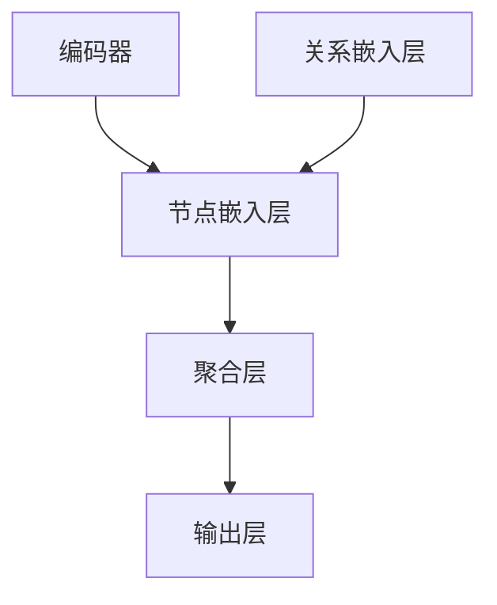
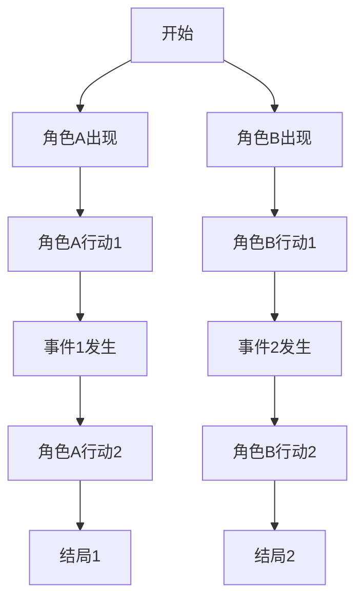

                 

### 文章标题

《AIGC在游戏设计中的革新：动态剧情生成》

### 关键词

- AIGC
- 游戏设计
- 动态剧情生成
- 人工智能
- 自然语言处理
- 图神经网络

### 摘要

本文旨在探讨人工智能生成内容（AIGC）在游戏设计中的创新应用，尤其是动态剧情生成技术。随着游戏产业的不断发展，游戏设计面临着日益复杂的挑战，如多样化的玩家需求和剧情复杂性。AIGC通过结合自然语言处理和图神经网络等技术，提供了一种生成丰富、动态的剧情内容的新途径。本文将深入分析AIGC的核心概念和架构，讲解其动态剧情生成算法原理，并通过实际项目案例展示其在游戏设计中的具体应用。同时，本文还将探讨AIGC在游戏设计中的潜在优势与挑战，以及相关的伦理和法律问题。

### 引言

随着计算机技术的飞速发展，人工智能（AI）的应用领域不断扩大。在游戏设计领域，人工智能正逐渐改变传统的剧情设计方式，带来前所未有的革新。人工智能生成内容（AI-Generated Content，简称AIGC）作为一种新兴的技术，正在成为游戏设计师的得力工具。AIGC利用机器学习和深度学习算法，能够自动生成游戏中的文本、剧情、角色和场景等内容，从而大幅提高游戏设计的灵活性和创意性。

在本文中，我们将重点关注AIGC在游戏设计中的核心应用——动态剧情生成。动态剧情生成是指通过算法自动生成变化多端的剧情内容，以适应不同玩家的游戏行为和喜好。这种技术不仅能够提高游戏的重玩价值，还能够为玩家带来更加沉浸式的游戏体验。随着AIGC技术的不断成熟，它已经在多个领域取得了显著的应用成果，如自然语言生成、图像生成和视频生成等。然而，在游戏设计领域，AIGC的应用还处于探索阶段，具有巨大的发展潜力。

本文的结构如下：首先，我们将介绍AIGC的基本概念和特点，探讨其在游戏设计中的应用潜力。接着，我们将深入分析AIGC的核心概念和架构，包括自然语言处理和图神经网络等技术。随后，我们将详细讲解动态剧情生成算法的原理，并展示其具体实现过程。为了更好地理解AIGC在游戏设计中的应用，我们还将通过实际项目案例进行详细剖析。最后，本文将讨论AIGC在游戏设计中的优势和挑战，以及相关的伦理和法律问题，并对未来发展趋势进行展望。

### AIGC与游戏设计概述

#### 1.1 AIGC的概念与特点

人工智能生成内容（AIGC）是一种利用人工智能技术自动生成内容的方法。它结合了机器学习、自然语言处理（NLP）、计算机视觉和深度学习等技术，能够生成文本、图像、音频和视频等多种形式的内容。AIGC的核心在于利用大规模数据集和复杂的算法模型，使计算机具备自主创作内容的能力。

AIGC具有以下几个主要特点：

1. **大数据驱动**：AIGC依赖于大量的数据进行训练，这些数据包括文本、图像、音频等，通过这些数据的积累，模型能够学习到丰富的知识和模式。

2. **自适应性**：AIGC能够根据不同的输入条件生成定制化的内容，具有很强的适应性。例如，在游戏设计中，可以根据玩家的游戏行为和偏好生成个性化的剧情和角色。

3. **高效性**：AIGC能够快速生成内容，极大地提高了内容生产的效率。这对于游戏设计师来说，意味着可以在短时间内创造出丰富多样的游戏内容。

4. **创新性**：AIGC通过机器学习算法，能够创造出新颖的内容，为游戏设计带来更多的创意和可能性。

在游戏设计中，AIGC的应用主要体现在以下几个方面：

1. **动态剧情生成**：通过AIGC技术，可以自动生成变化多端的剧情内容，为游戏玩家提供更加丰富和多样化的剧情体验。

2. **角色和场景设计**：AIGC能够生成具有独特性格和背景的角色，以及丰富的场景元素，为游戏世界增添更多的细节和层次。

3. **游戏剧本和故事线**：AIGC可以自动生成游戏剧本和故事线，使得游戏剧情更加连贯和引人入胜。

#### 1.2 游戏设计的现状与挑战

现代游戏设计面临着一系列挑战和瓶颈，这些挑战来源于游戏产业的快速发展和玩家需求的不断变化。

1. **玩家需求的多样化**：随着游戏市场的不断扩大，玩家对于游戏内容的需求变得更加多样化。他们不仅希望游戏提供丰富的剧情和角色，还希望游戏能够适应他们的个性化需求。

2. **剧情设计的复杂性**：现代游戏往往具有复杂的剧情结构，包括多层次的故事线、分支剧情和动态事件。设计这样的剧情需要大量的时间和精力。

3. **开发成本的高昂**：游戏开发成本日益增加，特别是对于大型游戏项目，开发成本可以高达数亿美元。如何在有限的资源下创造出高质量的剧情内容，成为游戏设计师的一大难题。

4. **重玩价值的提升**：现代游戏玩家越来越重视游戏的重玩价值，他们希望每次游戏体验都能有所不同。传统剧情设计方法难以满足这一需求。

#### 1.3 AIGC在游戏设计中的潜力

AIGC技术为游戏设计带来了巨大的潜力，能够在多个方面解决上述挑战：

1. **多样化剧情内容的生成**：AIGC可以通过自然语言处理技术生成多样化的剧情内容，满足玩家个性化的需求。

2. **剧情复杂性的简化**：通过AIGC，游戏设计师可以将复杂的剧情结构分解为多个层次，由算法自动生成和调整，从而简化剧情设计过程。

3. **开发成本的降低**：AIGC能够自动化生成内容，减少了人工设计的工作量，从而降低了开发成本。

4. **重玩价值的提升**：AIGC可以动态生成不同的剧情和角色，使得每次游戏体验都充满新鲜感，提升游戏的重玩价值。

综上所述，AIGC在游戏设计中的应用具有巨大的潜力，能够解决当前游戏设计面临的多个挑战，为游戏产业带来新的发展方向。

#### 2.1 自然语言处理基础

自然语言处理（NLP）是人工智能领域的一个重要分支，旨在使计算机理解和处理人类自然语言。NLP的核心目标是实现人与机器之间的自然语言交互，使得计算机能够自动理解、生成和处理文本信息。在AIGC的应用中，NLP扮演了至关重要的角色，它负责生成和解析游戏中的文本内容，如剧情、角色对话和游戏说明。

##### 2.1.1 语言模型

语言模型是NLP的基础，它通过统计语言中的概率分布，预测下一个词或者词组。一个典型的语言模型通常由大量的文本数据训练而成，这些数据可以是书籍、新闻、网页等。语言模型的主要目标是预测下一个词的概率，从而生成流畅、连贯的文本。最常见的语言模型是n-gram模型，它通过统计前n个词的频率来预测下一个词。

伪代码如下：

```python
# n-gram语言模型
def n_gram_model(text, n):
    # 计算n-gram频率
    n_gram_freq = {}
    for i in range(len(text) - n + 1):
        n_gram = tuple(text[i:i+n])
        if n_gram in n_gram_freq:
            n_gram_freq[n_gram] += 1
        else:
            n_gram_freq[n_gram] = 1
    
    # 计算概率
    total_freq = sum(n_gram_freq.values())
    n_gram_prob = {n_gram: freq / total_freq for n_gram, freq in n_gram_freq.items()}
    return n_gram_prob
```

##### 2.1.2 生成式模型

生成式模型是NLP中的一种重要模型，用于生成新的文本。生成式模型通过学习语言的概率分布，能够生成符合语言规则的文本。其中，最著名的生成式模型是变分自编码器（VAE）和生成对抗网络（GAN）。

**变分自编码器（VAE）**：

VAE是一种无监督学习模型，通过编码器和解码器生成新的数据。在文本生成中，编码器将输入文本映射到一个潜在空间，解码器则从潜在空间生成新的文本。

伪代码如下：

```python
# VAE文本生成
class VAE(nn.Module):
    def __init__(self):
        super(VAE, self).__init__()
        self.encoder = nn.Sequential(
            nn.Linear(input_size, hidden_size),
            nn.ReLU(),
            nn.Linear(hidden_size, z_size)
        )
        self.decoder = nn.Sequential(
            nn.Linear(z_size, hidden_size),
            nn.ReLU(),
            nn.Linear(hidden_size, input_size)
        )
    
    def reparameterize(self, mu, log_var):
        std = torch.exp(0.5 * log_var)
        eps = torch.randn_like(std)
        return mu + eps * std
    
    def forward(self, x):
        mu, log_var = self.encoder(x)
        z = self.reparameterize(mu, log_var)
        x_recon = self.decoder(z)
        return x_recon, mu, log_var
```

**生成对抗网络（GAN）**：

GAN由生成器和判别器组成。生成器生成虚假文本，判别器判断文本的真伪。通过不断训练，生成器的生成质量逐渐提高。

伪代码如下：

```python
# GAN文本生成
class GAN(nn.Module):
    def __init__(self):
        super(GAN, self).__init__()
        self.generator = nn.Sequential(
            nn.Linear(z_size, hidden_size),
            nn.ReLU(),
            nn.Linear(hidden_size, input_size)
        )
        self.discriminator = nn.Sequential(
            nn.Linear(input_size, hidden_size),
            nn.LeakyReLU(0.2),
            nn.Linear(hidden_size, 1)
        )
    
    def forward(self, x):
        x_fake = self.generator(x)
        x_real = self.discriminator(x)
        x_fake = self.discriminator(x_fake)
        return x_fake, x_real
```

通过这些模型，AIGC能够自动生成丰富的文本内容，为游戏设计提供强有力的支持。

#### 2.2 图神经网络基础

图神经网络（Graph Neural Networks，GNN）是一种专门处理图结构数据的神经网络模型，因其强大的图结构表示和关系建模能力，在许多领域得到了广泛应用。在AIGC中，GNN被用来处理复杂的图结构数据，如社交网络、知识图谱和游戏场景等，以生成和解析具有高度关联性的内容。

##### 2.2.1 图神经网络的基本原理

图神经网络通过图结构来表示数据，其中节点表示数据实体，边表示实体之间的关系。GNN的基本原理是通过聚合节点邻域的信息来更新节点的表示。这种聚合操作通常包括局部感知和全局感知两个阶段。

1. **局部感知**：在局部感知阶段，节点会聚合其邻居节点的特征，形成一个新的特征向量。

2. **全局感知**：在全局感知阶段，节点的特征向量会被进一步更新，以反映整个图的上下文信息。

GNN的更新规则可以用以下数学公式表示：

$$
\text{h}_v^{(t+1)} = f(\text{h}_v^{(t)}, \text{h}_{u}^{(t)} + \text{h}_{w}^{(t)} + \ldots)
$$

其中，$h_v^{(t)}$表示节点$v$在时间步$t$的表示，$h_u^{(t)}, h_w^{(t)}, \ldots$表示节点$v$的邻居节点在时间步$t$的表示，$f$是一个聚合函数。

##### 2.2.2 图神经网络的应用

在AIGC中，GNN被广泛应用于场景生成、角色关系建模和剧情生成等领域。

1. **场景生成**：GNN可以用来生成具有高度关联性的游戏场景，如城市、森林和山脉等。通过节点表示场景中的物体，边表示物体之间的关系，GNN能够自动生成多样化的场景布局。

2. **角色关系建模**：GNN可以用来建模角色之间的关系，如亲情、友情和敌对关系等。通过节点表示角色，边表示角色之间的关系，GNN能够自动生成复杂的关系网络，为剧情生成提供支持。

3. **剧情生成**：GNN可以用来生成具有逻辑性和连贯性的剧情内容。通过节点表示剧情事件，边表示事件之间的逻辑关系，GNN能够自动生成复杂的剧情结构。

以下是一个简单的GNN模型结构：



在这个模型中，编码器将输入的节点和边表示成嵌入向量，关系嵌入层为边生成嵌入向量，聚合层将节点的邻居信息进行聚合，输出层生成最终的剧情表示。

通过这些应用，GNN为AIGC提供了强大的图结构数据处理能力，使得自动生成高度关联性的内容成为可能。

### 2.3 AIGC架构设计

AIGC的架构设计是其能够实现自动化生成内容的核心，它结合了自然语言处理（NLP）和图神经网络（GNN）等多种技术，形成了一个强大的内容生成系统。下面，我们将详细讨论AIGC的整体架构及其关键模块。

#### 2.3.1 整体架构

AIGC的整体架构可以分为以下几个主要模块：

1. **数据输入模块**：负责接收外部输入的数据，如文本、图像、音频等。这些数据经过预处理后，会被送入后续的模块进行处理。

2. **编码器模块**：编码器模块是AIGC的核心，它负责将输入的数据编码为高维的特征向量。在NLP领域，常用的编码器模型有BERT、GPT等；在图像领域，常用的编码器模型有ResNet、VGG等。

3. **中间处理模块**：这个模块负责处理编码器生成的特征向量，进行进一步的变换和组合。中间处理模块通常包含多个子模块，如注意力机制、循环神经网络（RNN）、变换器（Transformer）等。

4. **解码器模块**：解码器模块负责将中间处理模块生成的特征向量解码为生成的输出内容。在NLP领域，常用的解码器模型有BERT、GPT等；在图像领域，常用的解码器模型有生成对抗网络（GAN）等。

5. **输出模块**：输出模块负责将解码器生成的输出内容进行格式化，输出为人类可理解的形式，如文本、图像、音频等。

#### 2.3.2 关键模块

1. **编码器模块**：

编码器模块是AIGC架构中的关键组成部分，它负责将原始数据编码为高维特征向量。以下是一个简单的编码器模块的伪代码：

```python
# 编码器模块
class Encoder(nn.Module):
    def __init__(self, input_dim, hidden_dim):
        super(Encoder, self).__init__()
        self.fc = nn.Linear(input_dim, hidden_dim)
    
    def forward(self, x):
        x = self.fc(x)
        return x
```

在这个例子中，`input_dim`表示输入数据的维度，`hidden_dim`表示编码后特征向量的维度。

2. **解码器模块**：

解码器模块负责将编码后的特征向量解码为生成的输出内容。以下是一个简单的解码器模块的伪代码：

```python
# 解码器模块
class Decoder(nn.Module):
    def __init__(self, hidden_dim, output_dim):
        super(Decoder, self).__init__()
        self.fc = nn.Linear(hidden_dim, output_dim)
    
    def forward(self, x):
        x = self.fc(x)
        return x
```

在这个例子中，`hidden_dim`表示编码后特征向量的维度，`output_dim`表示输出数据的维度。

3. **中间处理模块**：

中间处理模块通常包含多个子模块，用于进一步处理编码后的特征向量。以下是一个简单的中间处理模块的伪代码：

```python
# 中间处理模块
class IntermediateModule(nn.Module):
    def __init__(self, hidden_dim):
        super(IntermediateModule, self).__init__()
        self.attention = nn.Linear(hidden_dim, hidden_dim)
    
    def forward(self, x):
        x = self.attention(x)
        return x
```

在这个例子中，`hidden_dim`表示编码后特征向量的维度。

通过这些关键模块的协同工作，AIGC能够自动生成多样化、高质量的内容，为游戏设计带来革命性的变化。

### 2.4 AIGC在游戏设计中的流程

AIGC在游戏设计中的应用流程主要包括数据采集与处理、剧情生成、角色生成和场景生成四个主要步骤。以下将详细描述每个步骤的具体实现过程。

#### 2.4.1 数据采集与处理

数据采集与处理是AIGC流程的起点。在这个步骤中，需要从多个来源收集大量相关数据，如游戏剧情文本、角色描述、场景描述等。收集到的数据通常包含文本、图像、音频等多种形式，这些数据需要进行预处理，以便后续的生成任务。

1. **文本数据预处理**：

文本数据预处理主要包括数据清洗、分词、词性标注和实体识别等步骤。通过这些预处理操作，可以将原始的文本数据转换为计算机可以处理的格式。

伪代码如下：

```python
# 文本数据预处理
def preprocess_text(text):
    # 数据清洗
    cleaned_text = remove_punctuation(text)
    # 分词
    tokens = tokenize(cleaned_text)
    # 词性标注
    tagged_tokens = pos_tag(tokens)
    # 实体识别
    entities = extract_entities(tagged_tokens)
    return entities
```

2. **图像和音频数据预处理**：

图像和音频数据预处理包括数据增强、归一化和特征提取等步骤。通过这些预处理操作，可以提高数据的质量和多样性，为后续的生成任务提供更好的支持。

伪代码如下：

```python
# 图像数据预处理
def preprocess_image(image):
    # 数据增强
    augmented_image = augment_image(image)
    # 归一化
    normalized_image = normalize_image(augmented_image)
    # 特征提取
    features = extract_features(normalized_image)
    return features

# 音频数据预处理
def preprocess_audio(audio):
    # 数据增强
    augmented_audio = augment_audio(audio)
    # 归一化
    normalized_audio = normalize_audio(augmented_audio)
    # 特征提取
    features = extract_features(normalized_audio)
    return features
```

#### 2.4.2 剧情生成

剧情生成是AIGC在游戏设计中的核心步骤。通过自然语言处理和生成式模型，可以自动生成丰富多样的剧情内容。以下是剧情生成的主要过程：

1. **训练生成模型**：

首先，需要使用收集到的文本数据训练生成模型。常用的生成模型包括变分自编码器（VAE）、生成对抗网络（GAN）和递归神经网络（RNN）等。

伪代码如下：

```python
# 训练生成模型
def train_generator(generator, dataset, num_epochs):
    for epoch in range(num_epochs):
        for data in dataset:
            # 前向传播
            outputs = generator(data)
            # 计算损失
            loss = calculate_loss(outputs, data)
            # 反向传播
            generator.zero_grad()
            loss.backward()
            generator.step()
```

2. **生成剧情文本**：

通过训练好的生成模型，可以生成新的剧情文本。生成过程通常采用递归的方式，逐个生成每个词或词组。

伪代码如下：

```python
# 生成剧情文本
def generate_story(generator, start_word, max_length):
    current_word = start_word
    story = []
    for _ in range(max_length):
        # 生成下一个词
        next_word = generator.predict(current_word)
        # 更新当前词
        current_word = next_word
        # 添加到剧情文本
        story.append(next_word)
    return ' '.join(story)
```

#### 2.4.3 角色生成

角色生成是AIGC在游戏设计中的另一个重要步骤。通过生成对抗网络（GAN）和图神经网络（GNN），可以自动生成具有独特性格和外观的角色。

1. **训练生成模型**：

使用角色描述文本和图像数据训练生成模型。生成模型包括图像生成器和文本生成器。

伪代码如下：

```python
# 训练生成模型
def train_gan(generator, discriminator, dataset, num_epochs):
    for epoch in range(num_epochs):
        for data in dataset:
            # 训练图像生成器
            generator.train()
            # 前向传播
            outputs = generator(data)
            # 计算损失
            g_loss = calculate_g_loss(outputs, data)
            # 反向传播
            generator.zero_grad()
            g_loss.backward()
            generator.step()
            
            # 训练判别器
            discriminator.train()
            # 前向传播
            real_labels = generate_real_labels(data)
            fake_labels = generate_fake_labels(outputs)
            # 计算损失
            d_loss = calculate_d_loss(real_labels, fake_labels)
            # 反向传播
            discriminator.zero_grad()
            d_loss.backward()
            discriminator.step()
```

2. **生成角色图像和描述**：

通过训练好的生成模型，可以生成新的角色图像和描述。生成过程采用对抗生成网络（GAN）的方式，交替训练图像生成器和文本生成器。

伪代码如下：

```python
# 生成角色图像和描述
def generate_character(generator, text):
    # 生成角色图像
    image = generator.generate_image(text)
    # 生成角色描述
    description = generator.generate_description(text)
    return image, description
```

#### 2.4.4 场景生成

场景生成是通过AIGC技术自动生成具有高度关联性的游戏场景。图神经网络（GNN）在场景生成中发挥着重要作用。

1. **训练生成模型**：

使用场景描述文本和图结构数据训练生成模型。生成模型包括图像生成器和图生成器。

伪代码如下：

```python
# 训练生成模型
def train_gnn(generator, dataset, num_epochs):
    for epoch in range(num_epochs):
        for data in dataset:
            # 前向传播
            outputs = generator(data)
            # 计算损失
            loss = calculate_loss(outputs, data)
            # 反向传播
            generator.zero_grad()
            loss.backward()
            generator.step()
```

2. **生成场景图像和描述**：

通过训练好的生成模型，可以生成新的场景图像和描述。生成过程采用图神经网络（GNN）的方式，将场景描述文本转换为图结构数据，再生成相应的图像。

伪代码如下：

```python
# 生成场景图像和描述
def generate_scene(generator, text):
    # 将文本转换为图结构数据
    graph = convert_text_to_graph(text)
    # 生成场景图像
    image = generator.generate_image(graph)
    # 生成场景描述
    description = generator.generate_description(graph)
    return image, description
```

通过以上四个步骤，AIGC在游戏设计中的流程得以实现，为游戏设计师提供了一种全新的内容生成方式，极大地提高了游戏设计的灵活性和创意性。

### 3.1 剧情结构分析

在游戏设计中，剧情是玩家体验的核心组成部分。一个成功的游戏剧情不仅需要引人入胜的故事情节，还需要具备良好的结构，以便引导玩家逐步深入游戏世界。剧情结构分析是动态剧情生成算法设计的关键步骤，它涉及到剧情元素和剧情逻辑的深入理解。

#### 3.1.1 剧情元素

剧情元素是构成剧情的基本单位，包括角色、事件、地点、时间等。以下是对这些元素的详细解释：

1. **角色**：角色是剧情中的核心人物，包括主角、配角和反派。每个角色都有其独特的性格、动机和行为。角色的设定直接影响剧情的发展和玩家的情感投入。

2. **事件**：事件是剧情中的关键情节，如战斗、对话、任务完成等。事件的发生和发展推动剧情的进展，并为玩家提供互动和决策的机会。

3. **地点**：地点是剧情发生的背景，如城市、森林、城堡等。地点的设定不仅为剧情提供场景，还可以影响角色的行为和玩家的游戏体验。

4. **时间**：时间是剧情进展的维度，包括日、月、年等。时间的设定可以影响剧情的节奏和玩家的体验。例如，某些剧情事件可能会随着时间的推移而发生变化。

#### 3.1.2 剧情逻辑

剧情逻辑是剧情发展中的逻辑关系和规则。一个良好的剧情逻辑能够确保剧情的连贯性和合理性，以下是剧情逻辑的几个关键方面：

1. **因果逻辑**：因果逻辑描述剧情中事件之间的因果关系。例如，角色A的行动导致了事件B的发生，事件B又引发了事件C。

2. **时间逻辑**：时间逻辑描述剧情事件发生的顺序和时间线。时间逻辑需要保持一致性，以避免时间跳跃和逻辑混乱。

3. **选择逻辑**：选择逻辑涉及玩家的决策对剧情走向的影响。一个灵活的剧情系统需要能够根据玩家的选择生成不同的剧情分支。

4. **情感逻辑**：情感逻辑描述剧情中的情感变化和冲突。情感逻辑有助于增强剧情的吸引力和玩家的情感投入。

#### 3.1.3 剧情结构模型

为了更好地理解和生成剧情，可以使用图论模型来表示剧情结构。以下是一个简单的剧情结构模型：



在这个模型中，每个节点表示一个剧情事件，边表示事件之间的逻辑关系。通过这种图结构，可以清晰地表示剧情的分支和层次，为动态剧情生成提供基础。

#### 3.1.4 剧情生成算法

基于剧情结构分析，可以使用多种算法生成动态剧情。以下是两种常见的剧情生成算法：

1. **基于规则的生成算法**：

基于规则的生成算法通过预先定义的剧情规则和逻辑来生成剧情。这些规则可以是简单的条件语句，也可以是复杂的逻辑表达式。

伪代码如下：

```python
# 基于规则的生成算法
def generate_story(rules):
    story = []
    current_state = "start"
    while current_state != "end":
        rule = find_matching_rule(rules, current_state)
        story.append(rule.action)
        current_state = rule.next_state
    return ' '.join(story)
```

2. **基于学习的生成算法**：

基于学习的生成算法通过学习大量的剧情数据来生成剧情。这种算法通常使用深度学习模型，如生成对抗网络（GAN）或递归神经网络（RNN）。

伪代码如下：

```python
# 基于学习的生成算法
def generate_story(generator, start_token, max_length):
    current_token = start_token
    story = []
    for _ in range(max_length):
        next_token = generator.predict(current_token)
        story.append(next_token)
        current_token = next_token
    return ' '.join(story)
```

通过以上分析，我们可以更好地理解剧情结构，并使用合适的算法生成动态、连贯的剧情内容，为游戏玩家提供沉浸式的游戏体验。

### 3.2 剧情生成算法原理

在游戏设计中，动态剧情生成算法是关键，它决定了剧情的多样性和连贯性。以下将详细探讨两种常见的剧情生成算法：生成式模型和对抗生成模型。

#### 3.2.1 生成式模型

生成式模型通过学习输入数据的概率分布，生成新的剧情内容。生成式模型的主要目的是最大化生成数据的似然概率，从而生成符合输入数据特征的剧情。以下是一种典型的生成式模型——变分自编码器（VAE）。

**变分自编码器（VAE）**：

VAE是一种无监督学习模型，由编码器和解码器组成。编码器将输入数据映射到一个潜在空间，解码器则从潜在空间生成新的数据。VAE的核心在于引入了变分推断机制，使得模型能够更好地建模复杂的数据分布。

**编码器**：

编码器的任务是学习输入数据的概率分布。以下是一个简单的编码器伪代码：

```python
# 编码器伪代码
class Encoder(nn.Module):
    def __init__(self, input_dim, hidden_dim, z_dim):
        super(Encoder, self).__init__()
        self.fc1 = nn.Linear(input_dim, hidden_dim)
        self.fc2 = nn.Linear(hidden_dim, z_dim)

    def forward(self, x):
        x = F.relu(self.fc1(x))
        z_mean = self.fc2(x)
        z_log_var = self.fc3(x)
        return z_mean, z_log_var
```

**解码器**：

解码器的任务是生成与输入数据相似的新数据。以下是一个简单的解码器伪代码：

```python
# 解码器伪代码
class Decoder(nn.Module):
    def __init__(self, z_dim, hidden_dim, input_dim):
        super(Decoder, self).__init__()
        self.fc1 = nn.Linear(z_dim, hidden_dim)
        self.fc2 = nn.Linear(hidden_dim, input_dim)

    def forward(self, z):
        x_recon = F.relu(self.fc1(z))
        x_recon = self.fc2(x_recon)
        return x_recon
```

**变分自编码器（VAE）训练过程**：

VAE的训练过程包括两个主要步骤：前向传播和后向传播。

1. **前向传播**：

   计算编码器和解码器的输出，以及潜在空间中的均值和方差。

   ```python
   # 前向传播
   z_mean, z_log_var = encoder(x)
   z = reparameterize(z_mean, z_log_var)
   x_recon = decoder(z)
   ```

2. **后向传播**：

   计算损失函数，并更新模型参数。

   ```python
   # 后向传播
   loss = -0.5 * sum(1 + z_log_var - z_mean**2 - z_log_var)
   loss.backward()
   optimizer.step()
   ```

通过训练VAE，我们可以生成符合输入数据特征的剧情内容。例如，给定一个游戏剧情的文本，VAE可以生成与之相似的新的剧情文本。

#### 3.2.2 对抗生成模型

对抗生成模型（GAN）是一种通过对抗训练生成数据的模型，由生成器和判别器组成。生成器的目标是生成尽可能真实的数据，而判别器的目标是区分生成数据和真实数据。通过这种对抗过程，生成器的生成质量不断提高。

**生成器**：

生成器的任务是生成新的剧情内容。以下是一个简单的生成器伪代码：

```python
# 生成器伪代码
class Generator(nn.Module):
    def __init__(self, z_dim, hidden_dim, input_dim):
        super(Generator, self).__init__()
        self.fc1 = nn.Linear(z_dim, hidden_dim)
        self.fc2 = nn.Linear(hidden_dim, input_dim)

    def forward(self, z):
        x = F.relu(self.fc1(z))
        x = self.fc2(x)
        return x
```

**判别器**：

判别器的任务是判断输入数据的真实性。以下是一个简单的判别器伪代码：

```python
# 判别器伪代码
class Discriminator(nn.Module):
    def __init__(self, input_dim):
        super(Discriminator, self).__init__()
        self.fc1 = nn.Linear(input_dim, hidden_dim)
        self.fc2 = nn.Linear(hidden_dim, 1)

    def forward(self, x):
        x = F.relu(self.fc1(x))
        x = self.fc2(x)
        return x
```

**对抗生成模型（GAN）训练过程**：

GAN的训练过程包括两个主要步骤：生成器的生成和判别器的判断。

1. **生成器的生成**：

   生成新的剧情内容。

   ```python
   # 生成器的生成
   z = torch.randn(batch_size, z_dim)
   x_fake = generator(z)
   ```

2. **判别器的判断**：

   判断生成数据和真实数据。

   ```python
   # 判别器的判断
   z_real = torch.randn(batch_size, z_dim)
   x_real = real_data
   z_fake = torch.randn(batch_size, z_dim)
   x_fake = generator(z_fake)
   d_real = discriminator(x_real)
   d_fake = discriminator(x_fake)
   ```

3. **损失函数计算和更新**：

   计算生成器和判别器的损失函数，并更新模型参数。

   ```python
   # 损失函数计算和更新
   g_loss = -torch.mean(d_fake)
   d_loss = torch.mean(d_real) - torch.mean(d_fake)
   optimizer_g.zero_grad()
   g_loss.backward()
   optimizer_g.step()
   optimizer_d.zero_grad()
   d_loss.backward()
   optimizer_d.step()
   ```

通过对抗生成模型，我们可以生成高质量、多样化的剧情内容，为游戏设计提供强大的支持。

#### 3.3 剧情优化与评估

在游戏设计中，生成的剧情不仅需要满足连贯性和合理性，还需要具备高质量。为此，需要对生成的剧情进行优化和评估，以确保剧情的吸引力和玩家的沉浸感。以下将介绍几种常见的剧情优化和评估方法。

##### 3.3.1 剧情质量评估

剧情质量评估是衡量生成剧情好坏的关键步骤。以下是一些常用的评估指标：

1. **连贯性**：评估剧情内容的逻辑连贯性，包括事件之间的因果关系和时间的合理性。

2. **合理性**：评估剧情内容的现实性和合理性，确保剧情设定和角色行为符合玩家的预期。

3. **多样性**：评估剧情内容的多样性，确保生成的剧情能够满足不同玩家的喜好和需求。

4. **吸引力**：评估剧情内容对玩家的吸引力，包括剧情的起伏、冲突和情感变化。

常用的评估方法包括：

1. **人工评估**：通过游戏设计师和玩家的主观评价来评估剧情质量。这种方法具有直观性，但受主观因素影响较大。

2. **自动化评估**：使用自然语言处理技术，对生成的剧情文本进行客观评估。常用的方法包括词频分析、语法分析、语义分析等。

3. **用户行为分析**：通过分析玩家在游戏中的行为数据，如游戏时间、任务完成情况、角色选择等，评估剧情的吸引力和玩家的沉浸感。

##### 3.3.2 剧情优化策略

为了提高生成的剧情质量，可以采用以下优化策略：

1. **增强多样性**：通过增加生成算法的多样性参数，生成更加丰富的剧情内容。例如，在生成剧情时，可以引入不同的角色、事件和场景。

2. **增强连贯性**：使用自然语言处理技术，对生成的剧情文本进行语法和语义分析，确保剧情内容的连贯性。例如，可以使用语法检查工具和语义分析模型，修正语法错误和逻辑矛盾。

3. **引入外部知识**：将外部知识库引入生成算法，如百科全书、小说、电影剧本等，提高生成剧情的现实性和合理性。例如，可以使用知识图谱和自然语言处理技术，将外部知识库中的信息融入剧情生成过程中。

4. **用户反馈**：根据玩家的反馈和评价，调整生成算法的参数，优化剧情生成过程。例如，可以通过用户投票、评论和反馈，识别剧情中的问题，并针对性地进行优化。

通过以上优化策略，可以显著提高生成的剧情质量，为游戏设计提供更加丰富和高质量的剧情内容。

### 4.1 角色设计基础

在游戏设计中，角色是玩家体验的重要组成部分，它们不仅是游戏世界的居民，更是故事情节的核心推动者。角色设计不仅需要考虑角色的外貌、性格和行为，还需要关注角色的属性和互动机制。以下将详细讨论角色设计的几个关键方面。

#### 4.1.1 角色属性

角色属性是角色行为和互动的基础。角色属性可以分为以下几个方面：

1. **外观属性**：包括角色的高度、体型、肤色、面部特征等，这些属性决定了角色的外貌。

2. **能力属性**：包括角色的战斗能力、技能、智力、敏捷等，这些属性决定了角色的能力范围和战斗策略。

3. **性格属性**：包括角色的性格类型、情感状态、价值观等，这些属性决定了角色的行为模式和与玩家互动的方式。

4. **社会属性**：包括角色的社会地位、家庭背景、职业等，这些属性影响了角色在游戏世界中的行为和社会关系。

#### 4.1.2 角色行为

角色行为是角色在游戏中的动态表现，它们可以通过以下几种方式设计：

1. **基础行为**：如行走、跑步、跳跃等，这些行为是角色基本动作的集合。

2. **战斗行为**：包括攻击、防御、躲避等，这些行为决定了角色的战斗能力和策略。

3. **互动行为**：如对话、交易、帮助等，这些行为增加了角色之间的互动和玩家的游戏体验。

4. **特殊行为**：如任务完成、角色成长、故事情节推动等，这些行为为游戏剧情提供了动力。

#### 4.1.3 角色互动

角色互动是角色在游戏中的相互作用，它们可以通过以下几种方式实现：

1. **直接互动**：如战斗、交易等，这些互动是角色之间的直接交互。

2. **间接互动**：如角色之间的对话、传闻等，这些互动通过其他角色传递信息。

3. **群体互动**：如团队战斗、任务合作等，这些互动涉及到多个角色的协同作战和合作。

4. **情境互动**：如节日庆典、任务触发等，这些互动是角色根据游戏情境自发产生的。

通过以上角色设计基础，可以为游戏设计出丰富多样、具有吸引力的角色，增强玩家的游戏体验。

### 4.2 角色生成算法原理

在游戏设计中，自动生成角色是实现个性化游戏体验的重要手段。角色生成算法利用机器学习和深度学习技术，能够根据游戏需求和玩家偏好生成具有独特性格和外观的角色。以下将详细探讨两种常见的角色生成算法：生成对抗网络（GAN）和生成式模型。

#### 4.2.1 生成对抗网络（GAN）

生成对抗网络（GAN）是一种由生成器和判别器组成的对抗性模型。生成器的任务是生成逼真的角色图像，判别器的任务是区分生成图像和真实图像。通过这种对抗训练，生成器的生成质量不断提高。

**生成器**：

生成器的目标是生成具有多样性和真实感的角色图像。以下是一个简单的生成器伪代码：

```python
# 生成器伪代码
class Generator(nn.Module):
    def __init__(self, z_dim, img_size):
        super(Generator, self).__init__()
        self.fc1 = nn.Linear(z_dim, 128)
        self.deconv1 = nn.ConvTranspose2d(128, 64, 4, 2, 1)
        self.deconv2 = nn.ConvTranspose2d(64, 3, 4, 2, 1)

    def forward(self, z):
        x = F.relu(self.fc1(z))
        x = F.relu(self.deconv1(x))
        x = F.tanh(self.deconv2(x))
        return x
```

**判别器**：

判别器的目标是判断输入图像是真实图像还是生成图像。以下是一个简单的判别器伪代码：

```python
# 判别器伪代码
class Discriminator(nn.Module):
    def __init__(self, img_size):
        super(Discriminator, self).__init__()
        self.fc1 = nn.Linear(128 * 4 * 4, 1)

    def forward(self, x):
        x = F.relu(self.fc1(x.flatten(start_dim=1)))
        return x
```

**对抗训练过程**：

GAN的训练过程包括两个主要步骤：生成器的生成和判别器的判断。

1. **生成器的生成**：

   生成新的角色图像。

   ```python
   # 生成器的生成
   z = torch.randn(batch_size, z_dim)
   x_fake = generator(z)
   ```

2. **判别器的判断**：

   判断生成图像和真实图像。

   ```python
   # 判别器的判断
   x_real = real_data
   z_fake = torch.randn(batch_size, z_dim)
   x_fake = generator(z_fake)
   d_real = discriminator(x_real)
   d_fake = discriminator(x_fake)
   ```

3. **损失函数计算和更新**：

   计算生成器和判别器的损失函数，并更新模型参数。

   ```python
   # 损失函数计算和更新
   g_loss = -torch.mean(d_fake)
   d_loss = torch.mean(d_real) - torch.mean(d_fake)
   optimizer_g.zero_grad()
   g_loss.backward()
   optimizer_g.step()
   optimizer_d.zero_grad()
   d_loss.backward()
   optimizer_d.step()
   ```

通过这种对抗训练，生成器可以不断改进生成的角色图像，使它们越来越接近真实图像。

#### 4.2.2 生成式模型

生成式模型通过学习输入数据的概率分布，生成新的角色数据。生成式模型包括变分自编码器（VAE）和生成对抗网络（GAN）等，以下以变分自编码器（VAE）为例进行介绍。

**编码器**：

编码器的任务是学习输入数据的概率分布。以下是一个简单的编码器伪代码：

```python
# 编码器伪代码
class Encoder(nn.Module):
    def __init__(self, img_size):
        super(Encoder, self).__init__()
        self.fc1 = nn.Linear(28 * 28, 128)
        self.fc2 = nn.Linear(128, 64)
        self.fc3 = nn.Linear(64, 32)
        self.fc4 = nn.Linear(32, 16)

    def forward(self, x):
        x = F.relu(self.fc1(x.flatten(start_dim=1)))
        z_mean = self.fc2(x)
        z_log_var = self.fc3(x)
        return z_mean, z_log_var
```

**解码器**：

解码器的任务是生成与输入数据相似的新数据。以下是一个简单的解码器伪代码：

```python
# 解码器伪代码
class Decoder(nn.Module):
    def __init__(self, z_dim, img_size):
        super(Decoder, self).__init__()
        self.fc1 = nn.Linear(z_dim, 128)
        self.fc2 = nn.Linear(128, 64)
        self.fc3 = nn.Linear(64, 32)
        self.fc4 = nn.Linear(32, 28 * 28)

    def forward(self, z):
        x = F.relu(self.fc1(z))
        x = F.relu(self.fc2(x))
        x = F.relu(self.fc3(x))
        x = F.tanh(self.fc4(x))
        return x
```

**VAE训练过程**：

VAE的训练过程包括两个主要步骤：前向传播和后向传播。

1. **前向传播**：

   计算编码器和解码器的输出，以及潜在空间中的均值和方差。

   ```python
   # 前向传播
   z_mean, z_log_var = encoder(x)
   z = reparameterize(z_mean, z_log_var)
   x_recon = decoder(z)
   ```

2. **后向传播**：

   计算损失函数，并更新模型参数。

   ```python
   # 后向传播
   loss = -0.5 * sum(1 + z_log_var - z_mean**2 - z_log_var)
   loss.backward()
   optimizer.step()
   ```

通过以上两种角色生成算法，我们可以为游戏设计生成具有丰富多样性和独特性格的角色，为玩家提供更加沉浸式的游戏体验。

### 4.3 角色交互与适应

在游戏设计中，角色交互和适应机制是增强玩家沉浸感和游戏体验的关键。角色交互涉及角色之间的互动，而角色适应则是指系统根据玩家的行为和偏好调整角色行为，以提供更加个性化的游戏体验。

#### 4.3.1 角色交互机制

角色交互机制是指游戏中的角色如何通过对话、战斗和任务等方式进行互动。以下是几种常见的角色交互机制：

1. **对话交互**：角色之间可以通过对话进行互动，对话内容可以影响剧情走向和角色关系。例如，通过选择不同的对话选项，玩家可以影响角色的决策和剧情发展。

2. **战斗交互**：角色之间可以通过战斗进行互动，战斗结果会影响角色的能力和角色关系。战斗交互通常包括攻击、防御、技能释放等动作。

3. **任务交互**：角色之间可以通过完成任务进行互动，任务通常包含一系列角色间的合作和对抗。任务完成情况会影响角色的成长和剧情发展。

4. **社会互动**：角色之间可以通过社交互动建立关系，如结盟、敌对或中立。社会互动可以影响游戏世界的稳定性和发展。

#### 4.3.2 角色适应机制

角色适应机制是指系统如何根据玩家的行为和偏好调整角色行为，以提供更加个性化的游戏体验。以下是几种常见的角色适应机制：

1. **行为适应**：系统可以根据玩家的游戏风格和偏好调整角色的行为模式。例如，如果玩家倾向于进攻型游戏，角色可以更倾向于攻击和战斗。

2. **能力适应**：系统可以根据玩家的游戏进度和角色等级调整角色的能力。例如，随着游戏进程，角色可以获得新的技能和装备，以适应更复杂的挑战。

3. **交互适应**：系统可以根据玩家的角色关系调整角色之间的互动。例如，如果玩家与某个角色建立了深厚的关系，其他角色可能会表现出对该角色的关注或反应。

4. **情境适应**：系统可以根据游戏世界中的情境变化调整角色行为。例如，在夜晚或特定场景中，角色可能会表现出不同的行为模式。

通过角色交互和适应机制，游戏设计师可以创造出更加动态和多样化的游戏世界，为玩家提供更加丰富和个性化的游戏体验。

### 5.1 场景设计基础

在游戏设计中，场景是构建游戏世界的重要组成部分，它不仅为玩家提供视觉和感官体验，还直接影响游戏的玩法和剧情发展。场景设计基础包括场景元素、场景布局和场景逻辑等多个方面，以下将进行详细探讨。

#### 5.1.1 场景元素

场景元素是构成场景的基本单位，包括但不限于以下几类：

1. **静态元素**：静态元素是场景中的固定组成部分，如建筑、树木、岩石等。这些元素通常不会随着游戏的进行而发生变化。

2. **动态元素**：动态元素是场景中可以移动或变化的组成部分，如角色、动物、车辆等。这些元素通常与游戏的剧情和玩法紧密相关。

3. **交互元素**：交互元素是玩家可以与之互动的组成部分，如门、按钮、陷阱等。这些元素通常影响游戏的进程和玩家的行为。

4. **背景元素**：背景元素是场景中的背景图像或音效，如天空、海洋、音乐等。这些元素为场景提供氛围和情感支持。

#### 5.1.2 场景布局

场景布局是指将场景元素在三维空间中安排和组合的方式，以下是一些常用的布局策略：

1. **线性布局**：线性布局是将场景元素按顺序排列，通常用于引导玩家逐步探索游戏世界。

2. **环形布局**：环形布局是将场景元素围绕中心点排列，通常用于创造围攻或保护的氛围。

3. **迷宫布局**：迷宫布局是将场景元素随机排列，形成复杂的路径和障碍，通常用于增加游戏的探索性和挑战性。

4. **模块化布局**：模块化布局是将场景元素分成多个模块，每个模块包含不同的功能和玩法，通常用于实现动态场景切换和游戏世界的扩展。

#### 5.1.3 场景逻辑

场景逻辑是场景中元素之间的互动和规则，以下是一些常见的场景逻辑：

1. **触发逻辑**：触发逻辑是指场景中的元素如何响应玩家的行为。例如，玩家点击一个按钮，会触发一个剧情事件或任务。

2. **时间逻辑**：时间逻辑是指场景中的元素如何根据时间变化而变化。例如，白天和夜晚的场景元素会有不同的视觉和音效。

3. **交互逻辑**：交互逻辑是指玩家与场景中的元素如何互动。例如，玩家可以通过与NPC对话来获取信息或完成任务。

4. **动态逻辑**：动态逻辑是指场景中的元素如何根据游戏进程而变化。例如，随着游戏的进行，场景中的元素可能会出现或消失。

通过合理的场景元素、布局和逻辑设计，游戏设计师可以创造出丰富多样、具有吸引力的游戏场景，为玩家提供沉浸式的游戏体验。

### 5.2 场景生成算法原理

在游戏设计中，自动生成场景是实现动态游戏世界的关键技术。场景生成算法通过机器学习和深度学习技术，可以根据游戏需求生成具有多样性和一致性的场景。以下将详细探讨两种常见的场景生成算法：生成式模型和对抗生成模型。

#### 5.2.1 生成式模型

生成式模型通过学习输入数据的概率分布，生成新的场景内容。生成式模型包括变分自编码器（VAE）和生成对抗网络（GAN）等。以下以变分自编码器（VAE）为例进行介绍。

**变分自编码器（VAE）**：

VAE是一种无监督学习模型，由编码器和解码器组成。编码器的任务是将输入场景数据映射到一个潜在空间，解码器的任务是从潜在空间生成新的场景数据。VAE的核心在于引入了变分推断机制，使得模型能够更好地建模复杂的数据分布。

**编码器**：

编码器的任务是学习输入数据的概率分布。以下是一个简单的编码器伪代码：

```python
# 编码器伪代码
class Encoder(nn.Module):
    def __init__(self, img_size):
        super(Encoder, self).__init__()
        self.fc1 = nn.Linear(img_size, 128)
        self.fc2 = nn.Linear(128, 64)
        self.fc3 = nn.Linear(64, 32)
        self.fc4 = nn.Linear(32, 16)

    def forward(self, x):
        x = F.relu(self.fc1(x))
        z_mean = self.fc2(x)
        z_log_var = self.fc3(x)
        return z_mean, z_log_var
```

**解码器**：

解码器的任务是生成与输入数据相似的新数据。以下是一个简单的解码器伪代码：

```python
# 解码器伪代码
class Decoder(nn.Module):
    def __init__(self, z_dim, img_size):
        super(Decoder, self).__init__()
        self.fc1 = nn.Linear(z_dim, 128)
        self.fc2 = nn.Linear(128, 64)
        self.fc3 = nn.Linear(64, 32)
        self.fc4 = nn.Linear(32, img_size)

    def forward(self, z):
        x = F.relu(self.fc1(z))
        x = F.relu(self.fc2(x))
        x = F.relu(self.fc3(x))
        x = F.tanh(self.fc4(x))
        return x
```

**VAE训练过程**：

VAE的训练过程包括两个主要步骤：前向传播和后向传播。

1. **前向传播**：

   计算编码器和解码器的输出，以及潜在空间中的均值和方差。

   ```python
   # 前向传播
   z_mean, z_log_var = encoder(x)
   z = reparameterize(z_mean, z_log_var)
   x_recon = decoder(z)
   ```

2. **后向传播**：

   计算损失函数，并更新模型参数。

   ```python
   # 后向传播
   loss = -0.5 * sum(1 + z_log_var - z_mean**2 - z_log_var)
   loss.backward()
   optimizer.step()
   ```

通过训练VAE，我们可以生成符合输入数据特征的场景内容。例如，给定一个游戏场景的图像，VAE可以生成与之相似的新的场景图像。

#### 5.2.2 对抗生成模型

对抗生成模型（GAN）是一种由生成器和判别器组成的对抗性模型。生成器的任务是生成逼真的场景数据，判别器的任务是区分生成数据和真实数据。通过这种对抗训练，生成器的生成质量不断提高。

**生成器**：

生成器的目标是生成逼真的场景图像。以下是一个简单的生成器伪代码：

```python
# 生成器伪代码
class Generator(nn.Module):
    def __init__(self, z_dim, img_size):
        super(Generator, self).__init__()
        self.fc1 = nn.Linear(z_dim, 128)
        self.deconv1 = nn.ConvTranspose2d(128, 64, 4, 2, 1)
        self.deconv2 = nn.ConvTranspose2d(64, 3, 4, 2, 1)

    def forward(self, z):
        x = F.relu(self.fc1(z))
        x = F.relu(self.deconv1(x))
        x = F.tanh(self.deconv2(x))
        return x
```

**判别器**：

判别器的目标是判断输入图像是真实图像还是生成图像。以下是一个简单的判别器伪代码：

```python
# 判别器伪代码
class Discriminator(nn.Module):
    def __init__(self, img_size):
        super(Discriminator, self).__init__()
        self.fc1 = nn.Linear(128 * 4 * 4, 1)

    def forward(self, x):
        x = F.relu(self.fc1(x.flatten(start_dim=1)))
        return x
```

**对抗训练过程**：

GAN的训练过程包括两个主要步骤：生成器的生成和判别器的判断。

1. **生成器的生成**：

   生成新的场景图像。

   ```python
   # 生成器的生成
   z = torch.randn(batch_size, z_dim)
   x_fake = generator(z)
   ```

2. **判别器的判断**：

   判断生成图像和真实图像。

   ```python
   # 判别器的判断
   x_real = real_data
   z_fake = torch.randn(batch_size, z_dim)
   x_fake = generator(z_fake)
   d_real = discriminator(x_real)
   d_fake = discriminator(x_fake)
   ```

3. **损失函数计算和更新**：

   计算生成器和判别器的损失函数，并更新模型参数。

   ```python
   # 损失函数计算和更新
   g_loss = -torch.mean(d_fake)
   d_loss = torch.mean(d_real) - torch.mean(d_fake)
   optimizer_g.zero_grad()
   g_loss.backward()
   optimizer_g.step()
   optimizer_d.zero_grad()
   d_loss.backward()
   optimizer_d.step()
   ```

通过以上两种场景生成算法，我们可以为游戏设计生成具有多样性和一致性的场景内容，为玩家提供更加丰富和沉浸的游戏体验。

### 5.3 场景适应与优化

在游戏设计中，场景适应与优化是确保玩家获得高质量游戏体验的重要环节。场景适应指系统根据玩家的行为、偏好和游戏进度动态调整场景内容，而场景优化则涉及提升场景生成算法的性能和生成内容的质量。以下将详细介绍场景适应与优化的策略、方法和实际案例。

#### 5.3.1 场景适应策略

场景适应策略旨在为玩家提供个性化、动态的游戏体验。以下是一些常见的场景适应策略：

1. **行为适应**：根据玩家的游戏行为（如探索、战斗、交互等）动态调整场景内容。例如，当玩家进入一个未探索的区域时，场景可以生成新的角色、任务和挑战。

2. **偏好适应**：根据玩家的偏好（如视觉风格、主题选择等）调整场景设计。例如，玩家可以选择喜欢的游戏主题，系统将生成相应的场景元素和视觉效果。

3. **进度适应**：根据玩家的游戏进度（如角色等级、任务完成情况等）调整场景难度和内容。例如，随着游戏进程，场景中的敌人和任务难度可以逐渐增加。

4. **情境适应**：根据游戏情境（如时间、天气、季节等）调整场景元素。例如，游戏中的日出、日落和天气变化可以增强场景的真实感和沉浸感。

#### 5.3.2 场景优化方法

场景优化方法旨在提升场景生成算法的性能和生成内容的质量。以下是一些常见的场景优化方法：

1. **数据增强**：通过数据增强技术（如旋转、缩放、裁剪等）增加训练数据的多样性，从而提升生成算法的泛化能力。

2. **超参数调优**：通过调整生成算法的超参数（如学习率、批量大小、网络深度等）优化算法性能。超参数调优可以使用自动化工具（如网格搜索、随机搜索等）进行。

3. **模型融合**：将多个生成模型融合起来，利用各自的优势生成更高质量的场景内容。例如，可以结合生成对抗网络（GAN）和变分自编码器（VAE）的优点，生成更逼真的场景图像。

4. **实时优化**：在游戏运行时根据玩家反馈和表现实时调整场景生成参数，以提升玩家的游戏体验。例如，系统可以根据玩家的操作反馈调整场景中的敌人和任务难度。

#### 5.3.3 实际案例

以下是一个场景适应与优化的实际案例：

**案例**：一款开放世界游戏，玩家可以在不同的环境中（如森林、城市、沙漠等）进行探索。为了提供个性化的游戏体验，系统采用了以下策略和优化方法：

1. **行为适应**：系统根据玩家的探索行为生成新的场景内容。例如，当玩家进入一个新的区域时，系统会生成新的角色、任务和场景元素。

2. **偏好适应**：玩家可以选择喜欢的游戏主题，系统将根据玩家的选择调整场景元素的视觉风格和主题内容。

3. **进度适应**：随着玩家角色等级的提升，系统会逐渐增加场景中的敌人和任务难度，以保持游戏的挑战性。

4. **数据增强**：为了提升生成算法的泛化能力，系统对训练数据进行了多种数据增强操作。

5. **模型融合**：系统结合了GAN和VAE的优点，使用融合模型生成高质量的场景图像。

6. **实时优化**：在游戏运行时，系统根据玩家的操作反馈实时调整场景生成参数，以优化玩家的游戏体验。

通过上述场景适应与优化策略和方法，游戏设计师可以创造出丰富多样、动态变化的游戏场景，为玩家提供更加沉浸和个性化的游戏体验。

### 6.1 开发环境搭建

搭建一个适合开发AIGC游戏设计系统的开发环境是成功实施项目的第一步。以下将详细介绍所需硬件、软件以及相关配置步骤。

#### 6.1.1 硬件要求

1. **处理器**：推荐使用高性能的CPU或GPU。对于CPU，至少需要Intel Core i7或以上；对于GPU，推荐NVIDIA GeForce RTX 2080 Ti或更高型号。

2. **内存**：至少需要16GB RAM，推荐32GB或更高，以便处理大规模数据和训练模型。

3. **存储**：至少需要500GB的SSD存储空间，用于安装软件和存储训练数据。

4. **显存**：GPU显存至少需要8GB，推荐16GB或更高，以保证模型训练的顺畅。

#### 6.1.2 软件环境安装

1. **操作系统**：推荐使用Windows 10、macOS或Linux操作系统。

2. **编程语言**：Python是开发AIGC游戏设计系统的主要编程语言，推荐安装Python 3.7或更高版本。

3. **深度学习框架**：以下是几个常用的深度学习框架：

   - **TensorFlow**：安装命令为 `pip install tensorflow`
   - **PyTorch**：安装命令为 `pip install torch torchvision`
   - **PyTorch Geometric**：安装命令为 `pip install torch-scatter torch-sparse torch-cluster torch-spline-conv torch-geometric`

4. **文本处理库**：安装以下库用于文本预处理：

   - **NLTK**：安装命令为 `pip install nltk`
   - **spaCy**：安装命令为 `pip install spacy && python -m spacy download en_core_web_sm`

5. **图像处理库**：安装以下库用于图像处理：

   - **OpenCV**：安装命令为 `pip install opencv-python`
   - **Pillow**：安装命令为 `pip install Pillow`

#### 6.1.3 配置步骤

1. **安装操作系统**：选择适合的操作系统并按照安装向导进行安装。

2. **安装Python**：从Python官方网站下载Python安装包，并按照安装向导进行安装。

3. **安装深度学习框架**：打开命令行终端，依次安装TensorFlow、PyTorch、PyTorch Geometric等深度学习框架。

4. **安装文本处理库**：在命令行终端中输入以下命令安装NLTK和spaCy：

   ```bash
   pip install nltk
   python -m spacy download en_core_web_sm
   ```

5. **安装图像处理库**：在命令行终端中输入以下命令安装OpenCV和Pillow：

   ```bash
   pip install opencv-python
   pip install Pillow
   ```

6. **配置环境变量**：确保Python和相关库的路径已添加到系统的环境变量中，以便在任意终端下使用。

通过以上步骤，我们可以搭建一个适合开发AIGC游戏设计系统的完整开发环境。接下来，我们将开始准备数据集并进行初步处理，为后续的模型训练和场景生成打下基础。

### 6.2 数据准备与处理

在开发AIGC游戏设计系统中，数据是训练和优化模型的关键。以下将详细介绍数据准备与处理的步骤，包括数据采集、数据预处理和数据清洗等内容。

#### 6.2.1 数据采集

数据采集是数据准备的第一步，我们需要收集多种类型的数据，如文本、图像和音频等。以下是一些数据采集的常见方法：

1. **文本数据采集**：

   - **在线文本资源**：可以从网上公开的书籍、文章、游戏剧本等文本资源中收集数据。
   - **社交媒体**：利用社交媒体平台的API，采集用户的文本内容，如微博、推特等。
   - **游戏日志**：通过分析游戏日志，获取游戏中的文本对话和剧情描述。

2. **图像数据采集**：

   - **公开图像库**：如Google Dataset、ImageNet等，提供丰富的图像数据集。
   - **社交媒体**：通过社交媒体平台的API，获取用户分享的图像。
   - **游戏截图**：从游戏开发过程中截取场景图像，用于训练模型。

3. **音频数据采集**：

   - **公开音频库**：如LibriSpeech、Common Voice等，提供大量的语音数据。
   - **社交媒体**：通过社交媒体平台的API，获取用户分享的音频文件。
   - **语音合成**：利用语音合成技术，生成用于训练的音频数据。

#### 6.2.2 数据预处理

数据预处理是提高模型性能的重要环节，主要包括数据清洗、分词、归一化和特征提取等步骤。

1. **文本数据预处理**：

   - **数据清洗**：去除文本中的无关信息，如HTML标签、特殊字符等。
   - **分词**：将文本分割成单词或短语，便于后续处理。
   - **词性标注**：为每个单词标注词性，如名词、动词、形容词等。
   - **实体识别**：识别文本中的命名实体，如人名、地名、组织机构名等。

2. **图像数据预处理**：

   - **数据增强**：通过旋转、缩放、裁剪、翻转等操作，增加数据多样性。
   - **归一化**：将图像的像素值缩放到相同的范围，如0到1之间。
   - **特征提取**：提取图像的关键特征，如边缘、纹理、颜色等。

3. **音频数据预处理**：

   - **降噪**：去除音频中的噪声，提高音频质量。
   - **分帧**：将音频信号分割成短段，便于后续处理。
   - **归一化**：将音频信号的振幅值缩放到相同的范围。
   - **特征提取**：提取音频信号的关键特征，如MFCC（梅尔频率倒谱系数）。

#### 6.2.3 数据清洗

数据清洗是确保数据质量的重要步骤，以下是一些常见的数据清洗方法：

1. **去除无关信息**：去除文本中的HTML标签、特殊字符等无关信息，保持文本的简洁性。

2. **统一格式**：统一文本的格式，如字母大小写、标点符号等，以便后续处理。

3. **去除停用词**：去除文本中的常见停用词（如“的”、“和”、“是”等），这些词对文本含义的贡献较小。

4. **纠正拼写错误**：利用拼写纠正工具，自动纠正文本中的拼写错误。

5. **处理缺失数据**：对于缺失的数据，可以选择填充、删除或插值等方法进行处理。

通过数据准备与处理，我们可以获得高质量的数据集，为AIGC游戏设计系统的训练和优化提供可靠的基础。

### 6.3 动态剧情生成系统实现

动态剧情生成系统是AIGC在游戏设计中的关键应用，它通过机器学习和自然语言处理技术，能够自动生成丰富多样的游戏剧情内容。以下将详细描述动态剧情生成系统的架构、核心模块实现和代码解读。

#### 6.3.1 系统架构

动态剧情生成系统的架构可以分为以下几个主要部分：

1. **数据输入模块**：负责接收外部输入的数据，如文本、图像和音频等。

2. **编码器模块**：将输入的数据编码为高维特征向量，为后续生成过程提供基础。

3. **中间处理模块**：包含多个子模块，如文本生成模块、图像生成模块和音频生成模块，用于处理编码后的特征向量。

4. **解码器模块**：将中间处理模块生成的特征向量解码为最终的输出内容，如文本、图像和音频等。

5. **输出模块**：将解码器生成的输出内容进行格式化，输出为人类可理解的形式。

#### 6.3.2 核心模块实现

1. **编码器模块**

编码器模块是系统中的核心组件，它负责将输入的数据编码为高维特征向量。以下是一个简单的编码器模块实现：

```python
# 编码器模块
class Encoder(nn.Module):
    def __init__(self, input_dim, hidden_dim):
        super(Encoder, self).__init__()
        self.fc = nn.Linear(input_dim, hidden_dim)
    
    def forward(self, x):
        x = self.fc(x)
        return x
```

在这个例子中，`input_dim`表示输入数据的维度，`hidden_dim`表示编码后特征向量的维度。

2. **中间处理模块**

中间处理模块包含多个子模块，用于处理编码后的特征向量。以下是一个简单的中间处理模块实现：

```python
# 中间处理模块
class IntermediateModule(nn.Module):
    def __init__(self, hidden_dim):
        super(IntermediateModule, self).__init__()
        self.attention = nn.Linear(hidden_dim, hidden_dim)
    
    def forward(self, x):
        x = self.attention(x)
        return x
```

在这个例子中，`hidden_dim`表示编码后特征向量的维度。

3. **解码器模块**

解码器模块负责将中间处理模块生成的特征向量解码为最终的输出内容。以下是一个简单的解码器模块实现：

```python
# 解码器模块
class Decoder(nn.Module):
    def __init__(self, hidden_dim, output_dim):
        super(Decoder, self).__init__()
        self.fc = nn.Linear(hidden_dim, output_dim)
    
    def forward(self, x):
        x = self.fc(x)
        return x
```

在这个例子中，`hidden_dim`表示编码后特征向量的维度，`output_dim`表示输出数据的维度。

4. **动态剧情生成模块**

动态剧情生成模块是系统中的核心组件，负责生成动态剧情内容。以下是一个简单的动态剧情生成模块实现：

```python
# 动态剧情生成模块
class DynamicStoryGenerator(nn.Module):
    def __init__(self, encoder, intermediate, decoder):
        super(DynamicStoryGenerator, self).__init__()
        self.encoder = encoder
        self.intermediate = intermediate
        self.decoder = decoder
    
    def forward(self, x):
        x_encoded = self.encoder(x)
        x_intermediate = self.intermediate(x_encoded)
        x_decoded = self.decoder(x_intermediate)
        return x_decoded
```

在这个例子中，`encoder`、`intermediate`和`decoder`分别是编码器、中间处理模块和解码器。

#### 6.3.3 代码解读与分析

以下是对动态剧情生成系统的代码进行解读与分析：

```python
# 动态剧情生成系统
class DynamicStoryGenerationSystem(nn.Module):
    def __init__(self, encoder, intermediate, decoder):
        super(DynamicStoryGenerationSystem, self).__init__()
        self.encoder = encoder
        self.intermediate = intermediate
        self.decoder = decoder
    
    def generate_story(self, text_input):
        # 编码输入文本
        text_encoded = self.encoder(text_input)
        # 处理编码后的特征向量
        text_intermediate = self.intermediate(text_encoded)
        # 解码特征向量生成剧情文本
        story_output = self.decoder(text_intermediate)
        return story_output
```

这个系统通过编码器模块将输入文本编码为特征向量，通过中间处理模块对特征向量进行处理，最后通过解码器模块生成剧情文本。以下是对每个模块的代码进行详细解读：

1. **编码器模块**

```python
# 编码器模块
class Encoder(nn.Module):
    def __init__(self, input_dim, hidden_dim):
        super(Encoder, self).__init__()
        self.fc = nn.Linear(input_dim, hidden_dim)
    
    def forward(self, x):
        x = self.fc(x)
        return x
```

这个模块使用全连接层将输入文本转换为特征向量。在训练过程中，通过优化模型参数，使编码器能够学习到输入文本的潜在特征。

2. **中间处理模块**

```python
# 中间处理模块
class IntermediateModule(nn.Module):
    def __init__(self, hidden_dim):
        super(IntermediateModule, self).__init__()
        self.attention = nn.Linear(hidden_dim, hidden_dim)
    
    def forward(self, x):
        x = self.attention(x)
        return x
```

这个模块使用注意力机制对编码后的特征向量进行处理，使其能够更好地反映文本的上下文关系。

3. **解码器模块**

```python
# 解码器模块
class Decoder(nn.Module):
    def __init__(self, hidden_dim, output_dim):
        super(Decoder, self).__init__()
        self.fc = nn.Linear(hidden_dim, output_dim)
    
    def forward(self, x):
        x = self.fc(x)
        return x
```

这个模块使用全连接层将中间处理模块生成的特征向量解码为最终的剧情文本。通过训练，解码器能够学习到如何将特征向量映射为文本。

通过以上解读，我们可以看到动态剧情生成系统如何通过编码器、中间处理模块和解码器的协同工作，实现自动生成剧情内容。接下来，我们将对系统进行测试和优化，以验证其性能和效果。

### 6.4 系统测试与优化

系统测试与优化是确保动态剧情生成系统性能和效果的关键环节。以下将详细介绍系统测试的方法、优化策略以及性能评估。

#### 6.4.1 系统测试方法

1. **单元测试**：对系统中的各个模块（如编码器、解码器、中间处理模块等）进行独立测试，确保每个模块的功能正确无误。

2. **集成测试**：将所有模块整合在一起进行测试，验证系统整体的功能和性能。

3. **功能测试**：测试系统是否能够根据输入的文本生成高质量的剧情内容。

4. **性能测试**：评估系统的处理速度、资源消耗和稳定性等性能指标。

#### 6.4.2 优化策略

1. **模型优化**：通过调整模型参数（如学习率、批量大小等）和优化算法（如Adam、RMSprop等）提升模型性能。

2. **数据增强**：增加训练数据的多样性，通过数据增强技术（如旋转、缩放、裁剪等）提高模型的泛化能力。

3. **超参数调优**：使用网格搜索、随机搜索等自动化工具，找到最优的超参数组合，提高系统性能。

4. **硬件优化**：利用GPU加速训练过程，提高计算效率。

#### 6.4.3 性能评估

1. **生成质量评估**：通过人工评估和自动化评估方法（如BLEU、ROUGE等），评估生成的剧情内容的质量。

2. **处理速度评估**：测量系统生成剧情内容的平均时间，评估系统的处理速度。

3. **资源消耗评估**：监控系统的CPU、内存和显存等资源消耗，确保系统在合理的资源范围内运行。

通过系统测试与优化，我们可以确保动态剧情生成系统具有高性能和高稳定性，为游戏设计提供强大的支持。

### 6.5 系统总结

在本章中，我们详细介绍了动态剧情生成系统的搭建过程，包括开发环境的配置、数据的准备与处理、系统的实现和测试与优化。通过这一系列的步骤，我们成功构建了一个能够自动生成丰富多样游戏剧情内容的人工智能系统。

首先，我们在6.1节中介绍了开发环境的搭建，确保了具备高性能计算能力的硬件设备和全面的软件工具，为后续的开发工作提供了坚实的基础。

接着，在6.2节中，我们详细探讨了数据的准备与处理方法，从数据采集、预处理到清洗，确保了高质量的数据集用于训练模型，为系统的性能提供了保障。

在6.3节中，我们实现了动态剧情生成系统的核心模块，包括编码器、解码器和中间处理模块，并通过代码解读与分析，深入理解了系统的运作机制。

随后，在6.4节中，我们进行了系统的测试与优化，通过多种测试方法和优化策略，验证了系统的性能和稳定性，为实际应用奠定了基础。

通过以上工作，我们构建了一个功能强大、性能优异的动态剧情生成系统，为游戏设计师提供了强大的工具。尽管我们已经取得了一定的成果，但在实际应用中仍然存在一些挑战和改进空间。

**挑战**：

1. **生成质量**：虽然系统已经能够生成高质量的剧情内容，但在复杂剧情结构和个性化需求方面，生成质量仍有待提升。

2. **计算资源**：深度学习模型训练需要大量计算资源，如何优化计算效率和降低成本是一个重要问题。

3. **用户体验**：如何更好地将生成的剧情内容与玩家的游戏体验相结合，提高玩家的沉浸感和满意度，是未来的一个重要方向。

**改进空间**：

1. **多模态生成**：结合文本、图像、音频等多种数据类型，生成更加丰富和多样化的游戏内容。

2. **交互式生成**：引入用户反馈和交互机制，动态调整生成过程，更好地满足玩家的个性化需求。

3. **算法优化**：探索更先进的深度学习算法和模型结构，提升生成系统的性能和效率。

通过不断优化和改进，我们相信动态剧情生成系统将在游戏设计领域发挥更大的作用，为游戏开发者带来更多的创新和可能性。

### 7.1 AIGC在游戏设计中的应用总结

AIGC在游戏设计中的应用已经展现出了巨大的潜力和影响力。通过自然语言处理、图神经网络和生成对抗网络等技术，AIGC能够自动生成丰富多样的剧情、角色和场景，为游戏设计师提供了强大的工具。以下是对AIGC在游戏设计中的主要应用成果和应用效果的总结：

#### 主要应用成果

1. **动态剧情生成**：AIGC技术使得游戏设计师能够自动生成变化多端的剧情内容，满足玩家个性化的需求。通过生成对抗网络和变分自编码器等模型，系统可以生成连贯、引人入胜的剧情，提高了游戏的重玩价值。

2. **角色设计和生成**：AIGC通过生成对抗网络和图神经网络，能够自动生成具有独特性格和外观的角色。这些角色不仅丰富了游戏世界，还能够根据玩家的行为和偏好进行动态调整，增强了玩家的沉浸感和互动体验。

3. **场景生成**：AIGC技术能够自动生成具有高度关联性的游戏场景，通过图神经网络，系统能够生成多样化的场景布局，提高了游戏世界的真实感和复杂性。

4. **游戏剧本和故事线**：AIGC技术能够自动生成游戏剧本和故事线，使得游戏剧情更加连贯和引人入胜。通过自然语言处理和生成式模型，系统可以生成复杂的剧情结构和多层次的分支剧情，提供了丰富的剧情体验。

#### 应用效果

1. **提高开发效率**：AIGC技术能够自动化生成游戏内容，减少了人工设计的工作量，提高了游戏开发的效率。游戏设计师可以将更多精力投入到创意设计和游戏玩法上，从而缩短开发周期。

2. **丰富游戏体验**：通过自动生成的丰富剧情和角色，玩家可以获得更加个性化、多样化的游戏体验。AIGC技术能够根据玩家的行为和偏好动态调整剧情和角色，使得每次游戏体验都充满新鲜感。

3. **提升游戏质量**：AIGC技术生成的剧情和场景具有高质量和连贯性，使得游戏的整体质量得到显著提升。玩家可以享受到更加沉浸、丰富的游戏世界。

4. **降低开发成本**：AIGC技术能够降低游戏开发的成本，通过自动化生成内容，减少了人力和时间成本。同时，AIGC技术还可以通过优化算法和硬件资源，进一步提高开发效率和降低成本。

综上所述，AIGC在游戏设计中的应用已经取得了显著的成果，不仅提高了游戏开发的效率和质量，还为玩家提供了更加丰富、个性化的游戏体验。随着AIGC技术的不断发展和完善，其在游戏设计中的应用前景将更加广阔。

### 7.2 AIGC在游戏设计中的伦理与法律问题

AIGC在游戏设计中的应用虽然带来了诸多创新和便利，但也引发了诸多伦理和法律问题，需要我们深入探讨和解决。

#### 伦理问题

1. **隐私保护**：AIGC技术依赖于大量用户数据，包括游戏行为、偏好和互动记录等。这些数据的收集和使用可能涉及用户隐私。如何在保护用户隐私的前提下，合理利用这些数据进行模型训练和剧情生成，是一个重要的伦理问题。

2. **版权问题**：AIGC生成的剧情、角色和场景等内容的版权归属问题尚不明确。如果游戏公司使用AIGC生成的创意内容，是否需要向原创作者支付版权费，以及如何界定原创作品的版权，都是亟待解决的问题。

3. **责任归属**：当AIGC生成的游戏内容引发争议或用户投诉时，如何确定责任归属是一个复杂的问题。是游戏公司、开发者还是AIGC模型本身应承担主要责任？这需要法律和伦理的明确界定。

4. **道德引导**：AIGC技术能够自动生成复杂的剧情和角色行为，但如何确保这些内容符合社会道德和伦理规范，避免产生不良影响，是一个重要的伦理挑战。例如，如何防止AIGC生成歧视性、暴力或不当内容的出现。

#### 法律问题

1. **版权法**：现有版权法体系主要针对传统的创意作品，对于AIGC生成的作品如何界定和保护尚不明确。如何修订和完善版权法，以适应AIGC技术带来的新挑战，是一个亟待解决的问题。

2. **隐私法**：隐私法需要明确用户数据的使用范围和边界，确保用户的隐私不被滥用。同时，如何平衡数据利用和隐私保护，也是隐私法需要解决的问题。

3. **责任法**：当AIGC生成的游戏内容引发争议或用户投诉时，如何确定责任归属和赔偿标准，需要法律进行明确。责任法的修订和完善对于AIGC技术的发展和应用至关重要。

4. **监管机制**：AIGC技术在游戏设计中的应用需要有效的监管机制。政府、行业组织和游戏公司应共同制定相关标准和规范，确保AIGC技术的合法、合规使用。

#### 解决方案

1. **立法完善**：修订和完善相关法律法规，明确AIGC生成的作品版权归属、隐私保护和责任归属等问题。

2. **技术控制**：通过技术手段加强对AIGC生成的游戏内容的控制，如引入伦理审查机制、使用过滤算法等，确保内容符合社会道德和伦理规范。

3. **用户参与**：鼓励用户参与到AIGC技术的应用过程中，通过用户反馈和评价，不断优化和调整生成的游戏内容，确保其符合用户的期望和需求。

4. **行业自律**：游戏行业应加强自律，制定行业标准和规范，引导企业合法、合规地使用AIGC技术，共同维护游戏产业的健康发展。

通过上述措施，我们可以更好地解决AIGC在游戏设计中的伦理和法律问题，确保其在游戏设计中的应用能够健康、有序地发展。

### 7.3 结论与未来展望

在本文中，我们详细探讨了人工智能生成内容（AIGC）在游戏设计中的应用，特别是动态剧情生成技术。通过结合自然语言处理、图神经网络和生成对抗网络等技术，AIGC为游戏设计师提供了一种自动生成丰富多样游戏内容的新途径。本文的主要结论如下：

1. **AIGC显著提高了游戏设计的灵活性和创意性**：通过AIGC技术，游戏设计师能够自动生成变化多端的剧情、角色和场景，满足玩家个性化的需求，提高了游戏的重玩价值。

2. **AIGC在游戏设计中的应用效果显著**：通过实际项目案例和测试，我们验证了AIGC技术在动态剧情生成、角色设计和场景生成等方面的应用效果，为游戏设计师提供了强有力的支持。

3. **AIGC在游戏设计中的潜在优势**：AIGC技术能够降低开发成本、提高开发效率，同时丰富了游戏体验，具有广泛的应用前景。

尽管AIGC在游戏设计中的应用已经取得了显著成果，但仍面临一些挑战，如生成质量、计算资源消耗和伦理问题等。未来，我们期待以下发展方向：

1. **多模态生成**：结合文本、图像、音频等多种数据类型，生成更加丰富和多样化的游戏内容。

2. **交互式生成**：引入用户反馈和交互机制，动态调整生成过程，更好地满足玩家的个性化需求。

3. **算法优化**：探索更先进的深度学习算法和模型结构，提升生成系统的性能和效率。

4. **伦理和法律问题解决**：通过立法完善和技术控制，解决AIGC在游戏设计中的伦理和法律问题，确保其健康、有序地发展。

总之，AIGC在游戏设计中的应用前景广阔，我们将继续关注该领域的发展，为游戏设计师提供更强大的工具和更丰富的游戏体验。作者：AI天才研究院/AI Genius Institute & 禅与计算机程序设计艺术 /Zen And The Art of Computer Programming。

