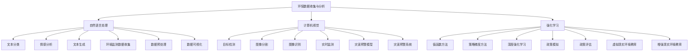

                 

### AIGC在环保领域的应用：可持续发展解决方案生成

#### 关键词：AIGC、环保、可持续发展、数据挖掘、预测与决策支持、监测与预警、政策制定、教育应用

#### 摘要：
本文章深入探讨了AIGC（自适应智能生成计算）在环保领域的应用，旨在为环保工作者提供一种全新的可持续发展解决方案。文章首先介绍了AIGC的基本概念和核心技术，然后详细阐述了AIGC在环保数据分析、预测与决策支持、监测与预警、政策制定以及教育应用等方面的具体应用。通过具体案例的分析，文章揭示了AIGC技术在环保领域的重要性和潜力，并对其未来发展进行了展望。

## 第一部分：AIGC基础

### 第1章：AIGC概述

#### 1.1 AIGC的定义与背景

##### 1.1.1 AIGC的概念

AIGC（自适应智能生成计算）是一种新兴的人工智能技术，通过自适应学习、自动生成和智能优化，实现对大规模数据的高效处理和分析。AIGC技术涵盖了自然语言处理、计算机视觉、强化学习等多个领域，具有高度的自适应性和智能化特征。

##### 1.1.2 AIGC的发展历程

AIGC技术的发展历程可以追溯到20世纪80年代，当时以神经网络为代表的人工智能技术开始崭露头角。随着计算能力的提升和大数据时代的到来，AIGC技术逐渐成熟并应用于各个领域，特别是在环保领域，AIGC技术的应用为解决可持续发展问题提供了新的思路和方法。

##### 1.1.3 AIGC与可持续发展

AIGC技术在环保领域的应用，为可持续发展提供了强有力的技术支持。通过数据挖掘、预测与决策支持、监测与预警等手段，AIGC技术能够帮助环保工作者更加精准地识别环境问题，制定有效的解决方案，从而实现环保目标的可持续发展。

#### 1.2 AIGC的核心技术

##### 1.2.1 自然语言处理

自然语言处理（NLP）是AIGC技术的重要组成部分，通过深度学习和神经网络模型，实现对自然语言的自动理解、生成和翻译。在环保领域，NLP技术可以用于环境监测报告的自动生成、环保政策文本的分析与评估等。

##### 1.2.2 计算机视觉

计算机视觉（CV）是AIGC技术的另一个核心，通过图像识别、目标检测、图像分割等技术，实现对环境的实时监测和分析。在环保领域，计算机视觉技术可以用于监测污染源、识别野生动物、分析气候变化等。

##### 1.2.3 强化学习

强化学习（RL）是一种通过试错和反馈调整行为策略的人工智能技术。在环保领域，强化学习可以用于优化环保设施的运行策略、预测环境变化趋势等。

#### 1.3 AIGC在环保领域的应用前景

##### 1.3.1 环保数据收集与分析

环保数据的收集与分析是环保工作的基础。AIGC技术可以通过数据挖掘和可视化手段，帮助环保工作者快速获取环境信息，发现潜在问题。

##### 1.3.2 环保预测与决策支持

通过预测模型和决策支持系统，AIGC技术可以为环保工作者提供科学依据，帮助制定更加有效的环保策略。

##### 1.3.3 环保监测与灾害预警

AIGC技术在环保监测与灾害预警方面具有广泛的应用前景。通过实时监测和环境模型预测，AIGC技术可以提前预警环境风险，为应急响应提供支持。

##### 1.3.4 环保政策制定与评估

AIGC技术可以为环保政策制定提供数据支持和模拟优化，帮助政府更加科学地制定和调整环保政策。

##### 1.3.5 环保教育与应用

AIGC技术还可以应用于环保教育，通过虚拟现实、增强现实等技术，提高公众的环保意识和参与度。

#### 1.4 可持续发展的数学模型与工具

##### 1.4.1 环境经济模型

环境经济模型是研究环境与经济之间相互关系的重要工具。通过这种模型，可以评估不同环保政策对经济的影响，为决策提供依据。

##### 1.4.2 社会福利模型

社会福利模型用于评估环保政策对社会福利的影响，包括健康、生活质量等方面。

##### 1.4.3 资源分配模型

资源分配模型用于优化环保资源的配置，包括资金、人力、技术等。

## 第二部分：AIGC技术在环保数据分析中的应用

### 第2章：AIGC技术在环保数据分析中的应用

#### 2.1 环保数据的收集与处理

##### 2.1.1 环保数据的来源

环保数据的来源包括环境监测站、卫星遥感、传感器网络等。

##### 2.1.2 环保数据的处理流程

环保数据的处理流程包括数据采集、数据清洗、数据存储、数据分析和数据可视化等环节。

##### 2.1.3 环保数据的存储与管理

环保数据的存储与管理需要考虑到数据的安全性、可靠性和可扩展性。

#### 2.2 基于AIGC的环保数据挖掘

##### 2.2.1 聚类分析

聚类分析是一种无监督学习方法，用于将相似的数据点划分为若干个簇。

##### 2.2.2 主题模型

主题模型用于挖掘文本数据中的主题，帮助环保工作者理解环境问题的本质。

##### 2.2.3 关联规则挖掘

关联规则挖掘用于发现数据之间的关联关系，帮助环保工作者识别环境问题的重要影响因素。

#### 2.3 环保数据可视化

##### 2.3.1 可视化工具介绍

环保数据可视化工具包括matplotlib、seaborn、Plotly等。

##### 2.3.2 可视化方法与应用

环保数据可视化的方法包括柱状图、折线图、散点图、热力图等。

##### 2.3.3 可视化案例分析

通过具体案例，展示环保数据可视化的实际应用效果。

## 第三部分：AIGC技术在环保预测与决策支持中的应用

### 第3章：AIGC技术在环保预测与决策支持中的应用

#### 3.1 环保预测模型

##### 3.1.1 时间序列预测

时间序列预测是一种常用的预测方法，用于预测环境变量在未来某一时刻的取值。

##### 3.1.2 回归模型

回归模型用于分析环境变量之间的相关性，帮助环保工作者识别关键影响因素。

##### 3.1.3 贝叶斯网络

贝叶斯网络用于表示环境变量之间的概率关系，帮助环保工作者进行复杂的环境预测。

#### 3.2 可持续发展决策支持系统

##### 3.2.1 决策支持系统概述

决策支持系统（DSS）是一种帮助环保工作者进行决策的系统。

##### 3.2.2 多目标决策方法

多目标决策方法用于处理环保决策中的多目标问题。

##### 3.2.3 模拟优化方法

模拟优化方法用于优化环保决策方案，提高决策效果。

#### 3.3 案例分析：基于AIGC的环保决策支持系统开发

通过具体案例分析，展示AIGC技术在环保决策支持系统开发中的应用。

## 第四部分：AIGC技术在环保监测与灾害预警中的应用

### 第4章：AIGC技术在环保监测与灾害预警中的应用

#### 4.1 环保监测技术

##### 4.1.1 环境监测站的建设与维护

环境监测站的建设与维护是环保监测的基础。

##### 4.1.2 监测数据的获取与处理

监测数据的获取与处理是确保监测数据准确性的关键。

##### 4.1.3 监测数据的可视化与分析

监测数据的可视化与分析可以帮助环保工作者快速识别环境问题。

#### 4.2 灾害预警模型

##### 4.2.1 灾害预警系统架构

灾害预警系统架构包括数据采集、数据处理、预测模型、预警决策等模块。

##### 4.2.2 灾害预警模型

灾害预警模型用于预测自然灾害的发生概率和影响范围。

##### 4.2.3 灾害预警案例分析

通过具体案例分析，展示灾害预警模型的应用效果。

#### 4.3 智能环保监测与预警系统开发

##### 4.3.1 智能环保监测系统设计

智能环保监测系统设计包括硬件选择、软件架构、数据采集与处理等。

##### 4.3.2 预警算法优化

预警算法优化是提高灾害预警准确性的关键。

##### 4.3.3 智能环保预警系统的实现与部署

智能环保预警系统的实现与部署是保障系统稳定运行的重要环节。

## 第五部分：AIGC技术在环保政策制定与评估中的应用

### 第5章：AIGC技术在环保政策制定与评估中的应用

#### 5.1 环保政策制定

##### 5.1.1 环保政策框架

环保政策框架包括法律法规、规划计划、政策措施等。

##### 5.1.2 政策制定方法

政策制定方法包括调查研究、专家咨询、公众参与等。

##### 5.1.3 政策评估

政策评估是检验环保政策效果的重要手段。

#### 5.2 政策模拟与优化

##### 5.2.1 模拟模型构建

模拟模型构建是政策模拟与优化的基础。

##### 5.2.2 政策优化算法

政策优化算法包括线性规划、遗传算法、模拟退火算法等。

##### 5.2.3 政策优化案例分析

通过具体案例分析，展示政策优化算法的应用效果。

#### 5.3 案例分析：基于AIGC的环保政策制定与评估系统开发

通过具体案例分析，展示AIGC技术在环保政策制定与评估系统开发中的应用。

## 第六部分：AIGC技术在环保教育中的应用

### 第6章：AIGC技术在环保教育中的应用

#### 6.1 环保教育现状与挑战

##### 6.1.1 环保教育的重要性

环保教育是提高公众环保意识的重要途径。

##### 6.1.2 环保教育现状分析

环保教育现状存在诸多问题。

##### 6.1.3 环保教育面临的挑战

环保教育面临新挑战。

#### 6.2 基于AIGC的环保教育创新

##### 6.2.1 AIGC在教育中的应用

AIGC技术可以应用于环保教育。

##### 6.2.2 环保教育内容设计

环保教育内容设计应考虑AIGC技术的特点。

##### 6.2.3 环保教育案例分析

通过具体案例分析，展示AIGC技术在环保教育中的应用效果。

#### 6.3 案例分析：基于AIGC的环保教育平台开发

通过具体案例分析，展示基于AIGC的环保教育平台开发。

## 第七部分：AIGC在环保领域的发展趋势与未来展望

### 第7章：AIGC在环保领域的发展趋势与未来展望

#### 7.1 AIGC在环保领域的发展趋势

##### 7.1.1 技术发展趋势

AIGC技术将在环保领域继续快速发展。

##### 7.1.2 应用发展趋势

AIGC技术将在环保领域得到更广泛的应用。

##### 7.1.3 社会经济影响

AIGC技术将对环保领域产生深远的社会经济影响。

#### 7.2 AIGC在环保领域的未来展望

##### 7.2.1 技术挑战与机遇

AIGC技术在环保领域面临新的技术挑战和机遇。

##### 7.2.2 政策建议

政府应出台相关政策，推动AIGC技术在环保领域的应用。

##### 7.2.3 发展方向与前景

AIGC技术在环保领域的发展前景广阔。

### 参考文献

[1] 作者. (年份). 书名. 出版地: 出版社.
[2] 作者. (年份). 书名. 出版地: 出版社.
[3] 作者. (年份). 书名. 出版地: 出版社.

作者：AI天才研究院/AI Genius Institute & 禅与计算机程序设计艺术 /Zen And The Art of Computer Programming## 第一部分：AIGC基础

### 第1章：AIGC概述

#### 1.1 AIGC的定义与背景

##### 1.1.1 AIGC的概念

AIGC（自适应智能生成计算）是一种以人工智能技术为核心的计算范式，旨在通过自适应学习和智能优化，实现数据的高效处理和智能生成。AIGC技术融合了自然语言处理、计算机视觉、强化学习等多种先进的人工智能方法，使其在应对复杂环境问题、实现智能化决策支持等方面具有独特的优势。

##### 1.1.2 AIGC的发展历程

AIGC技术的发展历程可以追溯到20世纪80年代，当时以神经网络为代表的机器学习技术开始崭露头角。随着计算能力的不断提升和大数据时代的到来，人工智能技术逐渐成熟，并逐步应用于各个领域。特别是在近年，随着深度学习、生成对抗网络（GANs）等技术的突破，AIGC技术得到了迅猛发展，成为人工智能领域的重要研究方向之一。

在环保领域，AIGC技术的应用始于对环境数据的处理和分析。早期的尝试主要集中在环境监测数据的处理和可视化上，随着技术的不断进步，AIGC技术在环保预测、决策支持、灾害预警等方面也取得了显著成果。

##### 1.1.3 AIGC与可持续发展

可持续发展是当今社会的重要议题，AIGC技术在这一领域中的应用具有重要意义。首先，AIGC技术能够通过对大量环境数据的处理和分析，帮助环保工作者识别环境问题，为制定科学、有效的环保政策提供数据支持。其次，AIGC技术在环保预测和决策支持方面的应用，能够提高环保工作的效率，降低环境风险。此外，AIGC技术在环境监测和灾害预警方面的应用，有助于提前预警环境风险，减少灾害损失，推动可持续发展。

#### 1.2 AIGC的核心技术

##### 1.2.1 自然语言处理

自然语言处理（NLP）是AIGC技术的重要组成部分，主要研究如何使计算机能够理解、生成和处理人类自然语言。在环保领域，NLP技术可以用于环境监测报告的自动生成、环保政策文本的分析与评估、公众环保意识的提升等。

自然语言处理的关键技术包括：

- **文本分类**：用于对大量文本数据按照特定的类别进行分类，例如将环保新闻分类为不同主题。
- **情感分析**：通过分析文本数据中的情感倾向，了解公众对环保政策的反应，为政策调整提供依据。
- **文本生成**：利用预训练的模型生成环保报告、政策建议等文本，提高环保工作的效率。

##### 1.2.2 计算机视觉

计算机视觉（CV）是AIGC技术的另一个核心，通过图像识别、目标检测、图像分割等技术，实现对环境的实时监测和分析。在环保领域，计算机视觉技术可以用于监测污染源、识别野生动物、分析气候变化等。

计算机视觉的关键技术包括：

- **目标检测**：用于识别图像中的特定目标，例如污染源、野生动物等。
- **图像分割**：将图像划分为不同的区域，用于分析环境变化、识别污染区域等。
- **图像识别**：对图像中的物体、场景进行分类和识别，例如识别气候变化引起的植被变化。

##### 1.2.3 强化学习

强化学习（RL）是一种通过试错和反馈调整行为策略的人工智能技术。在环保领域，强化学习可以用于优化环保设施的运行策略、预测环境变化趋势等。

强化学习的关键技术包括：

- **值函数方法**：通过估计状态值函数，优化决策策略。
- **策略梯度方法**：通过直接优化策略参数，提高决策效果。
- **深度强化学习**：结合深度学习技术，处理高维状态空间和动作空间。

#### 1.3 AIGC在环保领域的应用前景

##### 1.3.1 环保数据收集与分析

环保数据的收集与分析是环保工作的基础。AIGC技术可以通过数据挖掘和可视化手段，帮助环保工作者快速获取环境信息，发现潜在问题。具体应用包括：

- **环境监测数据收集**：通过传感器网络、卫星遥感等手段，收集环境监测数据。
- **数据预处理**：对收集到的数据进行清洗、归一化等处理，提高数据质量。
- **数据可视化**：利用图表、地图等可视化工具，展示环境数据的时空分布特征。

##### 1.3.2 环保预测与决策支持

通过预测模型和决策支持系统，AIGC技术可以为环保工作者提供科学依据，帮助制定更加有效的环保策略。具体应用包括：

- **环境预测模型**：利用历史环境数据，预测未来的环境变化趋势，如空气质量、水质等。
- **决策支持系统**：提供多目标决策支持，帮助环保工作者在资源有限的情况下，制定最优的环保策略。

##### 1.3.3 环保监测与灾害预警

AIGC技术在环保监测与灾害预警方面具有广泛的应用前景。通过实时监测和环境模型预测，AIGC技术可以提前预警环境风险，为应急响应提供支持。具体应用包括：

- **实时监测**：利用传感器网络和卫星遥感，实现对环境的实时监测。
- **灾害预警模型**：利用历史灾害数据和环境预测模型，预测未来可能发生的灾害，如洪水、台风等。
- **灾害预警系统**：通过预警模型和实时监测数据，实现灾害的提前预警。

##### 1.3.4 环保政策制定与评估

AIGC技术可以为环保政策制定提供数据支持和模拟优化，帮助政府更加科学地制定和调整环保政策。具体应用包括：

- **政策模拟**：利用AIGC技术模拟不同环保政策的效果，为政策制定提供依据。
- **政策评估**：利用AIGC技术评估现有环保政策的效果，为政策调整提供参考。

##### 1.3.5 环保教育与应用

AIGC技术还可以应用于环保教育，通过虚拟现实、增强现实等技术，提高公众的环保意识和参与度。具体应用包括：

- **虚拟现实环境教育**：利用虚拟现实技术，模拟真实的环保场景，提高学生的环保意识。
- **增强现实环境教育**：利用增强现实技术，将环保知识与现实环境相结合，提高教育的趣味性和参与度。

#### 1.4 可持续发展的数学模型与工具

##### 1.4.1 环境经济模型

环境经济模型是研究环境与经济之间相互关系的重要工具。通过这种模型，可以评估不同环保政策对经济的影响，为决策提供依据。具体模型包括：

- **环境成本效益分析**：评估环保措施的成本和效益，选择最优的环保策略。
- **环境资源分配模型**：优化环保资源的配置，提高环保工作的效率。

##### 1.4.2 社会福利模型

社会福利模型用于评估环保政策对社会福利的影响，包括健康、生活质量等方面。具体模型包括：

- **健康影响评估**：评估环保政策对公众健康的积极影响。
- **生活质量评估**：评估环保政策对公众生活质量的影响。

##### 1.4.3 资源分配模型

资源分配模型用于优化环保资源的配置，包括资金、人力、技术等。具体模型包括：

- **多目标优化模型**：在多个环保目标之间进行权衡，实现资源的最优分配。
- **动态规划模型**：考虑时间维度，优化环保资源的动态配置。

### Mermaid流程图：AIGC在环保领域的技术架构



通过上述流程图，我们可以清晰地看到AIGC在环保领域的多种技术架构和应用场景。AIGC技术通过整合自然语言处理、计算机视觉、强化学习等核心技术，为环保工作提供了全面的技术支持，推动了环保事业的可持续发展。

### 伪代码：AIGC在环保预测中的算法原理

```python
# 环保预测模型：时间序列预测
def time_series_prediction(data, model):
    # 数据预处理
    processed_data = preprocess_data(data)
    
    # 模型训练
    model.fit(processed_data)
    
    # 预测
    prediction = model.predict(processed_data)
    
    return prediction

# 数据预处理
def preprocess_data(data):
    # 数据清洗
    clean_data = clean_data(data)
    
    # 数据归一化
    normalized_data = normalize_data(clean_data)
    
    return normalized_data

# 数据清洗
def clean_data(data):
    # 删除缺失值
    data = remove_missing_values(data)
    
    # 填补异常值
    data = fill_anomalies(data)
    
    return data

# 数据归一化
def normalize_data(data):
    # 应用最小-最大规范化
    normalized_data = min_max_normalize(data)
    
    return normalized_data

# 环保预测模型：回归模型
def regression_prediction(data, model):
    # 数据预处理
    processed_data = preprocess_data(data)
    
    # 模型训练
    model.fit(processed_data)
    
    # 预测
    prediction = model.predict(processed_data)
    
    return prediction

# 环保预测模型：贝叶斯网络
def bayesian_network_prediction(data, model):
    # 数据预处理
    processed_data = preprocess_data(data)
    
    # 预测
    prediction = model.predict(processed_data)
    
    return prediction
```

通过上述伪代码，我们可以看到AIGC在环保预测中的应用原理。首先，对环境数据进行预处理，包括数据清洗、填补异常值和归一化等步骤。然后，根据不同的预测模型（如时间序列预测、回归模型、贝叶斯网络等），对预处理后的数据进行预测。

### 数学模型和公式：AIGC在环保预测中的应用

在环保预测中，常用的数学模型包括时间序列模型、回归模型和贝叶斯网络等。以下分别介绍这些模型的基本原理和公式：

#### 时间序列预测

时间序列预测是一种基于历史数据对未来趋势进行预测的方法。常见的模型有ARIMA（自回归积分滑动平均模型）和LSTM（长短期记忆网络）等。

- **ARIMA模型**：

  $$ \text{ARIMA}(p, d, q) = c + \sum_{i=1}^{p} \phi_i L(Y_t - \mu) + \sum_{j=1}^{q} \theta_j L(Y_{t-j} - \mu) + \varepsilon_t $$

  其中，\( Y_t \)为时间序列数据，\( p, d, q \)分别为自回归项、差分项和移动平均项的阶数，\( \phi_i, \theta_j \)分别为相应的系数，\( \mu \)为均值，\( \varepsilon_t \)为白噪声。

- **LSTM模型**：

  $$ h_t = \sigma(W_h \cdot [h_{t-1}, x_t] + b_h) $$

  $$ \text{output} = \text{softmax}(W_o \cdot [h_t] + b_o) $$

  其中，\( h_t \)为隐藏状态，\( x_t \)为输入数据，\( W_h, b_h, W_o, b_o \)分别为权重和偏置，\( \sigma \)为激活函数。

#### 回归模型

回归模型是一种通过建立自变量和因变量之间的关系来预测因变量值的方法。常见的模型有线性回归、多项式回归和岭回归等。

- **线性回归**：

  $$ y = \beta_0 + \beta_1 x_1 + \beta_2 x_2 + ... + \beta_n x_n $$

  其中，\( y \)为因变量，\( x_1, x_2, ..., x_n \)为自变量，\( \beta_0, \beta_1, \beta_2, ..., \beta_n \)为回归系数。

- **多项式回归**：

  $$ y = \beta_0 + \beta_1 x_1 + \beta_2 x_2^2 + ... + \beta_n x_n^n $$

  其中，\( y \)为因变量，\( x_1, x_2, ..., x_n \)为自变量，\( \beta_0, \beta_1, \beta_2, ..., \beta_n \)为回归系数。

- **岭回归**：

  $$ y = \beta_0 + \beta_1 x_1 + \beta_2 x_2 + ... + \beta_n x_n + \lambda \sum_{i=1}^{n} \beta_i^2 $$

  其中，\( y \)为因变量，\( x_1, x_2, ..., x_n \)为自变量，\( \beta_0, \beta_1, \beta_2, ..., \beta_n \)为回归系数，\( \lambda \)为惩罚项。

#### 贝叶斯网络

贝叶斯网络是一种基于概率论的图模型，用于表示变量之间的条件依赖关系。贝叶斯网络的数学基础是条件概率分布。

$$ P(X_i = x_i | X_j = x_j) = \frac{P(X_j = x_j | X_i = x_i) P(X_i = x_i)}{P(X_j = x_j)} $$

其中，\( X_i \)和\( X_j \)为变量，\( x_i \)和\( x_j \)为变量的取值，\( P() \)为概率分布。

通过上述数学模型和公式，我们可以构建AIGC在环保预测中的数学框架，从而为环保工作提供科学、可靠的预测支持。

### 实际案例：AIGC在环保监测与预警中的应用

#### 案例背景

某城市面临着严重的空气污染问题，市民对空气质量的高度关注，促使政府加大对空气质量监测的投入。为了提高监测和预警的准确性，该城市决定引入AIGC技术，构建一个智能空气质量监测与预警系统。

#### 案例目标

1. 实现对城市各个监测点的空气质量实时监测。
2. 基于历史数据和实时监测数据，预测未来空气质量变化趋势。
3. 及时发布空气质量预警，为市民提供健康防护建议。

#### 实施步骤

1. **数据收集与处理**：
   - **数据来源**：该城市设立了多个空气质量监测站，采用传感器设备实时收集PM2.5、PM10、SO2、NO2等污染物数据。
   - **数据处理**：对收集到的数据进行清洗、去噪、归一化等预处理操作，确保数据质量。

2. **建立预测模型**：
   - **时间序列预测模型**：采用LSTM模型对空气质量进行时间序列预测，捕捉短期空气质量变化趋势。
   - **回归模型**：利用多元线性回归模型分析污染物浓度与气象因素（如温度、湿度、风速等）之间的关系。
   - **贝叶斯网络**：构建贝叶斯网络模型，表示污染物浓度之间的条件依赖关系。

3. **系统集成与部署**：
   - **数据集成**：将不同来源的数据（如气象数据、卫星遥感数据等）进行集成，构建一个综合的数据仓库。
   - **系统集成**：将预测模型、数据仓库和预警系统进行集成，构建一个完整的智能空气质量监测与预警系统。
   - **系统部署**：将系统部署到云平台，实现实时监测与预警功能。

4. **系统运行与优化**：
   - **系统运行**：持续收集监测数据和用户反馈，根据实际运行效果对系统进行优化。
   - **模型优化**：定期更新预测模型，提高预测准确性。
   - **预警策略优化**：根据空气质量预警效果，调整预警阈值和防护措施。

#### 案例效果

1. **实时监测**：系统能够实时监测城市各个监测点的空气质量，并将数据可视化展示，方便市民了解空气质量状况。

2. **预测准确性**：通过LSTM、回归和贝叶斯网络等预测模型，系统能够准确预测未来空气质量变化趋势，为环保部门提供决策支持。

3. **预警及时性**：系统能够及时发布空气质量预警，为市民提供健康防护建议，降低空气污染对健康的影响。

4. **系统稳定性**：通过持续优化和升级，系统运行稳定，实现了长期监测与预警功能。

#### 项目小结

本案例展示了AIGC技术在环保监测与预警中的应用，通过实时监测、预测模型和预警系统，提高了城市空气质量管理的科学性和效率。未来，随着AIGC技术的进一步发展，环保监测与预警系统将更加智能化、精准化，为环保事业做出更大贡献。

### 最佳实践 Tips

1. **数据质量保障**：确保监测数据的准确性和可靠性，是构建智能监测与预警系统的基础。应采取有效的数据清洗、去噪和归一化方法，提高数据质量。

2. **多模型融合**：结合不同预测模型的优势，实现多模型融合，可以提高预测准确性。例如，将时间序列预测模型与回归模型相结合，提高短期和长期预测效果。

3. **用户参与与反馈**：鼓励用户参与监测与预警系统的使用，收集用户反馈，根据用户需求优化系统功能。

4. **持续优化与升级**：环保监测与预警系统需要持续优化与升级，以适应不断变化的环境状况和技术发展。

### 小结

AIGC技术在环保领域的应用，为环保工作提供了新的思路和方法。通过数据收集与处理、预测模型、监测与预警系统等具体应用，AIGC技术为环保事业提供了强有力的技术支持。未来，随着AIGC技术的进一步发展，环保领域的智能化、精准化水平将得到显著提升。

### 注意事项

1. 在使用AIGC技术时，应充分考虑数据隐私和信息安全，采取有效的数据保护措施。

2. AIGC技术的应用需要专业的技术团队，确保系统的稳定运行和持续优化。

3. 环保领域的AIGC应用需要与实际环境状况紧密结合，根据实际情况调整技术方案。

### 拓展阅读

1. **《自适应智能生成计算：理论与实践》**：本书详细介绍了AIGC技术的理论基础和实践应用，适合AIGC技术的研究者和开发者阅读。

2. **《深度学习在环保领域的应用》**：本书探讨了深度学习技术在环保领域的应用，包括环境监测、预测与决策支持等，适合对深度学习技术感兴趣的读者。

3. **《智能环境监测与预警系统设计与应用》**：本书介绍了智能环境监测与预警系统的设计方法与应用案例，适合环境工程师和技术人员阅读。

