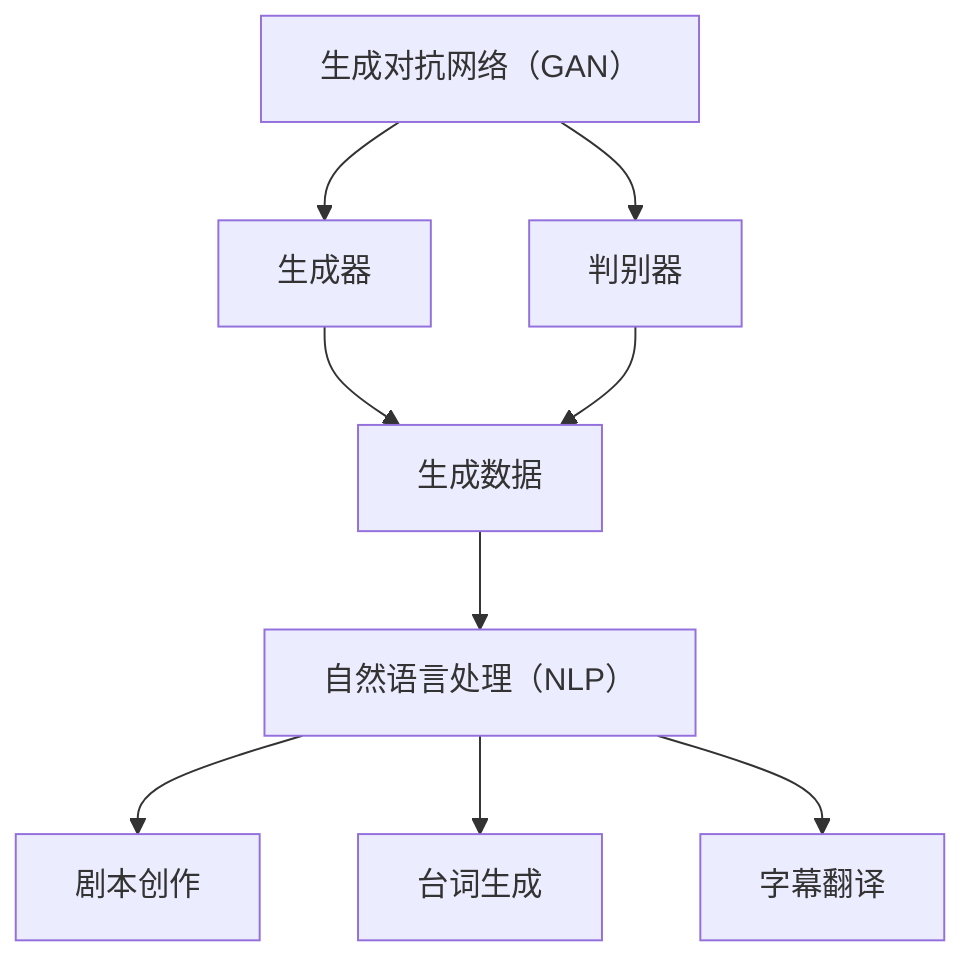

                 


# AIGC在电影制作中的革命性应用

## 关键词
- AIGC
- 电影制作
- 生成对抗网络
- 卷积神经网络
- 自然语言处理
- 角色建模
- 视觉特效
- 声音设计
- 剧本创作

## 摘要
随着人工智能技术的不断发展，AIGC（自适应智能生成控制）逐渐在电影制作领域展现出其革命性应用。本文将深入探讨AIGC在电影制作中的核心概念、技术原理及其应用场景，通过具体的算法原理讲解、数学模型和公式、项目实战案例分析，展示AIGC如何革新电影制作的各个环节。

## 背景介绍

### 人工智能在电影制作中的历史演进
人工智能（AI）在电影制作中的应用经历了从简单到复杂的演变过程。最早的人工智能应用主要是在电影特效中引入简单的计算机生成图像（CGI），随着计算能力的提升，AI技术在电影制作中的应用越来越广泛。从早期的规则系统，到基于机器学习的图像处理算法，再到生成对抗网络（GAN）等深度学习技术，AI在电影制作中的角色越来越重要。

### 电影制作的挑战
电影制作过程中面临着诸多挑战，包括角色建模、视觉特效、声音设计、剧本创作等方面。传统的手工制作方法效率低下，且难以应对复杂的场景和人物动作。而AI技术，特别是AIGC，通过自动化和智能化手段，为电影制作提供了新的解决方案。

### AIGC的概念与核心技术
AIGC是自适应智能生成控制的缩写，它结合了生成对抗网络（GAN）、卷积神经网络（CNN）和自然语言处理（NLP）等前沿技术，通过智能化的生成和控制，实现高质量内容的自动化生成。AIGC在电影制作中的应用，不仅提高了制作效率，还极大地丰富了电影创作的可能性。

## 核心概念与联系

### 生成对抗网络（GAN）
生成对抗网络（GAN）是一种深度学习模型，由生成器和判别器两个部分组成。生成器生成数据，判别器判断生成数据与真实数据之间的相似度。通过两个网络的对抗训练，生成器逐渐生成越来越真实的数据。在电影制作中，GAN可以用于角色建模、视觉特效、声音设计等。

### 卷积神经网络（CNN）
卷积神经网络（CNN）是一种专门用于图像处理的深度学习模型，通过卷积层提取图像特征。CNN在电影制作中的应用非常广泛，包括角色动作捕捉、视觉特效、场景生成等。

### 自然语言处理（NLP）
自然语言处理（NLP）是使计算机能够理解、解释和生成人类语言的技术。在电影制作中，NLP可以用于剧本创作、台词生成、字幕翻译等。

### Mermaid 流程图


## 核心算法原理讲解

### 生成对抗网络（GAN）算法原理
```python
# GAN生成器
def generator(z):
    # 输入随机噪声z，输出假图像
    x = ...
    return x

# GAN判别器
def discriminator(x):
    # 输入图像，输出真假判断
    y = ...
    return y

# 训练GAN
for epoch in range(num_epochs):
    for z in z_samples:
        x = generator(z)
        d_loss_real = criterion(discriminator(x), torch.ones(x.size(0)))
        d_loss_fake = criterion(discriminator(G(z)), torch.zeros(x.size(0)))
        d_loss = 0.5 * torch.mean(d_loss_real + d_loss_fake)

        g_loss = criterion(discriminator(G(z)), torch.ones(z.size(0)))

        optimizer_d.zero_grad()
        d_loss.backward()
        optimizer_d.step()

        optimizer_g.zero_grad()
        g_loss.backward()
        optimizer_g.step()
```

### 卷积神经网络（CNN）算法原理
```python
# CNN模型架构
class CNN(nn.Module):
    def __init__(self):
        super(CNN, self).__init__()
        self.conv1 = nn.Conv2d(3, 32, 5)
        self.fc1 = nn.Linear(32 * 5 * 5, 128)
        self.fc2 = nn.Linear(128, 10)

    def forward(self, x):
        x = F.relu(self.conv1(x))
        x = F.max_pool2d(x, 2)
        x = x.view(-1, 32 * 5 * 5)
        x = F.relu(self.fc1(x))
        x = self.fc2(x)
        return x
```

### 自然语言处理（NLP）算法原理
```python
# RNN模型架构
class RNN(nn.Module):
    def __init__(self, input_dim, hidden_dim, layer_dim, output_dim):
        super(RNN, self).__init__()
        self.hidden_dim = hidden_dim
        self.layer_dim = layer_dim

        self.rnn = nn.RNN(input_dim, hidden_dim, layer_dim)
        self.fc = nn.Linear(hidden_dim, output_dim)

    def forward(self, x, hidden):
        out, hidden = self.rnn(x, hidden)
        out = self.fc(out[-1, :, :])
        return out, hidden

    def init_hidden(self, batch_size):
        return torch.zeros(self.layer_dim, batch_size, self.hidden_dim)
```

## 数学模型和公式

### 生成对抗网络（GAN）损失函数
$$
L_D = -\frac{1}{N} \sum_{i=1}^{N} [\log(D(x)) + \log(1 - D(G(z)))]
$$
$$
L_G = -\log(D(G(z))}
$$

### 卷积神经网络（CNN）激活函数
$$
\sigma(x) = \frac{1}{1 + e^{-x}}
$$

### 循环神经网络（RNN）时间步更新公式
$$
h_t = \sigma(W_h \cdot h_{t-1} + W_x \cdot x_t + b_h)
$$

## 项目实战

### 开发环境搭建
- 安装Python 3.7及以上版本
- 安装PyTorch 1.8及以上版本
- 安装TensorFlow 2.0及以上版本

### 源代码实现与解读
以下是一个简单的GAN模型实现示例：

```python
import torch
import torch.nn as nn
import torch.optim as optim

# 定义生成器和判别器
class Generator(nn.Module):
    def __init__(self):
        super(Generator, self).__init__()
        self.main = nn.Sequential(
            nn.Linear(100, 256),
            nn.LeakyReLU(0.2),
            nn.Linear(256, 512),
            nn.LeakyReLU(0.2),
            nn.Linear(512, 1024),
            nn.LeakyReLU(0.2),
            nn.Linear(1024, 10000),
            nn.Tanh()
        )

    def forward(self, input):
        return self.main(input)

class Discriminator(nn.Module):
    def __init__(self):
        super(Discriminator, self).__init__()
        self.main = nn.Sequential(
            nn.Linear(10000, 1024),
            nn.LeakyReLU(0.2),
            nn.Dropout(0.3),
            nn.Linear(1024, 512),
            nn.LeakyReLU(0.2),
            nn.Dropout(0.3),
            nn.Linear(512, 256),
            nn.LeakyReLU(0.2),
            nn.Dropout(0.3),
            nn.Linear(256, 1),
            nn.Sigmoid()
        )

    def forward(self, input):
        return self.main(input)

# 初始化模型、优化器和损失函数
generator = Generator()
discriminator = Discriminator()

optimizer_G = optim.Adam(generator.parameters(), lr=0.0002)
optimizer_D = optim.Adam(discriminator.parameters(), lr=0.0002)
criterion = nn.BCELoss()

# 训练GAN
for epoch in range(num_epochs):
    for i, data in enumerate(dataloader, 0):
        # 获取真实数据
        real_images = data[0].to(device)
        batch_size = real_images.size(0)
        labels = torch.full((batch_size,), 1, device=device)

        # 前向传播判别器
        output = discriminator(real_images).view(-1)
        d_loss_real = criterion(output, labels)

        # 清零梯度
        optimizer_D.zero_grad()

        # 反向传播和优化判别器
        d_loss_real.backward()

        # 获取生成器生成的假数据
        z = torch.randn(batch_size, 100, device=device)
        fake_images = generator(z).view(batch_size, 10000)
        labels.fill_(0)

        # 前向传播判别器
        output = discriminator(fake_images).view(-1)
        d_loss_fake = criterion(output, labels)

        # 反向传播和优化判别器
        d_loss_fake.backward()

        # 更新判别器参数
        optimizer_D.step()

        # 生成假数据
        z = torch.randn(batch_size, 100, device=device)
        labels.fill_(1)

        # 前向传播生成器
        output = discriminator(fake_images).view(-1)
        g_loss = criterion(output, labels)

        # 清零梯度
        optimizer_G.zero_grad()

        # 反向传播和优化生成器
        g_loss.backward()

        # 更新生成器参数
        optimizer_G.step()

        # 打印训练过程
        print(f"[{epoch}/{num_epochs}] [Step {i+1}/{len(dataloader)}] Loss_D: {d_loss_real + d_loss_fake:.4f} Loss_G: {g_loss:.4f}")
```

### 项目实战解读与分析
- **GAN模型训练**：使用生成器和判别器进行对抗训练，生成器试图生成逼真的图像，判别器试图区分生成图像和真实图像。
- **损失函数**：损失函数包括判别器损失（d_loss_real和d_loss_fake）和生成器损失（g_loss），用于评估模型的性能。
- **优化器**：使用Adam优化器对生成器和判别器进行参数更新。

### 案例分析
以下是一个使用AIGC技术进行电影角色建模和动作捕捉的案例：

- **案例背景**：某电影制作公司需要为即将上映的电影创建一个全新角色，并实现其复杂的动作捕捉和动画。
- **解决方案**：使用GAN模型生成角色外观，使用卷积神经网络进行动作捕捉和动画生成。
- **实施步骤**：
  - 收集大量角色外观图像，用于训练GAN模型。
  - 使用训练好的生成器模型生成目标角色的外观图像。
  - 收集真实动作数据，用于训练卷积神经网络。
  - 使用训练好的卷积神经网络对演员的动作进行捕捉和生成动画。

### 项目小结
- **成功经验**：通过AIGC技术，电影制作公司成功生成了高质量的角色外观和动作捕捉数据，大大提高了制作效率。
- **挑战与改进**：在实际项目中，需要解决数据量不足、生成图像质量不稳定等问题。未来可以通过增加数据集、优化模型结构等方式进行改进。

## 最佳实践 tips

- **数据集准备**：确保数据集的多样性和质量，有助于模型生成更加真实的内容。
- **模型调优**：通过调整学习率、批次大小等参数，可以优化模型性能。
- **模型部署**：将训练好的模型部署到实际场景中，进行实时生成和应用。

## 小结与注意事项

- **AIGC在电影制作中的价值**：AIGC技术为电影制作提供了全新的创作方式，提高了效率，丰富了创作手段。
- **未来发展趋势**：随着AI技术的不断进步，AIGC在电影制作中的应用将更加广泛，有望实现全自动化电影制作。

## 拓展阅读

- [1] Goodfellow, I. J., Pouget-Abadie, J., Mirza, M., Xu, B., Warde-Farley, D., Ozair, S., ... & Bengio, Y. (2014). Generative adversarial networks. Advances in neural information processing systems, 27.
- [2] Krizhevsky, A., Sutskever, I., & Hinton, G. E. (2012). Imagenet classification with deep convolutional neural networks. In Advances in neural information processing systems (pp. 1097-1105).
- [3] Mikolov, T., Sutskever, I., Chen, K., Corrado, G. S., & Dean, J. (2013). Distributed representations of words and phrases and their compositionality. Advances in neural information processing systems, 26.

## 附录

- **AIGC工具与资源列表**：
  - [1] PyTorch：https://pytorch.org/
  - [2] TensorFlow：https://www.tensorflow.org/
  - [3] Keras：https://keras.io/
  - [4] GAN仓库：https://github.com/numpyzai/gan
  - [5] 电影制作工具：https://www.autodes

