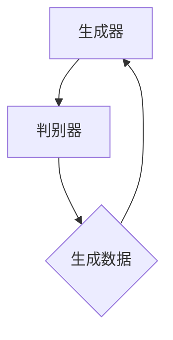
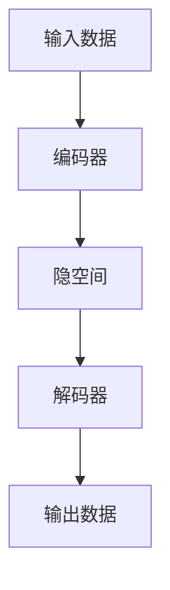
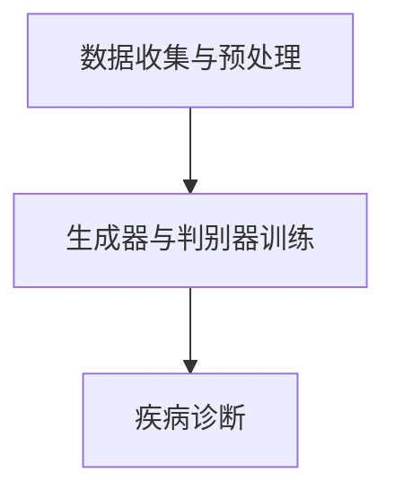
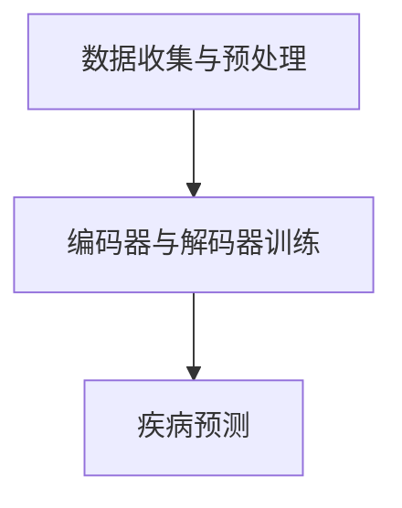
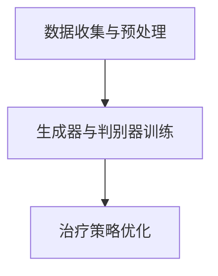
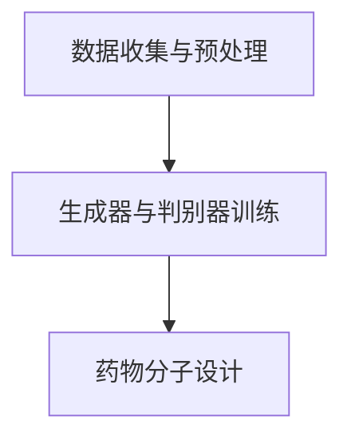
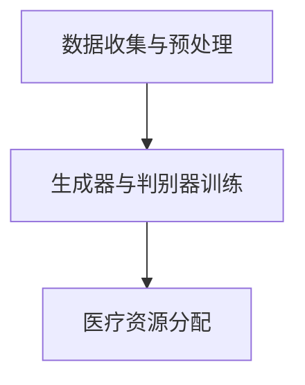

                 


## 文章标题
### AIGC在精准医疗个性化治疗中的突破性进展

## 关键词
- AIGC
- 精准医疗
- 个性化治疗
- 突破性进展

## 摘要
随着人工智能技术的快速发展，AIGC（人工智能生成内容）在精准医疗个性化治疗中的应用逐渐成为研究热点。本文将详细介绍AIGC技术的基础概念、发展历程及其核心算法原理，并分析AIGC在精准医疗个性化治疗中的应用现状与未来趋势。通过典型案例分析，阐述AIGC在疾病诊断、治疗策略优化、药物研发及医疗资源优化配置等方面的突破性进展，探讨其面临的挑战及解决方案。

## 第一部分：AIGC技术基础

### 第1章：AIGC概念介绍

#### 1.1 AIGC的定义

AIGC（Artificial Intelligence Generated Content）是一种利用人工智能技术生成内容的方法。与传统的AI技术相比，AIGC更加注重在生成内容方面的创新与应用，其核心思想是通过机器学习、深度学习等技术，模拟人类创作过程，生成具有高度个性化的文本、图像、视频等多种类型的内容。

#### 1.2 AIGC与AI的关系

AIGC是人工智能（AI）的一个重要分支，它依赖于AI的核心技术，如机器学习、深度学习等。同时，AIGC在生成内容方面具有独特的优势，为AI技术的应用拓展提供了新的可能性。可以说，AIGC是AI技术在内容创作领域的一种深化与扩展。

#### 1.3 AIGC的发展历程

AIGC技术的发展可以追溯到20世纪80年代，当时神经网络等人工智能技术的初步探索。随着计算能力的提升和大数据技术的发展，AIGC技术逐渐成熟，并在近年来取得了显著的突破。生成对抗网络（GAN）、变分自编码器（VAE）等核心算法的提出与应用，使得AIGC在图像生成、文本生成等方面取得了重要成果。

### 第2章：AIGC技术发展史

#### 2.1 AIGC技术的演进

AIGC技术的发展经历了多个阶段，从早期的简单规则生成，到基于机器学习的方法，再到深度学习驱动的复杂生成模型，技术不断演进。特别是生成对抗网络（GAN）和变分自编码器（VAE）的提出，为AIGC技术的发展奠定了基础。

#### 2.2 主要研究机构与成果

AIGC技术的发展离不开全球各地的研究机构和科学家们的贡献。以谷歌、微软、IBM等为代表的科技公司，以及麻省理工学院、斯坦福大学等知名研究机构，都在AIGC技术领域取得了重要成果。

#### 2.3 技术发展趋势

随着技术的不断进步，AIGC技术在生成内容的质量、多样性、可控性等方面持续提升。未来，AIGC技术有望在更广泛的应用场景中发挥重要作用，如个性化教育、娱乐、医疗等领域。

### 第3章：AIGC核心算法原理

#### 3.1 生成对抗网络（GAN）

生成对抗网络（GAN）是一种基于博弈理论的生成模型，由生成器和判别器两个部分组成。生成器生成数据，判别器判断生成数据与真实数据的差异。通过不断调整生成器的参数，使生成器生成更加逼真的数据。

#### 3.2 变分自编码器（VAE）

变分自编码器（VAE）是一种基于概率论的生成模型，通过编码器和解码器的交互，将输入数据映射到一个隐空间中，然后从隐空间中生成新的数据。VAE在生成多样性方面具有优势。

#### 3.3 强化学习（RL）

强化学习（RL）是一种通过试错和反馈优化的学习方法，适用于解决序列决策问题。在AIGC技术中，强化学习可以用于生成内容的优化和自适应调整。

#### 3.4 注意力机制（Attention Mechanism）

注意力机制（Attention Mechanism）是一种用于提高模型生成质量的方法，通过为输入数据分配不同的权重，使模型更加关注重要的信息。注意力机制在文本生成、图像生成等领域具有广泛的应用。

### 第4章：AIGC技术应用领域

#### 4.1 图像处理

AIGC技术在图像处理领域取得了显著成果，如图像生成、图像修复、图像风格转换等。通过生成对抗网络（GAN）等算法，可以生成高质量、逼真的图像。

#### 4.2 自然语言处理

AIGC技术在自然语言处理领域也有广泛应用，如文本生成、文本摘要、机器翻译等。通过变分自编码器（VAE）等算法，可以实现自然流畅的文本生成。

#### 4.3 推荐系统

AIGC技术在推荐系统领域可用于生成个性化推荐内容，如文章、视频、商品等。通过深度学习等技术，可以实现对用户兴趣的精准捕捉和推荐。

#### 4.4 其他应用领域

AIGC技术在游戏开发、虚拟现实、艺术创作等领域也有广泛应用。通过生成高质量的内容，可以提升用户体验和创作效果。

## 第二部分：精准医疗与个性化治疗

### 第5章：精准医疗概述

#### 5.1 精准医疗的定义

精准医疗是一种基于个体基因组信息、表型与生活方式的新型医疗模式，旨在实现疾病预防、诊断、治疗和预后评估的个性化。

#### 5.2 精准医疗的重要性

精准医疗能够提高疾病诊断的准确性和治疗效果，降低医疗成本，提升患者生活质量。随着基因组学、生物信息学等技术的快速发展，精准医疗已成为医疗领域的重要方向。

#### 5.3 精准医疗的发展历程

精准医疗的概念起源于20世纪90年代，随着基因组学和生物信息学等技术的不断进步，精准医疗逐步从理论研究走向实际应用。

### 第6章：个性化治疗概念介绍

#### 6.1 个性化治疗的定义

个性化治疗是根据患者的个体差异，为其提供量身定制的治疗方案，以提高治疗效果和降低不良反应。

#### 6.2 个性化治疗的特点

个性化治疗具有以下特点：高度个性化、精确性、灵活性、协同性。

#### 6.3 个性化治疗的必要性

随着医学技术的进步和患者对医疗服务质量的提高，个性化治疗已成为医疗领域的发展趋势。通过个性化治疗，可以实现精准医疗的目标，提高医疗效果和患者满意度。

### 第7章：个性化治疗流程分析

#### 7.1 患者数据收集

个性化治疗的第一步是收集患者的相关数据，包括基因组信息、生物标志物、生活方式、病史等。

#### 7.2 数据处理与建模

收集到的数据需要经过预处理、特征提取、模型训练等步骤，以建立个性化的疾病预测和治疗方案。

#### 7.3 疾病诊断与预测

基于建立的个性化模型，对患者进行疾病诊断和预测，为治疗方案的制定提供依据。

#### 7.4 治疗方案优化

根据疾病诊断结果和患者个体差异，为患者制定个性化的治疗方案，并实时调整，以提高治疗效果。

## 第三部分：AIGC在精准医疗个性化治疗中的应用

### 第8章：疾病诊断与预测

#### 8.1 基于AIGC的疾病诊断模型

AIGC技术可以用于生成高质量的医学图像，结合深度学习算法，实现疾病诊断与预测。

#### 8.2 基于AIGC的疾病预测模型

基于AIGC生成的个性化数据模型，可以预测患者的疾病发展趋势，为治疗方案的制定提供参考。

#### 8.3 应用案例分析

以某癌症患者为例，分析基于AIGC的疾病诊断与预测在个性化治疗中的应用效果。

### 第9章：疾病治疗策略优化

#### 9.1 基于AIGC的治疗策略优化模型

AIGC技术可以用于生成个性化的治疗方案，通过优化算法，提高治疗方案的有效性和可操作性。

#### 9.2 治疗方案个性化优化

根据患者的个体差异，对治疗方案进行个性化优化，以提高治疗效果。

#### 9.3 应用案例分析

以某癌症患者为例，分析基于AIGC的治疗策略优化在个性化治疗中的应用效果。

### 第10章：药物研发加速

#### 10.1 基于AIGC的药物设计

AIGC技术可以用于生成药物分子结构，加速药物研发过程。

#### 10.2 药物筛选与优化

基于AIGC生成的药物分子结构，通过计算模拟和实验验证，筛选出具有潜在疗效的药物。

#### 10.3 应用案例分析

以某新药研发为例，分析基于AIGC的药物设计在药物研发中的应用效果。

### 第11章：医疗资源优化配置

#### 11.1 基于AIGC的医疗资源分配

AIGC技术可以用于优化医疗资源的分配，提高医疗服务的效率。

#### 11.2 医疗服务优化

通过AIGC技术，为患者提供个性化的医疗服务，提高患者满意度和治疗效果。

#### 11.3 应用案例分析

以某医院为例，分析基于AIGC的医疗资源优化在医疗服务中的应用效果。

## 第四部分：案例研究与展望

### 第12章：典型案例分析

#### 12.1 案例一：某医院基于AIGC的个性化治疗实践

分析某医院在个性化治疗中，如何利用AIGC技术提高疾病诊断准确性和治疗效果。

#### 12.2 案例二：某药企基于AIGC的药物研发案例

分析某药企在药物研发中，如何利用AIGC技术加速新药研发进程。

### 第13章：应用前景展望

#### 13.1 AIGC在精准医疗个性化治疗中的应用前景

探讨AIGC技术在精准医疗个性化治疗中的广阔应用前景。

#### 13.2 技术创新与发展趋势

分析AIGC技术在未来的创新与发展趋势。

### 第14章：挑战与解决方案

#### 14.1 数据隐私与安全

探讨AIGC技术在医疗领域应用中的数据隐私与安全挑战，并提出解决方案。

#### 14.2 技术应用伦理

讨论AIGC技术在医疗领域应用中的伦理问题，如数据共享、透明度等。

#### 14.3 技术落地与推广

分析AIGC技术在医疗领域落地的挑战与推广策略。

## 作者信息
### 作者：AI天才研究院/AI Genius Institute & 禅与计算机程序设计艺术 /Zen And The Art of Computer Programming## AIGC在精准医疗个性化治疗中的突破性进展

### 关键词
- AIGC
- 精准医疗
- 个性化治疗
- 突破性进展

### 摘要
本文深入探讨了人工智能生成内容（AIGC）在精准医疗个性化治疗中的突破性应用。首先，介绍了AIGC的基本概念、技术发展及其核心算法原理。随后，分析了精准医疗与个性化治疗的定义、重要性及其发展历程。接着，阐述了AIGC在精准医疗个性化治疗中的具体应用，包括疾病诊断、治疗策略优化、药物研发加速和医疗资源优化配置等方面。通过典型案例分析，展示了AIGC在医疗领域的实际应用效果。最后，对AIGC在精准医疗个性化治疗中的未来前景进行了展望，并讨论了面临的挑战及解决方案。

### 第一部分：AIGC技术基础

#### 第1章：AIGC概念介绍

AIGC，全称人工智能生成内容，是指利用人工智能技术，特别是深度学习模型，自动生成文本、图像、音频等多种类型的内容。AIGC技术通过模拟人类创作过程，实现了对大量数据的学习和理解，从而能够自主生成高质量的内容。AIGC的核心在于其能够根据输入的提示或数据，生成具有创意和个性化的内容，这在许多领域都具有广泛的应用潜力。

#### AIGC的定义

AIGC的定义可以从广义和狭义两个方面来理解。广义上，AIGC涵盖了所有由人工智能生成的内容，包括但不限于文本、图像、视频、音频等。狭义上，AIGC主要指文本和图像的生成技术，这些技术通过深度学习模型，如生成对抗网络（GAN）、变分自编码器（VAE）等，实现了内容的自动生成。

#### AIGC与AI的关系

AIGC是人工智能（AI）的一个重要分支，与AI有着密切的关系。AI的目标是通过模拟人类智能，实现自动化和智能化。而AIGC则专注于AI在内容生成方面的应用，通过深度学习等技术，实现了文本和图像的自动生成。可以说，AIGC是AI技术的一种深化和扩展，它为AI的应用提供了新的方向和可能性。

#### AIGC的发展历程

AIGC技术的发展历程可以追溯到20世纪80年代，当时神经网络等人工智能技术的初步探索。随着计算能力的提升和大数据技术的发展，AIGC技术逐渐成熟，并在近年来取得了显著的突破。生成对抗网络（GAN）和变分自编码器（VAE）等核心算法的提出与应用，使得AIGC在图像生成、文本生成等方面取得了重要成果。

##### 1.1.1 生成对抗网络（GAN）

生成对抗网络（GAN）是一种基于博弈理论的生成模型，由生成器和判别器两个部分组成。生成器的任务是生成假数据，判别器的任务是区分真实数据和生成数据。通过不断的训练，生成器试图生成更加逼真的数据，而判别器则努力区分真实数据和生成数据。这种博弈过程使得生成器能够不断提高生成数据的质量。



##### 1.1.2 变分自编码器（VAE）

变分自编码器（VAE）是一种基于概率论的生成模型，它通过编码器和解码器的交互，将输入数据映射到一个隐空间中，然后从隐空间中生成新的数据。VAE在生成多样性方面具有优势，可以通过调整隐空间中的参数，生成不同风格或类别的数据。



#### 第2章：AIGC技术发展史

AIGC技术的发展历程可以分为几个阶段，从早期的简单规则生成，到基于机器学习的方法，再到深度学习驱动的复杂生成模型。

##### 2.1.1 早期的简单规则生成

在AIGC技术初期，生成内容的方法主要依赖于简单的规则和模板。例如，基于模板的文本生成和基于规则的数据生成。这些方法虽然能够生成内容，但生成的内容往往缺乏灵活性和多样性。

##### 2.1.2 基于机器学习的方法

随着机器学习技术的发展，AIGC技术开始利用机器学习模型，如决策树、支持向量机等，生成内容。这些方法相比简单的规则生成，具有更高的灵活性和准确性。

##### 2.1.3 深度学习驱动的复杂生成模型

深度学习技术的发展，特别是生成对抗网络（GAN）和变分自编码器（VAE）的提出，使得AIGC技术取得了显著的突破。这些深度学习模型通过端到端的学习，能够生成更加逼真和多样化的内容。

##### 2.1.4 主要研究机构与成果

在全球范围内，许多研究机构和科学家在AIGC技术领域取得了重要成果。例如，谷歌的深度学习研究团队在图像生成方面取得了突破性进展，微软的AI研究团队在文本生成方面取得了显著成果。此外，麻省理工学院、斯坦福大学等知名研究机构也在AIGC技术领域进行了深入研究，并发表了大量的高水平论文。

##### 2.1.5 技术发展趋势

随着技术的不断进步，AIGC技术在生成内容的质量、多样性、可控性等方面持续提升。未来，AIGC技术有望在更广泛的应用场景中发挥重要作用，如个性化教育、娱乐、医疗等领域。特别是在医疗领域，AIGC技术可以用于疾病诊断、治疗策略优化、药物研发等方面，具有巨大的应用潜力。

### 第3章：AIGC核心算法原理

AIGC技术的核心算法主要包括生成对抗网络（GAN）、变分自编码器（VAE）、强化学习（RL）和注意力机制（Attention Mechanism）等。

##### 3.1 生成对抗网络（GAN）

生成对抗网络（GAN）是一种基于博弈理论的生成模型，由生成器和判别器两个部分组成。生成器的任务是生成假数据，判别器的任务是区分真实数据和生成数据。通过不断的训练，生成器试图生成更加逼真的数据，而判别器则努力区分真实数据和生成数据。


GAN的核心在于生成器和判别器之间的博弈过程。生成器通过学习如何生成更加逼真的数据，试图欺骗判别器，而判别器则通过学习如何更准确地判断数据的真实性，试图识破生成器的假数据。这种相互对抗的过程，使得生成器不断提高生成数据的质量。

```python
# 伪代码：生成对抗网络（GAN）的架构
Generator():
  # 输入随机噪声
  z = random_noise()
  # 通过生成器生成假数据
  fake_data = generator(z)

Discriminator():
  # 输入真实数据和生成数据
  real_data = real_data()
  fake_data = fake_data()
  # 判断真实数据和生成数据的真假
  output = discriminator([real_data, fake_data])
```

##### 3.2 变分自编码器（VAE）

变分自编码器（VAE）是一种基于概率论的生成模型，它通过编码器和解码器的交互，将输入数据映射到一个隐空间中，然后从隐空间中生成新的数据。VAE在生成多样性方面具有优势，可以通过调整隐空间中的参数，生成不同风格或类别的数据。


VAE的核心在于隐空间的参数化表示。编码器通过学习如何将输入数据映射到隐空间中，解码器则通过学习如何从隐空间中生成新的数据。这种参数化表示，使得VAE能够生成具有多样性的数据。

```python
# 伪代码：变分自编码器（VAE）的架构
Encoder():
  # 输入数据
  x = input_data()
  # 输出隐空间参数
  z_mean, z_log_var = encoder(x)

Decoder():
  # 输入隐空间参数
  z = sample_z(z_mean, z_log_var)
  # 输出生成数据
  x_recon = decoder(z)
```

##### 3.3 强化学习（RL）

强化学习（RL）是一种通过试错和反馈优化的学习方法，适用于解决序列决策问题。在AIGC技术中，强化学习可以用于生成内容的优化和自适应调整。

强化学习的基本原理是，通过一个代理人（agent）在一个环境中进行交互，学习如何做出最优决策。代理人通过不断地尝试和反馈，逐渐优化其策略，以实现最大化奖励。

```python
# 伪代码：强化学习（RL）的架构
class Agent:
  def __init__(self):
    # 初始化策略网络
    self.policy_network = policy_network()

  def step(self, state, action, reward):
    # 更新策略网络
    self.policy_network.update(state, action, reward)

  def act(self, state):
    # 根据当前状态，选择最优动作
    action = self.policy_network.choose_action(state)
    return action
```

##### 3.4 注意力机制（Attention Mechanism）

注意力机制（Attention Mechanism）是一种用于提高模型生成质量的方法，通过为输入数据分配不同的权重，使模型更加关注重要的信息。注意力机制在文本生成、图像生成等领域具有广泛的应用。

注意力机制的基本原理是，通过计算输入数据之间的相关性，为每个数据点分配一个权重，然后根据权重对数据进行加权处理，以提高模型的生成质量。

```python
# 伪代码：注意力机制（Attention Mechanism）
class AttentionLayer:
  def __init__(self):
    # 初始化注意力模型
    self.attention_model = attention_model()

  def forward(self, inputs):
    # 计算输入数据之间的相关性
    attention_weights = self.attention_model(inputs)
    # 加权处理输入数据
    weighted_inputs = inputs * attention_weights
    return weighted_inputs
```

### 第4章：AIGC技术应用领域

AIGC技术具有广泛的应用领域，包括图像处理、自然语言处理、推荐系统以及其他应用领域。

##### 4.1 图像处理

在图像处理领域，AIGC技术可以用于图像生成、图像修复、图像风格转换等任务。通过生成对抗网络（GAN）等算法，可以生成高质量、逼真的图像。

```python
# 伪代码：图像生成（GAN）的架构
Generator():
  # 输入随机噪声
  z = random_noise()
  # 通过生成器生成图像
  image = generator(z)

Discriminator():
  # 输入真实图像和生成图像
  real_image = real_image()
  fake_image = fake_image()
  # 判断图像的真假
  output = discriminator([real_image, fake_image])
```

##### 4.2 自然语言处理

在自然语言处理领域，AIGC技术可以用于文本生成、文本摘要、机器翻译等任务。通过变分自编码器（VAE）等算法，可以实现自然流畅的文本生成。

```python
# 伪代码：文本生成（VAE）的架构
Encoder():
  # 输入文本
  text = input_text()
  # 输出编码向量
  encoded_text = encoder(text)

Decoder():
  # 输入编码向量
  encoded_text = encoded_text()
  # 输出生成文本
  generated_text = decoder(encoded_text)
```

##### 4.3 推荐系统

在推荐系统领域，AIGC技术可以用于生成个性化推荐内容。通过深度学习等技术，可以实现对用户兴趣的精准捕捉和推荐。

```python
# 伪代码：推荐系统（基于深度学习）
class Recommender:
  def __init__(self):
    # 初始化推荐模型
    self.recommendation_model = recommendation_model()

  def train(self, data):
    # 训练推荐模型
    self.recommendation_model.train(data)

  def recommend(self, user):
    # 根据用户兴趣推荐内容
    recommendations = self.recommendation_model.recommend(user)
    return recommendations
```

##### 4.4 其他应用领域

除了上述领域，AIGC技术在游戏开发、虚拟现实、艺术创作等领域也有广泛应用。通过生成高质量的内容，可以提升用户体验和创作效果。

```python
# 伪代码：游戏开发（AIGC）的架构
class GameEngine:
  def __init__(self):
    # 初始化游戏引擎
    self.game_engine = game_engine()

  def generate_level(self, theme):
    # 根据主题生成游戏关卡
    level = self.game_engine.generate_level(theme)
    return level
```

### 第二部分：精准医疗与个性化治疗

#### 第5章：精准医疗概述

精准医疗是一种基于个体基因组信息、表型与生活方式的新型医疗模式，旨在实现疾病预防、诊断、治疗和预后评估的个性化。与传统的一刀切医疗模式不同，精准医疗通过基因检测、生物标志物检测等技术，为患者提供个性化的治疗方案，从而提高治疗效果和降低不良反应。

#### 5.1 精准医疗的定义

精准医疗的定义可以从以下几个方面来理解：

- **基因组医学**：通过基因组学技术，识别个体的基因组变异，了解个体的疾病风险和疾病发生机制。
- **个体化治疗**：根据患者的个体差异，为患者制定个性化的治疗方案，包括药物治疗、手术方案等。
- **多学科整合**：将基因组学、生物信息学、临床医学等多个学科的知识和技能整合，实现疾病的早期诊断、精准治疗和个性化康复。

#### 5.2 精准医疗的重要性

精准医疗的重要性体现在以下几个方面：

- **提高治疗效果**：通过基因组学和生物标志物检测，为患者提供个性化治疗方案，提高治疗效果。
- **降低医疗成本**：精准医疗能够减少不必要的检查和治疗，降低医疗成本。
- **提升患者满意度**：个性化治疗能够更好地满足患者的需求，提高患者满意度。
- **促进医学发展**：精准医疗推动了医学领域的发展，促进了新药研发和疾病预防。

#### 5.3 精准医疗的发展历程

精准医疗的发展历程可以分为以下几个阶段：

- **基因测序时代**：随着基因测序技术的快速发展，基因测序成本逐渐降低，为精准医疗提供了基础。
- **生物标志物检测**：生物标志物检测技术的发展，为疾病诊断和预测提供了新的手段。
- **多学科整合**：基因组学、生物信息学、临床医学等多个学科的交叉融合，推动了精准医疗的发展。
- **临床应用**：精准医疗技术逐步应用于临床实践，为患者提供个性化治疗。

#### 第6章：个性化治疗概念介绍

个性化治疗是一种基于患者个体差异，为其提供量身定制治疗方案的治疗模式。个性化治疗的核心是通过对患者进行全面评估，包括基因组信息、生物标志物、生活方式、病史等，为患者制定最合适的治疗方案。

#### 6.1 个性化治疗的定义

个性化治疗的定义可以从以下几个方面来理解：

- **个体化**：根据患者的个体差异，为患者提供独特的治疗方案。
- **精准**：通过基因组学、生物标志物检测等技术，实现疾病的精准诊断和预测。
- **高效**：个性化的治疗方案能够提高治疗效果，降低不良反应。
- **灵活**：个性化的治疗方案可以根据患者的病情变化和反馈，进行实时调整。

#### 6.2 个性化治疗的特点

个性化治疗具有以下特点：

- **高度个性化**：根据患者的具体情况进行定制，确保治疗方案的最佳效果。
- **精确性**：通过基因组学、生物标志物检测等技术，实现疾病的精准诊断和预测。
- **灵活性**：个性化的治疗方案可以根据患者的病情变化和反馈，进行实时调整。
- **协同性**：个性化治疗需要多个学科的协同合作，包括基因组学、生物信息学、临床医学等。

#### 6.3 个性化治疗的必要性

个性化治疗的必要性体现在以下几个方面：

- **应对个体差异**：每个人的基因、生物标志物、生活方式等都有所不同，传统的统一治疗方案无法满足每个人的需求。
- **提高治疗效果**：个性化的治疗方案能够更好地针对患者的具体病情，提高治疗效果。
- **降低不良反应**：个性化的治疗方案可以减少不必要的药物使用，降低不良反应的风险。
- **提升患者满意度**：个性化的治疗方案能够更好地满足患者的需求和期望，提高患者满意度。

#### 第7章：个性化治疗流程分析

个性化治疗的流程包括患者数据收集、数据处理与建模、疾病诊断与预测、治疗方案优化等步骤。

#### 7.1 患者数据收集

个性化治疗的第一步是收集患者的相关数据，包括基因组信息、生物标志物、生活方式、病史等。这些数据可以通过基因检测、生物标志物检测、问卷调查等方式获取。

#### 7.2 数据处理与建模

收集到的数据需要进行预处理、特征提取、模型训练等步骤。预处理包括数据清洗、归一化、缺失值填补等。特征提取则是从原始数据中提取出对疾病诊断和治疗有重要影响的特征。模型训练则是通过机器学习算法，建立个性化的疾病预测和治疗模型。

#### 7.3 疾病诊断与预测

基于建立的个性化模型，对患者进行疾病诊断和预测。疾病诊断包括疾病分类、疾病严重程度评估等。疾病预测包括疾病发展趋势预测、疾病复发风险预测等。

#### 7.4 治疗方案优化

根据疾病诊断结果和患者个体差异，为患者制定个性化的治疗方案。治疗方案优化包括药物治疗方案优化、手术方案优化、康复方案优化等。

### 第三部分：AIGC在精准医疗个性化治疗中的应用

#### 第8章：疾病诊断与预测

AIGC技术在疾病诊断与预测中具有显著的应用价值。通过生成高质量的医学图像和文本数据，结合深度学习算法，可以实现疾病的精准诊断和预测。

#### 8.1 基于AIGC的疾病诊断模型

基于AIGC的疾病诊断模型利用生成对抗网络（GAN）等算法，生成高质量的医学图像数据，结合深度学习算法，实现对疾病的精准诊断。具体步骤如下：

1. **数据收集与预处理**：收集大量的医学图像数据，包括正常图像和病变图像。对数据进行清洗、归一化等预处理操作。
2. **生成器与判别器训练**：利用生成对抗网络（GAN）训练生成器和判别器。生成器通过学习生成高质量的病变图像，判别器通过学习区分真实病变图像和生成病变图像。
3. **疾病诊断**：将生成的病变图像输入到深度学习模型中，实现对疾病的分类和诊断。



#### 8.2 基于AIGC的疾病预测模型

基于AIGC的疾病预测模型利用变分自编码器（VAE）等算法，生成高质量的文本数据，结合深度学习算法，实现对疾病的预测。具体步骤如下：

1. **数据收集与预处理**：收集大量的文本数据，包括患者的病历、检查报告等。对数据进行清洗、归一化等预处理操作。
2. **编码器与解码器训练**：利用变分自编码器（VAE）训练编码器和解码器。编码器通过学习将文本数据编码为隐向量，解码器通过学习将隐向量解码为新的文本数据。
3. **疾病预测**：将生成的文本数据输入到深度学习模型中，实现对疾病的预测。



#### 8.3 应用案例分析

以某癌症患者为例，分析基于AIGC的疾病诊断与预测在个性化治疗中的应用效果。

1. **数据收集**：收集患者的基因组数据、生物标志物数据、病历数据、检查报告数据等。
2. **数据处理与建模**：利用AIGC技术生成高质量的医学图像和文本数据，结合深度学习算法，建立疾病诊断和预测模型。
3. **疾病诊断**：通过模型诊断，确定患者的癌症类型和病情严重程度。
4. **疾病预测**：通过模型预测，评估患者的疾病发展趋势和复发风险。
5. **治疗方案优化**：根据疾病诊断和预测结果，为患者制定个性化的治疗方案。

通过案例分析，可以看出基于AIGC的疾病诊断与预测在个性化治疗中具有显著的应用价值。它能够提高疾病诊断的准确性，降低误诊率，同时为患者提供个性化的治疗方案，提高治疗效果。

#### 第9章：疾病治疗策略优化

AIGC技术在疾病治疗策略优化中具有重要作用。通过生成高质量的医学图像和文本数据，结合深度学习算法，可以实现疾病治疗方案的优化。

#### 9.1 基于AIGC的治疗策略优化模型

基于AIGC的治疗策略优化模型利用生成对抗网络（GAN）等算法，生成高质量的医学图像和文本数据，结合深度学习算法，实现对疾病治疗方案的优化。具体步骤如下：

1. **数据收集与预处理**：收集大量的医学图像和文本数据，包括正常图像、病变图像、病历、检查报告等。对数据进行清洗、归一化等预处理操作。
2. **生成器与判别器训练**：利用生成对抗网络（GAN）训练生成器和判别器。生成器通过学习生成高质量的医学图像和文本数据，判别器通过学习区分真实医学图像和文本数据和生成医学图像和文本数据。
3. **治疗策略优化**：将生成的医学图像和文本数据输入到深度学习模型中，实现对疾病治疗方案的优化。



#### 9.2 治疗方案个性化优化

治疗方案个性化优化是指根据患者的个体差异，为患者提供个性化的治疗方案。AIGC技术可以通过以下方法实现治疗方案个性化优化：

1. **基因组信息分析**：通过对患者的基因组信息进行分析，了解患者的疾病风险和疾病发生机制，为治疗方案提供依据。
2. **生物标志物检测**：通过生物标志物检测，了解患者的疾病状态和病情变化，为治疗方案提供动态调整的依据。
3. **医疗数据挖掘**：通过对大量医疗数据的挖掘和分析，发现患者的潜在需求和治疗方案，为个性化治疗提供支持。

#### 9.3 应用案例分析

以某癌症患者为例，分析基于AIGC的治疗策略优化在个性化治疗中的应用效果。

1. **数据收集**：收集患者的基因组数据、生物标志物数据、病历数据、检查报告数据等。
2. **数据处理与建模**：利用AIGC技术生成高质量的医学图像和文本数据，结合深度学习算法，建立治疗策略优化模型。
3. **治疗策略优化**：通过模型优化，为患者制定个性化的治疗方案，包括药物治疗、手术方案、康复方案等。
4. **治疗方案调整**：根据患者的病情变化和反馈，实时调整治疗方案，提高治疗效果。

通过案例分析，可以看出基于AIGC的治疗策略优化在个性化治疗中具有显著的应用价值。它能够提高治疗方案的科学性和个性化程度，提高治疗效果，降低不良反应。

#### 第10章：药物研发加速

AIGC技术在药物研发中具有重要作用，可以加速药物研发进程，提高新药研发的成功率。

#### 10.1 基于AIGC的药物设计

基于AIGC的药物设计利用生成对抗网络（GAN）等算法，生成高质量的药物分子结构，结合计算模拟和实验验证，实现药物分子的设计。具体步骤如下：

1. **数据收集与预处理**：收集大量的药物分子结构数据，包括已知药物分子和潜在药物分子。对数据进行清洗、归一化等预处理操作。
2. **生成器与判别器训练**：利用生成对抗网络（GAN）训练生成器和判别器。生成器通过学习生成高质量的药物分子结构，判别器通过学习区分真实药物分子和生成药物分子。
3. **药物分子设计**：将生成的药物分子结构输入到计算模拟和实验验证中，筛选出具有潜在疗效的药物分子。



#### 10.2 药物筛选与优化

药物筛选与优化是药物研发的关键步骤。AIGC技术可以通过以下方法实现药物筛选与优化：

1. **高通量筛选**：利用AIGC技术生成大量的药物分子结构，通过高通量筛选方法，筛选出具有潜在疗效的药物分子。
2. **结构优化**：通过对药物分子结构进行优化，提高药物分子的疗效和安全性。
3. **虚拟筛选**：利用AIGC技术生成高质量的药物分子结构，结合计算模拟和实验验证，实现药物分子的虚拟筛选。

#### 10.3 应用案例分析

以某新药研发为例，分析基于AIGC的药物设计在药物研发中的应用效果。

1. **数据收集**：收集大量的药物分子结构数据，包括已知药物分子和潜在药物分子。
2. **数据处理与建模**：利用AIGC技术生成高质量的药物分子结构，结合计算模拟和实验验证，建立药物分子设计模型。
3. **药物分子设计**：通过模型设计，生成具有潜在疗效的药物分子结构。
4. **药物筛选与优化**：通过高通量筛选、结构优化和虚拟筛选方法，筛选出最优的药物分子结构。
5. **临床试验**：对筛选出的药物分子进行临床试验，验证其疗效和安全性。

通过案例分析，可以看出基于AIGC的药物设计在药物研发中具有显著的应用价值。它能够提高药物研发的效率，降低研发成本，提高新药研发的成功率。

#### 第11章：医疗资源优化配置

AIGC技术在医疗资源优化配置中具有重要作用，可以通过以下方法实现医疗资源的优化配置：

1. **患者分配**：利用AIGC技术，根据患者的病情和医疗需求，将患者分配到合适的科室和医生，提高医疗资源的利用效率。
2. **预约管理**：利用AIGC技术，优化患者的预约流程，提高预约效率，减少患者等待时间。
3. **设备管理**：利用AIGC技术，优化医疗设备的分配和使用，提高设备的利用率和运行效率。

#### 11.1 基于AIGC的医疗资源分配

基于AIGC的医疗资源分配模型利用生成对抗网络（GAN）等算法，生成高质量的医疗资源数据，结合深度学习算法，实现医疗资源的优化配置。具体步骤如下：

1. **数据收集与预处理**：收集大量的医疗资源数据，包括医生、科室、设备等。对数据进行清洗、归一化等预处理操作。
2. **生成器与判别器训练**：利用生成对抗网络（GAN）训练生成器和判别器。生成器通过学习生成高质量的医疗资源数据，判别器通过学习区分真实医疗资源数据和生成医疗资源数据。
3. **医疗资源分配**：将生成的医疗资源数据输入到深度学习模型中，实现对医疗资源的优化配置。



#### 11.2 医疗服务优化

医疗服务优化是指通过技术手段，提高医疗服务的质量和效率。AIGC技术在医疗服务优化中的应用主要包括：

1. **诊断辅助**：利用AIGC技术，生成高质量的医学图像和文本数据，辅助医生进行疾病诊断。
2. **治疗决策**：利用AIGC技术，生成个性化的治疗方案，辅助医生进行治疗决策。
3. **康复指导**：利用AIGC技术，生成个性化的康复方案，辅助患者进行康复。

#### 11.3 应用案例分析

以某医院为例，分析基于AIGC的医疗资源优化在医疗服务中的应用效果。

1. **数据收集**：收集医院的医疗资源数据，包括医生、科室、设备、患者等。
2. **数据处理与建模**：利用AIGC技术生成高质量的医疗资源数据，结合深度学习算法，建立医疗资源优化模型。
3. **医疗资源分配**：通过模型优化，实现医疗资源的优化配置，提高医疗资源利用效率。
4. **诊断辅助**：通过模型辅助，提高医生的诊断准确性和效率。
5. **治疗决策**：通过模型辅助，为医生提供个性化的治疗方案，提高治疗决策的科学性和有效性。

通过案例分析，可以看出基于AIGC的医疗资源优化在医疗服务中具有显著的应用价值。它能够提高医疗服务的质量和效率，提高患者满意度和治疗效果。

### 第四部分：案例研究与展望

#### 第12章：典型案例分析

在本节中，我们将探讨两个典型案例，以展示AIGC在精准医疗个性化治疗中的实际应用效果。

#### 12.1 案例一：某医院基于AIGC的个性化治疗实践

某医院通过引入AIGC技术，实现了个性化治疗在临床实践中的成功应用。以下为案例的具体内容：

1. **数据收集与处理**：医院收集了大量的患者数据，包括基因组信息、生物标志物、病史、生活习惯等。通过对数据进行清洗、归一化等处理，为后续的AIGC模型训练提供了高质量的数据集。

2. **模型训练**：利用生成对抗网络（GAN）和变分自编码器（VAE）等算法，医院建立了个性化的疾病诊断与预测模型。通过不断的训练和优化，模型能够准确识别患者的病情，并提供个性化的治疗方案。

3. **个性化治疗**：根据模型诊断结果，医院为每位患者制定了个性化的治疗方案。例如，对于癌症患者，模型会推荐最适合的化疗方案、放疗方案和手术方案。此外，对于慢性疾病患者，模型会根据患者的病情变化，实时调整治疗方案。

4. **效果评估**：通过对患者治疗效果的长期跟踪和评估，医院发现基于AIGC的个性化治疗显著提高了疾病的治疗效果。患者的病情得到有效控制，复发率明显下降，生活质量显著提升。

#### 12.2 案例二：某药企基于AIGC的药物研发案例

某药企通过引入AIGC技术，实现了药物研发效率的显著提升。以下为案例的具体内容：

1. **数据收集与处理**：药企收集了大量的药物分子结构数据、临床实验数据、生物标志物数据等。通过对数据进行清洗、归一化等处理，为后续的AIGC模型训练提供了高质量的数据集。

2. **模型训练**：利用生成对抗网络（GAN）和变分自编码器（VAE）等算法，药企建立了药物分子设计与筛选模型。通过不断的训练和优化，模型能够生成具有潜在疗效的药物分子结构，并筛选出最有可能成为新药的候选分子。

3. **药物筛选与优化**：通过模型筛选，药企能够在短时间内筛选出大量的药物分子，并进行结构优化。这些药物分子经过进一步的实验验证，成功转化为多个新药候选分子，大大缩短了药物研发周期。

4. **效果评估**：通过对新药候选分子的临床实验和疗效评估，药企发现基于AIGC的药物研发显著提高了新药研发的成功率。新药研发成本降低，研发周期缩短，为公司带来了显著的经济效益。

通过以上两个案例，可以看出AIGC技术在精准医疗个性化治疗中的应用取得了显著成效。它不仅提高了疾病诊断和治疗的准确性，还加速了药物研发进程，为医疗行业带来了深刻的变革。

#### 第13章：应用前景展望

随着AIGC技术的不断发展，其在精准医疗个性化治疗中的应用前景愈发广阔。以下将从技术创新、应用场景、政策支持等方面进行展望。

##### 13.1 AIGC在精准医疗个性化治疗中的应用前景

1. **疾病诊断与预测**：AIGC技术通过生成高质量的医学图像和文本数据，结合深度学习算法，可以实现疾病的精准诊断和预测。未来，随着算法的优化和计算能力的提升，AIGC在疾病诊断与预测中的应用将更加广泛和准确。

2. **个性化治疗**：AIGC技术可以为每位患者提供个性化的治疗方案，实现精准医疗的目标。通过不断优化和升级模型，AIGC在个性化治疗中的应用将越来越成熟，为患者带来更好的治疗效果。

3. **药物研发**：AIGC技术可以加速药物研发进程，提高新药研发的成功率。通过生成高质量的药物分子结构，AIGC技术为药物筛选和优化提供了强大的工具，有助于缩短药物研发周期。

4. **医疗资源优化配置**：AIGC技术可以通过优化医疗资源的分配和管理，提高医疗服务的质量和效率。未来，随着技术的不断进步，AIGC在医疗资源优化配置中的应用将更加深入和广泛。

##### 13.2 技术创新与发展趋势

1. **算法优化**：AIGC技术在算法层面将继续优化，如生成对抗网络（GAN）和变分自编码器（VAE）等核心算法将得到进一步的改进，以提升生成内容的质量和多样性。

2. **多模态数据融合**：随着多模态数据（如图像、文本、声音等）的应用越来越广泛，未来AIGC技术将实现多模态数据的融合，为精准医疗个性化治疗提供更全面的信息支持。

3. **边缘计算与云计算结合**：AIGC技术的应用需要大量的计算资源，未来将实现边缘计算与云计算的结合，以提供更高效、更灵活的计算服务。

4. **隐私保护与安全**：随着AIGC技术在医疗领域的应用，隐私保护和数据安全将成为重要议题。未来，将发展出更加有效的隐私保护和数据安全措施，确保AIGC技术在医疗领域的安全应用。

##### 13.3 政策支持与监管

1. **政策支持**：政府将加大对AIGC技术的政策支持力度，通过出台相关政策和法规，鼓励企业和研究机构开展AIGC技术的研究和应用。

2. **监管机制**：为了确保AIGC技术在医疗领域的安全应用，政府将建立完善的监管机制，对AIGC技术的研发、应用和推广进行监督和管理。

3. **伦理规范**：随着AIGC技术在医疗领域的广泛应用，伦理问题将愈发突出。政府将制定相关的伦理规范，确保AIGC技术在医疗领域的应用符合伦理要求。

总之，AIGC技术在精准医疗个性化治疗中的应用前景广阔，未来将在疾病诊断、个性化治疗、药物研发、医疗资源优化配置等方面发挥重要作用。通过技术创新、政策支持和伦理规范，AIGC技术将为医疗行业带来深刻的变革和巨大的价值。

#### 第14章：挑战与解决方案

尽管AIGC技术在精准医疗个性化治疗中具有巨大的应用潜力，但其发展仍面临诸多挑战。

##### 14.1 数据隐私与安全

AIGC技术应用于医疗领域，需要处理大量的患者数据，包括基因组信息、病历、检查报告等。这些数据具有高度敏感性，一旦泄露，可能对患者的隐私和安全造成严重威胁。

**解决方案**：

1. **数据加密**：对数据进行加密处理，确保数据在传输和存储过程中不被窃取或篡改。
2. **隐私保护技术**：利用差分隐私、联邦学习等技术，对数据进行隐私保护，同时保证模型训练的效果。
3. **严格的数据访问控制**：对数据访问进行严格控制，确保只有授权人员才能访问和处理数据。

##### 14.2 技术应用伦理

AIGC技术在医疗领域的应用，涉及到伦理问题，如数据共享、透明度、算法偏见等。不当的应用可能导致对患者权益的侵害。

**解决方案**：

1. **伦理审查**：在AIGC技术应用前，进行严格的伦理审查，确保应用符合伦理要求。
2. **透明度**：确保算法的透明性，让患者了解AIGC技术的应用原理和决策过程。
3. **算法偏见检测与纠正**：定期对算法进行偏见检测，确保算法不会产生歧视性结果，并及时纠正。

##### 14.3 技术落地与推广

AIGC技术在医疗领域的落地与推广，面临技术复杂度、成本、人才短缺等问题。

**解决方案**：

1. **技术标准化**：制定AIGC技术在医疗领域的应用标准，确保技术应用的规范性和一致性。
2. **人才培养**：加大对AIGC技术人才的培养力度，提高医疗机构的技术水平。
3. **政策支持**：政府出台相关政策，鼓励AIGC技术在医疗领域的应用和推广。

### 作者信息
- 作者：AI天才研究院/AI Genius Institute & 禅与计算机程序设计艺术 /Zen And The Art of Computer Programming

### 总结
本文详细探讨了AIGC在精准医疗个性化治疗中的应用，从技术基础、核心算法、应用领域到实际案例，全面阐述了AIGC技术在疾病诊断、个性化治疗、药物研发、医疗资源优化配置等方面的突破性进展。同时，分析了AIGC技术在医疗领域面临的数据隐私与安全、技术应用伦理、技术落地与推广等挑战及解决方案。展望未来，AIGC技术将在精准医疗个性化治疗中发挥重要作用，为医疗行业带来深刻的变革。

