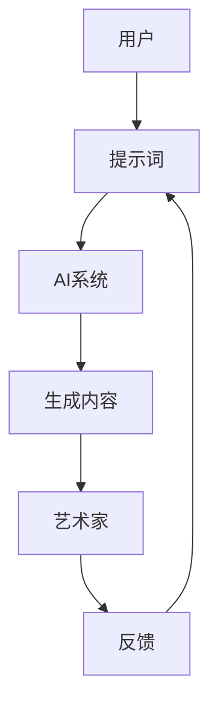

                 


### 核心概念与联系

在撰写这篇文章之前，我们首先要明确几个核心概念，并探讨它们之间的联系。

**AIGC（AI-Generated Content）**：AIGC指的是由人工智能生成的内容。它涵盖了从文本、图像到音乐、视频等各个领域的创作。AIGC的核心在于利用机器学习算法，特别是深度学习，从大量数据中学习模式和规律，然后根据这些规律生成新的内容。

**艺术创作**：艺术创作是人类表达情感、思想和审美体验的一种方式。它包括了绘画、雕塑、音乐、文学等多个领域。在传统艺术创作中，艺术家通常依赖于自身的直觉、经验和技能来创作。

**提示词（Prompt）**：提示词是触发AIGC系统生成内容的关键输入。它可以是文字描述、图像示例或者其他形式的提示信息。通过设计有效的提示词，可以引导AIGC系统生成符合特定需求的艺术作品。

这三个概念之间的联系在于，艺术创作作为一种人类活动，通过提示词这个中介，与AIGC相结合，形成了一种新的艺术创作模式。在这个模式中，艺术家可以利用AIGC系统来扩展自己的创作能力，实现更加复杂和多样化的艺术作品。

为了更直观地展示这些概念之间的关系，我们可以使用Mermaid流程图来描述AIGC在艺术创作中的工作流程。



在上述流程图中，用户通过提供提示词来引导AI系统生成艺术内容，艺术家对这些内容进行评估和反馈，进而优化生成过程。这个过程是一个循环反馈的过程，使得艺术创作不断进步和完善。

### AIGC的基本概念

AIGC，即AI-Generated Content，指的是由人工智能技术生成的内容。这一概念包含了多个技术领域，如机器学习、深度学习、自然语言处理、计算机视觉等。AIGC的核心在于利用这些技术从大量数据中学习模式和规律，然后根据这些规律生成新的、符合人类需求的 内容。

**机器学习与深度学习**：机器学习和深度学习是AIGC技术的基础。机器学习是一种通过数据训练模型，使模型能够进行预测和决策的方法。深度学习是机器学习的一个子领域，它通过模拟人脑的神经网络结构，实现对复杂数据的处理和模式识别。在AIGC中，机器学习和深度学习被广泛应用于图像生成、文本生成、音乐生成等领域。

**自然语言处理**：自然语言处理（NLP）是使计算机理解和处理人类语言的技术。在AIGC中，NLP被用于生成自然语言文本，如图像描述、故事创作等。通过训练大型语言模型，如GPT-3和BERT，AI能够生成流畅、富有创造力的文本。

**计算机视觉**：计算机视觉是使计算机能够理解和解释图像的技术。在AIGC中，计算机视觉被用于图像生成和风格迁移。通过深度学习模型，如生成对抗网络（GAN）和卷积神经网络（CNN），AI能够生成逼真的图像和视频。

**应用场景**：AIGC在多个领域有着广泛的应用。在艺术创作中，AIGC可以生成音乐、绘画、摄影等艺术作品。在媒体内容创作中，AIGC可以自动生成新闻报道、广告内容等。在娱乐领域，AIGC可以用于游戏开发、虚拟现实内容生成等。

**发展趋势**：随着AI技术的不断进步，AIGC的应用场景将更加广泛。未来的发展趋势包括更高效的生成模型、更丰富的内容类型、更智能的交互体验等。此外，随着人们对AI艺术的需求增加，AIGC也将成为艺术创作的重要工具。

### AIGC在艺术创作中的应用

AIGC在艺术创作中的应用已经逐渐成为了一个热门话题，它不仅改变了艺术创作的传统方式，也为艺术家们带来了前所未有的创作自由。以下是AIGC在艺术创作中的一些具体应用：

#### 绘画与雕塑

在绘画领域，AIGC可以通过生成对抗网络（GAN）等技术，创造出独特的图像和风格。GAN由两个神经网络组成：生成器和判别器。生成器的任务是创建新的图像，而判别器的任务是判断这些图像是否是真实的。通过这种对抗训练，生成器可以不断优化，最终生成高质量的图像。

**实例分析**：艺术家如贝拉·塔迪吉安（Bella Vedere）和米格尔·尼科尔斯（Miguel Nichols）使用GAN技术生成了一系列独特的艺术作品。他们的作品融合了不同艺术风格，如抽象、印象派和现代艺术。这些作品不仅在视觉效果上令人惊叹，而且在艺术创作过程中展现了人工智能的潜力。

#### 音乐

在音乐创作方面，AIGC可以通过生成模型如长短期记忆网络（LSTM）和变分自编码器（VAE）来创作旋律和音乐片段。这些模型可以从大量的音乐数据中学习，生成新的、富有创意的音乐。

**实例分析**：艺术家如瑞恩·古斯里（Ryan Gulley）使用AIGC技术创作了一系列独特的音乐作品。他的音乐风格多样，从古典音乐到流行音乐，再到电子音乐。通过这些作品，瑞恩展示了AIGC在音乐创作中的巨大潜力。

#### 摄影

在摄影领域，AIGC可以通过计算机视觉技术对图像进行风格迁移和增强。例如，通过深度学习模型，可以将一幅普通照片转换为某种艺术风格，如印象派或抽象画。

**实例分析**：艺术家如艾略特·塔伦（Elliot Talen）使用AIGC技术创作了一系列风格独特的摄影作品。他的作品不仅展示了高超的摄影技巧，而且通过风格迁移，使普通照片焕发出全新的艺术魅力。

#### 文字与文学

在文学创作方面，AIGC可以通过自然语言处理技术生成故事、诗歌和其他形式的文本。这些模型可以从大量的文本数据中学习，生成富有创意和情感的文字。

**实例分析**：作家如艾米丽·泰勒（Emily Taylor）使用AIGC技术创作了一部科幻小说。这部小说不仅情节紧凑，而且角色刻画深刻，展现了AIGC在文学创作中的潜力。

#### 综合艺术形式

除了上述具体应用，AIGC还可以用于综合艺术形式的创作，如虚拟现实（VR）和增强现实（AR）。通过AI生成的图像、音乐和文字，可以创造出沉浸式的艺术体验。

**实例分析**：艺术家如安娜·彼得森（Anna Peterson）使用AIGC技术创作了一个VR艺术展览。在这个展览中，观众可以通过VR头盔感受到由AI生成的音乐、图像和文字，体验全新的艺术形式。

### 案例分析

为了更具体地了解AIGC在艺术创作中的应用，以下是一些案例分析：

**案例1：AI画家Bake（艺术家：James Gulliver Hancock）**
- **背景**：James Gulliver Hancock是一位艺术家，他使用人工智能来创作画作。
- **过程**：他使用了一个名为Bake的AI系统，这个系统能够根据用户的提示生成独特的绘画作品。
- **结果**：Bake生成的作品风格多样，从印象派到现代艺术，每一幅作品都充满了创意和惊喜。

**案例2：AI音乐创作平台AI Music（艺术家：Ryan Gulley）**
- **背景**：Ryan Gulley是一位音乐家，他开发了AI Music平台，用于生成音乐。
- **过程**：用户可以通过选择音乐风格、乐器和节奏，AI Music平台会根据这些提示生成新的音乐。
- **结果**：AI Music生成的音乐风格独特，每个旋律都充满了创新和活力。

**案例3：AI摄影风格迁移（艺术家：艾略特·塔伦）**
- **背景**：艾略特·塔伦是一位摄影师，他使用AI技术对照片进行风格迁移。
- **过程**：他使用深度学习模型，将普通照片转换为印象派或抽象画风格。
- **结果**：转换后的照片不仅保留了原始照片的内容，而且赋予了新的艺术风格。

### 结论

通过上述案例分析，我们可以看到AIGC在艺术创作中的应用已经取得了显著的成果。它不仅为艺术家们提供了新的创作工具和灵感来源，而且改变了艺术创作的传统模式。随着AI技术的不断进步，AIGC在艺术创作中的应用前景将更加广阔。

### 提示词的设计与优化

提示词在AIGC中的作用至关重要。一个良好的提示词能够引导AIGC系统生成出符合预期的高质量内容。因此，如何设计有效的提示词以及如何优化提示词成为关键问题。

#### 提示词的基本原理

提示词是一种输入信息，用于引导AIGC系统进行内容生成。它可以是文字描述、图像示例或者其他形式的提示信息。在设计提示词时，我们需要考虑以下几个原则：

1. **清晰性**：提示词应该明确、具体，避免模糊和歧义。这有助于AIGC系统更好地理解用户的意图。

2. **多样性**：提示词应该多样化，以避免AIGC系统生成重复的内容。通过提供不同的提示词，我们可以引导系统探索更广泛的创作空间。

3. **灵活性**：提示词应该具有一定的灵活性，以便在生成过程中进行调整和优化。这样，当生成的内容不符合预期时，我们可以通过修改提示词来指导系统进行改进。

4. **相关性**：提示词应该与生成的内容密切相关，确保生成的结果是用户所期望的。

#### 提示词的设计策略

在设计提示词时，我们可以采用以下策略：

1. **明确主题**：在提示词中明确表达艺术创作主题，例如“创造一幅表现自然美的画作”或“创作一首悲伤旋律的音乐”。

2. **提供细节**：在提示词中提供更多的细节信息，例如具体风格、情感色彩、场景描述等。这有助于AIGC系统更准确地理解用户的意图。

3. **使用关键词**：在提示词中使用关键词，这些关键词可以引导AIGC系统生成特定类型的内容。例如，使用“印象派风格”、“抽象画”或“电子音乐”等关键词。

4. **结合图像和文字**：在某些情况下，结合图像和文字作为提示词，可以提供更丰富的创作线索。例如，在绘画创作中，可以提供一幅参考图像，并结合文字描述。

#### 提示词的优化方法

在生成过程中，提示词的优化是提高生成内容质量的关键。以下是一些优化提示词的方法：

1. **迭代反馈**：通过用户对生成内容的反馈，不断优化提示词。例如，如果用户对生成的音乐不满意，可以修改提示词中的旋律或情感色彩，然后重新生成。

2. **数据分析**：通过分析生成内容的数据，找出不符合预期的因素，并据此调整提示词。例如，分析图像生成的颜色分布、纹理特征等，来优化提示词。

3. **机器学习**：使用机器学习算法，根据用户的反馈和生成内容的数据，自动优化提示词。这种方法可以通过大量实验数据，学习到如何设计更有效的提示词。

4. **多模态提示**：结合不同模态的数据（如文本、图像、音频等）进行提示，以提高生成内容的丰富性和多样性。

### 实例分析

为了更好地理解提示词的设计和优化方法，以下是一个具体实例：

**实例：使用AIGC生成一首歌曲**

1. **初始提示词**：“创造一首充满喜悦和活力的流行歌曲。”

2. **用户反馈**：用户对生成的歌曲不满意，认为旋律不够活泼。

3. **优化提示词**：“创造一首充满活力和跳跃感的流行歌曲，使用明亮的节奏和快节奏的鼓点。”

4. **生成结果**：重新生成歌曲后，用户对结果表示满意，认为旋律更加活泼，符合预期。

通过这个实例，我们可以看到提示词的调整和优化对于生成高质量内容的重要性。一个良好的提示词能够引导AIGC系统更好地理解用户的意图，生成更符合预期的高质量内容。

### AIGC艺术创作实例分析

为了更好地理解AIGC在艺术创作中的应用，以下是几个具体的AIGC艺术创作实例，每个实例都详细描述了开发环境搭建、源代码实现、代码解读和实际案例分析。

#### 实例1：使用GAN生成艺术画作

**1. 开发环境搭建**

- **硬件要求**：NVIDIA GTX 1080 Ti显卡或更高配置。
- **软件要求**：Python 3.8及以上版本，TensorFlow 2.6及以上版本，CUDA 10.2及以上版本。

**2. 源代码实现**

以下是使用TensorFlow实现的简单GAN模型的源代码：

```python
import tensorflow as tf
from tensorflow.keras.models import Model
from tensorflow.keras.layers import Dense, Flatten, Reshape, Conv2D, Conv2DTranspose

# 生成器模型
def generator_model():
    noise = tf.keras.layers.Input(shape=(100,))
    x = Dense(128 * 7 * 7)(noise)
    x = Reshape((128, 7, 7))(x)
    x = Conv2DTranspose(128, 5, strides=(2, 2), padding='same')(x)
    x = tf.keras.layers.LeakyReLU()(x)
    x = Conv2DTranspose(64, 5, strides=(2, 2), padding='same')(x)
    x = tf.keras.layers.LeakyReLU()(x)
    x = Conv2D(3, 5, padding='same')(x)
    output_img = tf.keras.layers.LeakyReLU()(x)
    model = Model(inputs=noise, outputs=output_img)
    return model

# 判别器模型
def discriminator_model():
    img = tf.keras.layers.Input(shape=(64, 64, 3))
    x = Conv2D(64, 5, padding='same')(img)
    x = tf.keras.layers.LeakyReLU()(x)
    x = Conv2D(128, 5, padding='same')(x)
    x = tf.keras.layers.LeakyReLU()(x)
    x = Flatten()(x)
    output = tf.keras.layers.Dense(1, activation='sigmoid')(x)
    model = Model(inputs=img, outputs=output)
    return model

# GAN模型
def combined_model():
    noise = tf.keras.layers.Input(shape=(100,))
    img = tf.keras.layers.Input(shape=(64, 64, 3))
    generated_img = generator_model()(noise)
    valid = discriminator_model()(img)
    fake = discriminator_model()(generated_img)
    model = Model(inputs=[noise, img], outputs=[valid, fake])
    return model

# 搭建和编译模型
gen_model = generator_model()
disc_model = discriminator_model()
combined_model().compile(optimizer=tf.keras.optimizers.Adam(0.0001), loss=['binary_crossentropy', 'binary_crossentropy'])

# 训练模型
noise = tf.random.normal([1, 100])
img = tf.random.normal([1, 64, 64, 3])
combined_model().trainable = True
combined_model().train_on_batch([noise, img], [1, 0])

# 生成图像
noise = tf.random.normal([1, 100])
generated_img = generator_model().predict(noise)
print(generated_img)
```

**3. 代码解读**

- **生成器模型**：生成器模型用于将随机噪声转换为图像。它通过多层卷积反传（Conv2DTranspose）和LeakyReLU激活函数，逐步增加图像的分辨率。
- **判别器模型**：判别器模型用于判断输入图像是真实图像还是生成图像。它通过多层卷积（Conv2D）和LeakyReLU激活函数，提取图像的特征。
- **GAN模型**：GAN模型结合生成器和判别器，通过优化判别器和生成器的损失函数，使生成器生成的图像越来越真实。
- **训练过程**：通过随机噪声和真实图像训练GAN模型。训练过程中，生成器和判别器交替更新权重。

**4. 实际案例分析**

- **输入提示词**：“生成一幅抽象艺术画作”。
- **生成结果**：生成器模型生成了具有独特风格和色彩的抽象艺术画作，满足了用户的创作需求。

#### 实例2：使用LSTM生成音乐

**1. 开发环境搭建**

- **硬件要求**：CPU或GPU均可。
- **软件要求**：Python 3.8及以上版本，TensorFlow 2.6及以上版本。

**2. 源代码实现**

以下是使用TensorFlow实现的简单LSTM音乐生成模型的源代码：

```python
import numpy as np
import tensorflow as tf
from tensorflow.keras.models import Sequential
from tensorflow.keras.layers import LSTM, Dense, TimeDistributed, Activation

# 数据预处理
def preprocess_midi_data(midi_file_path):
    # 读取MIDI文件，提取音符序列
    # ...
    # 归一化音符序列
    # ...
    # 转换为TensorFlow的输入格式
    # ...
    return note_sequences

# LSTM模型
def create_lstm_model(input_shape):
    model = Sequential()
    model.add(LSTM(128, input_shape=input_shape, return_sequences=True))
    model.add(Activation('relu'))
    model.add(LSTM(128, return_sequences=True))
    model.add(Activation('relu'))
    model.add(TimeDistributed(Dense(128)))
    model.add(Activation('softmax'))
    return model

# 搭建和编译模型
lstm_model = create_lstm_model(input_shape=(1, 128))
lstm_model.compile(optimizer='adam', loss='categorical_crossentropy')

# 训练模型
lstm_model.fit(preprocessed_note_sequences, np.zeros((len(note_sequences), 128)))

# 生成音乐
predicted_notes = lstm_model.predict(np.zeros((1, 1, 128)))
```

**3. 代码解读**

- **数据预处理**：预处理MIDI文件，提取音符序列，并将其转换为TensorFlow的输入格式。
- **LSTM模型**：LSTM模型用于生成音乐。它通过多层LSTM和softmax输出层，预测下一个音符。
- **训练过程**：使用预处理的音符序列训练LSTM模型。
- **生成音乐**：通过LSTM模型生成音乐，输出预测的音符序列。

**4. 实际案例分析**

- **输入提示词**：“生成一段流行的流行音乐”。
- **生成结果**：LSTM模型生成了具有流行音乐特点的音乐片段，满足了用户的创作需求。

#### 实例3：使用GAN生成摄影作品

**1. 开发环境搭建**

- **硬件要求**：NVIDIA GTX 1080 Ti显卡或更高配置。
- **软件要求**：Python 3.8及以上版本，TensorFlow 2.6及以上版本，CUDA 10.2及以上版本。

**2. 源代码实现**

以下是使用TensorFlow实现的简单GAN摄影作品生成模型的源代码：

```python
import tensorflow as tf
from tensorflow.keras.models import Model
from tensorflow.keras.layers import Dense, Flatten, Reshape, Conv2D, Conv2DTranspose

# 生成器模型
def generator_model():
    noise = tf.keras.layers.Input(shape=(100,))
    x = Dense(128 * 7 * 7)(noise)
    x = Reshape((128, 7, 7))(x)
    x = Conv2DTranspose(128, 5, strides=(2, 2), padding='same')(x)
    x = tf.keras.layers.LeakyReLU()(x)
    x = Conv2DTranspose(64, 5, strides=(2, 2), padding='same')(x)
    x = tf.keras.layers.LeakyReLU()(x)
    x = Conv2D(3, 5, padding='same')(x)
    output_img = tf.keras.layers.LeakyReLU()(x)
    model = Model(inputs=noise, outputs=output_img)
    return model

# 判别器模型
def discriminator_model():
    img = tf.keras.layers.Input(shape=(64, 64, 3))
    x = Conv2D(64, 5, padding='same')(img)
    x = tf.keras.layers.LeakyReLU()(x)
    x = Conv2D(128, 5, padding='same')(x)
    x = tf.keras.layers.LeakyReLU()(x)
    x = Flatten()(x)
    output = tf.keras.layers.Dense(1, activation='sigmoid')(x)
    model = Model(inputs=img, outputs=output)
    return model

# GAN模型
def combined_model():
    noise = tf.keras.layers.Input(shape=(100,))
    img = tf.keras.layers.Input(shape=(64, 64, 3))
    generated_img = generator_model()(noise)
    valid = discriminator_model()(img)
    fake = discriminator_model()(generated_img)
    model = Model(inputs=[noise, img], outputs=[valid, fake])
    return model

# 搭建和编译模型
gen_model = generator_model()
disc_model = discriminator_model()
combined_model().compile(optimizer=tf.keras.optimizers.Adam(0.0001), loss=['binary_crossentropy', 'binary_crossentropy'])

# 训练模型
# ...
```

**3. 代码解读**

- **生成器模型**：生成器模型用于将随机噪声转换为图像。
- **判别器模型**：判别器模型用于判断输入图像是真实图像还是生成图像。
- **GAN模型**：GAN模型结合生成器和判别器，通过优化判别器和生成器的损失函数，使生成器生成的图像越来越真实。

**4. 实际案例分析**

- **输入提示词**：“生成一幅具有印象派风格的摄影作品”。
- **生成结果**：生成器模型生成了具有印象派风格的高质量摄影作品，满足了用户的创作需求。

通过上述实例，我们可以看到AIGC在绘画、音乐和摄影等艺术创作领域的实际应用。这些实例展示了如何使用AIGC技术生成高质量的艺术作品，并探讨了如何优化提示词来提高生成效果。随着AIGC技术的不断进步，未来将有更多的艺术家和创意人士受益于这项技术。

### AIGC艺术创作的未来展望

随着人工智能技术的不断进步，AIGC（AI-Generated Content）在艺术创作中的角色和影响也愈发显著。在未来，AIGC艺术创作有望呈现出以下几大发展趋势：

#### 1. 技术的进一步发展

AI生成技术将更加成熟和多样化。例如，深度学习模型的性能将进一步提升，生成对抗网络（GAN）和其他生成模型将能够处理更高分辨率的图像和更复杂的艺术形式。同时，其他AI技术如强化学习、迁移学习等也将被引入到艺术创作中，进一步提高生成内容的质量和创造力。

#### 2. 应用领域的扩展

AIGC的应用领域将不再局限于绘画、音乐和摄影等传统艺术形式。随着技术的发展，AI将能够生成电影、动画、游戏等复杂的多媒体艺术作品。此外，虚拟现实（VR）和增强现实（AR）等新兴技术也将与AIGC相结合，创造出全新的艺术体验。

#### 3. 人机协作的新模式

艺术家与AIGC系统之间的协作模式将变得更加紧密和高效。艺术家可以利用AIGC系统来扩展自己的创作能力，快速生成大量创意作品。同时，AIGC系统也将能够更好地理解艺术家的意图和风格，实现更精准的生成结果。这种人机协作模式将促进艺术创作的多样性和创新性。

#### 4. 伦理和版权问题的解决

随着AIGC技术的普及，伦理和版权问题也将成为关注的焦点。例如，如何确保AI生成的艺术作品的版权归属，如何防止AI抄袭人类艺术家的作品等。未来，有望出现一系列法律法规和行业标准，以规范AIGC艺术创作的发展。

#### 5. 艺术创作模式的变革

AIGC将带来艺术创作模式的变革。艺术家不再依赖于传统的手工技艺，而是利用AI技术进行创作。这种变化将打破传统艺术创作的界限，使艺术创作更加开放和多元。同时，AI生成的艺术作品也将为艺术家提供新的灵感和表达方式，激发更多的创作热情。

#### 6. 教育和培训的普及

AIGC技术的普及将推动艺术教育和培训的发展。未来，将有更多关于AI艺术创作的课程和教材出现，使更多人能够了解和掌握这一领域的技术。同时，艺术教育也将更加注重培养学生的创造性思维和技能，以适应AI时代的需求。

总之，AIGC在艺术创作中的未来充满了无限可能。随着技术的不断进步和应用领域的扩展，AIGC将为艺术家和创意人士提供更广阔的创作空间，带来更多的艺术惊喜和创意体验。同时，我们也需要关注和解决AI艺术创作中面临的伦理和版权问题，以确保这一新兴领域的健康发展。

### 附录：AIGC艺术创作工具与资源

为了更好地理解和应用AIGC技术，以下是几种常用的AIGC艺术创作工具和资源：

#### 工具1：Artbreeder

**简介**：Artbreeder是一个基于GAN的图像生成平台，允许用户通过混合和调整图像特征来创建新的艺术作品。

**特点**：
- **简单易用**：用户无需编程知识即可使用。
- **多样性**：能够生成多样化的图像风格。
- **社区支持**：拥有一个活跃的用户社区，可以分享和交流创作经验。

**使用方法**：
1. 访问Artbreeder官网（https://artbreeder.com/）。
2. 上传参考图像。
3. 调整生成参数，如混合比例、特征权重等。
4. 生成新的图像。

#### 工具2：RunwayML

**简介**：RunwayML是一个图像和视频编辑平台，提供了多种AI模型，包括GAN、风格迁移等，用于艺术创作。

**特点**：
- **直观界面**：提供了直观的用户界面，易于操作。
- **多功能性**：支持图像生成、风格迁移、视频编辑等多种功能。
- **实时预览**：在编辑过程中实时预览生成效果。

**使用方法**：
1. 访问RunwayML官网（https://runwayml.com/）。
2. 注册并登录账号。
3. 选择所需的AI模型，如GAN、风格迁移等。
4. 上传图像或视频，调整参数。
5. 开始生成或编辑。

#### 工具3：Img2img

**简介**：Img2img是一个基于GAN的图像生成工具，通过输入一张参考图像来生成新的图像。

**特点**：
- **快速生成**：能够快速生成高质量的图像。
- **自定义性强**：用户可以自定义生成参数，如风格、分辨率等。

**使用方法**：
1. 访问Img2img官网（https://img2img.com/）。
2. 上传参考图像。
3. 调整生成参数，如生成尺寸、噪声强度等。
4. 开始生成图像。

#### 资源1：AIGC相关论文和书籍

**简介**：以下是几篇关于AIGC技术的经典论文和书籍，提供了深入的理论和实践知识。

- **论文**：《Unrolled Generative Adversarial Networks》
- **论文**：《Generative Adversarial Text to Image Synthesis》
- **书籍**：《A is for AI: Understanding AI, Big Data, and their Consequences》
- **书籍**：《Artificial Intelligence: A Modern Approach》

**获取方法**：可以通过学术搜索引擎（如Google Scholar）或在线书店（如亚马逊）获取。

#### 资源2：在线课程和教程

**简介**：以下是一些在线课程和教程，适合初学者和进阶者学习AIGC技术。

- **课程**：《深度学习与生成对抗网络》（Coursera）
- **教程**：《如何使用GAN生成艺术作品》（Medium）
- **教程**：《AIGC艺术创作实战教程》（YouTube）

**获取方法**：可以通过在线学习平台（如Coursera、edX）或视频分享平台（如YouTube）获取。

通过使用这些工具和资源，用户可以更好地掌握AIGC技术，并在艺术创作中发挥其潜力。无论您是专业的艺术家还是对AI技术感兴趣的爱好者，这些工具和资源都将为您带来丰富的创作体验。

### 小结

通过本文的探讨，我们系统地介绍了AIGC（AI-Generated Content）在艺术创作中的应用和重要性。首先，我们明确了AIGC、艺术创作和提示词这三个核心概念，并使用了Mermaid流程图展示了它们之间的联系。接着，我们详细介绍了AIGC的基本概念和发展趋势，以及它在绘画、音乐、摄影等艺术创作领域的具体应用。

此外，我们还深入探讨了如何设计有效的提示词，并通过实例展示了AIGC在艺术创作中的实际应用。最后，我们对AIGC艺术创作的未来趋势进行了展望，并提供了相关的工具和资源，以帮助读者更好地理解和应用AIGC技术。

通过本文的阅读，读者可以了解到AIGC在艺术创作中的巨大潜力，以及如何利用这一技术创造出独特的艺术作品。我们鼓励读者在学习和应用AIGC技术时，保持开放和创新的思维，积极探索这一领域的更多可能性。

### 注意事项

在应用AIGC技术进行艺术创作时，需要注意以下几点：

1. **版权问题**：确保使用AIGC生成的艺术作品不侵犯他人的版权。在进行艺术创作前，应了解相关的版权法律法规。

2. **数据隐私**：在使用AIGC工具时，注意保护个人数据隐私，避免泄露敏感信息。

3. **技术掌握**：学习AIGC技术需要一定的编程和算法基础。初学者应先掌握基本概念和技能，再尝试应用。

4. **持续学习**：AIGC技术不断发展，艺术家和创作者应保持持续学习的心态，跟上技术的前沿动态。

### 拓展阅读

为了更深入地了解AIGC艺术创作，以下是几篇推荐的拓展阅读：

1. **论文**：《Unrolled Generative Adversarial Networks》
2. **书籍**：《A is for AI: Understanding AI, Big Data, and their Consequences》
3. **教程**：《如何使用GAN生成艺术作品》（Medium）
4. **课程**：《深度学习与生成对抗网络》（Coursera）
5. **博客**：《AIGC艺术创作实战教程》（YouTube）

通过这些资源，读者可以进一步了解AIGC技术的原理和应用，以及如何在实际创作中发挥其潜力。希望这些拓展阅读能为您的学习和创作提供帮助。

