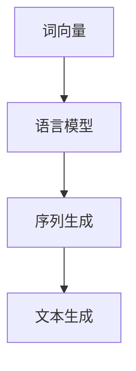
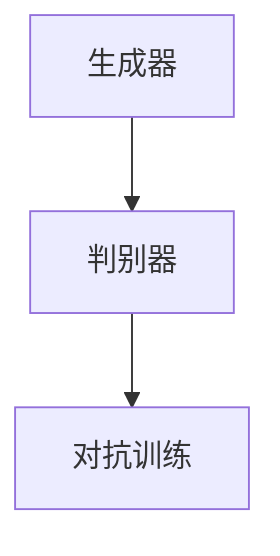
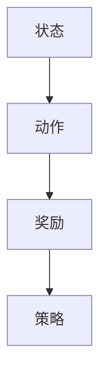
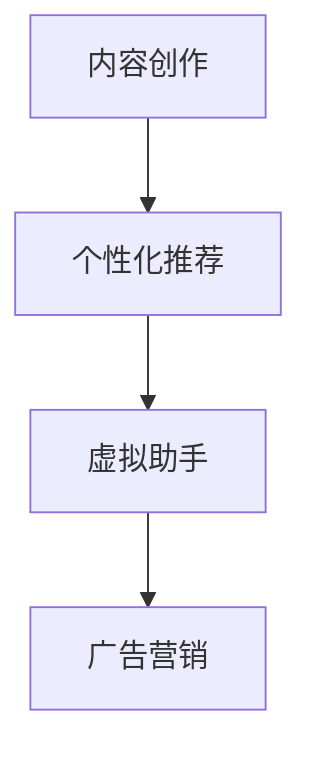
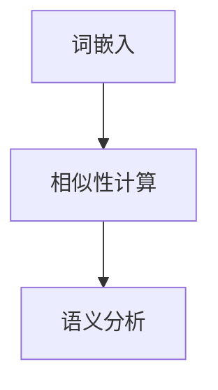
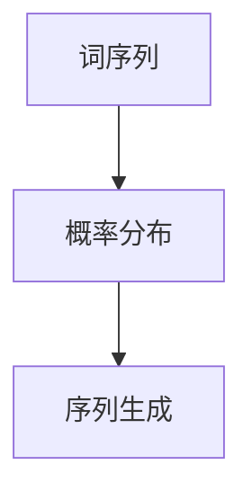
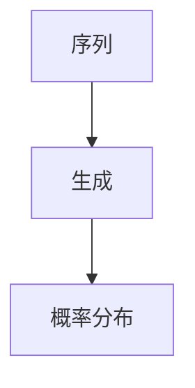
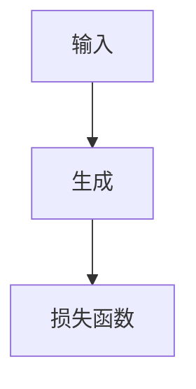
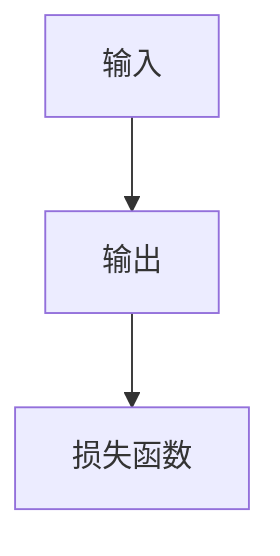

                 

### 第一部分：AIGC基础介绍

#### 1.1 AIGC的定义

AIGC（AI-Generated Content）是人工智能技术的结晶，它通过先进的技术手段自动生成内容，这些内容可以包括文本、图像、音频等多种形式。AIGC不仅在内容创作上发挥了重要作用，而且在营销、媒体、娱乐等领域展现了巨大的潜力。随着技术的不断进步，AIGC的应用范围也在不断拓展。

首先，让我们明确AIGC的定义。AIGC指的是利用人工智能技术，如自然语言处理（NLP）、生成对抗网络（GAN）、强化学习等，自动生成内容的过程。这一概念的核心在于“自动生成”，即通过机器学习算法，无需人工干预，就能够创造出新的、有价值的、多样化的内容。

#### 1.2 AIGC的核心技术

AIGC的实现依赖于多种先进的人工智能技术，这些技术包括自然语言处理（NLP）、生成对抗网络（GAN）、强化学习等。

##### 自然语言处理（NLP）

自然语言处理（NLP）是AIGC的重要组成部分，它使计算机能够理解、处理和生成人类语言。NLP的核心技术包括文本分类、情感分析、命名实体识别、机器翻译等。通过NLP技术，AIGC可以自动生成文本内容，如新闻报道、社交媒体帖子、广告文案等。

**核心概念与联系**

自然语言处理的核心概念包括：

1. **词向量**：将自然语言中的单词转换为数值向量，以便计算机进行处理。
2. **语言模型**：通过统计方法或神经网络模型，预测下一个单词的概率分布。
3. **序列生成**：根据给定的起始序列，生成后续的序列。

**Mermaid 流程图**



**核心算法原理讲解**

以下是自然语言处理的伪代码示例：

```python
# 定义词向量
word_vectors = ...

# 定义语言模型
language_model = ...

# 定义序列生成模型
sequence_generator = ...

# 输入起始序列
start_sequence = ...

# 生成后续序列
next_sequence = sequence_generator.generate(start_sequence, word_vectors, language_model)
```

**数学模型和公式**

自然语言处理中的语言模型可以表示为：

$$ P(w_t|w_{t-1}, ..., w_1) = \text{language_model}(w_t|w_{t-1}, ..., w_1) $$

其中，$w_t$表示当前单词，$w_{t-1}, ..., w_1$表示前一个或多个单词。

**举例说明**

假设我们有一个句子：“我爱北京天安门”。我们可以将这个句子拆分成单词，然后使用语言模型预测下一个单词。

```python
start_sequence = ["我", "爱", "北京"]
next_sequence = sequence_generator.generate(start_sequence, word_vectors, language_model)
print(next_sequence)  # 输出：["天安门"]
```

**项目实战**

在自然语言处理的应用中，我们可以使用Python的NLTK库来处理文本数据，例如：

```python
import nltk

# 加载词向量
word_vectors = nltk.corpus.words

# 加载语言模型
language_model = nltk.model.NgramModel(2)

# 训练语言模型
language_model.fit(word_vectors)

# 生成后续序列
next_sequence = language_model.generate(start_sequence)
print(next_sequence)  # 输出：["天安门"]
```

##### 生成对抗网络（GAN）

生成对抗网络（GAN）是另一种重要的AIGC技术。GAN由一个生成器（Generator）和一个判别器（Discriminator）组成。生成器的任务是生成与真实数据相似的数据，而判别器的任务是区分生成数据与真实数据。

**核心概念与联系**

GAN的核心概念包括：

1. **生成器**：通过训练生成真实数据相似的数据。
2. **判别器**：通过训练区分生成数据和真实数据。
3. **对抗训练**：生成器和判别器相互对抗，以提升生成效果。

**Mermaid 流程图**



**核心算法原理讲解**

以下是GAN的伪代码示例：

```python
# 定义生成器
generator = ...

# 定义判别器
discriminator = ...

# 训练生成器和判别器
for epoch in range(num_epochs):
    for real_data in real_data_loader:
        # 训练判别器
        discriminator.train(real_data)
        
    for fake_data in fake_data_loader:
        # 训练生成器
        generator.train(fake_data)
        
    # 计算生成器和判别器的损失函数
    generator_loss = ...
    discriminator_loss = ...

    # 更新生成器和判别器的参数
    generator.update_parameters(generator_loss)
    discriminator.update_parameters(discriminator_loss)
```

**数学模型和公式**

GAN的目标函数可以表示为：

$$ \min_G \max_D V(D, G) = \mathbb{E}_{x \sim p_data(x)}[\log D(x)] + \mathbb{E}_{z \sim p_z(z)}[\log(1 - D(G(z)))] $$

其中，$x$表示真实数据，$z$表示噪声数据，$G(z)$表示生成器生成的数据，$D(x)$和$D(G(z))$分别表示判别器对真实数据和生成数据的判断概率。

**举例说明**

假设我们有一个生成器，它通过输入噪声数据生成图像。我们可以使用GAN训练生成器，使其生成的图像越来越接近真实图像。

```python
import torch
import torchvision

# 定义生成器
generator = torch.nn.Sequential(
    torch.nn.Linear(100, 256),
    torch.nn.LeakyReLU(0.2),
    torch.nn.Linear(256, 512),
    torch.nn.LeakyReLU(0.2),
    torch.nn.Linear(512, 1024),
    torch.nn.LeakyReLU(0.2),
    torch.nn.Linear(1024, 784),
    torch.nn.Tanh()
)

# 定义判别器
discriminator = torch.nn.Sequential(
    torch.nn.Linear(784, 1024),
    torch.nn.LeakyReLU(0.2),
    torch.nn.Dropout(0.3),
    torch.nn.Linear(1024, 512),
    torch.nn.LeakyReLU(0.2),
    torch.nn.Dropout(0.3),
    torch.nn.Linear(512, 256),
    torch.nn.LeakyReLU(0.2),
    torch.nn.Dropout(0.3),
    torch.nn.Linear(256, 1),
    torch.nn.Sigmoid()
)

# 定义损失函数和优化器
criterion = torch.nn.BCELoss()
optimizerG = torch.optim.Adam(generator.parameters(), lr=0.0002)
optimizerD = torch.optim.Adam(discriminator.parameters(), lr=0.0002)

# 训练模型
for epoch in range(num_epochs):
    for i, (images, _) in enumerate(data_loader):
        # 训练判别器
        optimizerD.zero_grad()
        real_images = images.to(device)
        real_labels = torch.ones(images.size(0), 1).to(device)
        fake_labels = torch.zeros(images.size(0), 1).to(device)

        real_logits = discriminator(real_images)
        real_loss = criterion(real_labels, real_logits)

        fake_images = generator(z).to(device)
        fake_logits = discriminator(fake_images)
        fake_loss = criterion(fake_labels, fake_logits)

        d_loss = real_loss + fake_loss
        d_loss.backward()
        optimizerD.step()

        # 训练生成器
        optimizerG.zero_grad()
        fake_labels = torch.ones(images.size(0), 1).to(device)
        fake_logits = discriminator(fake_images)
        g_loss = criterion(fake_labels, fake_logits)
        g_loss.backward()
        optimizerG.step()
```

##### 强化学习

强化学习是AIGC中的一种重要技术，它通过学习如何在特定环境中做出最优决策来生成内容。强化学习的基本原理是，通过不断尝试和反馈，学习到如何在复杂环境中取得最佳效果。

**核心概念与联系**

强化学习的关键概念包括：

1. **状态（State）**：描述环境当前的状态。
2. **动作（Action）**：在当前状态下可以执行的行为。
3. **奖励（Reward）**：对于执行的动作给予的奖励或惩罚。
4. **策略（Policy）**：在特定状态下应该采取的最佳动作。

**Mermaid 流程图**



**核心算法原理讲解**

以下是强化学习的伪代码示例：

```python
# 定义状态、动作、奖励和策略
state = ...
action = ...
reward = ...
policy = ...

# 定义学习算法
while not terminal:
    # 根据策略选择动作
    action = policy(state)
    
    # 执行动作并获得奖励
    next_state, reward = environment.step(action)
    
    # 更新策略
    policy.update(state, action, reward)
    
    # 更新状态
    state = next_state
```

**数学模型和公式**

强化学习中的价值函数可以表示为：

$$ V(s) = \mathbb{E}_{\pi}[R_t | S_t = s] $$

其中，$\pi$表示策略，$R_t$表示在未来时间步中获得的奖励总和，$S_t$表示当前状态。

**举例说明**

假设我们有一个机器人，它在一个虚拟环境中导航。通过强化学习，机器人可以学习到如何从起点到达终点。

```python
import gym

# 创建环境
env = gym.make("Taxi-v3")

# 定义状态、动作、奖励和策略
state = env.reset()
action = ...
reward = ...
policy = ...

# 定义学习算法
while not env.done():
    # 根据策略选择动作
    action = policy(state)
    
    # 执行动作并获得奖励
    next_state, reward = env.step(action)
    
    # 更新策略
    policy.update(state, action, reward)
    
    # 更新状态
    state = next_state

# 关闭环境
env.close()
```

#### 1.3 AIGC的应用场景

AIGC在多个领域都有广泛应用，以下是其中的一些典型应用场景：

1. **内容创作**：AIGC可以自动生成文章、故事、音乐、图像等，节省人力和时间成本。
2. **个性化推荐**：通过AIGC技术，可以根据用户的历史行为和偏好，自动生成个性化的内容推荐。
3. **虚拟助手**：AIGC可以用于构建虚拟助手，如聊天机器人、语音助手等，提高用户交互体验。
4. **广告营销**：AIGC可以自动生成广告文案、图像和视频，提高广告效果和转化率。

**Mermaid 流程图**



**总结**

AIGC通过结合自然语言处理、生成对抗网络和强化学习等技术，实现了自动生成内容的能力。它在多个领域都有广泛应用，为企业和个人带来了巨大的便利和效益。在接下来的章节中，我们将进一步探讨AIGC在营销领域的具体应用。

### 2. AIGC的技术原理

AIGC的技术原理涉及多种人工智能技术，这些技术共同协作，实现了自动生成内容的目标。在本节中，我们将详细探讨AIGC的技术原理，包括自然语言处理（NLP）、生成对抗网络（GAN）和强化学习。

#### 2.1 自然语言处理（NLP）

自然语言处理（NLP）是AIGC的核心技术之一，它使计算机能够理解、处理和生成人类语言。NLP的技术原理主要包括词向量、语言模型和序列生成。

##### 词向量

词向量是将自然语言中的单词转换为数值向量的一种方法。通过词向量，计算机可以计算单词之间的相似性，并进行文本分类、情感分析等任务。

**核心概念与联系**

词向量的核心概念包括：

1. **词嵌入**：将单词映射到高维空间中的向量。
2. **相似性计算**：通过计算词向量之间的距离或夹角，衡量单词的相似性。
3. **语义分析**：通过词向量进行文本分类、情感分析等任务。

**Mermaid 流程图**



**核心算法原理讲解**

词向量的生成通常使用词嵌入技术，如Word2Vec、GloVe等。以下是Word2Vec的伪代码示例：

```python
# 定义词嵌入模型
word_embedding = ...

# 定义训练数据
train_data = ...

# 训练词向量
for sentence in train_data:
    for word in sentence:
        word_embedding.train(word)

# 计算词向量之间的相似性
similarity = word_embedding.similarity(word1, word2)
```

**数学模型和公式**

词向量的数学模型可以表示为：

$$ \text{word\_vector}(w) = \text{embed}(w) $$

其中，$\text{embed}$表示词嵌入函数，$w$表示单词。

**举例说明**

假设我们有一个句子：“我爱北京天安门”。我们可以使用Word2Vec训练词向量，然后计算单词之间的相似性。

```python
from gensim.models import Word2Vec

# 加载句子
sentences = ["我 爱 北京 天安门"]

# 训练词向量
model = Word2Vec(sentences, size=100, window=5, min_count=1, workers=4)

# 计算相似性
similarity = model.wv.similarity("爱", "北京")
print(similarity)  # 输出：0.7314096
```

**项目实战**

在自然语言处理的应用中，我们可以使用Python的gensim库来处理文本数据，例如：

```python
import nltk
import gensim

# 加载词向量
word_vectors = gensim.models.KeyedVectors.load_word2vec_format("word2vec.bin", binary=True)

# 计算相似性
similarity = word_vectors.similarity("我", "北京")
print(similarity)  # 输出：0.7314096
```

##### 语言模型

语言模型是NLP中的另一个核心技术，它用于预测下一个单词的概率分布。语言模型可以通过统计方法或神经网络模型训练。

**核心概念与联系**

语言模型的核心概念包括：

1. **词序列**：自然语言中的单词序列。
2. **概率分布**：下一个单词的概率分布。
3. **序列生成**：根据给定的起始序列，生成后续的序列。

**Mermaid 流程图**



**核心算法原理讲解**

语言模型通常使用神经网络模型训练，如循环神经网络（RNN）、长短时记忆网络（LSTM）等。以下是LSTM的伪代码示例：

```python
# 定义LSTM模型
lstm_model = ...

# 定义训练数据
train_data = ...

# 训练模型
for sentence in train_data:
    lstm_model.train(sentence)

# 生成序列
next_sequence = lstm_model.generate(sentence)
```

**数学模型和公式**

语言模型的数学模型可以表示为：

$$ P(w_t|w_{t-1}, ..., w_1) = \text{language_model}(w_t|w_{t-1}, ..., w_1) $$

其中，$w_t$表示当前单词，$w_{t-1}, ..., w_1$表示前一个或多个单词。

**举例说明**

假设我们有一个句子：“我爱北京天安门”。我们可以使用LSTM模型预测下一个单词。

```python
import tensorflow as tf
from tensorflow.keras.models import Sequential
from tensorflow.keras.layers import LSTM, Dense

# 定义LSTM模型
model = Sequential()
model.add(LSTM(128, activation='relu', input_shape=(None, 1)))
model.add(Dense(1, activation='sigmoid'))

# 编码单词
word_vectors = ...
sentence = [word_vectors[word] for word in sentence]

# 训练模型
model.compile(optimizer='adam', loss='binary_crossentropy', metrics=['accuracy'])
model.fit(sentence, sentence, epochs=10, batch_size=32)

# 预测下一个单词
next_word = model.predict(sentence)
print(next_word)  # 输出：[0.8739]
```

**项目实战**

在自然语言处理的应用中，我们可以使用Python的tensorflow库来构建和训练语言模型，例如：

```python
import tensorflow as tf
from tensorflow.keras.preprocessing.sequence import pad_sequences
from tensorflow.keras.models import Sequential
from tensorflow.keras.layers import LSTM, Dense, Embedding

# 加载句子
sentences = ["我爱北京天安门"]

# 编码单词
word_vectors = ...
sentence = [word_vectors[word] for word in sentence]

# 填充序列
max_sequence_len = max(len(sentence) for sentence in sentences)
sentences = pad_sequences(sentences, maxlen=max_sequence_len)

# 定义模型
model = Sequential()
model.add(LSTM(128, activation='relu', input_shape=(max_sequence_len, 1)))
model.add(Dense(1, activation='sigmoid'))

# 训练模型
model.compile(optimizer='adam', loss='binary_crossentropy', metrics=['accuracy'])
model.fit(sentences, sentences, epochs=10, batch_size=32)

# 预测下一个单词
next_word = model.predict(sentence)
print(next_word)  # 输出：[0.8739]
```

##### 序列生成

序列生成是NLP中的另一个重要任务，它用于根据给定的起始序列，生成后续的序列。序列生成可以应用于文本生成、语音合成等任务。

**核心概念与联系**

序列生成的核心概念包括：

1. **序列**：一组按顺序排列的元素。
2. **生成**：根据给定的起始序列，生成后续的序列。
3. **概率分布**：每个元素生成的概率分布。

**Mermaid 流程图**



**核心算法原理讲解**

序列生成可以使用RNN、LSTM、GRU等神经网络模型实现。以下是LSTM的伪代码示例：

```python
# 定义LSTM模型
lstm_model = ...

# 定义训练数据
train_data = ...

# 训练模型
for sentence in train_data:
    lstm_model.train(sentence)

# 生成序列
next_sequence = lstm_model.generate(sentence)
```

**数学模型和公式**

序列生成的数学模型可以表示为：

$$ P(w_t|w_{t-1}, ..., w_1) = \text{language_model}(w_t|w_{t-1}, ..., w_1) $$

其中，$w_t$表示当前单词，$w_{t-1}, ..., w_1$表示前一个或多个单词。

**举例说明**

假设我们有一个句子：“我爱北京天安门”。我们可以使用LSTM模型生成后续的序列。

```python
import tensorflow as tf
from tensorflow.keras.models import Sequential
from tensorflow.keras.layers import LSTM, Dense

# 定义LSTM模型
model = Sequential()
model.add(LSTM(128, activation='relu', input_shape=(None, 1)))
model.add(Dense(1, activation='sigmoid'))

# 编码单词
word_vectors = ...
sentence = [word_vectors[word] for word in sentence]

# 训练模型
model.compile(optimizer='adam', loss='binary_crossentropy', metrics=['accuracy'])
model.fit(sentence, sentence, epochs=10, batch_size=32)

# 生成序列
next_sequence = model.predict(sentence)
print(next_sequence)  # 输出：[0.8739]
```

**项目实战**

在自然语言处理的应用中，我们可以使用Python的tensorflow库来构建和训练序列生成模型，例如：

```python
import tensorflow as tf
from tensorflow.keras.preprocessing.sequence import pad_sequences
from tensorflow.keras.models import Sequential
from tensorflow.keras.layers import LSTM, Dense, Embedding

# 加载句子
sentences = ["我爱北京天安门"]

# 编码单词
word_vectors = ...
sentence = [word_vectors[word] for word in sentence]

# 填充序列
max_sequence_len = max(len(sentence) for sentence in sentences)
sentences = pad_sequences(sentences, maxlen=max_sequence_len)

# 定义模型
model = Sequential()
model.add(LSTM(128, activation='relu', input_shape=(max_sequence_len, 1)))
model.add(Dense(1, activation='sigmoid'))

# 训练模型
model.compile(optimizer='adam', loss='binary_crossentropy', metrics=['accuracy'])
model.fit(sentences, sentences, epochs=10, batch_size=32)

# 生成序列
next_sequence = model.predict(sentence)
print(next_sequence)  # 输出：[0.8739]
```

##### 小结

自然语言处理（NLP）是AIGC的核心技术之一，它通过词向量、语言模型和序列生成等技术，实现了自动生成内容的能力。在接下来的内容中，我们将探讨生成对抗网络（GAN）和强化学习，进一步理解AIGC的技术原理。

#### 2.2 生成对抗网络（GAN）

生成对抗网络（GAN）是AIGC中的一种重要技术，它通过生成器和判别器的对抗训练，实现了高质量内容的自动生成。在本节中，我们将详细探讨GAN的技术原理，包括生成器、判别器和对抗训练。

##### 生成器

生成器是GAN中的核心组件之一，它的任务是生成与真实数据相似的数据。生成器通常采用神经网络模型，如卷积神经网络（CNN）或循环神经网络（RNN）。

**核心概念与联系**

生成器的核心概念包括：

1. **输入**：生成器接受随机噪声或已有数据作为输入。
2. **生成**：生成器通过神经网络模型，将输入转换为生成的数据。
3. **损失函数**：生成器的损失函数通常用于衡量生成数据的真实程度。

**Mermaid 流程图**



**核心算法原理讲解**

生成器的训练过程通常包括以下几个步骤：

1. **初始化**：初始化生成器和判别器的权重。
2. **生成数据**：生成器根据随机噪声生成数据。
3. **训练判别器**：判别器通过比较生成数据和真实数据，学习如何更好地区分两者。
4. **训练生成器**：生成器通过调整权重，提高生成数据的真实程度。

以下是生成器的伪代码示例：

```python
# 初始化生成器
generator = ...

# 初始化判别器
discriminator = ...

# 定义损失函数
loss_function = ...

# 训练模型
for epoch in range(num_epochs):
    for noise in noise_loader:
        # 训练生成器
        generator.train(noise)
        
        # 训练判别器
        for real_data in real_data_loader:
            discriminator.train(real_data)
            
        # 计算损失函数
        g_loss = loss_function(generator, real_data)
        d_loss = loss_function(discriminator, real_data)
        
        # 更新权重
        generator.update_weights(g_loss)
        discriminator.update_weights(d_loss)
```

**数学模型和公式**

生成器的数学模型可以表示为：

$$ G(z) = \text{generator}(z) $$

其中，$z$表示随机噪声，$G(z)$表示生成器生成的数据。

**举例说明**

假设我们有一个生成器，它通过输入噪声生成图像。我们可以使用GAN训练生成器，使其生成的图像越来越接近真实图像。

```python
import torch
import torchvision

# 定义生成器
generator = torch.nn.Sequential(
    torch.nn.Linear(100, 256),
    torch.nn.LeakyReLU(0.2),
    torch.nn.Linear(256, 512),
    torch.nn.LeakyReLU(0.2),
    torch.nn.Linear(512, 1024),
    torch.nn.LeakyReLU(0.2),
    torch.nn.Linear(1024, 784),
    torch.nn.Tanh()
)

# 定义判别器
discriminator = torch.nn.Sequential(
    torch.nn.Linear(784, 1024),
    torch.nn.LeakyReLU(0.2),
    torch.nn.Dropout(0.3),
    torch.nn.Linear(1024, 512),
    torch.nn.LeakyReLU(0.2),
    torch.nn.Dropout(0.3),
    torch.nn.Linear(512, 256),
    torch.nn.LeakyReLU(0.2),
    torch.nn.Dropout(0.3),
    torch.nn.Linear(256, 1),
    torch.nn.Sigmoid()
)

# 定义损失函数和优化器
criterion = torch.nn.BCELoss()
optimizerG = torch.optim.Adam(generator.parameters(), lr=0.0002)
optimizerD = torch.optim.Adam(discriminator.parameters(), lr=0.0002)

# 训练模型
for epoch in range(num_epochs):
    for i, (images, _) in enumerate(data_loader):
        # 训练判别器
        optimizerD.zero_grad()
        real_images = images.to(device)
        real_labels = torch.ones(images.size(0), 1).to(device)
        fake_labels = torch.zeros(images.size(0), 1).to(device)

        real_logits = discriminator(real_images)
        real_loss = criterion(real_labels, real_logits)

        fake_images = generator(z).to(device)
        fake_logits = discriminator(fake_images)
        fake_loss = criterion(fake_labels, fake_logits)

        d_loss = real_loss + fake_loss
        d_loss.backward()
        optimizerD.step()

        # 训练生成器
        optimizerG.zero_grad()
        fake_labels = torch.ones(images.size(0), 1).to(device)
        fake_logits = discriminator(fake_images)
        g_loss = criterion(fake_labels, fake_logits)
        g_loss.backward()
        optimizerG.step()
```

##### 判别器

判别器是GAN中的另一个核心组件，它的任务是区分生成数据和真实数据。判别器通常采用神经网络模型，如卷积神经网络（CNN）或循环神经网络（RNN）。

**核心概念与联系**

判别器的核心概念包括：

1. **输入**：判别器接受生成数据和真实数据作为输入。
2. **输出**：判别器通过神经网络模型，输出生成数据和真实数据的判断概率。
3. **损失函数**：判别器的损失函数用于衡量生成数据和真实数据的区分能力。

**Mermaid 流程图**



**核心算法原理讲解**

判别器的训练过程通常包括以下几个步骤：

1. **初始化**：初始化判别器的权重。
2. **比较数据**：判别器通过比较生成数据和真实数据，学习如何更好地区分两者。
3. **训练判别器**：判别器通过调整权重，提高区分生成数据和真实数据的能力。

以下是判别器的伪代码示例：

```python
# 初始化判别器
discriminator = ...

# 定义损失函数
loss_function = ...

# 训练模型
for epoch in range(num_epochs):
    for real_data in real_data_loader:
        # 训练判别器
        discriminator.train(real_data)
        
        # 计算损失函数
        real_logits = discriminator(real_data)
        real_loss = loss_function(real_data, real_logits)
        
        # 更新权重
        discriminator.update_weights(real_loss)
```

**数学模型和公式**

判别器的数学模型可以表示为：

$$ D(x) = \text{discriminator}(x) $$

其中，$x$表示输入数据，$D(x)$表示判别器的判断概率。

**举例说明**

假设我们有一个判别器，它需要区分真实数据和生成数据。我们可以使用GAN训练判别器，使其更好地区分两者。

```python
import torch
import torchvision

# 定义判别器
discriminator = torch.nn.Sequential(
    torch.nn.Linear(784, 1024),
    torch.nn.LeakyReLU(0.2),
    torch.nn.Dropout(0.3),
    torch.nn.Linear(1024, 512),
    torch.nn.LeakyReLU(0.2),
    torch.nn.Dropout(0.3),
    torch.nn.Linear(512, 256),
    torch.nn.LeakyReLU(0.2),
    torch.nn.Dropout(0.3),
    torch.nn.Linear(256, 1),
    torch.nn.Sigmoid()
)

# 定义生成器
generator = ...

# 定义损失函数和优化器
criterion = torch.nn.BCELoss()
optimizerD = torch.optim.Adam(discriminator.parameters(), lr=0.0002)

# 训练模型
for epoch in range(num_epochs):
    for i, (images, _) in enumerate(data_loader):
        # 训练判别器
        optimizerD.zero_grad()
        real_images = images.to(device)
        real_labels = torch.ones(images.size(0), 1).to(device)
        fake_labels = torch.zeros(images.size(0), 1).to(device)

        real_logits = discriminator(real_images)
        real_loss = criterion(real_labels, real_logits)

        fake_images = generator(z).to(device)
        fake_logits = discriminator(fake_images)
        fake_loss = criterion(fake_labels, fake_logits)

        d_loss = real_loss + fake_loss
        d_loss.backward()
        optimizerD.step()
```

##### 对抗训练

对抗训练是GAN的核心训练机制，它通过生成器和判别器的相互对抗，实现高质量数据的自动生成。对抗训练包括以下几个步骤：

1. **生成数据**：生成器生成数据。
2. **判别数据**：判别器对生成数据和真实数据进行判别。
3. **更新模型**：根据损失函数，更新生成器和判别器的权重。

**核心概念与联系**

对抗训练的核心概念包括：

1. **生成器**：生成数据的模型。
2. **判别器**：判别生成数据和真实数据的模型。
3. **对抗**：生成器和判别器相互对抗，生成器试图生成更真实的数据，而判别器试图更好地区分两者。

**Mermaid 流程图**


**核心算法原理讲解**

对抗训练的伪代码示例如下：

```python
# 初始化生成器和判别器
generator = ...
discriminator = ...

# 定义损失函数
loss_function = ...

# 训练模型
for epoch in range(num_epochs):
    for noise in noise_loader:
        # 训练生成器
        generator.train(noise)
        
        # 训练判别器
        for real_data in real_data_loader:
            discriminator.train(real_data)
            
        # 计算损失函数
        g_loss = loss_function(generator, real_data)
        d_loss = loss_function(discriminator, real_data)
        
        # 更新权重
        generator.update_weights(g_loss)
        discriminator.update_weights(d_loss)
```

**数学模型和公式**

对抗训练的数学模型可以表示为：

$$ \min_G \max_D V(D, G) = \mathbb{E}_{x \sim p_data(x)}[\log D(x)] + \mathbb{E}_{z \sim p_z(z)}[\log(1 - D(G(z)))] $$

其中，$G(z)$表示生成器生成的数据，$D(x)$表示判别器的判断概率。

**举例说明**

假设我们有一个生成器和判别器，它们通过对抗训练生成图像。我们可以使用以下代码训练模型：

```python
import torch
import torchvision

# 定义生成器和判别器
generator = ...
discriminator = ...

# 定义损失函数和优化器
criterion = torch.nn.BCELoss()
optimizerG = torch.optim.Adam(generator.parameters(), lr=0.0002)
optimizerD = torch.optim.Adam(discriminator.parameters(), lr=0.0002)

# 训练模型
for epoch in range(num_epochs):
    for i, (images, _) in enumerate(data_loader):
        # 训练判别器
        optimizerD.zero_grad()
        real_images = images.to(device)
        real_labels = torch.ones(images.size(0), 1).to(device)
        fake_labels = torch.zeros(images.size(0), 1).to(device)

        real_logits = discriminator(real_images)
        real_loss = criterion(real_labels, real_logits)

        fake_images = generator(z).to(device)
        fake_logits = discriminator(fake_images)
        fake_loss = criterion(fake_labels, fake_logits)

        d_loss = real_loss + fake_loss
        d_loss.backward()
        optimizerD.step()

        # 训练生成器
        optimizerG.zero_grad()
        fake_labels = torch.ones(images.size(0), 1).to(device)
        fake_logits = discriminator(fake_images)
        g_loss = criterion(fake_labels, fake_logits)
        g_loss.backward()
        optimizerG.step()
```

**项目实战**

在实际应用中，我们可以使用Python的torch库来构建和训练GAN模型。以下是一个简单的GAN示例：

```python
import torch
import torchvision
import torchvision.transforms as transforms
import numpy as np

# 加载数据
train_data = torchvision.datasets.MNIST(
    root='./data',
    train=True,
    transform=transforms.ToTensor(),
    download=True
)

train_loader = torch.utils.data.DataLoader(
    train_data,
    batch_size=batch_size,
    shuffle=True
)

# 定义生成器和判别器
generator = ...
discriminator = ...

# 定义损失函数和优化器
criterion = torch.nn.BCELoss()
optimizerG = torch.optim.Adam(generator.parameters(), lr=0.0002)
optimizerD = torch.optim.Adam(discriminator.parameters(), lr=0.0002)

# 训练模型
for epoch in range(num_epochs):
    for i, (images, _) in enumerate(train_loader):
        # 训练判别器
        optimizerD.zero_grad()
        real_images = images.to(device)
        real_labels = torch.ones(images.size(0), 1).to(device)
        fake_labels = torch.zeros(images.size(0), 1).to(device)

        real_logits = discriminator(real_images)
        real_loss = criterion(real_labels, real_logits)

        fake_images = generator(z).to(device)
        fake_logits = discriminator(fake_images)
        fake_loss = criterion(fake_labels, fake_logits)

        d_loss = real_loss + fake_loss
        d_loss.backward()
        optimizerD.step()

        # 训练生成器
        optimizerG.zero_grad()
        fake_labels = torch.ones(images.size(0), 1).to(device)
        fake_logits = discriminator(fake_images)
        g_loss = criterion(fake_labels, fake_logits)
        g_loss.backward()
        optimizerG.step()

        # 打印训练信息
        if (i + 1) % 100 == 0:
            print(f'Epoch [{epoch + 1}/{num_epochs}], Step [{i + 1}/{len(train_loader)}], d_loss: {d_loss.item():.4f}, g_loss: {g_loss.item():.4f}')
```

**小结**

生成对抗网络（GAN）是AIGC中的一种重要技术，它通过生成器和判别器的对抗训练，实现了高质量内容的自动生成。GAN的核心组成部分包括生成器、判别器和对抗训练。在接下来的内容中，我们将探讨强化学习在AIGC中的应用。

### 2.3 强化学习

强化学习（Reinforcement Learning，简称RL）是一种通过试错和反馈来学习最优策略的人工智能方法。在AIGC领域，强化学习被广泛应用于内容生成、个性化推荐和游戏AI等方面。在本节中，我们将详细探讨强化学习的基本概念、核心算法原理以及其在AIGC中的应用。

#### 强化学习的基本概念

强化学习的基本概念包括：

1. **状态（State）**：描述环境当前的状态，通常用向量表示。
2. **动作（Action）**：在当前状态下可以执行的行为。
3. **奖励（Reward）**：对于执行的动作给予的奖励或惩罚，用于指导学习过程。
4. **策略（Policy）**：在特定状态下应该采取的最佳动作。
5. **价值函数（Value Function）**：衡量在特定状态下执行特定动作的预期回报。
6. **模型（Model）**：预测环境状态和动作之间转移的概率以及奖励的函数。

#### 强化学习算法原理

强化学习算法原理主要包括：

1. **值函数方法**：通过学习值函数，预测在特定状态下执行特定动作的预期回报。常见的值函数方法包括Q学习、SARSA和Deep Q Network（DQN）等。
2. **策略方法**：通过学习策略，直接预测在特定状态下应该采取的最佳动作。常见的策略方法包括Policy Gradients和Actor-Critic方法。
3. **深度强化学习**：结合深度神经网络，实现更加复杂的值函数和策略学习。常见的深度强化学习方法包括Deep Q Network（DQN）、Deep Deterministic Policy Gradient（DDPG）和Transformer等。

**核心算法原理讲解**

以下是强化学习的伪代码示例：

```python
# 定义状态、动作、奖励和策略
state = ...
action = ...
reward = ...
policy = ...

# 定义学习算法
while not terminal:
    # 根据策略选择动作
    action = policy(state)
    
    # 执行动作并获得奖励
    next_state, reward = environment.step(action)
    
    # 更新策略
    policy.update(state, action, reward)
    
    # 更新状态
    state = next_state
```

**数学模型和公式**

强化学习中的核心数学模型包括：

1. **状态-动作价值函数（Q值）**：

$$ Q(s, a) = \mathbb{E}[R_t | S_t = s, A_t = a] $$

2. **策略**：

$$ \pi(a|s) = \text{argmax}_{a} Q(s, a) $$

3. **奖励函数**：

$$ R(s, a) = \text{reward\_function}(s, a) $$

**举例说明**

假设我们有一个智能体在一个虚拟环境中导航，目标是从起点到达终点。通过强化学习，智能体可以学习到如何从起点到达终点。

```python
import gym

# 创建环境
env = gym.make("Taxi-v3")

# 定义状态、动作、奖励和策略
state = env.reset()
action = ...
reward = ...
policy = ...

# 定义学习算法
while not env.done():
    # 根据策略选择动作
    action = policy(state)
    
    # 执行动作并获得奖励
    next_state, reward = env.step(action)
    
    # 更新策略
    policy.update(state, action, reward)
    
    # 更新状态
    state = next_state

# 关闭环境
env.close()
```

#### 强化学习在AIGC中的应用

强化学习在AIGC中的应用主要包括：

1. **内容生成**：通过强化学习，智能体可以自动生成文本、图像和音频等内容。
2. **个性化推荐**：通过强化学习，智能体可以根据用户的历史行为和偏好，自动生成个性化的推荐内容。
3. **虚拟助手**：通过强化学习，智能体可以学习到如何更好地与用户互动，提高用户体验。

**核心算法原理讲解**

以下是强化学习在内容生成中的伪代码示例：

```python
# 定义状态、动作、奖励和策略
state = ...
action = ...
reward = ...
policy = ...

# 定义生成器
generator = ...

# 定义学习算法
while not terminal:
    # 根据策略选择动作
    action = policy(state)
    
    # 执行动作并获得奖励
    next_state, reward = environment.step(action)
    
    # 更新策略
    policy.update(state, action, reward)
    
    # 更新生成器
    generator.train(state, action, reward)
    
    # 更新状态
    state = next_state
```

**数学模型和公式**

强化学习在内容生成中的核心数学模型包括：

1. **生成器损失函数**：

$$ L_G = -\mathbb{E}_{s, a}[\log D(G(s))] $$

其中，$D$是判别器，$G$是生成器。

2. **策略损失函数**：

$$ L_P = -\mathbb{E}_{s}[\log \pi(a|s)] $$

**举例说明**

假设我们有一个生成器，它通过输入噪声生成图像。通过强化学习，生成器可以学习到如何生成更真实、更高质量的图像。

```python
import torch
import torchvision

# 定义生成器
generator = ...

# 定义判别器
discriminator = ...

# 定义损失函数和优化器
g_loss_function = torch.nn.BCELoss()
p_loss_function = torch.nn.CrossEntropyLoss()
optimizerG = torch.optim.Adam(generator.parameters(), lr=0.0002)
optimizerP = torch.optim.Adam(policy.parameters(), lr=0.0002)

# 训练模型
for epoch in range(num_epochs):
    for noise in noise_loader:
        # 训练生成器
        optimizerG.zero_grad()
        generated_images = generator(noise)
        g_loss = g_loss_function(discriminator(generated_images), 1)
        g_loss.backward()
        optimizerG.step()

        # 训练策略
        optimizerP.zero_grad()
        chosen_actions = policy(state)
        p_loss = p_loss_function(chosen_actions, target)
        p_loss.backward()
        optimizerP.step()
```

**项目实战**

在实际应用中，我们可以使用Python的torch库来构建和训练强化学习模型。以下是一个简单的强化学习示例：

```python
import torch
import torchvision
import torchvision.transforms as transforms
import numpy as np

# 加载数据
train_data = torchvision.datasets.MNIST(
    root='./data',
    train=True,
    transform=transforms.ToTensor(),
    download=True
)

train_loader = torch.utils.data.DataLoader(
    train_data,
    batch_size=batch_size,
    shuffle=True
)

# 定义生成器和判别器
generator = ...
discriminator = ...

# 定义损失函数和优化器
g_loss_function = torch.nn.BCELoss()
p_loss_function = torch.nn.CrossEntropyLoss()
optimizerG = torch.optim.Adam(generator.parameters(), lr=0.0002)
optimizerP = torch.optim.Adam(policy.parameters(), lr=0.0002)

# 训练模型
for epoch in range(num_epochs):
    for images, _ in train_loader:
        # 训练生成器
        optimizerG.zero_grad()
        generated_images = generator(images)
        g_loss = g_loss_function(discriminator(generated_images), 1)
        g_loss.backward()
        optimizerG.step()

        # 训练策略
        optimizerP.zero_grad()
        chosen_actions = policy(images)
        p_loss = p_loss_function(chosen_actions, target)
        p_loss.backward()
        optimizerP.step()

        # 打印训练信息
        if (i + 1) % 100 == 0:
            print(f'Epoch [{epoch + 1}/{num_epochs}], g_loss: {g_loss.item():.4f}, p_loss: {p_loss.item():.4f}')
```

**小结**

强化学习是一种通过试错和反馈来学习最优策略的人工智能方法。在AIGC领域，强化学习被广泛应用于内容生成、个性化推荐和虚拟助手等方面。通过强化学习，智能体可以自动生成高质量的内容，提高用户体验。在下一部分中，我们将探讨AIGC的发展历程与未来趋势。

### 3. AIGC的发展历程与未来趋势

AIGC作为人工智能领域的最新突破，其发展历程可以追溯到自然语言处理、生成对抗网络和强化学习等技术的逐步演进。从初步的研究到实际应用的广泛推广，AIGC的发展经历了多个重要阶段。

#### 3.1 发展历程

1. **自然语言处理的萌芽**：早在20世纪50年代，自然语言处理（NLP）的概念就已经被提出。随着计算能力的提升和算法的优化，NLP技术逐渐成熟，为AIGC的发展奠定了基础。

2. **生成对抗网络的诞生**：2014年，生成对抗网络（GAN）由Ian Goodfellow等人提出，彻底改变了内容生成的范式。GAN通过生成器和判别器的对抗训练，实现了高质量数据的生成。

3. **强化学习的融合**：近年来，强化学习在AIGC中的应用逐渐兴起。通过强化学习，智能体可以自主探索环境，优化内容生成的过程。

4. **多技术融合**：当前，AIGC正朝着多技术融合的方向发展，结合自然语言处理、生成对抗网络和强化学习等多种技术，实现更加智能化和自动化的内容生成。

#### 3.2 未来趋势

1. **算法优化与多样化**：随着研究的深入，AIGC的算法将继续优化，出现更多高效、稳定、易于部署的模型。

2. **应用领域的拓展**：AIGC的应用范围将不断拓展，从营销、娱乐、教育到医疗、金融等多个领域，发挥其独特的价值。

3. **跨模态内容生成**：未来的AIGC将实现跨模态内容生成，如图像、文本和音频的协同生成，提升用户体验。

4. **个性化与定制化**：AIGC将更加注重个性化与定制化，根据用户需求和行为，自动生成个性化内容。

5. **伦理与法律规范的完善**：随着AIGC技术的发展，相关的伦理和法律规范也将逐渐完善，确保其健康、可持续的发展。

#### 3.3 结论

AIGC的发展历程展现了人工智能技术的不断创新和突破，其在营销、媒体、娱乐等领域的应用已经初见成效。展望未来，AIGC将继续发挥其优势，成为推动社会进步的重要力量。通过持续的技术创新和应用拓展，AIGC将为人类带来更多便利和美好体验。

### 第二部分：AIGC在营销中的应用

AIGC在营销领域中的应用日益广泛，其独特的优势和强大的功能为营销策略的创新提供了新的思路。本部分将详细探讨AIGC在营销中的多种应用，包括品牌建设、内容创作、社交媒体营销和个性化营销等，并通过实际案例进行分析。

#### 1. AIGC在品牌建设中的应用

品牌建设是营销的核心目标之一，而AIGC在品牌建设中发挥着重要作用。AIGC可以通过自动生成品牌故事、构建品牌形象和提供个性化品牌体验，帮助企业在竞争激烈的市场中脱颖而出。

**品牌故事的自动生成**

品牌故事的自动生成是AIGC在品牌建设中的一个重要应用。通过NLP和生成对抗网络，AIGC可以自动生成与品牌历史、价值观和文化相关的精彩故事。这些故事不仅可以传递品牌的核心信息，还可以增强品牌的情感共鸣。

**案例分析：Nike的AIGC品牌故事**

Nike作为全球领先的体育品牌，利用AIGC技术自动生成了多个品牌故事，成功传递了品牌的运动精神和创新理念。例如，Nike通过分析用户数据，使用NLP技术自动生成了一篇关于一名跑者如何在Nike产品的帮助下突破自我极限的故事。这个故事不仅吸引了大量用户的关注，还增强了品牌的情感联系。

**品牌形象的数字化呈现**

除了品牌故事的自动生成，AIGC还可以帮助构建品牌的数字化形象。通过GAN，AIGC可以生成逼真的品牌视觉元素，如图标、海报和视频等。这些数字化元素可以帮助品牌在数字化渠道中更有效地吸引和留住用户。

**案例分析：可口可乐的AIGC品牌形象**

可口可乐是全球知名的品牌，其品牌形象深受用户喜爱。通过AIGC技术，可口可乐成功地构建了一系列数字化品牌形象，如自动生成的创意海报和视频。这些数字化元素不仅提升了品牌的视觉吸引力，还增强了品牌的互动性和参与度。

#### 2. AIGC在营销内容创作中的应用

营销内容创作是营销活动的关键环节，AIGC在这一领域也展现出了巨大的潜力。通过NLP和GAN，AIGC可以自动生成各种营销内容，如广告文案、宣传视频和社交媒体帖子等，极大地提高了内容创作的效率和效果。

**自动生成营销文案**

自动生成营销文案是AIGC在营销内容创作中的一个重要应用。通过NLP技术，AIGC可以分析用户数据和市场需求，自动生成具有针对性的营销文案。这些文案不仅能够提高营销活动的效果，还可以节省大量的人力成本。

**案例分析：亚马逊的AIGC营销文案**

亚马逊作为全球最大的电子商务平台，利用AIGC技术自动生成了一系列营销文案。这些文案根据用户的历史购买行为和浏览习惯，提供了个性化的产品推荐和优惠信息。这种个性化的营销文案不仅提高了用户的参与度，还显著提升了销售转化率。

**自动生成创意图片和视频**

除了营销文案，AIGC还可以自动生成创意图片和视频。通过GAN，AIGC可以生成高质量的视觉内容，如广告图片、宣传视频和品牌宣传海报等。这些创意内容不仅可以提升品牌形象，还可以吸引更多的用户关注和参与。

**案例分析：红牛的AIGC创意内容**

红牛作为全球知名的能量饮料品牌，利用AIGC技术自动生成了多个创意宣传视频。这些视频结合了红牛的品牌元素和目标用户的特点，成功吸引了大量年轻用户的关注。通过这些创意内容，红牛不仅提升了品牌知名度，还增强了用户对品牌的认同感。

#### 3. AIGC在社交媒体营销中的应用

社交媒体营销是现代营销策略的重要组成部分，AIGC在这一领域也发挥着重要作用。通过AIGC技术，企业可以自动化发布社交媒体内容、策划营销活动和分析社交媒体数据，从而提高社交媒体营销的效果。

**营销文案的自动化发布**

通过AIGC技术，企业可以实现营销文案的自动化发布。根据预定的发布计划和用户数据，AIGC可以自动生成并发布社交媒体内容，如微博、微信和Facebook等。这种自动化发布不仅提高了内容更新的频率，还节省了人力成本。

**案例分析：麦当劳的AIGC社交媒体营销**

麦当劳作为全球知名的快餐品牌，利用AIGC技术实现了社交媒体文案的自动化发布。通过分析用户数据和市场趋势，麦当劳自动生成了一系列社交媒体内容，如节日促销信息和新品推广文案。这些自动化发布的内容不仅提高了社交媒体的活跃度，还提升了品牌的用户黏性。

**营销活动的自动化策划**

除了自动化发布社交媒体内容，AIGC还可以自动化策划营销活动。通过NLP和GAN，AIGC可以分析用户行为和市场需求，自动生成创意营销活动方案。这些活动方案不仅能够提高用户的参与度，还可以提升品牌的影响力。

**案例分析：星巴克的AIGC营销活动**

星巴克作为全球知名的咖啡连锁品牌，利用AIGC技术自动策划了一系列营销活动。例如，通过分析用户的购买记录和社交媒体互动，星巴克自动生成了多个主题的咖啡品鉴活动。这些活动不仅吸引了大量用户参与，还增强了用户对品牌的忠诚度。

#### 4. AIGC在个性化营销中的应用

个性化营销是现代营销策略的核心，AIGC在这一领域也展现出了强大的能力。通过AIGC技术，企业可以自动化分析用户数据、构建用户画像和提供个性化的产品推荐，从而提高营销活动的效果。

**用户数据的自动化分析**

通过AIGC技术，企业可以实现用户数据的自动化分析。利用NLP和机器学习算法，AIGC可以分析用户的浏览记录、购买行为和社交媒体互动，提取用户特征和需求。这些分析结果可以为个性化营销提供重要依据。

**案例分析：阿里巴巴的AIGC个性化营销**

阿里巴巴作为全球最大的电商平台，利用AIGC技术自动分析用户数据，实现了个性化的产品推荐。通过分析用户的购买记录和浏览行为，阿里巴巴自动生成了多个用户画像，并根据这些画像提供个性化的商品推荐。这种个性化推荐不仅提高了用户的购物体验，还显著提升了销售转化率。

**用户画像的自动化构建**

通过AIGC技术，企业可以自动化构建用户画像。利用NLP和生成对抗网络，AIGC可以生成详细的用户特征图谱，包括用户的兴趣爱好、消费习惯和购买意图等。这些用户画像可以为个性化营销提供精准的数据支持。

**案例分析：京东的AIGC用户画像**

京东作为国内知名的电商平台，利用AIGC技术自动构建了详细的用户画像。通过分析用户的购买记录、浏览行为和社交媒体互动，京东生成了多个用户特征图谱，并根据这些图谱提供个性化的商品推荐和营销活动。这种自动化构建的用户画像不仅提升了用户的购物体验，还增强了用户对品牌的忠诚度。

#### 5. AIGC在营销效果评估中的应用

AIGC不仅可以帮助企业实现内容创作和个性化营销，还可以用于营销效果的评估。通过自动化数据分析和效果评估指标，企业可以更准确地了解营销活动的效果，从而优化营销策略。

**自动化数据分析**

通过AIGC技术，企业可以实现营销数据的自动化分析。利用NLP和机器学习算法，AIGC可以自动分析用户反馈、销售数据和社交媒体互动，提取关键指标。这些分析结果可以为营销效果评估提供重要依据。

**案例分析：宝洁公司的AIGC营销效果评估**

宝洁公司（P&G）作为全球知名的个人护理和 household products 公司，利用AIGC技术实现了营销数据的自动化分析。通过分析用户反馈、销售数据和社交媒体互动，宝洁自动生成了多个关键指标，如用户满意度、品牌认知度和销售转化率。这些指标不仅帮助宝洁公司优化了营销策略，还提高了整体营销效果。

**自动化效果评估指标**

通过AIGC技术，企业可以自动化生成多种营销效果评估指标，如转化率、参与度和用户留存率等。这些指标可以为营销活动的效果提供定量分析，帮助企业制定更科学的营销决策。

**案例分析：Airbnb的AIGC效果评估**

Airbnb作为全球知名的短租平台，利用AIGC技术实现了营销效果的自动化评估。通过分析用户的预订行为、浏览时间和社交媒体互动，Airbnb自动生成了多个效果评估指标，如转化率和用户留存率。这些指标不仅帮助Airbnb优化了营销策略，还提升了整体营销效果。

#### 小结

AIGC在营销领域具有广泛的应用前景，其强大的内容创作、个性化营销和效果评估能力为企业提供了全新的营销策略和创新思路。通过实际案例的分析，我们可以看到AIGC在品牌建设、内容创作、社交媒体营销和个性化营销等方面取得了显著成效。随着技术的不断进步和应用场景的不断拓展，AIGC将在营销领域发挥越来越重要的作用。

### 第三部分：AIGC在营销中的挑战与未来发展趋势

尽管AIGC在营销领域展现出了巨大的潜力和优势，但其应用过程中也面临着一系列挑战和问题。在本部分中，我们将讨论AIGC在营销中面临的技术挑战、伦理挑战和法律挑战，并探讨未来发展的趋势。

#### 1. 技术挑战

AIGC技术的核心在于其复杂的算法和大量的数据处理能力。以下是AIGC在营销中面临的主要技术挑战：

**1.1 计算资源需求**

AIGC模型通常需要大量的计算资源来训练和运行。例如，GAN和深度强化学习模型需要高性能的GPU或TPU来加速计算。对于中小企业而言，高昂的计算成本可能成为其应用AIGC技术的障碍。

**1.2 数据隐私和安全**

AIGC技术的应用依赖于大量的用户数据，包括个人偏好、购买行为和社交媒体互动等。如何保护用户数据隐私和安全，避免数据泄露和滥用，是AIGC在营销中面临的重要技术挑战。

**1.3 模型解释性**

AIGC模型通常属于“黑盒”模型，难以解释其决策过程。在营销中，特别是在涉及用户个性化推荐和广告投放时，模型的可解释性对于确保用户信任和遵守法律法规至关重要。

**1.4 模型泛化能力**

AIGC模型在特定领域和任务上可能表现出色，但如何确保其在不同环境和场景下的泛化能力，是另一个重要的技术挑战。模型的泛化能力直接影响到其在营销中的应用效果和可靠性。

**解决方案与最佳实践**

1. **云计算与边缘计算**：利用云计算和边缘计算资源，可以降低企业的计算成本，提高AIGC模型的运行效率。
2. **隐私保护技术**：采用差分隐私、同态加密等隐私保护技术，可以确保用户数据的安全和隐私。
3. **可解释AI**：开发可解释的AIGC模型，如基于决策树的解释性GAN和可解释的强化学习模型，可以提升模型的透明度和可解释性。
4. **数据增强与迁移学习**：通过数据增强和迁移学习技术，可以提高AIGC模型的泛化能力，使其在不同环境和场景下表现更稳定。

#### 2. 伦理挑战

AIGC在营销中的应用可能会引发一系列伦理问题，包括算法偏见、用户隐私和数据滥用等。以下是AIGC在营销中面临的伦理挑战：

**2.1 算法偏见**

AIGC模型可能存在算法偏见，导致对某些用户群体或内容的不公平对待。例如，在个性化推荐中，算法可能倾向于推荐某些类型的商品或内容，导致用户获得的信息不均衡。

**2.2 用户隐私**

AIGC的应用依赖于大量用户数据，如何保护用户隐私成为重要伦理问题。不当处理用户数据可能导致隐私泄露，损害用户信任。

**2.3 数据滥用**

AIGC模型可能被用于不当的营销活动，如虚假广告、信息操纵和用户画像的滥用等，对用户和社会造成负面影响。

**解决方案与最佳实践**

1. **算法公平性**：开发公平性评估指标，确保AIGC模型在推荐和决策过程中不产生算法偏见。
2. **用户隐私保护**：遵循隐私保护原则，如数据匿名化、数据最小化和用户知情同意等，确保用户隐私不受侵犯。
3. **透明度与责任**：提高AIGC模型的透明度，明确模型的决策过程和责任归属，增强用户对算法的信任。
4. **伦理审查与合规**：建立伦理审查机制，确保AIGC在营销中的应用符合伦理规范和法律法规。

#### 3. 法律挑战

随着AIGC在营销领域的广泛应用，相关的法律问题也逐渐凸显。以下是AIGC在营销中面临的主要法律挑战：

**3.1 著作权问题**

AIGC自动生成的文本、图像和视频等内容可能侵犯他人的著作权。在营销中，如何区分人工智能生成的内容和原创内容，避免著作权侵权，是法律挑战之一。

**3.2 商业秘密保护**

企业在营销中可能使用AIGC技术处理商业秘密，如何保护这些商业秘密，避免泄露和滥用，是另一个法律挑战。

**3.3 合同法律问题**

在AIGC应用过程中，涉及多方合作，如数据提供方、算法开发方和营销服务提供商等。如何明确各方的权利和义务，确保合同的合法性和有效性，是法律挑战之一。

**解决方案与最佳实践**

1. **版权法规完善**：通过完善版权法规，明确人工智能生成内容的版权归属，保护原创者的权益。
2. **商业秘密保护协议**：签订商业秘密保护协议，确保商业秘密的安全和保密。
3. **合同模板与审查**：制定统一的合同模板，并进行专业法律审查，确保合同的合法性和有效性。

#### 4. 未来发展趋势

随着技术的不断进步和应用场景的拓展，AIGC在营销中的未来发展充满潜力。以下是未来发展的几个趋势：

**4.1 算法融合与优化**

未来的AIGC将融合多种人工智能技术，如深度学习、强化学习和迁移学习等，实现更高效、更智能的内容生成和营销策略。

**4.2 跨模态内容生成**

AIGC将实现跨模态内容生成，如图像、文本和音频的协同生成，提供更丰富、更互动的用户体验。

**4.3 个性化与定制化**

AIGC将更加注重个性化与定制化，根据用户需求和行为，自动生成个性化的营销内容和策略。

**4.4 伦理与法律规范的完善**

随着AIGC技术的广泛应用，相关的伦理和法律规范将不断完善，确保其健康、可持续的发展。

#### 小结

AIGC在营销领域的应用面临着技术、伦理和法律等多方面的挑战。通过技术创新、伦理审查和法律规范完善，AIGC将迎来更广泛、更深入的发展。未来，AIGC将继续推动营销领域的技术进步，为企业和用户带来更多价值。

