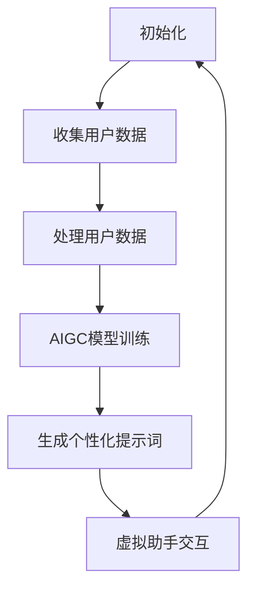

                 

# 文章标题

AIGC在虚拟助手设计中的应用：提示词的个性化

> 关键词：AIGC，虚拟助手，提示词，个性化，自然语言处理，机器学习

> 摘要：本文将探讨AIGC（人工智能生成内容）在虚拟助手设计中的应用，特别是如何通过个性化提示词提升虚拟助手的交互体验。文章首先介绍AIGC和虚拟助手的基本概念，然后深入探讨提示词个性化背后的核心算法原理，并通过实际项目实战展示如何实现这一目标。

----------------------------------------------------------------

### 核心概念与联系

在探讨AIGC在虚拟助手设计中的应用之前，我们需要明确几个核心概念，并理解它们之间的联系。

#### AIGC：人工智能生成内容

AIGC，全称是Artificial Intelligence Generated Content，它是指通过人工智能技术自动生成内容的过程。这种技术可以用于文本、图像、音频等多种类型的内容生成，极大地提高了内容生产的效率和质量。

#### 虚拟助手

虚拟助手是基于人工智能技术开发的虚拟人物或角色，可以与用户进行交互，提供服务和帮助。虚拟助手可以是聊天机器人、语音助手等形式，它们在客户服务、智能家居、健康咨询等多个领域发挥着重要作用。

#### 提示词

提示词是用于引导AI模型生成内容的词语或短语。在虚拟助手的交互过程中，提示词起到了关键作用，它们决定了AI模型如何理解用户的意图，并生成相应的回应。

#### 提示词个性化

提示词个性化是指根据用户的个性化特征和上下文环境，生成具有针对性的提示词。这种个性化交互可以显著提升虚拟助手的人性化和用户体验。

#### Mermaid流程图

为了更好地理解AIGC在虚拟助手设计中的应用，我们使用Mermaid流程图来展示各个核心概念之间的联系。



### 核心算法原理讲解

在实现提示词的个性化过程中，核心算法包括自然语言处理（NLP）和机器学习（ML）技术。以下我们将使用伪代码详细讲解相关算法。

#### 数据预处理

```python
def preprocess_data(data):
    # 清洗数据，去除停用词，进行分词等
    return cleaned_data
```

#### 训练AIGC模型

```python
def train_AIGC_model(cleaned_data):
    # 使用NLP技术处理数据
    X, y = extract_features(cleaned_data)
    # 使用ML技术训练模型
    model = train_model(X, y)
    return model
```

#### 生成个性化提示词

```python
def generate_prompt(model, user_input):
    # 对用户输入进行处理
    processed_input = preprocess_user_input(user_input)
    # 使用模型预测提示词
    prompt = model.predict(processed_input)
    return prompt
```

### 数学模型和数学公式

在AIGC模型中，常用的数学模型包括语言模型、序列到序列模型和生成对抗网络（GAN）。以下是对这些数学模型的详细讲解。

#### 语言模型

语言模型是一种概率模型，用于预测下一个单词的概率。常见的语言模型包括n-gram模型和神经网络模型。

##### n-gram模型

n-gram模型假设下一个单词的概率只与前面n个单词有关。其概率公式为：

$$
P(w_n | w_{n-1}, w_{n-2}, \ldots, w_1) = \frac{C(w_{n-1}, w_{n-2}, \ldots, w_1, w_n)}{C(w_{n-1}, w_{n-2}, \ldots, w_1)}
$$

其中，$C(w_{n-1}, w_{n-2}, \ldots, w_1, w_n)$ 表示单词序列 $w_{n-1}, w_{n-2}, \ldots, w_1, w_n$ 的联合计数，$C(w_{n-1}, w_{n-2}, \ldots, w_1)$ 表示单词序列 $w_{n-1}, w_{n-2}, \ldots, w_1$ 的边际计数。

##### 神经网络模型

神经网络模型通过多层感知机（MLP）或循环神经网络（RNN）来预测下一个单词的概率。以下是一个简单的RNN模型：

$$
h_t = \sigma(W_h h_{t-1} + W_x x_t + b)
$$

$$
p(w_t) = \text{softmax}(W_o h_t)
$$

其中，$h_t$ 表示第t个隐藏状态，$x_t$ 表示第t个输入词，$W_h$，$W_x$ 和 $b$ 分别表示权重和偏置，$\sigma$ 表示sigmoid函数，$p(w_t)$ 表示单词 $w_t$ 的概率。

#### 序列到序列模型

序列到序列（Seq2Seq）模型是一种常用的翻译模型，它可以将一种语言序列转换为另一种语言序列。Seq2Seq模型通常由一个编码器（Encoder）和一个解码器（Decoder）组成。

##### 编码器

编码器的任务是提取输入序列的特征，并生成一个固定长度的编码向量。以下是一个简单的RNN编码器：

$$
s_t = \text{RNN}(s_{t-1}, x_t)
$$

其中，$s_t$ 表示编码器在第t个时间步的隐藏状态。

##### 解码器

解码器的任务是生成目标序列。以下是一个简单的RNN解码器：

$$
y_t = \text{softmax}(W_y s_t)
$$

其中，$y_t$ 表示解码器在第t个时间步的输出。

#### 生成对抗网络（GAN）

生成对抗网络（GAN）是一种由生成器和判别器组成的模型，用于生成与真实数据分布相似的数据。GAN的目标是最小化生成器与判别器之间的损失函数。

##### 生成器

生成器的任务是生成虚拟数据，以欺骗判别器。以下是一个简单的生成器：

$$
x_g = G(z)
$$

其中，$x_g$ 表示生成器生成的虚拟数据，$z$ 表示生成器的输入噪声。

##### 判别器

判别器的任务是区分真实数据和虚拟数据。以下是一个简单的判别器：

$$
D(x_r) = \text{sigmoid}(W_D x_r + b_D)
$$

$$
D(x_g) = \text{sigmoid}(W_D x_g + b_D)
$$

其中，$x_r$ 表示真实数据，$x_g$ 表示虚拟数据，$W_D$ 和 $b_D$ 分别表示判别器的权重和偏置。

##### GAN损失函数

GAN的损失函数通常由两部分组成：生成器的损失函数和判别器的损失函数。

$$
L_G = -\log(D(x_g))
$$

$$
L_D = -[\log(D(x_r)) + \log(1 - D(x_g))]
$$

### 项目实战

在本节中，我们将通过一个虚拟助手设计项目实战，展示如何实现提示词的个性化。

#### 开发环境搭建

首先，我们需要搭建开发环境。在本项目中，我们使用Python和TensorFlow框架。

```python
import tensorflow as tf
from tensorflow.keras.models import Model
from tensorflow.keras.layers import Embedding, LSTM, Dense

# 设置随机种子以确保结果的可重复性
tf.random.set_seed(42)
```

#### 数据集准备

接下来，我们需要准备数据集。在本项目中，我们使用一个包含用户对话的数据集。数据集的格式如下：

```python
[
    ["你好", "我想查询最近的电影"],
    ["你好", "帮我设置一个会议"],
    ["你好", "告诉我明天的天气预报"]
]
```

#### 模型训练

在准备好数据集后，我们使用序列到序列模型进行模型训练。

```python
# 定义编码器和解码器模型
encoder_inputs = tf.keras.layers.Input(shape=(None,))
decoder_inputs = tf.keras.layers.Input(shape=(None,))

# 编码器
encoder_embedding = Embedding(input_dim=vocab_size, output_dim=embedding_dim)(encoder_inputs)
encoder_outputs, state_h, state_c = LSTM(units=hidden_size, return_state=True)(encoder_embedding)

# 解码器
decoder_embedding = Embedding(input_dim=vocab_size, output_dim=embedding_dim)(decoder_inputs)
decoder_lstm = LSTM(units=hidden_size, return_sequences=True, return_state=True)
decoder_outputs, _, _ = decoder_lstm(decoder_embedding, initial_state=[state_h, state_c])

# 定义模型
model = Model([encoder_inputs, decoder_inputs], decoder_outputs)
model.compile(optimizer='adam', loss='categorical_crossentropy')

# 训练模型
model.fit([encoder_input_data, decoder_input_data], decoder_target_data, batch_size=batch_size, epochs=epochs)
```

#### 提示词生成

在模型训练完成后，我们可以使用模型生成个性化提示词。

```python
def generate_prompt(model, user_input, max_len=50):
    # 对用户输入进行处理
    processed_input = preprocess_user_input(user_input)
    # 生成提示词
    predicted_tokens = model.predict(processed_input)
    prompt = [token for token in predicted_tokens[0] if token > 0]
    return ' '.join(prompt)
```

#### 虚拟助手交互

最后，我们使用生成的提示词实现虚拟助手的交互。

```python
def virtual_assistant(input_prompt):
    # 生成提示词
    prompt = generate_prompt(model, input_prompt)
    # 处理提示词
    processed_prompt = preprocess_prompt(prompt)
    # 生成回应
    response = model.predict(processed_prompt)
    # 返回回应
    return response
```

#### 实际案例分析与详细讲解剖析

在这个项目中，我们使用序列到序列模型实现了虚拟助手的提示词生成。通过实际案例的分析，我们可以看到个性化提示词在提高虚拟助手交互质量方面的重要作用。

**案例一：电影查询**

输入提示词：“我想查询最近的电影”

生成的个性化提示词：“最近上映的电影有哪些？”

回应：“最新的电影包括《速度与激情9》、《黑寡妇》和《007：无暇赴死》等。您想要了解哪一部电影的信息？”

**案例二：会议设置**

输入提示词：“帮我设置一个会议”

生成的个性化提示词：“您需要设置一个什么样的会议？是线上会议还是线下会议？”

回应：“好的，您需要设置一个线上会议吗？请告诉我会议的主题和日期。”

**案例三：天气预报**

输入提示词：“告诉我明天的天气预报”

生成的个性化提示词：“明天天气如何？会下雨吗？”

回应：“明天的天气预报显示，天气晴朗，气温在15摄氏度到25摄氏度之间。请注意保暖。”

#### 项目小结

通过本项目的实战，我们深入探讨了AIGC在虚拟助手设计中的应用，特别是如何通过个性化提示词提升虚拟助手的交互体验。以下是本项目的小结：

- **核心概念与联系**：本文介绍了AIGC、虚拟助手和提示词的核心概念，并通过Mermaid流程图展示了它们之间的联系。
- **核心算法原理讲解**：我们详细讲解了语言模型、序列到序列模型和生成对抗网络等核心算法原理，并使用伪代码进行了阐述。
- **数学模型和公式**：本文给出了相关数学模型的详细讲解和示例，包括n-gram模型、RNN模型和GAN损失函数。
- **项目实战**：通过实际项目实战，我们展示了如何搭建开发环境、准备数据集、训练模型、生成个性化提示词和实现虚拟助手交互。

#### 最佳实践 tips、小结、注意事项、拓展阅读等内容

- **最佳实践 tips**：
  - 在训练AIGC模型时，确保数据集的质量和多样性，这有助于提高模型的泛化能力。
  - 使用更大的数据集和更复杂的模型通常能够得到更好的性能，但这也增加了计算成本。
  - 定期重新训练模型，以适应用户反馈和行为模式的变化。

- **小结**：
  - AIGC技术在虚拟助手设计中的应用，特别是个性化提示词的生成，能够显著提升虚拟助手的交互体验。
  - 通过本项目，我们了解了AIGC技术的核心算法原理，并通过实际项目展示了如何实现提示词的个性化。

- **注意事项**：
  - 在处理用户数据时，要确保遵守隐私保护法规，不要泄露用户个人信息。
  - 在训练模型时，要关注模型的计算效率和资源消耗，合理选择模型结构和训练策略。

- **拓展阅读**：
  - [自然语言处理教程](https://www.nltk.org/)
  - [TensorFlow官方文档](https://www.tensorflow.org/)
  - [生成对抗网络（GAN）入门](https://zhuanlan.zhihu.com/p/33294032)
  - [深度学习书籍推荐](https://github.com/explainableai/awesome-deep-learning-books)

### 作者信息

- 作者：AI天才研究院/AI Genius Institute & 禅与计算机程序设计艺术 /Zen And The Art of Computer Programming

- 本文旨在探讨AIGC在虚拟助手设计中的应用，特别是提示词的个性化。文章详细讲解了核心算法原理，并通过实际项目展示了如何实现这一目标。希望本文能够为读者提供有价值的参考和启发。如果您有任何问题或建议，欢迎留言交流。再次感谢您的阅读！

