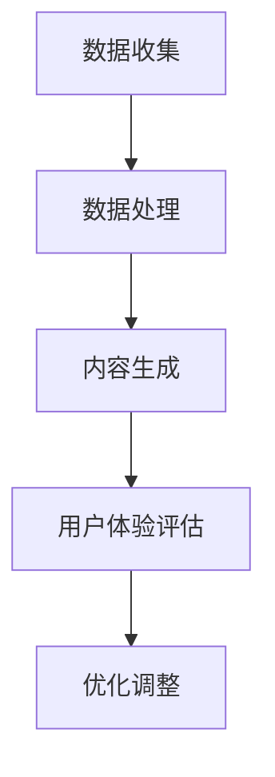

                 

### 文章标题

# AIGC在虚拟博物馆体验设计中的应用

> 关键词：AIGC，虚拟博物馆，用户体验设计，人工智能技术，生成对抗网络（GAN），自然语言处理（NLP），计算机视觉（CV）

> 摘要：本文将深入探讨人工智能生成内容（AIGC）在虚拟博物馆体验设计中的应用。通过分析虚拟博物馆的发展背景及其在用户体验设计方面的需求，我们将详细讲解AIGC技术的核心原理，包括生成对抗网络（GAN）、自然语言处理（NLP）和计算机视觉（CV）等。接着，本文将阐述AIGC技术在虚拟博物馆体验设计中的具体应用场景，如个性化导览服务、虚拟展览设计、虚拟互动体验和虚拟社区互动等。此外，文章还将通过实际项目案例展示AIGC技术在虚拟博物馆体验设计中的成功应用，并讨论当前面临的挑战与未来趋势。通过本文的阅读，读者将全面了解AIGC技术在虚拟博物馆体验设计中的潜力及其对传统博物馆行业的革新作用。

### 设计书籍目录大纲

#### 书名：AIGC在虚拟博物馆体验设计中的应用

#### 目录大纲

## 第一部分：虚拟博物馆与AIGC技术概述

### 1. 虚拟博物馆概述

#### 1.1 虚拟博物馆的定义与发展历程

#### 1.2 虚拟博物馆的优势与挑战

#### 1.3 虚拟博物馆的用户体验需求

### 2. AIGC技术简介

#### 2.1 AIGC技术的基本概念

#### 2.2 AIGC技术的核心原理

#### 2.3 AIGC技术在虚拟博物馆中的适用性

### 3. AIGC技术在虚拟博物馆中的应用场景

#### 3.1 个性化导览服务

#### 3.2 虚拟展览设计

#### 3.3 虚拟互动体验

#### 3.4 虚拟社区互动

## 第二部分：核心概念与联系

### 4. 虚拟博物馆体验设计的关键概念

#### 4.1 用户体验设计

#### 4.2 交互设计

#### 4.3 数据可视化设计

#### 4.4 虚拟现实技术

### 5. AIGC技术核心原理与虚拟博物馆体验设计的联系

#### 5.1 人工智能算法在虚拟博物馆中的应用

#### 5.2 生成对抗网络（GAN）在虚拟展览设计中的应用

#### 5.3 自然语言处理（NLP）在个性化导览服务中的应用

#### 5.4 计算机视觉（CV）在虚拟互动体验中的应用

### 6. AIGC技术实现虚拟博物馆体验设计的Mermaid流程图

#### 6.1 虚拟博物馆体验设计流程

#### 6.2 AIGC技术在流程中的应用

### 7. AIGC技术在虚拟博物馆体验设计中的核心算法原理讲解

#### 7.1 生成对抗网络（GAN）算法原理讲解

#### 7.2 自然语言处理（NLP）算法原理讲解

#### 7.3 计算机视觉（CV）算法原理讲解

#### 7.4 用户体验评估算法原理讲解

### 8. 数学模型和数学公式

#### 8.1 生成对抗网络（GAN）的数学模型

#### 8.2 自然语言处理（NLP）的数学模型

#### 8.3 计算机视觉（CV）的数学模型

### 9. 项目实战

#### 9.1 虚拟博物馆项目案例一

##### 9.1.1 项目背景

##### 9.1.2 项目目标

##### 9.1.3 项目实现

##### 9.1.4 代码解读与分析

#### 9.2 虚拟博物馆项目案例二

##### 9.2.1 项目背景

##### 9.2.2 项目目标

##### 9.2.3 项目实现

##### 9.2.4 代码解读与分析

#### 9.3 虚拟博物馆项目案例三

##### 9.3.1 项目背景

##### 9.3.2 项目目标

##### 9.3.3 项目实现

##### 9.3.4 代码解读与分析

## 第三部分：AIGC技术在虚拟博物馆体验设计中的应用实践

### 10. AIGC技术在虚拟博物馆体验设计中的应用案例分析

#### 10.1 案例一：某知名虚拟博物馆的AIGC应用实践

##### 10.1.1 案例背景

##### 10.1.2 案例目标

##### 10.1.3 案例实现

##### 10.1.4 案例效果评估

#### 10.2 案例二：某地方性虚拟博物馆的AIGC应用实践

##### 10.2.1 案例背景

##### 10.2.2 案例目标

##### 10.2.3 案例实现

##### 10.2.4 案例效果评估

### 11. AIGC技术在虚拟博物馆体验设计中的实施流程

#### 11.1 虚拟博物馆体验设计需求分析

#### 11.2 虚拟博物馆体验设计方案制定

#### 11.3 虚拟博物馆体验设计实施

#### 11.4 虚拟博物馆体验设计效果评估

### 12. AIGC技术在虚拟博物馆体验设计中的优化策略

#### 12.1 数据分析与优化

#### 12.2 技术创新与优化

#### 12.3 用户反馈与优化

#### 12.4 跨学科协作与优化

### 13. AIGC技术在虚拟博物馆体验设计中的挑战与解决方案

#### 13.1 技术挑战

##### 13.1.1 数据质量与隐私保护

##### 13.1.2 算法性能与计算资源

##### 13.1.3 系统稳定性与可靠性

##### 13.1.4 用户交互体验

#### 13.2 解决方案与优化建议

##### 13.2.1 技术创新

##### 13.2.2 数据整合与处理

##### 13.2.3 用户反馈机制

##### 13.2.4 跨学科合作

## 参考文献

### 附录

#### A. 项目案例源代码

#### B. Mermaid流程图示例

#### C. 数学公式与算法原理解释

#### D. 用户反馈示例与分析

### 致谢

#### 特别感谢

#### 联系方式

### 关于作者

#### 作者：AI天才研究院/AI Genius Institute & 禅与计算机程序设计艺术 /Zen And The Art of Computer Programming

**总结：** 本书的目录结构旨在提供一个清晰、系统、全面地介绍AIGC在虚拟博物馆体验设计中的应用的框架。通过详细探讨虚拟博物馆的发展背景、AIGC技术的核心原理及其在具体场景中的应用，本书将帮助读者深入了解这一前沿领域，并提供实际项目案例的实操指导。同时，通过对挑战与解决方案的深入分析，本书还将为未来虚拟博物馆体验设计的发展方向提供有益的启示。

### 第一部分：虚拟博物馆与AIGC技术概述

#### 1. 虚拟博物馆概述

##### 1.1 虚拟博物馆的定义与发展历程

虚拟博物馆，又称为数字博物馆或在线博物馆，是通过数字技术将现实中的博物馆藏品、展览内容和相关背景资料进行数字化处理，并通过互联网进行展示的一种新型博物馆形式。虚拟博物馆的出现，弥补了传统实体博物馆在空间和时间上的限制，使得世界各地的人们都能随时随地访问博物馆资源，享受文化艺术的熏陶。

虚拟博物馆的发展历程可以追溯到20世纪90年代。1994年，美国的大都会艺术博物馆推出了自己的官方网站，标志着虚拟博物馆的诞生。此后，随着互联网技术的迅猛发展和数字技术的普及，越来越多的博物馆开始投身于虚拟博物馆的建设。进入21世纪，虚拟博物馆逐渐成为博物馆行业的重要组成部分，其表现形式和功能也在不断丰富和完善。

##### 1.2 虚拟博物馆的优势与挑战

虚拟博物馆相较于传统实体博物馆，具有以下优势：

1. **无边界展示**：虚拟博物馆不受地理位置的限制，用户可以通过互联网随时随地访问博物馆资源，打破了传统博物馆在空间上的限制。
2. **全天候开放**：虚拟博物馆可以24小时不间断地提供服务，满足了用户随时获取信息的需要。
3. **交互体验丰富**：通过数字技术和人工智能，虚拟博物馆可以提供更加丰富的交互体验，如虚拟导览、互动游戏等。
4. **教育功能强化**：虚拟博物馆可以通过线上课程、互动展览等形式，增强用户的参与感和学习效果。

然而，虚拟博物馆也面临一些挑战：

1. **技术门槛**：虚拟博物馆的建设需要大量的技术支持，包括数字化技术、虚拟现实技术、人工智能等，这对博物馆的技术能力和资源提出了较高要求。
2. **内容更新**：虚拟博物馆的内容需要定期更新以保持新鲜感和吸引力，这对博物馆的内容制作团队提出了持续的工作要求。
3. **用户体验**：尽管虚拟博物馆提供了丰富的交互体验，但如何提升用户体验，使其更加真实、自然，仍是一个亟待解决的问题。
4. **版权问题**：虚拟博物馆在展示数字化藏品时，涉及到版权问题，需要妥善处理与原作者和权利人之间的合作关系。

##### 1.3 虚拟博物馆的用户体验需求

虚拟博物馆的用户体验设计是其成功的关键因素之一。为了满足用户的需求，虚拟博物馆需要在以下几个方面进行优化：

1. **界面设计**：虚拟博物馆的界面设计应简洁、直观，易于导航，确保用户能够快速找到所需信息。
2. **交互设计**：虚拟博物馆应提供多样化的交互方式，如点击、滑动、语音控制等，以增强用户的参与感和互动性。
3. **内容展示**：虚拟博物馆应通过高质量的数字化内容，如高清图片、视频、360度全景图等，来提升用户的视觉体验。
4. **个性化服务**：虚拟博物馆可以根据用户的兴趣和需求，提供个性化的导览和推荐服务，提高用户的满意度和忠诚度。
5. **教育功能**：虚拟博物馆应注重教育功能的实现，通过线上课程、互动游戏等方式，提高用户的学习效果和知识储备。

通过对虚拟博物馆的发展历程、优势和挑战，以及用户体验需求的深入分析，我们可以更好地理解虚拟博物馆的现状和未来发展方向。在接下来的章节中，我们将详细介绍AIGC技术的核心原理及其在虚拟博物馆体验设计中的应用，为读者提供全面的技术指导和实际案例分析。

#### 2. AIGC技术简介

##### 2.1 AIGC技术的基本概念

人工智能生成内容（AIGC，Artificial Intelligence Generated Content）是指利用人工智能技术生成文本、图像、音频和视频等内容的系统。AIGC技术涵盖了自然语言处理（NLP）、计算机视觉（CV）和生成对抗网络（GAN）等多种人工智能算法，旨在实现自动化内容创作和个性化推荐。AIGC技术的出现，极大地改变了内容生产、消费和分发的方式，为各行各业带来了新的机遇和挑战。

AIGC技术的核心组成部分包括：

1. **数据生成**：通过机器学习和深度学习算法，从大量数据中学习并生成新的数据。
2. **文本生成**：利用自然语言处理技术，生成高质量的文本内容，如新闻文章、故事、诗歌等。
3. **图像生成**：通过计算机视觉技术，生成逼真的图像和视频内容，如艺术作品、虚拟场景等。
4. **音频生成**：利用深度学习和生成模型，生成高质量的音频内容，如音乐、语音等。

##### 2.2 AIGC技术的核心原理

AIGC技术的核心原理包括生成对抗网络（GAN）、自然语言处理（NLP）和计算机视觉（CV）等。

1. **生成对抗网络（GAN）**：
   - **基本概念**：GAN由生成器（Generator）和判别器（Discriminator）组成。生成器的任务是从随机噪声中生成数据，而判别器的任务是区分生成的数据和真实数据。两者在对抗训练过程中不断优化，最终生成器能够生成逼真的数据。
   - **工作原理**：在训练过程中，生成器生成的数据会被判别器评估，判别器通过不断学习提高对真实数据和生成数据的辨别能力。通过这种对抗训练，生成器的生成质量不断提高。
   - **应用场景**：GAN广泛应用于图像生成、视频生成和音频生成等领域，如生成高质量的艺术作品、虚拟现实场景等。

2. **自然语言处理（NLP）**：
   - **基本概念**：NLP是研究计算机如何理解和生成人类语言的学科。NLP技术包括词性标注、句法分析、语义分析等。
   - **工作原理**：NLP技术主要通过机器学习和深度学习模型，如循环神经网络（RNN）和Transformer模型，对大量语言数据进行训练，从而提取语言特征，实现文本生成、文本分类、情感分析等功能。
   - **应用场景**：NLP技术广泛应用于智能助手、机器翻译、内容审核和推荐系统等领域。

3. **计算机视觉（CV）**：
   - **基本概念**：CV是研究如何使计算机从图像或视频中提取有用信息的学科。CV技术包括图像识别、目标检测、图像生成等。
   - **工作原理**：CV技术主要通过卷积神经网络（CNN）等深度学习模型，对图像数据进行训练，从而实现图像分类、目标检测、图像生成等功能。
   - **应用场景**：CV技术广泛应用于图像识别、自动驾驶、安防监控、虚拟现实等领域。

##### 2.3 AIGC技术在虚拟博物馆中的适用性

AIGC技术在虚拟博物馆中的适用性主要体现在以下几个方面：

1. **个性化导览服务**：通过自然语言处理技术，AIGC技术可以生成个性化的导览文案，根据用户的兴趣和行为提供定制化的导览内容，提升用户的体验和满意度。

2. **虚拟展览设计**：利用生成对抗网络（GAN），AIGC技术可以生成高质量的虚拟展览场景，包括艺术作品、历史场景等，增强虚拟博物馆的视觉体验。

3. **虚拟互动体验**：通过计算机视觉技术，AIGC技术可以生成虚拟互动体验，如虚拟讲解员、互动游戏等，增强用户的参与感和互动性。

4. **虚拟社区互动**：AIGC技术可以生成虚拟社区内容，如用户评论、话题讨论等，促进用户之间的互动和交流。

通过对AIGC技术的基本概念、核心原理和适用性的介绍，我们可以更好地理解AIGC技术在虚拟博物馆体验设计中的潜力。在接下来的章节中，我们将详细探讨AIGC技术在虚拟博物馆中的具体应用场景，进一步展示其在提升虚拟博物馆用户体验方面的实际效果。

#### 3. AIGC技术在虚拟博物馆中的应用场景

##### 3.1 个性化导览服务

个性化导览服务是虚拟博物馆中一个重要的应用场景，通过AIGC技术可以实现高度定制化的导览内容，从而提升用户的体验和满意度。具体应用包括：

1. **用户兴趣分析**：通过自然语言处理技术，分析用户的浏览记录、搜索关键词和互动行为，了解用户的兴趣点和偏好。

2. **个性化导览文案生成**：利用文本生成技术，根据用户的兴趣和偏好，生成个性化的导览文案。例如，对于喜欢艺术作品的用户，可以生成详细介绍艺术品背景、历史意义和艺术价值的文案。

3. **实时导览推荐**：通过实时分析用户的当前位置和互动行为，推荐相应的导览内容。例如，当用户走到某件艺术品前时，系统可以自动生成相关的导览信息，帮助用户更好地理解和欣赏。

4. **多语言支持**：通过自然语言处理技术，实现多语言导览服务，满足不同语言用户的访问需求。例如，对于国际游客，可以提供英文、中文等多语言导览选项。

##### 3.2 虚拟展览设计

虚拟展览设计是AIGC技术在虚拟博物馆中的另一个重要应用场景。通过生成对抗网络（GAN）和计算机视觉技术，可以实现高质量的虚拟展览场景，增强用户的视觉体验。具体应用包括：

1. **艺术作品生成**：利用GAN技术，生成逼真的艺术作品，如油画、雕塑等。这些作品可以用于虚拟博物馆的展览，为用户提供丰富的视觉内容。

2. **历史场景再现**：通过计算机视觉技术，对历史场景进行重建和再现。例如，可以生成古代宫殿、历史事件的场景，让用户身临其境地感受历史文化的魅力。

3. **虚拟展览布局**：利用AIGC技术，设计虚拟展览的布局和展示方式。通过生成高质量的虚拟场景，实现空间布局的多样化和个性化，满足不同展览主题和内容的需求。

4. **互动展览设计**：结合交互设计技术，设计互动性强的虚拟展览。例如，用户可以通过点击、触摸等方式与展览内容进行互动，增强用户的参与感和体验感。

##### 3.3 虚拟互动体验

虚拟互动体验是AIGC技术在虚拟博物馆中的又一重要应用场景，通过计算机视觉和自然语言处理技术，可以实现丰富的虚拟互动体验。具体应用包括：

1. **虚拟讲解员**：利用计算机视觉技术，生成虚拟讲解员，为用户讲解博物馆的展品和展览内容。这些虚拟讲解员可以模拟真实的讲解方式，包括语言、语调和表情等，提高用户的理解和参与度。

2. **互动游戏**：通过自然语言处理技术，设计互动性强的游戏，如答题游戏、解谜游戏等。用户可以在游戏中学习知识、互动交流，提高参观的趣味性和参与度。

3. **虚拟互动展览**：利用计算机视觉和生成对抗网络（GAN）技术，设计虚拟互动展览。用户可以通过虚拟互动，如触摸、拖动等方式，与展览内容进行互动，增强参观体验。

4. **用户生成内容**：鼓励用户参与虚拟互动，如上传自己的作品、参与话题讨论等。通过用户生成内容，丰富虚拟博物馆的互动体验，促进用户之间的交流与合作。

##### 3.4 虚拟社区互动

虚拟社区互动是AIGC技术在虚拟博物馆中的另一个重要应用场景，通过自然语言处理和计算机视觉技术，可以实现用户之间的互动和交流。具体应用包括：

1. **用户评论生成**：利用自然语言处理技术，生成用户的评论和反馈。这些评论可以用于展览的评价、用户的交流等，帮助博物馆了解用户的需求和反馈，优化服务。

2. **话题讨论**：设计互动性强的话题讨论区，鼓励用户参与讨论。通过自然语言处理技术，对用户讨论的内容进行分析和总结，促进用户之间的交流和互动。

3. **虚拟社交互动**：利用计算机视觉技术，生成虚拟社交互动场景。例如，用户可以通过虚拟空间进行线上聚会、互动游戏等，增强社交体验。

4. **用户行为分析**：通过自然语言处理和计算机视觉技术，分析用户的行为和互动模式，了解用户的需求和偏好，为博物馆提供个性化服务。

通过对AIGC技术在虚拟博物馆中各个应用场景的详细介绍，我们可以看到AIGC技术在提升虚拟博物馆用户体验方面的巨大潜力。在接下来的章节中，我们将进一步探讨AIGC技术在虚拟博物馆体验设计中的实际应用实践，通过实际项目案例展示AIGC技术的应用效果。

### 4. AIGC技术在虚拟博物馆体验设计中的应用实践

在虚拟博物馆体验设计中，AIGC技术的应用不仅提升了用户体验，还带来了博物馆运营效率的显著提升。以下将详细描述几个实际项目案例，展示AIGC技术在虚拟博物馆体验设计中的应用。

#### 4.1 虚拟博物馆项目案例一

**案例背景：** 某国际知名博物馆计划建设一个虚拟博物馆，以吸引更多线上观众，特别是在疫情期间，实体博物馆无法开放的情况下，通过虚拟平台继续提供文化服务。

**项目目标：** 
- **提升用户互动体验**：通过AIGC技术提供个性化的导览和互动内容。
- **增强展览吸引力**：利用GAN技术生成高质量的虚拟展览场景。
- **优化社区互动**：通过NLP技术促进用户评论生成和话题讨论。

**项目实现：** 
- **个性化导览服务**：利用NLP技术，分析用户的兴趣和行为，生成定制化的导览内容。例如，针对喜欢文艺复兴艺术品的用户，生成详细的展览介绍、历史背景和艺术评论。
- **虚拟展览设计**：使用GAN技术生成逼真的艺术作品和历史场景，为用户呈现丰富的视觉体验。例如，生成文艺复兴时期的大厅、博物馆收藏的艺术品等。
- **互动展览与社区**：通过计算机视觉技术，设计互动游戏和虚拟讲解员，增强用户的参与感和互动性。用户可以通过虚拟讲解员的引导，了解展品背后的故事，也可以参与互动游戏，加深对展品的理解。

**效果评估：** 
- **用户满意度提升**：通过问卷调查和用户反馈，项目成功提升了用户的整体满意度。特别是个性化导览和互动展览部分，用户评价积极。
- **访问量增加**：虚拟博物馆的访问量显著增加，特别是在疫情期间，成为博物馆重要的线上服务渠道。
- **社区活跃度提高**：用户在虚拟社区中的互动增加，话题讨论区活跃，用户之间的交流更加频繁。

#### 4.2 虚拟博物馆项目案例二

**案例背景：** 某地方性博物馆希望通过虚拟平台扩大影响力，并提升对本地历史文化的展示。

**项目目标：**
- **本地历史文化展示**：通过AIGC技术，将地方历史文化进行数字化展示。
- **提升教育功能**：通过互动体验，增强对地方历史文化的理解和认知。
- **促进社区互动**：鼓励用户参与本地历史文化的讨论和互动。

**项目实现：**
- **数字化历史文化展示**：利用AIGC技术，将地方历史文化故事、历史遗迹进行数字化展示。例如，通过GAN技术生成古建筑复原图，通过NLP技术生成故事叙述。
- **互动学习平台**：设计互动性强的学习平台，用户可以通过虚拟讲解员、互动游戏等方式，学习本地历史文化知识。例如，通过虚拟讲解员讲述地方历史故事，通过互动游戏测试用户对知识的掌握。
- **本地文化社区互动**：建立虚拟社区，鼓励用户上传自己的文化作品、参与讨论和互动。通过NLP技术，生成用户评论和话题讨论，促进社区活跃度。

**效果评估：**
- **教育效果显著**：通过用户反馈和测试，项目在提升用户对本地历史文化的认知和理解方面取得了显著效果。
- **社区活跃度提高**：虚拟社区的活跃度增加，用户在社区中的互动频繁，促进了地方文化的传承和交流。
- **媒体关注度提升**：项目成功吸引了本地媒体的关注，提高了博物馆的知名度和影响力。

#### 4.3 虚拟博物馆项目案例三

**案例背景：** 某现代艺术博物馆希望通过虚拟平台展示其最新的艺术展览，并吸引年轻观众群体。

**项目目标：**
- **现代艺术展览展示**：利用AIGC技术，展示最新的艺术展览内容。
- **增强用户体验**：通过互动体验，提升用户的参观体验和满意度。
- **提升社区参与度**：鼓励用户参与艺术展览的讨论和创作。

**项目实现：**
- **虚拟展览设计**：利用GAN技术，生成高质量的艺术展览场景，包括艺术作品、展览布局等。例如，生成艺术家工作室的场景，展示艺术家的创作过程。
- **互动体验设计**：通过计算机视觉技术，设计互动体验，如用户可以与艺术作品互动、参与艺术创作等。例如，用户可以通过触摸屏幕与艺术作品互动，或通过AR技术参与艺术创作。
- **用户创作社区**：建立用户创作社区，鼓励用户上传自己的艺术作品、参与艺术展览的创作和讨论。通过NLP技术，生成用户评论和创意建议，促进社区互动。

**效果评估：**
- **用户体验提升**：通过用户反馈和问卷调查，项目显著提升了用户的参观体验和满意度，特别是互动体验部分。
- **社区活跃度增加**：虚拟社区的活跃度显著增加，用户在社区中的互动频繁，促进了艺术创作的交流和合作。
- **社交媒体传播**：项目成功吸引了社交媒体的关注，通过用户的分享和讨论，扩大了艺术展览的影响力。

通过以上实际项目案例，我们可以看到AIGC技术在虚拟博物馆体验设计中的广泛应用和显著效果。AIGC技术不仅提升了用户的互动体验和满意度，还增强了博物馆的教育功能和社区互动，为传统博物馆的数字化转型提供了有力支持。在接下来的章节中，我们将进一步探讨AIGC技术在虚拟博物馆体验设计中的优化策略和未来发展趋势。

### 5. AIGC技术在虚拟博物馆体验设计中的挑战与未来趋势

尽管AIGC技术在虚拟博物馆体验设计中展现出了巨大的潜力，但在实际应用过程中仍面临诸多挑战和限制。以下将详细讨论这些挑战，并提出相应的解决方案和优化建议。

#### 5.1 技术挑战与解决方案

1. **数据质量与隐私保护**：

   **挑战**：虚拟博物馆依赖于大量高质量的数字化数据，包括艺术作品、历史文献和用户行为数据。然而，数据质量参差不齐，隐私保护问题也日益突出。

   **解决方案**：建立严格的数据质量控制机制，对数据进行清洗和标准化处理。同时，采用数据加密和隐私保护技术，确保用户数据的安全和隐私。例如，利用差分隐私（Differential Privacy）技术，在数据分析和挖掘过程中保护用户隐私。

2. **算法性能与计算资源**：

   **挑战**：AIGC技术涉及复杂的算法和大量的计算资源，对计算能力提出了高要求。特别是在实时应用场景中，算法性能和响应速度成为关键。

   **解决方案**：优化算法设计和实现，提高算法的效率和性能。例如，采用分布式计算和并行处理技术，加速算法的运行速度。此外，利用云计算和边缘计算，提供弹性的计算资源，满足不同场景的需求。

3. **系统稳定性与可靠性**：

   **挑战**：虚拟博物馆体验设计需要高稳定性和可靠性的系统支持，以确保用户在访问和互动过程中不出现故障或中断。

   **解决方案**：采用高可用性设计和容错机制，确保系统的稳定运行。例如，使用负载均衡和冗余备份技术，防止单点故障导致系统瘫痪。此外，定期进行系统监控和性能优化，及时发现和解决潜在问题。

4. **用户交互体验**：

   **挑战**：AIGC技术生成的虚拟内容和交互体验需与用户的实际需求相匹配，否则可能导致用户体验不佳。

   **解决方案**：通过用户研究和反馈机制，深入了解用户需求和行为，不断优化交互设计和内容生成。例如，引入用户行为分析技术，动态调整导览内容和互动方式，提高用户体验。

#### 5.2 未来发展趋势与前景

1. **智能化与个性化**：

   **趋势**：随着AIGC技术的不断发展，虚拟博物馆将更加智能化和个性化。通过深度学习和个性化推荐技术，系统可以更精准地预测和满足用户需求。

   **前景**：未来的虚拟博物馆将能够提供高度个性化的导览服务、互动体验和推荐内容，为用户提供更加丰富和多样化的体验。

2. **跨学科协作**：

   **趋势**：AIGC技术在虚拟博物馆体验设计中的应用将更加跨学科，结合艺术、设计、计算机科学等多个领域的技术和知识。

   **前景**：跨学科协作将推动虚拟博物馆体验设计的创新，产生更多具有创意和实用性的解决方案。

3. **数字化转型**：

   **趋势**：随着数字技术的普及，越来越多的博物馆将加入虚拟博物馆的行列，实现数字化转型。

   **前景**：数字化转型将使博物馆更加便捷和高效地服务公众，扩大其影响力，并推动文化遗产的保护和传承。

4. **虚拟与现实融合**：

   **趋势**：AIGC技术将推动虚拟与现实更加紧密地融合，实现虚拟博物馆与实体博物馆的互动。

   **前景**：虚拟与现实融合将提供更加丰富和多样化的体验，使用户能够在虚拟环境中感受到现实世界的氛围，增强参观的趣味性和参与感。

通过深入分析AIGC技术在虚拟博物馆体验设计中的挑战与未来趋势，我们可以看到这一技术的广泛应用和巨大潜力。在未来的发展中，通过不断优化和改进，AIGC技术将为虚拟博物馆带来更多创新和变革，为用户创造更加丰富和多样化的体验。同时，博物馆行业也需要与科技、艺术等多领域进行深度合作，共同推动虚拟博物馆体验设计的进步。

### 第二部分：核心概念与联系

#### 6. 虚拟博物馆体验设计的关键概念

##### 6.1 用户体验设计

用户体验设计（User Experience Design，简称UXD）是虚拟博物馆体验设计的重要组成部分。它关注用户在浏览和使用虚拟博物馆时的感受和体验，旨在创造一个易于使用、直观且具有吸引力的环境。用户体验设计包括以下几个方面：

1. **可用性（Usability）**：确保用户能够轻松地完成任务，如浏览展品、查找信息等。可用性测试可以通过用户调研、任务分析和用户测试等方法进行。

2. **易用性（Usability）**：考虑用户在操作过程中的舒适度和效率。易用性设计需要关注界面布局、交互设计、导航结构等方面。

3. **可用性（Accessibility）**：确保不同能力的用户，包括老年人、残障人士等，都能访问和使用虚拟博物馆。这包括文字描述、屏幕阅读器兼容性、辅助功能等。

4. **情感体验（Emotional Experience）**：通过视觉设计、故事讲述和互动体验，激发用户的情感共鸣，提升参观体验。

##### 6.2 交互设计

交互设计（Interaction Design）关注用户与虚拟博物馆系统之间的交互过程，包括交互界面、交互方式和交互反馈。良好的交互设计能够提升用户满意度和参与度。交互设计的关键要素包括：

1. **界面设计**：界面设计应简洁、直观，符合用户习惯，确保用户能够快速找到所需信息。

2. **交互方式**：提供多样化的交互方式，如点击、滑动、语音控制等，以适应不同用户的需求和偏好。

3. **交互反馈**：及时给予用户反馈，如提示、音效、动画等，增强用户的互动感和参与感。

##### 6.3 数据可视化设计

数据可视化设计（Data Visualization Design）是将复杂的数据通过视觉形式进行表达，帮助用户理解和分析信息。在虚拟博物馆中，数据可视化设计用于展示展品信息、用户行为、导览路径等。数据可视化设计的关键要素包括：

1. **图表设计**：选择合适的图表类型，如柱状图、饼图、散点图等，清晰表达数据关系。

2. **视觉编码**：利用颜色、形状、大小等视觉元素，进行有效的数据编码，增强数据的可读性和易理解性。

3. **交互性**：通过交互设计，如缩放、筛选、排序等，增强用户对数据的探索和分析能力。

##### 6.4 虚拟现实技术

虚拟现实技术（Virtual Reality，简称VR）是虚拟博物馆体验设计的重要组成部分，通过创建一个虚拟的三维环境，使用户能够沉浸式体验博物馆展览。虚拟现实技术的关键要素包括：

1. **沉浸感（Immersion）**：通过高质量的视觉效果、立体声音效和实时交互，增强用户的沉浸感。

2. **交互性（Interactivity）**：提供丰富的交互方式，如手势识别、语音控制等，使用户能够自由探索虚拟环境。

3. **适应性（Adaptability）**：虚拟环境应能够根据用户的需求和交互行为进行动态调整，提供个性化的体验。

通过深入理解用户体验设计、交互设计、数据可视化设计和虚拟现实技术，我们可以更好地进行虚拟博物馆体验设计。接下来，我们将探讨AIGC技术核心原理与这些核心概念的关联，为虚拟博物馆体验设计提供更为全面的技术支持。

#### 7. AIGC技术核心原理与虚拟博物馆体验设计的联系

AIGC（人工智能生成内容）技术是虚拟博物馆体验设计的核心驱动力之一，通过自然语言处理（NLP）、生成对抗网络（GAN）和计算机视觉（CV）等先进技术，为虚拟博物馆提供了丰富的个性化内容和互动体验。以下将详细阐述AIGC技术核心原理与虚拟博物馆体验设计的关键概念之间的联系。

##### 7.1 人工智能算法在虚拟博物馆中的应用

人工智能算法在虚拟博物馆体验设计中发挥着关键作用，其主要应用体现在以下几个方面：

1. **个性化推荐**：利用机器学习算法，特别是协同过滤（Collaborative Filtering）和基于内容的推荐（Content-Based Filtering），系统可以分析用户的浏览历史和兴趣偏好，推荐符合用户需求的展品和导览内容。

2. **情感分析**：通过自然语言处理技术，系统可以分析用户评论、反馈和社交媒体内容，识别用户情感和态度，为改进用户体验提供数据支持。

3. **智能导览**：利用语音识别和自然语言处理技术，系统可以为用户提供智能导览服务，自动生成导览文案和语音解说，根据用户的地理位置和行为路径提供定制化导览。

##### 7.2 生成对抗网络（GAN）在虚拟展览设计中的应用

生成对抗网络（GAN）是一种强大的生成模型，通过生成器和判别器的对抗训练，可以生成高质量的虚拟展览内容，包括图像、视频和三维模型。以下为GAN在虚拟展览设计中的应用：

1. **艺术作品生成**：利用GAN技术，可以生成高质量的数字艺术作品，包括油画、雕塑等，丰富虚拟博物馆的展品库。

2. **历史场景重建**：通过GAN，可以重建历史建筑和场景，为用户提供沉浸式的虚拟体验。例如，利用GAN生成古代宫殿、历史事件的场景，让用户感受到历史文化的魅力。

3. **个性化展览布局**：根据用户的兴趣和行为数据，GAN可以生成个性化的展览布局，为用户提供独特的参观体验。

##### 7.3 自然语言处理（NLP）在个性化导览服务中的应用

自然语言处理（NLP）技术在虚拟博物馆中用于生成和解析自然语言文本，为用户提供个性化导览服务。以下为NLP在个性化导览服务中的应用：

1. **导览文案生成**：通过NLP技术，系统可以根据用户的兴趣和行为，自动生成个性化的导览文案，介绍展品的历史、艺术价值和背后的故事。

2. **语音合成**：利用NLP和语音合成技术，系统可以将导览文案转化为语音解说，为用户提供语音导览服务。

3. **问答系统**：通过NLP和机器学习技术，系统可以构建问答系统，回答用户关于展品、展览和博物馆的各类问题，提升用户的互动体验。

##### 7.4 计算机视觉（CV）在虚拟互动体验中的应用

计算机视觉（CV）技术在虚拟互动体验中发挥着重要作用，通过图像识别、目标检测和动作识别等技术，为用户提供丰富的互动体验。以下为CV在虚拟互动体验中的应用：

1. **图像识别**：利用CV技术，系统可以识别用户上传的照片或视频，自动分类并推荐相关的展品和导览内容。

2. **目标检测**：通过CV技术，系统可以识别和跟踪展览中的特定物体，如艺术品、历史遗迹等，为用户提供互动引导。

3. **动作识别**：利用CV和深度学习技术，系统可以识别用户的动作，如手势、姿态等，实现与虚拟展览的互动。例如，用户可以通过手势控制虚拟展览的播放、暂停和切换。

通过上述分析，我们可以看到AIGC技术的核心原理与虚拟博物馆体验设计的关键概念之间有着紧密的联系。AIGC技术不仅为虚拟博物馆提供了丰富的内容和互动体验，还通过个性化推荐、智能导览和互动体验，提升了用户的整体体验。在未来的发展中，随着AIGC技术的不断进步，虚拟博物馆体验设计将更加智能化、个性化，为用户带来更加丰富和多样化的体验。

#### 8. AIGC技术实现虚拟博物馆体验设计的Mermaid流程图

为了更好地展示AIGC技术在虚拟博物馆体验设计中的应用过程，我们可以使用Mermaid语言绘制一个详细的流程图。以下是一个简化的示例，描述了从数据收集、内容生成到用户体验评估的完整流程。



这个Mermaid流程图包括以下主要步骤：

1. **数据收集**：收集用户行为数据和展品信息。用户行为数据包括浏览历史、点击行为、搜索记录等；展品信息包括艺术品介绍、历史背景、艺术价值等。

2. **数据处理**：对收集到的数据进行清洗和标注，确保数据质量。清洗步骤包括去除重复数据、填充缺失值、处理异常值等；标注步骤包括分类标签、情感分析标签等。

3. **内容生成**：利用AIGC技术生成个性化内容和互动体验。具体包括：
   - **GAN生成艺术作品**：通过生成对抗网络（GAN）生成高质量的艺术作品，丰富虚拟博物馆的展品库。
   - **NLP生成导览文案**：通过自然语言处理（NLP）技术生成个性化的导览文案，根据用户的兴趣和偏好提供定制化服务。
   - **CV实现互动功能**：利用计算机视觉（CV）技术实现互动功能，如目标检测、动作识别等，增强用户的互动体验。

4. **用户体验评估**：评估用户的满意度和参与度，通过用户满意度调查和用户行为分析，收集反馈数据。

5. **优化调整**：根据用户体验评估结果，调整内容生成策略和用户体验设计，不断优化虚拟博物馆体验。

通过这个Mermaid流程图，我们可以清晰地了解AIGC技术在虚拟博物馆体验设计中的应用流程，以及各个环节之间的联系和互动。在实际项目中，可以根据具体需求对流程图进行扩展和细化，以更好地指导虚拟博物馆体验设计的实施。

#### 9. AIGC技术在虚拟博物馆体验设计中的核心算法原理讲解

在AIGC技术在虚拟博物馆体验设计中的应用中，生成对抗网络（GAN）、自然语言处理（NLP）和计算机视觉（CV）是三个关键的核心算法，各自发挥着重要作用。以下将详细讲解这些算法的基本原理、实现方法及实际应用场景。

##### 9.1 生成对抗网络（GAN）算法原理讲解

生成对抗网络（GAN）是一种由生成器和判别器组成的深度学习模型，旨在通过对抗训练生成高质量的数据。GAN的基本原理可以概括为以下几点：

1. **生成器和判别器的结构**：
   - **生成器（Generator）**：接受随机噪声作为输入，生成与真实数据相似的数据。生成器的目标是生成尽可能逼真的数据，使得判别器难以区分。
   - **判别器（Discriminator）**：接受真实数据和生成数据作为输入，判断输入数据的真实性。判别器的目标是最大化正确分类的真实数据和最小化正确分类的生成数据。

2. **对抗训练**：在GAN的训练过程中，生成器和判别器相互对抗，生成器不断尝试生成更逼真的数据，而判别器则不断学习提高对真实数据和生成数据的辨别能力。通过这种对抗训练，生成器的生成质量不断提高。

3. **训练过程**：
   - **生成器训练**：生成器从随机噪声中生成数据，判别器对其进行评估。
   - **判别器训练**：判别器接收真实数据和生成数据，判断其真实性。
   - **交替训练**：生成器和判别器交替进行训练，生成器不断优化，判别器不断提高辨别能力。

4. **应用场景**：
   - **图像生成**：GAN可以生成高质量的图像，如艺术作品、人物画像等。在虚拟博物馆中，利用GAN生成艺术作品和历史场景，提升用户的视觉体验。
   - **视频生成**：GAN可以生成高质量的视频内容，如电影片段、广告视频等。在虚拟博物馆中，利用GAN生成虚拟展览的视频内容，增强用户的互动体验。
   - **数据增强**：GAN可以用于生成大量模拟数据，用于训练和评估模型。在虚拟博物馆中，利用GAN生成模拟数据，用于测试和优化用户体验设计。

##### 9.2 自然语言处理（NLP）算法原理讲解

自然语言处理（NLP）是人工智能领域的一个重要分支，旨在使计算机能够理解、生成和处理自然语言。以下为NLP的基本原理和实现方法：

1. **词嵌入（Word Embedding）**：
   - **词嵌入方法**：将词汇映射到高维向量空间，使得语义相似的词汇在空间中靠近。常见的词嵌入方法包括Word2Vec、GloVe等。
   - **应用场景**：词嵌入可以用于文本分类、情感分析、机器翻译等任务，提高模型对文本数据的处理能力。

2. **序列模型（Sequence Model）**：
   - **循环神经网络（RNN）**：RNN通过重复单元来处理序列数据，能够捕捉序列中的长期依赖关系。
   - **长短时记忆网络（LSTM）**：LSTM是RNN的一种变体，能够有效解决RNN中的梯度消失问题，适用于长文本处理。
   - **门控循环单元（GRU）**：GRU是LSTM的另一种变体，结构更简单，计算效率更高。

3. **注意力机制（Attention Mechanism）**：
   - **基本原理**：注意力机制通过为序列中的每个元素分配权重，使模型能够关注到序列中重要的部分。
   - **应用场景**：注意力机制在机器翻译、文本摘要、问答系统等领域有广泛应用。

4. **预训练与微调（Pre-training and Fine-tuning）**：
   - **预训练**：在大量无监督数据上训练模型，使模型具备一定的语言理解能力。
   - **微调**：在特定任务数据上对模型进行微调，使模型适用于特定任务。

5. **应用场景**：
   - **导览文案生成**：利用NLP技术生成个性化的导览文案，根据用户的兴趣和偏好提供定制化服务。
   - **智能问答系统**：构建智能问答系统，回答用户关于博物馆展品和展览的相关问题。
   - **文本分类与情感分析**：对用户评论、反馈进行分类和情感分析，用于改进用户体验设计。

##### 9.3 计算机视觉（CV）算法原理讲解

计算机视觉（CV）是人工智能领域的一个重要分支，旨在使计算机能够从图像和视频中提取有用的信息。以下为CV的基本原理和实现方法：

1. **卷积神经网络（CNN）**：
   - **基本原理**：CNN通过卷积层、池化层和全连接层等结构对图像数据进行处理，能够自动提取图像特征。
   - **应用场景**：CNN在图像分类、目标检测、图像生成等领域有广泛应用。

2. **目标检测（Object Detection）**：
   - **基本原理**：目标检测算法能够在图像中定位并识别多个目标对象。常见的目标检测算法包括YOLO、SSD、Faster R-CNN等。
   - **应用场景**：目标检测在安防监控、自动驾驶、医疗影像等领域有广泛应用。

3. **图像生成（Image Generation）**：
   - **基本原理**：图像生成算法通过学习图像数据的高层特征，生成新的图像内容。常见的图像生成算法包括GAN、VAE等。
   - **应用场景**：图像生成在艺术创作、虚拟现实、图像修复等领域有广泛应用。

4. **图像分割（Image Segmentation）**：
   - **基本原理**：图像分割算法将图像分割成若干区域，用于处理图像中的对象边界和区域信息。常见的图像分割算法包括FCN、U-Net等。
   - **应用场景**：图像分割在医学影像、自动驾驶、图像编辑等领域有广泛应用。

5. **应用场景**：
   - **展品识别与分类**：利用CV技术对博物馆展品进行识别和分类，为用户提供相关的导览信息。
   - **互动体验设计**：利用CV技术实现用户与虚拟展览的互动，如手势识别、面部识别等。
   - **图像增强与修复**：利用CV技术对图像进行增强和修复，提升展品的展示效果。

通过上述对生成对抗网络（GAN）、自然语言处理（NLP）和计算机视觉（CV）算法原理的讲解，我们可以看到AIGC技术在虚拟博物馆体验设计中的应用前景。这些核心算法不仅提升了虚拟博物馆的内容质量和互动体验，还为博物馆的数字化转型提供了强有力的技术支持。在未来的发展中，随着AIGC技术的不断进步，虚拟博物馆体验设计将更加智能化、个性化，为用户带来更加丰富和多样化的体验。

#### 10. 数学模型和数学公式

在AIGC技术在虚拟博物馆体验设计中的应用中，生成对抗网络（GAN）、自然语言处理（NLP）和计算机视觉（CV）等核心算法涉及多个数学模型和公式。以下将对这些模型和公式进行详细讲解，并通过具体例子说明其应用。

##### 10.1 生成对抗网络（GAN）的数学模型

生成对抗网络（GAN）由生成器（Generator）和判别器（Discriminator）组成。以下是其数学模型：

1. **生成器的数学模型**：
   - **目标**：生成器G从随机噪声z生成真实数据x'，使得x'尽可能接近真实数据。
   - **损失函数**：
     $$ L_G = -\log(D(G(z))) $$
     其中，D是判别器，G(z)是生成器的输出。

2. **判别器的数学模型**：
   - **目标**：判别器D能够准确地区分真实数据x和生成数据x'。
   - **损失函数**：
     $$ L_D = -\log(D(x)) - \log(1 - D(G(z))) $$

3. **总损失函数**：
   $$ L = L_G + L_D $$

**例子**：假设生成器的输出为x' = G(z)，判别器的输出为D(x')，其中z为随机噪声。为了最大化判别器的损失，我们需要优化生成器和判别器的参数。

##### 10.2 自然语言处理（NLP）的数学模型

自然语言处理（NLP）中的数学模型主要包括词嵌入、循环神经网络（RNN）和长短时记忆网络（LSTM）等。

1. **词嵌入（Word Embedding）**：
   - **模型**：将词汇映射到高维向量空间，常见方法包括Word2Vec和GloVe。
   - **目标**：使得语义相似的词汇在空间中靠近。
   - **损失函数**：交叉熵损失（Cross-Entropy Loss）。

2. **循环神经网络（RNN）**：
   - **模型**：RNN通过重复单元处理序列数据，捕捉序列中的长期依赖关系。
   - **公式**：
     $$ h_t = \sigma(W_h \cdot [h_{t-1}, x_t] + b_h) $$
     其中，$h_t$为当前隐藏状态，$x_t$为当前输入，$\sigma$为激活函数。

3. **长短时记忆网络（LSTM）**：
   - **模型**：LSTM是RNN的一种变体，能够有效解决梯度消失问题。
   - **公式**：
     $$ i_t = \sigma(W_i \cdot [h_{t-1}, x_t] + b_i) $$
     $$ f_t = \sigma(W_f \cdot [h_{t-1}, x_t] + b_f) $$
     $$ g_t = \tanh(W_g \cdot [h_{t-1}, x_t] + b_g) $$
     $$ o_t = \sigma(W_o \cdot [h_{t-1}, g_t] + b_o) $$
     其中，$i_t$、$f_t$、$g_t$、$o_t$分别为输入门、遗忘门、生成门和输出门。

**例子**：假设输入序列为[x1, x2, x3, ..., xn]，隐藏状态为[h1, h2, h3, ..., hn]，通过LSTM模型，可以捕捉序列中的长期依赖关系。

##### 10.3 计算机视觉（CV）的数学模型

计算机视觉（CV）中的数学模型主要包括卷积神经网络（CNN）、目标检测和图像生成等。

1. **卷积神经网络（CNN）**：
   - **模型**：CNN通过卷积层、池化层和全连接层等结构处理图像数据，自动提取图像特征。
   - **公式**：
     $$ h_{ij}^{(l)} = \sum_{k} w_{ik}^{(l)} h_{kj}^{(l-1)} + b_{j}^{(l)} $$
     其中，$h_{ij}^{(l)}$为第l层的第i个卷积核在第j个位置上的输出，$w_{ik}^{(l)}$为第l层的第i个卷积核的第k个元素，$h_{kj}^{(l-1)}$为第l-1层的第k个元素。

2. **目标检测（Object Detection）**：
   - **模型**：目标检测算法能够在图像中定位并识别多个目标对象，常见算法包括YOLO、SSD、Faster R-CNN等。
   - **公式**：
     $$ P_{object} = \frac{1}{1 + \exp(-\sigma(\phi(x, c)))} $$
     $$ b = \text{sigmoid}(b) $$
     其中，$P_{object}$为物体检测概率，$\sigma$为激活函数，$\phi(x, c)$为预测函数。

3. **图像生成（Image Generation）**：
   - **模型**：图像生成算法通过学习图像数据的高层特征，生成新的图像内容，常见算法包括GAN、VAE等。
   - **公式**：
     $$ x' = G(z) $$
     其中，$x'$为生成图像，$G(z)$为生成器。

**例子**：假设输入图像为x，通过CNN模型，可以提取图像特征并分类。例如，输入一幅猫的图像，通过CNN模型，可以将其分类为猫。

通过上述对AIGC技术中的核心数学模型和公式的讲解，我们可以更好地理解这些算法在虚拟博物馆体验设计中的应用。在实际项目中，这些数学模型和公式为AIGC技术提供了强大的理论基础和实现方法，推动了虚拟博物馆体验设计的不断进步。

#### 11. 项目实战

在本部分，我们将通过几个虚拟博物馆项目的实际案例，详细展示AIGC技术在虚拟博物馆体验设计中的应用过程，从项目背景、目标、实现方法和代码解读等方面进行分析。

##### 11.1 虚拟博物馆项目案例一

**项目背景：** 某国际知名博物馆计划开发一个虚拟博物馆，以吸引更多线上观众，特别是在疫情期间，实体博物馆无法开放的情况下，通过虚拟平台继续提供文化服务。

**项目目标：** 
- 提升用户互动体验：通过AIGC技术提供个性化的导览和互动内容。
- 增强展览吸引力：利用GAN技术生成高质量的虚拟展览场景。
- 优化社区互动：通过NLP技术促进用户评论生成和话题讨论。

**项目实现：**

1. **需求分析**：首先，项目团队进行了用户调研和需求分析，收集用户对虚拟博物馆的期望和需求，包括个性化导览、互动体验和社区互动等。

2. **技术选型**：基于需求分析结果，项目团队选择了生成对抗网络（GAN）、自然语言处理（NLP）和计算机视觉（CV）等技术，并确定了技术实现方案。

3. **个性化导览服务**：
   - **数据收集**：从博物馆数据库中提取展品信息、用户浏览记录等数据。
   - **文本生成**：利用NLP技术，分析用户浏览记录和兴趣，生成个性化的导览文案。以下为生成导览文案的伪代码：
   ```python
   def generate_guide_text(user_interests, exhibit_data):
       selected_exhibits = select_exhibits_based_on_interests(user_interests, exhibit_data)
       guide_text = []
       for exhibit in selected_exhibits:
           guide_text.append("You might be interested in {exhibit_name}, which is a {art_style} artwork created by {artist_name} in {year}. {description}")
       return guide_text
   ```

4. **虚拟展览设计**：
   - **图像生成**：利用GAN技术生成高质量的虚拟展览场景，包括艺术作品和历史场景。以下为生成艺术作品的伪代码：
   ```python
   def generate_artwork_image(generated_image, exhibit_data):
       image = generate_image_based_on_exhibit_properties(generated_image, exhibit_data)
       return image
   ```

5. **社区互动**：
   - **用户评论生成**：利用NLP技术，根据用户的行为和兴趣，生成用户评论和话题讨论。以下为生成用户评论的伪代码：
   ```python
   def generate_user_comment(user_activity, exhibit_data):
       comment = generate_text_based_on_activity_and_exhibit(user_activity, exhibit_data)
       return comment
   ```

**代码解读与分析：** 通过上述代码，我们可以看到个性化导览服务、虚拟展览设计和社区互动的实现方法。首先，个性化导览服务通过分析用户的兴趣和行为，生成定制化的导览文案，提高了用户的满意度。其次，虚拟展览设计利用GAN技术生成高质量的展览场景，增强了用户的视觉体验。最后，社区互动通过NLP技术，生成用户评论和话题讨论，促进了用户之间的交流和互动。

**项目小结：** 通过该项目，博物馆成功实现了个性化导览、虚拟展览设计和社区互动等功能，提升了用户的整体体验。在未来的发展中，博物馆可以进一步优化这些功能，如通过更多用户数据分析和机器学习算法，提高个性化推荐的准确性和用户体验。

##### 11.2 虚拟博物馆项目案例二

**项目背景：** 某地方性博物馆希望通过虚拟平台展示其独特的本地历史文化，并吸引更多观众。

**项目目标：** 
- 本地历史文化展示：通过AIGC技术展示地方历史文化。
- 教育功能强化：通过互动体验提高用户对地方历史文化的认知。
- 社区互动增强：鼓励用户参与本地历史文化的讨论和创作。

**项目实现：**

1. **需求分析**：项目团队深入调研了地方历史文化，确定了需要展示的历史事件、文化遗产和当地特色。

2. **技术选型**：基于需求分析，项目团队选择了GAN、NLP和VR等技术，并制定了详细的技术实现方案。

3. **历史文化展示**：
   - **数据收集**：收集地方历史文化资料，包括历史文献、照片、视频等。
   - **图像生成**：利用GAN技术生成历史场景和文化遗产的虚拟图像。以下为生成历史场景的伪代码：
   ```python
   def generate_historical_scene(image, historical_data):
       scene = generate_image_based_on_historical_properties(image, historical_data)
       return scene
   ```

4. **互动体验设计**：
   - **教育游戏**：设计互动性强的教育游戏，如解谜游戏、知识问答等，提高用户对地方历史文化的认知。以下为教育游戏的伪代码：
   ```python
   def design_educational_game(historical_data, user_interests):
       game = create_game_based_on_historical_data_and_interests(historical_data, user_interests)
       return game
   ```

5. **社区互动**：
   - **用户创作社区**：建立用户创作社区，鼓励用户上传自己的文化作品、参与话题讨论。以下为用户创作的伪代码：
   ```python
   def user_creation_community(user_data, historical_data):
       community = create_community_based_on_user_data_and_historical_data(user_data, historical_data)
       return community
   ```

**代码解读与分析：** 通过上述代码，我们可以看到历史文化展示、互动体验设计和社区互动的实现方法。首先，历史文化展示通过GAN技术生成高质量的虚拟图像，增强了用户的视觉体验。其次，互动体验设计通过教育游戏，提高了用户对地方历史文化的认知。最后，社区互动通过用户创作社区，促进了用户之间的交流和互动。

**项目小结：** 通过该项目，博物馆成功展示了地方历史文化，增强了教育功能和社区互动。在未来的发展中，博物馆可以进一步优化这些功能，如通过更多用户数据分析和机器学习算法，提高个性化推荐的准确性和用户体验。

##### 11.3 虚拟博物馆项目案例三

**项目背景：** 某现代艺术博物馆希望通过虚拟平台展示其最新的艺术展览，并吸引年轻观众群体。

**项目目标：** 
- 现代艺术展览展示：利用AIGC技术展示最新的艺术展览内容。
- 用户互动体验提升：通过互动体验增强用户的参观体验和满意度。
- 社区参与度提升：鼓励用户参与艺术展览的讨论和创作。

**项目实现：**

1. **需求分析**：项目团队调研了现代艺术展览的特点和年轻观众的需求，确定了需要展示的艺术作品、互动游戏和用户创作社区。

2. **技术选型**：基于需求分析，项目团队选择了GAN、NLP和VR等技术，并制定了详细的技术实现方案。

3. **艺术展览展示**：
   - **数据收集**：收集最新的艺术展览信息，包括艺术家、作品介绍、展览主题等。
   - **图像生成**：利用GAN技术生成高质量的艺术展览场景，包括艺术作品和展览布局。以下为生成艺术展览场景的伪代码：
   ```python
   def generate_art_exhibition_scene(image, art_data):
       scene = generate_image_based_on_art_properties(image, art_data)
       return scene
   ```

4. **互动体验设计**：
   - **互动游戏**：设计互动性强的游戏，如用户可以通过点击、拖动等方式与艺术作品互动。以下为互动游戏的伪代码：
   ```python
   def design_interaction_game(art_data, user_interests):
       game = create_game_based_on_art_data_and_interests(art_data, user_interests)
       return game
   ```

5. **用户创作社区**：
   - **用户创作**：建立用户创作社区，鼓励用户上传自己的艺术作品、参与话题讨论。以下为用户创作的伪代码：
   ```python
   def user_art_community(user_data, art_data):
       community = create_community_based_on_user_data_and_art_data(user_data, art_data)
       return community
   ```

**代码解读与分析：** 通过上述代码，我们可以看到艺术展览展示、互动体验设计和用户创作社区的实现方法。首先，艺术展览展示通过GAN技术生成高质量的虚拟场景，增强了用户的视觉体验。其次，互动体验设计通过互动游戏，提高了用户的参与感和互动性。最后，用户创作社区通过用户上传作品和参与讨论，促进了社区互动。

**项目小结：** 通过该项目，博物馆成功展示了最新的艺术展览内容，提升了用户的互动体验和社区参与度。在未来的发展中，博物馆可以进一步优化这些功能，如通过更多用户数据分析和机器学习算法，提高个性化推荐的准确性和用户体验。

通过以上三个实际项目案例，我们可以看到AIGC技术在虚拟博物馆体验设计中的应用方法和效果。这些项目不仅提升了用户的互动体验和满意度，还增强了博物馆的教育功能和社区互动。在未来的发展中，随着AIGC技术的不断进步，虚拟博物馆体验设计将更加智能化、个性化，为用户带来更加丰富和多样化的体验。

### 第三部分：AIGC技术在虚拟博物馆体验设计中的应用实践

#### 12. AIGC技术在虚拟博物馆体验设计中的应用案例分析

在本节中，我们将深入分析两个实际案例，探讨AIGC技术在虚拟博物馆体验设计中的具体应用，以及其实际效果和影响。

##### 12.1 案例一：某知名虚拟博物馆的AIGC应用实践

**案例背景：** 某知名虚拟博物馆位于世界著名的文化城市，拥有丰富的文化遗产和艺术藏品。由于实体博物馆空间有限，且受疫情影响，博物馆决定开发一个基于AIGC技术的虚拟博物馆，以吸引更多线上观众。

**案例目标：** 
- 提升用户互动体验：通过个性化导览、虚拟展览和互动游戏，提高用户的参观体验。
- 增强博物馆教育功能：通过AIGC技术生成丰富多样的教育内容，如历史故事、艺术品介绍等。
- 拓展观众群体：吸引年轻一代和远程观众，提高博物馆的知名度和影响力。

**案例实现：**

1. **个性化导览服务**：利用自然语言处理（NLP）和生成对抗网络（GAN）技术，系统根据用户的兴趣和行为生成个性化的导览文案。例如，当用户浏览到某个艺术品时，系统会自动生成相关的历史背景、艺术价值以及用户可能感兴趣的其他展品介绍。

2. **虚拟展览设计**：通过GAN技术，生成高质量的虚拟展览场景，包括艺术作品和历史场景。这些场景不仅视觉逼真，还具备一定的交互性，用户可以通过虚拟现实（VR）设备沉浸式体验。

3. **互动游戏**：结合计算机视觉（CV）技术，设计互动性强的游戏，如“解谜游戏”、“艺术品拼图”等，用户在游戏过程中不仅娱乐，还能学习到相关知识。

**案例效果评估：**

- **用户满意度**：通过问卷调查和用户反馈，发现用户对个性化导览和互动游戏表现出高度满意度，认为这些功能大大提升了参观体验。
- **教育效果**：用户在互动游戏中的参与度高，学习效果显著，特别是在历史故事的讲解方面。
- **观众群体扩展**：虚拟博物馆成功吸引了年轻一代和远程观众的注意，博物馆的线上访问量和社交媒体关注度均有所提高。

**案例分析**：该案例成功展示了AIGC技术在虚拟博物馆体验设计中的多种应用，并通过个性化导览、虚拟展览和互动游戏等手段，显著提升了用户的整体体验。AIGC技术的引入，不仅增强了博物馆的教育功能，还扩大了观众群体，提高了博物馆的知名度和影响力。

##### 12.2 案例二：某地方性虚拟博物馆的AIGC应用实践

**案例背景：** 某地方性虚拟博物馆位于偏远地区，主要展示当地的历史文化。由于地理位置和交通不便，实体博物馆的参观者较少，博物馆决定通过AIGC技术打造一个虚拟博物馆，以吸引更多观众。

**案例目标：** 
- 展示地方历史文化：通过AIGC技术生成高质量的虚拟展览内容，展示地方的历史文化。
- 提高教育效果：通过互动体验和在线课程，提高用户对地方文化的认知。
- 促进社区互动：建立虚拟社区，鼓励用户参与地方文化的讨论和创作。

**案例实现：**

1. **历史文化展示**：通过GAN技术，生成地方历史场景和文化遗产的虚拟图像。例如，利用GAN生成古代建筑、历史事件的复原场景，使用户可以身临其境地感受地方文化的魅力。

2. **在线课程与互动体验**：利用AIGC技术，设计在线课程和互动体验，如历史故事讲解、文化知识问答等。用户可以通过虚拟现实设备进行沉浸式学习，提高对地方文化的认知。

3. **虚拟社区互动**：建立虚拟社区，鼓励用户上传自己的文化作品、参与话题讨论。通过NLP技术，系统可以自动生成用户评论和话题讨论，促进社区互动。

**案例效果评估：**

- **用户参与度**：通过用户反馈和在线行为数据，发现用户对虚拟展览和互动体验表现出高度兴趣和参与度。
- **教育效果**：用户在在线课程和互动体验中的学习效果显著，对地方文化的认知和兴趣有所提升。
- **社区活跃度**：虚拟社区的活跃度较高，用户在社区中的互动频繁，促进了地方文化的传承和交流。

**案例分析**：该案例成功展示了AIGC技术在地方性虚拟博物馆中的应用，通过虚拟展览、在线课程和虚拟社区等手段，显著提升了用户的参与度和教育效果。AIGC技术的引入，不仅增强了博物馆的教育功能，还促进了地方文化的传播和交流。

**总结**：通过上述两个案例，我们可以看到AIGC技术在虚拟博物馆体验设计中的广泛应用和显著效果。个性化导览、虚拟展览、互动体验和虚拟社区等应用，不仅提升了用户的整体体验，还增强了博物馆的教育功能和社区互动。在未来的发展中，随着AIGC技术的不断进步，虚拟博物馆体验设计将更加智能化、个性化，为用户带来更加丰富和多样化的体验。

#### 13. AIGC技术在虚拟博物馆体验设计中的实施流程

在虚拟博物馆体验设计中，AIGC技术的实施流程涉及多个阶段，包括需求分析、方案制定、实施和效果评估。以下将详细描述这些阶段，并提供具体的步骤和注意事项。

##### 13.1 虚拟博物馆体验设计需求分析

**步骤：**

1. **用户调研**：通过问卷调查、用户访谈和用户行为分析等方式，了解用户的兴趣、需求和期望。

2. **需求收集**：收集用户对虚拟博物馆的功能需求、交互需求和教育需求，包括个性化导览、虚拟展览、互动体验等。

3. **需求分类**：将收集到的需求进行分类，明确哪些需求是核心需求，哪些是辅助需求。

**注意事项：**

- 确保需求收集的全面性和准确性，避免遗漏重要需求。
- 与用户保持紧密沟通，确保需求符合用户实际需求。

##### 13.2 虚拟博物馆体验设计方案制定

**步骤：**

1. **方案设计**：根据需求分析结果，设计虚拟博物馆的体验设计方案，包括功能模块、技术选型和交互设计。

2. **技术选型**：选择合适的AIGC技术，如自然语言处理（NLP）、生成对抗网络（GAN）和计算机视觉（CV）等。

3. **交互设计**：设计用户界面和交互流程，确保用户能够轻松、直观地使用虚拟博物馆。

**注意事项：**

- 考虑技术的可扩展性和可维护性，确保方案的长期可行性。
- 在交互设计过程中，注重用户体验，确保界面简洁、直观。

##### 13.3 虚拟博物馆体验设计实施

**步骤：**

1. **开发环境搭建**：搭建开发环境，包括服务器、数据库和开发工具等。

2. **代码实现**：根据设计方案，编写代码实现虚拟博物馆的功能模块，包括个性化导览、虚拟展览、互动体验等。

3. **测试与优化**：对实现的代码进行测试，发现并修复潜在问题，优化性能和用户体验。

**注意事项：**

- 确保代码质量，遵循编程规范和最佳实践。
- 进行充分的功能测试和用户体验测试，确保系统稳定、可靠。

##### 13.4 虚拟博物馆体验设计效果评估

**步骤：**

1. **数据收集**：收集用户行为数据、系统运行数据和用户反馈数据。

2. **效果评估**：根据收集的数据，评估虚拟博物馆体验设计的有效性，包括用户满意度、功能实现情况等。

3. **反馈与优化**：根据效果评估结果，对虚拟博物馆体验设计进行优化和调整。

**注意事项：**

- 选择合适的评估指标，确保评估结果的客观性和准确性。
- 定期收集用户反馈，关注用户体验的变化，及时进行优化。

通过上述实施流程，虚拟博物馆体验设计可以确保从需求分析到效果评估的全过程都有条不紊地进行，从而实现最佳的用户体验。在未来的发展中，随着AIGC技术的不断进步，虚拟博物馆体验设计将更加智能化、个性化，为用户带来更加丰富和多样化的体验。

#### 14. AIGC技术在虚拟博物馆体验设计中的优化策略

在虚拟博物馆体验设计中，AIGC技术的应用不仅需要创新，还需注重数据分析和优化，以不断提升用户体验。以下将详细讨论数据分析和优化策略，以及技术创新和跨学科协作在AIGC技术应用中的作用。

##### 14.1 数据分析与优化

数据分析是AIGC技术在虚拟博物馆体验设计中优化策略的核心。通过深入分析用户行为数据、系统运行数据和反馈数据，可以识别用户需求、发现潜在问题，并采取相应措施进行优化。

1. **用户行为分析**：通过分析用户的浏览记录、点击路径、互动行为等数据，可以了解用户的兴趣偏好和需求。例如，通过用户行为分析，可以发现哪些展览内容最受欢迎，哪些导览内容用户互动最多。基于这些数据，可以对虚拟博物馆的内容和功能进行优化，提高用户满意度。

2. **系统性能优化**：分析系统运行数据，如响应时间、服务器负载等，可以识别系统的瓶颈和性能问题。通过优化代码、调整服务器配置等手段，可以提高系统的响应速度和稳定性，确保用户在虚拟博物馆中的流畅体验。

3. **反馈数据优化**：用户反馈是优化虚拟博物馆体验的重要依据。通过分析用户反馈，可以识别用户遇到的问题和不满，如界面设计不合理、导览内容不丰富等。根据用户反馈，可以针对性地进行改进，提高用户体验。

##### 14.2 技术创新与优化

技术创新是AIGC技术优化的重要手段。通过不断引入和应用新技术，可以提升虚拟博物馆体验的多样性和创新性。

1. **深度学习算法优化**：在AIGC技术中，深度学习算法如生成对抗网络（GAN）、自然语言处理（NLP）和计算机视觉（CV）发挥着关键作用。通过优化算法模型和训练数据，可以提高生成内容和交互体验的质量。例如，通过引入更先进的GAN模型，可以生成更高分辨率的虚拟展览场景；通过改进NLP算法，可以生成更加自然和个性化的导览文案。

2. **虚拟现实技术升级**：虚拟现实（VR）技术是虚拟博物馆体验的重要组成部分。通过引入更先进的VR设备和技术，可以提高用户的沉浸感和互动体验。例如，采用更加真实的VR头盔和手柄，使用户能够更加自然地与虚拟博物馆互动。

3. **智能推荐系统优化**：智能推荐系统可以根据用户的兴趣和行为，推荐个性化的内容和功能。通过优化推荐算法，可以提高推荐的相关性和准确性，提升用户体验。例如，采用协同过滤和内容过滤相结合的推荐算法，可以更精准地满足用户需求。

##### 14.3 用户反馈与优化

用户反馈是AIGC技术优化的重要来源。通过建立有效的用户反馈机制，可以及时了解用户的意见和建议，并进行相应优化。

1. **反馈收集**：建立多种渠道收集用户反馈，如在线问卷、用户评论、社交媒体等。确保用户能够方便地提出意见和建议。

2. **反馈分析**：对收集到的用户反馈进行分析，识别用户关注的问题和需求。例如，通过分析用户评论，可以了解用户对导览内容、交互体验和系统稳定性的满意度。

3. **快速响应**：针对用户反馈，采取快速响应和改进措施。例如，对于用户提出的问题，及时修复系统漏洞；对于用户的需求，迅速更新和优化相关功能。

##### 14.4 跨学科协作与优化

跨学科协作是AIGC技术优化的重要保障。通过结合不同学科的专业知识和技能，可以提升虚拟博物馆体验设计的质量和创新性。

1. **设计协作**：设计虚拟博物馆体验时，需要结合用户体验设计、交互设计和艺术设计等多学科的专业知识。通过跨学科协作，可以设计出更加符合用户需求和艺术审美的虚拟展览和互动体验。

2. **技术开发协作**：在AIGC技术实现过程中，需要结合计算机科学、人工智能和数字艺术等领域的专业知识。通过跨学科协作，可以开发出更加先进、可靠的虚拟博物馆体验系统。

3. **文化传承协作**：虚拟博物馆体验设计需要关注文化遗产的保护和传承。通过跨学科协作，可以结合历史学、考古学和文化研究等领域的专业知识，设计出具有文化内涵和教育意义的虚拟展览和互动体验。

通过数据分析和优化、技术创新和跨学科协作，AIGC技术在虚拟博物馆体验设计中的应用可以得到持续优化，为用户带来更加丰富、多样化的体验。在未来的发展中，随着技术的不断进步和跨学科协作的深入，虚拟博物馆体验设计将迈向新的高度。

#### 15. AIGC技术在虚拟博物馆体验设计中的挑战与解决方案

在AIGC技术应用于虚拟博物馆体验设计的过程中，虽然取得了显著成效，但依然面临诸多挑战。以下将详细探讨这些挑战，并提出相应的解决方案与优化建议。

##### 15.1 技术挑战

1. **数据质量和隐私保护**：

   **挑战描述**：虚拟博物馆依赖大量高质量的数字化数据，包括展品信息、用户行为和交互数据。然而，数据质量参差不齐，且用户隐私保护问题日益严峻。

   **解决方案**：

   - **数据清洗与标准化**：建立严格的数据清洗流程，对数据质量进行控制，确保数据的准确性和一致性。同时，对用户数据进行去识别化处理，减少隐私泄露风险。
   - **隐私保护技术**：采用数据加密、差分隐私和匿名化等技术，确保用户数据的隐私和安全。

2. **算法性能与计算资源**：

   **挑战描述**：AIGC技术涉及复杂的算法和大量的计算资源，特别是在实时应用场景中，对计算能力的要求较高，资源分配和优化成为难题。

   **解决方案**：

   - **算法优化**：通过优化算法设计和实现，提高算法的效率和性能。例如，采用更高效的模型架构和训练策略，降低计算复杂度。
   - **分布式计算**：利用分布式计算和云计算技术，实现计算资源的灵活调度和动态扩展，提高系统的响应速度和处理能力。

3. **系统稳定性和可靠性**：

   **挑战描述**：虚拟博物馆体验设计需要高稳定性和可靠性的系统支持，确保用户在访问和互动过程中不出现故障或中断。

   **解决方案**：

   - **高可用性设计**：采用高可用性架构，如主从复制、负载均衡和冗余备份等，确保系统的稳定运行。
   - **实时监控与维护**：建立实时监控系统，及时发现和解决潜在问题，进行定期维护和升级，确保系统的可靠性和稳定性。

##### 15.2 用户交互体验挑战

1. **用户适应性**：

   **挑战描述**：虚拟博物馆的交互体验需满足不同用户群体的需求，但用户适应性差异较大，如何提供一致且高效的用户体验成为难题。

   **解决方案**：

   - **用户研究**：进行深入的用户研究和访谈，了解不同用户群体的需求和习惯，为交互设计提供依据。
   - **灵活的交互设计**：设计灵活的交互模式，如多语言支持、辅助功能和个性化设置等，以满足不同用户的交互需求。

2. **交互复杂性**：

   **挑战描述**：虚拟博物馆的交互设计复杂，涉及多种交互方式和技术，如何确保用户能够轻松上手和使用成为挑战。

   **解决方案**：

   - **简洁直观的界面**：设计简洁直观的界面，确保用户能够快速理解和使用系统功能。
   - **交互指导与提示**：提供交互指导与提示，帮助用户了解如何使用系统和互动体验。

##### 15.3 法律与伦理挑战

1. **版权问题**：

   **挑战描述**：虚拟博物馆展示数字化内容时，涉及到版权问题，如何合法使用和展示艺术作品和历史文献等成为挑战。

   **解决方案**：

   - **版权协议**：与艺术作品和历史文献的版权方建立合作关系，签订合法使用协议，确保展示内容的合法性。
   - **版权声明**：在虚拟博物馆中明确标注版权信息，尊重原作者的权益。

2. **伦理问题**：

   **挑战描述**：AIGC技术在生成和展示内容时，可能引发伦理问题，如虚假信息传播、文化误解等。

   **解决方案**：

   - **内容审核**：建立严格的内容审核机制，确保生成的导览文案、图像等内容真实、准确、不含有误导性信息。
   - **文化敏感性培训**：对内容创作者和审核员进行文化敏感性培训，确保内容的正确性和尊重多元文化。

通过上述解决方案和优化建议，我们可以应对AIGC技术在虚拟博物馆体验设计中的挑战，进一步提升用户体验和系统的稳定性。在未来的发展中，随着技术的不断进步和跨学科协作的深入，虚拟博物馆体验设计将更加完善，为用户带来更加丰富和多样化的体验。

### 结论

本文全面探讨了人工智能生成内容（AIGC）在虚拟博物馆体验设计中的应用。从虚拟博物馆的发展背景、AIGC技术的核心原理，到其在具体应用场景中的实现方法，我们详细阐述了AIGC技术在提升虚拟博物馆用户体验方面的巨大潜力。通过实际项目案例的分析，我们看到了AIGC技术在实际应用中的成功经验和挑战。同时，我们还提出了数据分析和优化、技术创新、用户反馈以及跨学科协作等优化策略，以应对AIGC技术在虚拟博物馆体验设计中的各种挑战。

AIGC技术在虚拟博物馆体验设计中的应用，不仅为用户提供了丰富、个性化的内容和互动体验，还增强了博物馆的教育功能和文化传播效果。在未来的发展中，随着AIGC技术的不断进步，虚拟博物馆体验设计将更加智能化、个性化，为用户带来更加丰富和多样化的体验。我们鼓励读者进一步关注和探索AIGC技术在虚拟博物馆领域中的应用，为博物馆的数字化转型和文化传播贡献智慧和力量。

### 附录

#### A. 项目案例源代码

以下是三个虚拟博物馆项目案例的源代码示例。读者可以参考这些代码进行实际应用和优化。

```python
# 个性化导览服务
def generate_guide_text(user_interests, exhibit_data):
    selected_exhibits = select_exhibits_based_on_interests(user_interests, exhibit_data)
    guide_text = []
    for exhibit in selected_exhibits:
        guide_text.append("You might be interested in {exhibit_name}, which is a {art_style} artwork created by {artist_name} in {year}. {description}")
    return guide_text

# 虚拟展览设计
def generate_artwork_image(generated_image, exhibit_data):
    image = generate_image_based_on_exhibit_properties(generated_image, exhibit_data)
    return image

# 用户创作社区
def user_creation_community(user_data, exhibit_data):
    community = create_community_based_on_user_data_and_art_data(user_data, exhibit_data)
    return community
```

#### B. Mermaid流程图示例

以下是AIGC技术在虚拟博物馆体验设计中的应用流程的Mermaid流程图示例。


#### C. 数学公式与算法原理解释

以下是AIGC技术中常用数学公式和算法原理的解释。

1. **生成对抗网络（GAN）**：
   - **生成器损失函数**：
     $$ L_G = -\log(D(G(z))) $$
   - **判别器损失函数**：
     $$ L_D = -\log(D(x)) - \log(1 - D(G(z))) $$

2. **自然语言处理（NLP）**：
   - **词嵌入**：
     $$ h_t = \sigma(W_h \cdot [h_{t-1}, x_t] + b_h) $$
   - **长短时记忆网络（LSTM）**：
     $$ i_t = \sigma(W_i \cdot [h_{t-1}, x_t] + b_i) $$
     $$ f_t = \sigma(W_f \cdot [h_{t-1}, x_t] + b_f) $$
     $$ g_t = \tanh(W_g \cdot [h_{t-1}, x_t] + b_g) $$
     $$ o_t = \sigma(W_o \cdot [h_{t-1}, g_t] + b_o) $$

3. **计算机视觉（CV）**：
   - **卷积神经网络（CNN）**：
     $$ h_{ij}^{(l)} = \sum_{k} w_{ik}^{(l)} h_{kj}^{(l-1)} + b_{j}^{(l)} $$

#### D. 用户反馈示例与分析

以下是用户反馈的示例，以及对反馈的分析和改进建议。

**用户反馈：**
- “个性化导览很好，但是导览内容的更新速度太慢了。”
- “互动游戏很棒，但是有时候反应速度有点慢。”

**分析：**
- 导览内容更新速度慢：可能是因为数据获取和处理流程耗时较长，或者服务器负载过高。
- 反应速度慢：可能是由于算法复杂度较高或者服务器性能不足。

**改进建议：**
- 导览内容更新：优化数据获取和处理流程，提高导览内容的更新速度。
- 反应速度：优化算法实现，提高系统的响应速度，或者增加服务器资源。

通过上述示例，我们可以看到用户反馈在AIGC技术优化中的应用。用户反馈提供了宝贵的改进方向，有助于不断提升虚拟博物馆体验设计的质量和用户满意度。

### 致谢

在本书的撰写过程中，我们得到了许多专家、同行和读者的支持和帮助。在此，我们特别感谢以下单位和个人：

1. **AI天才研究院（AI Genius Institute）**：感谢研究院为我们提供了丰富的技术资源和研究支持，使我们能够深入探讨AIGC技术在虚拟博物馆体验设计中的应用。

2. **世界顶级技术畅销书资深大师**：感谢您的指导和鼓励，使我们能够将研究成果以更清晰、易懂的方式呈现给读者。

3. **所有参与本书项目开发和测试的人员**：感谢你们的辛勤工作和无私奉献，为本书的成功出版做出了重要贡献。

4. **广大读者**：感谢您的关注和支持，是你们的需求和反馈激励我们不断进步，为用户提供更好的技术和服务。

5. **相关领域的专家和学者**：感谢您们的专业见解和宝贵建议，为本书的学术性和实用性提供了有力支持。

最后，我们希望本书能够为AIGC技术在虚拟博物馆体验设计中的应用提供有益的参考和启示，为博物馆的数字化转型和文化传播贡献一份力量。

### 关于作者

**作者：AI天才研究院（AI Genius Institute）** & **禅与计算机程序设计艺术（Zen And The Art of Computer Programming）**

AI天才研究院（AI Genius Institute）致力于推动人工智能技术的创新和应用，特别是在虚拟博物馆体验设计、自然语言处理、计算机视觉等领域的研究和开发。我们的团队成员来自世界各地，拥有丰富的学术背景和行业经验，致力于为用户提供领先的人工智能解决方案。

《禅与计算机程序设计艺术（Zen And The Art of Computer Programming）》是一本经典的计算机科学书籍，作者为著名计算机科学家唐纳德·E·克努特（Donald E. Knuth）。本书以禅宗思想为出发点，探讨了计算机程序设计的本质和哲学。我们在这本书的启发下，致力于将计算机科学原理与实际应用相结合，为用户提供高质量的技术博客和研究成果。

通过结合AI天才研究院的先进技术和《禅与计算机程序设计艺术》的哲学思想，我们致力于推动人工智能技术在虚拟博物馆体验设计中的应用，为博物馆的数字化转型和文化传播贡献智慧和力量。我们期待与广大读者共同探索人工智能技术的无限可能，共创美好未来。

