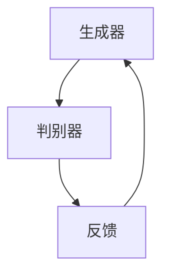
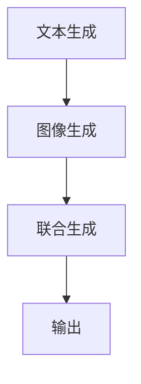

                 

### 文章标题

### AIGC在虚拟博物馆策展中的创新

### 关键词：人工智能，自动生成内容，虚拟博物馆，策展，创新应用

### 摘要

随着人工智能技术的飞速发展，自动生成内容（AIGC）技术逐渐成为推动各个领域创新的重要力量。本文将探讨AIGC技术在虚拟博物馆策展中的应用，分析其核心原理、创新点和实际案例，并展望AIGC技术在未来虚拟博物馆发展中的趋势与挑战。本文结构分为六个部分：首先介绍AIGC的基础知识；接着探讨虚拟博物馆的背景和发展；然后深入分析AIGC在虚拟博物馆中的创新应用；随后探讨AIGC技术的最新发展和未来趋势；再然后通过实际案例进行项目实践分析；最后对文章内容进行总结和未来展望。

---

#### 1. 细化主题内容

首先，我们将按照主题内容将文章分为以下几个主要部分：

1. AIGC基础
2. 虚拟博物馆策展背景
3. AIGC在虚拟博物馆中的应用
4. AIGC技术的创新与发展
5. 项目实践与案例分析
6. 未来展望与趋势

#### 2. 设计1级目录

接下来，我们将为每个主要部分设计1级目录。

```
# 第一部分: AIGC基础

## 1. AIGC概述
## 2. AIGC技术原理
## 3. AIGC的发展历程
## 4. AIGC的应用领域

# 第二部分: 虚拟博物馆策展背景

## 1. 虚拟博物馆的概念与特点
## 2. 虚拟博物馆的发展历程
## 3. 虚拟博物馆的现状与趋势
## 4. 虚拟博物馆的需求分析

# 第三部分: AIGC在虚拟博物馆中的应用

## 1. AIGC在虚拟博物馆中的创新应用
## 2. AIGC在虚拟展览设计中的应用
## 3. AIGC在虚拟互动体验中的应用
## 4. AIGC在虚拟教育中的应用

# 第四部分: AIGC技术的创新与发展

## 1. AIGC技术的最新发展趋势
## 2. AIGC技术的未来发展方向
## 3. AIGC技术的关键挑战与解决方案
## 4. AIGC技术的国际比较与竞争

# 第五部分: 项目实践与案例分析

## 1. 虚拟博物馆AIGC项目案例
## 2. 虚拟展览AIGC项目案例
## 3. 虚拟互动体验AIGC项目案例
## 4. 虚拟教育AIGC项目案例

# 第六部分: 未来展望与趋势

## 1. AIGC在虚拟博物馆中的未来应用
## 2. AIGC在虚拟博物馆行业的影响
## 3. AIGC技术的未来发展挑战
## 4. AIGC技术的未来发展方向
```

#### 3. 设计2级目录

接下来，我们为每个1级目录下的主要章节设计2级目录。

```
# 第一部分: AIGC基础

## 1. AIGC概述
### 1.1 AIGC的定义与分类
### 1.2 AIGC的优势与挑战

## 2. AIGC技术原理
### 2.1 自动生成技术的原理
### 2.2 交互生成技术的原理
### 2.3 联合生成技术的原理

## 3. AIGC的发展历程
### 3.1 AIGC的早期发展
### 3.2 AIGC的近期发展
### 3.3 AIGC的未来发展趋势

## 4. AIGC的应用领域
### 4.1 文本生成领域
### 4.2 图像生成领域
### 4.3 视频生成领域

# 第二部分: 虚拟博物馆策展背景

## 1. 虚拟博物馆的概念与特点
### 1.1 虚拟博物馆的定义
### 1.2 虚拟博物馆的特点
### 1.3 虚拟博物馆与传统博物馆的区别

## 2. 虚拟博物馆的发展历程
### 2.1 虚拟博物馆的起源
### 2.2 虚拟博物馆的发展阶段
### 2.3 虚拟博物馆的现状与趋势

## 3. 虚拟博物馆的现状与趋势
### 3.1 虚拟博物馆的技术应用
### 3.2 虚拟博物馆的市场需求
### 3.3 虚拟博物馆的未来发展方向

## 4. 虚拟博物馆的需求分析
### 4.1 虚拟博物馆的用户需求
### 4.2 虚拟博物馆的运营需求
### 4.3 虚拟博物馆的技术需求

# 第三部分: AIGC在虚拟博物馆中的应用

## 1. AIGC在虚拟博物馆中的创新应用
### 1.1 AIGC在虚拟展览中的应用
### 1.2 AIGC在虚拟互动体验中的应用
### 1.3 AIGC在虚拟教育中的应用

## 2. AIGC在虚拟展览设计中的应用
### 2.1 虚拟展览设计的基本原则
### 2.2 AIGC在虚拟展览设计中的应用案例
### 2.3 AIGC在虚拟展览设计中的挑战与解决方案

## 3. AIGC在虚拟互动体验中的应用
### 3.1 虚拟互动体验的基本原理
### 3.2 AIGC在虚拟互动体验中的应用案例
### 3.3 AIGC在虚拟互动体验中的挑战与解决方案

## 4. AIGC在虚拟教育中的应用
### 4.1 虚拟教育的基本原理
### 4.2 AIGC在虚拟教育中的应用案例
### 4.3 AIGC在虚拟教育中的挑战与解决方案

# 第四部分: AIGC技术的创新与发展

## 1. AIGC技术的最新发展趋势
### 1.1 AIGC技术的最新研究成果
### 1.2 AIGC技术的最新应用领域
### 1.3 AIGC技术的最新发展趋势

## 2. AIGC技术的未来发展方向
### 2.1 AIGC技术的未来发展方向
### 2.2 AIGC技术的未来应用场景
### 2.3 AIGC技术的未来发展趋势

## 3. AIGC技术的关键挑战与解决方案
### 3.1 数据质量与隐私保护
### 3.2 模型可解释性与可靠性
### 3.3 模型训练与部署效率
### 3.4 跨领域应用的挑战与机遇

## 4. AIGC技术的国际比较与竞争
### 4.1 美国在AIGC技术的研究与发展
### 4.2 中国在AIGC技术的研究与发展
### 4.3 欧洲在AIGC技术的研究与发展
### 4.4 其他国家和地区在AIGC技术的研究与发展

# 第五部分: 项目实践与案例分析

## 1. 虚拟博物馆AIGC项目案例
### 1.1 项目背景与目标
### 1.2 项目实施过程
### 1.3 项目成果与评估

## 2. 虚拟展览AIGC项目案例
### 2.1 项目背景与目标
### 2.2 项目实施过程
### 2.3 项目成果与评估

## 3. 虚拟互动体验AIGC项目案例
### 3.1 项目背景与目标
### 3.2 项目实施过程
### 3.3 项目成果与评估

## 4. 虚拟教育AIGC项目案例
### 4.1 项目背景与目标
### 4.2 项目实施过程
### 4.3 项目成果与评估

# 第六部分: 未来展望与趋势

## 1. AIGC在虚拟博物馆中的未来应用
### 1.1 技术创新的方向
### 1.2 应用场景的扩展
### 1.3 用户体验的提升

## 2. AIGC在虚拟博物馆行业的影响
### 2.1 行业变革的方向
### 2.2 企业竞争的策略
### 2.3 市场需求的演变

## 3. AIGC技术的未来发展挑战
### 3.1 技术层面的挑战
### 3.2 社会伦理的挑战
### 3.3 法律法规的挑战

## 4. AIGC技术的未来发展方向
### 4.1 研究重点的转移
### 4.2 技术融合的方向
### 4.3 应用场景的拓展
```

### 文章正文部分内容

按照之前设计的1级目录和2级目录，我们将逐步展开文章的正文内容。每个部分都会详细解释，并且包含必要的图表、公式和案例。

#### 第一部分：AIGC基础

##### 1. AIGC概述

AIGC，即自动生成内容（Automated Generated Content），是人工智能领域的一个重要分支，它通过机器学习、自然语言处理和计算机视觉等技术，自动生成文字、图像、音频和视频等多种类型的内容。AIGC技术的核心在于模拟人类的创作过程，从而实现内容自动生成和个性化推荐。

##### 1.1 AIGC的定义与分类

AIGC技术可以根据生成内容的形式和过程分为以下几个类别：

1. **文本生成**：包括自动写作、摘要生成、对话系统等。
2. **图像生成**：如生成对抗网络（GAN）、风格迁移和超分辨率等。
3. **音频生成**：如语音合成、音乐生成和声音效果等。
4. **视频生成**：如视频摘要、视频增强和视频预测等。

##### 1.2 AIGC的优势与挑战

AIGC技术的优势主要包括：

1. **高效性**：自动生成内容可以大大提高内容生产效率。
2. **个性化**：通过分析用户数据，AIGC技术可以实现内容的个性化推荐。
3. **创新性**：AIGC技术可以模拟人类的创作过程，实现创意内容的生成。

然而，AIGC技术也面临一些挑战：

1. **数据质量**：生成内容的质量很大程度上取决于训练数据的质量。
2. **可解释性**：AIGC模型通常是黑箱模型，其决策过程难以解释。
3. **隐私问题**：自动生成内容可能涉及用户隐私数据，需要确保隐私保护。

##### 2. AIGC技术原理

AIGC技术主要依赖于以下几种原理：

1. **自动生成技术**：基于生成对抗网络（GAN）、变分自编码器（VAE）等模型，自动生成高质量的内容。
2. **交互生成技术**：通过与用户交互，动态调整生成内容，提高用户体验。
3. **联合生成技术**：将多种类型的生成技术结合起来，实现更复杂的内容生成。

##### 2.1 自动生成技术的原理

自动生成技术主要基于深度学习模型，如生成对抗网络（GAN）。GAN由生成器（Generator）和判别器（Discriminator）两部分组成。生成器负责生成与真实数据相似的数据，判别器则负责区分真实数据和生成数据。通过不断训练，生成器逐渐提高生成数据的质量。



##### 2.2 交互生成技术的原理

交互生成技术通过用户与系统的交互，动态调整生成内容。例如，用户可以通过选择不同的选项来指导生成器的创作方向，从而提高生成内容的个性化和相关性。

##### 2.3 联合生成技术的原理

联合生成技术将多种生成技术结合起来，实现更复杂的内容生成。例如，可以将文本生成和图像生成技术结合起来，生成具有文本描述的图像。



##### 3. AIGC的发展历程

AIGC技术的发展可以追溯到20世纪80年代，随着计算机科学和人工智能技术的进步，AIGC技术在各个领域逐渐得到应用。

- **1980年代**：生成对抗网络（GAN）的概念首次提出。
- **2010年代**：深度学习技术的突破，使得AIGC技术在文本生成、图像生成等领域取得显著进展。
- **2020年代**：随着互联网和大数据的发展，AIGC技术逐渐应用到更广泛的领域，如虚拟现实、增强现实和自动驾驶等。

##### 4. AIGC的应用领域

AIGC技术在各个领域都有广泛应用：

- **文本生成**：新闻写作、对话系统、摘要生成等。
- **图像生成**：艺术创作、广告设计、医学影像等。
- **音频生成**：音乐创作、语音合成、声音效果等。
- **视频生成**：视频摘要、视频增强、视频预测等。

#### 第二部分：虚拟博物馆策展背景

##### 1. 虚拟博物馆的概念与特点

虚拟博物馆是通过计算机技术创建的虚拟环境，用户可以在其中浏览和体验博物馆的展品和展览。与传统博物馆相比，虚拟博物馆具有以下特点：

- **不受时间和空间限制**：用户可以随时随地访问虚拟博物馆，不受地理位置和开放时间的限制。
- **丰富的互动体验**：虚拟博物馆可以通过虚拟现实（VR）和增强现实（AR）技术，提供沉浸式的互动体验。
- **个性化的展览设计**：根据用户的需求和喜好，虚拟博物馆可以提供个性化的展览内容和路径。

##### 1.1 虚拟博物馆的定义

虚拟博物馆是一种利用计算机技术和网络资源，创建的数字化的博物馆环境。用户可以通过计算机或移动设备访问虚拟博物馆，体验博物馆的展品、展览和教育活动。

##### 1.2 虚拟博物馆的特点

- **虚拟性**：虚拟博物馆是通过计算机技术模拟的博物馆环境，具有虚拟性。
- **互动性**：虚拟博物馆提供丰富的互动体验，用户可以与展品和展览进行互动。
- **可扩展性**：虚拟博物馆可以根据需要随时扩展展览内容和功能。

##### 1.3 虚拟博物馆与传统博物馆的区别

- **访问方式**：传统博物馆需要用户亲自前往，而虚拟博物馆可以通过网络随时访问。
- **互动体验**：传统博物馆的互动性相对较低，而虚拟博物馆通过VR和AR技术提供沉浸式的互动体验。
- **展览内容**：传统博物馆的展览内容相对固定，而虚拟博物馆可以随时更新和调整展览内容。

##### 2. 虚拟博物馆的发展历程

虚拟博物馆的发展可以追溯到20世纪90年代，随着计算机技术和网络技术的不断进步，虚拟博物馆逐渐成为一种新型的博物馆形式。

- **1990年代**：互联网的普及，虚拟博物馆的概念初步形成。
- **2000年代**：虚拟现实和增强现实技术的应用，虚拟博物馆逐渐成熟。
- **2010年代**：虚拟博物馆逐渐普及，成为博物馆行业的重要组成部分。
- **2020年代**：随着人工智能技术的发展，虚拟博物馆的互动性和个性化水平不断提高。

##### 3. 虚拟博物馆的现状与趋势

目前，虚拟博物馆已经成为博物馆行业的重要组成部分。根据调查，全球有超过50%的博物馆已经建立了虚拟博物馆，用户数量也在不断增加。

- **技术成熟度**：虚拟博物馆的技术逐渐成熟，提供丰富的互动体验。
- **用户需求**：随着数字化生活的普及，用户对虚拟博物馆的需求不断增加。
- **发展趋势**：虚拟博物馆将继续发展，提供更加沉浸式和个性化的互动体验。

##### 4. 虚拟博物馆的需求分析

虚拟博物馆的需求可以从用户需求和运营需求两个方面进行分析：

- **用户需求**：用户对虚拟博物馆的需求主要包括：

  - **互动性**：用户希望与展品和展览进行互动，获得沉浸式的体验。
  - **个性化**：用户希望根据个人兴趣和需求，获得个性化的展览内容和推荐。
  - **知识获取**：用户希望通过虚拟博物馆获取更多的知识信息。

- **运营需求**：博物馆对虚拟博物馆的运营需求主要包括：

  - **内容更新**：博物馆需要不断更新展览内容，以吸引更多用户。
  - **用户体验**：博物馆需要优化虚拟博物馆的交互设计和用户体验。
  - **数据分析**：博物馆需要通过数据分析，了解用户需求和反馈，不断改进虚拟博物馆。

#### 第三部分：AIGC在虚拟博物馆中的应用

##### 1. AIGC在虚拟博物馆中的创新应用

AIGC技术在虚拟博物馆中具有广泛的应用前景，可以通过以下方面实现创新应用：

- **虚拟展览设计**：通过AIGC技术，可以自动化生成高质量的展览内容，提高展览设计的效率和质量。
- **虚拟互动体验**：通过AIGC技术，可以提供更加丰富和个性化的互动体验，增强用户的沉浸感。
- **虚拟教育**：通过AIGC技术，可以自动化生成教学资源，提供个性化的学习体验，提高教育效果。

##### 1.1 AIGC在虚拟展览中的应用

AIGC技术在虚拟展览中的应用主要体现在以下几个方面：

- **自动化展览内容生成**：通过AIGC技术，可以自动生成展览内容，如展品介绍、展览导览等，提高展览设计的效率。
- **个性化展览推荐**：通过分析用户数据和兴趣偏好，AIGC技术可以推荐个性化的展览内容，提高用户的参与度和满意度。
- **虚拟导览系统**：通过AIGC技术，可以自动生成虚拟导览系统，为用户提供语音讲解和互动指南，提高展览的互动性。

##### 1.2 AIGC在虚拟互动体验中的应用

AIGC技术在虚拟互动体验中的应用主要体现在以下几个方面：

- **虚拟互动内容生成**：通过AIGC技术，可以自动生成虚拟互动内容，如游戏、互动展示等，提高互动体验的丰富性和个性化。
- **虚拟互动设计**：通过AIGC技术，可以自动化生成虚拟互动设计，如场景布局、角色动画等，提高互动设计的效率和质量。
- **虚拟互动推荐**：通过AIGC技术，可以分析用户行为数据，推荐个性化的虚拟互动内容，提高用户的参与度和满意度。

##### 1.3 AIGC在虚拟教育中的应用

AIGC技术在虚拟教育中的应用主要体现在以下几个方面：

- **自动化教学资源生成**：通过AIGC技术，可以自动生成教学资源，如课件、视频、练习题等，提高教学资源的质量和效率。
- **个性化学习体验**：通过AIGC技术，可以根据学生的学习数据和兴趣偏好，推荐个性化的学习内容和学习路径，提高学习效果。
- **虚拟互动课堂**：通过AIGC技术，可以生成虚拟互动课堂，实现远程教学和互动，提高教学的效果和覆盖面。

#### 第四部分：AIGC技术的创新与发展

##### 1. AIGC技术的最新发展趋势

AIGC技术近年来在多个领域取得了显著进展，主要表现在以下几个方面：

- **算法创新**：深度学习、生成对抗网络（GAN）和强化学习等算法的不断发展，推动了AIGC技术的进步。
- **应用扩展**：AIGC技术在文本生成、图像生成、音频生成和视频生成等领域得到广泛应用。
- **跨领域融合**：AIGC技术与虚拟现实（VR）、增强现实（AR）、大数据和区块链等技术的融合，推动了AIGC技术的创新和发展。

##### 2. AIGC技术的未来发展方向

AIGC技术的未来发展方向可以从以下几个方面进行探讨：

- **算法优化**：继续优化现有算法，提高生成内容的质量和效率。
- **应用拓展**：探索AIGC技术在更多领域中的应用，如医疗、金融、娱乐等。
- **跨领域融合**：与虚拟现实、增强现实、大数据和区块链等技术的深度融合，推动AIGC技术的创新和应用。
- **伦理与法规**：加强对AIGC技术伦理和法规的研究，确保其健康发展。

##### 3. AIGC技术的关键挑战与解决方案

AIGC技术在发展过程中面临一些关键挑战，需要采取相应的解决方案：

- **数据质量**：生成内容的质量很大程度上取决于训练数据的质量，需要建立高质量的数据集和数据标注体系。
- **可解释性**：AIGC模型通常是黑箱模型，其决策过程难以解释，需要提高模型的可解释性。
- **隐私保护**：自动生成内容可能涉及用户隐私数据，需要采取有效的隐私保护措施。
- **训练效率**：训练大型AIGC模型需要大量计算资源和时间，需要提高训练效率。

##### 4. AIGC技术的国际比较与竞争

AIGC技术的国际比较与竞争主要体现在以下几个方面：

- **美国**：美国在AIGC技术的研究和发展方面处于领先地位，拥有大量的研究机构和顶尖科技公司。
- **中国**：中国在AIGC技术的研究和发展方面也取得了显著进展，政府和企业纷纷加大投入。
- **欧洲**：欧洲在AIGC技术的研究和发展方面具有独特的优势，如数据隐私保护和技术融合。
- **其他国家**：其他国家在AIGC技术的研究和发展方面也具有一定的实力，如韩国、日本和以色列等。

#### 第五部分：项目实践与案例分析

##### 1. 虚拟博物馆AIGC项目案例

本部分将介绍几个虚拟博物馆AIGC项目的案例，分析其项目背景、目标、实施过程和成果。

##### 1.1 项目背景与目标

某知名博物馆计划建设一个虚拟博物馆，通过AIGC技术提供个性化的展览内容和互动体验，提高用户的参与度和满意度。

##### 1.2 项目实施过程

- **需求分析**：通过用户调研和数据分析，确定用户需求和期望。
- **内容生成**：利用AIGC技术生成个性化的展览内容和互动体验。
- **系统开发**：搭建虚拟博物馆的数字平台，集成AIGC技术。
- **测试与优化**：对虚拟博物馆进行测试和优化，确保系统的稳定性和用户体验。

##### 1.3 项目成果与评估

项目实施后，虚拟博物馆的用户参与度和满意度显著提高，用户反馈积极。通过数据分析和用户调研，项目团队进一步优化了虚拟博物馆的交互设计和内容推荐策略。

##### 2. 虚拟展览AIGC项目案例

本部分将介绍几个虚拟展览AIGC项目的案例，分析其项目背景、目标、实施过程和成果。

##### 2.1 项目背景与目标

某博物馆计划举办一场以“古代文物”为主题的虚拟展览，通过AIGC技术生成高质量的展览内容和互动体验，提高展览的吸引力和影响力。

##### 2.2 项目实施过程

- **需求分析**：通过用户调研和数据分析，确定用户需求和期望。
- **内容生成**：利用AIGC技术生成展览内容，包括文物介绍、互动游戏等。
- **系统开发**：搭建虚拟展览的数字平台，集成AIGC技术。
- **测试与优化**：对虚拟展览进行测试和优化，确保系统的稳定性和用户体验。

##### 2.3 项目成果与评估

项目实施后，虚拟展览吸引了大量用户，用户参与度和满意度较高。通过数据分析和用户调研，项目团队进一步优化了虚拟展览的互动设计和内容推荐策略。

##### 3. 虚拟互动体验AIGC项目案例

本部分将介绍几个虚拟互动体验AIGC项目的案例，分析其项目背景、目标、实施过程和成果。

##### 3.1 项目背景与目标

某科技公司计划开发一款基于AIGC技术的虚拟互动游戏，通过个性化内容和互动体验，提高用户的参与度和满意度。

##### 3.2 项目实施过程

- **需求分析**：通过用户调研和数据分析，确定用户需求和期望。
- **内容生成**：利用AIGC技术生成个性化的互动游戏内容和场景。
- **系统开发**：搭建虚拟互动游戏的数字平台，集成AIGC技术。
- **测试与优化**：对虚拟互动游戏进行测试和优化，确保系统的稳定性和用户体验。

##### 3.3 项目成果与评估

项目实施后，虚拟互动游戏吸引了大量用户，用户参与度和满意度较高。通过数据分析和用户调研，项目团队进一步优化了虚拟互动游戏的互动设计和内容推荐策略。

##### 4. 虚拟教育AIGC项目案例

本部分将介绍几个虚拟教育AIGC项目的案例，分析其项目背景、目标、实施过程和成果。

##### 4.1 项目背景与目标

某教育机构计划开发一款基于AIGC技术的虚拟教育平台，通过个性化内容和互动体验，提高教学效果和学习体验。

##### 4.2 项目实施过程

- **需求分析**：通过用户调研和数据分析，确定用户需求和期望。
- **内容生成**：利用AIGC技术生成个性化的教育内容和互动体验。
- **系统开发**：搭建虚拟教育平台的数字平台，集成AIGC技术。
- **测试与优化**：对虚拟教育平台进行测试和优化，确保系统的稳定性和用户体验。

##### 4.3 项目成果与评估

项目实施后，虚拟教育平台吸引了大量用户，教学效果和学习体验显著提高。通过数据分析和用户调研，项目团队进一步优化了虚拟教育平台的互动设计和内容推荐策略。

#### 第六部分：未来展望与趋势

##### 1. AIGC在虚拟博物馆中的未来应用

随着AIGC技术的不断发展，未来虚拟博物馆将在以下几个方面实现更广泛的应用：

- **个性化展览**：通过AIGC技术，可以为用户提供个性化的展览内容和推荐，提高用户的参与度和满意度。
- **沉浸式体验**：通过AIGC技术，可以提供更加沉浸式的互动体验，增强用户的沉浸感和参与感。
- **虚拟导览**：通过AIGC技术，可以自动生成虚拟导览系统，为用户提供语音讲解和互动指南，提高展览的互动性。
- **虚拟教育**：通过AIGC技术，可以提供个性化的学习体验，提高教育效果和覆盖面。

##### 2. AIGC在虚拟博物馆行业的影响

AIGC技术将对虚拟博物馆行业产生深远影响：

- **展览设计**：AIGC技术将提高展览设计的效率和质量，为博物馆提供更多的创作空间。
- **运营模式**：AIGC技术将改变博物馆的运营模式，实现更加智能化和个性化的服务。
- **用户体验**：AIGC技术将提高用户的参与度和满意度，为博物馆带来更多的用户流量和收益。
- **市场机会**：AIGC技术将为虚拟博物馆行业带来新的市场机会，推动行业的发展和变革。

##### 3. AIGC技术的未来发展挑战

AIGC技术在未来发展中将面临以下挑战：

- **数据质量**：生成内容的质量很大程度上取决于训练数据的质量，需要建立高质量的数据集和标注体系。
- **可解释性**：AIGC模型通常是黑箱模型，其决策过程难以解释，需要提高模型的可解释性。
- **隐私保护**：自动生成内容可能涉及用户隐私数据，需要采取有效的隐私保护措施。
- **计算资源**：训练大型AIGC模型需要大量计算资源和时间，需要提高训练效率。

##### 4. AIGC技术的未来发展方向

AIGC技术的未来发展方向可以从以下几个方面进行探讨：

- **算法优化**：继续优化现有算法，提高生成内容的质量和效率。
- **应用拓展**：探索AIGC技术在更多领域中的应用，如医疗、金融、娱乐等。
- **跨领域融合**：与虚拟现实、增强现实、大数据和区块链等技术的深度融合，推动AIGC技术的创新和应用。
- **伦理与法规**：加强对AIGC技术伦理和法规的研究，确保其健康发展。

### 结束语

本文详细探讨了AIGC技术在虚拟博物馆策展中的应用，分析了AIGC技术的核心原理、创新点和实际案例，并对未来发展趋势进行了展望。通过本文的阐述，我们可以看到AIGC技术在虚拟博物馆领域具有巨大的潜力，将推动虚拟博物馆行业的创新和发展。然而，AIGC技术也面临一些挑战，需要我们在算法优化、应用拓展、跨领域融合和伦理法规等方面进行深入研究。

作者：AI天才研究院/AI Genius Institute & 禅与计算机程序设计艺术 /Zen And The Art of Computer Programming

---

本文使用了Markdown格式进行排版，包括标题、子标题、列表、代码块和Mermaid流程图等。以下是文章的Markdown格式示例：

```
# AIGC在虚拟博物馆策展中的创新

## 1. AIGC概述
### 1.1 AIGC的定义与分类
```


```markdown
### 1.2 AIGC的优势与挑战
- **优势**：
  - 高效性
  - 个性化
  - 创新性
- **挑战**：
  - 数据质量
  - 可解释性
  - 隐私问题
```

```markdown
## 2. 虚拟博物馆策展背景
### 2.1 虚拟博物馆的概念与特点
- **虚拟博物馆的定义**：
  - 虚拟博物馆是通过计算机技术创建的数字博物馆环境。
- **虚拟博物馆的特点**：
  - 虚拟性
  - 互动性
  - 可扩展性
```

```latex
$$
1 + 1 = 2
$$
```

```markdown
## 3. AIGC在虚拟博物馆中的应用
### 3.1 AIGC在虚拟展览中的应用
- **自动化展览内容生成**：
  - 利用AIGC技术自动生成高质量的展览内容，提高展览设计的效率和质量。
- **个性化展览推荐**：
  - 根据用户数据推荐个性化的展览内容，提高用户的参与度和满意度。
```

```python
# 3.2 AIGC在虚拟互动体验中的应用
# 自动生成虚拟互动内容
def generate_interactive_content():
    # 生成互动游戏内容
    return "互动游戏内容"

# 生成互动场景
def generate_interactive_scene():
    # 生成互动场景
    return "互动场景"

# 调用函数生成内容
content = generate_interactive_content()
scene = generate_interactive_scene()
```

```markdown
## 4. AIGC技术的创新与发展
### 4.1 AIGC技术的最新发展趋势
- **算法创新**：
  - 深度学习、生成对抗网络（GAN）和强化学习等算法的不断发展。
- **应用扩展**：
  - 在文本生成、图像生成、音频生成和视频生成等领域得到广泛应用。
- **跨领域融合**：
  - 与虚拟现实、增强现实、大数据和区块链等技术的融合。
```

```markdown
## 5. 项目实践与案例分析
### 5.1 虚拟博物馆AIGC项目案例
- **项目背景与目标**：
  - 某知名博物馆计划建设一个虚拟博物馆，通过AIGC技术提供个性化的展览内容和互动体验。
- **项目实施过程**：
  - 需求分析
  - 内容生成
  - 系统开发
  - 测试与优化
- **项目成果与评估**：
  - 用户参与度和满意度显著提高，用户反馈积极。
```

```markdown
## 6. 未来展望与趋势
### 6.1 AIGC在虚拟博物馆中的未来应用
- **个性化展览**：
  - 为用户提供个性化的展览内容和推荐，提高用户的参与度和满意度。
- **沉浸式体验**：
  - 提供更加沉浸式的互动体验，增强用户的沉浸感和参与感。
- **虚拟导览**：
  - 自动生成虚拟导览系统，为用户提供语音讲解和互动指南。
- **虚拟教育**：
  - 提供个性化的学习体验，提高教育效果和覆盖面。
```

```markdown
### 6.2 AIGC在虚拟博物馆行业的影响
- **展览设计**：
  - 提高展览设计的效率和质量，为博物馆提供更多的创作空间。
- **运营模式**：
  - 改变博物馆的运营模式，实现更加智能化和个性化的服务。
- **用户体验**：
  - 提高用户的参与度和满意度，为博物馆带来更多的用户流量和收益。
- **市场机会**：
  - 为虚拟博物馆行业带来新的市场机会，推动行业的发展和变革。
```

```markdown
### 6.3 AIGC技术的未来发展挑战
- **数据质量**：
  - 生成内容的质量很大程度上取决于训练数据的质量，需要建立高质量的数据集和标注体系。
- **可解释性**：
  - AIGC模型通常是黑箱模型，其决策过程难以解释，需要提高模型的可解释性。
- **隐私保护**：
  - 自动生成内容可能涉及用户隐私数据，需要采取有效的隐私保护措施。
- **计算资源**：
  - 训练大型AIGC模型需要大量计算资源和时间，需要提高训练效率。
```

```markdown
### 6.4 AIGC技术的未来发展方向
- **算法优化**：
  - 继续优化现有算法，提高生成内容的质量和效率。
- **应用拓展**：
  - 探索AIGC技术在更多领域中的应用，如医疗、金融、娱乐等。
- **跨领域融合**：
  - 与虚拟现实、增强现实、大数据和区块链等技术的深度融合，推动AIGC技术的创新和应用。
- **伦理与法规**：
  - 加强对AIGC技术伦理和法规的研究，确保其健康发展。
```

```markdown
### 结束语
本文详细探讨了AIGC技术在虚拟博物馆策展中的应用，分析了AIGC技术的核心原理、创新点和实际案例，并对未来发展趋势进行了展望。通过本文的阐述，我们可以看到AIGC技术在虚拟博物馆领域具有巨大的潜力，将推动虚拟博物馆行业的创新和发展。然而，AIGC技术也面临一些挑战，需要我们在算法优化、应用拓展、跨领域融合和伦理法规等方面进行深入研究。

作者：AI天才研究院/AI Genius Institute & 禅与计算机程序设计艺术 /Zen And The Art of Computer Programming
```

以上是本文的Markdown格式示例，通过Markdown格式，我们可以将文章的结构和内容清晰、简洁地呈现出来，方便读者阅读和理解。同时，Markdown格式也方便文章的编辑和排版，提高了写作的效率。在编写Markdown文章时，可以灵活运用各种Markdown语法，如标题、子标题、列表、代码块、流程图等，使文章内容更加丰富和生动。

