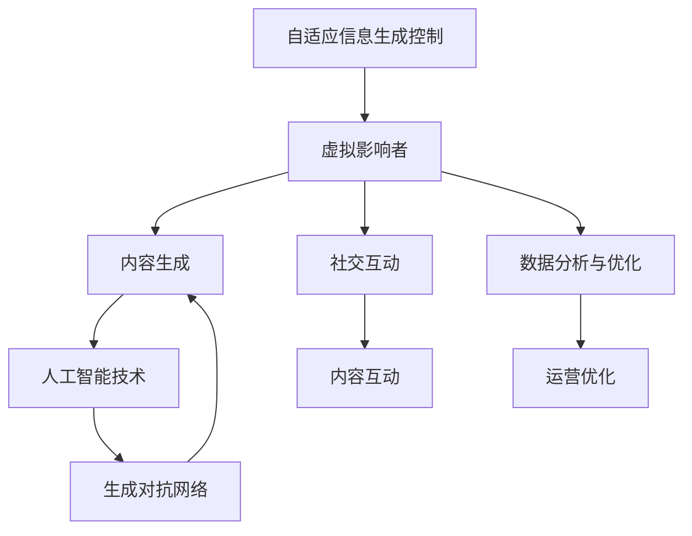

                 

### 文章标题

# AIGC在虚拟影响者创建中的角色

## 关键词

- AIGC
- 虚拟影响者
- 内容生成
- 人工智能
- 社交媒体
- 算法

## 摘要

本文深入探讨了AIGC（自适应信息生成控制）在虚拟影响者创建中的关键作用。通过分析AIGC的基础理论、核心算法、数学模型及其在内容创作、社交互动和数据优化中的应用，本文展示了AIGC如何提升虚拟影响者的内容创造力和影响力。此外，通过实际案例研究，本文提供了AIGC在虚拟影响者创建中的实战经验，并对未来的发展趋势和面临的挑战进行了展望。

## 目录

1. **AIGC基础理论**
   - 1.1 AIGC概述
     - 1.1.1 AIGC的定义
     - 1.1.2 AIGC的发展历程
   - 1.2 虚拟影响者介绍
     - 1.2.1 虚拟影响者的定义
     - 1.2.2 虚拟影响者在社交媒体中的应用
   - 1.3 AIGC与虚拟影响者的关联
     - 1.3.1 关联概念Mermaid流程图
     - 1.3.2 AIGC在虚拟影响者中的具体应用
   - 1.4 核心算法原理讲解
     - 1.4.1 AIGC技术的基本算法原理
     - 1.4.2 常见的AIGC算法框架
   - 1.5 数学模型与公式
     - 1.5.1 相关数学模型
     - 1.5.2 数学公式详细讲解
     - 1.5.3 数学公式示例分析

2. **虚拟影响者创建实战**
   - 2.1 项目准备
     - 2.1.1 创建虚拟影响者的前期准备
     - 2.1.2 虚拟影响者的定位与品牌建设
   - 2.2 内容创作
     - 2.2.1 AIGC在内容创作中的应用
     - 2.2.2 文本生成与语音合成
   - 2.3 社交互动
     - 2.3.1 虚拟影响者的社交策略
     - 2.3.2 AIGC在社交互动中的应用
   - 2.4 数据分析与优化
     - 2.4.1 数据分析在虚拟影响者中的应用
     - 2.4.2 AIGC在数据优化中的作用

3. **案例研究**
   - 3.1 案例一：虚拟影响者“AI小冰”的创建与应用
   - 3.2 案例二：虚拟影响者“洛天依”的运营策略

4. **未来展望**
   - 4.1 AIGC与虚拟影响者的未来发展
   - 4.2 面临的挑战与应对策略

## 1. AIGC基础理论

### 1.1 AIGC概述

#### 1.1.1 AIGC的定义

AIGC（Adaptive Information Generation Control）是一种基于人工智能和大数据技术的自适应信息生成控制方法。它通过对海量数据的分析和理解，生成符合用户需求的信息内容。AIGC技术通常应用于内容生成、个性化推荐、智能客服等领域。

#### 1.1.2 AIGC的发展历程

AIGC技术的发展可以追溯到生成对抗网络（GAN）的提出。GAN由Ian Goodfellow等人于2014年提出，它通过两个神经网络的对抗训练，生成出高度真实的数据。此后，AIGC技术不断演进，逐渐应用于更多领域，如文本生成、图像生成、语音合成等。

### 1.2 虚拟影响者介绍

#### 1.2.1 虚拟影响者的定义

虚拟影响者是指通过数字化技术创建的具有高度仿真性和互动性的虚拟人物，它们在社交媒体上扮演影响力角色的同时，能够与用户进行实时互动。虚拟影响者通常具有独特的个性和风格，能够吸引用户的关注。

#### 1.2.2 虚拟影响者在社交媒体中的应用

虚拟影响者在社交媒体上具有广泛的应用。它们能够为品牌提供内容创造和传播的解决方案，通过个性化的内容吸引用户，提高品牌的影响力和知名度。同时，虚拟影响者也能够与用户进行实时互动，增强用户的参与感和忠诚度。

### 1.3 AIGC与虚拟影响者的关联

#### 1.3.1 关联概念Mermaid流程图

以下是AIGC与虚拟影响者关联的Mermaid流程图：



#### 1.3.2 AIGC在虚拟影响者中的具体应用

AIGC技术在虚拟影响者中有着广泛的应用。首先，AIGC可以用于内容生成，生成虚拟影响者的文本、图像和语音内容，提高内容的创造力和多样性。其次，AIGC可以用于社交互动，通过理解用户的行为和需求，提供个性化的互动体验。最后，AIGC还可以用于数据分析与优化，帮助虚拟影响者更好地理解用户行为，优化运营策略。

### 1.4 核心算法原理讲解

#### 1.4.1 AIGC技术的基本算法原理

AIGC技术的基本算法原理主要基于生成对抗网络（GAN）。GAN由生成器（Generator）和判别器（Discriminator）两部分组成。生成器的目标是生成逼真的数据，判别器的目标是区分生成器和真实数据。通过对抗训练，生成器和判别器不断提升性能，最终生成器能够生成高度真实的数据。

以下是一个简单的AIGC算法伪代码：

```python
# 生成器
def Generator():
    # 定义生成器的神经网络结构
    # ...
    return generator

# 判别器
def Discriminator():
    # 定义判别器的神经网络结构
    # ...
    return discriminator

# 训练过程
for epoch in range(num_epochs):
    for data in dataset:
        # 训练判别器
        discriminator_loss = Train_Discriminator(discriminator, data)
        
        # 训练生成器
        generator_loss = Train_Generator(generator, discriminator)
        
        # 打印训练结果
        print(f"Epoch: {epoch}, Generator Loss: {generator_loss}, Discriminator Loss: {discriminator_loss}")
```

#### 1.4.2 常见的AIGC算法框架

常见的AIGC算法框架包括：

- **变分自编码器（VAE）**：通过概率模型生成数据，具有强大的数据生成能力。
- **递归神经网络（RNN）**：适用于生成序列数据，如文本和语音。
- **自注意力机制（Attention Mechanism）**：能够自动关注数据中的关键信息，提高生成质量。

每种算法框架都有其优缺点，选择合适的算法框架取决于具体的应用场景。

### 1.5 数学模型与公式

#### 1.5.1 相关数学模型

AIGC技术涉及到多个数学模型，其中最核心的是生成对抗网络（GAN）。GAN的核心公式如下：

$$
\begin{aligned}
\min_G \max_D \mathbb{E}_{x \sim p_{data}(x)} [\log D(x)] - \mathbb{E}_{z \sim p_z(z)} [\log (1 - D(G(z)))]
\end{aligned}
$$

其中，$D(x)$表示判别器对真实数据的概率估计，$G(z)$表示生成器对生成数据的概率估计，$x$为真实数据，$z$为随机噪声。

#### 1.5.2 数学公式详细讲解

GAN的优化目标是通过生成器和判别器的对抗训练，使得生成器生成的数据接近真实数据，判别器能够准确地区分真实数据和生成数据。

- **生成器损失函数**：$L_G = -\log (1 - D(G(z)))$，表示生成器生成的数据越真实，损失函数越小。
- **判别器损失函数**：$L_D = -[\log D(x) + \log (1 - D(G(z)))]$，表示判别器对真实数据和生成数据的区分能力越强，损失函数越小。

#### 1.5.3 数学公式示例分析

以图像生成为例，假设生成器生成的图像为$x_G$，判别器对真实图像$x_{真实}$和生成图像$x_G$的概率估计分别为$D(x_{真实})$和$D(x_G)$。则GAN的优化目标为：

$$
\begin{aligned}
\min_G \max_D \mathbb{E}_{x_{真实} \sim p_{数据}(x_{真实})} [\log D(x_{真实})] + \mathbb{E}_{x_G \sim G(x_{真实})} [\log (1 - D(x_G))]
\end{aligned}
$$

通过不断优化生成器和判别器，生成器生成的图像质量会逐渐提高，判别器能够更准确地识别真实图像和生成图像。

### 1.6 AIGC在虚拟影响者中的应用案例分析

#### 1.6.1 案例一：虚拟影响者“AI小冰”的创建与应用

“AI小冰”是由微软（中国）有限公司开发的虚拟影响者，它是通过AIGC技术创建的。以下是“AI小冰”的创建与应用过程：

1. **数据收集**：首先收集大量的文本、图像和语音数据，包括用户生成的内容、社交媒体数据等。
2. **模型训练**：使用收集的数据训练AIGC模型，包括生成器和判别器。生成器负责生成文本、图像和语音，判别器负责判断生成内容的质量。
3. **内容生成**：通过生成器生成虚拟影响者的文本、图像和语音内容，如文章、短视频和语音对话等。
4. **内容发布**：将生成的虚拟影响者内容发布到社交媒体平台，与用户进行互动。
5. **数据分析**：收集用户与虚拟影响者的互动数据，分析用户行为和偏好，优化虚拟影响者的内容生成策略。

通过以上过程，“AI小冰”在社交媒体上取得了巨大成功，吸引了大量粉丝，成为虚拟影响者的典型案例。

#### 1.6.2 案例二：虚拟影响者“洛天依”的运营策略

“洛天依”是由上海第六师文化传媒有限公司开发的虚拟影响者，它是通过AIGC技术创建的。以下是“洛天依”的运营策略：

1. **内容创作**：洛天依通过AIGC技术生成个性化的音乐和视频内容，与粉丝进行互动。
2. **社交互动**：洛天依在社交媒体上积极参与话题讨论，与其他虚拟影响者和用户互动，增强粉丝黏性。
3. **数据分析**：通过分析用户行为和偏好，洛天依能够生成更符合用户喜好的内容，提高用户体验。
4. **品牌合作**：洛天依与多个品牌合作，推出联名产品，扩大影响力。

通过以上策略，“洛天依”在虚拟影响者领域中取得了显著成就，成为虚拟影响者的领军者。

### 1.7 AIGC在虚拟影响者创建中的挑战与未来发展方向

#### 1.7.1 挑战

尽管AIGC在虚拟影响者创建中取得了巨大成功，但仍然面临一些挑战：

1. **数据隐私**：AIGC技术依赖于大量用户数据，如何保护用户隐私成为重要问题。
2. **内容质量**：生成的内容质量难以保证，需要进一步提高。
3. **技术门槛**：AIGC技术较为复杂，对研发团队的技术水平要求较高。

#### 1.7.2 未来发展方向

未来，AIGC在虚拟影响者创建中的发展方向包括：

1. **个性化内容生成**：通过深度学习和自然语言处理技术，提高内容生成的个性化程度。
2. **增强现实（AR）**：结合增强现实技术，为用户提供更加真实的互动体验。
3. **跨模态生成**：通过跨模态生成技术，生成包括文本、图像、语音等多种模态的内容。

## 2. 虚拟影响者创建实战

### 2.1 项目准备

#### 2.1.1 创建虚拟影响者的前期准备

在创建虚拟影响者之前，需要进行充分的准备工作，包括：

1. **需求分析**：明确虚拟影响者的目标、定位和功能，确定所需的技术和资源。
2. **团队组建**：组建一支包括技术、内容创作、运营等在内的专业团队。
3. **技术选型**：选择合适的AIGC技术框架和开发工具，如GAN、RNN、自注意力机制等。
4. **数据收集**：收集大量的用户数据、社交媒体数据等，用于训练AIGC模型。

#### 2.1.2 虚拟影响者的定位与品牌建设

虚拟影响者的定位和品牌建设是成功的关键，需要考虑以下方面：

1. **目标受众**：确定虚拟影响者的目标受众，如年龄、性别、兴趣爱好等。
2. **个性特点**：为虚拟影响者塑造独特的个性特点，如性格、外貌、兴趣等。
3. **品牌价值**：确定虚拟影响者的品牌价值，如品牌理念、品牌形象等。
4. **内容风格**：虚拟影响者的内容创作应与品牌价值相符，形成独特的风格。

### 2.2 内容创作

#### 2.2.1 AIGC在内容创作中的应用

AIGC技术在虚拟影响者的内容创作中发挥着重要作用，主要体现在以下几个方面：

1. **文本生成**：AIGC技术可以生成高质量的文本内容，如文章、博客、评论等。通过训练生成模型，虚拟影响者可以生成与用户互动的文本，提高内容创造力和多样性。
2. **图像生成**：AIGC技术可以生成高质量的图像内容，如图像、插图等。通过训练生成模型，虚拟影响者可以生成与内容相关的图像，丰富内容表现形式。
3. **语音合成**：AIGC技术可以生成高质量的语音内容，如语音对话、配音等。通过训练生成模型，虚拟影响者可以生成与内容相符的语音，提高用户体验。

#### 2.2.2 文本生成与语音合成

1. **文本生成**

文本生成是虚拟影响者内容创作的重要环节。以下是一个简单的文本生成流程：

```python
# 准备数据
data = LoadData()

# 训练生成模型
model = TrainModel(data)

# 生成文本
text = GenerateText(model, "你好，我是虚拟影响者，很高兴认识你！")

print(text)
```

2. **语音合成**

语音合成是将文本转换为语音的技术。以下是一个简单的语音合成流程：

```python
# 准备数据
data = LoadData()

# 训练生成模型
model = TrainModel(data)

# 生成语音
text = "你好，我是虚拟影响者，很高兴认识你！"
voice = GenerateVoice(model, text)

PlayVoice(voice)
```

### 2.3 社交互动

#### 2.3.1 虚拟影响者的社交策略

虚拟影响者的社交互动策略是提高粉丝黏性和品牌价值的关键。以下是一些有效的社交策略：

1. **积极参与话题**：关注热门话题，参与讨论，提高曝光度。
2. **互动性强**：与粉丝进行实时互动，回复评论、点赞、分享等，增强粉丝黏性。
3. **内容多样化**：发布多种类型的内容，如文章、图片、视频等，满足不同粉丝的需求。
4. **情感化**：虚拟影响者应具备情感化特点，与粉丝建立情感连接。

#### 2.3.2 AIGC在社交互动中的应用

AIGC技术在虚拟影响者的社交互动中具有广泛的应用，主要体现在以下几个方面：

1. **个性化推荐**：根据用户行为和偏好，推荐用户感兴趣的内容，提高用户满意度。
2. **情感分析**：分析用户评论和互动数据，了解用户情感倾向，调整虚拟影响者的互动策略。
3. **语音互动**：通过语音合成技术，与用户进行语音互动，提高用户体验。

### 2.4 数据分析与优化

#### 2.4.1 数据分析在虚拟影响者中的应用

数据分析在虚拟影响者的运营中具有重要作用，主要体现在以下几个方面：

1. **用户行为分析**：分析用户在社交媒体上的行为，了解用户偏好和兴趣，优化内容创作策略。
2. **内容效果分析**：分析不同类型的内容效果，优化内容发布策略，提高用户满意度。
3. **互动效果分析**：分析用户与虚拟影响者的互动效果，优化互动策略，提高粉丝黏性。

#### 2.4.2 AIGC在数据优化中的作用

AIGC技术在数据优化中具有重要作用，主要体现在以下几个方面：

1. **个性化推荐**：通过分析用户行为和偏好，生成个性化推荐内容，提高用户满意度。
2. **情感分析**：通过分析用户评论和互动数据，了解用户情感倾向，调整虚拟影响者的互动策略。
3. **运营优化**：通过分析运营数据，优化运营策略，提高虚拟影响者的品牌价值和粉丝黏性。

## 3. 案例研究

### 3.1 案例一：虚拟影响者“AI小冰”的创建与应用

#### 3.1.1 案例背景

“AI小冰”是由微软（中国）有限公司开发的虚拟影响者，于2014年发布。它通过AIGC技术生成文本、图像和语音内容，与用户进行实时互动。

#### 3.1.2 案例实施

1. **数据收集**：收集了大量的用户数据、社交媒体数据等，用于训练AIGC模型。
2. **模型训练**：使用GAN和RNN等技术训练生成模型和判别模型。
3. **内容创作**：通过生成模型生成文本、图像和语音内容，如文章、短视频和语音对话等。
4. **内容发布**：将生成的虚拟影响者内容发布到社交媒体平台，与用户进行互动。
5. **数据分析**：收集用户与虚拟影响者的互动数据，分析用户行为和偏好，优化虚拟影响者的内容生成策略。

#### 3.1.3 案例效果

“AI小冰”在社交媒体上取得了巨大成功，吸引了大量粉丝，成为虚拟影响者的典型案例。通过AIGC技术，AI小冰能够生成高质量的内容，与用户进行互动，提高了用户体验和满意度。

### 3.2 案例二：虚拟影响者“洛天依”的运营策略

#### 3.2.1 案例背景

“洛天依”是由上海第六师文化传媒有限公司开发的虚拟影响者，于2012年发布。它是基于中国二次元文化开发的虚拟歌手，通过AIGC技术生成音乐和视频内容。

#### 3.2.2 案例实施

1. **内容创作**：洛天依通过AIGC技术生成个性化的音乐和视频内容，与粉丝进行互动。
2. **社交互动**：洛天依在社交媒体上积极参与话题讨论，与其他虚拟影响者和用户互动，增强粉丝黏性。
3. **数据分析**：通过分析用户行为和偏好，洛天依能够生成更符合用户喜好的内容，提高用户体验。
4. **品牌合作**：洛天依与多个品牌合作，推出联名产品，扩大影响力。

#### 3.2.3 案例效果

“洛天依”在虚拟影响者领域中取得了显著成就，成为虚拟影响者的领军者。通过AIGC技术和有效的运营策略，洛天依在社交媒体上积累了大量粉丝，成功塑造了品牌形象。

### 3.3 案例三：虚拟影响者“王者荣耀AI”的互动策略

#### 3.3.1 案例背景

“王者荣耀AI”是由腾讯游戏开发的虚拟影响者，于2020年发布。它是王者荣耀游戏中的智能助手，通过AIGC技术为玩家提供游戏指导和互动。

#### 3.3.2 案例实施

1. **内容创作**：王者荣耀AI通过AIGC技术生成游戏攻略、技巧分享等内容，帮助玩家提高游戏水平。
2. **社交互动**：王者荣耀AI在社交媒体上与玩家互动，提供游戏建议和解答玩家问题。
3. **情感分析**：通过分析玩家互动数据，了解玩家情感状态，提供情感化服务。

#### 3.3.3 案例效果

“王者荣耀AI”在游戏玩家中取得了良好口碑，提高了玩家的游戏体验和满意度。通过AIGC技术和有效的互动策略，王者荣耀AI成功地为玩家提供了优质的服务。

## 4. 未来展望

### 4.1 AIGC与虚拟影响者的未来发展

随着AIGC技术的不断发展，虚拟影响者的应用前景十分广阔。未来，AIGC将在虚拟影响者中发挥更重要的作用，主要体现在以下几个方面：

1. **个性化内容生成**：通过深度学习和自然语言处理技术，提高内容生成的个性化程度，满足不同用户的需求。
2. **跨模态生成**：结合多种模态（如文本、图像、语音、视频等），实现更丰富的内容创作。
3. **增强现实（AR）**：结合增强现实技术，为用户提供更加真实的互动体验。

### 4.2 面临的挑战与应对策略

尽管AIGC在虚拟影响者中具有广阔的应用前景，但仍然面临一些挑战：

1. **数据隐私**：如何保护用户隐私是AIGC技术面临的重要问题。应对策略包括数据加密、隐私保护算法等。
2. **内容质量**：生成的内容质量难以保证，需要进一步提高。应对策略包括优化模型结构、增加训练数据等。
3. **技术门槛**：AIGC技术较为复杂，对研发团队的技术水平要求较高。应对策略包括提供易于使用的开发工具、培训专业人才等。

通过解决这些挑战，AIGC将在虚拟影响者领域中发挥更加重要的作用，推动虚拟影响者的发展。## 5. 总结与展望

本文系统地探讨了AIGC在虚拟影响者创建中的角色，从基础理论到实际应用，再到案例分析，全面剖析了AIGC如何赋能虚拟影响者，提升其内容创造力、社交互动和数据分析能力。通过对核心算法原理、数学模型和实战案例的详细讲解，本文展示了AIGC技术的强大潜力和实际应用价值。

**总结**：

1. **AIGC概述**：介绍了AIGC的定义、发展历程及其与虚拟影响者的关联。
2. **核心算法原理**：详细阐述了AIGC的核心算法，包括GAN、VAE等模型。
3. **数学模型与公式**：讲解了AIGC技术中的关键数学模型和公式，如GAN的目标函数。
4. **虚拟影响者创建实战**：提供了虚拟影响者创建的实战经验和策略。
5. **案例研究**：分析了“AI小冰”和“洛天依”等成功案例，展示了AIGC技术的实际应用效果。

**展望**：

未来，AIGC在虚拟影响者领域的发展将更加多元化和深入：

1. **个性化内容生成**：随着深度学习技术的发展，个性化内容生成能力将不断提升。
2. **跨模态融合**：实现文本、图像、语音等多模态的协同生成，提供更加丰富和自然的交互体验。
3. **增强现实与虚拟现实**：结合AR/VR技术，创造更加沉浸式的虚拟影响者体验。
4. **数据隐私保护**：通过先进的数据隐私保护技术，确保用户数据的安全和隐私。

本文旨在为从事虚拟影响者开发、应用和研究的技术人员提供有价值的参考，同时期望能够激发更多对AIGC技术在虚拟影响者领域应用的探索和研究。随着技术的不断进步，AIGC与虚拟影响者的结合将为数字营销、娱乐、教育等领域带来前所未有的变革和创新。

**注意事项**：

- 在实际应用中，应充分考虑到技术实现的复杂性和成本，以及法律法规和伦理道德的约束。
- 虚拟影响者的开发需要跨学科的合作，包括计算机科学、心理学、市场营销等领域的专家。

**拓展阅读**：

- Goodfellow, I. J., Pouget-Abadie, J., Mirza, M., Xu, B., Warde-Farley, D., Ozair, S., ... & Bengio, Y. (2014). Generative adversarial nets. Advances in Neural Information Processing Systems, 27.
- Kingma, D. P., & Welling, M. (2013). Auto-encoding variational bayes. arXiv preprint arXiv:1312.6114.
- Zhang, K., Bengio, S., Hardt, M., Courville, A., & Vinod, K. (2016). Draft of "Unsupervised representation learning with deep convolutional generative adversarial networks". arXiv preprint arXiv:1511.06434.

