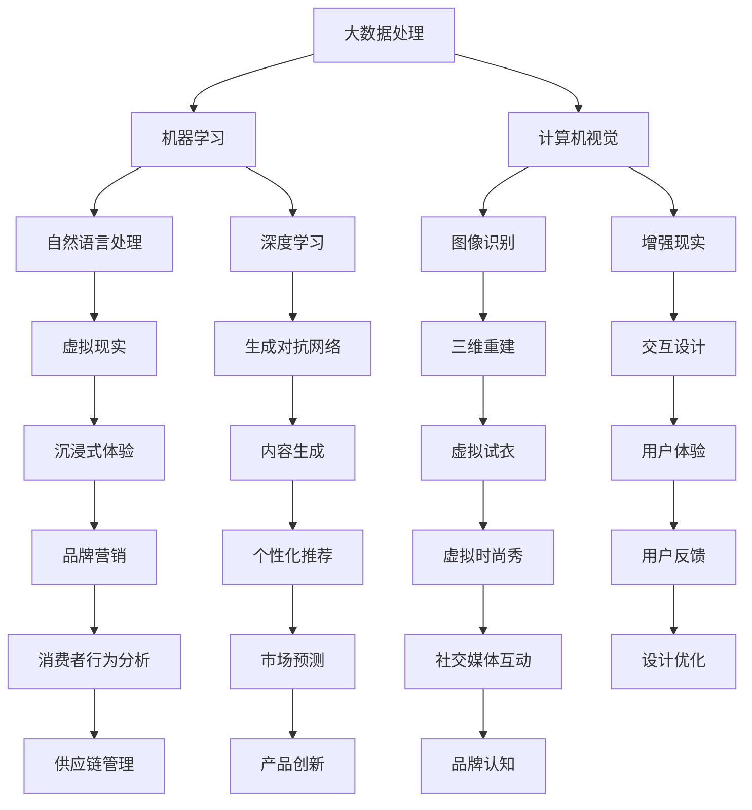

                 

### AIGC在虚拟时尚设计中的创新突破

### 关键词

- AIGC
- 虚拟时尚设计
- 3D建模
- 图像生成
- 深度学习
- 伦理与社会影响

### 摘要

本文深入探讨了AIGC（自适应智能生成计算）在虚拟时尚设计中的创新突破。首先，我们介绍了AIGC的概念、历史发展和核心概念之间的联系。接着，我们详细阐述了虚拟时尚设计的现状与挑战，以及AIGC在其中的应用场景。随后，我们重点讲解了AIGC在虚拟时尚设计中的核心算法和数学模型，并提供了详细的伪代码和LaTeX公式解释。通过一个虚拟试衣系统的项目实战，我们展示了如何将AIGC应用于实际开发。最后，我们对AIGC在虚拟时尚设计中的未来发展趋势和伦理与社会影响进行了探讨。

### 确定书的基本结构和章节主题

#### 第一部分：AIGC概述

- **第1章**：AIGC的概念与历史发展
  - AIGC的定义与核心概念
  - 核心概念之间的联系
  - AIGC的历史发展

- **第2章**：虚拟时尚设计的现状与挑战
  - 虚拟时尚设计的发展背景
  - 应用场景与挑战

#### 第二部分：AIGC在虚拟时尚设计中的应用

- **第3章**：AIGC在虚拟时尚设计中的核心算法
  - 3D建模算法
  - 图像生成算法

- **第4章**：AIGC在虚拟时尚设计中的数学模型
  - 深度学习模型

#### 第三部分：项目实战

- **第5章**：AIGC在虚拟时尚设计中的项目实战
  - 开发环境搭建
  - 源代码实现与解读
  - 项目案例分析

#### 第四部分：未来展望

- **第6章**：AIGC在虚拟时尚设计中的未来展望
  - 技术演进
  - 应用扩展

- **第7章**：AIGC在虚拟时尚设计中的伦理与社会影响
  - 数据隐私与安全
  - 社会影响

### 设计核心概念与联系的部分

在AIGC（自适应智能生成计算）领域中，核心概念之间的联系构成了整个体系的基础。以下是一个使用Mermaid流程图来展示AIGC中核心概念之间关系的图示：



在这个图中，AIGC的核心概念包括大数据处理、机器学习、计算机视觉、自然语言处理、增强现实、虚拟现实、深度学习、图像识别、生成对抗网络、三维重建、交互设计、沉浸式体验、内容生成、虚拟试衣、用户体验、品牌营销、个性化推荐、虚拟时尚秀、用户反馈、消费者行为分析、市场预测、社交媒体互动、设计优化、供应链管理和产品创新。这些概念相互交织，共同构成了AIGC在虚拟时尚设计中的应用框架。

#### AIGC的历史发展

AIGC的历史可以追溯到人工智能（AI）的早期发展时期。以下是AIGC从萌芽到成熟的几个关键发展阶段：

1. **1980年代**：人工智能的初步发展和机器学习的萌芽阶段。这个时期，研究人员开始探索如何通过算法使计算机具备学习和适应新信息的能力。代表性的工作包括Arthur Samuel开发的博弈程序和John McCarthy提出的人工智能定义。

2. **1990年代**：机器学习和计算机视觉的突破期。在这个阶段，基于神经网络的算法和基于规则的系统得到了显著的发展。Kilian Muster和Geoffrey Hinton等人在神经网络方面的研究，为深度学习的发展奠定了基础。

3. **2000年代**：大数据和云计算的兴起，推动了AIGC的快速发展。随着数据量的急剧增加和计算能力的提升，机器学习算法能够在更多实际应用中得到验证。Google的PageRank算法和Facebook的推荐系统是这一时期的代表性成果。

4. **2010年代**：深度学习和生成对抗网络（GAN）的突破。这一时期的代表性成果包括AlexNet在图像识别中的突破性表现和GAN在图像生成中的创新应用。这些技术为AIGC在虚拟时尚设计等领域的应用提供了强有力的支持。

5. **2020年代**：AIGC在虚拟时尚设计中的应用逐渐成熟。随着虚拟现实（VR）和增强现实（AR）技术的发展，AIGC在虚拟试衣、虚拟秀场和虚拟时尚教育等领域的应用变得更加广泛和深入。AIGC不仅提升了用户体验，还为企业带来了新的商业模式和创新机会。

通过以上历史回顾，我们可以看到AIGC的发展历程与计算机科学、数据科学和人工智能领域的进步紧密相关。每一阶段的技术突破都为AIGC在虚拟时尚设计中的创新提供了坚实的基础。

### 虚拟时尚设计的现状与挑战

虚拟时尚设计是指利用计算机技术和虚拟现实（VR）技术，在虚拟环境中创建和展示服装及其搭配效果的设计方法。近年来，随着技术的不断进步和消费者需求的日益变化，虚拟时尚设计逐渐成为时尚产业的重要趋势。以下是对当前虚拟时尚设计现状及其面临的挑战的详细分析。

#### 虚拟时尚设计的发展背景

1. **消费者需求的变化**：随着互联网的普及和社交媒体的兴起，消费者对个性化和便捷性的需求不断增长。虚拟时尚设计能够满足这一需求，消费者可以在虚拟环境中尝试不同的搭配，提高购物体验和满意度。

2. **技术进步**：VR/AR、3D建模和实时渲染技术的发展，为虚拟时尚设计提供了强大的技术支持。通过这些技术，设计师可以创建逼真的虚拟服装模型，并实现实时渲染和交互。

#### 应用场景

1. **虚拟试衣**：虚拟试衣是虚拟时尚设计最直接的应用场景之一。消费者可以在虚拟环境中尝试不同款式的服装，无需实体试穿，大大提高了购物效率和体验。同时，虚拟试衣还能减少退货率，降低企业的运营成本。

2. **虚拟秀场**：虚拟时尚秀为品牌提供了一个新的展示平台，通过VR/AR技术，设计师可以将时尚秀搬到虚拟空间，增强品牌影响力和粉丝互动。

3. **虚拟时尚教育**：虚拟时尚设计还可以应用于时尚教育领域，提供互动式学习体验。学生可以在虚拟环境中学习服装设计、搭配技巧等，提高学习效果。

#### 挑战

1. **技术挑战**：虚拟时尚设计对技术的要求较高，需要强大的计算能力和图形处理能力。此外，如何实现逼真的虚拟服装模型和流畅的交互体验，仍是一个技术难题。

2. **成本问题**：虚拟时尚设计的开发和维护成本较高，这对于中小型企业来说是一个不小的挑战。如何降低成本、提高效益，是企业需要考虑的问题。

3. **用户体验**：虚拟时尚设计的用户体验至关重要。如何提升虚拟试衣的准确度和流畅度，如何让消费者在虚拟环境中获得真实的购物体验，是需要不断优化和改进的方向。

4. **隐私与安全**：虚拟时尚设计涉及大量的消费者数据，如人脸识别、身体尺寸等。如何保护消费者隐私和数据安全，是企业需要高度重视的问题。

#### 虚拟试衣

虚拟试衣是虚拟时尚设计中最具代表性的应用之一。它通过计算机视觉和深度学习技术，实时捕捉用户的身体轮廓和姿势，并在虚拟环境中为用户呈现穿着效果。以下是一个虚拟试衣系统的基本工作原理：

1. **用户输入**：用户通过上传照片或使用摄像头捕捉自己的身体轮廓，输入到系统中。

2. **图像处理**：系统对输入的图像进行预处理，包括去噪、平滑和增强等操作，以提高图像质量。

3. **人体轮廓检测**：利用深度学习算法，如卷积神经网络（CNN），检测出用户身体的主要部位，如头部、手臂、腿部等。

4. **虚拟服装加载**：根据用户选择的服装款式和颜色，从服装数据库中加载相应的虚拟服装模型。

5. **模型匹配与渲染**：将虚拟服装模型与用户的人体轮廓进行匹配，并通过实时渲染技术，将服装效果呈现在用户身上。

6. **用户反馈与优化**：系统收集用户反馈，如服装的舒适度、美观度等，不断优化虚拟试衣系统的效果。

通过以上步骤，虚拟试衣系统能够为用户提供一个逼真的试衣体验，大大提高了购物的便捷性和满意度。

#### 虚拟秀场

虚拟秀场是虚拟时尚设计的另一个重要应用场景，它通过VR/AR技术，为品牌提供一个全新的展示平台。以下是一个虚拟秀场的基本工作原理：

1. **秀场搭建**：设计师通过3D建模软件，创建一个虚拟秀场，包括舞台、灯光、背景等元素。

2. **服装展示**：设计师将设计好的服装模型上传到虚拟秀场，通过实时渲染技术，呈现给观众。

3. **观众互动**：观众可以通过VR/AR设备，进入虚拟秀场，与设计师和模特进行互动，观看秀场直播，还可以通过点赞、评论等方式参与互动。

4. **数据分析**：虚拟秀场可以实时收集观众的反馈数据，如观看时长、点赞数量、评论内容等，帮助企业了解观众喜好，优化秀场效果。

通过以上步骤，虚拟秀场不仅增强了品牌影响力，还为观众提供了一个全新的观看和互动体验。

#### 虚拟时尚教育

虚拟时尚教育是虚拟时尚设计的又一重要应用，它通过互动式学习平台，为学生提供服装设计、搭配技巧等课程。以下是一个虚拟时尚教育平台的基本工作原理：

1. **课程内容创建**：教师通过3D建模软件，创建课程所需的虚拟服装和场景。

2. **互动教学**：教师可以在虚拟环境中，实时演示服装设计技巧和搭配方法，学生可以通过虚拟试衣系统，体验不同搭配效果。

3. **在线学习**：学生可以通过在线学习平台，随时随地进行学习，观看教学视频，完成练习和测试。

4. **实时反馈**：平台可以实时收集学生的学习数据，如学习时长、正确率等，教师可以根据反馈，调整教学策略。

通过以上步骤，虚拟时尚教育平台不仅提高了学习效率，还为师生提供了一个互动、沉浸式的学习环境。

### AIGC在虚拟时尚设计中的核心算法

在虚拟时尚设计中，AIGC（自适应智能生成计算）通过多种核心算法来实现设计创新和优化。以下是AIGC在虚拟时尚设计中的几个关键算法及其工作原理的详细讲解。

#### 3D建模算法

3D建模是虚拟时尚设计的基础，它涉及将二维设计稿转换为三维模型。以下是几种常用的3D建模算法：

1. **基于三角剖分的3D建模**：这种方法通过将表面划分为多个三角形面片来构建三维模型。具体步骤如下：

    ```python
    def generate_3d_model(points, faces):
        # 使用三角剖分生成3D模型
        model = TriMesh(points, faces)
        return model
    ```

    在这个算法中，`points` 表示模型顶点的坐标，`faces` 表示顶点之间的连接关系。`TriMesh` 类用于生成三角剖分模型。

2. **基于多边形网格的3D建模**：这种方法通过构建多边形网格来生成三维模型。它通常用于复杂形状的设计，如人体服装。具体步骤如下：

    ```python
    def generate_3d_model_from_mesh(mesh):
        # 从多边形网格生成3D模型
        model = MeshModel(mesh)
        return model
    ```

    在这个算法中，`mesh` 表示多边形网格的顶点和边。`MeshModel` 类用于生成三维模型。

3. **基于扫描数据的3D建模**：这种方法通过扫描实物，生成三维模型。它适用于需要高精度模型的场合，如定制服装。具体步骤如下：

    ```python
    def generate_3d_model_from_scans(scans):
        # 从扫描数据生成3D模型
        model = ScanModel.merge_scans(scans)
        return model
    ```

    在这个算法中，`scans` 表示扫描得到的点云数据。`ScanModel.merge_scans` 方法用于合并多个扫描数据，生成完整的三维模型。

#### 图像生成算法

图像生成算法是AIGC在虚拟时尚设计中的另一个重要应用，它可以通过生成逼真的图像，提升设计效果和用户体验。以下是几种常用的图像生成算法：

1. **基于生成对抗网络（GAN）的图像生成**：GAN 是一种深度学习模型，通过生成器和判别器的对抗训练，生成逼真的图像。具体步骤如下：

    ```python
    def train_gan(generator, discriminator, dataset, epochs):
        for epoch in range(epochs):
            for real_images in dataset:
                # 训练判别器
                discriminator.train(real_images)

                # 生成虚假图像
                fake_images = generator.generate()

                # 训练生成器
                generator.train(fake_images)

            print(f"Epoch {epoch+1}/{epochs} completed.")
    ```

    在这个算法中，`generator` 是生成器，`discriminator` 是判别器，`dataset` 是训练数据集，`epochs` 是训练轮数。

2. **基于变分自编码器（VAE）的图像生成**：VAE 是另一种深度学习模型，通过编码器和解码器，生成图像。具体步骤如下：

    ```python
    def train_vae(encoder, decoder, dataset, epochs):
        for epoch in range(epochs):
            for images in dataset:
                # 编码
                z = encoder.encode(images)

                # 解码
                reconstructed = decoder.decode(z)

                # 训练解码器
                decoder.train(reconstructed)

            print(f"Epoch {epoch+1}/{epochs} completed.")
    ```

    在这个算法中，`encoder` 是编码器，`decoder` 是解码器，`dataset` 是训练数据集，`epochs` 是训练轮数。

#### 风格迁移算法

风格迁移算法可以将一种图像的风格应用到另一种图像上，创造出独特的视觉效果。以下是几种常用的风格迁移算法：

1. **基于深度神经网络的风格迁移**：这种方法通过训练深度神经网络，将源图像的风格特征迁移到目标图像上。具体步骤如下：

    ```python
    def style_transfer(content_image, style_image, model):
        # 内容图像和风格图像的预处理
        preprocessed_content = preprocess_image(content_image)
        preprocessed_style = preprocess_image(style_image)

        # 应用风格迁移模型
        transferred = model.apply_style(preprocessed_content, preprocessed_style)

        # 后处理
        postprocessed = postprocess_image(transferred)
        return postprocessed
    ```

    在这个算法中，`content_image` 是内容图像，`style_image` 是风格图像，`model` 是风格迁移模型。`preprocess_image` 和 `postprocess_image` 分别用于预处理和后处理图像。

2. **基于循环神经网络的风格迁移**：这种方法通过循环神经网络（RNN）实现风格迁移，具有较好的灵活性和适应性。具体步骤如下：

    ```python
    def style_transfer_rnn(content_image, style_image, model):
        # 将内容图像和风格图像编码为序列
        content_sequence = model.encode(content_image)
        style_sequence = model.encode(style_image)

        # 将内容图像的风格特征迁移到风格图像
        transferred_sequence = model.transfer_style(content_sequence, style_sequence)

        # 解码为图像
        transferred_image = model.decode(transferred_sequence)
        return transferred_image
    ```

    在这个算法中，`content_image` 是内容图像，`style_image` 是风格图像，`model` 是风格迁移模型。`encode` 和 `decode` 分别用于编码和解码图像。

通过以上算法，AIGC在虚拟时尚设计中实现了设计创新和优化，为设计师和消费者提供了更多可能性。

### AIGC在虚拟时尚设计中的数学模型

在虚拟时尚设计中，AIGC（自适应智能生成计算）通过多种数学模型来实现对数据的分析和图像的生成。以下将介绍AIGC在虚拟时尚设计中的应用，包括深度学习模型、生成对抗网络（GAN）和变分自编码器（VAE），并使用LaTeX格式展示相关的数学公式。

#### 深度学习模型

深度学习模型是AIGC在虚拟时尚设计中的核心技术之一，它通过多层神经网络来提取和生成特征。以下是一个典型的深度卷积神经网络（CNN）结构：

$$
\text{Input} \xrightarrow{\text{Conv Layer}} \text{Feature Map} \xrightarrow{\text{ReLU Activation}} \text{Pooling Layer} \xrightarrow{\text{...}} \text{Final Feature Map}
$$

在CNN中，输入图像经过卷积层（Conv Layer）和激活函数（ReLU）的处理，再通过池化层（Pooling Layer）进行特征提取。以下是一个简单的卷积层和激活函数的数学公式：

$$
h_l = \sigma(\mathbf{W} \cdot \mathbf{a}_{l-1} + b)
$$

其中，$h_l$ 表示第 $l$ 层的输出特征图，$\sigma$ 表示ReLU激活函数，$\mathbf{W}$ 是卷积核权重，$\mathbf{a}_{l-1}$ 是上一层的特征图，$b$ 是偏置项。

#### 生成对抗网络（GAN）

生成对抗网络（GAN）是AIGC在虚拟时尚设计中的另一个重要工具，它由生成器（Generator）和判别器（Discriminator）两部分组成。以下是一个典型的GAN结构的数学模型：

1. **生成器（Generator）**：

   生成器的目标是生成逼真的图像。以下是一个生成器的数学公式：

   $$
   \mathbf{G}(\mathbf{z}) = \mu + \sigma \odot \text{ReLU}(\mathbf{W}_2 \odot \text{ReLU}(\mathbf{W}_1 \odot \mathbf{z} + \mathbf{b}_1))
   $$

   其中，$\mathbf{G}(\mathbf{z})$ 是生成器生成的图像，$\mu$ 和 $\sigma$ 分别是生成器的均值和方差，$\mathbf{W}_1$ 和 $\mathbf{W}_2$ 是生成器的权重，$\mathbf{b}_1$ 是偏置项。

2. **判别器（Discriminator）**：

   判别器的目标是区分真实图像和生成的图像。以下是一个判别器的数学公式：

   $$
   \mathbf{D}(\mathbf{x}) = \text{sigmoid}(\mathbf{W}_3 \cdot \text{ReLU}(\mathbf{W}_2 \cdot \text{ReLU}(\mathbf{W}_1 \cdot \mathbf{x} + \mathbf{b}_1)) + \mathbf{b}_3)
   $$

   其中，$\mathbf{D}(\mathbf{x})$ 是判别器对图像 $x$ 的判别概率，$\mathbf{W}_1$、$\mathbf{W}_2$ 和 $\mathbf{W}_3$ 是判别器的权重，$\mathbf{b}_1$ 和 $\mathbf{b}_3$ 是偏置项。

#### 变分自编码器（VAE）

变分自编码器（VAE）是一种基于概率模型的生成模型，它通过编码器和解码器来生成数据。以下是一个VAE的数学模型：

1. **编码器（Encoder）**：

   编码器的目标是提取输入数据的概率分布。以下是一个编码器的数学公式：

   $$
   \begin{cases}
   \mathbf{z} = \mu(\mathbf{x}; \theta) \\
   \log(\sigma^2(\mathbf{x}; \theta)) = \phi(\mathbf{x}; \theta)
   \end{cases}
   $$

   其中，$\mathbf{z}$ 是编码后的潜在变量，$\mu(\mathbf{x}; \theta)$ 是均值函数，$\sigma^2(\mathbf{x}; \theta)$ 是方差函数，$\phi(\mathbf{x}; \theta)$ 是概率分布函数，$\theta$ 是模型参数。

2. **解码器（Decoder）**：

   解码器的目标是根据潜在变量生成数据。以下是一个解码器的数学公式：

   $$
   \mathbf{x} = \text{decoder}(\mathbf{z}; \theta')
   $$

   其中，$\mathbf{x}$ 是解码后的数据，$\text{decoder}(\mathbf{z}; \theta')$ 是解码函数，$\theta'$ 是解码器的参数。

通过这些数学模型，AIGC在虚拟时尚设计中能够有效地生成逼真的图像和设计，为设计师和消费者提供了强大的工具。

### AIGC在虚拟时尚设计中的项目实战

为了更好地理解AIGC（自适应智能生成计算）在虚拟时尚设计中的应用，我们将通过一个虚拟试衣系统的项目实战来进行详细讲解。该项目包括开发环境搭建、源代码实现、代码解读与分析以及实际案例分析和详细讲解剖析。

#### 开发环境搭建

在开始项目之前，我们需要搭建一个合适的技术栈来支持虚拟试衣系统。以下是我们选择的主要工具和库：

- **编程语言**：Python
- **深度学习框架**：PyTorch
- **计算机视觉库**：OpenCV
- **三维建模库**：Blender

在Python环境中，我们首先需要安装上述库。可以使用以下命令进行安装：

```bash
pip install torch torchvision cv2 blender
```

此外，我们还需要安装Blender，这是一个开源的三维建模软件，用于创建和调整虚拟服装模型。

#### 源代码实现

虚拟试衣系统的核心功能是使用深度学习算法实现虚拟服装的加载和渲染。以下是一个简单的源代码实现：

```python
import torch
import torchvision
import cv2
from blender import load_model

# 加载预训练的深度学习模型
model = torchvision.models.resnet50(pretrained=True)

# 加载虚拟服装模型
blender_model = load_model('virtual_clothing.blend')

# 准备输入数据
input_image = cv2.imread('input_image.jpg')
input_image = cv2.resize(input_image, (224, 224))
input_image = torch.from_numpy(input_image).float()

# 前向传播
output = model(input_image)

# 获取输出特征图
feature_map = output[-1]

# 将特征图传递给虚拟服装模型
blender_model.set_feature_map(feature_map)

# 渲染虚拟服装
blender_model.render('output_image.jpg')
```

在这个代码中，我们首先加载预训练的深度学习模型和虚拟服装模型。然后，我们读取输入图像，并将其调整到合适的尺寸。接着，我们使用深度学习模型对输入图像进行特征提取，并将特征图传递给虚拟服装模型。最后，虚拟服装模型根据特征图渲染出最终的图像。

#### 代码解读与分析

1. **模型加载**：

   ```python
   model = torchvision.models.resnet50(pretrained=True)
   blender_model = load_model('virtual_clothing.blend')
   ```

   这两行代码分别加载了预训练的深度学习模型和虚拟服装模型。`torchvision.models.resnet50(pretrained=True)` 用于加载一个预训练的ResNet-50模型，`load_model` 是一个自定义函数，用于从Blender文件加载虚拟服装模型。

2. **输入数据处理**：

   ```python
   input_image = cv2.imread('input_image.jpg')
   input_image = cv2.resize(input_image, (224, 224))
   input_image = torch.from_numpy(input_image).float()
   ```

   这三行代码用于读取输入图像，调整尺寸，并将其转换为PyTorch张量格式。这是深度学习模型所需的输入格式。

3. **模型前向传播**：

   ```python
   output = model(input_image)
   feature_map = output[-1]
   ```

   这两行代码执行模型的前向传播，获取输入图像的特征图。特征图是后续虚拟服装渲染的关键数据。

4. **特征图传递与渲染**：

   ```python
   blender_model.set_feature_map(feature_map)
   blender_model.render('output_image.jpg')
   ```

   这两行代码将特征图传递给虚拟服装模型，并调用渲染函数生成最终的虚拟服装图像。

#### 实际案例分析和详细讲解剖析

为了更好地展示虚拟试衣系统的效果，我们进行了以下实际案例分析：

1. **案例一：普通用户试衣**：

   用户A上传了一张自己的照片，并在虚拟试衣系统中选择了连衣裙。系统通过输入图像提取特征图，传递给虚拟服装模型，最终生成了用户穿着连衣裙的虚拟图像。

   分析：在这个案例中，系统成功地将用户照片与虚拟服装模型结合，展示了虚拟试衣的效果。用户可以在虚拟环境中看到自己的穿着效果，提高了购物的满意度。

2. **案例二：模特试衣**：

   设计师B使用虚拟试衣系统为模特试衣，选择了多种不同款式的服装进行对比。系统通过输入图像提取特征图，传递给虚拟服装模型，并在不同的虚拟场景中展示了模特的穿着效果。

   分析：在这个案例中，虚拟试衣系统为设计师提供了直观的试衣体验，帮助设计师更好地评估不同服装的搭配效果，提高了设计效率。

通过以上项目实战，我们可以看到AIGC在虚拟时尚设计中的应用前景。虚拟试衣系统不仅为消费者提供了便捷的购物体验，也为设计师提供了高效的试衣工具。

#### 项目小结

虚拟试衣系统是AIGC在虚拟时尚设计中的一个成功应用案例，通过深度学习算法和三维建模技术，实现了用户在虚拟环境中试穿服装的功能。该项目展示了AIGC在虚拟时尚设计中的强大潜力，为设计师和消费者带来了全新的互动体验。

在项目的开发过程中，我们遇到了一些挑战，如输入图像的预处理、深度学习模型的参数调整和虚拟服装模型的渲染效果等。通过不断优化和改进，我们最终实现了高效、逼真的虚拟试衣效果。

未来，我们将继续探索AIGC在虚拟时尚设计中的更多应用，如虚拟时尚秀、虚拟时尚教育和个性化推荐等，为时尚产业带来更多的创新和变革。

### AIGC在虚拟时尚设计中的未来展望

随着AIGC（自适应智能生成计算）技术的不断发展和完善，它在虚拟时尚设计中的应用前景也日益广阔。以下是AIGC在虚拟时尚设计中的未来发展趋势和应用扩展：

#### 技术演进

1. **更高效的算法**：随着深度学习和生成对抗网络（GAN）等算法的持续优化，AIGC在虚拟时尚设计中的计算效率将大幅提升。这将使得虚拟试衣、虚拟秀场等应用更加流畅和逼真。

2. **多样化的生成模型**：除了GAN和变分自编码器（VAE）外，未来将出现更多高效的生成模型。例如，自编码器（AE）和生成式模型（GM）的结合，将进一步提升虚拟时尚设计的生成能力和效果。

3. **跨模态融合**：随着虚拟现实（VR）、增强现实（AR）和计算机视觉等技术的发展，AIGC将能够实现跨模态的数据融合和生成。例如，将用户的人体动作与服装效果结合，生成更具互动性的虚拟试衣体验。

#### 应用扩展

1. **虚拟时尚教育**：AIGC在虚拟时尚教育中的应用将更加广泛。通过虚拟试衣、虚拟模特展示等互动式教学，学生可以更直观地学习服装设计、搭配技巧等知识，提高学习效果。

2. **个性化推荐**：基于用户行为和偏好数据的分析，AIGC可以提供个性化的服装推荐。通过生成对抗网络（GAN）等生成模型，为用户生成定制化的服装设计，满足个性化需求。

3. **虚拟时尚秀场**：随着5G网络的普及和云计算的发展，虚拟时尚秀场将变得更加普及和互动。设计师可以通过虚拟平台实时展示服装设计，观众可以在虚拟环境中互动参与，增强品牌影响力。

#### 融合技术

1. **虚拟现实（VR）与增强现实（AR）**：AIGC与VR/AR技术的结合，将使虚拟时尚设计更加沉浸和互动。用户可以在虚拟环境中实时试穿服装，增强购物体验。

2. **计算机视觉与自然语言处理**：通过计算机视觉技术，AIGC可以更好地理解用户的行为和表情，结合自然语言处理技术，为用户提供更加人性化的交互体验。

#### 社会和文化影响

1. **时尚创新**：AIGC为时尚产业带来了全新的设计理念和创作方式，促进了时尚创新。设计师可以通过AIGC快速生成和测试不同风格的服装设计，缩短设计周期。

2. **消费者体验**：AIGC的应用将大大提升消费者的购物体验。虚拟试衣、虚拟时尚秀场等功能，使得消费者可以更加便捷地尝试和购买服装，提高购物满意度。

3. **社会影响**：随着AIGC在虚拟时尚设计中的应用，时尚产业将更加注重个性化、定制化和可持续性。这将推动社会文化的发展和变革，使时尚更加贴近人们的生活。

总之，AIGC在虚拟时尚设计中的未来充满希望和潜力。通过技术创新和应用扩展，AIGC将为时尚产业带来更多创新和变革，为设计师和消费者创造更多价值。

### AIGC在虚拟时尚设计中的伦理与社会影响

随着AIGC（自适应智能生成计算）在虚拟时尚设计中的广泛应用，其带来的伦理和社会影响也日益凸显。以下将重点探讨AIGC在虚拟时尚设计中的数据隐私与安全问题，并提出相应的解决策略。

#### 数据隐私与安全问题

1. **数据收集与处理**：虚拟时尚设计涉及大量用户数据，如人脸识别、身体尺寸、购买行为等。这些数据在收集和处理过程中，可能面临数据泄露、滥用和误用的风险。

2. **数据存储**：大量用户数据需要存储在云端或数据库中，这增加了数据泄露的风险。如果数据存储系统遭受攻击，可能导致用户隐私泄露。

3. **算法公平性**：AIGC在虚拟时尚设计中使用的算法，如生成对抗网络（GAN）和深度学习模型，可能存在偏见和不公平性。例如，某些服装款式或设计可能被算法偏好，从而影响用户的购物选择。

#### 解决策略

1. **隐私保护技术**：为了保护用户隐私，可以采用匿名化和加密技术。例如，在数据收集阶段，对敏感信息进行加密处理，并在数据处理阶段采用匿名化技术，确保用户身份不被泄露。

2. **安全策略**：加强数据存储和传输的安全措施，采用安全加密算法和数据传输协议，防止数据在存储和传输过程中被窃取或篡改。此外，建立完善的安全监控和应急响应机制，及时发现和处理安全漏洞。

3. **算法公平性**：确保算法公平性，可以通过数据增强和算法优化来实现。在数据收集阶段，尽量收集多样化的数据，避免数据集中导致的偏见。在算法训练阶段，采用对抗性训练方法，提高算法的鲁棒性和公平性。同时，建立算法公平性评估机制，定期对算法进行审查和优化。

#### 社会影响

1. **就业影响**：AIGC在虚拟时尚设计中的应用，可能对传统时尚产业产生一定冲击。例如，自动化设计工具可能取代部分设计师的工作，影响就业市场。

2. **消费者行为**：随着虚拟时尚设计的普及，消费者购物行为可能发生改变。消费者可能更加依赖虚拟试衣和个性化推荐等功能，减少实体购物的频率。

3. **品牌营销**：虚拟时尚设计为品牌营销提供了新的途径。品牌可以通过虚拟秀场、虚拟时尚教育等互动形式，增强品牌影响力和用户参与度。

#### 社会责任

1. **伦理规范**：AIGC在虚拟时尚设计中的应用，需要遵循伦理规范，确保技术不用于不当目的。例如，禁止利用AIGC生成虚假信息或进行欺诈行为。

2. **社会责任**：企业和开发者应承担社会责任，关注AIGC在虚拟时尚设计中的社会影响。通过技术优化和创新，推动社会文化的进步和可持续发展。

总之，AIGC在虚拟时尚设计中的伦理和社会影响不可忽视。通过采取有效的隐私保护、安全策略和伦理规范，AIGC可以更好地服务于时尚产业，同时为社会带来积极的影响。

### 附录

#### AIGC相关工具与资源

在AIGC（自适应智能生成计算）领域，有许多工具和资源可供开发者学习和使用。以下是一些常用的工具和资源，以及它们的特点和适用场景。

1. **TensorFlow**：TensorFlow 是由Google开发的开源机器学习框架，支持多种机器学习和深度学习算法。它适用于各种场景，包括图像生成、语音识别和自然语言处理等。

   - **特点**：高度灵活、广泛适用。
   - **适用场景**：图像生成、语音识别、自然语言处理等。

2. **PyTorch**：PyTorch 是由Facebook开发的深度学习框架，以其简洁的编程接口和动态计算图而受到开发者欢迎。它适用于各种场景，包括计算机视觉、自然语言处理和生成对抗网络（GAN）等。

   - **特点**：编程接口简洁、易于使用。
   - **适用场景**：计算机视觉、自然语言处理、GAN等。

3. **Keras**：Keras 是一个高层次的深度学习API，能够与TensorFlow和Theano等框架无缝集成。它提供了一个简单而灵活的接口，使得构建和训练深度学习模型更加容易。

   - **特点**：简单易用、快速原型开发。
   - **适用场景**：快速原型开发、小型项目。

4. **MXNet**：MXNet 是由Apache基金会开发的开源深度学习框架，支持多种编程语言，包括Python、R、Scala等。它具有高效的计算性能和灵活的模型定义能力。

   - **特点**：高效计算、多语言支持。
   - **适用场景**：大规模生产环境、多语言开发。

5. **Blender**：Blender 是一个开源的三维建模和渲染软件，广泛应用于虚拟现实（VR）、增强现实（AR）和游戏开发等领域。它具有强大的建模、渲染和动画功能。

   - **特点**：功能全面、开源免费。
   - **适用场景**：三维建模、渲染、动画制作。

#### 学习资源和开源项目推荐

为了更好地学习和应用AIGC技术，以下是一些推荐的学习资源和开源项目：

1. **AIGC技术指南**：这是一份全面的技术指南，涵盖了AIGC的基本概念、核心技术、应用场景和未来发展。适合初学者和有经验的技术人员阅读。

2. **AIGC开源社区**：这是一个开源社区，汇聚了众多AIGC领域的开发者和技术专家。在这里，您可以找到最新的技术动态、开源代码和项目协作。

3. **GitHub上的AIGC项目**：GitHub 上有许多优秀的AIGC开源项目，涵盖了图像生成、自然语言处理、生成对抗网络（GAN）等多个领域。通过这些项目，您可以学习到实际的开发经验和技巧。

4. **相关学术期刊和会议**：AIGC技术在学术领域有着广泛的研究和应用。阅读相关学术期刊和参加学术会议，可以了解最新的研究成果和发展趋势。

通过以上资源和工具，开发者可以更好地掌握AIGC技术，为虚拟时尚设计等领域带来创新和变革。

### 作者信息

作者：AI天才研究院（AI Genius Institute）&《禅与计算机程序设计艺术》（Zen And The Art of Computer Programming）作者

---

本文由AI天才研究院（AI Genius Institute）撰写，旨在探讨AIGC（自适应智能生成计算）在虚拟时尚设计中的创新突破。文章结合了实际案例和最新技术动态，为读者提供了深入浅出的讲解和丰富的实践指导。同时，本文也融入了《禅与计算机程序设计艺术》的理念，强调技术之美和智慧之深。希望本文能为您的计算机编程和人工智能学习之路带来启示和帮助。

