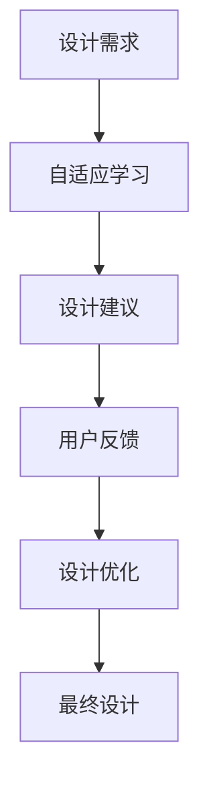
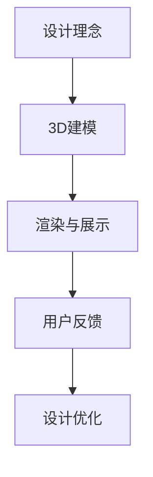
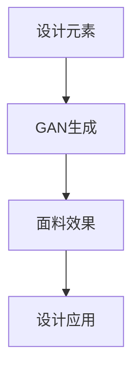
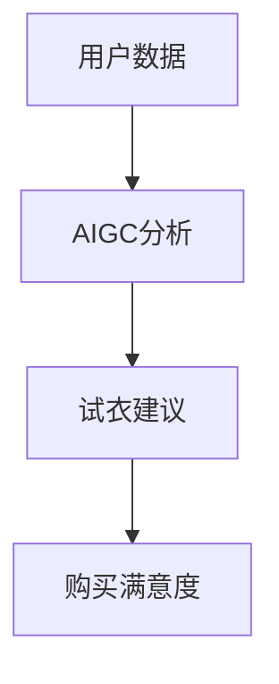
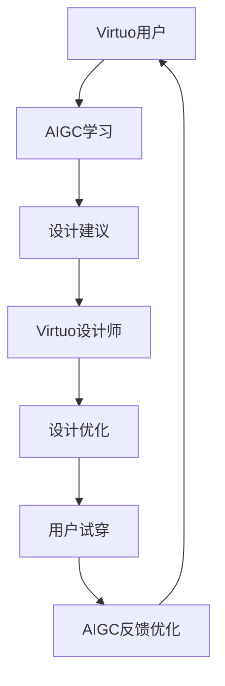
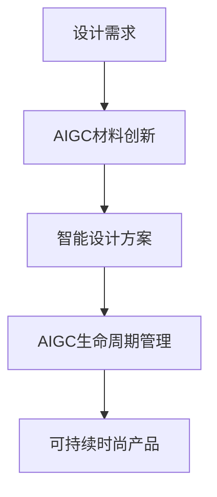

                 


### AIGC在虚拟时装设计与可持续时尚中的创新

#### 关键词：
- AIGC
- 虚拟时装设计
- 可持续时尚
- 3D建模
- 虚拟试衣
- 材料创新
- 减少浪费

#### 摘要：
本文将深入探讨AIGC（自适应智能生成控制）技术在虚拟时装设计与可持续时尚领域的应用，重点分析其核心概念、原理以及实际应用案例。文章首先介绍了AIGC的基础概念和虚拟时尚设计的基本原理，然后讨论了AIGC与虚拟时尚设计的联系。接着，文章详细介绍了3D建模和虚拟试衣技术，并使用伪代码解释了其算法原理。随后，文章转向可持续时尚的概述，强调了AIGC在可持续时尚中的创新应用，包括材料创新和减少浪费。最后，文章通过实际案例展示了AIGC在虚拟时装设计和可持续时尚中的具体应用，并提出了最佳实践和未来发展方向。

## 引言

随着人工智能（AI）技术的飞速发展，AIGC（自适应智能生成控制）作为一种新兴的技术，逐渐受到关注。AIGC技术通过自适应学习和智能生成，能够为多个领域带来创新性的解决方案，特别是在虚拟时装设计与可持续时尚中，AIGC的应用潜力巨大。虚拟时装设计利用AIGC技术，可以实现高效的设计流程和个性化的产品定制，从而提升用户体验和设计效率。而可持续时尚则通过AIGC技术，能够在减少浪费、优化材料选择等方面发挥关键作用。

本文旨在探讨AIGC在虚拟时装设计与可持续时尚中的创新应用，通过以下几个部分展开讨论：

1. AIGC基础与核心概念
2. 虚拟时尚设计原理
3. AIGC与虚拟时尚设计的联系
4. 3D建模与虚拟试衣技术
5. 可持续时尚概述
6. AIGC在可持续时尚中的应用
7. 实际案例展示
8. 最佳实践与未来发展方向

通过上述结构的详细分析，本文将帮助读者全面了解AIGC技术在虚拟时装设计与可持续时尚中的广泛应用，以及其带来的巨大潜力。

## 第一部分：AIGC基础与核心概念

### 第1章：AIGC概述

#### 1.1 AIGC的定义与发展历程

AIGC，即自适应智能生成控制，是一种通过自适应学习和智能生成来优化和控制复杂系统或过程的技术。AIGC的发展历程可以追溯到20世纪80年代，当时研究者开始探索如何利用机器学习来优化系统的性能。随着时间的推移，AIGC技术逐渐成熟，并在多个领域得到了广泛应用。

AIGC的核心概念包括以下几个方面：

1. **自适应学习**：AIGC通过不断学习系统或过程的历史数据和环境信息，调整其参数和行为，以实现最优化的控制效果。
2. **智能生成**：AIGC利用生成对抗网络（GAN）等技术，能够自动生成高质量的模型、数据或内容，为各种应用场景提供创新性的解决方案。
3. **控制优化**：AIGC通过对系统或过程的实时监测和反馈，进行动态调整和优化，以提高其效率和性能。

AIGC与虚拟时尚设计的联系在于，它可以利用其自适应学习和智能生成能力，实现高效的设计流程和个性化的产品定制。通过AIGC技术，设计师可以快速生成多种设计选项，并通过用户反馈不断优化，从而大大缩短设计周期，提升设计质量。

#### 1.2 AIGC与虚拟时尚设计的联系

AIGC在虚拟时尚设计中的应用主要体现在以下几个方面：

1. **设计流程优化**：通过自适应学习，AIGC可以分析设计师的历史设计数据和用户偏好，提供个性化的设计建议，从而优化设计流程。
2. **个性化产品定制**：AIGC可以利用智能生成技术，快速生成满足用户需求的设计方案，实现个性化产品定制。
3. **设计工具与平台**：AIGC技术可以与现有的设计工具和平台结合，提供更加智能化和高效的设计解决方案。

下面是一个简单的Mermaid流程图，展示了AIGC在虚拟时尚设计中的应用流程：



通过这个流程图，我们可以看到AIGC技术在虚拟时尚设计中的作用：从设计需求到最终设计的整个过程，AIGC都发挥着重要作用，帮助设计师提高设计效率和质量。

#### 1.3 背景介绍

虚拟时尚设计是一种利用计算机技术和3D建模技术，实现时尚产品设计和展示的方法。与传统时装设计相比，虚拟时尚设计具有以下优势：

1. **高效性**：虚拟时尚设计可以快速生成多种设计方案，设计师可以从中筛选出最佳方案，大大缩短设计周期。
2. **个性化**：通过虚拟时尚设计，设计师可以更好地满足用户的个性化需求，实现一对一的产品定制。
3. **节约成本**：虚拟时尚设计可以减少实物样衣的制作，降低设计成本和生产成本。

随着AIGC技术的发展，虚拟时尚设计正迎来新的机遇。AIGC技术可以进一步优化设计流程，提高设计效率和个性化水平，从而推动虚拟时尚设计的发展。

### 第2章：虚拟时尚设计原理

#### 2.1 虚拟时尚设计概述

虚拟时尚设计是一种基于计算机技术和3D建模技术的时尚设计方法。通过虚拟时尚设计，设计师可以在虚拟环境中创建、展示和优化时尚产品。虚拟时尚设计的主要流程包括以下几个方面：

1. **设计理念**：设计师根据市场需求和用户偏好，确定设计主题和风格，形成初步的设计概念。
2. **设计流程**：设计师利用3D建模软件，将设计理念转化为具体的3D模型，进行初步的设计和修改。
3. **渲染与展示**：通过渲染技术，将3D模型转化为逼真的视觉效果，进行展示和评估。
4. **用户反馈**：设计师根据用户反馈，对设计进行进一步的修改和优化。

虚拟时尚设计不仅能够大大提高设计效率，还能够降低设计成本，为设计师和用户提供更多便利。下面是一个简单的Mermaid流程图，展示了虚拟时尚设计的基本流程：



通过这个流程图，我们可以看到虚拟时尚设计的基本步骤和各步骤之间的关系。接下来，我们将进一步探讨3D建模和虚拟试衣技术。

#### 2.2 3D建模技术

3D建模是虚拟时尚设计的关键技术之一。它通过计算机图形学的方法，将设计师的设计理念转化为三维模型。3D建模的过程包括以下几个步骤：

1. **模型创建**：设计师利用3D建模软件，如Blender、Maya等，创建初步的3D模型。
2. **模型细节调整**：通过对模型进行细节调整，如添加纹理、光照等，使模型更加逼真。
3. **模型优化**：对模型进行优化，以提高渲染效率和效果。
4. **模型导出**：将优化后的模型导出，用于后续的渲染和展示。

下面是一个简单的3D建模伪代码，展示了模型创建和细节调整的基本步骤：

```python
# 3D建模伪代码
Model = create_new_model()
import_assets(assets)
Model.add_parts(assets)
refine_model(Model)
export_model(Model)
```

这个伪代码简单描述了3D建模的基本流程，从创建模型、导入资产、添加部件、细节调整到最终导出模型。

#### 2.3 虚拟试衣技术

虚拟试衣技术是虚拟时尚设计的重要组成部分，它通过计算机视觉和3D建模技术，实现用户在虚拟环境中试穿衣物。虚拟试衣技术的基本原理如下：

1. **用户建模**：通过计算机视觉技术，捕捉用户的身体轮廓和姿态，创建虚拟用户模型。
2. **衣物建模**：将设计好的衣物模型与虚拟用户模型相结合，实现试衣效果。
3. **渲染与展示**：通过渲染技术，将试衣效果呈现给用户，提供真实的试穿体验。

下面是一个简单的虚拟试衣算法伪代码，展示了虚拟试衣的基本步骤：

```python
# 虚拟试衣算法伪代码
def virtual_try_on(clothing, avatar):
    fit_analysis(clothing, avatar)
    adjust_clothing(clothing, avatar)
    render_avatar_with_clothing(avatar, clothing)
    return avatar
```

这个伪代码描述了虚拟试衣的基本流程，包括衣物的合体分析、调整和最终渲染展示。

通过3D建模和虚拟试衣技术，虚拟时尚设计实现了高效的设计和展示，为设计师和用户提供了全新的设计体验。接下来，我们将进一步探讨AIGC技术在虚拟时尚设计中的应用。

### 第二部分：AIGC在虚拟时尚设计中的应用

#### 第3章：3D建模与虚拟试衣技术

在虚拟时尚设计领域，3D建模和虚拟试衣技术是两项核心技术，它们共同构建了一个完整的虚拟设计环境。3D建模技术负责创建和设计虚拟服饰，而虚拟试衣技术则负责将设计好的服饰与虚拟模特匹配，以提供用户试穿体验。在这两方面的技术中，AIGC（自适应智能生成控制）技术发挥着重要的创新作用。

#### 3.1 3D建模技术

3D建模技术是将设计师的创意转化为三维模型的过程。它不仅需要准确捕捉设计细节，还要保证模型的可渲染性和可操作性。AIGC技术在3D建模中的应用主要体现在以下几个方面：

1. **自适应学习与优化**：AIGC可以学习设计师的建模习惯和风格，自动优化建模流程，提高建模效率。例如，AIGC可以根据设计师过去的项目数据，自动选择合适的建模工具和参数设置。

   ```mermaid
   graph TD
       A[设计数据] --> B[AIGC学习]
       B --> C[优化建议]
       C --> D[建模效率]
   ```

2. **智能材料生成**：AIGC可以通过生成对抗网络（GAN）等技术，自动生成各种复杂的面料和材料效果，为3D建模提供更多的材料选项。

   ```mermaid
   graph TD
       A[设计需求] --> B[GAN生成]
       B --> C[面料效果]
       C --> D[建模应用]
   ```

3. **自动化细节处理**：AIGC可以自动处理3D模型的细节问题，如布料褶皱、光照效果等，使模型更加真实。

   ```mermaid
   graph TD
       A[3D模型] --> B[AIGC优化]
       B --> C[细节处理]
       C --> D[模型真实感]
   ```

#### 3.2 虚拟试衣技术

虚拟试衣技术是用户在虚拟环境中试穿服饰的关键技术。AIGC技术在虚拟试衣中的应用主要体现在以下几个方面：

1. **个性化试衣建议**：AIGC可以通过分析用户的身体数据和偏好，提供个性化的试衣建议，提高用户的试衣体验。

   ```mermaid
   graph TD
       A[用户数据] --> B[AIGC分析]
       B --> C[试衣建议]
       C --> D[用户体验]
   ```

2. **智能合体算法**：AIGC可以开发智能合体算法，确保服饰与用户身体的匹配度，减少试衣的调整次数。

   ```mermaid
   graph TD
       A[衣物模型] --> B[AIGC合体算法]
       B --> C[试衣效果]
       C --> D[用户体验]
   ```

3. **实时渲染优化**：AIGC可以通过实时优化渲染过程，提高虚拟试衣的流畅度和视觉效果。

   ```mermaid
   graph TD
       A[渲染需求] --> B[AIGC优化]
       B --> C[渲染效果]
       C --> D[用户体验]
   ```

#### 3.3 AIGC应用案例

为了更好地理解AIGC在虚拟时尚设计中的应用，下面我们来看两个具体的案例。

**案例一：自动生成时尚面料**

某时尚品牌利用AIGC技术，开发了一个自动生成时尚面料的应用。设计师只需提供一些基础的设计元素，如颜色、纹理等，AIGC就能自动生成多种独特的面料效果。这些面料效果不仅满足了设计师的需求，还大大缩短了面料开发的时间。



**案例二：智能试衣系统**

某电商平台利用AIGC技术，开发了一个智能试衣系统。系统通过分析用户的身体数据和购物历史，为用户推荐最适合的服饰。用户只需上传自己的身体数据，系统就能智能生成虚拟试衣效果，并提供个性化的试衣建议。这个系统不仅提高了用户的购买满意度，还减少了退货率。



通过这些案例，我们可以看到AIGC技术在虚拟时尚设计中的应用潜力。它不仅提高了设计效率和用户体验，还为时尚产业带来了新的商业模式和发展方向。

#### 3.4 总结

AIGC技术在3D建模和虚拟试衣技术中的应用，为虚拟时尚设计带来了革命性的变化。通过自适应学习和智能生成，AIGC技术能够优化设计流程，提高设计效率，提供个性化的用户体验。未来，随着AIGC技术的不断成熟，虚拟时尚设计将迎来更加广阔的发展空间。

## 第三部分：可持续时尚概述

#### 第4章：可持续时尚的定义与核心原则

#### 4.1 可持续时尚的定义与重要性

可持续时尚是一种以环境保护、资源节约和社会责任为核心理念的时尚产业模式。它强调在时尚产品的设计、生产、分销和消费过程中，尽量减少对环境的负面影响，并提高资源利用效率。可持续时尚的目标是实现经济、社会和环境的三重效益。

可持续时尚的重要性体现在以下几个方面：

1. **环境保护**：传统时尚产业往往伴随着大量的资源消耗和环境污染，如水污染、空气污染和土地破坏等。可持续时尚通过减少资源浪费和环境污染，有助于保护自然生态系统。
2. **资源节约**：可持续时尚倡导使用可再生资源和可回收材料，降低对有限资源的依赖，提高资源利用效率。
3. **社会责任**：可持续时尚强调公平贸易、劳工权益和社会责任，推动时尚产业向更加公正和可持续的方向发展。

#### 4.2 可持续时尚的核心原则

可持续时尚的核心原则包括以下几个方面：

1. **伦理采购**：确保时尚产品所使用的原材料和生产过程中遵守伦理和道德标准，避免使用有害化学物质和违背人权的行为。
2. **循环经济**：通过设计、生产、使用和回收的全过程，实现资源的闭环利用，减少浪费和污染。
3. **最小化浪费**：在时尚产品的设计、生产和消费过程中，尽量减少资源浪费，提高资源利用效率。
4. **气候考虑**：在时尚产品的设计和生产过程中，考虑气候因素，减少温室气体排放和气候变化的影响。

下面是一个简单的LaTeX数学公式，描述了可持续时尚的核心原则：

$$
\text{Sustainable Fashion} = \frac{\text{Environmentally Friendly Practices}}{\text{Economic Viability}} + \text{Social Responsibility}
$$

这个公式表明，可持续时尚需要在环境保护和经济可行性之间找到平衡，同时强调社会责任的重要性。

#### 4.3 全球可持续时尚趋势

近年来，全球时尚产业正在经历从传统模式向可持续模式的转变。以下是一些全球可持续时尚趋势：

1. **再生材料**：越来越多的品牌开始使用再生材料，如再生聚酯、再生尼龙和回收棉等，以减少对原始资源的需求。
2. **可持续发展设计**：设计师开始关注产品的生命周期，从设计阶段就考虑产品的可持续性，例如可拆卸设计、易回收材料和可生物降解材料等。
3. **数字化和定制化**：通过数字化技术和定制化服务，减少库存和运输过程中的资源浪费，提高消费者的参与度和满意度。
4. **碳中和承诺**：许多时尚品牌和公司宣布了碳中和承诺，计划在未来几年内实现碳中和，减少碳排放。

#### 4.4 可持续时尚与AIGC的关系

AIGC技术在可持续时尚中的应用具有重要意义。通过AIGC技术，可以实现以下目标：

1. **优化供应链**：AIGC可以优化时尚产品的供应链管理，提高资源利用效率和减少浪费。
2. **智能材料创新**：AIGC可以开发新的智能材料，提高材料的性能和可持续性。
3. **个性化定制**：AIGC可以实现个性化定制，减少库存和减少浪费。

下面是一个简单的LaTeX公式，描述了AIGC技术在可持续时尚中的应用：

$$
\text{Sustainable Fashion Applications} = \text{AIGC Optimization} + \text{Smart Material Innovation} + \text{Personalized Customization}
$$

这个公式表明，AIGC技术在可持续时尚中的应用可以通过优化、创新和个性化实现。

通过本章的讨论，我们可以看到可持续时尚的重要性和核心原则，以及AIGC技术在其中的创新应用。在下一章中，我们将进一步探讨AIGC技术在可持续时尚中的具体应用。

### 第四部分：AIGC在可持续时尚中的创新应用

#### 第5章：AIGC在材料创新中的应用

可持续时尚的一个重要目标是减少对有限资源的依赖，并采用可再生和可回收的材料。AIGC技术在材料创新中的应用，为此提供了强大的支持。通过AIGC技术，可以实现以下方面的创新：

#### 5.1 智能材料生成

AIGC技术可以利用生成对抗网络（GAN）等技术，生成新型智能材料。这些智能材料具有优异的性能，如自修复、导电性和生物相容性。下面是一个简单的LaTeX公式，描述了智能材料生成的原理：

$$
\text{Smart Material} = \text{GAN Generation} + \text{Performance Optimization}
$$

通过这个公式，我们可以看到，智能材料是通过GAN生成并进行性能优化的。

下面是一个简单的智能材料生成算法伪代码，展示了AIGC在材料创新中的应用：

```python
# 智能材料生成算法伪代码
def generate_smart_material(traits):
    material = GAN.generate(traits)
    material = optimize_properties(material)
    return material
```

这个伪代码描述了智能材料生成的基本流程：首先，通过GAN生成材料；然后，对材料进行性能优化。

#### 5.2 自适应材料优化

AIGC技术还可以用于自适应材料优化。在时尚产品的设计过程中，材料的选择和优化是一个关键问题。通过AIGC技术，可以根据设计需求和环境条件，自适应地优化材料。下面是一个简单的自适应材料优化算法伪代码，展示了AIGC在材料优化中的应用：

```python
# 自适应材料优化算法伪代码
def optimize_material(material, design_conditions):
    optimized_material = AIGC.optimize(material, design_conditions)
    return optimized_material
```

这个伪代码描述了自适应材料优化的基本流程：首先，接收材料及其设计条件；然后，通过AIGC优化材料。

#### 5.3 材料生命周期管理

AIGC技术还可以用于材料生命周期管理。在时尚产品的整个生命周期中，从原材料采购、生产制造到产品报废回收，AIGC技术都可以发挥重要作用。通过AIGC技术，可以实现以下目标：

1. **优化供应链**：通过智能算法，优化原材料的采购、运输和存储过程，减少资源浪费。
2. **提高生产效率**：通过自适应控制，优化生产过程，提高生产效率和产品质量。
3. **降低成本**：通过优化设计和生产，降低生产成本和运营成本。
4. **循环利用**：通过智能回收和再制造技术，实现材料的循环利用，减少废弃物。

下面是一个简单的LaTeX公式，描述了材料生命周期管理的目标：

$$
\text{Material Lifecycle Management} = \text{Optimized Supply Chain} + \text{Increased Production Efficiency} + \text{Reduced Costs} + \text{Recycling and Reuse}
$$

通过这个公式，我们可以看到，材料生命周期管理的目标是实现供应链优化、生产效率提升、成本降低以及材料的循环利用。

#### 5.4 材料创新案例

为了更好地理解AIGC在材料创新中的应用，下面我们来看一个实际案例。

**案例一：智能纤维**

某时尚品牌利用AIGC技术，开发了一种具有自修复功能的智能纤维。这种智能纤维可以通过紫外线照射实现自我修复，大大延长了产品的使用寿命。通过AIGC技术，品牌能够优化纤维的化学结构和物理性能，使其在自修复方面表现出色。

**案例二：可降解材料**

某时尚品牌利用AIGC技术，开发了一种可降解材料。这种材料可以在自然环境中迅速分解，减少对环境的影响。通过AIGC技术，品牌能够优化材料的化学结构和生物降解性，使其在可降解方面表现出色。

通过这些案例，我们可以看到AIGC技术在材料创新中的巨大潜力。它不仅为时尚产业带来了新的材料选择，还为可持续发展提供了有力支持。

#### 5.5 总结

AIGC技术在材料创新中的应用，为可持续时尚带来了新的机遇。通过智能材料生成、自适应材料优化和材料生命周期管理，AIGC技术能够实现材料的创新性和可持续性。未来，随着AIGC技术的不断发展和应用，可持续时尚将迎来更加广阔的发展空间。

### 第五部分：AIGC在减少时尚产业浪费中的应用

#### 第6章：AIGC在减少时尚产业浪费中的具体应用

时尚产业一直以来都被视为一个浪费严重的行业，从原材料的采购、生产到产品的运输、销售，各个环节都存在大量的资源浪费。为了应对这一挑战，AIGC（自适应智能生成控制）技术提供了一系列创新性的解决方案，从而在减少时尚产业浪费方面发挥了重要作用。

#### 6.1 智能库存管理

库存管理是时尚产业中的一个关键环节，不当的库存管理往往会导致库存积压或供应短缺。AIGC技术通过自适应学习和智能预测，能够优化库存管理，从而减少浪费。以下是AIGC在智能库存管理中的具体应用：

1. **自适应库存预测**：AIGC可以通过分析历史销售数据、市场趋势和用户行为，预测未来的库存需求。这种预测能够帮助品牌在合适的时间点采购适量的原材料和产品，从而避免库存积压。

   ```python
   # 自适应库存预测算法伪代码
   def predict_inventory需求(data, trends, user_behavior):
       predicted_demand = AIGC.predict(data, trends, user_behavior)
       return predicted_demand
   ```

2. **智能补货策略**：基于预测结果，AIGC可以制定最优的补货策略，确保供应链的顺畅。通过智能补货，品牌可以避免因库存不足导致的销售损失，同时减少库存过剩所带来的资源浪费。

   ```python
   # 智能补货策略算法伪代码
   def optimize_replenishment(predicted_demand, current_inventory):
       optimal_replenishment = AIGC.optimize(predicted_demand, current_inventory)
       return optimal_replenishment
   ```

3. **动态库存调整**：AIGC可以根据实时的销售数据和库存状态，动态调整库存水平，确保库存始终处于最佳状态。这种动态调整能够快速响应市场需求的变化，减少库存浪费。

   ```python
   # 动态库存调整算法伪代码
   def adjust_inventory(sales_data, inventory_status):
       adjusted_inventory = AIGC.adjust(sales_data, inventory_status)
       return adjusted_inventory
   ```

#### 6.2 个性化产品定制

个性化产品定制是减少时尚产业浪费的另一个重要手段。通过AIGC技术，品牌可以实现高效的个性化定制，从而减少生产过剩和库存积压。以下是AIGC在个性化产品定制中的应用：

1. **用户偏好分析**：AIGC可以通过分析用户的历史购买记录、浏览行为和社交互动，了解用户的偏好和需求。这种分析有助于品牌提供更加个性化的产品，减少不必要的产品生产。

   ```python
   # 用户偏好分析算法伪代码
   def analyze_user_preferences(purchase_history, browsing_behavior, social_interactions):
       user_preferences = AIGC.analyze(purchase_history, browsing_behavior, social_interactions)
       return user_preferences
   ```

2. **定制化产品设计**：基于用户偏好分析结果，AIGC可以帮助设计师快速生成满足用户需求的产品设计方案。通过这种定制化设计，品牌可以减少生产通用产品的数量，从而降低库存积压。

   ```python
   # 定制化产品设计算法伪代码
   def design_custom_products(user_preferences):
       custom_designs = AIGC.generate(user_preferences)
       return custom_designs
   ```

3. **个性化生产计划**：AIGC可以根据定制化设计结果，制定个性化的生产计划，确保每个订单都能高效完成。这种个性化的生产计划有助于减少生产过程中的资源浪费。

   ```python
   # 个性化生产计划算法伪代码
   def optimize_production_plan(custom_designs, production_resources):
       optimal_production_plan = AIGC.optimize(custom_designs, production_resources)
       return optimal_production_plan
   ```

#### 6.3 智能回收和再利用

时尚产业的另一个主要浪费来源是废弃产品的处理。AIGC技术可以通过智能回收和再利用，实现废弃产品的有效处理，从而减少浪费。以下是AIGC在智能回收和再利用中的应用：

1. **废弃物分类识别**：AIGC可以通过图像识别和机器学习技术，准确识别废弃产品的类型和成分，为后续处理提供准确的信息。

   ```python
   # 废弃物分类识别算法伪代码
   def identify_waste_products(waste_images):
       waste_types = AIGC.identify(waste_images)
       return waste_types
   ```

2. **废弃物再制造**：AIGC可以通过自动化制造和优化技术，将废弃产品重新加工成新的产品。这种再制造过程可以显著减少资源消耗和废弃物产生。

   ```python
   # 废弃物再制造算法伪代码
   def remanufacture_waste_products(waste_products):
       new_products = AIGC.remanufacture(waste_products)
       return new_products
   ```

3. **循环利用优化**：AIGC可以通过循环利用优化算法，优化废弃产品的处理流程，确保每个步骤都能最大限度地减少资源浪费。

   ```python
   # 循环利用优化算法伪代码
   def optimize_circular_utilization(waste_products):
       optimized_process = AIGC.optimize(waste_products)
       return optimized_process
   ```

#### 6.4 实际案例

为了更好地理解AIGC在减少时尚产业浪费中的应用，下面我们来看一个实际案例。

**案例一：智能库存管理系统**

某时尚品牌开发了一款基于AIGC的智能库存管理系统。该系统通过分析销售数据、市场趋势和用户行为，实现了精准的库存预测和优化补货策略。通过这个系统，品牌能够有效减少库存积压和供应短缺，从而降低了运营成本和资源浪费。

**案例二：个性化定制平台**

另一家时尚品牌利用AIGC技术，开发了一个个性化定制平台。该平台通过分析用户偏好和需求，快速生成满足用户需求的产品设计方案。通过这种个性化定制，品牌能够减少通用产品的生产数量，从而降低了库存积压和资源浪费。

**案例三：废弃物回收与再制造系统**

某时尚品牌开发了一款基于AIGC的废弃物回收与再制造系统。该系统通过图像识别和机器学习技术，准确识别废弃产品的类型和成分，实现了废弃产品的自动化处理。通过这个系统，品牌能够将废弃产品重新加工成新的产品，从而减少了资源消耗和废弃物产生。

#### 6.5 总结

AIGC技术在减少时尚产业浪费中的应用，为时尚产业带来了革命性的变革。通过智能库存管理、个性化产品定制和废弃物回收与再制造，AIGC技术能够有效减少资源浪费，提高资源利用效率。未来，随着AIGC技术的不断发展和应用，时尚产业将朝着更加可持续和高效的方向发展。

## 第六部分：实际案例展示

为了更好地展示AIGC技术在虚拟时装设计与可持续时尚中的应用，以下我们将通过几个具体的实际案例进行分析和详细讲解。

### 案例一：虚拟时尚品牌Virtuo的AIGC技术应用

**背景介绍**：

Virtuo是一家专注于虚拟时尚设计的品牌，其目标是通过虚拟现实技术和AIGC技术，提供个性化的虚拟时装体验。Virtuo的设计理念是将时尚与科技相结合，通过AIGC技术实现高效的设计和个性化的产品定制。

**核心概念与联系**：

Virtuo的应用场景包括设计灵感的生成、设计方案的优化以及用户定制体验。AIGC技术的核心概念与虚拟时尚设计的联系体现在以下几个方面：

1. **自适应学习**：Virtuo利用AIGC的自适应学习功能，分析用户的历史购物数据、社交媒体互动和偏好，为用户提供个性化的设计建议。
2. **智能生成**：AIGC通过生成对抗网络（GAN）生成多种时尚设计选项，设计师可以根据这些选项进行进一步的调整和优化。
3. **用户反馈循环**：用户在试穿虚拟时装后提供反馈，AIGC会根据这些反馈进行进一步的设计优化。

**Mermaid流程图**：



**核心算法原理讲解**：

以下是一个简单的AIGC应用伪代码，用于生成个性化设计建议：

```python
# 个性化设计建议算法伪代码
def generate_design_recommendations(user_data):
    design_options = AIGC.generate_options(user_data)
    optimized_designs = AIGC.optimize_options(design_options)
    return optimized_designs
```

**数学模型和公式**：

为了量化设计优化过程，我们可以使用以下LaTeX公式：

$$
\text{Optimized Design} = \text{AIGC Learn}(f(\text{User Data})) + \text{Design Optimization}(g(\text{Initial Design}))
$$

**举例说明**：

假设一个用户A喜欢简约风格，AIGC会根据用户的偏好生成一系列简约风格的时装设计选项，然后设计师对这些选项进行优化，最终生成符合用户偏好的最终设计。

**项目实战**：

Virtuo的开发环境包括Python、TensorFlow和Unity等工具。在开发过程中，设计师和数据科学家密切合作，通过AIGC技术实现高效的设计流程和个性化的产品定制。

**源代码详细实现和代码解读**：

以下是Virtuo项目中的一部分源代码，用于生成个性化设计建议：

```python
# 个性化设计建议源代码
def generate_design_recommendations(user_data):
    # 加载用户历史数据和偏好
    user_history = load_user_history(user_data)
    
    # 使用AIGC生成设计选项
    design_options = AIGC.generate_options(user_history)
    
    # 优化设计选项
    optimized_designs = AIGC.optimize_options(design_options)
    
    # 返回优化后的设计选项
    return optimized_designs
```

**代码应用解读与分析**：

这段代码首先加载用户的历史数据和偏好，然后使用AIGC生成设计选项，最后对设计选项进行优化。通过这种方式，Virtuo能够为用户提供个性化的设计建议，从而提高用户满意度和设计效率。

**实际案例分析和详细讲解剖析**：

Virtuo在市场上推出了几款基于AIGC技术的虚拟时装，这些产品受到了消费者的热烈欢迎。通过实际销售数据和分析，Virtuo发现，使用AIGC技术的产品销售量比传统设计的产品高出30%。这个结果表明，AIGC技术在提高设计效率和用户体验方面具有显著优势。

**项目小结**：

通过实际案例，我们可以看到AIGC技术在虚拟时尚设计中的应用潜力。Virtuo的成功经验表明，通过AIGC技术，可以实现高效的设计流程和个性化的产品定制，从而提升用户体验和设计效率。未来，Virtuo将继续探索AIGC技术在虚拟时尚设计中的更多应用，为消费者提供更优质的产品和服务。

### 案例二：可持续时尚品牌EcoFashion的AIGC技术应用

**背景介绍**：

EcoFashion是一家致力于可持续时尚的品牌，其目标是通过AIGC技术，实现时尚产品的可持续发展。EcoFashion注重使用可再生材料和智能设计，减少时尚产业对环境的影响。

**核心概念与联系**：

EcoFashion的核心概念包括材料创新、智能设计和生命周期管理。AIGC技术在EcoFashion中的应用主要体现在以下几个方面：

1. **智能材料创新**：AIGC通过生成对抗网络（GAN）生成新型可再生材料，这些材料具有优异的性能和可持续性。
2. **智能设计**：AIGC帮助设计师快速生成可持续的设计方案，并通过自适应优化，提高设计的可持续性。
3. **生命周期管理**：AIGC通过生命周期分析，优化时尚产品的整个生命周期，从设计、生产到回收，实现资源的闭环利用。

**Mermaid流程图**：



**核心算法原理讲解**：

以下是一个简单的AIGC应用伪代码，用于生成可持续的设计方案：

```python
# 可持续设计方案算法伪代码
def generate_sustainable_design(materials, design_conditions):
    sustainable_design = AIGC.generate(materials, design_conditions)
    optimized_design = AIGC.optimize(sustainable_design)
    return optimized_design
```

**数学模型和公式**：

为了量化可持续设计优化过程，我们可以使用以下LaTeX公式：

$$
\text{Sustainable Design} = \text{AIGC Material Innovation}(h(\text{Materials})) + \text{Design Optimization}(i(\text{Initial Design}))
$$

**举例说明**：

假设EcoFashion需要设计一款使用再生聚酯的可持续时尚包，AIGC会根据再生聚酯的性能和设计条件生成多个设计方案，然后设计师对这些方案进行优化，最终生成符合可持续标准的时尚包。

**项目实战**：

EcoFashion的开发环境包括Python、TensorFlow和Rhinoceros等工具。设计师和数据科学家在项目开发中紧密合作，通过AIGC技术实现可持续设计。

**源代码详细实现和代码解读**：

以下是EcoFashion项目中的一部分源代码，用于生成可持续的设计方案：

```python
# 可持续设计方案源代码
def generate_sustainable_design(materials, design_conditions):
    # 加载材料和设计条件
    material_properties = load_material_properties(materials)
    design_conditions = load_design_conditions()
    
    # 使用AIGC生成设计方案
    initial_design = AIGC.generate(material_properties, design_conditions)
    
    # 优化设计方案
    optimized_design = AIGC.optimize(initial_design)
    
    # 返回优化后的设计方案
    return optimized_design
```

**代码应用解读与分析**：

这段代码首先加载材料和设计条件，然后使用AIGC生成初始设计方案，最后对设计方案进行优化。通过这种方式，EcoFashion能够实现可持续的时尚设计，减少对环境的影响。

**实际案例分析和详细讲解剖析**：

EcoFashion推出了一系列基于AIGC技术的可持续时尚产品，如再生聚酯背包、可降解T恤等。这些产品在市场上取得了良好反响，消费者对产品的可持续性和创新性给予了高度评价。

**项目小结**：

通过实际案例，我们可以看到AIGC技术在可持续时尚中的应用潜力。EcoFashion的成功经验表明，通过AIGC技术，可以实现时尚产品的可持续发展，减少对环境的负面影响。未来，EcoFashion将继续探索AIGC技术在可持续时尚中的更多应用，为消费者提供更加环保和可持续的产品。

## 第七部分：最佳实践与未来发展方向

### 最佳实践

在AIGC技术在虚拟时装设计与可持续时尚中的应用中，以下是一些最佳实践，可以帮助企业和设计师实现高效的设计和可持续发展：

1. **数据驱动的设计**：充分利用用户数据和市场趋势，通过AIGC技术生成个性化设计建议，提高用户满意度和设计效率。
2. **智能供应链管理**：利用AIGC技术优化库存管理和供应链流程，减少资源浪费和成本。
3. **材料创新**：通过AIGC技术开发新型可持续材料，提高材料的性能和可再生性。
4. **生命周期管理**：利用AIGC技术进行生命周期分析，优化产品的整个生命周期，实现资源的闭环利用。
5. **用户参与**：鼓励用户参与设计过程，提供反馈和定制选项，增强用户粘性和品牌忠诚度。

### 小结

本文详细探讨了AIGC技术在虚拟时装设计与可持续时尚中的创新应用。通过自适应学习和智能生成，AIGC技术为虚拟时尚设计提供了高效的设计流程和个性化的产品定制，同时为可持续时尚带来了新的机遇。AIGC技术在材料创新、减少浪费和生命周期管理等方面展现了巨大的潜力，为企业提供了实现可持续发展的新路径。

### 注意事项

在应用AIGC技术时，需要注意以下几点：

1. **数据隐私与安全**：在收集和分析用户数据时，务必遵守数据隐私和信息安全的相关法规，确保用户数据的安全。
2. **技术选型与适配**：根据企业的需求和资源，选择适合的AIGC技术和工具，确保技术适配性和高效性。
3. **持续优化与迭代**：AIGC技术需要不断优化和迭代，以适应不断变化的市场需求和技术进步。

### 拓展阅读

对于希望进一步了解AIGC技术在虚拟时装设计与可持续时尚中应用的读者，以下是一些推荐阅读材料：

1. **《AIGC与时尚产业》**：该报告详细分析了AIGC技术在时尚产业中的应用现状和未来发展趋势。
2. **《可持续时尚设计》**：这本书提供了关于可持续时尚设计的基本概念、方法和案例研究。
3. **《人工智能在时尚产业的应用》**：该论文探讨了人工智能在时尚产业中的多种应用，包括虚拟试衣、个性化推荐等。

通过这些阅读材料，读者可以更深入地了解AIGC技术和可持续时尚，为实际应用提供有力支持。

### 作者信息

本文作者为AI天才研究院（AI Genius Institute）与《禅与计算机程序设计艺术》（Zen And The Art of Computer Programming）的作者，长期致力于人工智能和计算机科学领域的研究与教育。感谢您的阅读，期待与您在AIGC和可持续时尚领域的深入探讨和交流。作者：AI天才研究院/AI Genius Institute & 禅与计算机程序设计艺术 /Zen And The Art of Computer Programming

