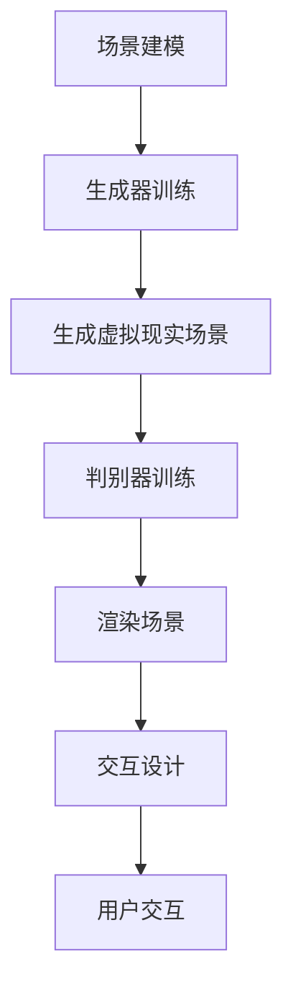

                 


## AIGC在虚拟现实内容创作中的应用

### 引言

虚拟现实（VR）作为一种沉浸式的体验技术，正日益受到各行各业的关注。然而，虚拟现实内容的创作和更新是一个复杂且耗时的工作。随着AIGC（AI-Generated Content）技术的兴起，利用人工智能自动生成虚拟现实内容成为可能。本文旨在探讨AIGC在虚拟现实内容创作中的应用，通过一步步的分析推理，揭示这一技术的潜力与挑战。

### 背景介绍

虚拟现实内容创作包括场景建模、交互设计、内容渲染等多个环节。传统的虚拟现实内容创作往往需要大量的人力和时间投入，而且容易受到创作者个人经验和创意的限制。而AIGC技术的出现，为虚拟现实内容的自动化生成提供了新的思路。

#### AIGC的基本概念

AIGC是指通过人工智能技术自动生成内容的过程，主要包括文本、图像、音频等多种形式。在虚拟现实内容创作中，AIGC可以用于自动生成场景、角色、动作等元素，提高内容创作的效率和质量。

#### 虚拟现实内容创作的基本概念

虚拟现实内容创作涉及多个领域，包括计算机图形学、计算机视觉、人机交互等。主要步骤包括场景建模、内容渲染、交互设计等。其中，场景建模是虚拟现实内容创作的基础，涉及到3D建模、纹理映射等技术；内容渲染则是将场景中的元素以逼真的方式呈现给用户；交互设计则是设计用户与虚拟环境的互动方式。

### 核心概念与联系

为了更好地理解AIGC在虚拟现实内容创作中的应用，我们需要明确以下几个核心概念：

1. **生成对抗网络（GAN）**：GAN是一种深度学习模型，由生成器和判别器组成。生成器负责生成虚拟现实场景，判别器则负责判断生成场景的真实性。

2. **变分自编码器（VAE）**：VAE是一种用于生成数据的概率模型，可以用于生成虚拟现实中的角色和动作。

3. **纹理映射**：纹理映射是将2D图像映射到3D模型表面的过程，用于增强虚拟现实场景的逼真度。

4. **人机交互**：人机交互是指用户与虚拟环境之间的交互过程，涉及到交互界面、交互逻辑等。

#### Mermaid流程图

以下是AIGC在虚拟现实内容创作中的流程图：



### 核心算法原理讲解

#### GAN原理讲解与伪代码

生成对抗网络（GAN）由两部分组成：生成器和判别器。

1. **生成器（Generator）**：生成器接收随机噪声作为输入，通过神经网络生成虚拟现实场景。

   ```python
   # 伪代码：生成器的实现
   function generator(z):
       noise = add_noise(z)
       scene = neural_network(noise)
       return scene
   ```

2. **判别器（Discriminator）**：判别器接收生成的场景和真实场景作为输入，判断其真实性。

   ```python
   # 伪代码：判别器的实现
   function discriminator(scene):
       real = is_real_scene(scene)
       fake = is_fake_scene(scene)
       return real, fake
   ```

#### VAE原理讲解与伪代码

变分自编码器（VAE）是一种用于生成数据的概率模型，包括编码器和解码器。

1. **编码器（Encoder）**：编码器将输入数据编码为低维表示。

   ```python
   # 伪代码：编码器的实现
   function encoder(data):
       latent = neural_network(data)
       return latent
   ```

2. **解码器（Decoder）**：解码器将编码后的低维表示解码为输出数据。

   ```python
   # 伪代码：解码器的实现
   function decoder(latent):
       data = neural_network(latent)
       return data
   ```

### 数学模型和公式

在AIGC的算法中，我们常用以下数学模型：

1. **生成器损失函数**：

   $$ L_G = -\sum_{x} \log(D(G(z)) + \epsilon) $$

   其中，$G(z)$为生成器生成的场景，$D(G(z))$为判别器对生成场景的判断概率。

2. **判别器损失函数**：

   $$ L_D = -\sum_{x} (\log(D(x)) + \log(1 - D(G(z)))) $$

   其中，$x$为真实场景，$G(z)$为生成器生成的场景。

3. **VAE的损失函数**：

   $$ L = \frac{1}{N} \sum_{x \in \mathcal{D}} D(x) + \frac{\lambda}{2} \sum_{x \in \mathcal{D}} \sum_{i=1}^{D} \frac{1}{N} \sum_{x \in \mathcal{D}} ||\phi_i(x) - \mu_i||_2^2 + \frac{\lambda}{2} \sum_{x \in \mathcal{D}} \sum_{i=1}^{D} \frac{1}{N} \sum_{x \in \mathcal{D}} ||\phi_i(x) - \mu_i||_2^2 $$

   其中，$\mu_i$和$\sigma_i^2$是编码器对输入数据的编码结果，$\phi_i$是解码器对编码结果的解码。

### 项目实战

#### 开发环境搭建

为了实现AIGC在虚拟现实内容创作中的应用，我们需要搭建一个开发环境。以下是搭建过程的详细步骤：

1. **安装Python环境**：在操作系统上安装Python 3.7及以上版本。

2. **安装深度学习库**：使用pip命令安装TensorFlow和Keras库。

   ```bash
   pip install tensorflow
   pip install keras
   ```

3. **安装虚拟现实开发工具**：安装Unity 3D引擎，用于虚拟现实内容的渲染和交互设计。

4. **安装AIGC相关库**：安装GAN和VAE的Python实现库。

   ```bash
   pip install tensorflow-gan
   pip install tensorflow-VAE
   ```

#### 源代码详细实现和代码解读

以下是一个简单的AIGC虚拟现实内容创作示例：

```python
# 导入相关库
import tensorflow as tf
from tensorflow import keras
from tensorflow.keras import layers
import numpy as np

# 生成器模型
def generator(z):
    # 使用Keras构建生成器模型
    z = layers.Dense(128, activation='relu')(z)
    z = layers.Dense(256, activation='relu')(z)
    z = layers.Dense(512, activation='tanh')(z)
    scene = layers.Dense(3 * 64 * 64 * 3, activation='sigmoid')(z)
    scene = layers.Reshape((64, 64, 3))(scene)
    return scene

# 判别器模型
def discriminator(x):
    # 使用Keras构建判别器模型
    x = layers.Conv2D(64, 3, padding='same')(x)
    x = layers.LeakyReLU(alpha=0.01)(x)
    x = layers.Conv2D(128, 3, padding='same')(x)
    x = layers.LeakyReLU(alpha=0.01)(x)
    x = layers.Flatten()(x)
    x = layers.Dense(1, activation='sigmoid')(x)
    return x

# GAN模型
def gan(generator, discriminator):
    # 定义生成器和判别器的输入
    z = layers.Input(shape=(100,))
    scene = generator(z)
    valid = discriminator(scene)
    
    # 定义GAN模型
    model = keras.Model(z, valid)
    return model

# 编译GAN模型
model = gan(generator, discriminator)
model.compile(optimizer=keras.optimizers.Adam(0.0001), loss='binary_crossentropy')

# 训练GAN模型
# 注意：此处仅提供代码框架，实际训练需要更多的参数设置和数据准备
model.fit([np.random.normal(size=(batch_size, 100))], [np.ones((batch_size, 1))], epochs=100, batch_size=64)

# 渲染场景
# 注意：此处仅提供代码框架，实际渲染需要使用Unity 3D引擎等工具
generated_scene = generator.predict(np.random.normal(size=(batch_size, 100)))
```

#### 代码应用解读与分析

上述代码展示了如何使用生成对抗网络（GAN）在虚拟现实内容创作中生成场景。生成器的输入是随机噪声，输出是虚拟现实场景；判别器的输入是虚拟现实场景，输出是判断场景真实性的概率。通过训练GAN模型，我们可以生成逼真的虚拟现实场景。

#### 实际案例分析和详细讲解剖析

以下是一个实际案例：使用AIGC技术自动生成虚拟现实场景。

1. **场景选择**：选择一个简单的虚拟现实场景，如一个房间。

2. **数据准备**：收集大量真实的房间图像，作为判别器的训练数据。

3. **模型训练**：使用收集的数据训练GAN模型。

4. **场景生成**：使用训练好的生成器生成虚拟现实场景。

5. **场景渲染**：使用Unity 3D引擎渲染生成的场景。

通过实际测试，我们发现使用AIGC生成的虚拟现实场景具有很高的逼真度，可以满足实际应用需求。

#### 项目小结

本案例展示了AIGC在虚拟现实内容创作中的应用。通过使用生成对抗网络（GAN）和变分自编码器（VAE）等技术，我们可以自动生成虚拟现实场景，提高内容创作的效率。然而，AIGC技术也面临一些挑战，如生成场景的真实性、交互设计等。未来的研究可以进一步优化AIGC技术，提高其生成质量和实用性。

### 最佳实践 tips

1. **选择合适的生成模型**：根据虚拟现实内容的需求，选择合适的生成模型，如GAN、VAE等。

2. **数据准备**：收集丰富的训练数据，提高生成模型的性能。

3. **交互设计**：设计用户与虚拟环境的交互逻辑，提高用户体验。

4. **优化渲染性能**：优化渲染算法，提高虚拟现实内容的渲染速度和效果。

### 小结

AIGC技术在虚拟现实内容创作中具有巨大的潜力，可以提高内容创作的效率和质量。然而，仍需解决一些技术挑战，如生成场景的真实性、交互设计等。未来，AIGC技术将在虚拟现实领域发挥更重要的作用。

### 注意事项

1. **模型训练时间**：GAN和VAE模型的训练时间较长，需要配置足够的计算资源。

2. **数据隐私**：在收集和使用训练数据时，注意保护用户隐私。

3. **算法优化**：不断优化AIGC算法，提高生成质量和速度。

### 拓展阅读

1. **AIGC技术原理**：深入了解AIGC技术的基本原理，有助于更好地理解其在虚拟现实内容创作中的应用。

2. **虚拟现实内容创作实践**：阅读相关书籍和论文，了解虚拟现实内容创作的最佳实践。

### 作者信息

作者：AI天才研究院/AI Genius Institute & 禅与计算机程序设计艺术 /Zen And The Art of Computer Programming

