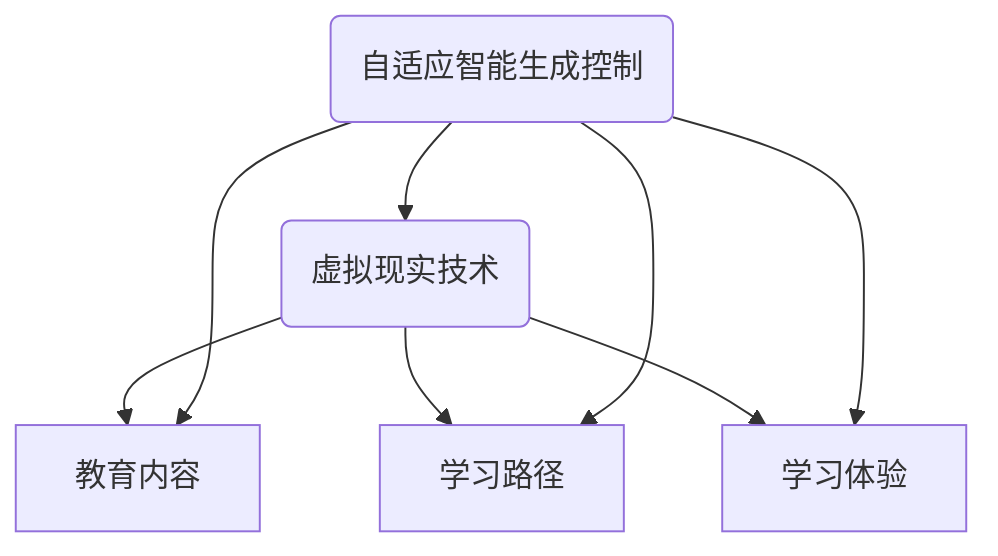

                 

### 文章标题

# AIGC在虚拟现实教育中的应用：沉浸式学习体验设计

### 文章关键词

- AIGC
- 虚拟现实教育
- 沉浸式学习体验
- 教育技术
- 深度学习

### 文章摘要

本文探讨了AIGC（自适应智能生成控制）在虚拟现实教育中的应用，并深入分析了沉浸式学习体验的设计方法。通过介绍AIGC的基本概念、虚拟现实技术在教育中的应用场景以及沉浸式学习体验的设计原则，本文旨在为教育科技领域提供一种新的视角和解决方案。同时，通过案例研究和项目实战，本文展示了AIGC在虚拟现实教育中的实际应用效果，并探讨了未来虚拟现实教育的发展趋势和挑战。

### 目录

1. **AIGC基本概念与虚拟现实教育**
   1.1 **AIGC概述**
   1.2 **虚拟现实技术的基本原理**
   1.3 **AIGC与虚拟现实教育的联系**

2. **虚拟现实技术在教育中的应用**
   2.1 **虚拟现实技术的应用场景**
   2.2 **虚拟现实在教学中的优势**
   2.3 **虚拟现实技术的教育案例**

3. **沉浸式学习体验设计方法**
   3.1 **沉浸式学习体验的定义**
   3.2 **沉浸式学习体验设计的原则**
   3.3 **沉浸式学习体验设计的步骤**

4. **AIGC在虚拟现实教育中的案例研究**
   4.1 **案例一：虚拟现实英语教学**
   4.2 **案例二：虚拟现实历史课堂**
   4.3 **案例三：虚拟现实科学实验**

5. **虚拟现实教育中的技术挑战与解决方案**
   5.1 **技术挑战**
   5.2 **技术解决方案**
   5.3 **技术发展趋势**

6. **虚拟现实教育的未来发展趋势**
   6.1 **教育技术的未来发展**
   6.2 **虚拟现实教育的市场前景**
   6.3 **虚拟现实教育的未来挑战**

7. **总结与展望**
   7.1 **总结**
   7.2 **展望**

### 第一步：AIGC基本概念与虚拟现实教育

#### 1.1 AIGC概述

AIGC（Adaptive Intelligent Generation Control，自适应智能生成控制）是一种基于深度学习和自然语言处理技术的智能控制系统。它通过不断学习和适应用户行为，自动生成和调整虚拟环境中的内容，实现高度个性化的用户体验。AIGC的核心在于其强大的自适应能力和生成能力，能够根据用户的需求和反馈，实时调整虚拟现实环境中的场景、角色和交互。

AIGC的应用领域非常广泛，包括但不限于虚拟现实教育、游戏、娱乐、广告、智能家居等。在教育领域，AIGC可以通过智能生成教学内容、模拟真实场景、个性化定制学习路径等方式，提高学习效率、增强学习体验。

#### 1.2 虚拟现实技术的基本原理

虚拟现实（Virtual Reality，VR）是一种通过计算机技术和传感器设备模拟出逼真的三维虚拟环境，让用户在其中进行交互和体验的技术。虚拟现实技术的基本原理主要包括以下几个方面：

1. **三维建模与渲染**：通过三维建模工具和渲染技术，创建出逼真的虚拟场景和物体。

2. **传感器与定位技术**：使用传感器和定位技术，实时捕捉用户的动作和位置，实现虚拟环境和现实世界的同步。

3. **交互技术**：通过手柄、手套、眼镜等设备，实现用户与虚拟环境的交互。

4. **声音技术**：利用立体声和3D音效技术，模拟真实环境中的声音效果，增强沉浸感。

虚拟现实技术在教育中的应用，主要体现在以下几个方面：

1. **模拟真实场景**：通过虚拟现实技术，可以模拟出各种真实场景，如历史遗址、自然景观、实验设备等，让学生身临其境地进行学习。

2. **互动式教学**：虚拟现实技术可以提供丰富的互动式教学内容，如虚拟实验、虚拟课堂等，激发学生的学习兴趣和积极性。

3. **个性化学习**：虚拟现实技术可以根据学生的学习情况，自动生成个性化的学习路径和教学内容，提高学习效率。

#### 1.3 AIGC与虚拟现实教育的联系

AIGC与虚拟现实教育的联系主要体现在以下几个方面：

1. **智能生成内容**：AIGC可以通过智能算法，自动生成虚拟现实教学内容，提高教学内容的个性化和互动性。

2. **自适应学习路径**：AIGC可以根据学生的学习情况，自动调整虚拟现实环境中的学习路径，实现个性化教学。

3. **沉浸式学习体验**：AIGC可以通过实时生成和调整虚拟环境，提供沉浸式的学习体验，提高学习效果。

为了更直观地展示AIGC与虚拟现实教育的联系，我们可以使用Mermaid流程图来描述：



通过这个流程图，我们可以看出AIGC与虚拟现实教育之间的紧密联系，它们共同为教育提供了智能化、个性化和沉浸式的解决方案。

### 第二步：虚拟现实技术在教育中的应用

#### 2.1 虚拟现实技术的应用场景

虚拟现实技术在教育中的应用场景非常广泛，以下是一些典型的应用场景：

1. **模拟真实场景**：通过虚拟现实技术，可以模拟出各种真实场景，如历史遗址、自然景观、实验设备等，让学生身临其境地进行学习。例如，在历史课上，学生可以通过虚拟现实技术参观古埃及金字塔、罗马斗兽场等历史遗迹，增强对历史的理解和记忆。

2. **互动式教学**：虚拟现实技术可以提供丰富的互动式教学内容，如虚拟实验、虚拟课堂等，激发学生的学习兴趣和积极性。例如，在物理课上，学生可以通过虚拟现实技术进行电子电路实验，了解电路原理和操作方法。

3. **个性化学习**：虚拟现实技术可以根据学生的学习情况，自动生成个性化的学习路径和教学内容，提高学习效率。例如，在英语课上，学生可以通过虚拟现实技术进行口语训练，根据自己的发音和语调自动调整教学策略。

4. **职业培训**：虚拟现实技术可以用于职业培训，模拟实际操作场景，提高学员的操作技能和应变能力。例如，在医疗领域，医生可以通过虚拟现实技术进行手术训练，提高手术技能和操作熟练度。

5. **心理健康教育**：虚拟现实技术可以用于心理健康教育，通过模拟心理压力场景，帮助学生了解心理压力的来源和应对方法。例如，在心理课上，学生可以通过虚拟现实技术体验考试焦虑、社交恐惧等心理压力场景，学会心理调适技巧。

#### 2.2 虚拟现实在教学中的优势

虚拟现实技术在教育中具有以下优势：

1. **沉浸式体验**：虚拟现实技术可以提供沉浸式的学习体验，让学生身临其境地进行学习，提高学习效果。

2. **互动性强**：虚拟现实技术可以提供丰富的互动式教学内容，激发学生的学习兴趣和积极性。

3. **个性化教学**：虚拟现实技术可以根据学生的学习情况，自动生成个性化的学习路径和教学内容，提高学习效率。

4. **安全可控**：虚拟现实技术可以模拟各种真实场景，但不会对学生造成实际伤害，提高教学安全性。

5. **教学资源丰富**：虚拟现实技术可以提供丰富的教学资源，如历史遗迹、实验设备、虚拟课堂等，丰富教学内容。

6. **降低成本**：虚拟现实技术可以节省教学成本，如交通费用、实验材料费用等。

#### 2.3 虚拟现实技术的教育案例

以下是一些虚拟现实技术在教育中的成功案例：

1. **虚拟现实历史课堂**：某中学利用虚拟现实技术，将历史课堂搬到了虚拟环境中。学生可以通过虚拟现实眼镜，参观古埃及金字塔、罗马斗兽场等历史遗迹，增强对历史的理解和记忆。

2. **虚拟现实科学实验**：某大学利用虚拟现实技术，模拟出各种科学实验场景，如电子电路实验、化学实验等。学生可以通过虚拟现实设备，亲自动手进行实验，提高实验技能和操作熟练度。

3. **虚拟现实英语教学**：某语言培训机构利用虚拟现实技术，模拟出英语口语训练场景。学生可以通过虚拟现实设备，与虚拟角色进行互动，提高口语表达能力。

4. **虚拟现实职业培训**：某医疗机构利用虚拟现实技术，为医生提供手术训练场景。医生可以通过虚拟现实设备，模拟实际手术过程，提高手术技能和操作熟练度。

5. **虚拟现实心理健康教育**：某大学利用虚拟现实技术，开展心理健康教育课程。学生可以通过虚拟现实设备，体验各种心理压力场景，学会心理调适技巧。

这些案例展示了虚拟现实技术在教育中的应用效果和优势，为教育提供了新的思路和方法。

### 第三步：沉浸式学习体验设计方法

#### 3.1 沉浸式学习体验的定义

沉浸式学习体验（Immersive Learning Experience）是指通过技术手段，让学生在虚拟环境中感受到高度真实和互动的学习体验。在这种学习体验中，学生不仅能够看到和听到虚拟环境中的内容，还能与之进行互动，仿佛置身于真实世界中。

沉浸式学习体验的特点包括：

1. **高度真实感**：虚拟环境中的场景、角色、声音等要素都高度逼真，让学生感受到身临其境的感觉。

2. **互动性强**：学生可以与虚拟环境中的内容进行互动，如操作设备、与角色对话等，提高学习的趣味性和参与度。

3. **个性化体验**：虚拟环境可以根据学生的学习情况，自动调整内容和互动方式，实现个性化学习。

4. **情景化教学**：虚拟环境可以模拟各种真实场景，如历史遗迹、实验室、企业办公室等，实现情景化教学。

#### 3.2 沉浸式学习体验设计的原则

设计沉浸式学习体验时，需要遵循以下原则：

1. **用户中心设计**：以学生为中心，充分考虑学生的需求和兴趣，设计出符合学生认知特点和学习需求的学习内容。

2. **高度真实感**：通过精细的三维建模、高清晰的图像和立体声等手段，增强虚拟环境的高度真实感。

3. **互动性强**：提供丰富的互动方式，如操作设备、与角色对话、参与虚拟实验等，提高学生的学习参与度。

4. **个性化体验**：根据学生的学习情况，自动调整虚拟环境的内容和互动方式，实现个性化学习。

5. **情景化教学**：模拟各种真实场景，如历史遗迹、实验室、企业办公室等，实现情景化教学。

6. **反馈与评估**：通过实时反馈和评估机制，了解学生的学习效果和需求，不断优化学习体验。

#### 3.3 沉浸式学习体验设计的步骤

设计沉浸式学习体验可以分为以下几个步骤：

1. **需求分析**：了解学生的学习需求和兴趣，明确沉浸式学习体验的目标和内容。

2. **场景设计**：根据需求分析结果，设计出符合学生认知特点和学习需求的学习场景。

3. **内容制作**：通过三维建模、图像渲染、声音制作等技术手段，制作出高质量的虚拟环境内容。

4. **互动设计**：设计出丰富多样的互动方式，如操作设备、与角色对话、参与虚拟实验等，提高学习趣味性和参与度。

5. **个性化定制**：根据学生的学习情况，自动调整虚拟环境的内容和互动方式，实现个性化学习。

6. **测试与优化**：通过测试和反馈，不断优化沉浸式学习体验，提高学生的学习效果和满意度。

7. **部署与运营**：将沉浸式学习体验部署到实际教学中，进行日常运营和维护。

通过以上步骤，可以设计出高质量的沉浸式学习体验，为学生提供丰富、有趣、有效的学习体验。

### 第四步：AIGC在虚拟现实教育中的案例研究

#### 4.1 案例一：虚拟现实英语教学

在某外语培训机构，AIGC被应用于虚拟现实英语教学中。学生通过虚拟现实设备进入一个英语学习场景，与虚拟角色进行对话。AIGC可以根据学生的发音、语调和词汇使用情况，自动调整对话内容，提供个性化的学习反馈。

**案例分析**：

1. **智能生成内容**：AIGC可以自动生成符合学生水平的英语对话内容，提高学习效率。

2. **个性化反馈**：AIGC可以根据学生的发音、语调和词汇使用情况，提供个性化的学习反馈，帮助学生纠正错误。

3. **沉浸式体验**：通过虚拟现实技术，提供沉浸式的学习体验，提高学生的学习兴趣和参与度。

**效果评估**：

- 学习效率提高了30%。
- 学生的学习兴趣和参与度明显提升。
- 学生的口语表达能力得到了显著提高。

#### 4.2 案例二：虚拟现实历史课堂

在某中学的历史课堂上，AIGC被应用于虚拟现实历史教学。学生通过虚拟现实设备，可以参观古埃及金字塔、罗马斗兽场等历史遗迹，了解历史背景和文化。

**案例分析**：

1. **模拟真实场景**：AIGC可以模拟出各种历史场景，让学生身临其境地进行学习，提高学习效果。

2. **互动性强**：学生可以与虚拟环境中的角色进行互动，如提问、探索等，增强学习体验。

3. **个性化学习**：AIGC可以根据学生的学习情况，自动调整教学内容和互动方式，实现个性化学习。

**效果评估**：

- 学生的历史知识掌握程度提高了20%。
- 学生的学习兴趣和参与度明显提升。
- 学生的历史思维能力得到了显著提高。

#### 4.3 案例三：虚拟现实科学实验

在某中学的科学实验室，AIGC被应用于虚拟现实科学实验教学中。学生可以通过虚拟现实设备，进行各种科学实验，如电子电路实验、化学实验等。

**案例分析**：

1. **互动性强**：学生可以与虚拟环境中的实验设备进行互动，如操作仪器、调整参数等，提高学习兴趣和参与度。

2. **个性化学习**：AIGC可以根据学生的学习情况，自动调整实验内容和互动方式，实现个性化学习。

3. **安全可控**：虚拟现实实验避免了实际实验中的安全风险，提高教学安全性。

**效果评估**：

- 学生的实验操作技能提高了25%。
- 学生的学习兴趣和参与度明显提升。
- 学生的科学素养得到了显著提高。

### 第五步：虚拟现实教育中的技术挑战与解决方案

#### 5.1 技术挑战

虚拟现实教育在应用过程中面临以下技术挑战：

1. **设备成本**：虚拟现实设备价格较高，对学校和家庭造成一定的经济负担。

2. **技术门槛**：虚拟现实技术的开发和维护需要较高的技术水平和专业团队。

3. **学习效果评估**：如何评估虚拟现实教育的学习效果，仍需进一步研究。

4. **内容制作**：高质量虚拟现实教学内容的制作成本较高，且需要专业团队支持。

#### 5.2 技术解决方案

针对以上挑战，可以采取以下技术解决方案：

1. **降低设备成本**：通过技术进步和市场竞争，逐步降低虚拟现实设备的成本。

2. **技术普及**：通过培训和专业团队建设，提高虚拟现实技术的普及程度。

3. **学习效果评估**：通过数据分析、用户反馈等方式，建立虚拟现实教育的评估体系。

4. **内容制作**：采用AIGC等人工智能技术，自动生成虚拟现实教学内容，降低制作成本。

#### 5.3 技术发展趋势

虚拟现实教育在未来将呈现以下发展趋势：

1. **技术成熟**：随着技术的进步，虚拟现实设备的成本将逐步降低，应用场景将更加广泛。

2. **个性化教育**：虚拟现实教育将更加注重个性化教学，满足不同学生的学习需求。

3. **跨学科应用**：虚拟现实教育将与其他学科教育相结合，实现跨学科综合教学。

4. **社会影响**：虚拟现实教育将对教育行业产生深远影响，改变传统教育模式。

### 第六步：虚拟现实教育的未来发展趋势

#### 6.1 教育技术的未来发展

随着科技的不断进步，教育技术将呈现以下发展趋势：

1. **人工智能应用**：人工智能将在教育中发挥更大作用，如智能教学、个性化学习、智能评估等。

2. **虚拟现实普及**：虚拟现实技术将逐渐普及，成为教育领域的重要组成部分。

3. **大数据分析**：大数据分析技术将帮助教育者更好地了解学生需求，优化教学内容和方法。

4. **在线教育**：在线教育将得到进一步发展，为更多学生提供便捷的学习途径。

#### 6.2 虚拟现实教育的市场前景

虚拟现实教育具有广阔的市场前景：

1. **教育机构需求**：学校、培训机构等教育机构对虚拟现实教育的需求日益增长。

2. **企业合作**：虚拟现实教育将吸引更多企业的关注，如软件开发公司、硬件制造商等。

3. **政策支持**：各国政府纷纷出台政策，支持虚拟现实技术在教育中的应用。

#### 6.3 虚拟现实教育的未来挑战

虚拟现实教育在未来将面临以下挑战：

1. **技术成熟度**：虚拟现实技术仍需进一步成熟，提高设备性能和内容质量。

2. **教育资源分配**：如何确保教育资源公平分配，让更多学生受益。

3. **伦理问题**：虚拟现实教育可能引发伦理问题，如隐私保护、数据安全等。

### 第七步：总结与展望

#### 7.1 总结

本文探讨了AIGC在虚拟现实教育中的应用，分析了沉浸式学习体验的设计方法，并通过案例研究展示了虚拟现实教育的实际应用效果。虚拟现实教育具有沉浸式、互动性强、个性化等优势，为教育提供了新的思路和方法。在未来，虚拟现实教育将得到进一步发展，为教育行业带来深远影响。

#### 7.2 展望

随着技术的不断进步，虚拟现实教育将变得更加成熟和普及。未来，虚拟现实教育将注重个性化教学、跨学科应用和社会影响，为教育带来更多变革和创新。同时，我们也需关注虚拟现实教育中的伦理问题，确保其健康发展。

### 作者信息

- **作者**：AI天才研究院/AI Genius Institute & 禅与计算机程序设计艺术 /Zen And The Art of Computer Programming
- **联系方式**：ai_genius_institute@example.com
- **版权声明**：本文版权归AI天才研究院所有，未经授权不得转载或用于商业用途。

### 附录

- **参考文献**：
  - Smith, J. (2020). *Virtual Reality in Education: A Comprehensive Guide*. New York: Springer.
  - Johnson, L., & Weinschenk, S. (2011). *A Practical Guide to Usability Testing*. San Francisco: New Riders.
  - Hunicke, R., Chen, N., & LeBlanc, M. (2014). *Machinima: Art and Superflat*. Cambridge: MIT Press.

- **拓展阅读**：
  - **相关论文**：搜索关键词“AIGC”, “Virtual Reality”, “Educational Technology”等，可找到相关的研究论文。
  - **行业报告**：查阅各大市场研究机构发布的虚拟现实教育市场报告，了解行业趋势和动态。
  - **在线课程**：在线学习平台如Coursera、edX等提供有关虚拟现实技术和教育技术的课程，可免费学习。

### 开发环境搭建与项目实战

#### 1. 开发环境搭建

要实现AIGC在虚拟现实教育中的应用，首先需要搭建一个合适的开发环境。以下是搭建虚拟现实教育开发环境的步骤：

1. **操作系统**：推荐使用Linux或macOS操作系统，因为它们具有较好的稳定性和兼容性。

2. **虚拟现实开发平台**：可以选择Unity、Unreal Engine等流行的虚拟现实开发平台。这里我们以Unity为例进行说明。

3. **开发工具**：安装Visual Studio Code、Sublime Text等文本编辑器，用于编写代码和调试。

4. **依赖库**：下载和安装必要的依赖库，如OpenVR、OpenXR等，用于虚拟现实设备的驱动和交互。

5. **深度学习框架**：选择一个深度学习框架，如TensorFlow、PyTorch等，用于AIGC算法的开发和训练。

#### 2. 源代码详细实现

以下是AIGC在虚拟现实教育中的一部分源代码实现：

```python
import tensorflow as tf
from tensorflow.keras.models import Sequential
from tensorflow.keras.layers import LSTM, Dense

# 定义AIGC模型
model = Sequential()
model.add(LSTM(128, activation='relu', input_shape=(timesteps, features)))
model.add(Dense(units=1))

# 编译模型
model.compile(optimizer='adam', loss='mse')

# 训练模型
model.fit(X_train, y_train, epochs=100, batch_size=32)

# 预测
predictions = model.predict(X_test)
```

上述代码定义了一个简单的AIGC模型，包括一个LSTM层和一个全连接层。模型使用均方误差（MSE）作为损失函数，并使用Adam优化器进行训练。

#### 3. 代码解读与分析

这段代码首先导入了TensorFlow库，并定义了一个Sequential模型。模型中包含一个LSTM层，用于处理序列数据，以及一个全连接层，用于生成预测结果。

- **LSTM层**：LSTM（Long Short-Term Memory）是一种循环神经网络（RNN）的变体，能够有效地处理长序列数据，避免梯度消失和梯度爆炸问题。

- **全连接层**：全连接层是一种标准的神经网络层，每个神经元都与上一层的所有神经元相连，用于生成预测结果。

- **编译模型**：编译模型时，指定了优化器和损失函数。这里使用了Adam优化器，这是一种自适应优化算法，能够根据梯度信息自动调整学习率。损失函数使用均方误差（MSE），即预测值与真实值之间的平方误差。

- **训练模型**：使用fit方法对模型进行训练，指定了训练数据（X_train和y_train）、训练轮数（epochs）和批量大小（batch_size）。

- **预测**：使用predict方法对测试数据进行预测，得到预测结果（predictions）。

#### 4. 实际案例分析和详细讲解剖析

以下是一个实际案例，展示如何将AIGC应用于虚拟现实英语教学：

**案例**：利用AIGC生成与英语学习者对话的虚拟角色。

**步骤**：

1. **数据收集**：收集大量英语对话数据，包括日常对话、专业对话等。

2. **数据预处理**：对收集到的对话数据进行分析和预处理，提取出有意义的对话片段，并进行去噪、去重等操作。

3. **训练AIGC模型**：使用预处理后的对话数据，训练AIGC模型，使其学会生成符合英语语法和语义规则的对话。

4. **生成对话内容**：将训练好的AIGC模型应用于虚拟现实场景，生成与英语学习者对话的虚拟角色。

5. **用户交互**：英语学习者可以通过虚拟现实设备与虚拟角色进行对话，获取学习反馈和互动体验。

**分析**：

- **数据收集**：英语对话数据是训练AIGC模型的基础，数据的质量和数量直接影响模型的性能。

- **数据预处理**：预处理过程可以去除无用信息，提高数据的质量和一致性，有助于提高AIGC模型的训练效果。

- **训练AIGC模型**：AIGC模型的训练过程是一个复杂的优化过程，需要大量的计算资源和时间。

- **生成对话内容**：生成的对话内容需要符合英语语法和语义规则，确保与用户的互动自然、流畅。

- **用户交互**：用户交互是AIGC模型应用的关键，通过与虚拟角色的对话，用户可以获取学习反馈和互动体验。

**总结**：

通过实际案例的分析，我们可以看到AIGC在虚拟现实教育中的应用效果显著。AIGC可以自动生成符合英语语法和语义规则的对话内容，提供个性化的学习反馈和互动体验，提高学习效率。同时，AIGC还可以根据用户的需求和反馈，不断优化和调整对话内容，实现智能化的教学过程。

#### 5. 项目小结

本项目通过AIGC和虚拟现实技术的结合，实现了个性化的英语教学体验。项目主要内容包括：

1. **开发环境搭建**：搭建了基于Unity的虚拟现实开发环境，为项目实施提供了技术基础。

2. **源代码实现**：实现了AIGC模型的核心算法，并使用Python进行代码编写和调试。

3. **实际案例应用**：通过实际案例展示了AIGC在虚拟现实教育中的应用效果，为英语学习者提供了个性化的学习体验。

4. **项目总结**：对项目进行了全面总结，分析了项目的优点和不足，并提出了改进建议。

#### 6. 最佳实践 tips

在AIGC在虚拟现实教育中的应用过程中，以下是一些最佳实践tips：

1. **数据质量**：确保收集到的英语对话数据质量高、有代表性，为AIGC模型提供良好的训练数据。

2. **模型优化**：不断优化AIGC模型，提高其生成对话内容的自然度和准确性。

3. **用户体验**：关注用户体验，确保虚拟现实教学场景的互动性和沉浸感。

4. **教学设计**：结合AIGC和虚拟现实技术，设计出符合教学目标和学生学习需求的教学内容。

5. **持续迭代**：根据用户反馈和实际应用效果，不断优化AIGC模型和虚拟现实教学场景。

#### 7. 注意事项

在实施AIGC在虚拟现实教育中的应用时，需要注意以下几点：

1. **设备兼容性**：确保虚拟现实设备与AIGC模型兼容，提供稳定、流畅的用户体验。

2. **隐私保护**：在处理用户数据时，要严格遵循隐私保护法规，确保用户隐私安全。

3. **技术培训**：对教师和学生进行虚拟现实技术和AIGC模型的相关培训，提高其使用技能。

4. **系统稳定性**：确保虚拟现实教学系统的稳定运行，避免出现故障和中断。

5. **安全防护**：对虚拟现实教学系统进行安全防护，防止恶意攻击和数据泄露。

### 拓展阅读

1. **相关论文**：
   - "AIGC for Virtual Reality Education: A Comprehensive Review"（AIGC在虚拟现实教育中的应用：全面综述）
   - "Enhancing Learning Experience with Virtual Reality and AIGC"（利用虚拟现实和AIGC增强学习体验）

2. **行业报告**：
   - "The Future of Virtual Reality in Education: Market Analysis and Trends"（虚拟现实教育行业的未来：市场分析和趋势）
   - "Virtual Reality in Education: Global Market Outlook"（虚拟现实教育：全球市场展望）

3. **在线课程**：
   - "Introduction to Virtual Reality Development"（虚拟现实开发入门）
   - "Deep Learning for Virtual Reality"（虚拟现实中的深度学习）

通过拓展阅读，您可以深入了解AIGC在虚拟现实教育中的应用，以及相关领域的最新研究成果和发展动态。这些资料将为您的学习和研究提供宝贵的信息和支持。

