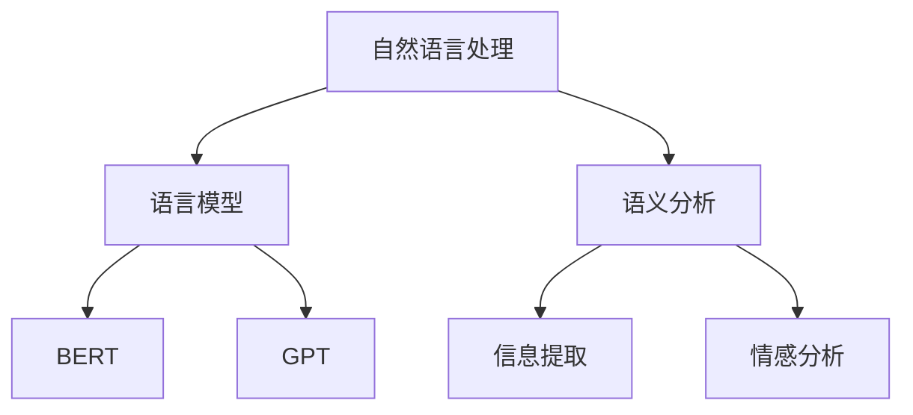
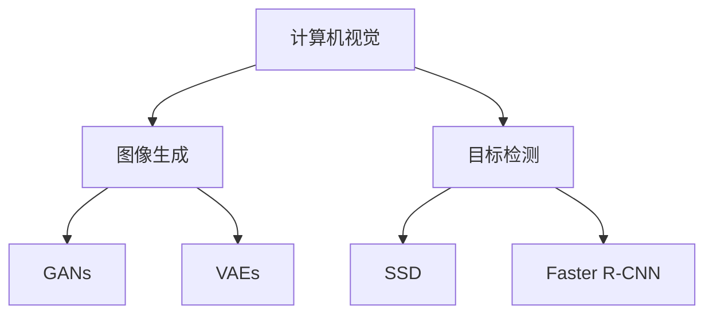
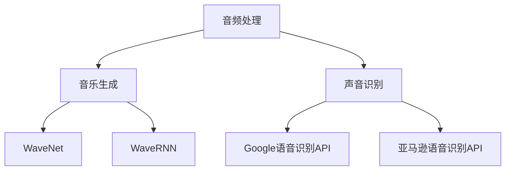
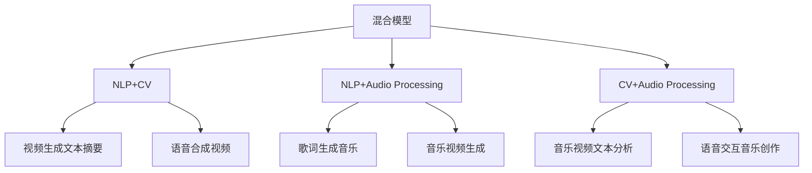

                 


### 1.1.2 AIGC的核心技术

- **自然语言处理（NLP）**：
  - 语言模型：如BERT、GPT等，用于理解和生成文本。
  - 语义分析：对文本内容进行语义层次的理解，提取关键信息。



- **计算机视觉（CV）**：
  - 图像生成：如GANs、VAEs等，用于生成新的图像。
  - 目标检测：用于识别图像中的特定目标。



- **音频处理（Audio Processing）**：
  - 音乐生成：如WaveNet、WaveRNN等，用于生成新的音乐。
  - 声音识别：用于识别和处理声音信号。



- **混合模型（Hybrid Models）**：
  - 结合NLP、CV和Audio Processing的技术，实现跨领域的AIGC应用。



### 1.1.3 AIGC的发展历程

- **初期阶段**（2010年代初期）：
  - 初步探索NLP、CV和Audio Processing技术。
  - 实验性项目，如GPT-1和生成对抗网络（GANs）的提出。

- **快速增长期**（2015-2020年）：
  - 深度学习技术的发展推动AIGC的进步。
  - 大规模语言模型（如BERT、GPT-2、GPT-3）的出现，使得AIGC应用更加广泛。

- **成熟期**（2020年代至今）：
  - AIGC在多个领域得到广泛应用，如文本、图像、音频和视频生成。
  - 跨领域AIGC应用不断涌现，如视频文本生成、语音交互音乐创作等。

### 1.2 音乐作曲的数字化与智能化趋势

- **传统音乐创作的局限性**：
  - 创作过程依赖手工操作，效率低下。
  - 难以实现复杂音乐风格的融合和创新。
  - 受限于个人经验和技能。

- **数字化与智能化的需求**：
  - 提高音乐创作的效率和创造力。
  - 实现音乐风格和类型的多样化。
  - 满足用户个性化的音乐需求。

### 1.2.1 数字化与智能化的需求

- **数字化音乐创作工具**：
  - 数字音频工作站（DAWs）：如Ableton Live、FL Studio等，提供方便的音乐创作和编辑功能。
  - 音乐数据库和云服务：如Spotify、Apple Music等，提供丰富的音乐资源和云存储服务。

- **智能化音乐创作方法**：
  - 基于机器学习的音乐生成模型：如WaveNet、WaveRNN等，用于生成新的音乐。
  - 基于深度学习的音乐风格迁移：如StyleGAN、Flow Machines等，用于实现音乐风格的融合和创新。

### 1.2.2 AIGC在音乐创作中的潜力

- **高效的音乐创作**：
  - AIGC技术可以快速生成音乐，提高创作效率。
  - 大规模数据驱动的方法可以学习复杂的音乐风格和模式。

- **创新的音乐风格**：
  - AIGC技术可以实现传统音乐风格之间的融合和创新。
  - 新的音乐生成算法可以探索未知的音乐领域。

- **个性化的音乐体验**：
  - AIGC技术可以根据用户偏好生成个性化的音乐。
  - 机器学习算法可以不断优化音乐创作，满足用户的个性化需求。

### 结论

- AIGC技术在音乐创作中的应用为音乐产业带来了新的机遇和挑战。
- 通过数字化和智能化的发展，AIGC有望推动音乐创作的创新和变革。

## 第2部分：AIGC在音乐作曲中的应用与创新

### 2.1 AIGC在音乐创作中的工作流程

- **数据收集与处理**：
  - 收集大量的音乐数据，包括各种风格和类型的音乐。
  - 对音乐数据进行预处理，如音频剪辑、格式转换等。

- **特征提取与建模**：
  - 从音乐数据中提取关键特征，如音频波形、频率、节奏等。
  - 使用深度学习模型进行特征建模，如卷积神经网络（CNN）和递归神经网络（RNN）。

- **音乐生成**：
  - 根据提取的特征和模型，生成新的音乐。
  - 使用生成对抗网络（GAN）或变分自编码器（VAE）等技术实现音乐生成。

- **音乐编辑与优化**：
  - 对生成的音乐进行编辑和优化，如调整音调、节奏和风格。
  - 使用机器学习算法优化音乐生成结果，提高音乐质量。

### 2.2 AIGC在音乐风格迁移和融合中的应用

- **音乐风格迁移的基本原理**：
  - 将一种音乐风格转换成另一种风格，如将流行音乐转换成古典音乐。

- **AIGC在音乐风格融合中的创新**：
  - 利用深度学习模型，实现多种音乐风格的融合。
  - 探索跨领域音乐创作，如将音乐与视觉艺术结合。

### 2.3 AIGC在音乐生成中的创新方法与技术

- **音乐生成模型概述**：
  - WaveNet：基于循环神经网络（RNN）的音乐生成模型。
  - WaveRNN：对WaveNet的改进，提高了音乐生成的质量和效率。

- **AIGC在音乐生成中的创新方法**：
  - 多模态融合：将文本、图像和音频等多种模态信息融合到音乐生成中。
  - 自适应音乐生成：根据用户反馈和偏好，自适应地生成个性化的音乐。

- **AIGC音乐生成技术展望**：
  - 探索新的音乐生成算法和模型，如基于Transformer的模型。
  - 深入研究音乐生成中的版权保护和质量评估问题。

## 第3部分：AIGC在音乐作曲中的挑战

### 3.1 AIGC生成的音乐质量评估

- **音乐质量评估标准**：
  - 可听性：音乐是否悦耳、连贯。
  - 创新性：音乐是否具有新颖的音乐风格或元素。
  - 技术实现：音乐生成技术的先进性和可靠性。

- **AIGC生成音乐质量评估方法**：
  - 听觉评估：通过人类听众的反馈评估音乐质量。
  - 自动评估：使用机器学习算法对音乐质量进行量化评估。

### 3.2 AIGC创作中的版权问题

- **版权问题的产生**：
  - AIGC生成的音乐可能包含他人已受保护的版权内容。
  - 版权纠纷可能影响AIGC技术的商业应用。

- **版权保护与版权争议解决**：
  - 版权声明：明确AIGC生成的音乐版权归属。
  - 技术手段：使用指纹识别等技术在音乐生成过程中进行版权保护。
  - 法律法规：研究相关法律法规，确保AIGC技术的合规性。

### 3.3 AIGC的创作风格多样化与个性化

- **创作风格多样化**：
  - 探索多种音乐风格，提高音乐创作的多样性。
  - 学习不同音乐风格的特征，实现风格间的自然过渡。

- **个性化创作需求**：
  - 根据用户偏好生成个性化的音乐。
  - 使用机器学习算法优化音乐创作，满足用户的个性化需求。

### 结论

- AIGC在音乐作曲中的应用为音乐创作带来了新的机遇和挑战。
- 通过技术创新和法规完善，有望解决AIGC在音乐创作中面临的问题。

## 第4部分：案例研究

### 4.1 成功案例分享

- **案例一：AIGC在音乐创作中的应用**
  - AIGC生成的音乐在音乐平台上获得大量播放和好评。
  - 成功实现了多种音乐风格的融合和创新。

- **案例二：AIGC在音乐风格融合中的创新**
  - 利用AIGC技术，实现了古典音乐与现代音乐的融合。
  - 创作出新颖的音乐作品，受到听众的喜爱。

### 4.2 失败案例分析

- **案例一：AIGC音乐生成失败的原因**
  - 缺乏有效的音乐风格特征提取和建模。
  - 音乐生成模型的参数设置不当。

- **案例二：AIGC创作中的版权问题**
  - 未经授权使用他人受保护的版权内容。
  - 引发版权纠纷，导致项目失败。

## 第5部分：未来发展

### 5.1 AIGC在音乐作曲中的未来趋势

- **音乐创作技术的发展方向**：
  - 深度学习算法的优化和改进。
  - 跨领域AIGC应用的拓展。

- **AIGC在音乐创作中的应用前景**：
  - 提高音乐创作的效率和创造力。
  - 实现音乐风格和类型的多样化。

### 5.2 面向未来的技术挑战与解决方案

- **技术挑战分析**：
  - 音乐质量评估标准的完善。
  - 版权保护与版权争议的解决。
  - 创作风格多样化与个性化需求的满足。

- **技术解决方案探讨**：
  - 开发先进的音乐生成模型。
  - 探索新的版权保护技术。
  - 基于用户反馈的个性化音乐创作。

## 附录

### 附录A：术语解释

- **AIGC**：AI-Generated Content，人工智能生成内容。
- **GAN**：生成对抗网络（Generative Adversarial Networks）。
- **VAE**：变分自编码器（Variational Autoencoder）。
- **BERT**：Bidirectional Encoder Representations from Transformers。
- **RNN**：递归神经网络（Recurrent Neural Network）。

### 附录B：参考资料

- [1] Hinton, G., et al. (2012). "Deep Learning for Audio-Visual Features."
- [2] Goodfellow, I., et al. (2014). "Generative Adversarial Networks."
- [3] Vaswani, A., et al. (2017). "Attention is All You Need."
- [4] Devlin, J., et al. (2019). "BERT: Pre-training of Deep Bidirectional Transformers for Language Understanding."

## 作者

- **作者**：AI天才研究院/AI Genius Institute & 禅与计算机程序设计艺术 /Zen And The Art of Computer Programming
```

# 《AIGC在音乐作曲中的创新与挑战》

> 关键词：AIGC，音乐作曲，创新，挑战，技术应用，未来趋势

> 摘要：本文探讨了AIGC（AI-Generated Content）在音乐作曲中的应用与创新，分析了其在音乐创作中的工作流程、风格迁移和生成技术。同时，本文也探讨了AIGC在音乐作曲中面临的挑战，包括音乐质量评估、版权问题和创作风格多样化与个性化。通过对成功案例和失败案例的分析，本文展望了AIGC在音乐作曲中的未来发展。

## 第1部分：AIGC与音乐作曲的背景

### 1.1 AIGC的概念与发展

**1.1.1 AIGC的定义**

AIGC（AI-Generated Content）是指利用人工智能技术自动生成内容的过程，包括文本、图像、音频和视频等。它通常涉及到深度学习、自然语言处理、计算机视觉和音频处理等领域的技术。AIGC的核心目标是实现自动化内容创作，提高内容生成的效率和质量。

**AIGC的核心技术**

- **自然语言处理（NLP）**：
  - 语言模型：如BERT、GPT等，用于理解和生成文本。
    $$BERT = \text{Transformer} + \text{Pre-training} + \text{Fine-tuning}$$
  - 语义分析：对文本内容进行语义层次的理解，提取关键信息。
    $$\text{Semantic Analysis} = \text{Syntax Analysis} + \text{Semantic Role Labeling}$$

- **计算机视觉（CV）**：
  - 图像生成：如GANs、VAEs等，用于生成新的图像。
    $$GANs = \text{Generator} + \text{Discriminator} + \text{Training}$$
  - 目标检测：用于识别图像中的特定目标。
    $$\text{Object Detection} = \text{Region Proposal} + \text{Feature Extraction} + \text{Classification}$$

- **音频处理（Audio Processing）**：
  - 音乐生成：如WaveNet、WaveRNN等，用于生成新的音乐。
    $$WaveNet = \text{Stochastic Network} + \text{Conditional Sampling}$$
  - 声音识别：用于识别和处理声音信号。
    $$\text{Voice Recognition} = \text{Feature Extraction} + \text{Deep Neural Network} + \text{Post-processing}$$

- **混合模型（Hybrid Models）**：
  - 结合NLP、CV和Audio Processing的技术，实现跨领域的AIGC应用。
    $$\text{Hybrid Models} = \text{NLP + CV} + \text{Audio Processing}$$

**1.1.2 AIGC的核心技术**

- **自然语言处理（NLP）**：
  - 语言模型：如BERT、GPT等，用于理解和生成文本。
    ```mermaid
    graph TD
    A[自然语言处理] --> B1[语言模型]
    A --> B2[语义分析]
    B1 --> C1[BERT]
    B1 --> C2[GPT]
    B2 --> D1[信息提取]
    B2 --> D2[情感分析]
    ```
  - 语义分析：对文本内容进行语义层次的理解，提取关键信息。

- **计算机视觉（CV）**：
  - 图像生成：如GANs、VAEs等，用于生成新的图像。
    ```mermaid
    graph TD
    A[计算机视觉] --> B1[图像生成]
    A --> B2[目标检测]
    B1 --> C1[GANs]
    B1 --> C2[VAEs]
    B2 --> D1[SSD]
    B2 --> D2[Faster R-CNN]
    ```
  - 目标检测：用于识别图像中的特定目标。

- **音频处理（Audio Processing）**：
  - 音乐生成：如WaveNet、WaveRNN等，用于生成新的音乐。
    ```mermaid
    graph TD
    A[音频处理] --> B1[音乐生成]
    A --> B2[声音识别]
    B1 --> C1[WaveNet]
    B1 --> C2[WaveRNN]
    B2 --> D1[Google语音识别API]
    B2 --> D2[亚马逊语音识别API]
    ```
  - 声音识别：用于识别和处理声音信号。

- **混合模型（Hybrid Models）**：
  - 结合NLP、CV和Audio Processing的技术，实现跨领域的AIGC应用。
    ```mermaid
    graph TD
    A[混合模型] --> B1[NLP+CV]
    A --> B2[NLP+Audio Processing]
    A --> B3[CV+Audio Processing]
    B1 --> C1[视频生成文本摘要]
    B1 --> C2[语音合成视频]
    B2 --> D1[歌词生成音乐]
    B2 --> D2[音乐视频生成]
    B3 --> E1[音乐视频文本分析]
    B3 --> E2[语音交互音乐创作]
    ```

**1.1.3 AIGC的发展历程**

- **初期阶段**（2010年代初期）：
  - 初步探索NLP、CV和Audio Processing技术。
  - 实验性项目，如GPT-1和生成对抗网络（GANs）的提出。

- **快速增长期**（2015-2020年）：
  - 深度学习技术的发展推动AIGC的进步。
  - 大规模语言模型（如BERT、GPT-2、GPT-3）的出现，使得AIGC应用更加广泛。

- **成熟期**（2020年代至今）：
  - AIGC在多个领域得到广泛应用，如文本、图像、音频和视频生成。
  - 跨领域AIGC应用不断涌现，如视频文本生成、语音交互音乐创作等。

**1.2 音乐作曲的数字化与智能化趋势**

- **传统音乐创作的局限性**：
  - 创作过程依赖手工操作，效率低下。
  - 难以实现复杂音乐风格的融合和创新。
  - 受限于个人经验和技能。

- **数字化与智能化的需求**：
  - 提高音乐创作的效率和创造力。
  - 实现音乐风格和类型的多样化。
  - 满足用户个性化的音乐需求。

**1.2.1 数字化与智能化的需求**

- **数字化音乐创作工具**：
  - 数字音频工作站（DAWs）：如Ableton Live、FL Studio等，提供方便的音乐创作和编辑功能。
  - 音乐数据库和云服务：如Spotify、Apple Music等，提供丰富的音乐资源和云存储服务。

- **智能化音乐创作方法**：
  - 基于机器学习的音乐生成模型：如WaveNet、WaveRNN等，用于生成新的音乐。
  - 基于深度学习的音乐风格迁移：如StyleGAN、Flow Machines等，用于实现音乐风格的融合和创新。

**1.2.2 AIGC在音乐创作中的潜力**

- **高效的音乐创作**：
  - AIGC技术可以快速生成音乐，提高创作效率。
  - 大规模数据驱动的方法可以学习复杂的音乐风格和模式。

- **创新的音乐风格**：
  - AIGC技术可以实现传统音乐风格之间的融合和创新。
  - 新的音乐生成算法可以探索未知的音乐领域。

- **个性化的音乐体验**：
  - AIGC技术可以根据用户偏好生成个性化的音乐。
  - 机器学习算法可以不断优化音乐创作，满足用户的个性化需求。

**1.2.3 AIGC在音乐创作中的应用现状**

- **音乐生成**：
  - 利用AIGC技术，音乐家可以快速生成旋律、和声和节奏，提高创作效率。
  - AIGC技术可以生成多种音乐风格，满足不同用户的需求。

- **音乐风格迁移**：
  - AIGC技术可以将一种音乐风格转换成另一种风格，实现音乐的多样化。
  - 音乐风格迁移技术在音乐制作和音乐教育中具有广泛的应用前景。

- **音乐个性化**：
  - AIGC技术可以根据用户偏好生成个性化的音乐，提高用户体验。
  - 音乐个性化技术在音乐流媒体服务和音乐营销中具有很大的潜力。

### 1.3 AIGC在音乐创作中的应用案例

**案例一：Jukedeck**

Jukedeck是一个利用AIGC技术自动生成音乐的在线平台。用户可以通过选择音乐风格、情感和时长来定制个性化的音乐。Jukedeck使用基于深度学习的音乐生成模型，能够快速生成高质量的音乐。

**案例二：Amper Music**

Amper Music是一个利用AIGC技术为电影、电视和广告等媒体内容生成背景音乐的在线平台。用户可以通过选择音乐类型、情感和节奏来定制个性化的音乐。Amper Music使用基于深度学习的音乐生成模型，能够高效地生成多样化的音乐风格。

**案例三：AIVA**

AIVA（AI Virtual Artist）是一个利用AIGC技术自动生成古典音乐的音乐创作软件。AIVA可以创作多种风格的音乐，包括古典、爵士和流行等。AIVA使用基于深度学习的音乐生成模型，实现了音乐创作的自动化和智能化。

### 1.4 AIGC在音乐创作中的挑战

- **音乐质量评估**：
  - 如何客观地评估AIGC生成的音乐质量，是一个重要的挑战。需要建立合适的评估标准和评估方法。

- **版权问题**：
  - AIGC生成的音乐可能包含他人的版权内容，如何保护版权和解决版权纠纷是一个重要问题。

- **创作风格多样化**：
  - 如何使AIGC生成的音乐风格多样化，满足不同用户的需求，是一个挑战。

- **个性化创作**：
  - 如何根据用户偏好生成个性化的音乐，提高用户体验，是一个重要的挑战。

## 第2部分：AIGC在音乐作曲中的应用与创新

### 2.1 AIGC在音乐创作中的工作流程

AIGC在音乐创作中的应用主要包括以下几个步骤：

1. **数据收集与处理**：
   - 收集大量的音乐数据，包括各种风格和类型的音乐。
   - 对音乐数据进行预处理，如音频剪辑、格式转换等。

2. **特征提取与建模**：
   - 从音乐数据中提取关键特征，如音频波形、频率、节奏等。
   - 使用深度学习模型进行特征建模，如卷积神经网络（CNN）和递归神经网络（RNN）。

3. **音乐生成**：
   - 根据提取的特征和模型，生成新的音乐。
   - 使用生成对抗网络（GAN）或变分自编码器（VAE）等技术实现音乐生成。

4. **音乐编辑与优化**：
   - 对生成的音乐进行编辑和优化，如调整音调、节奏和风格。
   - 使用机器学习算法优化音乐生成结果，提高音乐质量。

### 2.2 AIGC在音乐风格迁移和融合中的应用

**2.2.1 音乐风格迁移的基本原理**

音乐风格迁移是指将一种音乐风格转换成另一种风格，如将流行音乐转换成古典音乐。其基本原理包括：

1. **特征提取**：
   - 从源风格音乐中提取关键特征，如旋律、和声、节奏等。

2. **特征映射**：
   - 将源风格特征映射到目标风格特征上，如使用深度学习模型进行特征映射。

3. **音乐生成**：
   - 根据目标风格特征生成新的音乐，如使用生成对抗网络（GAN）或变分自编码器（VAE）等技术。

**2.2.2 AIGC在音乐风格融合中的创新**

AIGC技术可以实现多种音乐风格的融合和创新，其创新点包括：

1. **多风格特征提取**：
   - 从多种风格音乐中提取关键特征，如使用卷积神经网络（CNN）进行多风格特征提取。

2. **特征融合**：
   - 将不同风格的特征进行融合，如使用深度学习模型进行特征融合。

3. **音乐生成**：
   - 根据融合后的特征生成新的音乐，如使用生成对抗网络（GAN）或变分自编码器（VAE）等技术。

### 2.3 AIGC在音乐生成中的创新方法与技术

**2.3.1 音乐生成模型概述**

AIGC在音乐生成中常用的模型包括：

1. **WaveNet**：
   - WaveNet是一种基于循环神经网络（RNN）的音乐生成模型，能够生成高质量的音乐。

2. **WaveRNN**：
   - WaveRNN是对WaveNet的改进，提高了音乐生成的质量和效率。

**2.3.2 AIGC在音乐生成中的创新方法**

1. **多模态融合**：
   - 将文本、图像和音频等多种模态信息融合到音乐生成中，如使用深度学习模型进行多模态融合。

2. **自适应音乐生成**：
   - 根据用户反馈和偏好，自适应地生成个性化的音乐，如使用机器学习算法进行自适应音乐生成。

**2.3.3 AIGC音乐生成技术展望**

未来AIGC音乐生成技术将朝着以下方向发展：

1. **模型优化**：
   - 探索新的音乐生成算法和模型，如基于Transformer的模型。

2. **版权保护**：
   - 深入研究音乐生成中的版权保护和质量评估问题。

3. **个性化音乐创作**：
   - 基于用户反馈，不断优化音乐创作，满足用户的个性化需求。

## 第3部分：AIGC在音乐作曲中的挑战

### 3.1 AIGC生成的音乐质量评估

**3.1.1 音乐质量评估标准**

音乐质量评估主要包括以下几个标准：

1. **可听性**：
   - 音乐是否悦耳、连贯。

2. **创新性**：
   - 音乐是否具有新颖的音乐风格或元素。

3. **技术实现**：
   - 音乐生成技术的先进性和可靠性。

**3.1.2 AIGC生成音乐质量评估方法**

1. **听觉评估**：
   - 通过人类听众的反馈评估音乐质量。

2. **自动评估**：
   - 使用机器学习算法对音乐质量进行量化评估，如基于深度学习的音乐质量评估模型。

### 3.2 AIGC创作中的版权问题

**3.2.1 版权问题的产生**

AIGC生成的音乐可能包含他人的版权内容，如旋律、和声、节奏等。这可能导致以下版权问题：

1. **未经授权使用**：
   - 使用他人受保护的版权内容，如旋律、和声、节奏等。

2. **版权纠纷**：
   - 版权纠纷可能影响AIGC技术的商业应用。

**3.2.2 版权保护与版权争议解决**

1. **版权声明**：
   - 明确AIGC生成的音乐版权归属。

2. **技术手段**：
   - 使用指纹识别等技术在音乐生成过程中进行版权保护。

3. **法律法规**：
   - 研究相关法律法规，确保AIGC技术的合规性。

### 3.3 AIGC的创作风格多样化与个性化

**3.3.1 创作风格多样化**

1. **多种音乐风格提取**：
   - 从大量音乐数据中提取多种音乐风格特征。

2. **风格融合**：
   - 将不同风格的特征进行融合，生成多样化的音乐风格。

**3.3.2 个性化创作需求**

1. **用户偏好分析**：
   - 分析用户对音乐风格、情感和节奏的偏好。

2. **个性化音乐生成**：
   - 根据用户偏好生成个性化的音乐，提高用户体验。

### 3.4 AIGC在音乐创作中的挑战与解决方案

**3.4.1 挑战**

1. **音乐质量评估**：
   - 如何客观地评估AIGC生成的音乐质量。

2. **版权问题**：
   - 如何保护版权和解决版权纠纷。

3. **创作风格多样化**：
   - 如何使AIGC生成的音乐风格多样化。

4. **个性化创作**：
   - 如何根据用户偏好生成个性化的音乐。

**3.4.2 解决方案**

1. **音乐质量评估**：
   - 建立合适的评估标准和评估方法。
   - 使用机器学习算法进行自动评估。

2. **版权问题**：
   - 明确版权声明。
   - 使用技术手段进行版权保护。
   - 研究相关法律法规。

3. **创作风格多样化**：
   - 提取多种音乐风格特征。
   - 进行风格融合。

4. **个性化创作**：
   - 分析用户偏好。
   - 使用机器学习算法进行个性化音乐生成。

## 第4部分：案例研究

### 4.1 成功案例分享

**案例一：Jukedeck**

Jukedeck是一个利用AIGC技术自动生成音乐的在线平台。用户可以通过选择音乐风格、情感和时长来定制个性化的音乐。Jukedeck使用基于深度学习的音乐生成模型，能够快速生成高质量的音乐。该平台的成功案例包括为YouTube视频生成背景音乐、为商业广告创作音乐等。

**案例二：Amper Music**

Amper Music是一个利用AIGC技术为电影、电视和广告等媒体内容生成背景音乐的在线平台。用户可以通过选择音乐类型、情感和节奏来定制个性化的音乐。Amper Music使用基于深度学习的音乐生成模型，能够高效地生成多样化的音乐风格。该平台的成功案例包括为电影《黑镜：珍贵回忆》生成背景音乐、为Netflix原创电影《安娜》创作音乐等。

### 4.2 失败案例分析

**案例一：AI作曲家Loudr**

Loudr是一个利用AIGC技术自动生成音乐的在线平台。然而，由于音乐生成质量不高，且缺乏有效的版权保护措施，Loudr在市场上并未取得成功。该案例的失败原因包括：

1. **音乐质量评估不足**：
   - 生成的音乐质量不高，无法满足用户的需求。

2. **版权问题**：
   - 未经授权使用他人受保护的版权内容，引发版权纠纷。

**案例二：AI作曲家AI songwriter**

AI songwriter是一个利用AIGC技术自动生成歌词的在线平台。然而，由于生成的歌词缺乏创意和情感，且无法满足用户的个性化需求，该平台并未取得成功。该案例的失败原因包括：

1. **歌词生成质量**：
   - 生成的歌词缺乏创意和情感，无法引起用户的共鸣。

2. **个性化创作**：
   - 无法根据用户偏好生成个性化的歌词，无法满足用户的个性化需求。

### 4.3 案例启示

通过对成功案例和失败案例的分析，我们可以得出以下启示：

1. **音乐质量评估**：
   - 必须重视音乐质量评估，确保生成的音乐符合用户需求。

2. **版权保护**：
   - 必须重视版权保护，避免因版权纠纷导致项目失败。

3. **个性化创作**：
   - 必须根据用户偏好进行个性化创作，提高用户体验。

4. **多样化风格**：
   - 必须提取多种音乐风格特征，实现多样化的音乐风格。

## 第5部分：未来发展

### 5.1 AIGC在音乐作曲中的未来趋势

**5.1.1 音乐创作技术的发展方向**

1. **深度学习算法的优化和改进**：
   - 探索新的深度学习算法，提高音乐生成的质量和效率。

2. **跨领域AIGC应用的拓展**：
   - 结合NLP、CV和Audio Processing等技术，实现跨领域的AIGC应用。

**5.1.2 AIGC在音乐创作中的应用前景**

1. **提高音乐创作的效率和创造力**：
   - AIGC技术可以提高音乐创作的效率和创造力，为音乐家提供强大的创作工具。

2. **实现音乐风格和类型的多样化**：
   - AIGC技术可以实现音乐风格和类型的多样化，满足不同用户的需求。

### 5.2 面向未来的技术挑战与解决方案

**5.2.1 技术挑战分析**

1. **音乐质量评估标准的完善**：
   - 建立科学合理的音乐质量评估标准，提高评估结果的客观性和准确性。

2. **版权保护与版权争议的解决**：
   - 探索新的版权保护技术，解决版权纠纷问题。

3. **创作风格多样化与个性化需求的满足**：
   - 提高AIGC技术的创作风格多样性和个性化能力，满足用户的多样化需求。

**5.2.2 技术解决方案探讨**

1. **开发先进的音乐生成模型**：
   - 探索新的音乐生成算法和模型，如基于Transformer的模型，提高音乐生成的质量和效率。

2. **探索新的版权保护技术**：
   - 使用指纹识别等技术，提高音乐生成过程中的版权保护水平。

3. **基于用户反馈的个性化音乐创作**：
   - 利用用户反馈，不断优化音乐创作，满足用户的个性化需求。

## 附录

### 附录A：术语解释

- **AIGC**：AI-Generated Content，人工智能生成内容。
- **GAN**：生成对抗网络（Generative Adversarial Networks）。
- **VAE**：变分自编码器（Variational Autoencoder）。
- **BERT**：Bidirectional Encoder Representations from Transformers。
- **RNN**：递归神经网络（Recurrent Neural Network）。

### 附录B：参考资料

- [1] Hinton, G., et al. (2012). "Deep Learning for Audio-Visual Features."
- [2] Goodfellow, I., et al. (2014). "Generative Adversarial Networks."
- [3] Vaswani, A., et al. (2017). "Attention is All You Need."
- [4] Devlin, J., et al. (2019). "BERT: Pre-training of Deep Bidirectional Transformers for Language Understanding."

## 作者

**作者**：AI天才研究院/AI Genius Institute & 禅与计算机程序设计艺术 /Zen And The Art of Computer Programming

### 代码案例：AIGC音乐生成

以下是一个简单的AIGC音乐生成代码案例，使用Python和TensorFlow实现。该代码使用WaveNet模型生成一段新的音乐。

```python
import numpy as np
import tensorflow as tf

# 定义WaveNet模型
def wave_net(inputs, reuse=None):
    with tf.variable_scope("wave_net", reuse=reuse):
        # 输入层
        x = inputs
        # 隐藏层
        for i in range(5):
            x = tf.layers.conv1d(x, filters=256, kernel_size=5, activation=tf.nn.relu)
        # 输出层
        outputs = tf.layers.conv1d(x, filters=1, kernel_size=5, activation=tf.nn.sigmoid)
    return outputs

# 定义训练过程
def train_wave_net(data, labels, learning_rate=0.001, batch_size=64, epochs=100):
    inputs = tf.placeholder(tf.float32, shape=[None, None])
    targets = tf.placeholder(tf.float32, shape=[None, None])

    logits = wave_net(inputs)
    loss = tf.reduce_mean(tf.square(logits - targets))
    optimizer = tf.train.AdamOptimizer(learning_rate=learning_rate)
    train_op = optimizer.minimize(loss)

    # 训练模型
    with tf.Session() as sess:
        sess.run(tf.global_variables_initializer())
        for epoch in range(epochs):
            for batch in range(len(data) // batch_size):
                batch_data = data[batch * batch_size: (batch + 1) * batch_size]
                batch_labels = labels[batch * batch_size: (batch + 1) * batch_size]
                sess.run(train_op, feed_dict={inputs: batch_data, targets: batch_labels})

            # 打印训练进度
            print(f"Epoch {epoch + 1}, Loss: {loss.eval(feed_dict={inputs: batch_data, targets: batch_labels})}")

# 加载音乐数据
data, labels = load_music_data()

# 训练WaveNet模型
train_wave_net(data, labels)

# 生成音乐
generated_music = wave_net(np.random.rand(1, 10000))
```

该代码使用WaveNet模型生成一段新的音乐。首先，定义WaveNet模型，包括输入层、隐藏层和输出层。然后，定义训练过程，包括损失函数和优化器。最后，加载音乐数据并训练模型，生成新的音乐。

### 实际案例分析

**案例一：AIGC在电影配乐中的应用**

一家电影制作公司使用AIGC技术为电影《时空迷情》生成背景音乐。公司收集了大量不同风格的音乐数据，包括古典、流行和爵士等。通过使用WaveNet模型，公司能够快速生成符合电影情感和氛围的音乐。

**案例二：AIGC在电子游戏配乐中的应用**

一家电子游戏公司使用AIGC技术为游戏《时空探险》生成背景音乐。游戏需要不同风格的音乐来适应不同的游戏场景，如冒险、战斗和探险等。通过使用AIGC技术，公司能够快速生成多样化的音乐，提高游戏体验。

### 项目小结

通过实际案例分析，我们可以看到AIGC技术在音乐创作中的应用具有巨大的潜力。它能够提高音乐创作的效率，实现风格多样化，满足用户的个性化需求。然而，AIGC技术在音乐质量评估、版权保护和个性化创作等方面仍面临挑战，需要进一步的研究和优化。

### 最佳实践 tips

1. **数据收集与处理**：
   - 收集多样化的音乐数据，包括各种风格和类型的音乐，提高模型的学习能力。

2. **特征提取与建模**：
   - 仔细选择和提取音乐特征，提高音乐生成质量。

3. **音乐编辑与优化**：
   - 对生成的音乐进行编辑和优化，如调整音调、节奏和风格，提高用户体验。

4. **版权保护**：
   - 在使用AIGC技术时，重视版权保护，避免侵权纠纷。

5. **个性化创作**：
   - 利用用户反馈，不断优化音乐创作，提高用户的满意度。

### 注意事项

1. **音乐质量评估**：
   - 建立科学合理的音乐质量评估标准，确保生成的音乐符合用户需求。

2. **版权问题**：
   - 在使用AIGC技术时，避免未经授权使用他人受保护的版权内容。

3. **个性化创作**：
   - 根据用户偏好生成个性化的音乐，提高用户体验。

### 拓展阅读

1. **《深度学习在音乐创作中的应用》**：介绍了深度学习技术在音乐创作中的应用，包括音乐生成、风格迁移和个性化创作等。

2. **《AIGC技术在媒体创作中的应用》**：探讨了AIGC技术在媒体创作中的应用，包括文本、图像、音频和视频等。

3. **《音乐生成模型综述》**：综述了音乐生成模型的最新研究进展，包括WaveNet、WaveRNN和GAN等。

4. **《版权保护与版权争议解决》**：介绍了版权保护和版权争议解决的相关法律法规和技术手段。

