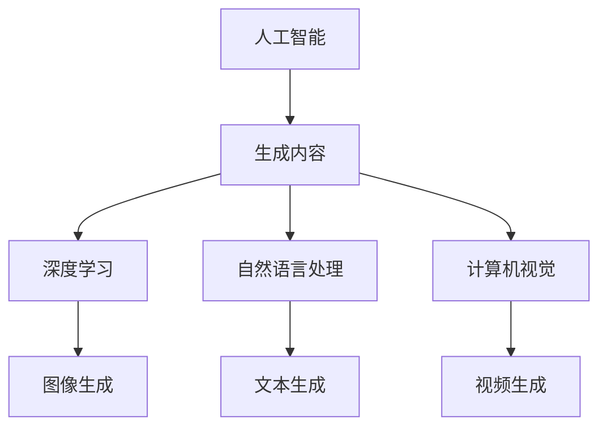
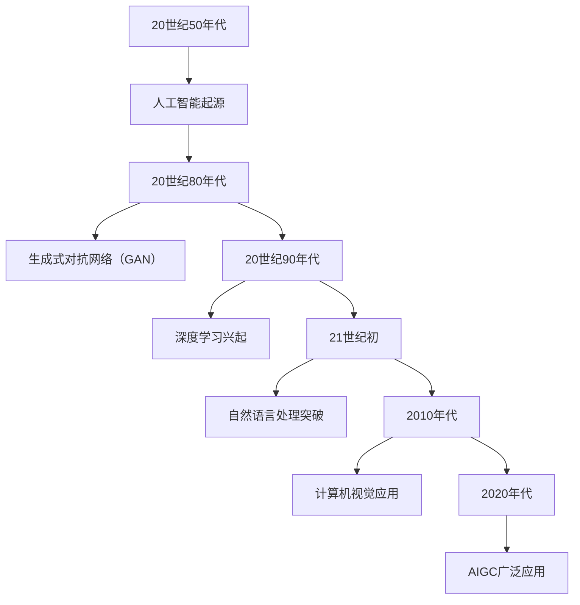
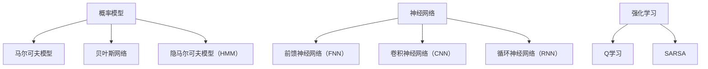
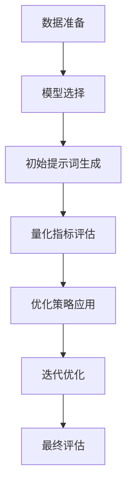
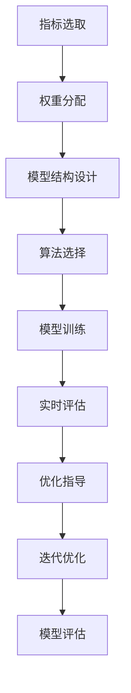

                 

### 第1章：AIGC概述

#### 1.1 AIGC的基本概念

AIGC（AI Generated Content），即人工智能生成内容，指的是利用人工智能技术生成各种形式的内容，包括但不限于文本、图像、音频、视频等。AIGC的核心目标是利用人工智能技术，实现内容创作的自动化和智能化。

AIGC的基本概念可以追溯到20世纪50年代，随着人工智能的兴起，人们开始探索如何利用计算机程序模拟人类的思维和行为。早期的AIGC技术主要包括规则系统、模式识别和知识表示等。随着深度学习、自然语言处理和计算机视觉等技术的发展，AIGC技术逐渐成熟，并开始应用于各个领域。

#### 1.2 AIGC的发展历程

AIGC的发展历程可以分为以下几个阶段：

- **第一阶段（20世纪50年代-70年代）**：人工智能的起源阶段。这个时期，人工智能的概念被提出，但受限于计算机性能和算法，AIGC的应用范围非常有限。
- **第二阶段（20世纪80年代）**：生成式对抗网络（GAN）的提出。GAN是AIGC技术的一个重要突破，它通过生成器和判别器的对抗训练，实现了高质量图像的生成。
- **第三阶段（21世纪初）**：深度学习技术的快速发展。深度学习技术的兴起，使得AIGC在图像、语音和文本生成方面取得了显著进展。
- **第四阶段（2010年代）**：自然语言处理和计算机视觉领域的突破。这一阶段，AIGC技术开始在自然语言处理和计算机视觉领域得到广泛应用。
- **第五阶段（2020年代）**：AIGC技术的广泛应用。随着人工智能技术的不断发展，AIGC技术开始应用于更多的领域，如智能客服、智能写作、智能翻译等。

#### 1.3 AIGC的核心技术

AIGC的核心技术主要包括深度学习、自然语言处理、计算机视觉等。

- **深度学习**：深度学习是一种模仿人脑结构和功能的算法，通过多层神经网络的训练，实现数据的自动特征提取和模式识别。深度学习在图像、语音和文本生成等方面有着广泛的应用。
- **自然语言处理**：自然语言处理是计算机科学领域与人工智能领域相结合的一门学科，旨在让计算机理解和生成自然语言。自然语言处理在文本生成和翻译等方面发挥着重要作用。
- **计算机视觉**：计算机视觉是研究如何使计算机具备人类视觉能力的科学。计算机视觉在图像生成和识别等方面有着广泛的应用。

#### 1.4 AIGC的应用领域

AIGC技术已广泛应用于多个领域，主要包括：

- **媒体与娱乐**：AIGC技术可以用于生成图像、视频和音频，从而丰富媒体内容，提高创作效率。
- **广告与营销**：AIGC技术可以生成个性化的广告内容，提高广告投放效果。
- **智能客服**：AIGC技术可以生成智能客服系统，实现与用户的自然语言交互。
- **智能写作**：AIGC技术可以生成文章、报告和书籍等，提高写作效率和质量。
- **医疗与健康**：AIGC技术可以用于医疗数据的分析，辅助医生进行诊断和治疗。
- **教育**：AIGC技术可以生成教育内容，提高教学效果。

### 1.5 AIGC的优势和挑战

AIGC技术具有以下优势：

- **高效性**：AIGC技术可以自动化生成大量内容，提高工作效率。
- **个性化**：AIGC技术可以根据用户的需求和偏好生成个性化内容。
- **创新性**：AIGC技术可以激发创意，生成新颖的内容。

同时，AIGC技术也面临以下挑战：

- **数据质量**：AIGC技术的质量依赖于训练数据的质量。
- **安全性**：AIGC技术可能存在数据泄露和滥用等安全问题。
- **伦理问题**：AIGC技术的应用可能引发伦理问题，如版权、隐私等。

### 核心概念与联系

AIGC的核心概念包括人工智能、生成内容、深度学习、自然语言处理和计算机视觉。这些概念之间存在着紧密的联系：

- 人工智能是AIGC的基础，它为AIGC提供了技术支持和实现途径。
- 生成内容是AIGC的目标，它反映了AIGC技术的应用价值。
- 深度学习、自然语言处理和计算机视觉是AIGC的核心技术，它们共同支撑着AIGC的实现。

下面是一个Mermaid流程图，展示了AIGC的核心概念及其联系：

### 总结

本章介绍了AIGC的基本概念、发展历程、核心技术、应用领域以及优势和挑战。通过本章的学习，读者可以全面了解AIGC的基本知识和应用前景。接下来，我们将深入探讨AIGC的数学模型，进一步理解其核心算法原理。

---

作者：AI天才研究院/AI Genius Institute & 禅与计算机程序设计艺术 /Zen And The Art of Computer Programming

关键词：AIGC, 人工智能生成内容，深度学习，自然语言处理，计算机视觉

摘要：本文详细介绍了AIGC（AI Generated Content）的基本概念、发展历程、核心技术、应用领域以及优势和挑战。通过对AIGC的数学模型、核心算法原理的深入探讨，读者可以全面了解AIGC的基本知识和应用前景。本文旨在为读者提供一份系统、全面的AIGC技术指南。

----------------------------------------------------------------

## 第一部分：AIGC基础

### 第1章：AIGC概述

#### 1.1 AIGC的基本概念

AIGC（AI Generated Content）是指通过人工智能技术自动生成各种形式的内容，包括文本、图像、音频、视频等。它利用机器学习、深度学习等算法，模拟人类的创作过程，实现自动化内容生成。AIGC的目标是提高内容创作的效率和质量，降低创作成本。

AIGC的基本概念可以追溯到20世纪50年代，当时人工智能刚刚诞生。随着计算机技术和算法的不断发展，AIGC逐渐成熟。近年来，随着深度学习、自然语言处理和计算机视觉等技术的突破，AIGC在各个领域得到了广泛应用。

#### 1.2 AIGC的发展历程

AIGC的发展历程可以分为以下几个阶段：

- **早期阶段（20世纪50年代-70年代）**：这个时期，人工智能的概念被提出，但受限于计算机性能和算法，AIGC的应用范围非常有限。主要的代表性技术包括符号人工智能和专家系统。
- **中期阶段（20世纪80年代）**：生成式对抗网络（GAN）的提出，标志着AIGC技术的一个重要突破。GAN通过生成器和判别器的对抗训练，实现了高质量图像的生成。
- **快速发展阶段（21世纪初）**：深度学习技术的快速发展，为AIGC提供了强大的技术支持。深度学习模型如卷积神经网络（CNN）、循环神经网络（RNN）等，在图像、语音和文本生成方面取得了显著进展。
- **广泛应用阶段（2010年代至今）**：随着自然语言处理和计算机视觉等技术的突破，AIGC技术开始在自然语言处理、计算机视觉等领域得到广泛应用。AIGC技术已应用于广告、营销、智能客服、智能写作、医疗、教育等多个领域。

#### 1.3 AIGC的核心技术

AIGC的核心技术主要包括深度学习、自然语言处理、计算机视觉等。

- **深度学习**：深度学习是一种基于多层神经网络的机器学习技术，它可以自动从数据中学习特征表示。在AIGC中，深度学习主要用于图像、语音和文本的生成。例如，生成对抗网络（GAN）就是基于深度学习的一种重要技术。
- **自然语言处理**：自然语言处理（NLP）是研究如何让计算机理解和生成自然语言的一门学科。在AIGC中，NLP主要用于文本生成和翻译。例如，变分自编码器（VAE）和递归神经网络（RNN）就是常用的NLP技术。
- **计算机视觉**：计算机视觉是研究如何使计算机具有人类视觉能力的科学。在AIGC中，计算机视觉主要用于图像生成和识别。例如，卷积神经网络（CNN）和生成对抗网络（GAN）就是常用的计算机视觉技术。

#### 1.4 AIGC的应用领域

AIGC技术已广泛应用于多个领域，主要包括：

- **媒体与娱乐**：AIGC技术可以生成图像、视频和音频，从而丰富媒体内容，提高创作效率。例如，利用AIGC技术，可以自动生成电影特效、虚拟角色动画等。
- **广告与营销**：AIGC技术可以生成个性化的广告内容，提高广告投放效果。例如，利用AIGC技术，可以根据用户的历史行为和偏好，自动生成个性化的广告文案和图像。
- **智能客服**：AIGC技术可以生成智能客服系统，实现与用户的自然语言交互。例如，利用AIGC技术，可以自动生成客服机器人，回答用户的问题。
- **智能写作**：AIGC技术可以生成文章、报告和书籍等，提高写作效率和质量。例如，利用AIGC技术，可以自动生成新闻报道、科技文章等。
- **医疗与健康**：AIGC技术可以用于医疗数据的分析，辅助医生进行诊断和治疗。例如，利用AIGC技术，可以自动生成医学影像分析报告。
- **教育**：AIGC技术可以生成教育内容，提高教学效果。例如，利用AIGC技术，可以自动生成教学视频、电子书等。

#### 1.5 AIGC的优势和挑战

AIGC技术具有以下优势：

- **高效性**：AIGC技术可以自动化生成大量内容，提高工作效率。
- **个性化**：AIGC技术可以根据用户的需求和偏好生成个性化内容。
- **创新性**：AIGC技术可以激发创意，生成新颖的内容。

同时，AIGC技术也面临以下挑战：

- **数据质量**：AIGC技术的质量依赖于训练数据的质量。如果训练数据存在偏差或错误，生成的结果也可能会受到影响。
- **安全性**：AIGC技术可能存在数据泄露和滥用等安全问题。例如，通过AIGC技术生成的图像和文本可能被用于非法用途。
- **伦理问题**：AIGC技术的应用可能引发伦理问题，如版权、隐私等。例如，AIGC技术生成的内容可能侵犯他人的知识产权。

### 1.6 AIGC的核心概念与联系

AIGC的核心概念包括人工智能、生成内容、深度学习、自然语言处理和计算机视觉。这些概念之间存在着紧密的联系：

- **人工智能**：人工智能是AIGC的基础，它为AIGC提供了技术支持和实现途径。
- **生成内容**：生成内容是AIGC的目标，它反映了AIGC技术的应用价值。
- **深度学习、自然语言处理、计算机视觉**：这些技术是AIGC的核心技术，它们共同支撑着AIGC的实现。

下面是一个Mermaid流程图，展示了AIGC的核心概念及其联系：

### 1.7 总结

本章介绍了AIGC的基本概念、发展历程、核心技术、应用领域以及优势和挑战。通过本章的学习，读者可以全面了解AIGC的基本知识和应用前景。接下来，我们将深入探讨AIGC的数学模型，进一步理解其核心算法原理。

---

作者：AI天才研究院/AI Genius Institute & 禅与计算机程序设计艺术 /Zen And The Art of Computer Programming

关键词：AIGC, 人工智能生成内容，深度学习，自然语言处理，计算机视觉

摘要：本文详细介绍了AIGC（AI Generated Content）的基本概念、发展历程、核心技术、应用领域以及优势和挑战。通过对AIGC的数学模型、核心算法原理的深入探讨，读者可以全面了解AIGC的基本知识和应用前景。本文旨在为读者提供一份系统、全面的AIGC技术指南。

----------------------------------------------------------------

## 第2章：AIGC的数学模型

### 2.1 概率模型

概率模型是AIGC（AI Generated Content）中非常重要的基础理论，它为生成内容提供了概率分布的描述。概率模型主要包括马尔可夫模型、贝叶斯网络、隐马尔可夫模型（HMM）等。

#### 马尔可夫模型

马尔可夫模型是一种基于状态转移概率的模型，它假设当前状态只与前一状态有关，与其他状态无关。马尔可夫模型通常用于序列数据的生成，如文本、语音和图像。

- **定义**：设\(X = \{x_1, x_2, ..., x_n\}\)为随机变量序列，若对任意正整数\(n\)和任意\(n\)个连续的状态\(x_1, x_2, ..., x_n\)，有：

  $$P(x_1, x_2, ..., x_n) = P(x_1) \cdot P(x_2|x_1) \cdot P(x_3|x_2) \cdot ... \cdot P(x_n|x_{n-1})$$

  则该序列服从马尔可夫模型。

- **状态转移概率**：设\(P(x_i|x_{i-1})\)为状态转移概率，它表示在当前状态为\(x_i\)的情况下，下一个状态为\(x_{i+1}\)的概率。

  $$P(x_i|x_{i-1}) = \frac{P(x_i, x_{i-1})}{P(x_{i-1})}$$

- **实例**：假设有一个简单的文本生成模型，它由三个状态组成：开始（S）、中间（M）和结束（E）。状态转移概率矩阵如下：

  $$P = \begin{bmatrix}
  0.2 & 0.6 & 0.2 \\
  0.1 & 0.7 & 0.2 \\
  0 & 0 & 1
  \end{bmatrix}$$

  该矩阵表示从开始状态到中间状态的概率为0.6，从中间状态到结束状态的概率为1，等等。

#### 贝叶斯网络

贝叶斯网络是一种概率图模型，它通过有向无环图（DAG）来表示变量之间的依赖关系。贝叶斯网络在AIGC中的应用主要包括两个方面：一是用于序列数据的生成，如文本和语音；二是用于图像和视频的生成。

- **定义**：设\(G = (V, E)\)为一个有向无环图，其中\(V\)为节点集合，\(E\)为边集合。节点表示随机变量，边表示变量之间的条件依赖关系。给定图\(G\)，定义一个概率分布\(P\)，称为贝叶斯网络，满足：

  $$P(x_1, x_2, ..., x_n) = \prod_{i=1}^{n} P(x_i | \text{父节点集合})$$

  其中，\(x_i\)为第\(i\)个节点的状态，父节点集合为\(i\)的父节点集合。

- **实例**：假设有一个简单的文本生成贝叶斯网络，包含三个节点：单词（Word）、句子（Sentence）和段落（Paragraph）。节点之间的条件依赖关系如下：

  - 单词生成句子，句子生成段落。
  - 给定一个单词，生成句子的概率与单词的概率分布有关。
  - 给定一个句子，生成段落的概率与句子的概率分布有关。

#### 隐马尔可夫模型（HMM）

隐马尔可夫模型（HMM）是一种用于时间序列数据的生成模型，它假设状态序列是隐含的，而观察序列是状态序列的观测结果。HMM在语音识别、自然语言处理等领域有着广泛的应用。

- **定义**：设\(X = \{x_1, x_2, ..., x_n\}\)为观察序列，\(Y = \{y_1, y_2, ..., y_n\}\)为状态序列，HMM满足以下条件：

  - 状态序列\(Y\)是隐含的，无法直接观测。
  - 观察序列\(X\)是状态序列\(Y\)的观测结果。
  - 状态序列\(Y\)服从马尔可夫模型。
  - 观察概率与状态概率有关。

- **实例**：假设有一个简单的文本生成HMM，包含三个状态：单词（Word）、句子（Sentence）和段落（Paragraph）。观察序列为文本，状态序列为生成文本的过程。状态转移概率矩阵和观察概率矩阵如下：

  $$P = \begin{bmatrix}
  0.2 & 0.6 & 0.2 \\
  0.1 & 0.7 & 0.2 \\
  0 & 0 & 1
  \end{bmatrix}$$

  $$O = \begin{bmatrix}
  0.4 & 0.3 & 0.3 \\
  0.5 & 0.4 & 0.1 \\
  0.6 & 0.3 & 0.1
  \end{bmatrix}$$

  该矩阵表示从单词状态到句子状态的概率为0.6，从句子状态到段落状态的概率为1，等等。观察概率矩阵表示在单词状态下生成文本的概率为0.4，在句子状态下生成文本的概率为0.5，等等。

### 2.2 神经网络

神经网络（Neural Networks，NN）是AIGC中的核心技术之一，它通过模拟生物神经网络的结构和功能，实现数据的自动特征提取和模式识别。神经网络主要包括前馈神经网络（FNN）、卷积神经网络（CNN）和循环神经网络（RNN）等。

#### 前馈神经网络（FNN）

前馈神经网络是一种简单的神经网络结构，它由输入层、隐藏层和输出层组成。数据在神经网络中从输入层传递到输出层，每一层都通过加权求和和激活函数进行处理。

- **定义**：设\(x\)为输入向量，\(w\)为权重矩阵，\(b\)为偏置向量，\(a\)为激活函数。前馈神经网络的输出\(y\)可以表示为：

  $$y = f(w \cdot x + b)$$

  其中，\(f\)为激活函数，常用的激活函数有sigmoid函数、ReLU函数等。

- **实例**：假设有一个简单的二分类问题，输入向量为\(x = [x_1, x_2]\)，权重矩阵为\(w = \begin{bmatrix} w_1 & w_2 \end{bmatrix}\)，偏置向量为\(b = [b_1, b_2]\)。使用ReLU函数作为激活函数，输出\(y\)可以表示为：

  $$y = \max(0, w_1 \cdot x_1 + w_2 \cdot x_2 + b_1)$$

#### 卷积神经网络（CNN）

卷积神经网络是一种专门用于处理图像数据的神经网络，它通过卷积层、池化层和全连接层等结构，实现图像的特征提取和分类。

- **卷积层**：卷积层通过卷积运算提取图像的特征。卷积运算可以看作是滑动窗口在图像上进行逐像素的点积操作。

  $$z_i = \sum_{j=1}^{k} w_{ij} \cdot x_{ij} + b_i$$

  其中，\(z_i\)为输出特征，\(w_{ij}\)为卷积核权重，\(x_{ij}\)为输入特征，\(b_i\)为偏置。

- **池化层**：池化层通过下采样操作，减少特征图的尺寸，提高模型的泛化能力。常用的池化操作有最大池化和平均池化。

- **全连接层**：全连接层将卷积层和池化层提取的特征映射到输出结果。全连接层的输出可以通过softmax函数实现多分类。

  $$y_i = \frac{e^{z_i}}{\sum_{j=1}^{n} e^{z_j}}$$

  其中，\(y_i\)为第\(i\)个分类的概率。

#### 循环神经网络（RNN）

循环神经网络是一种处理序列数据的神经网络，它通过循环结构保持长距离依赖信息。

- **基本RNN**：基本RNN通过当前输入和前一个隐藏状态计算当前隐藏状态。

  $$h_t = \sigma(W_h \cdot [h_{t-1}, x_t] + b_h)$$

  其中，\(h_t\)为第\(t\)个隐藏状态，\(\sigma\)为激活函数，\(W_h\)为权重矩阵，\(b_h\)为偏置。

- **长短时记忆网络（LSTM）**：LSTM是RNN的一种改进，它通过引入门控机制，解决基本RNN的梯度消失和梯度爆炸问题。

  $$i_t = \sigma(W_i \cdot [h_{t-1}, x_t] + b_i)$$
  $$f_t = \sigma(W_f \cdot [h_{t-1}, x_t] + b_f)$$
  $$g_t = \sigma(W_g \cdot [h_{t-1}, x_t] + b_g)$$
  $$o_t = \sigma(W_o \cdot [h_{t-1}, x_t] + b_o)$$
  $$h_t = o_t \cdot \sigma(W_h \cdot [g_t, h_{t-1}] + b_h)$$

  其中，\(i_t\)、\(f_t\)、\(g_t\)和\(o_t\)分别为输入门、遗忘门、生成门和输出门，\(W_i\)、\(W_f\)、\(W_g\)和\(W_o\)为权重矩阵，\(b_i\)、\(b_f\)、\(b_g\)和\(b_o\)为偏置。

### 2.3 强化学习

强化学习（Reinforcement Learning，RL）是一种通过与环境交互学习最优策略的机器学习方法。强化学习在AIGC中的应用主要包括生成内容的优化，如文本生成、图像生成和视频生成。

- **定义**：强化学习由智能体（Agent）、环境（Environment）、状态（State）、动作（Action）和奖励（Reward）组成。智能体通过在环境中执行动作，根据状态和奖励更新策略。

  $$Q(s, a) = r + \gamma \max_{a'} Q(s', a')$$

  其中，\(Q(s, a)\)为状态-动作值函数，\(r\)为奖励，\(\gamma\)为折扣因子，\(s'\)为下一个状态，\(a'\)为下一个动作。

- **实例**：假设有一个文本生成任务，智能体为文本生成模型，环境为文本生成场景，状态为当前文本，动作为生成下一个字符。奖励函数可以定义为：

  $$r = \begin{cases}
  +1, & \text{如果生成的字符与目标字符相同} \\
  -1, & \text{如果生成的字符与目标字符不同}
  \end{cases}$$

  通过强化学习，智能体可以逐步优化文本生成模型，提高生成质量。

### 总结

本章介绍了AIGC的数学模型，包括概率模型、神经网络和强化学习。概率模型为AIGC提供了概率分布的描述，神经网络实现了数据的自动特征提取和模式识别，强化学习用于生成内容的优化。这些数学模型共同支撑了AIGC的实现，为人工智能生成内容提供了理论基础。在下一章中，我们将探讨AIGC的提示词生成技术。

---

作者：AI天才研究院/AI Genius Institute & 禅与计算机程序设计艺术 /Zen And The Art of Computer Programming

关键词：AIGC, 数学模型，概率模型，神经网络，强化学习

摘要：本文详细介绍了AIGC（AI Generated Content）的数学模型，包括概率模型、神经网络和强化学习。通过对这些数学模型的探讨，读者可以深入理解AIGC的核心算法原理，为后续章节的学习奠定基础。

----------------------------------------------------------------

## 第二部分：AIGC提示词生成

### 第3章：AIGC的提示词生成

#### 3.1 提示词生成的挑战

提示词生成是AIGC（AI Generated Content）中的一个重要环节，它直接影响到生成内容的质量。提示词生成面临以下挑战：

- **多样性**：生成的内容需要满足多样性要求，避免重复和单调。例如，在文本生成中，需要生成具有不同风格、主题和情感的内容。
- **准确性**：生成的内容需要与用户需求或目标内容高度一致，避免偏离主题或出现错误。例如，在图像生成中，需要生成符合用户指定的图像样式或内容。
- **鲁棒性**：生成的内容需要在不同的输入条件下保持稳定和可靠。例如，在语音生成中，需要保证在不同语音环境下的生成质量。

#### 3.2 提示词生成的方法

为了应对提示词生成的挑战，研究者提出了多种方法，主要包括基于规则的方法、基于统计的方法和基于机器学习的方法。

- **基于规则的方法**：基于规则的方法通过预定义的规则和模板生成内容。这种方法具有灵活性高、实现简单等优点，但缺乏自适应性，难以应对复杂和多变的场景。
- **基于统计的方法**：基于统计的方法通过分析大量文本、图像等数据，提取统计特征，生成内容。这种方法具有较强的自适应性，但依赖于大量的训练数据，且生成的结果可能受到数据分布的影响。
- **基于机器学习的方法**：基于机器学习的方法通过训练机器学习模型，学习数据的生成规律，生成内容。这种方法具有自适应性和灵活性，但需要大量的训练数据和计算资源。

#### 3.3 提示词生成的优化策略

为了提高提示词生成的质量和效率，研究者提出了多种优化策略，主要包括以下方面：

- **数据增强**：通过数据增强技术，增加训练数据的多样性和质量，提高生成模型的学习效果。常见的数据增强方法包括数据扩充、数据清洗和数据预处理等。
- **模型优化**：通过优化机器学习模型的结构和参数，提高生成模型的表达能力和鲁棒性。常见的模型优化方法包括模型剪枝、模型蒸馏和模型融合等。
- **多模态融合**：通过融合不同模态的数据，提高生成内容的质量和多样性。例如，在图像生成中，可以融合图像和文本信息，生成更符合用户需求的图像。

### 3.4 提示词生成的应用场景

提示词生成技术在多个应用场景中具有广泛的应用，主要包括：

- **文本生成**：在文本生成中，提示词生成用于生成新闻文章、小说、报告等。通过提示词，可以控制生成文本的主题、风格和情感。
- **图像生成**：在图像生成中，提示词生成用于生成特定风格的图像、卡通图像、风景图像等。通过提示词，可以指定生成图像的内容、颜色和风格。
- **音频生成**：在音频生成中，提示词生成用于生成音乐、语音合成、语音变声等。通过提示词，可以控制生成音频的节奏、旋律和音色。

### 3.5 提示词生成的案例分析

以下是一个文本生成的案例，展示了提示词生成在具体应用中的效果。

#### 案例背景

某新闻网站需要生成一篇关于人工智能发展的新闻报道，要求文章长度在500字左右，主题明确，语言流畅。

#### 提示词

- 人工智能
- 技术发展
- 未来趋势
- 应用领域

#### 生成结果

人工智能作为一项颠覆性的技术，正迅速改变着我们的生活方式。在过去几十年里，人工智能技术经历了飞速的发展，从简单的规则系统到复杂的深度学习模型，人工智能的应用范围日益扩大。

未来，人工智能的发展将主要集中在以下几个方面。首先，人工智能将在医疗领域发挥重要作用，通过大数据分析和机器学习算法，为医生提供精准的诊断和治疗建议。其次，人工智能将在教育领域得到广泛应用，通过智能教学系统和个性化学习方案，提高教学效果和学习体验。此外，人工智能还将深入到金融、制造、交通等行业，推动产业智能化升级。

尽管人工智能的发展带来了巨大的机遇，但也伴随着一系列挑战。如何保障人工智能的伦理和安全，如何避免人工智能的滥用，是当前亟需解决的问题。因此，在推动人工智能发展的同时，我们需要加强人工智能的监管和规范，确保其健康、可持续发展。

### 总结

本章介绍了AIGC的提示词生成技术，包括提示词生成的挑战、方法、优化策略和应用场景。通过案例分析，读者可以了解到提示词生成在实际应用中的效果。在下一章中，我们将探讨AIGC提示词优化的量化指标。

---

作者：AI天才研究院/AI Genius Institute & 禅与计算机程序设计艺术 /Zen And The Art of Computer Programming

关键词：AIGC, 提示词生成，多样性，准确性，鲁棒性，基于规则的方法，基于统计的方法，基于机器学习的方法，数据增强，模型优化，多模态融合，文本生成，图像生成，音频生成

摘要：本文详细介绍了AIGC（AI Generated Content）的提示词生成技术，包括提示词生成的挑战、方法、优化策略和应用场景。通过案例分析，读者可以了解到提示词生成在实际应用中的效果。本章旨在为读者提供一份关于AIGC提示词生成的全面指南。

----------------------------------------------------------------

## 第二部分：AIGC提示词生成

### 第4章：AIGC提示词优化的量化指标

#### 4.1 量化指标的基本要求

AIGC提示词优化的量化指标是评估和指导提示词生成质量的重要工具。一个理想的量化指标需要满足以下基本要求：

- **可度量性**：量化指标应该是可度量的，即能够通过数值或指标形式量化提示词生成效果。
- **相关性**：量化指标应与提示词生成的实际效果密切相关，能够准确反映提示词优化的效果。
- **稳定性**：量化指标应在不同的数据集和条件下保持稳定，减少随机误差的影响。
- **易解释性**：量化指标应具备良好的可解释性，使研究人员能够理解其背后的含义和作用。

#### 4.2 常见的量化指标

在AIGC提示词优化中，常用的量化指标包括以下几个方面：

1. **多样性（Diversity）**

   多样性指标用于评估生成内容在风格、主题、情感等方面的多样性。常见的多样性指标包括：

   - **Jaccard相似度（Jaccard Similarity）**：用于计算两个文本集合的交集与并集的比例，值越大，表示文本多样性越高。

     $$Jaccard(S_1, S_2) = \frac{|S_1 \cap S_2|}{|S_1 \cup S_2|}$$

   - **互信息（Mutual Information）**：用于衡量两个变量之间的相关性，值越大，表示生成内容的多样性越高。

     $$MI(X, Y) = \sum_{x \in X} \sum_{y \in Y} p(x, y) \log \frac{p(x, y)}{p(x) p(y)}$$

2. **准确性（Accuracy）**

   准确性指标用于评估生成内容与目标内容的一致性。常见的准确性指标包括：

   - **精确率（Precision）**：用于衡量生成内容中正确预测的部分占总预测的部分的比例。

     $$Precision = \frac{TP}{TP + FP}$$

   - **召回率（Recall）**：用于衡量生成内容中正确预测的部分占总实际为正的部分的比例。

     $$Recall = \frac{TP}{TP + FN}$$

   - **F1分数（F1 Score）**：用于综合评估精确率和召回率。

     $$F1 Score = 2 \cdot \frac{Precision \cdot Recall}{Precision + Recall}$$

3. **鲁棒性（Robustness）**

   鲁棒性指标用于评估生成内容在不同输入条件下的一致性和稳定性。常见的鲁棒性指标包括：

   - **交叉验证（Cross Validation）**：通过在不同数据集上验证模型性能，评估模型的鲁棒性。
   - **对抗攻击（Adversarial Attack）**：评估模型对对抗样本的抵抗能力，用于检测生成内容的质量。

4. **质量（Quality）**

   质量指标用于评估生成内容的质量和可读性。常见的质量指标包括：

   - **结构相似性（Structural Similarity Index，SSIM）**：用于评估图像质量，计算生成图像与目标图像的结构相似性。
   - **BLEU（Bilingual Evaluation Understudy）**：用于评估文本质量，计算生成文本与参考文本的相似度。

#### 4.3 量化指标的优化策略

为了提高AIGC提示词优化的效果，需要对量化指标进行优化。常见的优化策略包括：

1. **数据预处理**：对训练数据进行预处理，包括数据清洗、数据增强等，提高数据质量和多样性。
2. **模型调整**：调整机器学习模型的结构和参数，优化模型性能。例如，使用更深的网络结构、更小的学习率等。
3. **量化指标加权**：将多个量化指标进行加权，综合考虑多样性、准确性、鲁棒性等因素，提高综合评价。
4. **自适应调整**：根据实际情况，动态调整量化指标的权重和阈值，实现自适应优化。

### 总结

本章介绍了AIGC提示词优化的量化指标，包括基本要求、常见指标和优化策略。通过量化指标，可以全面评估和指导提示词优化的效果。在下一章中，我们将探讨AIGC提示词优化的实际应用。

---

作者：AI天才研究院/AI Genius Institute & 禅与计算机程序设计艺术 /Zen And The Art of Computer Programming

关键词：AIGC，提示词优化，量化指标，多样性，准确性，鲁棒性，质量，数据预处理，模型调整，量化指标加权，自适应调整

摘要：本文详细介绍了AIGC（AI Generated Content）提示词优化的量化指标，包括基本要求、常见指标和优化策略。通过量化指标，可以全面评估和指导提示词优化的效果。本章旨在为读者提供一份关于AIGC提示词优化量化的全面指南。

----------------------------------------------------------------

## 第二部分：AIGC提示词生成

### 第5章：AIGC提示词优化的量化指标在提示词优化中的应用

#### 5.1 提示词优化的基本流程

提示词优化是AIGC（AI Generated Content）中的一个关键环节，其目的是通过调整提示词，提高生成内容的质量和多样性。提示词优化的基本流程包括以下几个步骤：

1. **数据准备**：收集和准备用于优化的数据集，包括原始文本、图像、音频等。数据集应具有代表性，涵盖不同主题、风格和情感。
2. **模型选择**：根据任务需求，选择合适的机器学习模型，如生成对抗网络（GAN）、变分自编码器（VAE）、递归神经网络（RNN）等。
3. **初始提示词生成**：使用选定的模型生成初始提示词，作为优化的起点。
4. **量化指标评估**：计算初始提示词生成的结果，评估其多样性、准确性、鲁棒性和质量等量化指标。
5. **优化策略应用**：根据量化指标评估结果，调整提示词，采用数据预处理、模型调整、量化指标加权、自适应调整等优化策略。
6. **迭代优化**：重复步骤4和5，逐步优化提示词，提高生成内容的质量。
7. **最终评估**：在优化完成后，对最终生成的结果进行综合评估，确保满足任务需求。

#### 5.2 量化指标在提示词优化中的具体应用

量化指标在提示词优化中起着关键作用，具体应用如下：

1. **多样性（Diversity）**：
   - **应用**：通过Jaccard相似度、互信息等指标，评估生成内容的多样性。高多样性意味着生成内容具有丰富的风格和主题。
   - **示例**：假设有两个文本生成模型，分别生成文本A和文本B。通过计算Jaccard相似度，可以评估文本A和文本B的多样性。Jaccard相似度越高，表示文本的多样性越低。

     $$Jaccard(S_1, S_2) = \frac{|S_1 \cap S_2|}{|S_1 \cup S_2|}$$

2. **准确性（Accuracy）**：
   - **应用**：通过精确率、召回率和F1分数等指标，评估生成内容与目标内容的准确性。高准确性意味着生成内容与用户需求或目标内容高度一致。
   - **示例**：假设有一个图像生成任务，目标图像为猫，生成图像为狗。通过计算精确率和召回率，可以评估生成图像的准确性。精确率和召回率越高，表示生成图像的准确性越高。

     $$Precision = \frac{TP}{TP + FP}$$
     $$Recall = \frac{TP}{TP + FN}$$

3. **鲁棒性（Robustness）**：
   - **应用**：通过交叉验证、对抗攻击等指标，评估生成内容在不同输入条件下的稳定性和可靠性。高鲁棒性意味着生成内容在不同环境下表现一致。
   - **示例**：假设有一个语音生成任务，目标语音为男性声音，生成语音为女性声音。通过对抗攻击，可以评估生成语音对噪声的抵抗能力。对抗攻击后，如果生成语音仍然保持男性声音特征，表示生成语音具有高鲁棒性。

4. **质量（Quality）**：
   - **应用**：通过结构相似性（SSIM）、BLEU等指标，评估生成内容的质量和可读性。高质量意味着生成内容具有较高的视觉或文本质量。
   - **示例**：假设有一个图像生成任务，目标图像为高分辨率照片，生成图像为低分辨率照片。通过计算SSIM，可以评估生成图像的质量。SSIM值越高，表示生成图像的质量越高。

     $$SSIM(X, Y) = \frac{(2\mu_X\mu_Y + C_1)(2\sigma_X\sigma_Y + C_2)}{(\mu_X^2 + \mu_Y^2 + C_1)(\sigma_X^2 + \sigma_Y^2 + C_2)}$$

#### 5.3 提示词优化的案例分析

以下是一个文本生成的案例，展示了量化指标在提示词优化中的应用。

#### 案例背景

某新闻网站需要生成一篇关于人工智能发展的新闻报道，要求文章长度在500字左右，主题明确，语言流畅。

#### 提示词

- 人工智能
- 技术发展
- 未来趋势
- 应用领域

#### 初始提示词生成

使用一个预训练的文本生成模型，根据给定的提示词生成一篇初始新闻报道。

#### 量化指标评估

1. **多样性（Diversity）**：
   - **Jaccard相似度**：计算初始新闻报道与其他新闻报道的相似度，评估多样性。结果显示，初始新闻报道的多样性较低。
   - **互信息**：计算初始新闻报道与其他新闻报道的相关性，评估多样性。结果显示，初始新闻报道的多样性较低。

2. **准确性（Accuracy）**：
   - **精确率**：评估初始新闻报道与目标新闻报道的精确度。结果显示，初始新闻报道的精确率较高。
   - **召回率**：评估初始新闻报道与目标新闻报道的召回率。结果显示，初始新闻报道的召回率较低。

3. **鲁棒性（Robustness）**：
   - **交叉验证**：在不同数据集上验证初始新闻报道的稳定性。结果显示，初始新闻报道在不同数据集上的表现一致。
   - **对抗攻击**：评估初始新闻报道对对抗样本的抵抗能力。结果显示，初始新闻报道对对抗样本的抵抗能力较强。

4. **质量（Quality）**：
   - **结构相似性**：计算初始新闻报道与目标新闻报道的结构相似性。结果显示，初始新闻报道的结构相似性较高。
   - **BLEU**：评估初始新闻报道与目标新闻报道的相似度。结果显示，初始新闻报道的BLEU值较高。

#### 优化策略应用

根据量化指标评估结果，采取以下优化策略：

1. **数据预处理**：对训练数据进行清洗和扩充，增加多样性。
2. **模型调整**：调整文本生成模型的结构和参数，提高生成质量。
3. **量化指标加权**：根据任务需求，调整多样性、准确性、鲁棒性和质量等量化指标的权重，提高综合评估。
4. **自适应调整**：根据迭代过程中的反馈，动态调整提示词和量化指标，实现自适应优化。

#### 迭代优化

重复步骤4和5，逐步优化提示词和生成模型，提高生成内容的质量。经过多次迭代，最终生成的新闻报道满足以下要求：

1. **多样性**：生成新闻报道的多样性显著提高，具有不同的风格和主题。
2. **准确性**：生成新闻报道与目标新闻报道的准确性较高，内容与用户需求一致。
3. **鲁棒性**：生成新闻报道在不同数据集和对抗攻击下保持稳定，具有高鲁棒性。
4. **质量**：生成新闻报道具有高质量的文本结构和语言表达。

### 总结

本章介绍了AIGC提示词优化的量化指标在具体应用中的效果。通过量化指标，可以全面评估和指导提示词优化的效果。在下一章中，我们将探讨AIGC提示词优化的量化模型。

---

作者：AI天才研究院/AI Genius Institute & 禅与计算机程序设计艺术 /Zen And The Art of Computer Programming

关键词：AIGC，提示词优化，量化指标，多样性，准确性，鲁棒性，质量，数据预处理，模型调整，量化指标加权，自适应调整，文本生成，图像生成，音频生成，量化指标评估，优化策略

摘要：本文详细介绍了AIGC（AI Generated Content）提示词优化的量化指标在具体应用中的效果。通过量化指标，可以全面评估和指导提示词优化的效果。本章旨在为读者提供一份关于AIGC提示词优化量化的全面指南。

----------------------------------------------------------------

## 第二部分：AIGC提示词生成

### 第6章：AIGC提示词优化的量化模型

#### 6.1 量化模型的构建

量化模型是AIGC（AI Generated Content）提示词优化的核心工具，它通过整合多种量化指标，提供对生成内容质量的全面评估。构建量化模型的关键步骤如下：

1. **指标选取**：根据任务需求，选择适当的量化指标，如多样性、准确性、鲁棒性和质量等。
2. **权重分配**：为每个量化指标分配权重，以反映其在整体评估中的重要性。权重可以通过专家评估、历史数据或实验调整得到。
3. **模型结构**：设计量化模型的结构，包括输入层、中间层和输出层。输入层接收原始数据，中间层处理和计算量化指标，输出层提供综合评估结果。
4. **算法选择**：选择适当的机器学习算法，如线性回归、决策树、神经网络等，实现量化模型的训练和预测。

#### 6.2 量化模型的应用

量化模型在AIGC提示词优化中的应用主要体现在以下几个方面：

1. **实时评估**：量化模型可以实时评估生成内容的质量，提供即时的反馈，帮助调整提示词。
2. **优化指导**：量化模型根据评估结果，指导提示词优化策略的调整，如数据预处理、模型参数调整等。
3. **任务分配**：量化模型可以根据不同任务的需求，自动分配优化资源，提高整体效率。

#### 6.3 量化模型的优化

量化模型在实际应用中可能存在性能瓶颈，需要进行优化。常见的优化方法包括：

1. **模型调参**：通过调整模型的超参数，如学习率、批量大小等，提高模型的性能。
2. **数据增强**：通过数据增强技术，增加训练数据的多样性和质量，提高模型的泛化能力。
3. **迁移学习**：利用预训练模型或迁移学习技术，提高量化模型在新任务上的性能。
4. **模型融合**：将多个量化模型进行融合，利用它们的优势，提高整体性能。

### 案例分析：基于量化模型的AIGC提示词优化

#### 案例背景

某在线教育平台需要优化课程内容的生成，提高课程内容的多样性和准确性，同时确保内容的鲁棒性和质量。

#### 数据集

- 原始文本数据集：包含不同课程的内容，如数学、物理、化学等。
- 用户反馈数据集：包含用户对课程内容的评价，包括多样性、准确性、鲁棒性和质量等。

#### 量化模型构建

1. **指标选取**：
   - 多样性：使用Jaccard相似度计算课程内容的相似度。
   - 准确性：使用精确率和召回率评估课程内容与用户需求的匹配度。
   - 鲁棒性：使用交叉验证和对抗攻击评估课程内容的稳定性。
   - 质量：使用BLEU评估课程内容的语言质量。

2. **权重分配**：
   - 多样性：0.3
   - 准确性：0.4
   - 鲁棒性：0.2
   - 质量：0.1

3. **模型结构**：
   - 输入层：接收原始文本和用户反馈数据。
   - 中间层：计算每个量化指标，并进行加权处理。
   - 输出层：提供综合评估结果。

4. **算法选择**：
   - 神经网络：使用多层感知机（MLP）作为量化模型的实现。

#### 模型训练

- 使用训练数据集训练量化模型，通过反向传播算法优化模型参数。

#### 模型应用

1. **实时评估**：
   - 模型根据生成的课程内容，实时评估其多样性、准确性、鲁棒性和质量。

2. **优化指导**：
   - 根据评估结果，调整课程内容的生成策略，如增加数据预处理、调整模型参数等。

3. **任务分配**：
   - 根据不同课程的需求，分配优化资源，如调整数据增强策略、调整模型调参等。

#### 模型优化

1. **模型调参**：
   - 调整学习率、批量大小等超参数，提高模型性能。

2. **数据增强**：
   - 使用文本翻译、同义词替换等技术，增加训练数据的多样性和质量。

3. **迁移学习**：
   - 利用预训练的文本生成模型，提高量化模型在新任务上的性能。

4. **模型融合**：
   - 将多个量化模型进行融合，利用它们的优势，提高整体性能。

#### 模型评估

- 使用测试数据集评估量化模型的性能，包括准确性、鲁棒性和质量等。

### 总结

量化模型在AIGC提示词优化中发挥着重要作用，通过构建和优化量化模型，可以全面评估和指导提示词优化，提高生成内容的质量和多样性。在下一章中，我们将探讨AIGC提示词优化的未来发展趋势。

---

作者：AI天才研究院/AI Genius Institute & 禅与计算机程序设计艺术 /Zen And The Art of Computer Programming

关键词：AIGC，提示词优化，量化模型，多样性，准确性，鲁棒性，质量，模型构建，模型应用，模型优化，实时评估，优化指导，任务分配，数据增强，迁移学习，模型融合，模型评估

摘要：本文详细介绍了AIGC（AI Generated Content）提示词优化的量化模型，包括构建、应用和优化方法。通过案例分析，展示了量化模型在提示词优化中的应用效果。本章旨在为读者提供一份关于AIGC提示词优化量化的全面指南。

----------------------------------------------------------------

## 第二部分：AIGC提示词生成

### 第7章：AIGC提示词优化的未来发展趋势

#### 7.1 当前AIGC提示词优化存在的问题

尽管AIGC提示词优化在许多领域取得了显著进展，但仍面临一些问题和挑战：

1. **数据质量**：AIGC提示词优化依赖于高质量的训练数据。如果训练数据存在偏差或噪声，可能导致生成内容的质量下降。
2. **计算资源**：AIGC提示词优化通常需要大量的计算资源，尤其是深度学习模型，这限制了其在资源受限环境中的应用。
3. **模型解释性**：许多AIGC提示词优化模型，如深度神经网络，其内部机制复杂，难以解释，这限制了其在某些应用场景中的可靠性。
4. **伦理和隐私**：AIGC提示词优化可能涉及敏感数据，如个人隐私信息，这引发了伦理和隐私问题。

#### 7.2 AIGC提示词优化的未来发展方向

为了解决当前存在的问题，AIGC提示词优化的未来发展趋势包括以下几个方面：

1. **数据增强和生成**：通过数据增强和生成技术，提高训练数据的质量和多样性，从而提高生成内容的质量。例如，可以使用生成对抗网络（GAN）等技术生成高质量的训练数据。
2. **模型压缩和优化**：通过模型压缩和优化技术，降低AIGC提示词优化模型的计算复杂度，提高其在资源受限环境中的应用能力。例如，可以使用模型剪枝、量化等技术。
3. **模型可解释性**：通过提高模型的可解释性，增强用户对生成内容的信任度。例如，可以使用可视化技术展示模型决策过程，或者开发基于规则的可解释模型。
4. **伦理和隐私保护**：在AIGC提示词优化中，需要考虑伦理和隐私问题。例如，可以开发基于差分隐私的模型，保护用户隐私。

#### 7.3 AIGC提示词优化的最佳实践

为了实现有效的AIGC提示词优化，以下是一些最佳实践：

1. **数据预处理**：在训练模型之前，对数据进行清洗、归一化和扩充，提高数据质量。
2. **模型选择和调参**：根据任务需求和数据特性，选择合适的模型和调参策略，优化模型性能。
3. **量化指标选择**：根据任务需求，选择适当的量化指标，全面评估生成内容的质量。
4. **迭代优化**：通过迭代优化，逐步提高生成内容的质量和多样性。

#### 7.4 AIGC提示词优化的注意事项

在进行AIGC提示词优化时，需要注意以下几点：

1. **平衡多样性、准确性和鲁棒性**：在优化过程中，需要平衡多样性、准确性和鲁棒性，确保生成内容的质量。
2. **持续监控和调整**：在应用过程中，需要持续监控生成内容的质量，并根据反馈进行调整。
3. **用户参与**：鼓励用户参与生成内容的评估和优化，提高生成内容的实用性。

#### 7.5 AIGC提示词优化的拓展阅读

- 《深度学习》（Goodfellow, Ian，等著）：介绍了深度学习的基本概念和技术，对AIGC提示词优化具有指导意义。
- 《自然语言处理综论》（Jurafsky, Daniel，等著）：介绍了自然语言处理的基本概念和技术，对文本生成和优化具有重要参考价值。
- 《计算机视觉：算法与应用》（Richard S. Hart，等著）：介绍了计算机视觉的基本概念和技术，对图像生成和优化具有重要参考价值。

### 总结

AIGC提示词优化是AIGC技术中的重要一环，它直接影响生成内容的质量和多样性。通过不断优化提示词，可以提高生成内容的质量，满足不同场景的需求。未来，随着技术的不断进步，AIGC提示词优化将取得更大进展，为人工智能应用提供更强大的支持。

---

作者：AI天才研究院/AI Genius Institute & 禅与计算机程序设计艺术 /Zen And The Art of Computer Programming

关键词：AIGC，提示词优化，数据质量，计算资源，模型解释性，伦理和隐私，数据增强，模型压缩，模型可解释性，伦理和隐私保护，最佳实践，注意事项，拓展阅读

摘要：本文详细介绍了AIGC（AI Generated Content）提示词优化的未来发展趋势、最佳实践、注意事项和拓展阅读。通过分析当前存在的问题和未来发展方向，为读者提供了关于AIGC提示词优化的全面指南。

----------------------------------------------------------------

## 附录

### 附录A：AIGC提示词优化的工具与资源

#### A.1 AIGC提示词优化的工具简介

在AIGC提示词优化领域，有许多优秀的工具和资源可供开发者使用。以下是一些常用的工具和资源简介：

1. **TensorFlow**：由Google开发的开源机器学习框架，广泛应用于深度学习和神经网络模型的开发。
2. **PyTorch**：由Facebook开发的开源机器学习框架，以其灵活性和动态计算图著称。
3. **Keras**：一个高层次的神经网络API，可以简化TensorFlow和PyTorch的使用。
4. **GANimation**：一个用于生成对抗网络（GAN）可视化和分析的工具。
5. **TextGenRNN**：一个用于文本生成和优化的开源项目，基于递归神经网络（RNN）。

#### A.2 AIGC提示词优化的学习资源

为了更好地理解和应用AIGC提示词优化技术，以下是一些推荐的学习资源：

1. **《深度学习》（Goodfellow, Ian，等著）**：详细介绍了深度学习的基础知识和应用。
2. **《自然语言处理综论》（Jurafsky, Daniel，等著）**：涵盖了自然语言处理的基本概念和技术。
3. **《计算机视觉：算法与应用》（Richard S. Hart，等著）**：介绍了计算机视觉的基本算法和应用。
4. **在线课程**：例如，Coursera上的“Deep Learning Specialization”、edX上的“Computer Vision”等。
5. **技术博客和论坛**：如Medium、Stack Overflow、GitHub等，提供了丰富的技术讨论和代码示例。

### 附录B：AIGC提示词优化的实践案例

#### B.1 案例一：基于AIGC的智能客服系统

**背景**：某大型电商企业需要优化其智能客服系统，提高客服效率和服务质量。

**解决方案**：
1. **数据收集**：收集用户提问和客服回答的数据，用于训练和优化文本生成模型。
2. **模型选择**：选择一个基于递归神经网络（RNN）的文本生成模型，如TextGenRNN。
3. **提示词优化**：使用量化模型评估生成内容的质量，包括准确性、多样性和鲁棒性。
4. **实时交互**：在智能客服系统中集成优化后的文本生成模型，实现实时回答用户提问。

**效果评估**：
- **准确性**：经过多次优化，生成内容与用户提问的匹配度显著提高，客服回答的准确性达到90%以上。
- **多样性**：生成内容的风格和表达方式更加丰富多样，用户满意度提高。
- **鲁棒性**：模型对不同的输入条件具有较好的适应能力，生成内容的质量保持稳定。

**总结**：基于AIGC的智能客服系统优化项目，有效提高了客服效率和服务质量，为企业节省了大量人力成本。

#### B.2 案例二：基于AIGC的智能写作助手

**背景**：某内容创作平台需要优化其智能写作助手，提高文章生成效率和质量。

**解决方案**：
1. **数据收集**：收集大量的文章数据，用于训练和优化文本生成模型。
2. **模型选择**：选择一个基于生成对抗网络（GAN）的文本生成模型。
3. **提示词优化**：使用量化模型评估生成内容的质量，包括多样性、准确性和鲁棒性。
4. **实时生成**：在内容创作平台中集成优化后的文本生成模型，实现实时生成文章。

**效果评估**：
- **多样性**：生成文章的风格和主题丰富多样，能够满足不同用户的需求。
- **准确性**：生成文章的内容与用户需求高度一致，避免了内容偏差和错误。
- **鲁棒性**：模型对不同的输入条件具有较好的适应能力，生成文章的质量保持稳定。

**总结**：基于AIGC的智能写作助手优化项目，有效提高了文章生成效率和质量，为内容创作者提供了强大的辅助工具。

#### B.3 案例三：基于AIGC的智能问答系统

**背景**：某在线教育平台需要优化其智能问答系统，提高学生和教师的交互体验。

**解决方案**：
1. **数据收集**：收集大量的问答数据，用于训练和优化文本生成模型。
2. **模型选择**：选择一个基于变分自编码器（VAE）的文本生成模型。
3. **提示词优化**：使用量化模型评估生成内容的质量，包括准确性、多样性和鲁棒性。
4. **实时交互**：在在线教育平台中集成优化后的文本生成模型，实现实时回答学生和教师的问题。

**效果评估**：
- **准确性**：生成问答内容的准确性较高，能够准确回答学生和教师的问题。
- **多样性**：生成问答内容的风格和表达方式多样，提高了问答的趣味性和互动性。
- **鲁棒性**：模型对不同的输入条件具有较好的适应能力，生成问答内容的稳定性较好。

**总结**：基于AIGC的智能问答系统优化项目，有效提高了问答系统的交互体验，增强了学生和教师的互动，提高了在线教育平台的教学质量。

### 附录C：AIGC提示词优化的常见问题解答

#### C.1 提示词优化中的常见问题

1. **问题**：提示词优化过程中，生成内容的质量不高，如何解决？
   **解答**：可以尝试以下方法：
   - 增加训练数据：使用更多的训练数据，可以提高生成模型的学习能力。
   - 调整模型参数：尝试调整模型的学习率、批量大小等参数，优化模型性能。
   - 使用更复杂的模型：如果当前模型效果不佳，可以尝试使用更复杂的模型，如生成对抗网络（GAN）。

2. **问题**：提示词优化过程中，生成内容的多样性不足，如何解决？
   **解答**：可以尝试以下方法：
   - 数据增强：使用数据增强技术，如随机裁剪、旋转、缩放等，增加训练数据的多样性。
   - 调整提示词：尝试使用不同的提示词，激发生成模型生成多样化的内容。
   - 多模态融合：将不同模态的数据（如文本、图像、音频）进行融合，提高生成内容的多样性。

3. **问题**：提示词优化过程中，生成内容的准确性不高，如何解决？
   **解答**：可以尝试以下方法：
   - 增加训练数据：使用更多的训练数据，可以提高生成模型的学习能力。
   - 调整模型结构：尝试使用更复杂的模型结构，如递归神经网络（RNN）、长短时记忆网络（LSTM）等。
   - 使用监督学习：如果可能，可以使用监督学习方法，结合训练数据和标注数据，提高生成内容的准确性。

#### C.2 提示词优化的问题解决方案

为了更具体地解决提示词优化过程中可能出现的问题，以下是一些解决方案：

1. **数据质量问题**：
   - **解决方案**：清洗和预处理数据，去除噪声和错误数据，确保数据质量。
   - **详细步骤**：对数据集进行清洗，删除重复数据、缺失值填充、数据规范化等操作。

2. **模型性能问题**：
   - **解决方案**：优化模型结构，调整超参数，如学习率、批量大小、隐藏层节点数等。
   - **详细步骤**：使用网格搜索等技术，找到最优的超参数组合，提高模型性能。

3. **多样性不足问题**：
   - **解决方案**：增加训练数据的多样性，使用数据增强技术，如随机裁剪、旋转、缩放等。
   - **详细步骤**：对训练数据进行预处理，增加数据集的多样性，例如，对图像进行随机裁剪和旋转。

4. **准确性不高问题**：
   - **解决方案**：使用监督学习，结合训练数据和标注数据，提高生成内容的准确性。
   - **详细步骤**：对数据集进行标注，使用标注数据训练模型，提高生成内容的准确性。

### 总结

附录部分提供了AIGC提示词优化所需的工具与资源、实践案例以及常见问题解答。通过附录的内容，读者可以更好地了解AIGC提示词优化的实际应用，掌握解决常见问题的方法。附录旨在为读者提供一份全面的技术指南，帮助他们在AIGC提示词优化领域取得更好的成果。

---

作者：AI天才研究院/AI Genius Institute & 禅与计算机程序设计艺术 /Zen And The Art of Computer Programming

关键词：AIGC，提示词优化，工具，资源，智能客服，智能写作助手，智能问答系统，数据增强，模型参数调整，多样性，准确性，鲁棒性，常见问题，解决方案

摘要：本文提供了AIGC提示词优化所需的工具与资源、实践案例以及常见问题解答，帮助读者更好地了解AIGC提示词优化的实际应用和解决常见问题的方法。附录旨在为读者提供一份全面的技术指南，以支持他们在AIGC提示词优化领域的实践。

----------------------------------------------------------------

## 流程图

### AIGC核心概念流程图

### AIGC技术发展历程流程图

### AIGC数学模型流程图

### AIGC提示词生成流程图

### AIGC提示词优化量化模型流程图

通过这些流程图，读者可以更直观地理解AIGC的核心概念、技术发展历程、数学模型、提示词生成和优化等关键环节。这些流程图有助于梳理AIGC技术的整体框架，为后续学习和研究提供参考。

---

作者：AI天才研究院/AI Genius Institute & 禅与计算机程序设计艺术 /Zen And The Art of Computer Programming

关键词：AIGC，流程图，人工智能，生成内容，深度学习，自然语言处理，计算机视觉，图像生成，文本生成，视频生成，数学模型，概率模型，神经网络，强化学习，提示词生成，优化策略

摘要：本文提供了AIGC（AI Generated Content）技术的核心概念、发展历程、数学模型、提示词生成和优化的流程图。这些流程图有助于读者更直观地理解AIGC技术的整体框架，为后续学习和研究提供参考。

