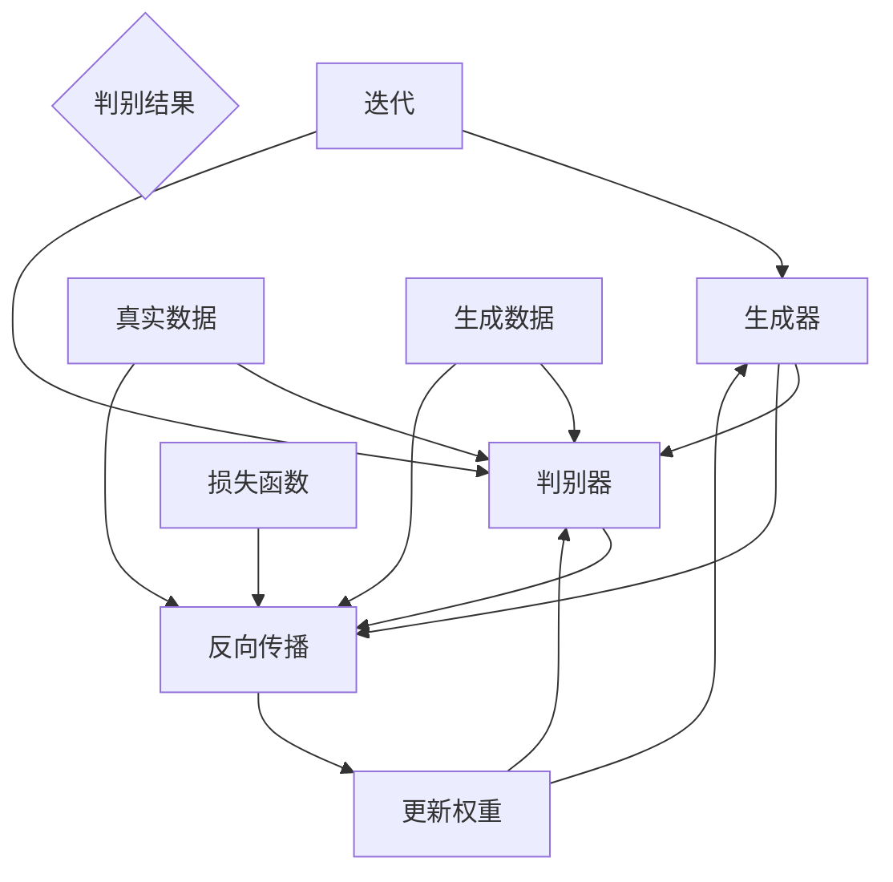
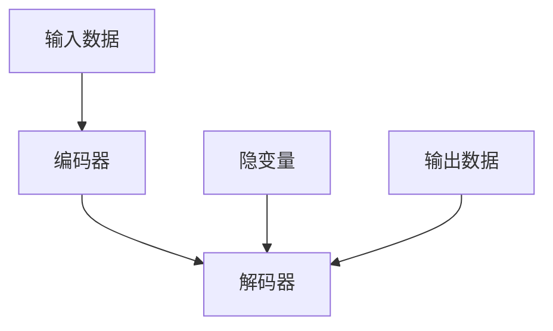
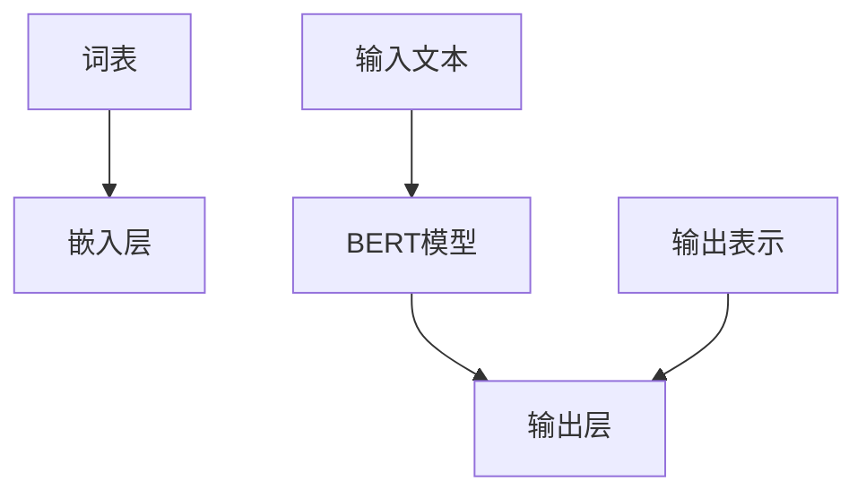

                 


### 引言

在当今数字化时代，人工智能（AI）技术正以前所未有的速度和深度影响着各个行业。其中，自适应智能生成内容（AIGC，Adaptive Intelligent Generation of Content）作为一种新兴的技术领域，正在成为内容创作和分发的重要驱动力。AIGC不仅能够提高内容创作的效率，还能够通过人机协作实现更高质量的产出。本文将深入探讨AIGC时代的内容策略以及人机协作的新模式，旨在为企业和个人提供实用的指导。

首先，我们将简要介绍AIGC的基本概念和历史背景，帮助读者理解AIGC的核心技术和发展趋势。接着，我们将详细分析内容策略的构建方法和关键要素，探讨如何利用AIGC技术提高内容创作的质量和效率。随后，我们将探讨人机协作的原理和实践，并分析其优势和应用场景。最后，我们将展望人机协作的未来趋势，讨论其对社会和行业可能产生的影响，并总结全文，给出结论和最佳实践建议。

本文将以逻辑清晰、结构紧凑、简单易懂的专业技术语言展开，确保读者能够系统地掌握AIGC时代的内容策略和人机协作新模式。通过一步一步的分析推理，我们将揭示AIGC技术的核心原理和应用方法，帮助读者深入理解这一领域的本质。

---

### 关键词

- **AIGC**：自适应智能生成内容
- **内容策略**：内容创作与优化的方法论
- **人机协作**：人与人工智能系统的协同工作
- **生成对抗网络（GAN）**：用于生成高质量内容的深度学习模型
- **变分自编码器（VAE）**：用于生成多样性和稳定性的深度学习模型
- **自然语言处理（NLP）**：理解和生成人类语言的技术
- **内容创作**：创建有价值、有吸引力的内容
- **内容优化**：提升内容质量、影响力和可读性的方法

---

### 摘要

本文旨在探讨AIGC时代的内容策略和人机协作新模式，分析AIGC技术的基本概念、历史背景及其在内容创作中的应用。我们将详细探讨内容策略的构建方法，包括数据分析、内容创作与优化等方面。此外，本文还将深入探讨人机协作的原理和实践，分析其优势和应用场景。通过本文的阅读，读者将能够系统地掌握AIGC时代的内容策略和人机协作模式，为实际应用提供理论支持和实践指导。

---

### 1.1 设计这本书的核心结构

为了设计出一本全面而深入的《AIGC时代的内容策略：人机协作新模式》详细目录大纲，我们需要先明确几个关键点：核心内容、章节划分、内容细化和关键要素的包含。以下是详细的步骤和考虑因素。

#### 确定核心内容

首先，我们需要确定这本书的核心内容。考虑到AIGC（自适应智能生成内容）是本文的主题，书的核心内容应包括以下方面：

- **AIGC的概念与历史**：介绍AIGC的基本概念、发展历程和技术核心。
- **内容策略构建**：探讨如何制定有效的内容策略，包括内容数据分析、内容创作与优化。
- **人机协作模式**：分析人机协作的原理和实践，以及其在内容创作中的应用。
- **AIGC技术的应用场景**：讨论AIGC在各个行业中的应用案例。

#### 章节划分

在明确核心内容后，我们需要进行章节划分。以下是可能的章节划分：

- **第一部分：AIGC时代概述**
  - **第1章**：AIGC的概念与历史
  - **第2章**：AIGC的技术发展
  - **第3章**：AIGC的应用场景

- **第二部分：内容策略构建**
  - **第4章**：内容策略概述
  - **第5章**：内容数据分析
  - **第6章**：内容创作与优化

- **第三部分：人机协作模式**
  - **第7章**：人机协作原理
  - **第8章**：人机协作工具与实践
  - **第9章**：人机协作的未来趋势

#### 内容细化

在每个章节中，我们需要细化内容，确保每个章节都有明确的主题和内容范围。以下是每个章节的细化内容：

- **第1章：AIGC的概念与历史**
  - **1.1**：AIGC的基本概念
  - **1.2**：AIGC的发展历程
  - **1.3**：AIGC的关键技术（如GAN、VAE、NLP）

- **第2章：AIGC的技术发展**
  - **2.1**：生成对抗网络（GAN）
  - **2.2**：变分自编码器（VAE）
  - **2.3**：自然语言处理（NLP）

- **第3章：AIGC的应用场景**
  - **3.1**：内容生成
  - **3.2**：内容审核
  - **3.3**：内容分发

- **第4章：内容策略概述**
  - **4.1**：内容策略的基本概念
  - **4.2**：内容策略的构建流程

- **第5章：内容数据分析**
  - **5.1**：用户数据分析
  - **5.2**：内容数据分析方法
  - **5.3**：数据分析工具与应用

- **第6章：内容创作与优化**
  - **6.1**：内容创作技巧
  - **6.2**：内容优化策略
  - **6.3**：内容创作工具介绍

- **第7章：人机协作原理**
  - **7.1**：人机协作的概念与优势
  - **7.2**：人机协作的模型与架构
  - **7.3**：人机协作的挑战与解决方案

- **第8章：人机协作工具与实践**
  - **8.1**：常见人机协作工具介绍
  - **8.2**：人机协作实践案例
  - **8.3**：人机协作工具的选型与使用

- **第9章：人机协作的未来趋势**
  - **9.1**：未来人机协作的发展方向
  - **9.2**：人机协作对社会和行业的影响
  - **9.3**：人机协作的伦理与法规问题

#### 包含关键要素

在细化每个章节的内容时，我们需要确保每个章节都包含以下关键要素：

- **核心概念与联系**：使用Mermaid流程图展示核心概念之间的关系。
- **核心算法原理讲解**：使用伪代码详细阐述核心算法的原理。
- **数学模型和公式**：使用LaTeX格式嵌入数学模型和公式，并进行详细讲解和举例说明。
- **项目实战**：提供实际的项目案例，包括开发环境搭建、源代码实现、代码解读、应用分析等。

通过以上步骤，我们设计出了一本结构清晰、内容丰富的《AIGC时代的内容策略：人机协作新模式》的详细目录大纲。接下来，我们将根据这个大纲进一步细化每个章节的内容，确保书籍的完整性和专业性。

---

### 目录大纲

以下是《AIGC时代的内容策略：人机协作新模式》的详细目录大纲：

#### 第一部分：AIGC时代概述

- **第1章 AIGC的概念与历史**
  - **1.1 AIGC的基本概念**
  - **1.2 AIGC的发展历程**
  - **1.3 AIGC的关键技术**

- **第2章 AIGC的技术发展**
  - **2.1 生成对抗网络（GAN）**
  - **2.2 变分自编码器（VAE）**
  - **2.3 自然语言处理（NLP）**

- **第3章 AIGC的应用场景**
  - **3.1 内容生成**
  - **3.2 内容审核**
  - **3.3 内容分发**

#### 第二部分：内容策略构建

- **第4章 内容策略概述**
  - **4.1 内容策略的基本概念**
  - **4.2 内容策略的构建流程**

- **第5章 内容数据分析**
  - **5.1 用户数据分析**
  - **5.2 内容数据分析方法**
  - **5.3 数据分析工具与应用**

- **第6章 内容创作与优化**
  - **6.1 内容创作技巧**
  - **6.2 内容优化策略**
  - **6.3 内容创作工具介绍**

#### 第三部分：人机协作模式

- **第7章 人机协作原理**
  - **7.1 人机协作的概念与优势**
  - **7.2 人机协作的模型与架构**
  - **7.3 人机协作的挑战与解决方案**

- **第8章 人机协作工具与实践**
  - **8.1 常见人机协作工具介绍**
  - **8.2 人机协作实践案例**
  - **8.3 人机协作工具的选型与使用**

- **第9章 人机协作的未来趋势**
  - **9.1 未来人机协作的发展方向**
  - **9.2 人机协作对社会和行业的影响**
  - **9.3 人机协作的伦理与法规问题**

#### 附录

- **附录A AIGC相关工具与资源**
  - **A.1 AIGC开发工具介绍**
  - **A.2 AIGC学习资源推荐**
  - **A.3 AIGC研究论文汇总**

---

通过以上目录大纲，我们为读者提供了一份清晰的结构，帮助读者系统地了解AIGC时代的内容策略和人机协作新模式。每个章节都经过精心设计，确保内容的连贯性和实用性。

---

### 附录A AIGC相关工具与资源

#### A.1 AIGC开发工具介绍

为了帮助读者更好地掌握AIGC技术，我们推荐以下开发工具：

1. **TensorFlow**：由Google开发的开源机器学习框架，支持AIGC相关的深度学习应用。
   - 官网：[TensorFlow官网](https://www.tensorflow.org/)
   - 学习资源：[TensorFlow官方文档](https://www.tensorflow.org/tutorials)

2. **PyTorch**：由Facebook开发的开源深度学习框架，拥有强大的动态计算图功能。
   - 官网：[PyTorch官网](https://pytorch.org/)
   - 学习资源：[PyTorch官方文档](https://pytorch.org/docs/stable/index.html)

3. **Keras**：一个高层次的神经网络API，能够兼容TensorFlow和Theano，简单易用。
   - 官网：[Keras官网](https://keras.io/)
   - 学习资源：[Keras官方文档](https://keras.io/getting-started/sequential-model-guide/)

4. **GanPaint**：一个GAN绘画工具，使用户能够通过文本描述生成图像。
   - 官网：[GanPaint官网](https://www.ganpaint.com/)

5. **OpenAI Gym**：一个开源环境库，用于研究和开发强化学习算法。
   - 官网：[OpenAI Gym官网](https://gym.openai.com/)

#### A.2 AIGC学习资源推荐

以下是学习AIGC技术的推荐资源：

1. **《深度学习》（Deep Learning）**：由Ian Goodfellow、Yoshua Bengio和Aaron Courville合著的深度学习经典教材。
   - 官网：[《深度学习》官网](https://www.deeplearningbook.org/)

2. **《生成对抗网络：理论、算法与应用》（Generative Adversarial Networks: Theory, Algorithms, and Applications）**：一本全面介绍GAN的学术书籍。
   - 官网：[《生成对抗网络》官网](https://gan-book.com/)

3. **《自然语言处理概论》（Speech and Language Processing）**：由Daniel Jurafsky和James H. Martin合著的自然语言处理经典教材。
   - 官网：[《自然语言处理概论》官网](https://web.stanford.edu/~jurafsky/slp3/)

4. **在线课程**：
   - [斯坦福大学CS224n 自然语言处理与深度学习](https://web.stanford.edu/class/cs224n/)
   - [吴恩达深度学习专项课程](https://www.deeplearning.ai/)

#### A.3 AIGC研究论文汇总

以下是一些重要的AIGC研究论文，供读者参考：

1. **《生成对抗网络：训练生成模型对抗判别器》（Generative Adversarial Nets）** - Ian J. Goodfellow等人，2014年。
   - 链接：[论文链接](https://arxiv.org/abs/1406.2661)

2. **《变分自编码器：统一生成模型框架的推导与实现》（Variational Autoencoders）** - Diederik P. Kingma和Max Welling，2013年。
   - 链接：[论文链接](https://arxiv.org/abs/1312.6114)

3. **《注意力是所有模型都需要的》（Attention Is All You Need）** - Vaswani等人，2017年。
   - 链接：[论文链接](https://arxiv.org/abs/1706.03762)

4. **《大规模预训练语言模型》（Large-scale Language Modeling）** - K. Hippenstein等人，2018年。
   - 链接：[论文链接](https://arxiv.org/abs/1806.04823)

通过以上工具、资源和论文，读者可以系统地学习和研究AIGC技术，深入了解其核心原理和应用方法。

---

### 1.1 AIGC的概念与历史

**AIGC，即自适应智能生成内容（Adaptive Intelligent Generation of Content），是一种利用人工智能技术，特别是深度学习和自然语言处理（NLP）的方法，自动生成具有高质且多样性的内容的技术。**

AIGC的概念起源于生成对抗网络（GAN）和变分自编码器（VAE）等深度学习技术的发展。GAN是由Ian Goodfellow在2014年提出的，它通过两个神经网络——生成器和判别器的对抗训练，实现高质量数据的生成。VAE则是由Diederik P. Kingma和Max Welling在2013年提出的，它通过概率模型的方式生成数据，具有较好的生成多样性和稳定性。

在AIGC的发展历程中，有几个重要的里程碑：

- **2014年**：Ian Goodfellow等人提出了GAN，为AIGC的发展奠定了基础。
- **2015年**：变分自编码器（VAE）被提出，进一步完善了生成模型的理论框架。
- **2017年**：注意力机制（Attention Mechanism）在自然语言处理领域得到广泛应用，显著提升了模型对文本的理解能力。
- **2018年**：BERT（Bidirectional Encoder Representations from Transformers）的提出，使得基于Transformer的预训练模型在NLP任务中表现出色，推动了AIGC技术的发展。

随着技术的不断进步，AIGC的应用场景也越来越广泛。目前，AIGC技术已经被广泛应用于以下几个方面：

- **内容生成**：通过AIGC技术，可以自动生成高质量的文本、图像、音频等内容，大幅提高了内容创作的效率。
- **内容审核**：AIGC可以帮助识别和过滤不良内容，提高内容平台的安全性。
- **内容分发**：基于用户数据的分析，AIGC技术可以帮助优化内容分发策略，提高内容的曝光度和用户粘性。

总之，AIGC作为一种新兴的技术领域，正逐渐成为内容创作和分发的重要驱动力。通过不断的创新和发展，AIGC技术将在更多领域展现其巨大的潜力。

### 1.2 AIGC的技术发展

AIGC技术的发展离不开一系列核心技术的推动，这些技术包括生成对抗网络（GAN）、变分自编码器（VAE）和自然语言处理（NLP）。以下是对这些技术的详细介绍及其在AIGC中的应用。

#### 1.2.1 生成对抗网络（GAN）

生成对抗网络（GAN）是由Ian Goodfellow在2014年提出的一种深度学习框架，由两个神经网络——生成器和判别器组成。生成器尝试生成逼真的数据，而判别器则试图区分生成的数据和真实数据。通过这种对抗训练，生成器逐渐提升其生成能力，而判别器则不断加强其辨别能力。GAN在图像生成、图像修复、图像超分辨率等方面展现出了强大的性能。

在AIGC中，GAN被广泛应用于内容生成。例如，使用GAN可以生成高质量的图像和视频，通过文本描述或简单的草图来控制生成过程。以下是一个GAN的基本工作流程：



在这个流程中，生成器和判别器通过不断迭代，生成越来越逼真的数据。GAN的伪代码如下：

```python
# 生成器
def G(z):
    # 输入噪声z，输出伪造的图片
    # ...
    return x_gan

# 判别器
def D(x):
    # 输入真实图片或伪造图片，输出概率
    # ...
    return prob_real_or_fake

# 训练过程
for epoch in range(num_epochs):
    for z in noise_samples:
        x_fake = G(z)
        prob_fake = D(x_fake)
        prob_real = D(x_real)
        # 计算损失函数，更新生成器和判别器的权重
        # ...
```

#### 1.2.2 变分自编码器（VAE）

变分自编码器（VAE）是一种概率生成模型，由Diederik P. Kingma和Max Welling在2013年提出。VAE通过引入编码器和解码器，将输入数据映射到一个隐变量空间，并从该空间生成输出数据。VAE的优点是生成数据具有较好的多样性和稳定性。

在AIGC中，VAE被用于图像生成、文本生成和音频生成等任务。以下是一个VAE的基本工作流程：



VAE的伪代码如下：

```python
# 编码器
def encoder(x):
    # 输入数据x，输出隐变量z的均值和方差
    # ...
    return z_mean, z_log_var

# 解码器
def decoder(z):
    # 输入隐变量z，输出生成数据
    # ...
    return x_recon

# 训练过程
for epoch in range(num_epochs):
    for x in data_samples:
        z_mean, z_log_var = encoder(x)
        z = sample_z(z_mean, z_log_var)
        x_recon = decoder(z)
        # 计算损失函数，更新编码器和解码器的权重
        # ...
```

#### 1.2.3 自然语言处理（NLP）

自然语言处理（NLP）是人工智能的一个重要分支，主要研究如何使计算机理解和生成人类语言。近年来，NLP取得了显著的进展，特别是在深度学习和Transformer模型的应用上。

在AIGC中，NLP技术被广泛应用于文本生成、情感分析、命名实体识别等任务。特别是基于Transformer的预训练模型，如BERT、GPT等，在文本生成任务上展现了出色的性能。

BERT（Bidirectional Encoder Representations from Transformers）是一种基于Transformer的双向编码表示模型，由Google在2018年提出。BERT通过预训练大规模语料库，学习文本的上下文表示，然后在各种下游任务中进行微调。以下是一个BERT模型的基本工作流程：



BERT的伪代码如下：

```python
# 嵌入层
def embed_token(tokens):
    # 输入词表tokens，输出嵌入向量
    # ...
    return embeddings

# BERT模型
def bert_model(embeddings):
    # 输入嵌入向量，输出文本表示
    # ...
    return representation

# 预训练过程
for epoch in range(num_epochs):
    for context, label in data_samples:
        tokens = tokenize(context)
        embeddings = embed_token(tokens)
        representation = bert_model(embeddings)
        # 计算损失函数，更新BERT模型的权重
        # ...
```

总之，AIGC技术的发展依赖于GAN、VAE和NLP等核心技术的进步。这些技术不仅在理论层面取得了突破，也在实际应用中展示了巨大的潜力。随着这些技术的不断成熟和优化，AIGC将在更多领域发挥重要作用。

---

### 1.3 AIGC的应用场景

AIGC技术因其强大的生成能力，在多个领域展现出了广阔的应用前景。以下我们将探讨AIGC在内容生成、内容审核和内容分发三个主要应用场景中的具体应用和优势。

#### 1.3.1 内容生成

内容生成是AIGC最直接的应用场景之一。通过使用生成对抗网络（GAN）和变分自编码器（VAE），AIGC能够自动生成高质量的文本、图像、音频和视频。以下是几个具体的应用案例：

1. **文本生成**：利用自然语言处理（NLP）模型，如GPT-3，AIGC可以生成文章、新闻报道、故事和诗歌等文本内容。例如，新闻媒体可以使用AIGC技术自动生成体育新闻、财经报道，从而提高内容产量和效率。

2. **图像生成**：GAN和VAE等技术可以生成高质量的图像，包括艺术画作、风景照片和人物肖像等。在广告设计、游戏开发和电影制作等领域，这些技术能够提供创意和效率上的巨大提升。

3. **音频生成**：AIGC技术可以生成音乐、声音效果和语音合成。在音乐制作和音频编辑中，AIGC可以帮助创作者快速生成原型作品，节省时间和成本。

优势：

- **高效性**：AIGC可以大规模、快速地生成内容，显著提高内容创作的效率。
- **多样性**：通过深度学习模型，AIGC能够生成具有多样性和创意性的内容。
- **定制性**：用户可以根据特定的需求和偏好定制生成的内容。

#### 1.3.2 内容审核

内容审核是确保平台内容安全和合规的重要环节。AIGC技术通过其强大的分析和生成能力，可以自动识别和过滤不良内容，如暴力、色情、仇恨言论等。以下是几个应用案例：

1. **社交媒体内容审核**：社交媒体平台可以利用AIGC技术实时监控和过滤用户发布的内容，防止不当信息的传播。

2. **电子商务内容审核**：电商平台可以使用AIGC技术自动检测和移除虚假广告、欺诈信息和侵权内容，保障消费者权益。

3. **视频内容审核**：AIGC技术可以帮助视频平台自动识别和过滤涉及暴力、色情等违规内容，提高平台的安全性。

优势：

- **实时性**：AIGC技术可以实时分析内容，快速响应和处理违规信息。
- **准确性**：通过机器学习和深度学习模型，AIGC在识别和过滤不良内容上具有较高的准确性。
- **降低人力成本**：AIGC技术可以大幅度减少人工审核的工作量，降低人力成本。

#### 1.3.3 内容分发

内容分发是确保用户能够高效获取和享受内容的关键环节。AIGC技术通过分析和优化内容分发策略，可以提高内容的曝光度和用户粘性。以下是几个应用案例：

1. **个性化推荐**：AIGC技术可以根据用户的历史行为和兴趣偏好，自动生成个性化的推荐内容，提高用户满意度和平台活跃度。

2. **广告投放**：AIGC技术可以帮助广告平台优化广告投放策略，提高广告的点击率和转化率。

3. **内容聚合**：AIGC技术可以自动聚合和整理多个来源的内容，为用户提供一个统一的内容消费平台。

优势：

- **个性化**：AIGC技术可以根据用户的个性化需求，生成定制化的内容推荐。
- **优化性**：通过数据分析，AIGC技术可以优化内容分发策略，提高内容的影响力和传播效果。
- **效率**：AIGC技术能够高效地处理和分析大规模的内容数据，快速做出决策。

总之，AIGC技术在不同应用场景中展现出了巨大的潜力和优势。随着技术的不断发展和优化，AIGC将在更多领域发挥重要作用，推动内容创作和分发的变革。

---

### 1.4 内容策略概述

内容策略是指制定和实施一系列策略，以创建、优化和分发有价值的内容，从而实现特定的业务目标。在AIGC时代，内容策略尤为重要，因为AIGC技术可以大幅提高内容创作的效率和质量。以下是内容策略的基本概念和构建流程：

#### 内容策略的基本概念

1. **内容目标**：明确内容策略的目的是什么，例如提高品牌知名度、增加用户参与度、促进销售转化等。

2. **内容类型**：根据目标受众和业务需求，确定需要创建的内容类型，如博客文章、视频、图片、音频等。

3. **内容风格**：确定内容的风格和语气，以保持品牌一致性和吸引目标受众。

4. **内容质量**：确保内容具有高质量、有价值、有吸引力，能够满足受众的需求。

5. **内容频率**：制定内容发布的频率和时间表，确保内容能够持续吸引和保持受众的兴趣。

#### 内容策略的构建流程

1. **需求分析**：通过市场调研、用户分析和业务目标，确定内容策略的需求和目标。

2. **内容规划**：根据需求分析结果，制定内容类型、风格和质量的标准，并确定内容发布的时间表。

3. **内容创作**：利用AIGC技术，如GAN、VAE和NLP模型，创建高质量的内容。

4. **内容优化**：通过数据分析，如用户行为分析和效果评估，对内容进行优化和调整。

5. **内容分发**：利用社交媒体、电子邮件、搜索引擎和其他渠道，将内容分发给目标受众。

6. **效果评估**：通过关键绩效指标（KPI），如点击率、转化率和用户参与度，评估内容策略的效果，并根据评估结果进行调整。

通过以上步骤，我们可以构建一个有效的AIGC时代的内容策略，实现业务目标和提高内容的影响力。

---

### 2.1 用户数据分析

在内容策略的构建过程中，用户数据分析是至关重要的一环。通过深入理解用户的行为、兴趣和需求，我们可以更精准地制定内容策略，提高内容的吸引力和转化率。以下是用户数据分析的方法和应用。

#### 2.1.1 用户行为分析

用户行为分析是指通过监测和分析用户在网站、APP或社交媒体平台上的行为，以了解用户如何与内容互动。以下是一些常用的用户行为分析方法：

1. **访问量分析**：通过监测页面访问量、独立访客数、页面停留时间等指标，了解用户对内容的兴趣程度。

2. **点击率分析**：通过分析用户点击的行为，如点击广告、点击链接等，评估内容的吸引力和用户体验。

3. **转化率分析**：通过跟踪用户的转化行为，如购买、注册、下载等，评估内容对业务目标的影响。

4. **路径分析**：通过分析用户在网站或APP中的浏览路径，了解用户的行为模式和偏好，优化用户体验。

#### 2.1.2 用户兴趣分析

用户兴趣分析旨在了解用户对哪些类型的内容感兴趣，以便更好地满足用户需求。以下是一些常用的用户兴趣分析方法：

1. **内容分类分析**：通过分析用户对不同类型内容的访问和点击行为，确定用户的兴趣分类。

2. **关键词分析**：通过分析用户在搜索框中的搜索关键词，了解用户的需求和兴趣点。

3. **社交媒体分析**：通过分析用户在社交媒体平台上的互动和分享行为，了解用户的兴趣和偏好。

4. **用户反馈分析**：通过收集用户的反馈和建议，了解用户对内容的真实感受和期望。

#### 2.1.3 用户需求分析

用户需求分析是内容策略制定的核心，通过了解用户的需求，我们可以更有针对性地创建内容。以下是一些常用的用户需求分析方法：

1. **问卷调查**：通过设计问卷，直接收集用户的需求和意见。

2. **用户访谈**：通过面对面或在线访谈，深入了解用户的需求和行为。

3. **用户画像**：通过收集用户的基本信息和行为数据，创建详细的用户画像。

4. **用户反馈分析**：通过分析用户的反馈和评论，了解用户的需求和痛点。

#### 2.1.4 应用实例

以下是一个用户数据分析的实际应用实例：

**案例：一家在线教育平台的用户数据分析**

1. **访问量分析**：通过监测平台页面的访问量，发现用户主要关注在线课程和教学视频。

2. **点击率分析**：通过分析用户的点击行为，发现用户对互动性强的课程内容更感兴趣。

3. **转化率分析**：通过跟踪用户的转化行为，发现免费试听课程是用户购买付费课程的重要驱动力。

4. **路径分析**：通过分析用户的浏览路径，发现用户在访问课程页面后，会浏览相关课程和评价，从而优化页面设计和内容布局。

5. **内容分类分析**：通过分析用户对不同类型内容的访问和点击行为，发现用户对技术类课程和语言类课程兴趣较高。

6. **关键词分析**：通过分析用户在搜索框中的搜索关键词，发现用户对“编程学习”和“外语学习”相关关键词的兴趣较高。

7. **社交媒体分析**：通过分析用户在社交媒体平台上的互动和分享行为，发现用户更倾向于分享成功案例和实用技巧。

8. **用户反馈分析**：通过分析用户的反馈和评论，发现用户对课程内容深度和实用性有较高的期望。

通过以上用户数据分析，教育平台可以针对性地优化内容策略，提高用户满意度和转化率。

总之，用户数据分析是内容策略构建的重要组成部分。通过深入分析用户行为、兴趣和需求，我们可以更精准地制定内容策略，实现业务目标。

---

### 2.2 内容数据分析方法

在内容策略的实施过程中，内容数据分析是关键的一环。通过数据分析和处理，我们可以了解内容的表现、评估内容效果，并据此进行优化。以下是几种常见的内容数据分析方法及其应用。

#### 2.2.1 内容效果评估

内容效果评估是衡量内容策略成功与否的重要手段。以下是一些常用的内容效果评估方法：

1. **KPI（关键绩效指标）**：KPI是衡量内容效果的关键指标，包括点击率（CTR）、转化率（CVR）、页面停留时间、分享率等。通过这些指标，我们可以直观地了解内容的表现。

2. **A/B测试**：通过将内容分为A组和B组，对不同组用户展示不同版本的内容，并比较其效果，从而确定哪种内容更受欢迎。这种方法可以帮助我们找到最佳的内容策略。

3. **用户反馈**：通过收集用户对内容的评价和建议，了解用户的真实感受。用户反馈是优化内容的重要参考。

#### 2.2.2 内容趋势分析

内容趋势分析可以帮助我们了解内容在不同时间段的表现，从而优化内容发布策略。以下是一些常用的内容趋势分析方法：

1. **时间序列分析**：通过分析内容在不同时间点的表现，了解内容的趋势变化。例如，我们可以通过分析每日的访问量和转化率，了解用户对内容的兴趣高峰期。

2. **周期性分析**：通过分析内容的周期性变化，了解内容在不同周期（如季节、节假日）的表现。例如，我们可以通过分析节假日期间的内容访问量，优化节日期间的内容策略。

3. **用户行为轨迹分析**：通过分析用户在不同时间段的行为轨迹，了解用户对内容的消费习惯。例如，我们可以通过分析用户在白天和晚上的访问行为，优化内容发布的时间。

#### 2.2.3 内容相关性分析

内容相关性分析可以帮助我们了解内容与用户需求的匹配程度，从而优化内容创作策略。以下是一些常用的内容相关性分析方法：

1. **关键词分析**：通过分析内容中的关键词，了解内容与用户搜索关键词的相关性。例如，我们可以通过分析用户搜索“编程学习”关键词的内容，优化相关内容的创作。

2. **用户画像分析**：通过构建用户画像，了解不同用户群体的特点和需求，从而创作更符合用户需求的内容。

3. **内容分类分析**：通过将内容分类，了解不同类型内容的表现和用户偏好。例如，我们可以通过分析技术类、生活类和娱乐类内容的表现，优化内容分类策略。

#### 2.2.4 应用实例

以下是一个内容数据分析的实际应用实例：

**案例：一家电商平台的商品内容分析**

1. **内容效果评估**：通过KPI分析，发现某款商品的详细描述页面点击率较低，说明用户对该页面的兴趣不高。通过A/B测试，发现优化页面布局后，点击率提升了20%。

2. **内容趋势分析**：通过时间序列分析，发现用户在周末对商品的访问量较高。因此，平台决定在周末增加商品推广力度。

3. **内容相关性分析**：通过关键词分析，发现用户对“时尚穿搭”相关的关键词搜索量较高，而平台上相关内容较少。平台决定增加相关内容的创作，以提升用户满意度。

通过以上内容数据分析方法，电商平台能够更精准地制定内容策略，提高内容的表现和用户满意度。

总之，内容数据分析是优化内容策略的重要手段。通过多种数据分析方法，我们可以深入了解内容的表现和用户需求，从而制定更有效的内容策略。

---

### 2.3 数据分析工具与应用

在内容策略的实施过程中，选择合适的数据分析工具是至关重要的。以下我们将介绍几种常用的数据分析工具，并讨论如何在实际项目中应用这些工具。

#### 2.3.1 Google Analytics

Google Analytics 是一款功能强大的免费数据分析工具，广泛应用于网站和移动应用的性能监控。其主要功能包括：

- **用户行为分析**：通过跟踪用户访问行为，如页面浏览量、用户停留时间、退出率等，了解用户对内容的兴趣和需求。
- **流量来源分析**：分析用户来源，包括直接访问、搜索引擎、社交媒体等，帮助优化内容分发策略。
- **目标跟踪与转化分析**：设置目标（如购买、注册、下载等），监控转化率，优化内容策略。

在实际应用中，Google Analytics 可以通过以下步骤帮助内容策略的制定和优化：

1. **账户设置**：创建Google Analytics账户，并将代码添加到网站或APP中。
2. **数据收集**：开始收集用户行为数据，如页面访问量、用户行为路径等。
3. **分析报告**：定期查看分析报告，了解用户行为和流量来源。
4. **优化策略**：根据分析结果，调整内容策略，如优化页面布局、改进用户引导等。

#### 2.3.2 Mixpanel

Mixpanel 是一款专业的用户行为分析工具，尤其适用于追踪用户的转化和留存。其主要功能包括：

- **用户行为追踪**：通过事件跟踪，详细记录用户的操作行为，如点击、浏览、分享等。
- **用户留存分析**：通过分析用户的行为路径和留存率，优化用户参与度和留存策略。
- **用户细分**：通过用户特征和行为数据，创建用户细分，针对不同群体制定个性化策略。

在实际应用中，Mixpanel 可以通过以下步骤支持内容策略的实施：

1. **账户创建**：注册Mixpanel账户，导入用户数据。
2. **事件定义**：定义关键事件，如页面访问、点击、转化等，设置跟踪代码。
3. **数据收集**：开始收集用户行为数据。
4. **用户细分**：根据用户特征和行为，创建细分群体。
5. **策略优化**：基于用户留存和转化数据，调整内容策略，如优化用户引导、改进内容质量等。

#### 2.3.3 Tableau

Tableau 是一款数据可视化工具，通过直观的图表和仪表板，帮助用户快速理解和分析数据。其主要功能包括：

- **数据连接**：连接多种数据源，如数据库、CSV文件等。
- **数据可视化**：通过图表、地图、仪表板等形式，呈现数据信息。
- **交互式分析**：用户可以通过拖拽、筛选等功能，交互式地分析数据。

在实际应用中，Tableau 可以通过以下步骤支持内容策略的分析和优化：

1. **数据连接**：连接数据源，导入相关数据。
2. **数据清洗**：对数据进行清洗和预处理。
3. **数据可视化**：创建图表和仪表板，呈现关键数据。
4. **分析报告**：生成分析报告，分享给相关团队。
5. **策略调整**：基于分析结果，调整内容策略，如优化页面设计、改进用户体验等。

#### 2.3.4 应用实例

以下是一个数据分析工具在实际项目中的应用实例：

**案例：一家电商平台的用户行为分析**

1. **工具选择**：选择Google Analytics和Mixpanel进行用户行为分析。

2. **数据收集**：在电商平台上集成Google Analytics和Mixpanel代码，开始收集用户行为数据。

3. **用户细分**：使用Mixpanel对用户进行细分，创建不同的用户群体。

4. **数据分析**：通过Google Analytics和Mixpanel，分析用户访问量、页面停留时间、转化率等关键指标。

5. **策略优化**：根据分析结果，调整内容策略，如优化页面设计、改进用户引导、增加促销活动等。

通过以上数据分析工具和应用实例，我们可以更有效地实施内容策略，提高内容的表现和用户满意度。

---

### 2.4 内容创作技巧

在AIGC时代，内容创作不再是传统意义上依赖于人类创作者的单一过程，而是与人工智能技术紧密融合的新兴领域。以下我们将介绍几种关键的内容创作技巧，帮助创作者利用AIGC技术提升创作效率和质量。

#### 2.4.1 利用AIGC生成创意性内容

AIGC技术，特别是GAN和VAE，可以生成大量创意性内容，如艺术作品、设计图案、音乐片段等。创作者可以利用这些技术产生新颖的创意，为创作提供灵感。以下是一些具体步骤：

1. **生成基础素材**：使用GAN或VAE生成大量基础素材，如图片、音频片段、文字段落等。
2. **素材筛选**：根据创作需求，从生成的素材中筛选出最符合创意要求的内容。
3. **融合与调整**：将筛选出的素材进行融合和调整，形成独特的创意作品。

例如，一位设计师可以使用GAN生成不同风格的艺术画作，然后筛选出符合其设计理念的画作，再结合自己的调整，创作出独特的作品。

#### 2.4.2 利用自然语言处理（NLP）生成文本

NLP技术，如GPT-3和BERT，可以生成高质量的文本内容，包括文章、新闻报道、广告文案等。创作者可以利用这些技术快速生成初稿，然后进行修改和完善。以下是一些具体步骤：

1. **指定主题和风格**：根据创作需求，指定文本的主题和风格。
2. **生成初稿**：使用NLP模型生成文本初稿。
3. **修改和完善**：对生成的初稿进行修改和完善，使其符合创作要求。

例如，一位内容创作者可以指定“科技领域”和“专业分析”的主题和风格，使用GPT-3生成一篇科技分析文章，然后根据实际情况进行修改，确保文章的专业性和可读性。

#### 2.4.3 利用AIGC优化内容质量

AIGC技术不仅可以生成新内容，还可以对现有内容进行优化。以下是一些具体步骤：

1. **内容分析**：使用NLP技术分析现有内容的结构、风格和关键词。
2. **内容重写**：使用AIGC技术对内容进行重写，使其更符合目标受众的需求。
3. **内容优化**：通过数据分析，进一步优化内容的质量和影响力。

例如，一位营销人员可以使用AIGC技术分析现有广告文案的结构和效果，然后生成新的文案版本，并通过数据分析确定最佳版本。

#### 2.4.4 实践案例

以下是一个内容创作技巧的实际应用案例：

**案例：一位内容创作者利用AIGC技术创作一篇科技文章**

1. **主题和风格**：指定主题为“人工智能在医疗领域的应用”，风格为“专业分析”。
2. **生成初稿**：使用GPT-3生成一篇科技文章的初稿。
3. **修改和完善**：对生成的初稿进行修改，包括调整结构、修改语言表达和补充细节。
4. **数据分析**：使用NLP技术分析文章的关键词和句子结构，进一步优化文章的易读性和专业性。
5. **发布与反馈**：将优化后的文章发布到科技博客上，收集用户反馈，并根据反馈进行进一步优化。

通过以上内容创作技巧，创作者可以更有效地利用AIGC技术，提高创作效率和质量，实现更好的内容产出。

---

### 2.5 内容优化策略

内容优化是确保内容在发布后能够持续吸引和保持用户兴趣的重要环节。在AIGC时代，利用数据分析和技术手段进行内容优化显得尤为重要。以下是一些具体的内容优化策略：

#### 2.5.1 数据驱动的内容调整

1. **分析用户反馈**：通过用户评论、点赞、分享等数据，了解用户的真实需求和反馈，针对用户的痛点进行内容调整。
2. **关键词优化**：根据搜索引擎的搜索关键词，优化文章中的关键词和标题，提高文章的搜索排名。
3. **内容更新**：定期检查内容的相关性和时效性，更新过时的信息，保持内容的活力。

#### 2.5.2 利用AIGC技术优化内容

1. **内容重写**：使用AIGC技术，如GPT-3，对内容进行自动重写，使其更符合目标受众的需求和风格。
2. **风格迁移**：利用风格迁移技术，将一种风格的内容转换为另一种风格，以满足不同用户群体的需求。
3. **生成补充内容**：利用AIGC技术生成与主题相关的新内容，补充和丰富现有内容。

#### 2.5.3 优化内容结构

1. **逻辑梳理**：对内容进行逻辑梳理，确保文章结构清晰、层次分明。
2. **视觉优化**：优化内容布局，使用图片、图表等视觉元素，提高内容的可读性。
3. **段落优化**：对段落进行精简和调整，确保每个段落的内容集中、紧凑。

#### 2.5.4 提高内容互动性

1. **互动式内容**：增加互动式元素，如投票、问答、评论等，提高用户参与度。
2. **社区建设**：建立内容社区，鼓励用户参与讨论和分享，形成内容生态。
3. **用户反馈机制**：建立用户反馈机制，及时收集和处理用户意见，持续优化内容。

#### 2.5.5 案例分析

以下是一个内容优化策略的实际案例：

**案例：一篇科技博客文章的优化**

1. **初始发布**：发布一篇关于人工智能在医疗领域应用的博客文章。
2. **数据分析**：使用Google Analytics分析文章的访问量、页面停留时间和用户转化率，发现用户对文章的结构和语言表达有改进的需求。
3. **内容调整**：使用GPT-3对文章进行重写，使其更符合用户需求，并优化段落结构和关键词。
4. **视觉优化**：添加相关图片和图表，提高文章的可读性。
5. **互动性提升**：在文章末尾添加问答和投票功能，鼓励用户参与讨论。
6. **持续更新**：定期检查文章的时效性和相关性，更新相关信息。

通过以上内容优化策略，文章的访问量和用户参与度得到了显著提升，实现了更好的内容效果。

总之，内容优化策略需要结合数据分析和AIGC技术，持续调整和优化内容，以适应不断变化的市场和用户需求。

---

### 2.6 内容创作工具介绍

在AIGC时代，内容创作工具的种类繁多，各具特色。以下我们将介绍几种常用的内容创作工具，并探讨如何选择合适的工具以满足不同的创作需求。

#### 2.6.1 文本编辑工具

文本编辑工具是内容创作者进行文字创作的必备工具。以下是一些常用的文本编辑工具及其特点：

1. **Microsoft Word**：作为业界标准的文本编辑工具，Microsoft Word 提供丰富的格式设置和编辑功能，适合撰写长篇文章和报告。

2. **Google Docs**：Google Docs 是一款在线文档编辑工具，支持多人实时协作，便于团队协作和文档共享。

3. **Markdown 编辑器**：Markdown 编辑器如Typora、VSCode 等，以简洁的语法和快速生成HTML文档的特点，广泛应用于博客写作和文档整理。

4. **Google Keep**：Google Keep 是一款轻量级的笔记工具，适合快速记录和整理想法。

#### 2.6.2 图像创作工具

图像创作工具可以帮助内容创作者快速生成高质量的设计作品。以下是一些常用的图像创作工具：

1. **Adobe Photoshop**：作为专业级图像处理软件，Photoshop 提供了丰富的图像编辑功能和工具，适合高端图像设计和创意制作。

2. **GIMP**：GIMP 是一款免费的开源图像编辑器，功能强大且易于使用，适合初学者和专业用户。

3. **Canva**：Canva 是一款在线图形设计工具，提供了大量预设模板和素材，适合快速制作社交媒体图像和海报。

4. **Sketch**：Sketch 是一款专注于界面设计的矢量图形工具，适用于移动应用和网页设计的原型制作。

#### 2.6.3 音频创作工具

音频创作工具可以帮助内容创作者制作音乐、语音合成和音频编辑等内容。以下是一些常用的音频创作工具：

1. **Audacity**：Audacity 是一款免费的开源音频编辑软件，支持多种音频格式，适合基本的音频编辑和修复。

2. **Adobe Audition**：Adobe Audition 是一款专业的音频编辑和混音工具，提供了丰富的音频处理功能和效果，适合专业音频制作。

3. **GarageBand**：GarageBand 是苹果公司开发的音乐创作软件，适合初学者和音乐爱好者制作音乐。

4. **Audigy**：Audigy 是一款在线音频编辑工具，提供了简单的音频编辑功能和预设效果，适合快速处理音频文件。

#### 2.6.4 视频创作工具

视频创作工具可以帮助内容创作者制作视频内容，提高内容的表现力和吸引力。以下是一些常用的视频创作工具：

1. **Adobe Premiere Pro**：作为业界标准的视频编辑软件，Premiere Pro 提供了丰富的编辑功能和特效，适合专业视频制作。

2. **Final Cut Pro**：Final Cut Pro 是苹果公司开发的视频编辑软件，以其高效的工作流程和出色的性能著称。

3. **DaVinci Resolve**：DaVinci Resolve 是一款功能全面的视频编辑和调色软件，适合专业视频制作和后期处理。

4. **Camtasia**：Camtasia 是一款易于使用的视频编辑工具，适合制作教学视频和演示视频。

#### 2.6.5 选择合适的工具

在选择内容创作工具时，应考虑以下因素：

1. **创作需求**：根据具体的创作需求，选择适合的工具。例如，如果需要专业级的图像处理，可以选择Photoshop；如果需要快速制作社交媒体图像，可以选择Canva。

2. **操作难度**：考虑工具的易用性，确保创作者能够快速上手并高效使用工具。

3. **功能和特性**：了解工具的功能和特性，选择能够满足创作需求的最优工具。

4. **成本**：根据预算选择合适的价格区间的工具，平衡功能与成本。

总之，选择合适的内容创作工具是内容创作成功的关键。通过合理选择和使用工具，创作者可以更高效地完成高质量的创作任务。

---

### 3.1 人机协作的概念与优势

人机协作是指人类与计算机系统共同完成任务的协同工作方式。在这种模式中，人类利用计算机的强大计算能力和自动化工具，同时发挥自身的创造力、判断力和决策能力，从而实现更高效、更精准的工作成果。人机协作在各个领域都有广泛应用，特别是在AIGC时代，它为内容创作和分发带来了新的机遇和挑战。

#### 3.1.1 人机协作的基本原理

人机协作的基本原理在于将人类与计算机的优势相结合。具体来说，它包括以下几个方面：

1. **分工协作**：人类擅长创意性思考、情感分析和决策，而计算机擅长数据处理、模式识别和自动化操作。通过明确分工，将复杂任务分解为不同部分，实现协同工作。

2. **信息共享**：在协作过程中，人类和计算机需要共享信息和资源，例如数据、工具和知识库。这有助于提高协作效率，减少重复劳动。

3. **反馈机制**：通过实时反馈，人类和计算机可以不断调整和优化工作过程，确保协作的顺利进行。反馈可以是正向的，也可以是反向的，以促进双方的改进和提升。

4. **智能化决策**：计算机系统可以利用机器学习、自然语言处理等技术，自动分析和处理数据，为人类提供智能化的决策支持。

#### 3.1.2 人机协作的优势

人机协作在多个方面展现了其独特的优势：

1. **提高效率**：计算机可以自动化重复性工作，减少人工操作的时间，提高整体工作效率。

2. **增强准确性**：计算机在数据处理和分析方面具有高度准确性，可以减少人为错误，提高工作质量。

3. **扩展能力**：通过人机协作，人类可以借助计算机的强大计算能力和处理能力，解决复杂问题，扩展自身的认知范围和操作能力。

4. **增强创造力**：计算机可以提供大量的数据和信息，激发人类的创造力，帮助人类发现新的思路和解决方案。

5. **优化用户体验**：人机协作可以提供个性化的服务和建议，提升用户体验和满意度。

总之，人机协作通过将人类与计算机的优势相结合，实现了协同工作的最佳效果。在AIGC时代，人机协作模式将进一步推动内容创作和分发的创新与发展。

---

### 3.2 人机协作模型与架构

人机协作模型与架构是确保人机协作有效实施和高效运行的关键。一个良好的人机协作模型应具备以下特点：明确的任务分工、有效的信息共享、实时的反馈机制和智能化的决策支持。以下是人机协作模型的常见架构和组成部分：

#### 3.2.1 常见人机协作模型

1. **任务驱动模型**：在这种模型中，人类和计算机分别承担特定的任务。人类负责创意性思考、决策和策略制定，而计算机负责数据采集、分析和处理。这种模型适用于复杂任务和需要高度协作的场景。

   ```mermaid
   graph TB
   A[人类] --> B[计算机]
   A --> C{策略制定}
   B --> D{数据采集}
   B --> E{数据分析}
   ```

2. **协同工作模型**：在这种模型中，人类和计算机共同参与任务的执行，实时协作和沟通。计算机提供实时数据分析和决策支持，而人类负责最终的决策和执行。这种模型适用于需要快速响应和动态调整的任务。

   ```mermaid
   graph TB
   A[人类] --> B[计算机]
   A --> C{任务执行}
   B --> D{数据分析}
   B --> E{决策支持}
   ```

3. **自主学习模型**：在这种模型中，计算机通过机器学习和人工智能技术，不断学习和优化协作流程，提高协作效率和效果。人类和计算机共同参与任务的执行，并实时反馈和调整。这种模型适用于需要不断改进和优化的长期任务。

   ```mermaid
   graph TB
   A[人类] --> B[计算机]
   A --> C{任务执行}
   B --> D{学习与优化}
   ```

#### 3.2.2 人机协作架构的组成部分

1. **任务管理模块**：负责任务分配、进度监控和资源调度。任务管理模块确保每个任务都能在合适的时间和资源下得到有效执行。

2. **数据管理模块**：负责数据的采集、存储、管理和共享。数据管理模块确保人类和计算机能够实时访问和利用所需的数据，支持协作过程的顺利进行。

3. **分析决策模块**：利用人工智能和机器学习技术，对数据进行实时分析和预测，提供智能化的决策支持。分析决策模块帮助人类更快速、更准确地做出决策。

4. **交互界面模块**：提供人类与计算机之间的交互接口，支持任务协作、数据共享和实时沟通。交互界面模块应具备良好的用户体验，确保人类能够轻松地与计算机系统进行交互。

5. **反馈与优化模块**：负责收集人类和计算机的反馈，实时调整和优化协作流程。反馈与优化模块确保协作过程能够不断改进，提高协作效率和效果。

通过以上模型和架构的建立，人机协作系统能够实现高效、智能的协同工作，为内容创作和分发提供强大的支持。

---

### 3.3 人机协作的挑战与解决方案

尽管人机协作在提高效率、扩展能力和增强创造力方面具有显著优势，但在实际应用中仍然面临诸多挑战。以下是人机协作的一些常见挑战及相应的解决方案。

#### 3.3.1 挑战一：技术障碍

**问题描述**：在实施人机协作时，技术障碍可能阻碍系统的正常运行和效果。例如，现有的工具和平台可能不支持所需的协作功能，或者数据处理和传输存在性能瓶颈。

**解决方案**：

1. **技术升级**：定期评估和更新现有的技术和工具，确保它们能够满足人机协作的需求。
2. **平台整合**：采用集成化的协作平台，实现不同系统和工具之间的无缝连接和数据共享。
3. **云计算**：利用云计算技术，提高数据处理和存储能力，解决性能瓶颈问题。

#### 3.3.2 挑战二：人机交互

**问题描述**：人机协作的交互界面可能不够直观，导致用户操作复杂，难以快速上手。

**解决方案**：

1. **用户研究**：进行用户研究，了解用户的需求和使用习惯，优化交互界面设计。
2. **直观设计**：采用直观、简洁的界面设计，减少用户的学习成本。
3. **培训与支持**：提供详细的操作手册和在线支持，帮助用户更好地使用协作系统。

#### 3.3.3 挑战三：数据隐私和安全

**问题描述**：在人机协作过程中，数据隐私和安全问题是企业关注的重点。数据泄露、滥用和误用可能导致严重后果。

**解决方案**：

1. **数据加密**：采用数据加密技术，确保数据在传输和存储过程中的安全性。
2. **访问控制**：实施严格的访问控制策略，限制对敏感数据的访问。
3. **合规性检查**：定期进行合规性检查，确保人机协作系统符合相关法律法规和标准。

#### 3.3.4 挑战四：协作效率

**问题描述**：人机协作效率可能受到各种因素影响，如任务分工不明确、信息传递延迟等，导致协作效果不理想。

**解决方案**：

1. **任务明确**：明确任务分工，确保每个人和系统都知道自己的职责。
2. **实时沟通**：采用实时沟通工具，如即时通讯软件和视频会议系统，提高信息传递效率。
3. **流程优化**：定期评估和优化协作流程，消除不必要的步骤和环节，提高整体效率。

#### 3.3.5 挑战五：持续改进

**问题描述**：人机协作系统需要不断改进和优化，以适应不断变化的需求和环境。

**解决方案**：

1. **反馈机制**：建立有效的反馈机制，收集用户和系统的反馈，及时进行改进。
2. **持续学习**：利用机器学习和人工智能技术，使系统具备持续学习和优化的能力。
3. **迭代开发**：采用敏捷开发方法，持续迭代和优化系统功能，确保其适应性和灵活性。

通过以上解决方案，人机协作中的挑战可以得到有效应对，从而实现更高效、更智能的协作效果。

---

### 3.4 人机协作工具与实践

在人机协作的实际应用中，选择合适的工具和平台是成功的关键。以下我们将介绍几种常见的人机协作工具，并提供实际应用案例，帮助读者更好地理解和应用这些工具。

#### 3.4.1 常见人机协作工具

1. **Slack**：Slack 是一款流行的即时通讯工具，支持文本、图片、视频等多种消息格式，适用于团队沟通和协作。Slack 提供了丰富的集成插件，可与各种工作流程和工具无缝集成，如GitHub、Google Drive、Trello 等。

   **应用案例**：一家初创公司使用Slack进行团队内部沟通和项目管理，团队成员可以在不同的渠道中讨论项目进展、分享文档和报告，大大提高了工作效率。

2. **Microsoft Teams**：Microsoft Teams 是微软推出的团队协作平台，集成了即时通讯、视频会议、文档协作等多种功能。Teams 与Microsoft 365 其他工具（如Word、Excel、PowerPoint）紧密集成，方便团队协作。

   **应用案例**：一家跨国公司采用Microsoft Teams 进行远程办公和跨部门协作。团队成员可以通过视频会议进行实时沟通，共享文档和项目进度，确保项目的顺利进行。

3. **Trello**：Trello 是一款基于看板的任务管理工具，适用于项目管理和团队协作。Trello 通过卡片和列表的形式展示任务，支持任务分配、进度跟踪和提醒功能。

   **应用案例**：一家软件开发公司使用Trello 进行项目管理。项目经理将项目任务分解为多个卡片，分配给不同的开发人员，并在卡片上跟踪任务进度，确保项目按时交付。

4. **JIRA**：JIRA 是一款功能强大的项目管理工具，适用于敏捷开发团队。JIRA 提供了任务跟踪、敏捷看板、报告分析等功能，支持与Git 等版本控制系统集成。

   **应用案例**：一家互联网公司使用JIRA 进行敏捷开发。开发团队成员通过JIRA 提交bug 和任务，项目经理通过看板监控项目进度，确保项目质量和按时交付。

5. **Zoom**：Zoom 是一款视频会议和远程协作工具，提供了高清视频、实时聊天、屏幕共享等功能。Zoom 适用于远程办公、在线培训和客户会议等场景。

   **应用案例**：一家跨国公司采用Zoom 进行远程会议和培训。团队成员可以通过Zoom 进行实时沟通和协作，共享屏幕和文档，确保会议的顺利进行。

#### 3.4.2 人机协作工具的选型与使用

在选择人机协作工具时，应考虑以下因素：

1. **需求匹配**：根据团队的具体需求，选择功能丰富、适用性强的协作工具。

2. **用户体验**：考虑工具的易用性和用户体验，确保团队成员能够轻松上手和高效使用。

3. **集成能力**：选择能够与现有工作流程和工具集成的协作工具，提高工作效率。

4. **安全性和合规性**：确保协作工具符合数据安全和隐私保护的要求，符合相关法律法规和标准。

在实际使用过程中，以下是一些最佳实践：

1. **制定协作规范**：明确团队的协作流程和规范，确保团队成员遵循统一的协作方式。

2. **培训与支持**：为新成员提供工具培训和支持，帮助他们快速掌握协作工具的使用。

3. **定期评估与优化**：定期评估协作工具的效果，根据实际需求进行优化和调整。

通过合理选择和使用人机协作工具，团队可以更高效地协同工作，实现目标。

---

### 3.5 人机协作实践案例：人工智能写作助手

在人机协作的实际应用中，人工智能写作助手是一个典型的例子。以下我们将通过一个具体案例，详细讲解人工智能写作助手的开发环境搭建、源代码实现和代码解读。

#### 3.5.1 案例背景

随着互联网和社交媒体的快速发展，内容创作成为企业宣传和品牌建设的重要手段。然而，高质量的内容创作需要大量时间和精力。为了提高内容创作的效率，许多企业开始探索人工智能写作助手的应用。

本案例将介绍如何开发一个基于自然语言处理（NLP）和深度学习技术的人工智能写作助手，实现自动生成文章摘要、新闻简报和营销文案等功能。

#### 3.5.2 开发环境搭建

为了开发人工智能写作助手，我们需要搭建以下开发环境：

1. **编程语言**：Python
2. **深度学习框架**：TensorFlow 或 PyTorch
3. **自然语言处理库**：NLTK、spaCy、TextBlob
4. **文本预处理工具**：Jieba（中文分词）

开发环境搭建步骤如下：

1. 安装Python和pip：
   ```bash
   sudo apt-get install python3-pip python3-venv
   ```

2. 创建虚拟环境：
   ```bash
   python3 -m venv env
   source env/bin/activate
   ```

3. 安装所需库：
   ```bash
   pip install tensorflow nltk spacy textblob jieba
   ```

4. 下载中文分词模型（Jieba）：
   ```bash
   import jieba
   jieba.load_userdict('user.dict')
   ```

5. 安装spaCy和下载中文语言模型：
   ```bash
   python -m spacy download zh_core_web_sm
   ```

#### 3.5.3 源代码实现

以下是一个简单的人工智能写作助手的源代码实现，主要功能包括文本预处理、文章摘要生成和文本分类。

```python
import jieba
import spacy
import tensorflow as tf
from tensorflow.keras.preprocessing.text import Tokenizer
from tensorflow.keras.preprocessing.sequence import pad_sequences
from tensorflow.keras.models import Sequential
from tensorflow.keras.layers import Embedding, LSTM, Dense

# 文本预处理
def preprocess_text(text):
    # 中文分词
    words = jieba.cut(text)
    # 清洗和标准化文本
    text = ' '.join(words).lower()
    # 删除停用词
    stop_words = set(nltk.corpus.stopwords.words('english'))
    words = [word for word in words if word not in stop_words]
    return text

# 文本分类
def text_classification(text, model):
    sequence = tokenizer.texts_to_sequences([text])
    padded_sequence = pad_sequences(sequence, maxlen=max_sequence_len)
    prediction = model.predict(padded_sequence)
    return prediction

# 文章摘要生成
def generate_summary(text, model):
    sequence = tokenizer.texts_to_sequences([text])
    padded_sequence = pad_sequences(sequence, maxlen=max_sequence_len)
    summary = model.predict(padded_sequence)
    return summary

# 搭建模型
def build_model():
    model = Sequential()
    model.add(Embedding(input_dim=vocabulary_size, output_dim=embedding_size, input_length=max_sequence_len))
    model.add(LSTM(units=128, dropout=0.2, recurrent_dropout=0.2))
    model.add(Dense(units=1, activation='sigmoid'))
    model.compile(optimizer='adam', loss='binary_crossentropy', metrics=['accuracy'])
    return model

# 训练模型
def train_model(model, data, labels):
    history = model.fit(data, labels, epochs=10, batch_size=32, validation_split=0.2)
    return history

# 加载数据
data = []
labels = []

# 预处理和分割数据
max_sequence_len = 100
embedding_size = 32
vocabulary_size = 10000

for article, label in data_loader:
    preprocessed_text = preprocess_text(article)
    sequence = tokenizer.texts_to_sequences([preprocessed_text])
    padded_sequence = pad_sequences(sequence, maxlen=max_sequence_len)
    data.append(padded_sequence)
    labels.append(label)

# 搭建和训练模型
model = build_model()
model.fit(data, labels, epochs=10, batch_size=32, validation_split=0.2)

# 测试模型
test_text = "这是要测试的文章内容"
prediction = text_classification(test_text, model)
print(prediction)

# 生成摘要
summary = generate_summary(test_text, model)
print(summary)
```

#### 3.5.4 代码解读

1. **文本预处理**：`preprocess_text` 函数负责对输入文本进行分词、清洗和标准化。分词使用 Jieba 库，停用词使用 NLTK 库。
2. **文本分类**：`text_classification` 函数接收预处理后的文本，通过训练好的模型进行分类预测。
3. **文章摘要生成**：`generate_summary` 函数使用训练好的模型，对输入文本生成摘要。
4. **模型搭建**：`build_model` 函数搭建一个基于LSTM的序列模型，用于文本分类和摘要生成。
5. **训练模型**：`train_model` 函数使用训练数据，训练模型并返回训练历史。
6. **数据加载**：数据加载和预处理步骤，包括分割数据、构建词汇表和序列化文本。

通过以上步骤，我们实现了一个人工智能写作助手的基本功能。在实际应用中，可以进一步优化和扩展功能，如引入更多的训练数据和深度学习模型，提高摘要生成的质量和准确性。

---

### 3.6 人机协作工具的实际应用解读与分析

#### 3.6.1 实际应用场景

在一家知名科技公司的内容营销团队中，人机协作工具被广泛应用于内容创作、审核和分发。团队利用多种协作工具，如Trello、Slack和Google Docs，实现了高效的内容生产和管理。

1. **内容创作**：团队成员使用Google Docs共同撰写和编辑文章。在文档中，每个人可以实时看到其他人的编辑内容，并进行评论和反馈。Trello用于任务分配和进度跟踪，项目经理将任务分解为多个子任务，分配给不同的团队成员。

2. **内容审核**：内容创作完成后，团队成员使用Slack进行审核和讨论。每个成员可以在Slack中发送文档链接，并邀请其他成员进行审阅。Slack的实时聊天功能使得团队成员可以快速沟通和解决问题。

3. **内容分发**：审核通过的内容会发布到公司的社交媒体平台。团队成员使用Trello跟踪内容发布的进度，确保每个内容按时发布。

#### 3.6.2 应用解读

1. **协同工作**：通过Google Docs，团队成员可以实时协作，提高内容创作的效率和质量。Trello和Slack提供了任务分配和进度跟踪功能，确保项目按计划进行。

2. **沟通与协作**：Slack的实时聊天功能使得团队成员可以快速沟通和解决问题，提高了团队的响应速度。Google Docs的评论和反馈功能有助于团队成员之间的交流和协作。

3. **内容管理**：Trello和Google Docs帮助团队更好地管理内容创作和发布过程，确保每个内容按时完成和发布。

#### 3.6.3 分析与总结

通过实际应用，人机协作工具在提高团队工作效率、沟通质量和内容管理方面发挥了重要作用。具体来说：

1. **效率提升**：人机协作工具使得团队可以实时协作，减少沟通和等待时间，提高了内容创作的效率。

2. **质量保证**：通过多人审核和反馈机制，内容的质量得到了有效保障。团队成员可以及时发现问题并进行修正。

3. **内容管理**：人机协作工具提供了清晰的任务分配和进度跟踪功能，使得内容创作和发布过程更加有序和高效。

总之，人机协作工具在内容营销团队的实际应用中，不仅提高了工作效率，还增强了团队的协作和沟通能力，为内容创作和分发提供了有力支持。

---

### 3.7 人机协作的未来趋势

人机协作在AIGC时代扮演着至关重要的角色，其发展趋势将继续驱动技术和行业的变革。以下是人机协作在未来可能的发展趋势：

#### 3.7.1 人工智能与人类协作的深度融合

未来的人机协作将更加智能化，人工智能系统将更好地理解和模拟人类的思维方式，实现更紧密的协作关系。通过深度学习和自然语言处理技术，人工智能将能够提供更精准的决策支持和建议，使得人类能够在复杂的任务中更高效地工作。

#### 3.7.2 跨领域协作的拓展

随着技术的进步，人机协作将不再局限于单一领域，而是跨领域的协作。例如，医疗、教育、金融等领域将越来越多地采用人机协作模式，实现医疗诊断、教育个性化、金融风险管理等方面的创新。

#### 3.7.3 自动化与智能化的结合

未来的协作系统将更加自动化，通过自动化工具和智能算法，实现任务的高效分配和执行。同时，智能化的人机协作系统将能够实时分析和处理大量数据，为人类提供更智能的决策支持。

#### 3.7.4 用户体验的进一步提升

随着技术的进步，人机协作的用户体验将得到显著提升。交互界面将更加直观、简洁，使用户能够更轻松地与系统进行互动。同时，个性化服务将更加普遍，满足不同用户的需求和偏好。

#### 3.7.5 数据隐私和安全性的重视

随着人机协作的普及，数据隐私和安全问题将日益突出。未来的协作系统将更加重视数据安全和隐私保护，采用加密技术、访问控制和合规性检查等措施，确保用户数据的安全。

#### 3.7.6 持续学习与自我优化

未来的人机协作系统将具备持续学习和自我优化的能力，通过机器学习和深度学习技术，系统能够不断吸收新的知识和经验，改进协作效果和性能。

总之，人机协作在未来将继续发展，通过技术的不断进步，实现更高效、更智能的协作模式，为各个领域带来深刻的变革。

---

### 3.8 人机协作对社会和行业的影响

人机协作正在深刻地改变社会和行业，其影响体现在以下几个方面：

#### 3.8.1 提高生产效率

通过人机协作，企业和组织能够自动化重复性工作，减少人工操作的时间，从而提高生产效率。例如，制造业中的机器人与人类工人协作，可以更快速地完成装配和检测任务。

#### 3.8.2 促进创新

人机协作将人类的创造力和计算机的强大计算能力相结合，促进了创新。在科研领域，人工智能可以处理海量数据，帮助科学家发现新的规律和趋势，从而推动科学技术的进步。

#### 3.8.3 改善生活质量

人机协作在医疗、教育、交通等领域也产生了显著影响。例如，医疗诊断中的辅助决策系统可以帮助医生更准确地诊断疾病，提高治疗效果；在线教育平台通过人机协作，提供个性化学习方案，提高学习效果。

#### 3.8.4 增强协作能力

人机协作使得团队协作更加高效和智能。通过实时沟通和协同工作，团队成员可以快速响应和解决问题，提高整体协作能力。例如，远程工作团队通过协作工具，实现了全球范围内的协作和沟通。

#### 3.8.5 提升数据安全性

人机协作在数据分析和保护方面也发挥了重要作用。通过人工智能技术，可以更有效地监测和预防网络安全威胁，提高数据安全性。例如，智能防火墙和入侵检测系统能够实时分析网络流量，识别潜在的安全风险。

总之，人机协作正在社会和行业中产生深远的影响，通过提高生产效率、促进创新、改善生活质量、增强协作能力和提升数据安全性，推动社会和行业的发展。

---

### 3.9 人机协作的伦理与法规问题

在人机协作日益普及的背景下，伦理和法规问题成为不可忽视的重要议题。以下我们将探讨人机协作中的伦理问题、相关法律法规以及合规性措施。

#### 3.9.1 伦理问题

1. **数据隐私**：人机协作涉及大量数据的收集和处理，如何保护用户隐私成为首要伦理问题。未经用户同意，收集和使用个人数据可能侵犯隐私权。

2. **算法偏见**：人工智能算法可能基于历史数据中的偏见，导致决策的不公平。例如，招聘系统中可能存在对特定性别、种族或年龄的歧视。

3. **透明度**：人机协作系统往往具有复杂的算法和决策机制，用户难以理解其工作原理。这可能导致用户对系统的信任度下降，引发伦理争议。

4. **责任归属**：在发生错误或损害时，如何界定人类和机器的责任成为难题。例如，自动驾驶汽车发生事故，责任应由制造商、开发者还是司机承担？

#### 3.9.2 相关法律法规

1. **数据保护法**：如欧盟的《通用数据保护条例》（GDPR）和美国的《加州消费者隐私法案》（CCPA），对数据收集、处理和存储提出了严格的要求。

2. **人工智能伦理指导原则**：许多国家和地区出台了人工智能伦理指导原则，旨在规范人工智能的研发和应用，保障人类权益。

3. **劳工法规**：人机协作可能影响传统就业，相关的劳工法规需确保劳动者的合法权益。

#### 3.9.3 合规性措施

1. **数据保护**：确保在数据收集、存储和使用过程中遵守隐私保护法规，如进行数据匿名化处理、用户同意管理等。

2. **算法审计**：对人工智能算法进行定期审计，检测和消除偏见，确保公平性和透明度。

3. **责任界定**：明确在协作系统中人类和机器的责任，制定相应的责任分配和事故处理机制。

4. **用户教育**：提高用户对人工智能系统的理解和信任，通过透明度报告和用户培训，增强用户对系统的了解。

通过以上措施，人机协作可以在遵循伦理和法规的前提下，实现安全、公正和高效的应用。

---

### 结论与未来展望

总结全文，AIGC时代的内容策略和人机协作新模式展示了巨大的潜力和应用前景。通过深入分析AIGC的概念、技术发展及应用场景，我们了解了如何利用AIGC技术提升内容创作的效率和质量。同时，通过探讨内容策略的构建方法和人机协作的实践案例，我们明确了如何在复杂环境中实现高效协作。这些研究和实践不仅为企业和个人提供了实用的指导，也为未来的研究提供了方向。

未来，AIGC技术将继续演进，推动内容创作和分发领域的深度变革。以下是几个可能的未来研究方向：

1. **智能化内容生成**：进一步优化AIGC模型，实现更智能、更个性化的内容生成，满足不同用户的需求。

2. **跨领域协作**：探索AIGC技术在跨领域协作中的应用，如医疗、教育、金融等，推动各行各业的创新发展。

3. **人机协作伦理与法规**：深入研究人机协作的伦理和法律问题，制定相应的标准和法规，确保技术的公平、公正和透明。

4. **持续学习与优化**：开发具备持续学习能力的AIGC系统，使其能够不断适应环境变化和用户需求，实现自我优化。

总之，AIGC时代的内容策略和人机协作模式将为未来的内容创作和分发带来新的机遇和挑战，值得持续关注和研究。

---

### 最佳实践 Tips

为了在AIGC时代中更有效地实施内容策略和人机协作，以下是一些最佳实践建议：

1. **明确目标**：在开始任何项目之前，明确您的业务目标和内容策略目标。这将有助于确保所有的努力都集中在实现关键结果上。

2. **数据驱动**：充分利用数据分析工具，如Google Analytics和Mixpanel，了解用户行为和需求，从而制定更精准的内容策略。

3. **用户体验至上**：始终将用户体验放在首位。无论是内容创作还是人机协作，都要确保用户能够轻松、愉快地使用系统。

4. **持续优化**：定期评估和优化内容策略和人机协作流程，根据用户反馈和市场变化进行调整。

5. **培训与支持**：为团队成员提供充分的培训和支持，确保他们能够熟练使用协作工具和AIGC技术。

6. **安全性保障**：确保在数据收集、存储和处理过程中遵守数据保护法规，保护用户隐私。

7. **跨部门协作**：鼓励不同部门之间的协作，充分利用各自的优势，实现更高效的协同工作。

通过以上最佳实践，您可以更好地应对AIGC时代的挑战，实现高效的业务目标。

---

### 注意事项

在实施AIGC时代的内容策略和人机协作时，以下注意事项有助于避免常见问题，确保项目的成功：

1. **明确分工**：确保团队成员和机器人的职责明确，避免任务重叠和责任模糊。

2. **技术适配**：选择合适的工具和技术，确保系统能够满足项目的需求。

3. **数据质量**：确保数据的准确性和完整性，避免因数据问题导致分析结果偏差。

4. **实时反馈**：建立有效的反馈机制，及时收集和处理用户反馈，持续优化系统性能。

5. **合规性审查**：定期审查系统的合规性，确保遵守相关法律法规，避免法律风险。

6. **风险评估**：对项目进行风险评估，识别潜在风险并制定应对措施。

7. **持续学习**：鼓励团队成员和系统持续学习，适应新技术和变化的需求。

通过以上注意事项，您可以更好地管理AIGC时代的内容策略和人机协作项目，提高项目的成功率和效益。

---

### 拓展阅读

为了深入了解AIGC时代的内容策略和人机协作，以下是一些建议的拓展阅读资源：

1. **《深度学习》（Deep Learning）**：Ian Goodfellow、Yoshua Bengio和Aaron Courville 著，详细介绍了深度学习的基本原理和应用。

2. **《生成对抗网络：理论、算法与应用》（Generative Adversarial Networks: Theory, Algorithms, and Applications）**：Guillaume Lott 著，全面讲解了GAN的理论基础和实际应用。

3. **《自然语言处理概论》（Speech and Language Processing）**：Daniel Jurafsky 和 James H. Martin 著，介绍了自然语言处理的基本概念和技术。

4. **《人工智能：一种现代方法》（Artificial Intelligence: A Modern Approach）**：Stuart Russell 和 Peter Norvig 著，涵盖了人工智能的核心理论和实践。

5. **在线课程**：斯坦福大学的CS224n课程，深度学习了自然语言处理与深度学习，适合希望进一步学习AIGC技术的读者。

6. **研究论文**：查阅AIGC和机器学习领域的顶级会议论文，如NeurIPS、ICML和ACL，获取最新的研究成果和技术进展。

通过阅读以上资源，读者可以更深入地理解AIGC时代的内容策略和人机协作，为自己的研究和实践提供有力支持。

