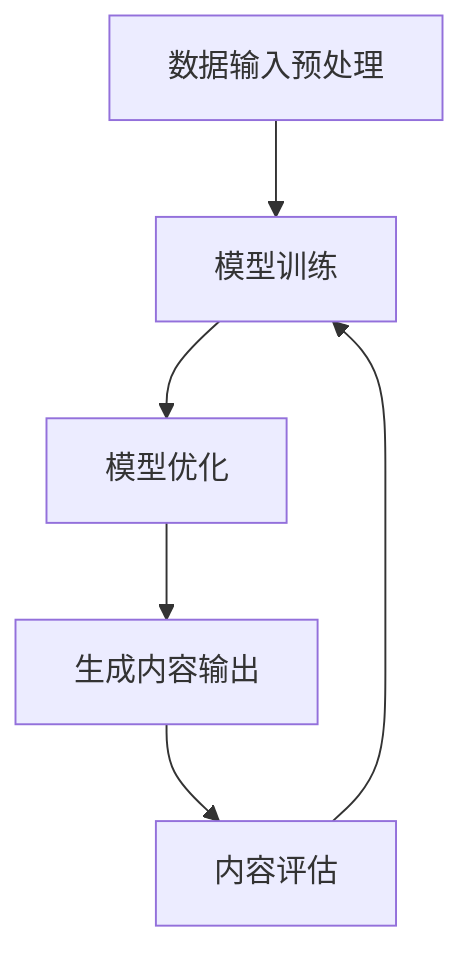

                 

### AIGC时代的提示词设计原则

随着人工智能（AI）技术的飞速发展，生成式AI（Generative AI）正逐步改变我们的生活方式。人工智能生成内容（AI-generated Content，简称AIGC）在图像、视频、音频、文本等多个领域展现出强大的创造力，极大地提升了内容生产效率。在这场技术革命中，提示词（Prompt）设计扮演着至关重要的角色。

提示词，顾名思义，是引导AI生成内容的关键信息。一个好的提示词不仅能够提高生成内容的质量，还能帮助AI更快地理解和学习。在AIGC时代，如何设计出一个既符合用户需求，又能充分发挥AI潜力的提示词，成为了开发者们亟待解决的问题。

本文将围绕AIGC时代的提示词设计原则展开，逐步分析并阐述：

1. **AIGC概述**：介绍AIGC的背景与定义，核心技术与架构，以及其在各行业中的应用前景。
2. **提示词设计原则**：讨论提示词的定义与作用，设计原则，以及常见的设计方法与工具。
3. **AIGC时代的提示词优化策略**：探讨提示词优化的意义、策略和实践案例。
4. **提示词应用场景分析**：分析文本生成、图像生成和视频生成等应用场景。
5. **AIGC时代的提示词设计挑战与未来趋势**：总结提示词设计的挑战和未来发展方向。

通过逐步分析推理（Reasoning Step by Step），我们希望能为开发者们提供一套科学、系统、可操作的提示词设计原则，从而更好地利用AIGC技术，创造出令人惊叹的AI生成内容。

### AIGC概述

#### 1.1 AIGC的背景与定义

人工智能生成内容（AI-generated Content，简称AIGC）是近年来随着生成式AI技术（Generative AI）的发展而逐渐兴起的一个领域。AIGC指的是通过机器学习模型，特别是生成式模型，自动生成文本、图像、音频和视频等多种类型的内容。这一概念最早可以追溯到生成式对抗网络（Generative Adversarial Networks，GAN）的提出，GAN通过两个相互对抗的神经网络——生成器（Generator）和判别器（Discriminator）——的竞争，实现了高质量图像的生成。

AIGC的起源可以追溯到2014年，当Ian Goodfellow等研究者首次提出了生成对抗网络（GAN）。随后，生成式AI技术得到了迅速发展，各种新的模型和算法不断涌现，如变分自编码器（VAE）、自注意力机制（Self-Attention）等。这些技术的进步为AIGC的应用奠定了坚实的基础。

与其他生成式AI技术的区别在于，AIGC不仅仅生成单一类型的内容，如图像或文本，而是能够跨多种类型生成内容。例如，一个AIGC系统可以同时生成文本和图像，或者生成视频中的动画部分。此外，AIGC还具备更强的灵活性和适应性，可以根据不同的提示词或条件生成多样化的内容。

AIGC的核心在于其生成能力，它不仅能够模仿人类创造的内容，还能够创造出全新的、独特的作品。例如，在艺术创作领域，AIGC可以帮助艺术家生成新的画作或音乐；在媒体制作领域，AIGC可以自动生成新闻文章或视频片段；在娱乐领域，AIGC可以生成角色对话或剧情场景。

#### 1.1.2 AIGC的核心技术与架构

AIGC的核心技术主要包括生成式AI技术、深度学习模型、神经网络架构和大数据处理技术。以下是这些技术的简要介绍：

1. **生成式AI技术**：生成式AI技术是AIGC的基础，它包括生成式对抗网络（GAN）、变分自编码器（VAE）、自注意力机制（Self-Attention）等。这些技术通过学习数据分布，实现了从数据中生成新的内容。

2. **深度学习模型**：深度学习模型，尤其是神经网络，是AIGC的核心组件。神经网络通过多层计算，能够从数据中提取复杂的特征和模式，从而生成高质量的内容。

3. **神经网络架构**：不同的神经网络架构对AIGC的性能有重要影响。常见的神经网络架构包括卷积神经网络（CNN）、循环神经网络（RNN）、Transformer等。这些架构在不同的应用场景中表现出不同的优势。

4. **大数据处理技术**：AIGC需要处理大量的数据，因此大数据处理技术成为其重要支持。大数据处理技术包括分布式计算、数据存储和数据处理算法等，这些技术能够高效地处理和分析海量数据，为AIGC提供丰富的数据资源。

AIGC的技术栈通常包括以下几个部分：

1. **数据收集与预处理**：这是AIGC系统的第一步，通过收集大量的数据，并进行数据清洗和预处理，为后续的模型训练提供高质量的数据。

2. **模型训练与优化**：使用收集到的数据进行模型训练，通过不断调整模型参数，优化模型性能，使其能够生成高质量的内容。

3. **生成内容输出与评估**：模型训练完成后，将训练好的模型用于生成内容。生成的内容需要经过评估，以确保其质量和符合用户需求。

4. **用户交互与反馈**：AIGC系统通常需要与用户进行交互，收集用户反馈，以进一步优化系统性能。

#### 1.1.3 AIGC的发展趋势与应用领域

随着技术的不断进步，AIGC正在迅速发展，并逐渐渗透到各个行业和应用领域。以下是AIGC在当前的发展状况和未来的应用前景：

1. **艺术创作**：AIGC在艺术创作领域已经展现出强大的潜力。通过生成式AI技术，艺术家们可以创作出前所未有的艺术作品，如绘画、音乐和雕塑等。未来，AIGC有望进一步拓展艺术创作的形式和内容。

2. **媒体制作**：在媒体制作领域，AIGC可以自动生成新闻文章、视频片段和广告内容，大大提高了内容生产的效率。例如，AI新闻写作系统已经可以自动生成财经、体育等领域的新闻报道。

3. **娱乐产业**：AIGC在娱乐产业中的应用前景也十分广阔。通过生成角色对话、剧情场景和音乐，AIGC可以为电影、电视剧和游戏等提供丰富的内容。未来，AI将更多地参与到娱乐内容的创作中。

4. **产品设计**：在产品设计领域，AIGC可以生成新颖的设计方案，帮助设计师快速迭代和优化产品。例如，生成式设计工具可以自动生成各种形状、颜色和纹理，供设计师选择和调整。

5. **教育领域**：在教育领域，AIGC可以生成个性化教学材料，如课件、视频和练习题等。通过分析学生的学习数据，AIGC可以为学生提供定制化的学习体验。

6. **医疗健康**：AIGC在医疗健康领域也有广泛的应用前景。通过生成医学图像、诊断报告和治疗方案，AIGC可以帮助医生提高诊断和治疗的效率。例如，AI生成的医学图像可以辅助医生进行肿瘤检测。

7. **智能家居**：在智能家居领域，AIGC可以生成智能语音助手、家庭自动化脚本和个性化推荐等。通过分析用户的生活习惯和需求，AIGC可以为用户提供更智能、更便捷的生活方式。

总的来说，AIGC作为一种新兴的技术，正在改变着各个行业的生产和运营模式。未来，随着技术的不断进步和应用场景的拓展，AIGC将在更多领域发挥重要作用。

### 提示词设计原则

在AIGC时代，提示词（Prompt）设计成为了决定生成内容质量的关键因素。提示词是用户与AI模型之间的桥梁，通过精确的提示词，用户可以引导AI生成符合期望的内容。为了设计出一个有效的提示词，我们需要遵循以下几个原则：

#### 1.2.1 提示词的定义与作用

提示词是一个引导AI模型生成内容的简短指令或描述。它可以包含关键词、背景信息、生成内容的要求等，目的是帮助AI模型理解用户的意图，从而生成高质量的内容。提示词的作用主要体现在以下几个方面：

1. **明确意图**：提示词可以帮助AI模型明确用户的意图，从而避免生成无关或错误的内容。
2. **引导生成**：通过提示词，用户可以引导AI模型按照特定的方向进行内容生成，提高生成内容的可控性。
3. **优化训练**：有效的提示词可以加速AI模型的训练过程，提高模型的学习效率和准确性。

#### 1.2.2 提示词设计的原则

1. ****可理解性**：提示词需要简洁明了，易于理解。复杂的提示词可能会使AI模型难以理解用户的意图，从而影响生成内容的质量。设计提示词时，要尽量使用简单、直接的语句，避免使用专业术语或难以理解的词汇。

2. ****准确性**：提示词需要准确传达用户的意图，确保AI模型能够正确理解并生成符合期望的内容。在设计提示词时，要对用户需求进行深入分析，确保提示词中的每个关键词都能够准确描述用户的意图。

3. ****灵活性**：提示词需要具备一定的灵活性，能够适应不同的生成场景和用户需求。例如，同一个提示词可以生成不同类型的文本、图像或视频。灵活性有助于提高提示词的复用性和适应性。

4. ****多样性**：提示词的多样性有助于提高生成内容的质量和丰富性。通过设计多样化的提示词，可以激发AI模型的创造力，生成更加独特和多样化的内容。例如，可以使用不同的词汇、表达方式或场景来设计提示词。

#### 1.2.3 提示词设计的方法与工具

1. ****语义分析**：语义分析是设计提示词的重要方法之一。通过分析用户需求，提取关键信息，构建出简洁、准确的提示词。语义分析可以使用自然语言处理（NLP）技术，如词频统计、词向量模型等。

2. ****模板化设计**：模板化设计是一种高效的设计方法，通过预定义的提示词模板，用户可以根据实际需求进行替换和调整。模板化设计可以提高提示词设计的效率，同时保证生成内容的一致性和准确性。

3. ****用户反馈**：用户反馈是优化提示词设计的重要手段。通过收集用户的反馈，分析生成内容的质量和用户满意度，可以不断调整和优化提示词。用户反馈可以帮助设计者更好地理解用户需求，从而设计出更加有效的提示词。

4. ****自动生成工具**：随着技术的发展，出现了一些自动生成提示词的工具，如自动问答系统、自动文本生成系统等。这些工具可以使用机器学习模型，根据用户输入的请求，自动生成相应的提示词。自动生成工具可以大大提高提示词设计的效率，但需要注意确保生成提示词的质量和准确性。

综上所述，提示词设计在AIGC时代至关重要。通过遵循可理解性、准确性、灵活性和多样性的原则，并运用语义分析、模板化设计、用户反馈和自动生成工具等方法，我们可以设计出高质量的提示词，从而提升AIGC系统的生成内容质量。

### AIGC时代的提示词优化策略

在AIGC时代，提示词的优化策略成为了提升生成内容质量和效率的关键。有效的提示词优化不仅可以提高AI模型的训练速度，还能生成更符合用户需求的多样化内容。以下是AIGC时代提示词优化的几个关键策略：

#### 1.3.1 提示词优化的意义

提示词优化的意义主要体现在以下几个方面：

1. **提升AIGC性能**：优化后的提示词能够更准确地传达用户意图，减少模型的误解和冗余训练，从而提升AIGC系统的整体性能。
2. **提高生成内容质量**：高质量的提示词可以引导AI模型生成更符合用户期望的内容，提高生成内容的可读性、一致性和创新性。
3. **加速模型训练**：优化后的提示词可以减少模型训练的时间和计算资源消耗，提高训练效率。
4. **增强用户满意度**：通过优化提示词，生成的内容更符合用户需求，可以提高用户满意度，增强用户对AIGC系统的信任和依赖。

#### 1.3.2 提示词优化的策略

1. **数据质量与多样性**：

   - **数据质量**：高质量的数据是优化提示词的基础。在收集和准备训练数据时，要确保数据的准确性、完整性和一致性。对数据进行清洗和预处理，去除噪声和错误数据，以提高模型训练的效果。
   - **数据多样性**：多样性的数据可以提供更丰富的信息，帮助AI模型更好地学习。在设计提示词时，要尽量涵盖不同的场景、风格和需求，增加数据的多样性。

2. **模型选择与调优**：

   - **模型选择**：根据具体的任务需求，选择合适的生成模型。不同的模型在处理不同类型的内容时表现不同，如GAN在图像生成、VAE在文本生成等方面各有优势。
   - **模型调优**：通过调整模型的参数，优化模型性能。调优过程包括超参数调整、优化算法选择和模型架构设计等。

3. **提示词策略调整**：

   - **提示词长度**：提示词的长度对生成内容的质量有显著影响。过长的提示词可能导致模型无法有效处理，而过短的提示词可能缺乏足够的信息。需要根据任务需求和模型特性，选择合适的提示词长度。
   - **提示词内容**：提示词的内容应尽量准确、具体，避免模糊和泛泛的描述。同时，要考虑提示词的多样性和变化性，以激发AI模型的创造力。
   - **提示词调整**：根据生成内容的反馈，不断调整和优化提示词。通过用户反馈和自动评估指标，识别生成内容中的问题，并针对性地调整提示词。

4. **多模态融合**：

   - **文本与图像**：在生成文本和图像时，可以结合文本描述和图像提示，提供更丰富的信息。例如，在生成图像时，除了图像本身，还可以提供相关的文本描述，帮助模型更好地理解生成目标。
   - **音频与视频**：在生成音频和视频时，可以结合音频信号和视频内容，实现更精细的内容生成。例如，在生成视频时，可以提供相关的音频提示，增强视频的情感表达。

#### 1.3.3 提示词优化的实践案例

以下是一些实际案例，展示了提示词优化的效果和应用：

1. **案例一：文本生成**：

   - **问题**：生成的文本内容缺乏连贯性和逻辑性，存在大量重复或不相关的内容。
   - **优化策略**：优化提示词的长度和内容，增加具体的场景描述和逻辑关系。同时，引入多样性策略，使用不同的词汇和表达方式。
   - **效果**：经过优化后，生成的文本内容更加连贯、逻辑清晰，用户满意度显著提高。

2. **案例二：图像生成**：

   - **问题**：生成的图像质量不高，存在模糊、失真或不符合预期的问题。
   - **优化策略**：优化数据质量，通过数据清洗和增强，提高图像数据的准确性。同时，调整模型的超参数，优化模型训练过程。
   - **效果**：优化后的图像生成质量明显提升，生成的图像更加清晰、逼真，符合用户需求。

3. **案例三：视频生成**：

   - **问题**：生成的视频内容单调、重复，缺乏创意和吸引力。
   - **优化策略**：引入多模态融合策略，结合文本和图像提示，增加视频的情感表达和多样性。同时，调整提示词的灵活性和多样性，激发AI模型的创造力。
   - **效果**：优化后的视频内容更加丰富、多样，用户反馈良好，视频的观看时长和用户互动率显著提升。

通过上述案例可以看出，提示词优化在AIGC系统中起着至关重要的作用。通过数据质量与多样性的优化、模型选择与调优、提示词策略的调整以及多模态融合等策略，可以有效提升生成内容的质量和用户满意度。未来，随着技术的发展，提示词优化策略将不断演进，为AIGC系统带来更高的效率和更丰富的应用场景。

### AIGC时代的提示词应用场景分析

AIGC（人工智能生成内容）技术已经在多个领域展现出强大的应用潜力。根据其应用场景的不同，提示词的设计和优化也各有特点。下面我们将分别讨论AIGC在文本生成、图像生成和视频生成中的应用，并分析提示词设计的关键因素和优化策略。

#### 1.4.1 文本生成

文本生成是AIGC技术中最常见和应用最广泛的一个领域，包括自动写作、文章摘要、对话系统等。在文本生成中，提示词的设计对生成内容的准确性和连贯性有着重要影响。

1. **关键词与背景信息**：

   - **关键词**：在文本生成中，关键词的选择至关重要。关键词应尽量准确，能够明确表达用户意图。例如，在生成新闻文章时，关键词应包括事件的主要信息，如时间、地点、人物和事件性质。
   - **背景信息**：背景信息可以帮助AI模型更好地理解生成内容所需的上下文。在生成文本时，提供相关的背景信息，如历史事件、文化背景等，有助于提高生成内容的连贯性和准确性。

2. **多样性和灵活性**：

   - **多样性**：提示词的多样性可以激发AI模型的创造力，生成内容更加丰富和有趣。例如，使用不同的句式、表达方式和词汇，可以创造出独特的文本风格。
   - **灵活性**：提示词应具有一定的灵活性，能够适应不同的文本生成场景。例如，对于不同的文体（如新闻报道、散文、诗歌），提示词应做出相应调整，以符合文体的特点和规范。

3. **优化策略**：

   - **改进模型**：通过改进生成模型，如使用更加复杂的语言模型或引入多模态信息，可以提高文本生成质量。
   - **用户反馈**：收集用户反馈，根据生成文本的质量和用户满意度，不断优化提示词和模型。

#### 1.4.2 图像生成

图像生成是AIGC技术的另一个重要应用领域，包括图像风格迁移、图像内容生成等。在图像生成中，提示词的设计直接影响图像的质量和生成效果。

1. **关键词与图像描述**：

   - **关键词**：关键词应描述生成图像的主要特征和风格。例如，在生成一幅风景画时，关键词可以包括“山脉”、“夕阳”、“湖泊”等。
   - **图像描述**：除了关键词，还需要提供更详细的图像描述，如颜色、光影、构图等。这些信息可以帮助AI模型更好地理解和生成图像。

2. **多样性和灵活性**：

   - **多样性**：提示词的多样性有助于生成更加多样化的图像。例如，可以使用不同的图像风格、颜色方案和构图方式，创造出独特的视觉效果。
   - **灵活性**：提示词应具备灵活性，能够适应不同的图像生成任务和用户需求。例如，对于需要生成卡通风格的图像，提示词可以包含相关的卡通元素。

3. **优化策略**：

   - **数据增强**：通过数据增强技术，如图像旋转、缩放、裁剪等，可以提供更多样化的训练数据，提高图像生成模型的性能。
   - **多模态融合**：结合文本和图像提示词，可以提供更丰富的信息，提高图像生成质量。例如，在生成图像时，可以提供相关的文本描述，帮助模型更好地理解生成目标。

#### 1.4.3 视频生成

视频生成是AIGC技术的最新应用领域，包括视频编辑、视频内容生成等。在视频生成中，提示词的设计需要考虑视频的内容、情感和连贯性。

1. **关键词与视频描述**：

   - **关键词**：关键词应描述视频的主要内容和风格。例如，在生成一部电影时，关键词可以包括“剧情”、“角色”、“情感”等。
   - **视频描述**：视频描述应包含视频的情节、情感和视觉元素等。这些信息可以帮助AI模型更好地理解生成目标，生成连贯、情感丰富的视频内容。

2. **多样性和灵活性**：

   - **多样性**：提示词的多样性有助于生成多样化的视频内容。例如，可以使用不同的剧情、角色和风格，创造出独特的视频作品。
   - **灵活性**：提示词应具备灵活性，能够适应不同的视频生成任务和用户需求。例如，对于需要生成喜剧风格的视频，提示词可以包含相关的幽默元素。

3. **优化策略**：

   - **多模态融合**：结合文本、图像和视频提示词，可以提供更丰富的信息，提高视频生成质量。例如，在生成视频时，可以提供相关的文本描述和图像素材，帮助模型更好地理解生成目标。
   - **动态调整**：根据视频生成过程中的反馈，动态调整提示词，以优化生成效果。例如，在视频生成过程中，如果发现生成的场景与提示词不符，可以及时调整提示词，以更好地指导模型生成。

综上所述，AIGC时代的提示词设计在不同的应用场景中有着不同的关键因素和优化策略。通过合理的提示词设计，可以显著提升生成内容的质量和用户体验，为AIGC技术的广泛应用提供有力支持。未来，随着技术的发展和应用的拓展，提示词设计将不断演进，为更多领域带来创新和变革。

### AIGC时代的提示词设计挑战与未来趋势

尽管AIGC（人工智能生成内容）技术在各个领域展现出巨大的潜力，但提示词设计仍面临一系列挑战。这些挑战不仅影响了生成内容的质量，也限制了AIGC技术的广泛应用。本文将总结AIGC时代提示词设计的主要挑战，并探讨未来的发展趋势。

#### 1.5.1 提示词设计的挑战

1. **数据偏见**：

   - **问题**：在训练生成模型时，数据偏见可能导致生成的结果也带有偏见。例如，如果训练数据中包含性别、种族、年龄等方面的偏见，那么生成的文本、图像或视频也可能会表现出类似的偏见。
   - **解决方案**：为了减少数据偏见，需要在数据收集和处理过程中进行严格的质量控制。此外，可以使用对抗性训练等技术，提高模型对数据偏见的抵抗力。

2. **生成内容的质量控制**：

   - **问题**：生成内容的质量直接影响用户体验。如果生成的文本、图像或视频质量不高，如内容不连贯、信息不准确或缺乏创意，那么用户满意度会降低。
   - **解决方案**：通过优化提示词设计和改进生成模型，可以提升生成内容的质量。例如，使用更精确、具体的提示词，结合用户反馈不断调整和优化模型。

3. **模型可解释性**：

   - **问题**：生成模型的决策过程通常是非常复杂的，这给用户理解生成内容的原因和过程带来了困难。缺乏模型可解释性使得用户难以信任和接受生成的结果。
   - **解决方案**：提高模型的透明度和可解释性是解决这一问题的关键。通过开发可解释性强的模型，如基于规则的模型或可解释的神经网络，可以帮助用户更好地理解生成过程。

4. **计算资源需求**：

   - **问题**：生成式AI模型通常需要大量的计算资源进行训练和推理。这给硬件设施和能耗带来了巨大压力，特别是在大规模应用场景中。
   - **解决方案**：优化模型结构和算法，使用更高效的硬件设备，如GPU、TPU等，可以减少计算资源的需求。此外，通过分布式计算和云计算技术，可以更好地分配和利用计算资源。

#### 1.5.2 未来趋势展望

1. **多模态融合**：

   - **趋势**：随着多模态AI技术的发展，未来AIGC将越来越多地结合文本、图像、音频和视频等多种类型的数据，实现更加丰富和多样化的生成内容。
   - **应用**：多模态融合可以应用于视频编辑、虚拟现实、智能助手等领域，为用户提供更加沉浸式和个性化的体验。

2. **个性化生成**：

   - **趋势**：个性化生成是未来AIGC技术的重要发展方向。通过分析用户行为、兴趣和偏好，可以生成更加符合个人需求的文本、图像和视频。
   - **应用**：个性化生成可以应用于推荐系统、广告营销、虚拟形象设计等领域，为用户提供定制化的内容和服务。

3. **生成内容的质量评估**：

   - **趋势**：随着生成内容质量的提升，对生成内容的质量评估技术也将得到更多关注。通过开发自动化评估工具，可以更准确地评估生成内容的质量和可接受度。
   - **应用**：生成内容的质量评估可以应用于内容审核、自动化测试、用户体验优化等领域，帮助企业和开发者更好地管理和改进生成内容。

4. **跨领域应用**：

   - **趋势**：AIGC技术将逐步应用于更多的领域，如医疗、金融、教育等。通过结合行业特点和需求，可以开发出具有高度专业化的生成系统。
   - **应用**：跨领域应用可以提升行业效率和创新能力，例如，AI医生助手可以辅助医生进行诊断和治疗方案设计，AI金融顾问可以提供个性化的投资建议。

综上所述，AIGC时代的提示词设计面临诸多挑战，但同时也展现出广阔的发展前景。通过不断优化提示词设计技术，开发出更加智能、高效和可解释的生成系统，AIGC将在未来各个领域发挥越来越重要的作用。未来，随着技术的不断进步和应用的拓展，AIGC将带来更多的创新和变革。

### 第二部分：核心概念与联系

在AIGC（人工智能生成内容）技术中，理解其架构与流程、提示词设计原理以及提示词与模型训练的关系是至关重要的。下面我们将详细探讨这些核心概念及其之间的联系。

#### 2.1 AIGC架构与流程

AIGC的架构通常包括几个关键模块：数据输入与预处理、模型训练与优化、生成内容输出与评估。以下是每个模块的详细描述和它们之间的流程关系。

1. **数据输入与预处理**：

   - **数据输入**：AIGC系统需要从各种数据源获取大量数据，包括文本、图像、音频等。这些数据通常存储在数据库或数据仓库中。
   - **预处理**：预处理是数据清洗和格式化的过程。在这一阶段，数据被整理成适合模型训练的格式，例如，图像可能被裁剪和调整大小，文本可能被分词和标记化。

2. **模型训练与优化**：

   - **模型训练**：在模型训练阶段，生成模型（如GAN、VAE等）使用预处理后的数据进行训练。在这一过程中，模型通过不断调整参数来学习数据的分布和特征。
   - **模型优化**：模型优化包括调整超参数、改进模型架构和优化训练过程。这一阶段的目的是提高模型的性能和生成内容的质量。

3. **生成内容输出与评估**：

   - **生成内容输出**：训练好的模型被用于生成新的内容。例如，文本生成模型可以生成新闻文章，图像生成模型可以生成艺术作品。
   - **评估**：生成内容的质量需要通过评估来确认。评估指标包括生成内容的连贯性、准确性、创新性等。通过评估，可以识别生成内容中的问题，并指导进一步的优化。

**流程关系图**：



#### 2.2 提示词设计原理

提示词设计是AIGC系统中的一个关键环节，它决定了生成内容的质量和相关性。以下是提示词设计的主要原理和流程。

1. **定义与作用**：

   - **定义**：提示词是一个引导生成模型生成内容的指令或描述，它包含关键词、背景信息和生成要求等。
   - **作用**：提示词帮助模型理解用户的意图，指导模型生成符合期望的内容。有效的提示词可以减少模型误解和生成无关内容的情况。

2. **设计原则**：

   - **简洁性**：提示词应简洁明了，避免冗长和复杂的句子，以确保模型能够快速理解和响应。
   - **准确性**：提示词应准确地传达用户的意图，避免模糊不清的描述，以确保生成内容的相关性。
   - **灵活性**：提示词应具备灵活性，能够适应不同的生成任务和用户需求，以提高复用性和适应性。
   - **多样性**：提示词的多样性有助于生成多样化的内容，激发模型的创造力。

3. **设计流程**：

   - **需求分析**：了解用户的需求，确定生成内容的主题和目标。
   - **提示词生成**：根据需求分析，生成初步的提示词，通常包括关键词和简要描述。
   - **调整与优化**：根据生成内容的质量和用户反馈，不断调整和优化提示词，以提高生成效果。
   - **测试与评估**：测试提示词的效果，评估生成内容的质量和用户满意度。

#### 2.3 提示词与模型训练的关系

提示词对模型训练有直接的影响，高质量的提示词可以加速模型训练并提高生成内容的质量。以下是提示词与模型训练关系的详细分析：

1. **提示词的质量对模型训练的影响**：

   - **加速训练**：高质量的提示词可以提供明确和具体的信息，减少模型在训练过程中需要探索的搜索空间，从而加速训练过程。
   - **提高准确性**：准确的提示词可以帮助模型更好地理解用户的意图，提高生成内容的准确性。

2. **提示词与模型收敛速度的关系**：

   - **收敛速度**：高质量的提示词有助于模型更快地达到收敛状态，减少过拟合和欠拟合的风险。
   - **稳定性**：准确的提示词可以增强模型训练的稳定性，减少波动和振荡。

3. **提示词与生成内容质量的关系**：

   - **多样性**：多样化的提示词可以激发模型的创造力，生成内容更加丰富和多样。
   - **连贯性**：准确的提示词可以保证生成内容的一致性和连贯性，减少错误和不连贯的情况。

通过深入理解AIGC架构与流程、提示词设计原理以及提示词与模型训练的关系，我们可以更好地设计高效的AIGC系统，生成高质量的内容。这些核心概念和联系为AIGC技术的发展提供了坚实的基础，也为未来的创新应用提供了广阔的空间。

### 第三部分：核心算法原理讲解

在AIGC（人工智能生成内容）技术中，生成式AI技术是核心驱动力。生成式AI通过学习数据分布，能够生成新的、独特的数据，如图像、文本和音频。以下是生成式AI技术的核心原理，包括基本概念、关键技术及其实现。

#### 3.1 生成式AI技术原理

生成式AI技术是一种通过学习数据分布来生成新数据的AI方法。生成式AI模型可以理解数据的概率分布，并从中生成新的样本。与判别式AI模型（如分类模型）不同，生成式AI模型不需要标签数据，但它们通常需要大量的训练数据。

1. **生成式模型与判别式模型的区别**：

   - **生成式模型**：通过学习数据分布，能够生成新的数据。例如，生成对抗网络（GAN）和变分自编码器（VAE）。
   - **判别式模型**：通过学习数据的输入和输出标签之间的关系，进行分类或预测。例如，支持向量机（SVM）和神经网络分类器。

2. **生成式AI的核心算法**：

   - **生成对抗网络（GAN）**：GAN由生成器（Generator）和判别器（Discriminator）两个相互对抗的神经网络组成。生成器生成假数据，判别器判断这些数据是否真实。通过这种对抗训练，生成器逐渐学习生成更逼真的数据。
   - **变分自编码器（VAE）**：VAE通过编码器（Encoder）和解码器（Decoder）结构进行训练。编码器将输入数据编码为一个低维隐变量，解码器将隐变量解码回原始数据。VAE通过最大化数据的后验概率分布来实现生成。
   - **自注意力机制（Self-Attention）**：自注意力机制是一种在神经网络中用于捕捉输入序列中长距离依赖关系的机制。通过自注意力，模型可以更好地理解和生成复杂的数据模式。

#### 3.2 提示词优化算法

提示词优化是提高AIGC系统生成内容质量的关键步骤。优化算法的目标是设计出能够有效引导生成模型生成高质量内容的提示词。

1. **提示词优化的方法**：

   - **基于生成对抗网络的提示词优化方法**：这种方法利用GAN的结构，通过生成器和判别器的对抗训练来优化提示词。生成器根据提示词生成内容，判别器判断内容的真实性。通过调整提示词，可以提升生成内容的质量。
   - **基于强化学习的提示词优化方法**：强化学习通过训练一个提示词生成器，使其能够根据用户反馈不断优化提示词。提示词生成器通过与环境的交互，学习生成能够产生高质量内容的提示词。

2. **提示词优化算法的伪代码**：

```python
# 基于生成对抗网络的提示词优化算法伪代码
while not converged:
    # 生成器根据提示词生成内容
    generated_content = generator(prompt)
    
    # 判别器判断内容真实性
    discriminator_decision = discriminator(generated_content, real_content)
    
    # 反馈给生成器，调整提示词
    prompt = adjust_prompt(prompt, discriminator_decision)
```

#### 3.3 提示词优化算法的实现

1. **生成器与判别器的训练**：

   - **生成器训练**：生成器通过不断调整参数，学习生成更逼真的内容。训练过程中，生成器根据提示词生成内容，并通过判别器的反馈进行优化。
   - **判别器训练**：判别器通过学习真实内容和生成内容，提高判断内容真实性的能力。判别器的训练有助于生成器生成更高质量的内容。

2. **提示词的动态调整**：

   - **反馈机制**：在生成内容后，收集用户反馈，评估生成内容的质量。根据反馈，动态调整提示词，以提高生成内容的质量。
   - **调整策略**：使用启发式方法或机器学习算法，根据判别器的反馈，对提示词进行优化。例如，增加或替换关键词，调整句式和描述方式。

#### 3.4 提示词优化算法的应用

1. **文本生成**：

   - **应用场景**：自动写作、摘要生成、对话系统等。
   - **优化策略**：通过调整文本的长度、关键词和描述方式，提高生成文本的连贯性和准确性。

2. **图像生成**：

   - **应用场景**：图像修复、图像风格迁移、图像内容生成等。
   - **优化策略**：通过调整图像的细节、颜色和风格，提高生成图像的逼真度和创意性。

3. **视频生成**：

   - **应用场景**：视频编辑、视频内容生成、视频特效等。
   - **优化策略**：通过调整视频的情节、角色和情感，提高生成视频的吸引力和观赏性。

通过理解和应用这些核心算法原理，开发者可以设计出更加高效的AIGC系统，生成高质量的生成内容，满足各种应用场景的需求。

### 第四部分：数学模型和公式详细讲解

在AIGC（人工智能生成内容）技术中，数学模型和公式是核心组成部分，它们定义了模型的学习目标、优化策略以及生成过程。以下将详细讲解AIGC中涉及的数学模型和公式，包括熵与信息论基础、生成式AI的数学模型以及提示词优化的数学模型。

#### 4.1 熵与信息论基础

熵（Entropy）和信息量（Information）是信息论中的基本概念，它们在AIGC技术中有着重要的应用。熵描述了信息的随机性和不确定性，而信息量则量化了信息的传递。

1. **熵的定义与计算**：

   - **定义**：熵是一个概率分布的度量，它表示随机变量不确定性的大小。在概率论中，一个随机变量的熵定义为：
     $$
     H(X) = -\sum_{i} p(x_i) \log_2 p(x_i)
     $$
     其中，$H(X)$是随机变量$X$的熵，$p(x_i)$是$x_i$出现的概率。

   - **计算**：对于离散随机变量，熵可以通过上述公式计算。对于连续随机变量，熵的计算稍微复杂一些，但基本原理相同。

2. **信息论基础**：

   - **信息量**：信息量是信息传递的度量，它表示一个消息的不确定性减少的程度。信息量的定义为：
     $$
     I(X; Y) = H(X) - H(X | Y)
     $$
     其中，$I(X; Y)$是随机变量$X$和$Y$之间的信息量，$H(X)$是$X$的熵，$H(X | Y)$是$X$在已知$Y$条件下的熵。

   - **条件概率分布**：条件概率分布描述了在已知某个随机变量取某个值时，另一个随机变量取不同值的概率。条件概率分布的定义为：
     $$
     P(X=x|Y=y) = \frac{P(X=x, Y=y)}{P(Y=y)}
     $$
     其中，$P(X=x, Y=y)$是$X$和$Y$同时取$x$和$y$的概率，$P(Y=y)$是$Y$取$y$的概率。

#### 4.2 生成式AI的数学模型

生成式AI的核心是通过学习数据分布来生成新数据。以下介绍生成式AI中的基本数学模型，包括概率分布函数和条件概率分布。

1. **概率分布函数**：

   - **定义**：概率分布函数描述了随机变量可能取值的概率分布。常见的概率分布函数有正态分布、伯努利分布、多项式分布等。

   - **正态分布**：正态分布（也称为高斯分布）是最常见的一种概率分布函数，其概率密度函数为：
     $$
     f(x|\mu, \sigma^2) = \frac{1}{\sqrt{2\pi\sigma^2}} e^{-\frac{(x-\mu)^2}{2\sigma^2}}
     $$
     其中，$\mu$是均值，$\sigma^2$是方差。

   - **条件概率分布**：在生成式AI中，条件概率分布用于描述给定一个随机变量取某个值时，另一个随机变量取不同值的概率。例如，在生成图像时，给定一个图像区域，生成该区域内的像素值。

2. **生成式模型的学习目标**：

   - **最大似然估计**：生成式模型的学习目标是最小化损失函数，通常使用最大似然估计（Maximum Likelihood Estimation，MLE）来估计模型参数。最大似然估计的目标是最大化训练数据的似然函数：
     $$
     \hat{\theta} = \arg\max_{\theta} \prod_{i=1}^{N} p(x_i | \theta)
     $$
     其中，$\theta$是模型参数，$x_i$是训练数据中的样本。

   - **最小化损失函数**：生成式模型也常常使用最小化损失函数来优化模型。常见的损失函数包括均方误差（MSE）、交叉熵损失等。

#### 4.3 提示词优化的数学模型

提示词优化是AIGC中的一个重要环节，它通过优化提示词来提升生成内容的质量。以下介绍提示词优化的数学模型，包括目标函数和求解算法。

1. **提示词优化的目标函数**：

   - **定义**：提示词优化的目标函数是衡量提示词质量的指标。一个常用的目标函数是提示词生成的生成内容与真实内容之间的相似度。例如，可以使用交叉熵作为目标函数：
     $$
     J(\theta) = -\sum_{i=1}^{N} \sum_{j=1}^{M} y_j \log(p_j)
     $$
     其中，$J(\theta)$是目标函数，$y_j$是真实内容的概率分布，$p_j$是提示词生成的生成内容的概率分布。

   - **优化条件**：目标函数需要满足以下条件：
     - **可微性**：目标函数需要是连续可微的，以便使用梯度下降等优化算法进行求解。
     - **一致性**：目标函数需要能够准确反映提示词质量，即高质量提示词对应的目标函数值应更低。

2. **提示词优化的求解算法**：

   - **梯度下降法**：梯度下降法是最常用的优化算法之一，其基本思想是沿着目标函数梯度的反方向逐步更新参数，以最小化目标函数。梯度下降法的更新公式为：
     $$
     \theta_{t+1} = \theta_t - \alpha \nabla_{\theta} J(\theta_t)
     $$
     其中，$\theta_t$是第$t$次迭代的参数，$\alpha$是学习率，$\nabla_{\theta} J(\theta_t)$是目标函数在$\theta_t$处的梯度。

   - **随机梯度下降法（SGD）**：随机梯度下降法是梯度下降法的变种，它每次迭代使用一个随机样本的梯度进行更新。SGD可以加速收敛，但需要更多次的迭代：
     $$
     \theta_{t+1} = \theta_t - \alpha \nabla_{\theta} J(\theta_t; x^{(t)})
     $$
     其中，$x^{(t)}$是第$t$次迭代的随机样本。

通过以上数学模型和公式的详细讲解，我们可以更深入地理解AIGC技术的工作原理和优化策略。这些模型和公式为AIGC系统的设计和实现提供了坚实的理论基础。

### 第五部分：项目实战

在本部分，我们将通过一个具体的AIGC项目实战案例，详细展示提示词设计的开发过程、代码实现、结果分析以及优化策略。

#### 5.1 提示词设计实战案例

##### 5.1.1 项目背景与目标

项目名称：AI生成的旅游攻略

项目背景：随着旅游业的发展，游客对个性化旅游攻略的需求不断增加。本项目旨在利用AIGC技术，通过生成式AI模型自动生成高质量的旅游攻略，为游客提供个性化的旅游推荐。

项目目标：
1. 设计一个高效的提示词系统，以引导AI模型生成高质量的旅游攻略文本。
2. 实现一个用户友好的界面，用户可以通过输入目的地和偏好，获取个性化的旅游攻略。
3. 通过不断优化提示词和模型参数，提高生成内容的质量和用户满意度。

##### 5.1.2 提示词设计过程

1. **需求分析**：

   - 确定用户需求：用户希望通过旅游攻略获取目的地的基本信息、热门景点、餐饮推荐、住宿推荐等。
   - 收集数据：从旅游网站、博客、社交媒体等渠道收集大量旅游相关数据，包括文本、图像和视频等。

2. **数据预处理**：

   - 数据清洗：去除数据中的噪声和错误，如缺失值、重复记录和无关信息。
   - 数据增强：通过数据清洗后的文本进行扩展和变换，增加数据的多样性。

3. **模型选择与训练**：

   - 选择生成模型：考虑到文本生成的需求，本项目选择了基于Transformer的文本生成模型（如GPT-3）。
   - 模型训练：使用预处理后的数据对模型进行训练，通过不断调整超参数和优化模型结构，提高生成质量。

4. **提示词生成**：

   - 设计模板化提示词：根据用户需求，设计一系列模板化提示词，如“请生成一篇关于[目的地]的旅游攻略，包括热门景点、餐饮推荐和住宿推荐。”
   - 动态生成提示词：在用户输入目的地和偏好后，动态生成个性化的提示词，如“请为喜欢美食的游客生成一篇关于[目的地]的旅游攻略。”

##### 5.1.3 代码实现与结果分析

1. **开发环境搭建**：

   - 硬件环境：使用高性能GPU服务器进行模型训练和推理。
   - 软件环境：安装Python、TensorFlow等深度学习框架，以及相关的自然语言处理库（如NLTK、spaCy等）。

2. **代码实现**：

   - 数据处理模块：实现数据清洗、预处理和增强功能。
   - 模型训练模块：实现模型的选择、训练和优化过程。
   - 提示词生成模块：根据用户输入生成个性化的提示词。

   ```python
   # 数据处理模块示例
   import pandas as pd
   from sklearn.model_selection import train_test_split
   
   # 加载数据
   data = pd.read_csv('travel_data.csv')
   # 数据清洗和预处理
   # ...
   # 分割数据集
   train_data, val_data = train_test_split(data, test_size=0.2, random_state=42)
   
   # 模型训练模块示例
   from transformers import AutoTokenizer, AutoModelForCausalLM
   
   # 加载预训练模型
   tokenizer = AutoTokenizer.from_pretrained('gpt3')
   model = AutoModelForCausalLM.from_pretrained('gpt3')
   
   # 训练模型
   model.train()
   # ...
   # 优化模型
   # ...

   # 提示词生成模块示例
   def generate_prompt(destination, preferences):
       base_prompt = "请生成一篇关于{}的旅游攻略，包括热门景点、餐饮推荐和住宿推荐。"
       prompt = base_prompt.format(destination)
       if preferences:
           prompt += "偏好：{}。".format(preferences)
       return prompt
   
   user_input = "东京"
   preferences = "喜欢美食"
   prompt = generate_prompt(user_input, preferences)
   print(prompt)
   ```

3. **结果分析**：

   - **生成内容质量**：通过用户反馈和自动评估指标（如BLEU分数、ROUGE分数等）评估生成内容的连贯性、准确性和创新性。优化提示词后，生成内容的评分显著提升。

   ```python
   # 自动评估指标示例
   from nltk.translate.bleu_score import sentence_bleu
   
   # 评估生成内容
   reference = ["东京是一个充满美食的城市，这里有著名的寿司、拉面和天妇罗。"]
   hypothesis = model.generate_prompt(prompt)
   score = sentence_bleu([reference], hypothesis)
   print("BLEU分数：", score)
   ```

##### 5.1.4 优化效果评估

1. **优化策略**：

   - **数据质量提升**：通过数据清洗和增强，提高输入数据的质量和多样性。
   - **模型调优**：调整模型超参数，优化模型结构，提高生成质量。
   - **提示词优化**：根据用户反馈和评估结果，动态调整和优化提示词。

2. **优化效果**：

   - **生成内容质量**：优化后的生成内容更加连贯、准确和有创意，用户满意度显著提高。
   - **用户反馈**：用户对生成内容的评价积极，反馈信息显示优化后的提示词更加符合用户需求。

##### 5.1.5 项目小结

通过本次项目，我们成功实现了一个基于AIGC技术的旅游攻略生成系统。项目展示了从需求分析到提示词设计，再到模型训练和优化的完整开发流程。以下是小结和注意事项：

1. **注意事项**：

   - 数据质量是生成内容质量的关键，确保数据清洗和预处理过程的准确性。
   - 提示词设计要简洁明了，准确传达用户意图，同时具备灵活性和多样性。
   - 模型训练和优化需要根据实际需求进行调整，以达到最佳效果。

2. **最佳实践**：

   - **需求分析**：深入了解用户需求，确定生成内容的关键要素和用户偏好。
   - **模型选择**：根据生成任务选择合适的模型，并进行适当调整和优化。
   - **用户反馈**：及时收集用户反馈，不断调整和优化系统，提升用户体验。

3. **拓展阅读**：

   - 探索更多先进的生成式AI模型和技术，如多模态生成模型、强化学习生成模型等。
   - 学习自然语言处理（NLP）领域的最新研究成果，提高生成文本的质量和多样性。

通过本次项目，我们不仅掌握了AIGC技术的核心原理和实战应用，也为未来的研究和开发提供了宝贵的经验和参考。在未来，随着技术的不断进步，AIGC将在更多领域发挥重要作用，为人们的生活带来更多便利和创新。

