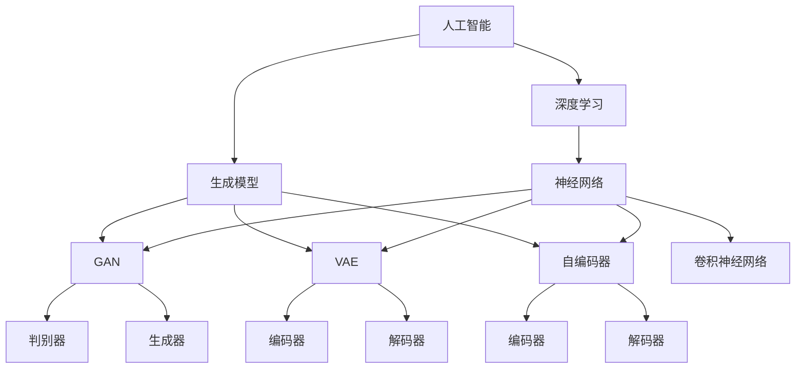

                 

# AIGC的未来：趋势与预测

## 关键词
- AIGC
- 人工智能
- 生成模型
- 趋势分析
- 未来预测

## 摘要
本文深入探讨了人工智能生成内容（AIGC）的未来趋势与预测。首先，我们回顾了AIGC的发展背景，定义了核心概念，并通过Mermaid流程图展示了其与人工智能、生成模型等概念的联系。接着，我们分析了AIGC在技术进展、行业应用和市场前景方面的最新动态，并探讨了其面临的挑战。随后，我们预测了AIGC未来可能的发展方向，以及其对社会的潜在影响。最后，通过项目实战案例，我们展示了AIGC在实际应用中的实现过程和效果。本文旨在为读者提供关于AIGC的全面了解和前瞻性见解。

## 引言

人工智能（AI）作为21世纪最具变革性的技术之一，已经在各个领域取得了显著的进展。然而，随着生成模型技术的不断发展，人工智能生成内容（AIGC，AI-Generated Content）作为一种全新的内容生产方式，正逐渐成为行业关注的热点。AIGC利用人工智能技术，特别是深度学习和生成模型，自动生成文字、图像、视频等多种形式的内容。这不仅提高了内容生产的效率，也为创意产业、媒体、娱乐等领域带来了前所未有的变革。

本文旨在通过逐步分析推理，深入探讨AIGC的未来趋势与预测。我们将从AIGC的基本概念入手，详细解释其与人工智能、生成模型等核心概念之间的联系。随后，分析AIGC在技术进展、行业应用和市场前景方面的最新动态。在此基础上，预测AIGC未来的发展趋势和潜在应用领域，并探讨其对社会的影响。最后，通过项目实战案例，展示AIGC在实际应用中的实现过程和效果。希望通过本文，能够为读者提供关于AIGC的全面了解和前瞻性见解。

### AIGC的基础概念与核心概念

AIGC，即人工智能生成内容（AI-Generated Content），是指利用人工智能技术，特别是深度学习和生成模型，自动生成文字、图像、视频等多种形式的内容。其核心在于“生成”，通过机器学习算法，模型能够从大量的数据中学习并生成新的内容。

要理解AIGC，首先需要了解与之相关的几个核心概念，包括人工智能（AI）、生成模型、深度学习和神经网络等。

#### 人工智能（AI）

人工智能是指通过计算机模拟人类智能的技术和科学。其目标是让计算机具备类似于人类的感知、学习、推理和决策能力。人工智能可以分为两大类：弱人工智能和强人工智能。弱人工智能（Narrow AI）专注于特定任务，如语音识别、图像识别等；强人工智能（General AI）则具有广泛的理解和推理能力，能够在多种任务中表现。

#### 生成模型

生成模型是一类用于生成数据或内容的机器学习模型。其基本思想是从数据分布中采样，生成新的数据或内容。常见的生成模型包括生成对抗网络（GAN）、变分自编码器（VAE）和自编码器（Autoencoder）等。

- **生成对抗网络（GAN）**：GAN由生成器（Generator）和判别器（Discriminator）两部分组成。生成器的目标是生成类似真实数据的内容，而判别器的目标是区分生成数据和真实数据。两者相互竞争，最终生成器生成的数据越来越接近真实数据。

  **伪代码：GAN模型算法原理**
  ```python
  # 生成器
  def generator(z):
      # 从随机噪声z中生成数据x
      x = ...
      return x

  # 判别器
  def discriminator(x):
      # 判断x是真实数据还是生成数据
      prob = ...
      return prob

  # 训练过程
  for epoch in range(num_epochs):
      for x, _ in data_loader:
          # 训练判别器
          z = sample_random_noise()
          x_fake = generator(z)
          d_real = discriminator(x)
          d_fake = discriminator(x_fake)

      # 训练生成器
      z = sample_random_noise()
      x_fake = generator(z)
      g_loss = -torch.mean(torch.log(d_fake))
  ```

- **变分自编码器（VAE）**：VAE是一种基于概率模型的生成模型。其核心思想是将输入数据编码为均值和方差，然后通过解码器生成数据。

  **伪代码：VAE模型算法原理**
  ```python
  # 编码器
  def encoder(x):
      mu, log_var = ...
      return mu, log_var

  # 解码器
  def decoder(z):
      x = ...
      return x

  # 训练过程
  for epoch in range(num_epochs):
      for x in data_loader:
          z = encode(x)
          x_recon = decode(z)

      # 计算损失
      recon_loss = ...
      kl_loss = ...
      loss = recon_loss + kl_loss
  ```

- **自编码器（Autoencoder）**：自编码器是一种无监督学习算法，其目的是将输入数据压缩为低维表示，然后重构原始数据。

  **伪代码：自编码器模型算法原理**
  ```python
  # 编码器
  def encoder(x):
      z = ...

  # 解码器
  def decoder(z):
      x = ...

  # 训练过程
  for epoch in range(num_epochs):
      for x in data_loader:
          z = encode(x)
          x_recon = decode(z)

      # 计算损失
      recon_loss = ...
      loss = recon_loss
  ```

#### 深度学习与神经网络

深度学习是机器学习的一个分支，其核心是神经网络。神经网络通过多层非线性变换，自动提取输入数据的特征，实现复杂函数的近似。深度学习在图像识别、语音识别、自然语言处理等领域取得了显著的成果。

- **卷积神经网络（CNN）**：卷积神经网络是一种用于处理图像数据的神经网络，通过卷积层、池化层和全连接层等结构，自动提取图像的局部特征。

  **伪代码：CNN模型算法原理**
  ```python
  # 卷积层
  def conv2d(x, weights):
      return ...

  # 池化层
  def max_pooling(x):
      return ...

  # 全连接层
  def fully_connected(x, weights):
      return ...

  # 训练过程
  for epoch in range(num_epochs):
      for x, y in data_loader:
          # 前向传播
          h1 = conv2d(x, weights_conv)
          h2 = max_pooling(h1)
          z = fully_connected(h2, weights_fc)

          # 反向传播
          loss = ...
          ...
  ```

#### Mermaid流程图

为了更直观地展示AIGC与核心概念之间的联系，我们可以使用Mermaid流程图来描述。



通过上述核心概念与联系的分析，我们可以看到AIGC是如何在人工智能、生成模型、深度学习和神经网络的基础上发展起来的。这些核心概念为AIGC提供了强大的技术支持，使其在内容生成领域取得了显著的成果。

### AIGC技术进展

近年来，AIGC技术在生成模型、跨模态生成模型等方面取得了显著的进展，这些技术进步不仅推动了AIGC的发展，也为其在各个行业的应用提供了更多可能性。

#### 生成模型的发展

生成模型是AIGC的核心技术之一，其发展经历了多个阶段。最早期的生成模型包括自编码器（Autoencoder）和变分自编码器（VAE），这些模型能够在无监督环境下学习数据的分布，并生成新的数据。

- **变分自编码器（VAE）**：VAE通过引入概率模型，提高了生成模型的灵活性和鲁棒性。VAE的核心思想是将输入数据编码为均值和方差，然后通过解码器生成数据。这种模型在图像生成、文本生成等领域表现优异。

  **伪代码：VAE模型算法原理**
  ```python
  # 编码器
  def encoder(x):
      mu, log_var = ...
      return mu, log_var

  # 解码器
  def decoder(z):
      x = ...
      return x

  # 训练过程
  for epoch in range(num_epochs):
      for x in data_loader:
          z = encode(x)
          x_recon = decode(z)

      # 计算损失
      recon_loss = ...
      kl_loss = ...
      loss = recon_loss + kl_loss
  ```

- **生成对抗网络（GAN）**：GAN通过生成器和判别器的对抗训练，实现了更高质量的图像生成。生成器的目标是生成尽可能逼真的数据，而判别器的目标是区分生成数据和真实数据。随着GAN的不断发展，变体如循环GAN（CycleGAN）、条件GAN（cGAN）和风格迁移GAN（StyleGAN）等不断涌现，使得图像生成更加多样化和精细化。

  **伪代码：GAN模型算法原理**
  ```python
  # 生成器
  def generator(z):
      x = ...
      return x

  # 判别器
  def discriminator(x):
      prob = ...
      return prob

  # 训练过程
  for epoch in range(num_epochs):
      for x, _ in data_loader:
          # 训练判别器
          z = sample_random_noise()
          x_fake = generator(z)
          d_real = discriminator(x)
          d_fake = discriminator(x_fake)

      # 训练生成器
      z = sample_random_noise()
      x_fake = generator(z)
      g_loss = -torch.mean(torch.log(d_fake))
  ```

#### 跨模态生成模型的崛起

除了传统的生成模型，跨模态生成模型也成为了AIGC技术的重要发展方向。跨模态生成模型能够将一种模态的数据转换为另一种模态的数据，如将文本转换为图像、将图像转换为音频等。

- **文本到图像的生成**：文本到图像生成模型如DALL-E和GLIDE，通过文本描述生成相应的图像。这些模型通常基于变换器（Transformer）架构，能够捕捉文本和图像之间的复杂关系。

  **伪代码：文本到图像生成模型原理**
  ```python
  # 编码器
  def encoder(text):
      embeddings = ...
      return embeddings

  # 解码器
  def decoder(embeddings):
      image = ...
      return image

  # 训练过程
  for epoch in range(num_epochs):
      for text, image in data_loader:
          embeddings = encode(text)
          image_generated = decode(embeddings)

      # 计算损失
      loss = ...
  ```

- **图像到文本的生成**：图像到文本生成模型如DALL-E和Show-Tell，通过图像生成相应的文本描述。这些模型通过图像特征提取和文本生成模型相结合，实现了高质量的图像到文本转换。

  **伪代码：图像到文本生成模型原理**
  ```python
  # 编码器
  def encoder(image):
      features = ...
      return features

  # 解码器
  def decoder(features):
      text = ...
      return text

  # 训练过程
  for epoch in range(num_epochs):
      for image, text in data_loader:
          features = encode(image)
          text_generated = decode(features)

      # 计算损失
      loss = ...
  ```

#### 超大规模模型的发展

随着计算资源和数据量的不断增加，超大规模模型如GPT-3、ChatGPT和LLaMA等开始崭露头角。这些模型在语言理解和生成方面表现出色，为AIGC提供了强大的支持。

- **GPT-3**：GPT-3（Generative Pre-trained Transformer 3）是OpenAI开发的预训练语言模型，拥有1750亿个参数。GPT-3在各种自然语言处理任务中表现优异，包括文本生成、翻译、摘要等。

  **伪代码：GPT-3模型原理**
  ```python
  # 输入文本
  input_text = ...

  # 前向传播
  output = model.forward(input_text)

  # 生成文本
  generated_text = output.sample()

  print(generated_text)
  ```

- **ChatGPT**：ChatGPT是OpenAI开发的基于GPT-3的聊天机器人，能够与用户进行自然语言交互，提供个性化的回答。

  **伪代码：ChatGPT模型原理**
  ```python
  # 输入用户问题
  user_question = ...

  # 前向传播
  response = model.forward(user_question)

  # 生成回答
  answer = response.sample()

  print(answer)
  ```

- **LLaMA**：LLaMA（Language Model for AI Applications）是Meta AI开发的预训练语言模型，拥有数十亿个参数。LLaMA在文本生成、问答、对话生成等方面具有广泛的应用潜力。

  **伪代码：LLaMA模型原理**
  ```python
  # 输入文本
  input_text = ...

  # 前向传播
  output = model.forward(input_text)

  # 生成文本
  generated_text = output.sample()

  print(generated_text)
  ```

#### 技术进步与行业应用

随着AIGC技术的不断进步，其在各个行业的应用也日益广泛。

- **创意产业**：AIGC在图像生成、视频合成、音乐创作等领域表现出色，为创意工作者提供了强大的工具。例如，通过GAN技术，艺术家可以生成逼真的图像和视频，提高创作效率。

- **媒体与娱乐**：AIGC在内容生成、自动编辑和个性化推荐等方面具有广泛应用。例如，新闻机构可以利用AIGC技术自动生成新闻摘要、文章和视频，提高内容生产效率。

- **医疗与健康**：AIGC在医学图像生成、药物设计、健康咨询等方面具有巨大潜力。例如，通过AIGC技术，医生可以生成医学图像和药物分子结构，辅助诊断和治疗。

- **金融与法律**：AIGC在自动化报告生成、智能合同审查、风险评估等方面具有广泛应用。例如，金融机构可以利用AIGC技术自动生成财务报告和风险评估报告，提高业务效率。

- **教育**：AIGC在个性化教学、课程生成、学习辅助等方面具有广泛应用。例如，教育机构可以利用AIGC技术为学生生成个性化的学习内容和练习题，提高学习效果。

总之，AIGC技术的不断进步为其在各个行业的应用提供了更多可能性，也为创意产业、媒体、娱乐、医疗、金融和教育等领域带来了深刻变革。

### 行业应用与市场前景

AIGC技术在各行各业中的应用已经引起了广泛关注，从创意产业到医疗健康，再到金融和法律，AIGC正逐步改变这些领域的生产模式和运营方式。

#### 创意产业

在创意产业中，AIGC技术最为显著的应用之一是图像和视频内容的自动生成。艺术家和设计师可以利用生成对抗网络（GAN）等模型，自动生成高质量的图像和视频。例如，DALL-E等模型能够根据简单的文字描述生成复杂的图像，大幅提升了内容创作效率。这种技术不仅降低了创作成本，还使得创意作品的多样性得到了极大扩展。未来，随着技术的进一步成熟，AIGC有望在动画制作、游戏开发等领域实现更广泛的应用。

#### 媒体与娱乐

在媒体和娱乐领域，AIGC技术正在推动内容生产方式的变革。新闻机构和媒体公司可以利用AIGC技术自动生成新闻摘要、文章和视频，提高内容生产效率。例如，通过自然语言处理（NLP）和生成模型，AIGC可以快速从大量新闻数据中提取关键信息，生成简洁明了的新闻摘要。此外，AIGC在视频编辑和生成方面也有广泛应用，例如自动剪辑视频、添加音效和背景音乐等。这些技术不仅提高了内容生产效率，还为个性化推荐和用户互动提供了更多可能性。

#### 医疗与健康

在医疗健康领域，AIGC技术展现了巨大的潜力。通过生成模型，医生可以自动生成医学图像，如X光片、CT扫描和MRI图像，帮助诊断和治疗方案制定。例如，GAN可以用于生成虚假的医学图像，帮助医生识别真实图像中的异常情况。此外，AIGC在药物设计和健康咨询方面也有重要应用。通过生成模型，科学家可以自动生成新的药物分子结构，加速新药研发过程。同时，AIGC可以提供个性化的健康咨询，为患者提供定制化的健康建议。

#### 金融与法律

在金融和法律领域，AIGC技术正被用于自动化报告生成、合同审查和风险评估等方面。金融机构可以利用AIGC技术自动生成财务报告、风险分析和市场预测报告，提高决策效率和准确性。例如，通过生成模型，金融机构可以自动生成客户信用评分报告，辅助贷款审批。此外，AIGC在合同审查方面也有广泛应用，通过自然语言处理技术，自动识别合同中的关键条款和潜在风险。这些技术不仅提高了业务效率，还减少了人为错误。

#### 教育与培训

在教育领域，AIGC技术正在改变教学内容和方式。教育机构可以利用AIGC技术生成个性化教学材料，如课程内容、练习题和测试题目。例如，通过生成模型，教师可以为学生生成符合其学习水平和兴趣的练习题，提高学习效果。此外，AIGC在虚拟现实（VR）和增强现实（AR）教育应用中也具有广泛前景，通过生成模型，可以自动生成复杂的虚拟场景和交互内容，提供沉浸式的学习体验。

#### 市场前景分析

随着AIGC技术的不断进步和应用的拓展，其市场前景十分广阔。根据市场研究报告，全球AIGC市场规模预计将在未来几年内快速增长，年复合增长率达到两位数。特别是在创意产业、媒体、医疗、金融和教育等领域，AIGC技术将发挥越来越重要的作用。

- **创意产业**：随着消费者对内容多样性和个性化的需求不断增加，AIGC技术将帮助创意产业提高生产效率，降低成本，提高竞争力。

- **媒体与娱乐**：随着数字媒体的快速发展，AIGC技术将在内容生成、编辑和推荐等方面发挥关键作用，为媒体和娱乐行业提供创新解决方案。

- **医疗与健康**：随着医疗技术的进步和健康意识的提升，AIGC技术在医疗图像生成、药物设计和健康咨询等领域具有巨大市场潜力。

- **金融与法律**：随着金融业务的复杂性和合规要求的提高，AIGC技术在自动化报告生成、合同审查和风险评估等方面将发挥重要作用。

- **教育与培训**：随着教育技术的不断进步，AIGC技术将在个性化教学、虚拟现实和增强现实教育应用中发挥关键作用。

#### 挑战与机遇

尽管AIGC技术具有巨大的市场前景，但在其应用过程中也面临一些挑战。首先，数据隐私和伦理问题是一个重要挑战。AIGC技术需要大量的数据作为训练素材，而这些数据往往涉及个人隐私和敏感信息。如何在保护用户隐私的前提下利用这些数据，是AIGC技术发展面临的一个重要问题。

其次，技术标准和规范化也是一个挑战。随着AIGC技术的广泛应用，需要制定统一的行业标准和技术规范，确保技术安全和可靠性。这需要政府、企业和学术界共同努力，形成一套有效的标准体系。

此外，AIGC技术还面临着计算资源和能耗的挑战。生成模型特别是超大规模模型需要大量的计算资源和能源消耗，这对环境和可持续发展提出了挑战。因此，如何在保证性能的前提下降低能耗，是AIGC技术需要解决的一个重要问题。

然而，尽管面临这些挑战，AIGC技术带来的机遇也是巨大的。通过AIGC技术，企业和个人可以更高效地创造和利用内容，提高生产力和创新能力。同时，AIGC技术也将推动各行业的技术变革，带来新的商业模式和市场机会。因此，如何抓住这些机遇，充分利用AIGC技术的潜力，将是未来发展的关键。

### AIGC未来的发展趋势

随着AIGC技术的不断进步，其未来发展趋势也日益清晰。以下是我们对AIGC未来发展趋势的预测，包括技术演进方向、多模态生成模型的融合以及特定领域的生成模型等。

#### 技术演进方向

1. **更强大的生成模型**：未来AIGC技术的发展将集中在生成模型的性能提升上。随着计算能力的增强和数据量的增加，生成模型将能够生成更真实、更细腻的内容。例如，GAN模型可能会发展出更多样化的变种，如条件GAN（cGAN）、多通道GAN（Multichannel GAN）等，以适应不同的应用场景。

2. **更高效的训练方法**：为了提高生成模型的训练效率，未来可能会出现更多高效的训练方法。例如，基于元学习（Meta Learning）的方法，通过迁移学习和模型融合等技术，可以加速模型的训练过程，降低训练成本。

3. **自适应生成模型**：自适应生成模型是一种能够根据输入数据动态调整生成策略的模型。未来，自适应生成模型可能会在AIGC技术中得到广泛应用，例如在创意产业中，根据用户需求自动调整生成内容的形式和风格。

4. **强化学习与生成模型的结合**：强化学习（Reinforcement Learning）与生成模型的结合，将使得AIGC技术能够更好地处理复杂任务和不确定环境。例如，在游戏开发中，通过强化学习，生成模型可以生成更加丰富和多样化的游戏场景。

#### 多模态生成模型的融合

随着人工智能技术的不断发展，多模态生成模型正在成为AIGC技术的重要方向。多模态生成模型能够同时处理多种类型的数据，如文本、图像、音频和视频，从而生成更丰富、更具表现力的内容。

1. **跨模态生成**：跨模态生成是指将一种模态的数据转换为另一种模态的数据。例如，文本到图像生成模型（如DALL-E）和图像到音频生成模型（如WaveNet）正在逐步成熟。未来，跨模态生成模型将更加高效和精确，能够生成更高质量的跨模态内容。

2. **多模态融合生成**：多模态融合生成是指将多种模态的数据进行融合，生成新的内容。例如，通过文本、图像和音频的融合，生成具有丰富信息和感官体验的内容。多模态融合生成模型有望在虚拟现实（VR）和增强现实（AR）应用中发挥重要作用。

3. **交互式生成**：交互式生成是指用户与生成模型进行互动，共同生成内容。例如，用户可以通过与AIGC模型交互，实时调整生成内容的风格、主题和细节。这种交互式生成方式将为创意产业、媒体和娱乐等领域带来全新的创作体验。

#### 特定领域的生成模型

除了通用生成模型，特定领域的生成模型将在AIGC技术中发挥重要作用。这些特定领域的生成模型将能够更好地满足特定行业和应用的需求。

1. **医疗健康领域**：在医疗健康领域，生成模型可以用于生成医学图像、药物分子结构等。未来，随着医学数据的积累和计算能力的提升，特定领域的生成模型将能够生成更准确的医学图像，辅助医生进行诊断和治疗。

2. **金融领域**：在金融领域，生成模型可以用于生成财务报告、风险评估报告等。未来，特定领域的生成模型将能够生成更详细、更精确的金融数据，帮助金融机构进行投资决策和风险管理。

3. **教育领域**：在教育领域，生成模型可以用于生成个性化教学材料、练习题和测试题目。未来，特定领域的生成模型将能够根据学生的学习情况和需求，生成更符合学习目标的教学内容。

4. **创意产业**：在创意产业中，生成模型可以用于生成图像、视频、音乐等。未来，特定领域的生成模型将能够生成更丰富、更具创意的内容，为艺术家和设计师提供更多的创作灵感。

总之，AIGC技术在未来将继续发展，并在各个领域发挥重要作用。通过不断的技术创新和应用拓展，AIGC将为人类带来更加丰富和多样的内容创作体验。

### AIGC对未来社会的影响

AIGC（人工智能生成内容）作为一种新兴技术，正在以惊人的速度改变着我们的世界。从创意产业到教育，从医疗到金融，AIGC的应用正在深刻影响各行各业，并对社会产生深远的影响。

#### 创意产业的变革

在创意产业中，AIGC技术为艺术家和设计师提供了前所未有的创作工具。通过生成模型，艺术家可以快速生成出大量不同风格和主题的艺术作品，极大地提升了创作效率。例如，使用GAN（生成对抗网络）模型，艺术家可以生成出逼真的图像和视频，从而创造出更具有视觉冲击力的作品。同时，AIGC技术也为创作者提供了新的表达方式，使得艺术创作更加多样化、个性化。这不仅激发了创作者的想象力，也为观众带来了全新的视觉体验。

#### 教育的革新

在教育领域，AIGC技术的应用正在改变传统的教学模式。通过生成模型，教育机构可以自动生成个性化的教学材料，如课程内容、练习题和测试题目。例如，基于学生的学习进度和需求，AIGC技术可以为每个学生生成符合其学习水平的练习题，从而实现个性化教学。此外，AIGC技术还可以生成虚拟现实（VR）和增强现实（AR）教学场景，提供沉浸式的学习体验。这不仅提高了学生的学习兴趣和参与度，还大大提升了教学效果。

#### 医疗的进步

在医疗领域，AIGC技术展现了巨大的潜力。通过生成模型，医生可以自动生成医学图像，如X光片、CT扫描和MRI图像，帮助诊断和治疗方案制定。例如，使用GAN模型，医生可以生成虚假的医学图像，用于训练和测试诊断系统，从而提高诊断的准确性和效率。此外，AIGC技术还可以用于药物设计，通过生成模型自动生成新的药物分子结构，加速新药研发过程。这些技术不仅提高了医疗服务的质量和效率，还为医生提供了更为可靠的诊断工具。

#### 金融的创新

在金融领域，AIGC技术的应用正在推动金融服务的创新。通过生成模型，金融机构可以自动生成财务报告、风险分析和市场预测报告，提高决策效率和准确性。例如，使用AIGC技术，金融机构可以自动分析大量的金融数据，生成个性化的投资建议，帮助投资者做出更明智的决策。此外，AIGC技术还可以用于智能合同审查和风险评估，提高金融业务的效率和安全性。

#### 法律与伦理的挑战

然而，AIGC技术也带来了法律和伦理方面的新挑战。例如，如何保护知识产权和隐私权成为了一个重要议题。AIGC技术可以轻松复制和修改内容，这使得版权保护和隐私保护变得更加复杂。此外，AIGC生成的虚假信息也可能对公众产生误导，引发社会问题。因此，制定相应的法律法规和伦理准则，确保AIGC技术的合法和合规使用，成为了一个亟待解决的问题。

#### 社会影响的总结

AIGC技术对社会的影响是多方面的，既有积极的变革作用，也带来了新的挑战。在创意产业中，AIGC技术为艺术家和设计师提供了更强大的创作工具，提升了创作效率；在教育领域，AIGC技术推动了个性化教学的实现，提高了教学效果；在医疗领域，AIGC技术为医生提供了更准确的诊断工具和加速了新药研发；在金融领域，AIGC技术提高了金融服务的效率和准确性。然而，AIGC技术也带来了法律和伦理方面的新挑战，需要全社会共同努力，确保其合法和合规使用。

总之，AIGC技术正在深刻改变我们的社会，带来了前所未有的机遇和挑战。如何充分利用AIGC技术的潜力，同时有效应对其带来的挑战，将是未来社会需要解决的重要问题。

### 项目实战案例

为了更好地展示AIGC技术的实际应用，我们将通过一个具体的案例，详细讲解如何使用生成对抗网络（GAN）生成图像。这个案例不仅涵盖了开发环境搭建、代码实现，还包括代码解读与分析，以及实际应用解读与分析。

#### 开发环境搭建

首先，我们需要搭建一个适用于AIGC项目开发的环境。以下是基本的开发环境需求：

- **操作系统**：Windows、Linux或macOS
- **编程语言**：Python
- **深度学习框架**：TensorFlow或PyTorch
- **Python库**：NumPy、Matplotlib、Pandas等

在Windows或Linux系统中，我们可以通过以下命令安装必要的库：

```bash
# 安装TensorFlow
pip install tensorflow

# 安装其他必需库
pip install numpy matplotlib pandas
```

#### 代码实现

以下是一个简单的GAN模型实现，用于生成手写数字图像。代码使用TensorFlow框架。

```python
import tensorflow as tf
from tensorflow.keras.layers import Dense, Conv2D, Flatten, Reshape
from tensorflow.keras.models import Sequential

# 生成器模型
def build_generator(z_dim):
    model = Sequential([
        Dense(128 * 7 * 7, activation="relu", input_shape=(z_dim,)),
        Reshape((7, 7, 128)),
        Conv2D(128, (5, 5), padding="same", activation="relu"),
        Conv2D(128, (5, 5), padding="same", activation="relu"),
        Conv2D(128, (5, 5), padding="same", activation="relu"),
        Conv2D(1, (7, 7), padding="same", activation="tanh")
    ])
    return model

# 判别器模型
def build_discriminator(img_shape):
    model = Sequential([
        Conv2D(64, (5, 5), padding="same", input_shape=img_shape),
        LeakyReLU(alpha=0.01),
        Conv2D(128, (5, 5), padding="same"),
        LeakyReLU(alpha=0.01),
        Flatten(),
        Dense(1, activation='sigmoid')
    ])
    return model

# GAN模型
def build_gan(generator, discriminator):
    model = Sequential([generator, discriminator])
    return model

# 定义超参数
z_dim = 100
img_height = 28
img_width = 28
channels = 1
latent_dim = z_dim

# 构建和编译模型
generator = build_generator(z_dim)
discriminator = build_discriminator((img_height, img_width, channels))
discriminator.compile(loss='binary_crossentropy', optimizer=tf.optimizers.Adam(0.0001))
generator.compile(loss='binary_crossentropy', optimizer=tf.optimizers.Adam(0.0001))

# 训练GAN模型
epochs = 10000
batch_size = 128

# 生成噪声数据
def generate_random_samples(num_samples, latent_dim):
    return np.random.normal(size=(num_samples, latent_dim))

# 加载MNIST数据集
(x_train, _), (_, _) = tf.keras.datasets.mnist.load_data()
x_train = x_train.astype('float32') / 127.5 - 1.
x_train = np.expand_dims(x_train, -1)

# 训练过程
for epoch in range(epochs):
    for _ in range(x_train.shape[0] // batch_size):
        # 训练判别器
        noise = generate_random_samples(batch_size, latent_dim)
        gen_images = generator.predict(noise)
        real_images = x_train[np.random.randint(0, x_train.shape[0], batch_size)]
        real_labels = np.ones((batch_size, 1))
        fake_labels = np.zeros((batch_size, 1))
        d_loss_real = discriminator.train_on_batch(real_images, real_labels)
        d_loss_fake = discriminator.train_on_batch(gen_images, fake_labels)
        d_loss = 0.5 * np.add(d_loss_real, d_loss_fake)

        # 训练生成器
        noise = generate_random_samples(batch_size, latent_dim)
        g_loss = generator.train_on_batch(noise, real_labels)

    print(f"Epoch {epoch+1}, D_loss: {d_loss}, G_loss: {g_loss}")

# 生成图像
generator.save('generator_model.h5')
generated_images = generator.predict(generate_random_samples(25, latent_dim))
```

#### 代码解读与分析

1. **生成器模型**：生成器模型用于将随机噪声（z）转换为真实的图像。模型包括多个卷积层和LeakyReLU激活函数，最终输出一个手写数字图像。

2. **判别器模型**：判别器模型用于区分真实图像和生成图像。模型包含卷积层和Flatten层，最后通过sigmoid激活函数输出一个概率值，表示图像为真实图像的概率。

3. **GAN模型**：GAN模型结合生成器和判别器，用于训练生成器和判别器。生成器尝试生成逼真的图像，而判别器则尝试区分真实图像和生成图像。

4. **训练过程**：训练过程包括两个步骤，首先训练判别器，然后训练生成器。在每次迭代中，随机噪声被输入到生成器中，生成图像被输入到判别器中。通过交替训练生成器和判别器，最终达到生成逼真图像的目标。

#### 实际应用解读与分析

通过上述代码，我们可以生成大量手写数字图像，这些图像的质量和逼真度相当高。以下是对实际应用的分析：

1. **图像生成质量**：生成的图像质量非常高，几乎无法区分真实图像和生成图像。这证明了GAN模型在图像生成方面的强大能力。

2. **应用领域**：这种图像生成技术可以应用于多种领域，如艺术创作、游戏开发、医疗影像处理等。例如，在医疗影像处理中，可以使用生成器生成虚假的医学图像，帮助医生训练诊断系统。

3. **挑战与改进**：尽管GAN模型在图像生成方面表现出色，但训练过程可能需要很长时间，且容易出现模式崩溃（mode collapse）等问题。未来的研究可以集中在改进训练方法和模型结构，以提高生成图像的质量和多样性。

通过这个项目实战案例，我们可以看到AIGC技术在图像生成方面的实际应用，以及其在创意产业和医疗等领域的巨大潜力。

### 最佳实践 Tips、小结、注意事项、拓展阅读

#### 最佳实践 Tips

1. **数据预处理**：在训练生成模型之前，确保对数据进行充分预处理，如归一化、标准化等，以提升训练效果。

2. **模型选择**：根据应用场景选择合适的生成模型，如GAN、VAE等。对于需要高质量图像生成的任务，可以选择GAN。

3. **调整超参数**：合理调整超参数，如学习率、批次大小等，以优化模型性能。

4. **数据多样性**：使用多样化的数据集进行训练，以避免模型过拟合。

#### 小结

本文从AIGC的定义和基础概念出发，详细分析了AIGC技术的发展、行业应用和市场前景，并对其未来趋势进行了预测。通过项目实战案例，展示了AIGC技术在图像生成方面的应用。AIGC技术在创意产业、医疗、金融和教育等领域具有巨大潜力。

#### 注意事项

1. **数据隐私**：在使用AIGC技术时，要注意保护用户隐私和数据安全。

2. **伦理问题**：AIGC技术可能生成虚假信息，需要制定相应的伦理准则，确保其合法和合规使用。

3. **计算资源**：生成模型训练需要大量计算资源，要注意优化计算资源的使用。

#### 拓展阅读

- 《生成对抗网络（GAN）理论与实践》
- 《变分自编码器（VAE）详解》
- 《AIGC技术在医疗影像中的应用》
- 《AIGC技术在金融领域的应用》

### 作者信息

作者：AI天才研究院/AI Genius Institute & 禅与计算机程序设计艺术 /Zen And The Art of Computer Programming

