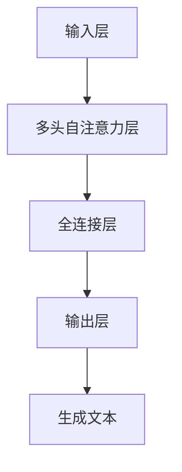

                 

### 引言

#### AIGC：人工智能生成内容

人工智能生成内容（AIGC，AI Generated Content）是近年来迅速崛起的一个领域。它指的是通过人工智能技术，尤其是深度学习算法，自动生成各种形式的内容，如文本、图像、音频和视频等。AIGC技术不仅改变了传统内容创作的方式，还开创了全新的内容生产模式。

AIGC的发展背景可以追溯到人工智能领域的快速发展。随着深度学习、生成对抗网络（GAN）等技术的成熟，计算机开始具备了模拟人类创作能力。特别是在自然语言处理（NLP）领域，基于变换器模型（Transformer）的语言模型，如GPT（Generative Pre-trained Transformer）系列，展现出了强大的生成能力。这些技术为AIGC的崛起提供了坚实的基础。

#### ChatGPT：GPT-3的诞生

ChatGPT是OpenAI推出的一款基于GPT-3（Generative Pre-trained Transformer 3）的语言模型。GPT-3是当前最先进的自然语言处理模型之一，拥有1750亿个参数，能够在多种任务中表现出色，包括文本生成、问答系统、语言翻译等。

ChatGPT的独特之处在于其强大的对话生成能力。通过大量的对话数据训练，ChatGPT能够模拟人类的对话方式，生成连贯、自然的对话内容。这使得ChatGPT在内容创作领域，尤其是文本生成方面具有极高的应用价值。

#### 核心特点与优势

AIGC和ChatGPT具有以下核心特点与优势：

1. **自动化与效率提升**：AIGC技术可以大幅提升内容创作的自动化程度，减少人工工作量，提高内容生成的效率。
2. **创新性与多样性**：AIGC技术能够生成新颖、多样化的内容，突破人类创作的局限性，为内容创作者提供更多的创作灵感。
3. **个性化与定制化**：通过深度学习算法，AIGC可以根据用户需求和偏好，生成个性化的内容，满足不同用户的需求。
4. **大规模数据处理能力**：AIGC技术能够处理海量数据，从数据中提取有价值的信息，为内容创作提供丰富的素材来源。

#### 应用前景与挑战

AIGC技术在内容创作领域具有广泛的应用前景。它可以应用于新闻写作、文案创作、广告宣传、教育内容制作等多个领域。同时，ChatGPT作为AIGC的代表，在文本生成和对话系统方面具有显著优势，为内容创作提供了强大的工具支持。

然而，AIGC技术的发展也面临一定的挑战。首先是技术实现的复杂性和成本问题。AIGC技术需要大量计算资源和数据支持，这对中小型企业和个人创作者来说可能是一个门槛。其次，AIGC技术可能会对传统内容创作者的就业产生影响，引发伦理和道德问题。最后，如何确保AIGC生成的内容质量，避免错误和偏见，也是亟待解决的问题。

总之，AIGC革命正在改变内容创作的方式，ChatGPT作为其核心工具，正在引领这一变革。在接下来的章节中，我们将深入探讨AIGC和ChatGPT的技术原理、应用场景和未来趋势，帮助读者更好地理解这一技术革命。

### AIGC技术基础

要深入理解AIGC（人工智能生成内容）技术，我们首先需要了解其背后的基础理论和技术框架。AIGC的核心在于生成模型，特别是基于深度学习的自然语言处理（NLP）模型。以下章节将详细介绍这些基础概念和技术原理。

#### 自然语言处理基础

自然语言处理（NLP，Natural Language Processing）是计算机科学和人工智能领域的一个重要分支，旨在使计算机能够理解、处理和生成人类语言。NLP的主要任务包括：

1. **文本分类（Text Classification）**：将文本数据分类到预定义的类别中。例如，垃圾邮件检测、情感分析等。
2. **序列标注（Sequence Labeling）**：为文本序列中的每个单词或字符分配一个标签。例如，命名实体识别、词性标注等。
3. **机器翻译（Machine Translation）**：将一种语言的文本翻译成另一种语言。例如，英语到中文的翻译。
4. **问答系统（Question Answering）**：基于输入问题，从知识库或文本中生成答案。例如，智能助手、搜索引擎等。

#### 语言模型原理

语言模型（Language Model）是NLP的核心组成部分，用于预测下一个单词或字符。其基本原理是通过大量文本数据训练出一个概率分布模型，用于生成文本。

1. **N-gram模型**：是最简单的语言模型，基于前N个单词预测下一个单词。例如，三元文模型（trigram model）通过观察前两个单词来预测第三个单词。
2. **神经网络语言模型**：随着深度学习技术的发展，神经网络语言模型逐渐取代了传统的N-gram模型。最著名的神经网络语言模型是变换器模型（Transformer），其通过自注意力机制（Self-Attention Mechanism）捕捉文本中的长距离依赖关系。

#### 预训练模型

预训练模型（Pre-trained Model）是当前NLP领域的核心技术之一。其基本思想是先在大规模的语料库上对模型进行预训练，然后针对特定任务进行微调（Fine-tuning）。预训练模型的主要优势包括：

1. **通用性**：预训练模型能够从大规模文本数据中学习到通用语言规律，提高模型在各种任务上的性能。
2. **高效性**：通过预训练，模型在特定任务上的训练时间大大缩短，因为大部分训练过程已经在预训练阶段完成。

预训练模型的工作原理主要包括以下步骤：

1. **预训练阶段**：在大规模文本数据上训练模型，通常使用自回归语言模型（Autoregressive Language Model）或 masked language model（MLM）。
2. **微调阶段**：将预训练模型应用于特定任务，通过少量的标注数据进行微调，使其适应特定任务的需求。

#### GPT模型详解

GPT（Generative Pre-trained Transformer）系列模型是OpenAI推出的一系列预训练变换器模型，包括GPT、GPT-2和GPT-3。以下是GPT-3的核心特点和工作原理：

1. **模型架构**：GPT-3采用了多层变换器模型，具有1750亿个参数，是当前最先进的语言模型之一。其基本架构包括输入层、多头自注意力层（Multi-head Self-Attention Layer）和全连接层（Fully Connected Layer）。
2. **训练过程**：GPT-3通过自回归语言模型（Autoregressive Language Model）在大规模文本数据上进行预训练。在预训练阶段，模型通过预测下一个单词来优化参数，从而学习到文本的生成规律。
3. **生成过程**：在生成文本时，GPT-3从给定的前文输入中预测下一个单词，并重复这个过程，直到生成满足要求的文本。

#### Mermaid流程图

为了更好地理解GPT模型的工作原理，我们可以使用Mermaid流程图来展示其基本架构和训练过程。以下是一个简单的Mermaid流程图示例：

通过上述基础理论和技术原理的介绍，我们可以更好地理解AIGC和ChatGPT的工作机制。在下一章节中，我们将进一步探讨ChatGPT在内容创作领域的具体应用场景。

### ChatGPT在内容创作中的具体应用

ChatGPT，作为GPT-3的强大变种，在内容创作领域展现了巨大的潜力。以下是ChatGPT在几种主要内容创作任务中的具体应用。

#### 文本生成

文本生成是ChatGPT最基本和最广泛应用的领域之一。ChatGPT能够生成各种形式的文本，从新闻简报、研究报告到诗歌、故事，几乎涵盖了所有文本类型。

1. **新闻写作**：ChatGPT可以自动生成新闻报道。例如，通过分析大量的新闻数据，ChatGPT能够编写体育赛事报道、财经新闻和分析文章。这种方式不仅提高了写作效率，还能保证新闻内容的及时性和准确性。
2. **研究报告**：在学术和科研领域，ChatGPT能够自动生成实验报告、研究报告和论文摘要。通过分析科研论文和数据，ChatGPT能够快速生成高质量的学术内容，节省了研究人员的时间和精力。
3. **故事创作**：ChatGPT还可以用于小说、诗歌和其他文学作品的创作。例如，用户可以给出一个故事的开头或主题，ChatGPT会根据这个输入生成整个故事，甚至可以是情节复杂、逻辑严谨的长篇小说。

#### 对话系统

对话系统是ChatGPT的另一个重要应用领域。ChatGPT能够模拟人类的对话方式，与用户进行自然、连贯的交流。

1. **智能客服**：在客户服务领域，ChatGPT可以用于构建智能客服系统。通过与用户进行对话，ChatGPT能够自动解答常见问题，处理客户投诉和提供个性化服务。这种方式不仅提高了客服效率，还能减少人力成本。
2. **教育辅导**：在教育领域，ChatGPT可以充当智能辅导老师，为学生提供个性化的学习建议、解答问题和进行模拟对话。通过分析学生的学习数据，ChatGPT能够更好地理解学生的学习需求和进度，提供有针对性的辅导。
3. **虚拟聊天伙伴**：ChatGPT还可以用于构建虚拟聊天伙伴应用。例如，用户可以与虚拟角色进行闲聊、玩游戏或进行深度对话。这种方式为用户提供了一种全新的社交体验。

#### 内容推荐

除了文本生成和对话系统，ChatGPT还可以用于内容推荐。通过分析用户的历史行为和兴趣偏好，ChatGPT能够为用户推荐个性化内容。

1. **个性化新闻推荐**：在新闻媒体领域，ChatGPT可以根据用户的阅读历史和兴趣标签，推荐个性化的新闻内容。这种方式不仅提高了用户的阅读体验，还能提高媒体的点击率和用户粘性。
2. **电商产品推荐**：在电子商务领域，ChatGPT可以分析用户的购物行为和偏好，推荐个性化的商品。例如，用户可以告诉ChatGPT自己喜欢什么类型的衣服，ChatGPT会根据这些信息推荐相应的商品。
3. **社交媒体内容推荐**：在社交媒体平台，ChatGPT可以分析用户的互动数据，推荐用户可能感兴趣的内容。这种方式不仅可以提高用户的使用体验，还能帮助平台提高用户活跃度和留存率。

#### 实际案例

以下是一些ChatGPT在内容创作中的实际案例：

1. **《纽约时报》使用ChatGPT生成体育新闻**：《纽约时报》使用ChatGPT生成体育赛事报道，大幅提高了写作效率和内容质量。通过分析大量的体育新闻数据，ChatGPT能够自动生成详细的比赛报道，包括比赛结果、精彩瞬间和运动员表现等。
2. **OpenAI内部使用ChatGPT进行文档编写和审核**：OpenAI在其内部使用ChatGPT生成和审核文档。ChatGPT能够快速生成高质量的文档，并通过对文档内容的分析，帮助团队发现潜在的问题和错误。
3. **Reddit使用ChatGPT构建智能问答社区**：Reddit利用ChatGPT构建了一个智能问答社区，用户可以提出问题，ChatGPT会根据社区的知识库和用户的历史提问，自动生成答案。这种方式不仅提高了社区的知识分享效率，还能为用户提供更准确的答案。

通过上述具体应用和实际案例，我们可以看到ChatGPT在内容创作领域具备的强大能力。在下一章节中，我们将进一步探讨AIGC对内容创作领域的深远影响。

### AIGC对内容创作领域的深远影响

AIGC（人工智能生成内容）的崛起正在对内容创作领域产生深远的影响。从内容创作者的角度来看，AIGC不仅改变了内容创作的方式，还带来了新的挑战和机遇。以下将从几个方面探讨AIGC对内容创作者的影响。

#### 提高创作效率

AIGC技术能够显著提高内容创作的效率。通过自动化和智能化的方式，AIGC可以快速生成大量的文本、图像和视频内容。例如，新闻机构可以利用AIGC自动生成体育赛事报道、财经新闻和分析文章，节省了大量的人力成本和时间。此外，文案创作者、广告策划师和教育工作者也可以利用AIGC生成高质量的文案、广告和教学素材，大幅提高工作效率。

#### 拓宽创作空间

AIGC技术为内容创作者提供了更广阔的创作空间。通过深度学习和自然语言处理技术，AIGC可以生成新颖、多样化的内容。无论是写小说、创作诗歌，还是制作动画和视频，AIGC都能为创作者提供更多的创作灵感和可能性。例如，作家可以利用AIGC生成新的故事情节和角色设定，设计师可以利用AIGC生成独特的艺术作品和设计元素。

#### 个性化内容创作

AIGC技术使得个性化内容创作成为可能。通过分析用户的行为和偏好数据，AIGC可以生成针对特定用户的内容。例如，电商网站可以利用AIGC推荐个性化商品，新闻媒体可以生成个性化新闻推送，教育平台可以提供个性化学习资源。这种方式不仅提高了用户体验，还能增强用户粘性和平台竞争力。

#### 伦理和道德问题

尽管AIGC技术带来了诸多好处，但同时也引发了伦理和道德问题。首先，AIGC生成的内容可能会侵犯知识产权。由于AIGC可以自动生成大量文本，这可能导致原创作品的版权纠纷。其次，AIGC技术可能会加剧信息过载问题。大量的自动生成内容可能会使读者难以分辨真实和虚假信息，导致信息污染。此外，AIGC技术可能引发就业问题。随着自动化程度的提高，一些传统内容创作者可能会失去工作机会，这对社会的就业结构产生影响。

#### 法律监管挑战

AIGC技术的快速发展也带来了法律监管的挑战。如何界定AIGC生成的内容的版权和责任成为法律界讨论的焦点。例如，如果AIGC生成的作品侵犯了他人的版权，责任应该由谁承担？此外，如何确保AIGC技术不被用于非法用途，如生成虚假新闻、网络诈骗等，也需要法律和监管机构关注。

#### 未来发展方向

面对AIGC带来的挑战和机遇，内容创作者和相关部门需要积极应对。以下是一些未来发展方向：

1. **版权保护**：建立更完善的版权保护机制，确保原创作品得到合法保护。可以考虑引入区块链技术，为原创作品提供可靠的版权证明。
2. **技术监管**：加强对AIGC技术的监管，防止其被滥用。例如，对AIGC生成的文本和图像进行内容审核，确保其合规性和真实性。
3. **教育培训**：加强内容创作者的技能培训，使其能够适应AIGC技术带来的变化。例如，教授如何利用AIGC技术提高创作效率和创作质量。
4. **伦理指导**：制定伦理规范，引导内容创作者在使用AIGC技术时遵循道德原则，确保内容创作的质量和价值。

总之，AIGC革命正在深刻改变内容创作领域。面对这一变革，内容创作者需要积极适应，充分利用AIGC技术带来的优势，同时关注其可能带来的挑战。在下一章节中，我们将通过几个案例研究，进一步探讨AIGC和ChatGPT在实际应用中的表现和效果。

### 案例研究：AIGC与ChatGPT的实际应用

为了更好地理解AIGC（人工智能生成内容）和ChatGPT在内容创作中的实际应用，我们将通过几个具体案例来进行分析。这些案例将展示AIGC和ChatGPT如何在不同场景下发挥作用，以及其带来的效益和挑战。

#### 案例一：新闻写作

**背景**：一家知名新闻媒体公司，面临着日益增加的新闻写作需求，特别是体育赛事和财经新闻的报道。手工写作不仅耗时，还可能因人力限制而无法及时发布。

**解决方案**：该公司引入了ChatGPT作为新闻写作助手。通过训练ChatGPT分析大量的新闻文本数据，使其能够自动生成新闻稿。

**应用过程**：
1. **数据收集**：收集大量的体育赛事和财经新闻数据，包括比赛结果、球员表现、经济指标等。
2. **模型训练**：使用GPT-3对新闻数据进行预训练，使其学习新闻写作的规律和风格。
3. **自动生成**：在比赛或事件发生后，ChatGPT自动生成新闻稿，包括概述、详细报道和数据分析。

**效益**：
- 提高了新闻发布的速度和频率，确保了新闻的及时性。
- 减少了人力成本，新闻团队可以将更多精力投入到更复杂的报道任务中。
- 生成的新闻内容具有高质量，通过人工审核和修正，确保新闻的准确性和可读性。

**挑战**：
- ChatGPT生成的新闻可能存在偏差，特别是在涉及主观评价的报道中。
- 如何确保生成的新闻内容不侵犯他人的知识产权，尤其是在引用其他媒体内容时。

**结论**：通过引入ChatGPT，新闻媒体公司显著提高了新闻写作的效率和覆盖面。然而，这也要求公司在技术和内容审核方面投入更多资源，以确保新闻质量。

#### 案例二：文案创作

**背景**：一家广告公司需要为多个客户创作文案，但创意团队资源有限，难以满足客户的需求。

**解决方案**：广告公司利用ChatGPT生成创意文案。通过训练ChatGPT分析大量的优秀广告文案，使其能够生成符合客户需求和品牌风格的文案。

**应用过程**：
1. **数据收集**：收集大量成功的广告文案数据，包括不同行业和风格的案例。
2. **模型训练**：使用GPT-3对广告文案数据进行预训练，使其学习广告文案的创作技巧和风格。
3. **文案生成**：根据客户的需求和品牌特点，ChatGPT自动生成创意文案。

**效益**：
- 提高了文案创作的速度和多样性，能够快速响应客户需求。
- 生成的文案具有创意性和独特性，有助于提升广告的效果和影响力。
- 减少了创意团队的工作负担，使其能够专注于更高价值的任务。

**挑战**：
- 生成的文案可能缺乏个性化和独特性，无法完全满足特定客户的独特需求。
- 如何确保生成的文案符合广告法规和道德标准。

**结论**：ChatGPT在文案创作中的应用大大提高了广告公司的效率和创意能力。然而，这也要求公司在文案审核和调整方面投入更多精力，以确保文案的个性和专业性。

#### 案例三：教育内容制作

**背景**：一家在线教育平台需要为不同层次的学生提供多样化的教育内容，但内容创作团队资源有限。

**解决方案**：教育平台利用ChatGPT生成教学素材。通过训练ChatGPT分析大量的教学文本和视频，使其能够生成适应不同学生水平的教学内容。

**应用过程**：
1. **数据收集**：收集大量的教学文本和视频数据，涵盖不同学科和难度级别。
2. **模型训练**：使用GPT-3对教学数据进行预训练，使其学习不同学科的教学规律和风格。
3. **内容生成**：根据学生的水平和学习需求，ChatGPT自动生成教学素材，包括讲义、视频脚本和练习题。

**效益**：
- 提高了教育内容的多样性和适应性，能够满足不同学生的需求。
- 减少了内容创作团队的工作量，提高了内容更新速度。
- 生成的教学素材质量高，通过人工审核和修正，确保教学效果。

**挑战**：
- 生成的教学素材可能存在错误或不准确的信息。
- 如何确保生成的教学素材符合教育标准和教学目标。

**结论**：ChatGPT在教育内容制作中的应用为在线教育平台提供了有力的支持，但同时也要求公司在内容审核和质量控制方面投入更多资源。

通过上述案例研究，我们可以看到AIGC和ChatGPT在内容创作中的实际应用，以及其带来的效益和挑战。在下一章节中，我们将探讨AIGC和ChatGPT的未来发展趋势，以及这些技术可能带来的变革。

### AIGC和ChatGPT的未来发展趋势

随着技术的不断进步和应用的深入，AIGC（人工智能生成内容）和ChatGPT在内容创作领域的未来发展充满了潜力。以下是几个关键趋势，展示了这些技术可能带来的变革。

#### 更强大的生成能力

随着深度学习和自然语言处理技术的不断进步，AIGC的生成能力将变得更加强大和精细。未来的AIGC模型可能会拥有更高的参数规模和更复杂的架构，从而能够生成更高质量、更符合用户需求的内容。例如，未来可能实现更精确的文本生成，不仅能够保持内容的连贯性和逻辑性，还能更好地捕捉细微的情感和语气。

#### 多模态内容的生成

AIGC技术的发展将不再局限于文本生成，而是扩展到多模态内容的生成。通过结合图像、音频和视频生成技术，AIGC将能够生成更加丰富和沉浸式的体验。例如，未来的AIGC模型可以同时生成文字描述和相应的图像，或者生成具有同步文本的音频和视频内容。这种多模态内容的生成将极大地拓展内容创作的边界。

#### 自动化内容审核和过滤

随着AIGC技术的普及，内容审核和过滤将变得更加自动化和高效。未来的AIGC系统可能会集成先进的图像和文本识别技术，能够自动识别和过滤不当内容，如色情、暴力或歧视性言论。这种方式不仅可以节省人工审核的成本，还能提高内容审核的准确性和效率。

#### 个人化和定制化内容创作

AIGC技术将继续推动个性化内容和定制化服务的普及。通过深度学习和用户数据分析，未来的AIGC系统将能够更好地理解用户的需求和偏好，生成高度个性化的内容。例如，电商平台可以根据用户的购买历史和浏览记录，自动生成个性化的产品推荐文案和广告。这种个性化服务将极大地提升用户体验和满意度。

#### 智能内容协作

AIGC技术有望实现人与机器的智能协作。未来的内容创作流程中，人类创作者将更多地与AIGC系统互动，共同完成内容创作。例如，创作者可以提供大致的创作方向和指导，而AIGC系统则负责生成具体的文字、图像和视频内容。这种协作模式将充分利用人类的创造力和AIGC的生成能力，实现更加高效和高质量的内容创作。

#### 社会伦理和法律问题

随着AIGC技术的普及，相关的社会伦理和法律问题也将日益凸显。未来需要建立更完善的伦理规范和法律框架，以确保AIGC技术的合理使用和内容创作的公平性。例如，如何界定AIGC生成内容的版权，如何确保生成的内容不侵犯他人的知识产权，以及如何防止AIGC技术被滥用，都是亟待解决的问题。

#### 教育和培训

AIGC技术的发展将对教育和培训领域产生深远影响。未来的教育培训体系可能会更加注重AIGC技术的教学和应用，培养具备AIGC技能的专业人才。例如，学校可以开设相关的课程，教授如何使用AIGC技术进行内容创作和编辑。同时，企业和行业组织也可能会提供专业的培训和认证，以帮助从业人员掌握AIGC技术。

总之，AIGC和ChatGPT的未来发展将带来内容创作领域的一场革命。随着技术的不断进步和应用的深入，我们可以期待更加丰富、多样和个性化的内容创作体验。然而，这同时也要求我们关注和解决相关的伦理、法律和社会问题，确保AIGC技术的可持续发展。

### 结论

AIGC革命正在重塑内容创作的方式，ChatGPT作为其核心工具，发挥着不可替代的作用。从文本生成、对话系统到内容推荐，ChatGPT的应用场景越来越广泛，为内容创作者提供了强大的支持。通过深入理解和合理利用AIGC技术，内容创作者不仅能够提高创作效率，还能拓宽创作空间，实现个性化内容创作。

然而，AIGC技术的发展也面临诸多挑战，包括伦理和道德问题、法律监管、技术实现的复杂性和成本等。因此，未来的发展需要我们在技术创新的同时，关注并解决这些挑战。

为了更好地把握AIGC技术带来的机遇，我们提出以下建议：

1. **技术学习和应用**：内容创作者应积极学习和掌握AIGC技术，将其应用于实际创作中，提高创作效率和质量。
2. **伦理和法律意识**：在应用AIGC技术时，应严格遵守相关伦理和法律规定，确保内容创作的合法性和道德性。
3. **团队协作与培训**：鼓励团队协作，共同探索AIGC技术的应用场景，同时加强教育培训，培养专业人才。
4. **持续创新与改进**：不断探索AIGC技术的创新应用，通过实践和反馈，持续改进技术，提升用户体验。

通过这些措施，我们可以更好地迎接AIGC革命带来的机遇和挑战，推动内容创作领域的持续发展。

### 拓展阅读

为了进一步了解AIGC和ChatGPT技术，以下是一些推荐阅读的资源和书籍：

1. **《AIGC技术全景解读》**：这是一本全面介绍AIGC技术的书籍，涵盖了基础理论、应用案例和未来趋势。适合对AIGC技术感兴趣的读者。

2. **《ChatGPT实战》**：本书详细介绍了ChatGPT的原理和应用，通过实际案例展示了ChatGPT在内容创作中的具体应用。适合希望掌握ChatGPT技术的开发者。

3. **《深度学习与自然语言处理》**：这是一本经典教材，详细介绍了深度学习和自然语言处理的基础知识，适合希望深入了解相关技术的读者。

4. **《人工智能：一种现代方法》**：本书从基础理论到应用案例，全面介绍了人工智能的各个方面，包括机器学习、深度学习等。适合对人工智能感兴趣的读者。

5. **《人工智能伦理导论》**：本书探讨了人工智能技术在社会、法律和伦理方面的挑战，提供了对人工智能技术的全面审视。适合关注人工智能伦理问题的读者。

通过阅读这些书籍和资源，读者可以更深入地了解AIGC和ChatGPT技术，掌握其在内容创作领域的应用，并思考相关技术的未来发展。

