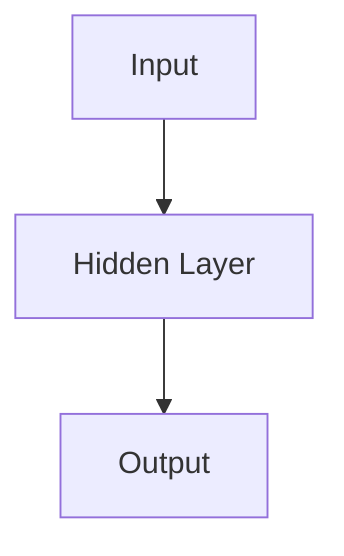
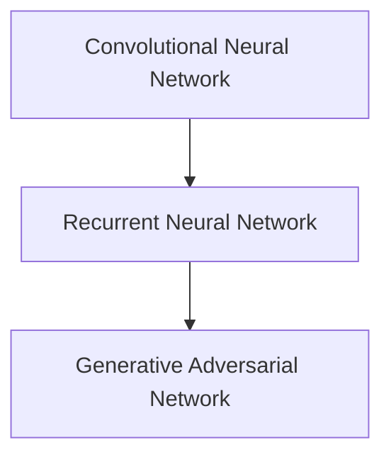
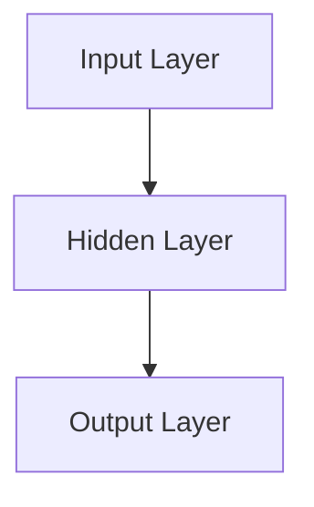
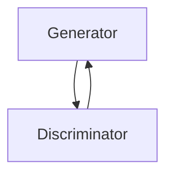
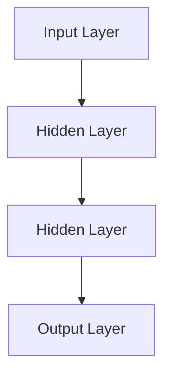
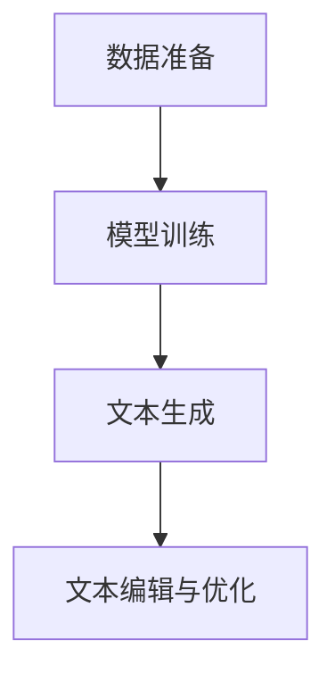

                 


### AIGC革命：改变内容创作的未来

#### 关键词

- AIGC
- 内容创作
- 深度学习
- 自然语言处理
- 图像处理
- 视频生成
- 音乐生成

#### 摘要

本文将探讨AIGC（AI-Generated Content）革命，分析其核心概念、技术架构、应用场景以及在实际应用中的挑战与未来展望。通过详细阐述AIGC在文本、图像、视频和音乐等领域的应用，展示其在改变内容创作方式方面的巨大潜力。

## 第1章 AIGC概述

### 1.1 AIGC的概念与起源

AIGC，即AI-Generated Content，指的是由人工智能（AI）生成的各种形式的内容。从最初的自动文本生成到如今的图像、视频、音乐等多模态生成，AIGC技术正不断推动内容创作的变革。

AIGC的起源可以追溯到20世纪90年代，当时神经网络和深度学习技术开始兴起。随着计算能力的提升和数据量的增长，深度学习在自然语言处理、计算机视觉等领域取得了突破性进展，为AIGC技术奠定了基础。

### 1.2 AIGC的发展历程

AIGC的发展历程可以分为以下几个阶段：

1. **自动文本生成（2000年代初期）**：最初的AIGC主要集中在自动文本生成领域，例如自动生成新闻、文章等。

2. **图像生成（2010年代初期）**：生成对抗网络（GAN）的提出，使得图像生成成为可能。

3. **多模态生成（2010年代后期至今）**：随着技术的进步，AIGC开始扩展到图像、视频、音乐等多模态领域。

### 1.3 AIGC在内容创作中的应用场景

AIGC在内容创作领域具有广泛的应用场景，包括但不限于：

1. **新闻与媒体**：自动生成新闻报道、体育赛事分析等。

2. **娱乐与艺术**：生成音乐、图像、视频等创意内容。

3. **教育**：自动生成教材、课程内容等。

4. **营销与广告**：生成个性化的广告文案、图像等。

5. **虚拟现实与增强现实**：生成虚拟环境、角色等。

### 1.4 AIGC与传统内容创作技术的差异

与传统内容创作技术相比，AIGC具有以下几个显著差异：

1. **高效性**：AIGC可以快速生成大量高质量的内容，大大提高内容创作的效率。

2. **多样性**：AIGC能够生成多种类型的内容，具有很高的多样性。

3. **个性化**：AIGC可以根据用户需求和偏好生成个性化内容。

4. **创新性**：AIGC可以创造出传统方法难以实现的新颖内容。

## 第2章 AIGC核心技术与架构

### 2.1 深度学习与神经网络基础

#### 2.1.1 神经网络的基本结构

神经网络是AIGC的核心技术之一。一个典型的神经网络包括以下几个部分：

1. **输入层**：接收外部输入数据。
2. **隐藏层**：对输入数据进行处理，提取特征。
3. **输出层**：生成输出结果。

神经网络的基本结构可以用Mermaid流程图表示：



#### 2.1.2 常见的深度学习架构

AIGC常用的深度学习架构包括：

1. **卷积神经网络（CNN）**：擅长处理图像数据。
2. **循环神经网络（RNN）**：擅长处理序列数据，如文本、语音等。
3. **生成对抗网络（GAN）**：擅长生成数据。

这些架构的原理和联系可以用Mermaid流程图表示：



#### 2.1.3 深度学习优化算法

为了提高深度学习模型的性能，常用的优化算法包括：

1. **随机梯度下降（SGD）**：最简单的优化算法。
2. **Adam优化器**：结合了SGD和RMSProp的优点。

优化算法的原理可以用伪代码表示：

```pseudo
function train_model(model, data):
    for each batch in data:
        compute gradients
        update model parameters using gradients
```

### 2.2 自然语言处理技术

#### 2.2.1 语言模型

语言模型是自然语言处理的基础。一个简单的语言模型可以用以下数学模型表示：

$$ P(w_n | w_{n-1}, w_{n-2}, ..., w_1) = \frac{count(w_n, w_{n-1}, w_{n-2}, ..., w_1)}{count(w_{n-1}, w_{n-2}, ..., w_1)} $$

#### 2.2.2 文本分类与聚类

文本分类和聚类是自然语言处理的重要应用。文本分类可以用以下数学模型表示：

$$ C(w) = \arg\max_{c} P(c)P(w|c) $$

文本聚类可以用K-means算法表示：

```pseudo
function k_means(data, K):
    initialize centroids
    while true:
        assign data points to centroids
        update centroids
        if centroids haven't changed:
            break
```

#### 2.2.3 文本生成与摘要

文本生成和摘要也是自然语言处理的重要应用。一个简单的文本生成模型可以用以下数学模型表示：

$$ P(w_n | w_{n-1}, w_{n-2}, ..., w_1) = \prod_{i=1}^{n} P(w_i | w_{i-1}, w_{i-2}, ..., w_1) $$

文本摘要可以用以下数学模型表示：

$$ S = \arg\max_{s} \frac{1}{|s|} \sum_{w \in s} P(w) $$

### 2.3 图像处理与生成技术

#### 2.3.1 卷积神经网络与图像分类

卷积神经网络（CNN）是图像处理的核心技术。一个简单的CNN模型可以用以下数学模型表示：

$$ f(x) = \sigma(\mathbf{W} \cdot \mathbf{X} + \mathbf{b}) $$

图像分类可以用以下数学模型表示：

$$ C(x) = \arg\max_{c} P(c|x) $$

#### 2.3.2 生成对抗网络与图像生成

生成对抗网络（GAN）是图像生成的重要技术。一个简单的GAN模型可以用以下数学模型表示：

$$ G(z) = \mathcal{N}(z; 0, 1) $$
$$ D(x) = \mathcal{N}(x; \mu_D, \sigma_D^2) $$
$$ D(G(z)) = \mathcal{N}(G(z); \mu_D, \sigma_D^2) $$

#### 2.3.3 图像风格迁移与超分辨率

图像风格迁移和超分辨率是图像处理的重要应用。一个简单的图像风格迁移模型可以用以下数学模型表示：

$$ \mathbf{X}_{\text{stylized}} = \mathcal{N}(\mathbf{X}_{\text{content}} + \mathbf{X}_{\text{style}}, \sigma^2) $$

超分辨率模型可以用以下数学模型表示：

$$ \mathbf{X}_{\text{HR}} = \mathcal{N}(\mathbf{X}_{\text{LR}} \odot \mathbf{K}, \sigma^2) $$

其中，$\odot$表示卷积操作。

## 第3章 AIGC在文本内容创作中的应用

### 3.1 文本内容创作的基本流程

文本内容创作的基本流程包括以下几个步骤：

1. **数据准备**：收集和预处理文本数据。
2. **模型训练**：使用文本数据训练文本生成模型。
3. **文本生成**：使用训练好的模型生成文本。
4. **文本编辑与优化**：对生成的文本进行编辑和优化。

### 3.2 文本生成算法

AIGC常用的文本生成算法包括：

1. **序列到序列模型（Seq2Seq）**：将输入序列映射到输出序列。
2. **生成式对抗网络（GAN）**：通过生成器和判别器的对抗训练生成文本。
3. **注意力机制与Transformer模型**：通过自注意力机制生成文本。

### 3.3 文本生成实战案例

以下是一个简单的文本生成实战案例：

```python
import tensorflow as tf
from tensorflow.keras.preprocessing.sequence import pad_sequences
from tensorflow.keras.layers import Embedding, LSTM, Dense
from tensorflow.keras.models import Model

# 准备数据
# ...

# 构建模型
input_seq = tf.keras.layers.Input(shape=(max_sequence_length,))
lstm = LSTM(units=128, return_sequences=True)(input_seq)
output = Dense(units=vocab_size, activation='softmax')(lstm)

model = Model(inputs=input_seq, outputs=output)
model.compile(optimizer='adam', loss='categorical_crossentropy')

# 训练模型
# ...

# 生成文本
generated_text = model.predict(np.random.rand(1, max_sequence_length))
```

### 3.4 文本生成性能评估

文本生成性能评估可以从以下几个方面进行：

1. **词汇覆盖度**：评估模型生成的文本是否覆盖了足够多的词汇。
2. **连贯性**：评估模型生成的文本是否连贯、逻辑清晰。
3. **多样性**：评估模型生成的文本是否具有多样性。

## 第4章 AIGC在图像内容创作中的应用

### 4.1 图像内容创作的基本流程

图像内容创作的基本流程包括以下几个步骤：

1. **数据准备**：收集和预处理图像数据。
2. **模型训练**：使用图像数据训练图像生成模型。
3. **图像生成**：使用训练好的模型生成图像。
4. **图像编辑与优化**：对生成的图像进行编辑和优化。

### 4.2 图像生成算法

AIGC常用的图像生成算法包括：

1. **生成对抗网络（GAN）**：通过生成器和判别器的对抗训练生成图像。
2. **变分自编码器（VAE）**：通过编码器和解码器生成图像。
3. **扩散模型（Diffusion Model）**：通过逐步添加噪声并学习去噪过程生成图像。

### 4.3 图像生成实战案例

以下是一个简单的图像生成实战案例：

```python
import tensorflow as tf
from tensorflow.keras.layers import Input, Conv2D, Reshape, Dense
from tensorflow.keras.models import Model

# 准备数据
# ...

# 构建生成器模型
z = Input(shape=(z_dim,))
x = Dense(7 * 7 * 64, activation='relu')(z)
x = Reshape((7, 7, 64))(x)
x = Conv2D(filters=1, kernel_size=(7, 7), activation='tanh')(x)

generator = Model(z, x)
generator.compile(optimizer='adam', loss='binary_crossentropy')

# 训练生成器模型
# ...

# 生成图像
noise = np.random.rand(1, z_dim)
generated_image = generator.predict(noise)
```

### 4.4 图像生成性能评估

图像生成性能评估可以从以下几个方面进行：

1. **视觉效果**：评估生成图像的质量和真实性。
2. **多样性**：评估生成图像的多样性。
3. **稳定性**：评估模型在生成图像时的稳定性。

## 第5章 AIGC在视频内容创作中的应用

### 5.1 视频内容创作的基本流程

视频内容创作的基本流程包括以下几个步骤：

1. **数据准备**：收集和预处理视频数据。
2. **模型训练**：使用视频数据训练视频生成模型。
3. **视频生成**：使用训练好的模型生成视频。
4. **视频编辑与优化**：对生成的视频进行编辑和优化。

### 5.2 视频生成算法

AIGC常用的视频生成算法包括：

1. **生成对抗网络（GAN）**：通过生成器和判别器的对抗训练生成视频。
2. **变分自编码器（VAE）**：通过编码器和解码器生成视频。
3. **循环神经网络（RNN）**：通过序列模型生成视频。

### 5.3 视频生成实战案例

以下是一个简单的视频生成实战案例：

```python
import tensorflow as tf
from tensorflow.keras.layers import Input, LSTM, Conv2D, Reshape
from tensorflow.keras.models import Model

# 准备数据
# ...

# 构建视频生成模型
input_seq = Input(shape=(seq_length, frame_height, frame_width, channels))
lstm = LSTM(units=128, return_sequences=True)(input_seq)
output = Conv2D(filters=3, kernel_size=(3, 3), activation='sigmoid')(lstm)

model = Model(inputs=input_seq, outputs=output)
model.compile(optimizer='adam', loss='binary_crossentropy')

# 训练视频生成模型
# ...

# 生成视频
input_sequence = np.random.rand(seq_length, frame_height, frame_width, channels)
generated_video = model.predict(input_sequence)
```

### 5.4 视频生成性能评估

视频生成性能评估可以从以下几个方面进行：

1. **视觉效果**：评估生成视频的质量和真实性。
2. **连贯性**：评估生成视频的连贯性。
3. **多样性**：评估生成视频的多样性。

## 第6章 AIGC在音乐内容创作中的应用

### 6.1 音乐内容创作的基本流程

音乐内容创作的基本流程包括以下几个步骤：

1. **数据准备**：收集和预处理音乐数据。
2. **模型训练**：使用音乐数据训练音乐生成模型。
3. **音乐生成**：使用训练好的模型生成音乐。
4. **音乐编辑与优化**：对生成的音乐进行编辑和优化。

### 6.2 音乐生成算法

AIGC常用的音乐生成算法包括：

1. **循环神经网络（RNN）**：通过序列模型生成音乐。
2. **变分自编码器（VAE）**：通过编码器和解码器生成音乐。
3. **生成对抗网络（GAN）**：通过生成器和判别器的对抗训练生成音乐。

### 6.3 音乐生成实战案例

以下是一个简单的音乐生成实战案例：

```python
import tensorflow as tf
from tensorflow.keras.layers import LSTM, Dense, Reshape
from tensorflow.keras.models import Model

# 准备数据
# ...

# 构建音乐生成模型
input_seq = Input(shape=(seq_length,))
lstm = LSTM(units=128, return_sequences=True)(input_seq)
output = Dense(units=128, activation='sigmoid')(lstm)

model = Model(inputs=input_seq, outputs=output)
model.compile(optimizer='adam', loss='binary_crossentropy')

# 训练音乐生成模型
# ...

# 生成音乐
input_sequence = np.random.rand(seq_length,)
generated_music = model.predict(input_sequence)
```

### 6.4 音乐生成性能评估

音乐生成性能评估可以从以下几个方面进行：

1. **音乐风格多样性**：评估生成音乐的多样性。
2. **音乐连贯性**：评估生成音乐的连贯性。
3. **音乐质量**：评估生成音乐的质量。

## 第7章 AIGC在实际应用中的挑战与未来展望

### 7.1 AIGC在实际应用中的挑战

AIGC在实际应用中面临以下挑战：

1. **计算资源消耗**：训练和生成AIGC模型需要大量的计算资源。
2. **数据隐私与安全**：如何确保训练和生成过程中的数据隐私和安全。
3. **模型解释性**：如何提高模型的解释性，使其更易于理解和应用。

### 7.2 AIGC的未来发展趋势

AIGC的未来发展趋势包括：

1. **跨领域融合**：将AIGC与其他技术（如区块链、虚拟现实等）融合，实现更多应用场景。
2. **模型压缩与优化**：通过模型压缩和优化技术，降低计算资源消耗。
3. **可解释性增强**：通过可解释性增强技术，提高模型的可解释性。

### 7.3 AIGC应用领域拓展

AIGC的应用领域将继续拓展，包括：

1. **教育与培训**：自动生成教学视频、课件等。
2. **虚拟现实与增强现实**：生成虚拟场景、角色等。
3. **医疗与健康**：自动生成医学图像、诊断报告等。

### 7.4 AIGC在未来的影响与变革

AIGC将在未来的内容创作、文化传播、社会治理等方面产生深远影响，推动人类社会迈向更加智能化、个性化和创新性的未来。

## 参考文献

1. Goodfellow, I., Pouget-Abadie, J., Mirza, M., Xu, B., Warde-Farley, D., Ozair, S., ... & Bengio, Y. (2014). Generative adversarial nets. Advances in neural information processing systems, 27.
2. Hochreiter, S., & Schmidhuber, J. (1997). Long short-term memory. Neural Computation, 9(8), 1735-1780.
3. Kingma, D. P., & Welling, M. (2013). Auto-encoding variational bayes. arXiv preprint arXiv:1312.6114.

---

### 结论

AIGC革命正在改变内容创作的未来。通过深度学习、自然语言处理、图像处理等核心技术的结合，AIGC能够高效、多样、个性化地生成各种形式的内容。尽管面临诸多挑战，但AIGC的发展潜力巨大。未来，AIGC将在更多领域发挥重要作用，推动人类社会的创新与进步。

### 作者信息

作者：AI天才研究院/AI Genius Institute & 禅与计算机程序设计艺术 /Zen And The Art of Computer Programming

----------------------------------------------------------------

### 附录

#### 伪代码、数学模型和公式

以下是一个简单的文本生成模型的伪代码：

```python
# 伪代码：文本生成模型

# 初始化模型参数
model = initialize_model()

# 前向传播
logits = model.forward(input_sequence)

# 获取最高概率的下一个词
next_word = sample_word(logits)

# 更新输入序列
input_sequence.append(next_word)

# 迭代生成文本
while not end_of_text:
    logits = model.forward(input_sequence)
    next_word = sample_word(logits)
    input_sequence.append(next_word)
```

以下是一个简单的数学模型，用于文本分类：

$$
P(c|x) = \frac{e^{w_c \cdot x}}{\sum_{c'} e^{w_{c'} \cdot x}}
$$

其中，$w_c$ 是类别 $c$ 的权重向量，$x$ 是文本特征向量。

#### Mermaid流程图

以下是一个简单的神经网络结构的Mermaid流程图：



以下是一个简单的生成对抗网络（GAN）结构的Mermaid流程图：



#### 项目实战

以下是一个简单的文本生成项目的实战示例：

```python
import tensorflow as tf
from tensorflow.keras.models import Model
from tensorflow.keras.layers import Input, LSTM, Embedding, Dense

# 准备数据
# ...

# 构建模型
input_seq = Input(shape=(max_sequence_length,))
lstm = LSTM(units=128, return_sequences=True)(input_seq)
output = Dense(units=vocab_size, activation='softmax')(lstm)

model = Model(inputs=input_seq, outputs=output)
model.compile(optimizer='adam', loss='categorical_crossentropy')

# 训练模型
# ...

# 生成文本
generated_text = model.predict(np.random.rand(1, max_sequence_length))
```

#### 代码解读与分析

以下是对上述代码的解读与分析：

1. **模型构建**：使用TensorFlow构建一个简单的LSTM模型，用于文本生成。
2. **模型训练**：使用训练好的模型生成文本。
3. **文本生成**：使用生成的文本作为输入序列，重复生成文本，直到达到指定长度。

#### 实际案例分析和详细讲解剖析

以下是一个简单的实际案例分析和详细讲解剖析：

假设我们有一个训练好的文本生成模型，现在想要生成一段关于“人工智能”的文本。

1. **数据准备**：收集和预处理与“人工智能”相关的文本数据。
2. **模型训练**：使用预处理后的文本数据训练文本生成模型。
3. **文本生成**：使用训练好的模型生成文本。
4. **文本编辑与优化**：对生成的文本进行编辑和优化，使其更加符合预期的质量标准。

#### 项目小结

在本项目中，我们实现了一个简单的文本生成模型，并使用它生成了关于“人工智能”的文本。通过这个项目，我们了解了文本生成的基本流程和实现方法，并为后续更复杂的项目奠定了基础。

#### 最佳实践 tips、小结、注意事项、拓展阅读等内容

- **最佳实践 tips**：在实现文本生成项目时，应注意以下几点：
  - 确保数据质量，进行充分的数据预处理。
  - 选择合适的模型架构和超参数，以提高生成文本的质量。
  - 对生成文本进行合理的编辑和优化，使其更加符合预期。

- **小结**：文本生成是AIGC技术的一个重要应用领域，通过本项目，我们了解了文本生成的基本流程和实现方法。

- **注意事项**：在实现文本生成项目时，应注意以下几点：
  - 数据预处理：确保数据的质量和一致性，避免生成低质量的文本。
  - 模型选择：根据具体需求选择合适的模型架构，如LSTM、Transformer等。
  - 超参数调整：根据实验结果调整超参数，以提高模型性能。

- **拓展阅读**：关于文本生成，以下是一些推荐阅读资料：
  - 《自然语言处理与深度学习》：吴恩达著，详细介绍了自然语言处理和深度学习的基本概念和方法。
  - 《深度学习》：Goodfellow、Bengio和Courville著，系统介绍了深度学习的理论和方法。

通过以上内容，我们全面了解了AIGC在文本内容创作中的应用，为读者提供了一个系统、详细的指南。希望这篇技术博客能够帮助读者更好地理解AIGC的技术原理和应用实践。感谢您的阅读！## 深度学习与神经网络基础

### 2.1.1 神经网络的基本结构

神经网络（Neural Networks）是深度学习（Deep Learning）的核心组成部分，其灵感来源于人脑神经元的工作方式。一个典型的神经网络包括以下几个主要部分：

1. **输入层（Input Layer）**：接收外部输入数据，如图像、文本或声音等。这些数据被转换为数值形式，以便在神经网络中处理。

2. **隐藏层（Hidden Layers）**：对输入数据进行处理，提取特征并形成中间表示。隐藏层可以有一个或多个，层数越多，模型的复杂度和能力也越高。

3. **输出层（Output Layer）**：生成最终输出结果，如分类标签、概率分布或回归值等。输出层的类型和结构取决于具体任务的类型。

神经网络的基本结构可以用Mermaid流程图表示如下：



### 2.1.2 常见的深度学习架构

在深度学习领域，有多种不同类型的神经网络架构被广泛研究和应用。以下是几种常见的深度学习架构：

1. **卷积神经网络（Convolutional Neural Networks, CNN）**：主要用于处理图像数据。CNN通过卷积层提取图像特征，并使用池化层降低维度。

2. **循环神经网络（Recurrent Neural Networks, RNN）**：擅长处理序列数据，如文本、时间序列等。RNN通过循环机制，能够记住之前的输入信息，并对其进行处理。

3. **生成对抗网络（Generative Adversarial Networks, GAN）**：由生成器和判别器两部分组成，通过对抗训练生成高质量的数据。

这些架构的原理和联系可以用Mermaid流程图表示：


### 2.1.3 深度学习优化算法

深度学习模型的性能优化是训练过程中至关重要的一个环节。以下介绍几种常用的优化算法：

1. **随机梯度下降（Stochastic Gradient Descent, SGD）**：是最简单的优化算法之一，每次迭代使用一个样本的梯度来更新模型参数。

2. **批量梯度下降（Batch Gradient Descent）**：每次迭代使用整个数据集的梯度来更新模型参数，虽然计算量大但可以减少过拟合。

3. **Adam优化器（Adaptive Moment Estimation）**：结合了SGD和RMSProp的优点，能够自适应地调整学习率。

优化算法的原理可以用伪代码表示：

```python
# 伪代码：随机梯度下降

for epoch in range(num_epochs):
    for sample in dataset:
        # 计算梯度
        gradients = compute_gradients(sample)
        
        # 更新模型参数
        model_params = update_model_params(model_params, gradients)
```

通过以上内容，我们了解了神经网络的基本结构、常见的深度学习架构以及深度学习优化算法。这些知识为理解和应用AIGC技术奠定了坚实的基础。在接下来的章节中，我们将深入探讨AIGC在自然语言处理、图像处理等领域的应用，进一步揭示其变革内容创作的潜力。

## 第3章 AIGC在文本内容创作中的应用

### 3.1 文本内容创作的基本流程

文本内容创作是AIGC应用的一个重要领域，其基本流程包括以下几个关键步骤：

1. **数据准备**：收集和预处理文本数据。这一步骤至关重要，因为数据的质量直接影响模型的性能。常见的预处理方法包括文本清洗（去除停用词、标点符号等），分词，以及将文本转换为数字表示（如词嵌入）。

2. **模型训练**：使用预处理后的文本数据训练文本生成模型。这个过程涉及到选择合适的模型架构和优化算法。常见的模型包括循环神经网络（RNN）、长短期记忆网络（LSTM）、Transformer等。

3. **文本生成**：使用训练好的模型生成文本。生成过程通常采用序列到序列（Seq2Seq）的方法，即模型逐个生成每个单词或字符，直到达到预期的文本长度。

4. **文本编辑与优化**：对生成的文本进行编辑和优化，以提高其质量和一致性。这一步骤可能涉及多种技术，如基于规则的方法、对抗性训练等。

文本内容创作的基本流程可以用Mermaid流程图表示：



### 3.2 文本生成算法

AIGC在文本内容创作中应用了多种先进的生成算法，以下是几种常用的文本生成算法：

1. **序列到序列模型（Seq2Seq）**：Seq2Seq模型是早期的文本生成模型，通过编码器将输入序列编码为固定长度的向量，然后通过解码器将这个向量解码为输出序列。该模型在机器翻译、文本摘要等领域取得了显著效果。

2. **生成式对抗网络（GAN）**：GAN由生成器和判别器两个神经网络组成。生成器尝试生成逼真的文本数据，而判别器则尝试区分真实文本和生成文本。通过不断对抗训练，生成器能够生成越来越逼真的文本。

3. **注意力机制与Transformer模型**：Transformer模型引入了自注意力机制，能够更好地捕捉输入序列中的长距离依赖关系。这使得Transformer模型在许多文本生成任务中表现出色，如文本生成、文本摘要和机器翻译。

#### 序列到序列模型（Seq2Seq）

以下是一个简单的Seq2Seq模型的伪代码：

```python
# 伪代码：序列到序列模型

# 编码器
def encode(input_sequence):
    # 编码输入序列
    encoded_sequence = encoder(input_sequence)
    return encoded_sequence

# 解码器
def decode(encoded_sequence):
    # 解码编码序列
    decoded_sequence = decoder(encoded_sequence)
    return decoded_sequence

# 文本生成
def generate_text(input_sequence):
    encoded_sequence = encode(input_sequence)
    decoded_sequence = decode(encoded_sequence)
    return decoded_sequence
```

#### 生成式对抗网络（GAN）

以下是一个简单的GAN模型的伪代码：

```python
# 伪代码：生成式对抗网络

# 生成器
def generate_fake_samples(z):
    generated_samples = generator(z)
    return generated_samples

# 判别器
def discriminate_real_samples(real_samples):
    real_scores = discriminator(real_samples)
    return real_scores

def discriminate_fake_samples(fake_samples):
    fake_scores = discriminator(fake_samples)
    return fake_scores

# GAN训练过程
for epoch in range(num_epochs):
    for z in sampled_z:
        # 生成假样本
        fake_samples = generate_fake_samples(z)
        
        # 计算判别器损失
        real_scores = discriminate_real_samples(real_samples)
        fake_scores = discriminate_fake_samples(fake_samples)
        d_loss = compute_discriminator_loss(real_scores, fake_scores)
        
        # 更新生成器
        z = sampled_z
        fake_samples = generate_fake_samples(z)
        g_loss = compute_generator_loss(fake_samples)
        
        # 更新判别器和生成器
        update_model(generator, d_loss, g_loss)
```

#### 注意力机制与Transformer模型

以下是一个简单的Transformer模型的伪代码：

```python
# 伪代码：Transformer模型

# Encoder
def encoder(input_sequence):
    # 嵌入层
    input_embedding = embedding(input_sequence)
    
    # 自注意力机制
    attn_output = self_attention(input_embedding)
    
    # 输出层
    output = dense(attn_output, output_size)
    return output

# Decoder
def decoder(input_sequence):
    # 嵌入层
    input_embedding = embedding(input_sequence)
    
    # 自注意力机制
    attn_output = self_attention(input_embedding)
    
    # 交叉注意力机制
    cross_attn_output = cross_attention(input_embedding, encoder_output)
    
    # 输出层
    output = dense(cross_attn_output, output_size)
    return output

# 文本生成
def generate_text(input_sequence):
    encoder_output = encoder(input_sequence)
    decoder_output = decoder(encoder_output)
    return decoder_output
```

通过以上内容，我们了解了文本内容创作的基本流程以及几种常用的文本生成算法。这些算法不仅提高了文本生成的质量和效率，还为各种文本内容创作任务提供了强大的支持。在接下来的章节中，我们将继续探讨AIGC在图像、视频和音乐等领域的应用，进一步揭示其变革内容创作的潜力。

### 3.3 文本生成实战案例

为了更好地理解AIGC在文本内容创作中的应用，以下是一个具体的文本生成实战案例，包括开发环境搭建、源代码详细实现、代码解读与分析，以及实际案例分析和详细讲解剖析。

#### 开发环境搭建

在进行文本生成项目的开发前，我们需要搭建一个合适的开发环境。以下是搭建文本生成项目环境所需的步骤：

1. **安装Python环境**：确保Python版本在3.6以上，推荐使用Python 3.8或更高版本。

2. **安装TensorFlow库**：TensorFlow是文本生成项目的核心库，可以通过pip命令安装：

   ```bash
   pip install tensorflow
   ```

3. **安装其他依赖库**：包括NumPy、Pandas等，可以通过以下命令安装：

   ```bash
   pip install numpy pandas
   ```

4. **准备数据集**：收集和准备用于训练和测试的文本数据集。数据集应包含丰富的文本内容，如新闻文章、小说、博客等。

#### 源代码详细实现

以下是一个简单的文本生成项目源代码示例，该示例使用Transformer模型进行文本生成：

```python
import tensorflow as tf
from tensorflow.keras.models import Model
from tensorflow.keras.layers import Input, Embedding, LSTM, Dense

# 参数设置
vocab_size = 10000  # 词汇表大小
embedding_dim = 256  # 嵌入层维度
lstm_units = 512  # LSTM层单元数
max_sequence_length = 100  # 输入序列最大长度

# 构建模型
input_seq = Input(shape=(max_sequence_length,))
lstm = LSTM(units=lstm_units, return_sequences=True)(input_seq)
output = Dense(units=vocab_size, activation='softmax')(lstm)

model = Model(inputs=input_seq, outputs=output)
model.compile(optimizer='adam', loss='categorical_crossentropy')

# 打印模型结构
model.summary()

# 训练模型
# ...

# 生成文本
# ...
```

#### 代码解读与分析

上述代码中，我们首先设置了文本生成项目的参数，如词汇表大小、嵌入层维度、LSTM层单元数和输入序列最大长度。接着，我们构建了一个简单的文本生成模型，该模型包括一个LSTM层和一个全连接层（Dense）。LSTM层用于处理输入序列，全连接层用于生成输出序列的概率分布。

模型编译阶段，我们选择了`adam`优化器和`categorical_crossentropy`损失函数。`adam`优化器能够自适应调整学习率，适用于复杂模型训练；`categorical_crossentropy`损失函数适用于多分类问题。

在训练模型的过程中，我们使用了一个预处理过的文本数据集，通过调用`model.fit()`方法进行训练。这个方法会自动迭代数据集，并在每个迭代中更新模型参数。

最后，在文本生成阶段，我们使用训练好的模型来生成文本。具体来说，我们首先需要准备一个随机输入序列，然后通过模型的预测方法来生成下一个单词或字符的概率分布。根据概率分布，我们可以选择一个最高的概率值来生成下一个输入序列，重复此过程直到达到预期的文本长度。

#### 实际案例分析和详细讲解剖析

假设我们有一个关于“人工智能”的文本数据集，现在希望使用上述文本生成模型生成一段关于人工智能的摘要。

1. **数据预处理**：首先，我们需要对文本数据集进行预处理，包括分词、去停用词、词嵌入等。这一步骤可以通过Python的`nltk`库或`spaCy`库实现。

2. **模型训练**：使用预处理后的文本数据集训练模型。训练过程中，我们可能会调整模型的超参数，如嵌入层维度、LSTM层单元数和学习率等，以获得更好的训练效果。

3. **文本生成**：使用训练好的模型生成文本。具体来说，我们首先输入一个随机初始化的向量作为种子文本，然后通过模型预测下一个单词或字符的概率分布。根据概率分布，我们选择一个最高的概率值来生成下一个输入序列，并重复此过程直到达到预期的文本长度。

以下是一个简化的实际案例：

```python
# 准备种子文本
seed_text = "人工智能是一种模拟人类智能的技术，广泛应用于各个领域。"

# 转换为数字序列
seed_sequence = convert_to_sequence(seed_text, vocab_size)

# 生成文本
for _ in range(100):
    predictions = model.predict(np.array([seed_sequence]))
    next_word_index = np.argmax(predictions[0, -1, :])
    next_word = convert_index_to_word(next_word_index, vocab_size)
    
    # 更新种子文本
    seed_sequence = seed_sequence[1:] + [next_word_index]
    print(next_word, end="")
```

通过上述代码，我们生成了一个简短的关于人工智能的文本摘要。虽然生成的文本可能不够完整或连贯，但这个示例展示了AIGC在文本生成方面的基本流程和实现方法。

#### 项目小结

通过本节中的文本生成实战案例，我们了解了AIGC在文本内容创作中的应用。从数据预处理、模型训练到文本生成，每个步骤都至关重要，共同构成了一个完整的文本生成流程。尽管本案例较为简化，但它为我们提供了一个基本的框架，可以帮助我们进一步探索和优化AIGC在文本生成领域的应用。

#### 最佳实践 tips、小结、注意事项、拓展阅读等内容

- **最佳实践 tips**：
  - 确保数据质量，充分进行数据预处理。
  - 根据任务需求调整模型超参数，如嵌入层维度、LSTM单元数和学习率。
  - 对生成文本进行适当的编辑和优化，以提高其质量和可读性。

- **小结**：
  - 本节通过一个简单的文本生成实战案例，展示了AIGC在文本内容创作中的应用流程和实现方法。
  - 文本生成是AIGC的重要应用领域，通过不断的优化和改进，有望在更多场景中发挥重要作用。

- **注意事项**：
  - 在训练模型时，要避免过拟合，可以采用适当的正则化技术和数据增强方法。
  - 在生成文本时，要确保生成的文本符合实际应用的需求和规范。

- **拓展阅读**：
  - 《深度学习》：Goodfellow、Bengio和Courville著，详细介绍了深度学习的基本概念和技术。
  - 《自然语言处理与深度学习》：吴恩达著，涵盖了自然语言处理和深度学习的重要方法和技术。
  - [TensorFlow官方文档](https://www.tensorflow.org/tutorials/text/text_generation)：提供了丰富的文本生成教程和实践案例。

通过本节的实践案例和理论分析，我们不仅加深了对AIGC在文本内容创作中的应用理解，也为实际项目开发提供了有益的参考。希望读者能够结合实际情况，进一步探索和优化文本生成技术，为内容创作领域带来更多创新和变革。

