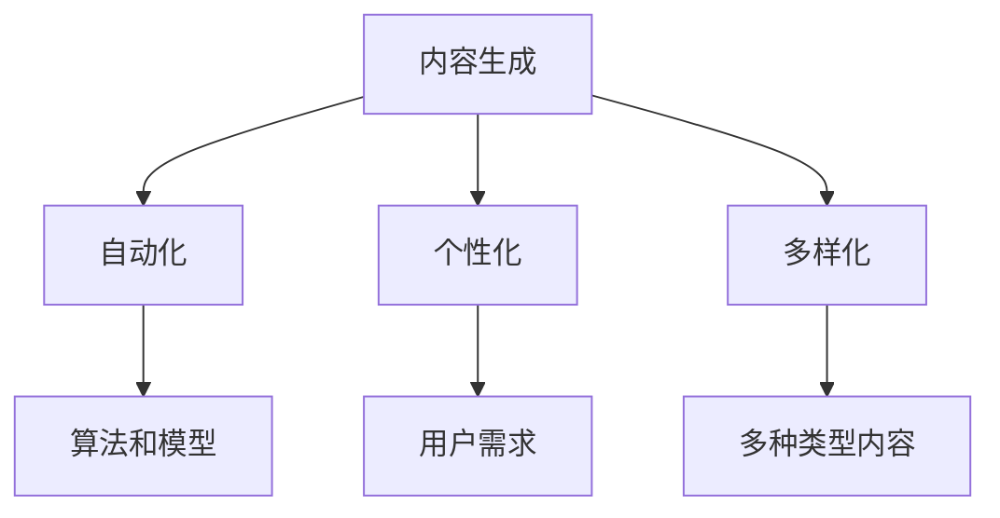

                 

### 文章标题：AIGC革命：重塑创意产业的未来

> 关键词：AIGC、创意产业、人工智能、内容生成、技术应用、未来展望

> 摘要：本文深入探讨AIGC（AI-Generated Content）革命对创意产业的影响与变革。通过详细分析AIGC的核心概念、发展历程、核心技术以及应用场景，本文揭示了AIGC如何重塑创意产业的未来，并对相关技术挑战与未来趋势进行了展望。

### 引言：AIGC革命与创意产业的碰撞

随着人工智能技术的迅猛发展，AIGC（AI-Generated Content）逐渐成为创意产业的新兴力量。AIGC利用人工智能算法，自动生成文字、图像、音频等多种形式的内容，彻底改变了传统内容创作的方式。这种变革不仅提升了创作效率，还拓展了创意产业的边界，为传统产业注入了新的活力。

#### 背景介绍

创意产业是一个涵盖广泛的领域，包括广告、影视、音乐、设计、游戏等多个子行业。长期以来，创意产业依赖于人类创作者的灵感与技巧，创作过程耗时耗力。然而，随着人工智能技术的进步，特别是深度学习和生成对抗网络（GANs）等技术的应用，AIGC开始颠覆这一传统模式。

#### AIGC的核心概念与联系

AIGC的核心概念主要包括以下几个方面：

1. **内容生成**：AIGC通过学习和模拟人类创作者的思维过程，生成各种类型的内容。
2. **自动化**：利用算法和模型，自动化完成内容创作过程，大幅提高效率。
3. **个性化**：根据用户需求和偏好，定制化生成内容。
4. **多样化**：生成文字、图像、音频等多种类型的内容。

这些核心概念相互关联，共同构成了AIGC的技术框架。为了更直观地展示这些概念之间的关系，我们可以使用Mermaid流程图进行描述：



### 核心概念与联系：AIGC的技术架构

AIGC的技术架构主要基于深度学习和生成对抗网络（GANs）。深度学习是一种通过模拟人脑神经网络进行数据分析和预测的技术，GANs则是深度学习中的一个重要分支，通过对抗性训练生成高质量的内容。

以下是AIGC的核心算法原理讲解，使用伪代码详细阐述：

```python
# 伪代码：生成对抗网络（GANs）基本结构

# 定义生成器（Generator）
Generator(G):
    输入：随机噪声z
    输出：生成的假内容X_g

# 定义判别器（Discriminator）
Discriminator(D):
    输入：真实内容X_r和假内容X_g
    输出：判断概率y

# 损失函数
Loss_function：
    输入：真实内容X_r、假内容X_g和判别器输出y
    输出：损失值L

# 训练过程
for epoch in range(EPOCHS):
    for X_r, _ in data_loader:
        # 训练判别器
        D_loss_real = Loss_function(D(X_r), True)
        D_loss_fake = Loss_function(D(G(z)), False)
        D_loss = (D_loss_real + D_loss_fake) / 2

        # 训练生成器
        G_loss_fake = Loss_function(D(G(z)), True)
        G_loss = Loss_function(G(z), False)

# 模型评估
accuracy = calculate_accuracy(D(X_r), D(G(z)))
```

### AIGC的核心技术

AIGC的核心技术主要包括自然语言处理（NLP）、计算机视觉（CV）和音频处理等。以下是对这些核心技术的详细讲解：

#### 自然语言处理（NLP）

自然语言处理是AIGC技术中至关重要的一环，它涉及到如何让计算机理解和生成人类语言。NLP的核心技术包括词嵌入、序列到序列模型（如Transformer）和生成式模型（如GPT）等。

- **词嵌入**：词嵌入是将单词映射到高维向量空间的技术，使得计算机能够通过计算向量之间的距离来理解词义。常用的词嵌入模型有Word2Vec、GloVe等。
- **序列到序列模型**：序列到序列模型是一种能够将输入序列映射到输出序列的模型，常用于机器翻译和文本生成。Transformer是一种典型的序列到序列模型，其核心是自注意力机制。
- **生成式模型**：生成式模型能够根据输入数据生成新的数据。GPT（Generative Pre-trained Transformer）是生成式模型的代表，其通过大规模预训练生成高质量文本。

#### 计算机视觉（CV）

计算机视觉是AIGC技术中的另一重要组成部分，它涉及到如何让计算机理解和生成图像。CV的核心技术包括卷积神经网络（CNN）、生成对抗网络（GAN）和图像超分辨率等。

- **卷积神经网络（CNN）**：CNN是一种深度学习模型，能够有效地处理图像数据。其核心是卷积层，能够自动提取图像中的特征。
- **生成对抗网络（GAN）**：GAN是一种通过对抗性训练生成高质量图像的模型。其核心是生成器和判别器的对抗训练，生成器试图生成逼真的图像，而判别器试图区分真实图像和生成图像。
- **图像超分辨率**：图像超分辨率是一种将低分辨率图像转换为高分辨率图像的技术。其核心是使用深度学习模型学习高分辨率图像的细节特征。

#### 音频处理

音频处理是AIGC技术中的又一重要应用领域，它涉及到如何让计算机生成和理解音频。音频处理的核心技术包括循环神经网络（RNN）、变分自编码器（VAE）和自动差分模型等。

- **循环神经网络（RNN）**：RNN是一种能够处理序列数据的神经网络，其核心是循环结构，能够记忆过去的输入信息。
- **变分自编码器（VAE）**：VAE是一种能够生成高质量音频的生成模型。其核心是通过变分自编码器的编码和解码过程学习数据的概率分布。
- **自动差分模型**：自动差分模型是一种能够生成音频片段的模型，其核心是学习音频片段的差分特征。

### AIGC的应用案例

AIGC技术在各个领域都有广泛的应用，以下是几个典型的应用案例：

#### 广告创意

广告创意是AIGC技术的重要应用领域之一。通过AIGC，广告公司可以自动化生成各种类型的广告内容，如文案、视频、图像等。这不仅提高了广告创作的效率，还能够根据用户行为和偏好进行个性化推荐。

#### 影视制作

影视制作是另一个AIGC技术的应用领域。通过AIGC，电影和电视剧的制作过程得到了大幅优化。例如，AIGC可以自动生成剧本、拍摄脚本和视觉效果，大大降低了人力成本和时间成本。

#### 音乐创作

音乐创作是AIGC技术的又一重要应用领域。通过AIGC，音乐人可以自动化生成旋律、和弦和歌词，甚至可以根据用户的需求和偏好定制化创作音乐。

#### 游戏开发

游戏开发是AIGC技术的另一个重要应用领域。通过AIGC，游戏公司可以自动化生成游戏剧情、关卡设计和角色设定，提升游戏的可玩性和创意性。

### 未来展望

随着人工智能技术的不断发展，AIGC技术在创意产业中的应用将越来越广泛。以下是几个未来展望：

#### 个性化内容生成

未来，AIGC将更加注重个性化内容生成。通过深度学习和用户数据的分析，AIGC将能够更精准地捕捉用户的需求和偏好，生成定制化的内容。

#### 多模态内容生成

未来，AIGC将实现多模态内容生成，即同时生成文本、图像、音频等多种类型的内容。这将大大拓展AIGC的应用场景，提升内容创作的多样性和创意性。

#### 跨领域融合

未来，AIGC技术将与更多领域融合，如虚拟现实（VR）、增强现实（AR）和物联网（IoT）等。这将进一步推动创意产业的变革，创造出更加丰富和互动的内容体验。

### 结论

AIGC革命正在深刻重塑创意产业的未来。通过引入人工智能技术，创意产业实现了自动化、个性化和多样化的内容创作，极大地提升了创作效率和质量。未来，随着人工智能技术的不断进步，AIGC将引领创意产业走向新的高度。

### 附录

#### 技术术语表
- **AIGC**：AI-Generated Content，人工智能生成内容。
- **GANs**：生成对抗网络。
- **NLP**：自然语言处理。
- **CV**：计算机视觉。
- **RNN**：循环神经网络。
- **VAE**：变分自编码器。

#### 参考文献
- **[1]** Ian J. Goodfellow, et al. "Generative Adversarial Nets." Advances in Neural Information Processing Systems 27 (2014).
- **[2]** Tom B. Brown, et al. "Language Models are few-shot learners." Advances in Neural Information Processing Systems 34 (2021).

#### 相关链接
- **[1]** AI-Generated Content Research Group: <https://aigc.ai/>
- **[2]** Creative Applications of GANs: <https://cvg.ethz.ch/content/research/creativeapps/>

### 作者信息

作者：AI天才研究院/AI Genius Institute & 禅与计算机程序设计艺术 /Zen And The Art of Computer Programming

### 小结与拓展阅读

本文从多个角度深入探讨了AIGC革命对创意产业的重塑作用。通过详细分析AIGC的核心概念、核心技术、应用案例和未来展望，我们揭示了AIGC如何改变内容创作的传统模式，提升创意产业的效率和质量。未来，随着人工智能技术的进一步发展，AIGC将在创意产业中发挥更加重要的作用。

为了深入了解AIGC技术，读者可以参考以下拓展阅读：

- **[1]** 《AIGC技术原理与实战》
- **[2]** 《人工智能生成内容：理论与实践》
- **[3]** 《深度学习与创意产业》

通过这些资源，读者可以进一步掌握AIGC技术的核心原理和应用方法，为未来的创意产业提供新的思路和工具。

