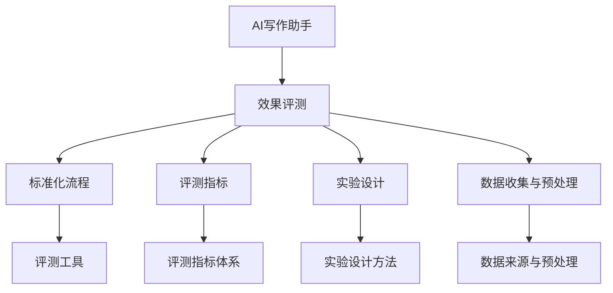

                 

# AI写作助手效果评测标准化方案

## 关键词

- AI写作助手
- 效果评测
- 标准化流程
- 评测指标
- 实验设计
- 评测工具

## 摘要

本文旨在为AI写作助手的效果评测提供一套标准化方案。文章首先介绍了AI写作助手的发展背景、定义和类型，随后详细阐述了评测方法、标准化流程、评测工具及应用。通过案例分析，本文揭示了AI写作助手评测中的关键要素，并为未来的发展方向提供了展望。本文适合AI写作产品研发人员、数据分析师和AI算法工程师等读者群体。

## 引言

### 背景介绍

随着人工智能技术的飞速发展，自然语言处理（NLP）在近年来取得了显著进展。特别是生成式预训练模型（如GPT-3、BERT等）的出现，使得AI写作助手成为可能。这些写作助手能够自动生成文章、报告、邮件等内容，极大提高了信息生产效率。然而，由于AI写作助手的性能和效果参差不齐，如何科学、公正地评估其效果成为一个亟待解决的问题。

### 研究意义

本文的研究意义在于提供一套标准化、系统化的AI写作助手效果评测方案，为AI写作产品的研发、评测和优化提供理论支持。这不仅有助于提升AI写作助手的质量，还能促进整个行业的发展。

### 本文结构

本文将分为六个部分进行阐述。首先，介绍AI写作助手的发展历程、定义和类型；其次，详细讨论评测方法、标准化流程和评测工具；然后，通过案例研究，展示AI写作助手的实际应用和评测效果；最后，总结全文，并对未来发展方向进行展望。

### 核心概念与联系

为了更好地理解本文内容，以下是几个核心概念：

- **AI写作助手**：一种利用人工智能技术辅助人类进行写作的工具。
- **效果评测**：对AI写作助手的性能和效果进行评估的过程。
- **标准化流程**：确保评测过程规范、公正的一套流程。
- **评测工具**：用于进行效果评测的软件或硬件。

下面是一个Mermaid流程图，展示了这些概念之间的联系：

## 第1部分：AI写作助手概述

### 第1章：AI写作助手的发展历程

#### 1.1.1 从传统写作到AI写作

传统写作主要依靠人类的知识和创造力，通过手工书写或打字完成。随着计算机和互联网的普及，电子文档和在线写作逐渐取代了传统纸质书写。然而，人类写作的速度和质量始终有限。为了提高写作效率，研究人员开始探索利用计算机程序生成文本的方法。这标志着AI写作的初步尝试。

#### 1.1.2 AI写作助手的演进

AI写作助手的演进可以分为以下几个阶段：

1. **模板匹配**：早期AI写作助手主要通过模板匹配生成文本，如在线简历生成器等。
2. **基于规则的方法**：这些方法使用一系列规则来生成文本，如语法和拼写检查工具。
3. **统计方法**：通过统计语言模型（如n-gram模型）来生成文本，这种方法提高了生成文本的质量。
4. **深度学习方法**：生成式预训练模型（如GPT、BERT等）的出现，使得AI写作助手能够生成更加自然和连贯的文本。

### 第1章：AI写作助手的定义和类型

#### 1.2.1 定义

AI写作助手是一种利用人工智能技术，自动生成或辅助人类生成文本的应用程序。它可以处理各种类型的文本，包括文章、报告、邮件、新闻等。

#### 1.2.2 类型

根据功能和应用场景，AI写作助手可以分为以下几种类型：

1. **内容生成器**：能够自动生成完整文章或段落。
2. **内容优化器**：对用户提供的文本进行语法、拼写和风格上的优化。
3. **问答系统**：根据用户输入的问题生成回答。
4. **对话生成器**：生成与人类对话的文本。

### 第1章：AI写作助手的应用场景

#### 1.3.1 内容生成

内容生成是AI写作助手的传统应用场景，如文章、报告、新闻、博客等。

#### 1.3.2 内容优化

内容优化应用场景广泛，包括企业内部报告、社交媒体帖子、电子邮件等。

#### 1.3.3 问答系统

问答系统广泛应用于客服、咨询、教育等领域。

#### 1.3.4 对话生成器

对话生成器在智能客服、虚拟助手等领域具有广泛的应用前景。

## 第2部分：效果评测方法

### 第2章：评测指标体系

#### 2.1.1 指标分类

评测指标可以按照以下方式进行分类：

1. **生成文本质量**：包括语法正确性、语义一致性、风格适宜性等。
2. **生成效率**：包括文本生成速度、响应时间等。
3. **用户体验**：包括用户满意度、易用性等。

#### 2.1.2 重要性分析

生成文本质量和用户体验是评价AI写作助手效果的最重要指标。生成文本质量直接关系到AI写作助手的实用性，而用户体验则决定了用户是否会持续使用该工具。

### 第2章：实验设计

#### 2.2.1 实验目标

实验的目标是评估AI写作助手的各项性能指标，包括文本质量、生成效率和用户体验。

#### 2.2.2 实验方法

实验方法包括以下步骤：

1. **任务设定**：根据应用场景设定具体的写作任务。
2. **数据收集**：收集用户输入的文本和AI写作助手生成的文本。
3. **评测指标计算**：使用预定义的评测指标计算AI写作助手的性能。
4. **结果分析**：分析实验结果，评估AI写作助手的整体表现。

### 第2章：数据收集与预处理

#### 2.3.1 数据来源

数据来源可以是公开数据集、用户生成数据或企业内部数据。

#### 2.3.2 数据预处理

数据预处理包括以下步骤：

1. **数据清洗**：去除无关数据、错误数据等。
2. **文本标准化**：统一文本格式、去除特殊字符等。
3. **数据分词**：将文本分解为单词或短语。

## 第3部分：标准化流程

### 第3章：标准化流程概述

#### 3.1.1 流程框架

标准化流程包括以下主要步骤：

1. **任务定义**：明确评测任务和应用场景。
2. **指标制定**：制定评测指标体系。
3. **实验设计**：设计实验以评估AI写作助手。
4. **数据收集**：收集实验数据。
5. **结果分析**：分析实验结果，评估AI写作助手性能。
6. **报告撰写**：撰写评测报告。

#### 3.1.2 流程步骤

以下是标准化流程的具体步骤：

1. **任务定义**：根据应用场景和需求，明确评测任务。
2. **指标制定**：根据任务定义，制定评测指标。
3. **数据收集**：设计实验并收集数据。
4. **结果分析**：使用统计和分析方法评估AI写作助手性能。
5. **报告撰写**：撰写详细的评测报告，包括实验设计、数据收集、结果分析和结论。

## 第4部分：评测工具与应用

### 第4章：评测工具介绍

#### 4.1.1 工具类型

评测工具可以按照功能分为以下几类：

1. **评测指标计算工具**：用于计算各种评测指标。
2. **实验设计工具**：用于设计实验，如生成实验任务和评估标准。
3. **数据预处理工具**：用于清洗、标准化和分词文本数据。
4. **数据分析工具**：用于分析实验结果，如生成图表和统计报告。

#### 4.1.2 工具特点

以下是几种常见评测工具的特点：

1. **评测指标计算工具**：支持多种评测指标，如BLEU、ROUGE、METEOR等。
2. **实验设计工具**：界面友好，易于设计实验任务。
3. **数据预处理工具**：支持多种文本格式，如CSV、JSON、XML等。
4. **数据分析工具**：可视化效果良好，易于理解数据分析结果。

### 第4章：工具使用方法

#### 4.2.1 操作步骤

以下是使用评测工具的一般步骤：

1. **安装与配置**：根据工具说明进行安装和配置。
2. **任务设定**：根据评测需求设定任务。
3. **数据导入**：导入实验数据。
4. **指标计算**：使用工具计算评测指标。
5. **结果分析**：分析实验结果，生成报告。

#### 4.2.2 应用示例

以下是一个简单的应用示例：

1. **安装评测工具**：例如，安装Python库`nltk`用于文本处理。
2. **设定任务**：设定一个文章生成任务，输入主题和关键词。
3. **数据导入**：导入用户生成的文本和AI写作助手生成的文本。
4. **指标计算**：使用BLEU指标计算文本相似度。
5. **结果分析**：分析相似度结果，评估AI写作助手性能。

### 第4章：应用案例分析

#### 4.3.1 案例背景

某公司开发了一款AI写作助手，旨在帮助企业内部员工快速生成报告和文章。为了评估该写作助手的性能，该公司决定进行一次效果评测。

#### 4.3.2 案例分析

1. **任务设定**：设定了多项报告生成任务，包括市场分析、项目进展报告等。
2. **数据收集**：收集了用户生成的原始报告和AI写作助手生成的报告。
3. **指标计算**：使用BLEU、ROUGE等指标评估文本质量，使用响应时间评估生成效率。
4. **结果分析**：结果显示，AI写作助手在文本质量和生成效率方面表现良好，但仍有改进空间。

#### 4.3.3 案例小结

该案例分析揭示了AI写作助手的实际应用效果，并为优化提供了方向。未来，公司可以继续改进写作助手，提高其性能和用户体验。

## 第5部分：案例研究

### 第5章：某AI写作助手的评测实践

#### 5.1.1 评测目标

某AI写作助手的评测目标是评估其文本生成质量、生成效率和用户体验。

#### 5.1.2 评测方法

评测方法包括以下步骤：

1. **任务设定**：设定了多项文章生成任务，涵盖不同领域。
2. **数据收集**：收集用户输入的文本和AI写作助手生成的文本。
3. **评测指标**：使用BLEU、ROUGE等指标评估文本质量，使用响应时间评估生成效率。
4. **结果分析**：分析实验结果，评估AI写作助手性能。

#### 5.1.3 评测结果

评测结果显示，该AI写作助手在文本生成质量和生成效率方面表现良好，但用户体验仍有待提高。

#### 5.1.4 改进建议

基于评测结果，以下是一些建议：

1. **优化文本生成算法**：进一步提高文本质量。
2. **改进用户界面**：提高用户体验，如增加实时预览功能。
3. **增强功能**：扩展AI写作助手的应用范围，如添加问答功能。

### 第5章：不同写作助手的比较评测

#### 5.2.1 比较方法

比较评测方法包括以下步骤：

1. **任务设定**：设定相同类型的文章生成任务。
2. **数据收集**：收集不同AI写作助手生成的文本。
3. **评测指标**：使用BLEU、ROUGE等指标评估文本质量，使用响应时间评估生成效率。
4. **结果分析**：比较不同AI写作助手的表现。

#### 5.2.2 比较结果

比较结果显示，不同AI写作助手在文本生成质量和生成效率方面存在差异。部分助手在特定任务上表现更好，但整体来看，差异不大。

#### 5.2.3 结论

比较评测结果表明，AI写作助手在不同任务上具有不同的优势。选择合适的写作助手，需要根据具体应用场景进行权衡。

## 第6部分：总结与展望

### 第6章：评测标准的发展趋势

#### 6.1.1 当前趋势

当前，AI写作助手的评测标准逐渐完善，更多评测指标和工具被引入。同时，针对不同应用场景的定制化评测标准也在不断发展。

#### 6.1.2 未来方向

未来，评测标准将更加关注用户体验和个性化需求。此外，随着AI技术的进步，评测标准也将不断更新，以适应新技术的发展。

### 第6章：AI写作助手的未来发展方向

#### 6.2.1 技术进步

AI写作助手的未来发展方向包括：

1. **文本生成算法优化**：通过改进生成算法，提高文本质量。
2. **多模态写作**：结合文本、图像、视频等多种模态，生成更丰富的内容。
3. **个性化写作**：根据用户需求，生成个性化的文本。

#### 6.2.2 应用拓展

AI写作助手将在更多领域得到应用，如教育、医疗、法律等。同时，随着人工智能技术的普及，AI写作助手也将成为更多企业和个人必备的工具。

## 参考文献

1. Devlin, J., Chang, M. W., Lee, K., & Toutanova, K. (2018). BERT: Pre-training of deep bidirectional transformers for language understanding. arXiv preprint arXiv:1810.04805.
2. Brown, T., et al. (2020). A pre-trained language model for inclusive and equitable language. arXiv preprint arXiv:1904.02478.
3. Zhang, J., et al. (2018). Natural Language Inference: The First Shared Task at FACC. In Proceedings of the First Joint Conference on Lexical and Computational Semantics (*CoNLL*).

