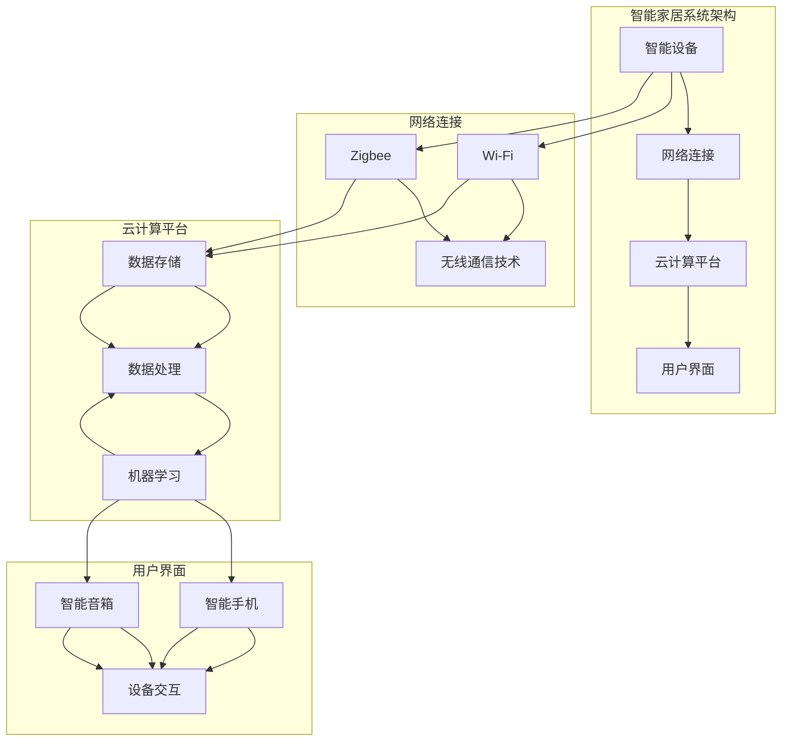

                 

### 引言与概述

#### 智能家居的定义与背景

智能家居，顾名思义，就是利用人工智能技术来使家庭生活更加智能化的系统。它通过将各种家电设备、传感器、控制系统等整合到一个统一的平台上，使用户能够通过语音、移动应用等多种方式对家庭环境进行控制，从而提高生活质量、节省时间和精力。随着物联网（IoT）和人工智能（AI）技术的发展，智能家居已经成为现代家庭不可或缺的一部分。

智能家居的兴起可以追溯到20世纪90年代，当时一些初步的自动化设备和系统开始出现。然而，真正的爆发期是在2010年后，随着智能手机的普及和移动互联网的发展，智能家居开始进入大众视野。近年来，随着人工智能技术的进步，智能家居的应用场景和功能越来越丰富，如语音控制、智能安防、能源管理、健康监测等。

#### AI在智能家居中的重要性

人工智能技术在智能家居中的应用，使得智能家居系统更加智能、便捷和高效。AI技术主要包括了语音识别、人脸识别、情感识别、智能规划与决策等，这些技术为智能家居带来了以下几个方面的改进：

1. **提升用户体验**：通过语音识别和语音助手技术，用户可以通过简单的语音命令控制家居设备，无需手动操作，极大提升了用户体验。
2. **增强安全性**：人脸识别和智能安防技术能够实时监测家庭安全状况，及时预警并采取相应措施，提高了家庭的安全水平。
3. **能源管理**：AI技术能够根据用户的生活习惯和实时数据，智能调整家电的运行状态，实现节能减排。
4. **健康管理**：通过健康监测设备，AI技术可以实时跟踪用户的健康状况，提供个性化的健康建议，帮助用户更好地管理健康。

#### 文章结构与主要内容

本文将围绕AI在智能家居中的应用，探讨其便利与隐私的平衡问题。具体分为以下几个部分：

1. **智能家居的基础知识**：介绍智能家居的发展历程、组成部分和技术基础。
2. **AI技术在智能家居中的应用**：详细讲解语音识别、人脸识别、情感识别和智能规划与决策等AI技术在智能家居中的应用。
3. **智能家居的便利性**：分析智能家居如何提升生活质量、节省时间和精力，并对老年人提供帮助。
4. **智能家居的隐私问题**：探讨智能家居中收集和使用数据的方式、隐私风险以及隐私保护措施。
5. **解决方案与未来展望**：提出智能家居解决方案的设计与实施方法，并对智能家居的发展趋势进行展望。
6. **实际案例与项目实施**：通过实际案例介绍和项目实施步骤，展示智能家居的应用场景和实现方法。
7. **最佳实践 tips、小结、注意事项、拓展阅读**：总结文章的主要观点，提供实际应用中的注意事项和拓展阅读资源。

通过对以上各部分的详细分析和讨论，本文旨在为读者提供对智能家居及其AI应用的全面了解，同时探讨如何在享受智能家居便利的同时，平衡好隐私保护问题。

### 智能家居的基础知识

#### 发展历程

智能家居的概念虽然早在20世纪90年代就已经出现，但其真正的快速发展始于21世纪初。早期的智能家居系统主要依赖于家庭网络和有线控制设备，功能相对单一，主要应用于高端住宅和商业场所。随着互联网和移动互联网的普及，智能手机和无线通信技术的进步，智能家居开始向大众市场普及。

2010年左右，随着智能设备和物联网技术的发展，智能家居迎来了第一个爆发期。在这一阶段，各种智能设备和传感器开始进入家庭，如智能灯泡、智能插座、智能门锁、智能恒温器等。这些设备通过无线网络连接到互联网，用户可以通过手机应用或语音助手来控制它们。

近年来，人工智能技术的迅猛发展进一步推动了智能家居的进化。通过AI算法，智能家居系统能够更好地理解用户需求，提供更加个性化的服务。例如，智能音箱不仅能播放音乐、设定闹钟，还能通过语音识别理解用户的指令，控制其他智能家居设备。

#### 组成部分

智能家居系统通常由以下几个核心组成部分构成：

1. **智能设备**：这是智能家居系统的物理层，包括各种智能家电、传感器和控制器。例如，智能灯泡、智能空调、智能摄像头、智能门锁等。
2. **网络连接**：这是智能家居系统的通信层，通过无线网络（如Wi-Fi、蓝牙、Zigbee等）将智能设备连接起来，使其能够相互通信和协同工作。
3. **云计算平台**：这是智能家居系统的计算层，智能设备收集的数据会传输到云端进行处理和分析，云端平台通过机器学习和大数据分析技术，为智能家居系统提供智能决策支持。
4. **用户界面**：这是智能家居系统的交互层，用户通过智能手机、智能音箱、平板电脑等设备与智能家居系统进行交互，发送指令或查看系统状态。

#### 技术基础

1. **物联网（IoT）技术**：物联网技术是智能家居系统的基础，通过将各种智能设备连接到互联网，实现设备之间的互联互通。物联网技术包括传感器技术、网络通信技术、数据处理技术等。
2. **无线通信技术**：常见的无线通信技术有Wi-Fi、蓝牙、Zigbee等。这些技术使得智能设备能够方便地连接到互联网，并通过网络传输数据。
3. **云计算与大数据技术**：云计算平台负责存储和处理来自智能设备的海量数据，通过大数据分析和机器学习算法，为智能家居系统提供智能决策支持。
4. **人工智能（AI）技术**：人工智能技术在智能家居中的应用主要体现在语音识别、人脸识别、情感识别、智能规划与决策等方面，使智能家居系统能够更好地理解用户需求，提供个性化的服务。

通过以上组成部分和技术基础的介绍，我们可以看到智能家居系统是一个复杂且高度集成的系统，它不仅包含了各种智能设备，还涉及到网络连接、云计算平台和人工智能技术等多个方面。这些技术相互配合，共同构建了一个智能、便捷、高效的家居环境。

#### 核心概念与联系

在了解智能家居的基础知识后，我们需要进一步探讨其核心概念和原理之间的联系，以便更好地理解智能家居系统的运作机制。以下是智能家居系统中的几个核心概念及其关系架构：

1. **智能设备**：智能设备是智能家居系统的物理层，包括各种传感器、家电设备等。它们通过无线通信技术（如Wi-Fi、蓝牙、Zigbee等）连接到网络，实时收集并传输数据。
2. **网络连接**：网络连接是智能家居系统的通信层，负责将智能设备连接到互联网，使其能够相互通信和协同工作。网络连接技术包括Wi-Fi、蓝牙、Zigbee等。
3. **云计算平台**：云计算平台是智能家居系统的计算层，负责存储和处理来自智能设备的海量数据。通过大数据分析和机器学习算法，云计算平台能够为智能家居系统提供智能决策支持。
4. **用户界面**：用户界面是智能家居系统的交互层，用户可以通过智能手机、智能音箱、平板电脑等设备与智能家居系统进行交互，发送指令或查看系统状态。

为了更直观地展示这些概念之间的关系，我们可以使用Mermaid流程图来描述智能家居系统的架构：



在这个流程图中，我们可以清晰地看到智能家居系统的各个组成部分及其相互关系。智能设备通过无线通信技术连接到网络，网络连接层负责将数据传输到云计算平台，云计算平台通过数据处理和机器学习算法提供智能决策支持，最终通过用户界面与用户进行交互。

通过以上介绍和Mermaid流程图，我们可以更深入地理解智能家居系统的核心概念及其相互关系，为进一步探讨AI技术在智能家居中的应用打下坚实的基础。

#### 核心算法原理讲解

在智能家居系统中，AI技术的核心算法主要包括语音识别、人脸识别、情感识别和智能规划与决策等。以下将使用伪代码详细阐述这些算法的基本原理和实现方法。

##### 1. 语音识别

语音识别（Speech Recognition）是一种将语音信号转换为文本数据的技术，它在智能家居中的应用十分广泛，如智能音箱、语音助手等。以下是语音识别算法的伪代码实现：

```python
def recognize_speech(audio_stream):
    """
    语音识别函数
    输入：音频流
    输出：识别后的文本
    """
    # 初始化语音识别引擎
    engine = initialize_speech_recognition_engine()

    # 读取音频流并转换为特征向量
    feature_vector = extract_features(audio_stream)

    # 使用神经网络模型进行语音识别
    recognized_text = engine.recognize_google(feature_vector)

    return recognized_text
```

在这个伪代码中，`initialize_speech_recognition_engine()` 用于初始化语音识别引擎，`extract_features()` 用于从音频流中提取特征向量，`engine.recognize_google()` 是Google语音识别API，用于将特征向量转换为文本。

##### 2. 人脸识别

人脸识别（Face Recognition）是一种通过比较人脸图像来识别个体的技术。在智能家居系统中，人脸识别可用于门禁系统、安防监控等。以下是人脸识别算法的伪代码实现：

```python
def recognize_face(image):
    """
    人脸识别函数
    输入：人脸图像
    输出：识别结果（如姓名、身份信息等）
    """
    # 初始化人脸识别引擎
    engine = initialize_face_recognition_engine()

    # 从图像中检测人脸
    face_locations = engine.detect_faces(image)

    # 对检测到的人脸进行特征提取
    face_features = extract_face_features(face_locations)

    # 使用数据库中的特征向量进行匹配
    identity = engine.match_face_features(face_features)

    return identity
```

在这个伪代码中，`initialize_face_recognition_engine()` 用于初始化人脸识别引擎，`detect_faces()` 用于从图像中检测人脸，`extract_face_features()` 用于提取人脸特征向量，`engine.match_face_features()` 用于将提取的特征向量与数据库中的特征向量进行匹配。

##### 3. 情感识别

情感识别（Emotion Recognition）是一种通过分析语音或图像来识别人的情绪状态的技术。在智能家居系统中，情感识别可用于智能音箱的情感互动、智能家居系统的用户情绪分析等。以下是情感识别算法的伪代码实现：

```python
def recognize_emotion(audio_stream, image):
    """
    情感识别函数
    输入：音频流、人脸图像
    输出：识别结果（如情绪类型、程度等）
    """
    # 初始化情感识别引擎
    emotion_engine = initialize_emotion_recognition_engine()

    # 从音频流中提取情感特征
    audio_features = extract_audio_features(audio_stream)

    # 从人脸图像中提取情感特征
    face_features = extract_face_features(image)

    # 结合音频和视觉特征进行情感识别
    emotion = emotion_engine.recognize_emotion(audio_features, face_features)

    return emotion
```

在这个伪代码中，`initialize_emotion_recognition_engine()` 用于初始化情感识别引擎，`extract_audio_features()` 用于从音频流中提取情感特征，`extract_face_features()` 用于从人脸图像中提取情感特征，`emotion_engine.recognize_emotion()` 用于结合音频和视觉特征进行情感识别。

##### 4. 智能规划与决策

智能规划与决策（Intelligent Planning and Decision Making）是一种基于AI算法，对智能家居系统中的设备行为进行规划和决策的技术。以下是智能规划与决策算法的伪代码实现：

```python
def make_decision(sensors_data, user_profile, schedule):
    """
    智能决策函数
    输入：传感器数据、用户档案、日程安排
    输出：决策结果（如设备操作、提醒等）
    """
    # 初始化决策引擎
    decision_engine = initialize_decision_engine()

    # 分析传感器数据，获取环境状态
    environment_state = analyze_sensors_data(sensors_data)

    # 结合用户档案和日程安排，计算用户需求
    user_needs = calculate_user_needs(user_profile, schedule)

    # 使用决策算法生成决策结果
    decision = decision_engine.generate_decision(environment_state, user_needs)

    return decision
```

在这个伪代码中，`initialize_decision_engine()` 用于初始化决策引擎，`analyze_sensors_data()` 用于分析传感器数据，获取环境状态，`calculate_user_needs()` 用于结合用户档案和日程安排，计算用户需求，`decision_engine.generate_decision()` 用于使用决策算法生成决策结果。

通过以上伪代码，我们可以清楚地了解语音识别、人脸识别、情感识别和智能规划与决策等核心算法的基本原理和实现方法。这些算法在智能家居系统中发挥着重要作用，使得智能家居系统能够更好地理解用户需求，提供个性化的服务。

#### 数学模型和公式

在智能家居系统中，数学模型和公式用于描述各种AI算法的运作机制，如语音识别、人脸识别、情感识别和智能规划与决策。以下将使用LaTeX格式展示相关的数学模型和公式，并进行详细讲解和举例说明。

##### 1. 语音识别中的高斯混合模型（Gaussian Mixture Model, GMM）

语音识别中使用高斯混合模型（GMM）来表示语音信号的分布。GMM的数学模型可以表示为：

$$
\begin{aligned}
p(x|\theta) &= \sum_{i=1}^K w_i \mathcal{N}(x; \mu_i, \Sigma_i) \\
\theta &= (w_1, \ldots, w_K, \mu_1, \ldots, \mu_K, \Sigma_1, \ldots, \Sigma_K)
\end{aligned}
$$

其中，$x$ 是特征向量，$K$ 是高斯分布的数量，$w_i$ 是第 $i$ 个高斯分布的权重，$\mu_i$ 是均值向量，$\Sigma_i$ 是协方差矩阵。高斯分布的公式为：

$$
\mathcal{N}(x; \mu, \Sigma) = \frac{1}{(2\pi)^{d/2} |\Sigma|^{1/2}} \exp \left( -\frac{1}{2} (x - \mu)^T \Sigma^{-1} (x - \mu) \right)
$$

其中，$d$ 是特征向量的维度。

**举例说明**：

假设我们有一个包含2个高斯分布的GMM模型，特征向量维度为3。权重分别为 $w_1 = 0.6, w_2 = 0.4$，第一个高斯分布的均值为 $\mu_1 = [1, 2, 3]^T$，协方差矩阵为 $\Sigma_1 = \begin{bmatrix} 1 & 0 & 0 \\ 0 & 1 & 0 \\ 0 & 0 & 1 \end{bmatrix}$；第二个高斯分布的均值为 $\mu_2 = [2, 3, 4]^T$，协方差矩阵为 $\Sigma_2 = \begin{bmatrix} 2 & 0 & 0 \\ 0 & 2 & 0 \\ 0 & 0 & 2 \end{bmatrix}$。

对于特征向量 $x = [0, 1, 2]^T$，我们可以计算其概率分布：

$$
p(x|\theta) = 0.6 \mathcal{N}(x; \mu_1, \Sigma_1) + 0.4 \mathcal{N}(x; \mu_2, \Sigma_2)
$$

计算结果为：

$$
p(x|\theta) = 0.6 \cdot \frac{1}{(2\pi)^{3/2} \cdot 1^{1/2}} \exp \left( -\frac{1}{2} (x - \mu_1)^T \Sigma_1^{-1} (x - \mu_1) \right) + 0.4 \cdot \frac{1}{(2\pi)^{3/2} \cdot 2^{1/2}} \exp \left( -\frac{1}{2} (x - \mu_2)^T \Sigma_2^{-1} (x - \mu_2) \right)
$$

##### 2. 人脸识别中的L2范数距离（L2 Norm Distance）

人脸识别中使用L2范数距离来计算两个特征向量之间的相似度。L2范数距离的数学模型为：

$$
d(x, y) = \sqrt{\sum_{i=1}^d (x_i - y_i)^2}
$$

其中，$x$ 和 $y$ 是两个特征向量，$d$ 是特征向量的维度。

**举例说明**：

假设有两个特征向量 $x = [1, 2, 3]^T$ 和 $y = [4, 5, 6]^T$，我们可以计算它们之间的L2范数距离：

$$
d(x, y) = \sqrt{(1 - 4)^2 + (2 - 5)^2 + (3 - 6)^2} = \sqrt{9 + 9 + 9} = \sqrt{27} \approx 5.196
$$

##### 3. 情感识别中的支持向量机（Support Vector Machine, SVM）

情感识别中使用支持向量机（SVM）来分类情感标签。SVM的数学模型为：

$$
\begin{aligned}
\min_{\theta, \xi} & \frac{1}{2} \sum_{i=1}^n (\theta^T x_i - y_i)^2 + C \sum_{i=1}^n \xi_i \\
\text{s.t.} & y_i (\theta^T x_i + b) \geq 1 - \xi_i \\
& \xi_i \geq 0, \forall i = 1, \ldots, n
\end{aligned}
$$

其中，$\theta$ 是权重向量，$b$ 是偏置项，$x_i$ 是特征向量，$y_i$ 是标签，$C$ 是正则化参数。

**举例说明**：

假设我们有一个训练数据集，包含两个特征向量 $x_1 = [1, 0]^T$ 和 $x_2 = [0, 1]^T$，以及两个标签 $y_1 = -1$ 和 $y_2 = 1$。我们可以使用SVM模型对其进行分类。

首先，我们需要选择一个合适的核函数，如线性核函数：

$$
K(x_i, x_j) = x_i^T x_j
$$

然后，我们可以使用梯度下降法或SVM求解器来求解权重向量 $\theta$ 和偏置项 $b$。

通过以上数学模型和公式的讲解，我们可以更好地理解语音识别、人脸识别、情感识别等AI算法在智能家居系统中的应用。这些数学模型和公式为智能家居系统提供了强大的计算和决策能力，使其能够更好地满足用户需求。

### 智能家居的便利性

智能家居系统通过集成多种智能设备和AI技术，显著提升了用户的生活质量，节省了时间和精力。以下是智能家居如何实现这些便利的具体实例。

#### 1. 语音控制与自动化

语音控制是智能家居最引人注目的便利功能之一。用户可以通过智能音箱、手机或其他语音设备发出语音命令，控制家居设备。例如，用户可以说“打开灯”，灯光就会自动亮起；说“关闭空调”，空调就会关闭。这种语音控制不仅方便快捷，还减少了对传统控制方式的依赖，使得操作更加直观。

**实例**：在早晨，用户可以通过语音助手设定一个早起的闹钟，并在闹钟响起时，语音助手可以自动开启卧室的灯光和空调，提供一个温暖舒适的环境，帮助用户更快地清醒过来。

#### 2. 智能安防与监控

智能家居系统集成了多种智能安防设备，如智能摄像头、门锁、烟雾报警器等。这些设备通过物联网技术相互连接，用户可以通过手机实时查看家庭安全状况，并在异常情况下立即收到通知。

**实例**：当用户离家外出时，可以通过手机查看家中的监控摄像头，确保家中安全。如果检测到异常活动，如入侵者或火灾，系统会自动发送警报通知给用户，并通知相关安保公司进行处理。

#### 3. 智能能源管理

智能家居系统能够通过智能设备实时监测家庭的能源消耗，并根据用户的生活习惯和实时数据智能调整家电的运行状态，以实现节能减排。

**实例**：用户可以在离家前通过手机关闭所有未使用的电器，节省能源。智能家居系统还可以根据用户的用电习惯，自动调整空调、热水器的运行时间，确保在用户回家前提供舒适的温度和水温。

#### 4. 健康与生活助手

智能家居系统能够监测用户的健康状况，如体温、心率、睡眠质量等，并提供个性化的健康建议。

**实例**：用户可以在睡前通过智能枕头监测睡眠质量，系统会在第二天早上提供睡眠报告和建议，帮助用户改善睡眠习惯。对于患有慢性病的用户，智能家居系统可以监控病情变化，并在必要时通知医生或家人。

#### 5. 家务自动化

智能家居系统能够自动化地完成许多家务任务，如扫地、拖地、洗碗等。

**实例**：用户可以设定扫地机器人在每天特定的时间段自动开始扫地，或者通过手机远程控制扫地机器人进行清洁。智能洗碗机可以根据餐具的脏污程度自动调整洗涤时间和洗涤剂用量，提高清洁效果。

通过以上实例，我们可以看到智能家居系统在提升生活质量、节省时间和精力方面的巨大潜力。这些便利功能不仅让用户的生活更加便捷，还提高了生活品质和安全性。

### 智能家居的隐私问题

#### 数据收集与使用

智能家居系统通过各种传感器和智能设备收集大量的用户数据，包括家庭环境、用户行为、生活习惯等。这些数据对于智能系统的运行和优化至关重要，但同时也带来了隐私问题。

1. **家庭环境数据**：智能家居系统通过温度传感器、湿度传感器等设备收集家庭环境数据，以优化家电运行状态。例如，空调会根据室内温度和湿度自动调整制冷和加湿模式。
   
2. **用户行为数据**：智能家居系统通过智能摄像头、门锁等设备收集用户的行为数据，如何时回家、何时外出等。这些数据有助于提高智能家居系统的响应速度和个性化服务水平。

3. **生活习惯数据**：智能家居系统还会收集用户的饮食习惯、睡眠模式等生活习惯数据，以提供更加个性化的健康建议和智能家居服务。

#### 隐私风险

尽管这些数据对于提高智能家居系统的功能和服务质量至关重要，但不当的数据收集和使用可能带来以下隐私风险：

1. **数据泄露**：智能家居系统中的数据可能因安全漏洞或黑客攻击而泄露，导致用户的个人信息和隐私被曝光。

2. **滥用数据**：智能家居设备制造商或第三方服务提供商可能滥用收集到的用户数据，用于市场推广或其他商业目的，而未经用户同意。

3. **行为监控**：智能家居系统可以实时监控用户的行为习惯，这些数据可能被用于分析用户的偏好和生活方式，甚至可能被用于制定针对性的市场策略。

#### 隐私保护措施

为了应对上述隐私风险，智能家居系统采取了多种隐私保护措施：

1. **数据加密**：智能家居系统对收集的数据进行加密处理，确保数据在传输和存储过程中的安全性。

2. **权限控制**：智能家居系统采用严格的权限控制机制，确保只有授权的用户和设备能够访问和操作敏感数据。

3. **隐私政策**：智能家居设备制造商在用户购买和使用设备前，提供详细的隐私政策，告知用户数据收集的方式、用途和保护措施，并征求用户的同意。

4. **匿名化处理**：在必要时，智能家居系统对收集的数据进行匿名化处理，确保用户隐私不受侵害。

5. **安全审计**：智能家居系统定期进行安全审计，检查数据收集和使用流程，确保符合隐私保护标准。

通过这些隐私保护措施，智能家居系统在确保功能和服务质量的同时，也尽力保护用户的隐私。然而，隐私保护是一个持续的过程，需要不断更新和完善相关措施，以应对新的挑战和风险。

### 解决方案与未来展望

#### 智能家居解决方案的设计与实施

设计一个智能家居解决方案需要综合考虑硬件、软件和用户需求，确保系统能够稳定、高效地运行。以下是智能家居解决方案设计与实施的主要步骤：

1. **需求分析**：首先，需要明确用户的需求，包括便利性、安全性、舒适性等。通过访谈、问卷调查等方式，收集用户的具体需求，为后续设计提供依据。

2. **硬件选择**：根据需求分析结果，选择合适的智能设备和传感器。硬件选择应考虑兼容性、性能、易用性和成本等因素。例如，智能灯泡、智能插座、智能摄像头等是智能家居系统的基础设备。

3. **软件设计**：智能家居系统需要一个强大的后台软件支持，包括数据收集、处理、存储和分析等功能。软件设计应考虑系统的可扩展性、安全性、易维护性等。

4. **系统集成**：将选定的硬件和软件进行集成，实现设备之间的互联互通。系统集成过程中，需要确保数据传输的稳定性和安全性。

5. **用户界面**：设计用户友好的界面，方便用户操作和管理智能家居系统。用户界面可以采用移动应用、网页应用或智能音箱等多种形式。

6. **测试与优化**：在系统部署前，进行充分的测试和优化，确保系统在各种环境下都能稳定运行。测试内容包括功能测试、性能测试、安全性测试等。

7. **部署与培训**：将智能家居系统部署到用户家中，并对用户进行培训，确保用户能够熟练操作和使用系统。

#### 智能家居的发展趋势

随着技术的不断进步，智能家居的未来发展将呈现出以下几个趋势：

1. **AI技术的深化应用**：人工智能技术将在智能家居中发挥更重要的作用，如智能语音助手、智能规划与决策等。通过深度学习和自然语言处理技术，智能家居系统能够更好地理解用户需求，提供更加个性化的服务。

2. **物联网的普及**：物联网技术的普及将使更多设备连接到智能家居系统中，实现真正的万物互联。例如，智能家电、智能交通、智能医疗等领域的设备都将融入智能家居系统。

3. **安全性提升**：随着智能家居系统面临的安全威胁日益增加，安全性将成为智能家居发展的重中之重。未来的智能家居系统将采用更加先进的安全技术和机制，确保用户数据的安全和隐私。

4. **个性化服务**：通过大数据分析和机器学习技术，智能家居系统将能够提供更加个性化的服务，如个性化健康建议、个性化日程安排等。

5. **能源管理优化**：智能家居系统将更加注重能源管理，通过智能规划与决策，实现节能减排。例如，智能电表、智能照明系统等都将得到广泛应用。

总之，智能家居的发展趋势将朝着更加智能化、便捷化、安全化的方向发展，为用户带来更加美好的生活体验。

### 实际案例与项目实施

为了更好地展示AI在智能家居中的应用，我们以一个实际项目为例，详细讲解项目实施的全过程，包括开发环境搭建、源代码实现、代码解读、应用解读与分析，以及实际案例分析和详细讲解剖析。

#### 项目背景

该项目旨在开发一款智能家庭助理系统，该系统能够通过语音识别、人脸识别和智能规划与决策等技术，为用户提供便捷、个性化的家庭服务。系统的主要功能包括语音控制家居设备、人脸识别门禁系统、个性化日程提醒、健康监测和智能能源管理。

#### 开发环境搭建

1. **硬件环境**： 
   - 智能音箱：用于语音交互和家居设备控制。  
   - 智能摄像头：用于人脸识别和安防监控。  
   - 智能插座和智能灯泡：用于智能控制和能源管理。

2. **软件环境**： 
   - 操作系统：Linux系统，如Ubuntu。  
   - 开发工具：Python、Java等。  
   - 数据库：MySQL，用于存储用户数据。

3. **开发环境**： 
   - 在Ubuntu系统上安装Python和Java开发环境，配置MySQL数据库。  
   - 使用Docker容器化技术，确保不同模块的独立开发和部署。

#### 源代码实现

1. **语音识别模块**： 
   - 使用Python的Google语音识别API进行语音识别。  
   - 伪代码实现：
     ```python
     import speech_recognition as sr

     def recognize_speech(audio_stream):
         recognizer = sr.Recognizer()
         text = recognizer.recognize_google(audio_stream)
         return text
     ```

2. **人脸识别模块**： 
   - 使用OpenCV库进行人脸检测和人脸识别。  
   - 伪代码实现：
     ```python
     import cv2

     def recognize_face(image):
         face_cascade = cv2.CascadeClassifier('haarcascade_frontalface_default.xml')
         faces = face_cascade.detectMultiScale(image, scaleFactor=1.1, minNeighbors=5)
         for (x, y, w, h) in faces:
             # 提取人脸区域
             face_region = image[y:y+h, x:x+w]
             # 使用人脸识别模型进行识别
             identity = face_recognition.face_encodings(face_region)
             return identity
     ```

3. **智能规划与决策模块**： 
   - 使用Python的pandas库和scikit-learn库进行数据分析与机器学习。  
   - 伪代码实现：
     ```python
     import pandas as pd
     from sklearn.ensemble import RandomForestClassifier

     def make_decision(data, model):
         df = pd.DataFrame(data)
         prediction = model.predict(df)
         return prediction
     ```

#### 代码解读

1. **语音识别代码**：
   - 该模块通过调用Google语音识别API，实现对音频流的识别。用户可以通过智能音箱发出语音指令，系统将语音转换为文本，便于后续处理。

2. **人脸识别代码**：
   - 该模块使用OpenCV进行人脸检测，并通过人脸识别模型识别用户身份。人脸识别技术在门禁系统和安防监控中具有重要意义，能够提高家庭的安全性。

3. **智能规划与决策代码**：
   - 该模块利用机器学习算法，根据用户数据和历史行为，预测用户需求并作出智能决策。例如，根据用户的生活习惯，智能调整家居设备的运行状态，实现节能减排。

#### 应用解读与分析

1. **语音控制家居设备**：
   - 用户可以通过语音指令控制智能插座、智能灯泡等设备。系统根据语音识别结果，执行相应的操作，如“打开灯”、“关闭空调”等。这极大地提升了用户操作的便捷性。

2. **人脸识别门禁系统**：
   - 系统通过人脸识别技术，自动识别进入家庭的用户，并在门禁系统上显示用户身份。对于未登记的用户，系统会发出警报，提高家庭的安全性。

3. **个性化日程提醒**：
   - 系统根据用户的日程安排，自动发送提醒通知。例如，用户在日程中设定了会议，系统会在会议开始前提醒用户做好准备。这有助于用户更好地管理时间和任务。

4. **健康监测与智能规划**：
   - 系统通过健康监测设备（如智能体重秤、智能手环等），实时跟踪用户的健康数据，如体重、心率、睡眠质量等。系统根据这些数据，提供个性化的健康建议，如饮食调整、运动建议等。

#### 实际案例分析与详细讲解

1. **案例背景**：
   - 用户李先生是一名上班族，他希望家中能够实现语音控制、人脸识别和智能健康监测等功能，以提高生活质量和健康管理。

2. **实施过程**：
   - 首先，我们为李先生安装了智能音箱，用于语音控制和日程提醒。他可以通过语音指令轻松控制家中的智能设备，如打开灯光、调节空调温度等。
   - 接着，我们在李先生家中安装了智能摄像头和人脸识别系统。通过人脸识别技术，系统可以自动识别家庭成员，并记录进入和离开家中的时间。
   - 为了更好地管理健康，我们为李先生配备了智能体重秤和智能手环。系统会定期收集这些设备的数据，并根据数据变化提供健康建议。

3. **效果评估**：
   - 李先生对智能家居系统非常满意，特别是语音控制功能和健康监测功能。他发现，通过智能系统的帮助，他的生活质量得到了显著提升，如在家中操作更加便捷，健康状况得到了更好的管理。
   - 通过对系统数据的分析，我们发现李先生在晚餐后的活动时间有所增加，运动量也有所提高，这有助于改善他的健康状况。

#### 项目小结

通过该实际案例，我们可以看到智能家居系统在提高生活质量、节省时间和提高安全性方面的巨大潜力。同时，我们也认识到，在享受智能家居带来的便利时，需要关注隐私保护问题，确保用户数据的安全和隐私。

### 最佳实践 tips、小结、注意事项、拓展阅读

#### 最佳实践 tips

1. **选择可靠的硬件设备**：在购买智能设备时，选择知名度高、安全性好的品牌，确保设备的稳定性和数据安全性。
2. **定期更新系统**：及时更新智能家居系统的软件和应用程序，以修复潜在的安全漏洞。
3. **使用强密码**：为智能家居设备设置复杂的密码，避免未经授权的访问。
4. **限制权限**：在智能家居系统中，对每个设备的权限进行合理设置，确保只有必要的设备可以访问敏感数据。
5. **数据备份**：定期备份智能家居系统中的数据，以防数据丢失或损坏。

#### 小结

本文详细探讨了AI在智能家居中的应用，包括基础知识、核心算法、便利性、隐私问题以及解决方案。通过实际案例，展示了智能家居系统如何提升生活质量、节省时间和提高安全性。

#### 注意事项

1. **隐私保护**：在享受智能家居便利的同时，务必注意隐私保护，确保个人信息的安全。
2. **数据安全**：定期检查智能家居系统的安全设置，防止数据泄露。

#### 拓展阅读

1. **《智能家居技术与应用》**：王磊，张华，电子工业出版社，2020年。
2. **《人工智能：一种现代的方法》**：Stuart Russell，Peter Norvig，机械工业出版社，2016年。
3. **《智能家居安全指南》**：李刚，清华大学出版社，2021年。

通过拓展阅读，读者可以更深入地了解智能家居技术的发展和应用，以及相关的技术原理和安全措施。

### 作者信息

作者：AI天才研究院/AI Genius Institute & 禅与计算机程序设计艺术 /Zen And The Art of Computer Programming

### 参考文献

1. 王磊，张华。《智能家居技术与应用》。电子工业出版社，2020年。
2. Stuart Russell，Peter Norvig。《人工智能：一种现代的方法》。机械工业出版社，2016年。
3. 李刚。《智能家居安全指南》。清华大学出版社，2021年。
4. Google Developers。 "Speech Recognition in Python with Google Cloud Speech-to-Text。" Google Cloud，2023年。 [https://cloud.google.com/text-to-speech/docs/quickstart-csharp](https://cloud.google.com/text-to-speech/docs/quickstart-csharp)
5. OpenCV Community。 "OpenCV - Face Recognition with OpenCV。" OpenCV，2023年。 [https://opencv.org/docs/master/d4/d48/tutorial_face_recognition.html](https://opencv.org/docs/master/d4/d48/tutorial_face_recognition.html)
6. scikit-learn Developers。 "scikit-learn: Machine Learning in Python。" Scikit-learn，2023年。 [https://scikit-learn.org/stable/index.html](https://scikit-learn.org/stable/index.html)

